# Mermaid recipes and failure modes

Skeletons to start from, and the layout failures that keep recurring. Read the failures section before debugging a diagram by trial and error. Most problems are one of these seven.

Every skeleton below uses real subjects from this repo. Copy the shape, then re-check the content against the code. See `padyar-vocabulary.md` for where each subsystem lives.

---

## Recurring failures

### 1. `direction` inside a subgraph is ignored when edges cross the subgraph

The most common cause of an unreadable diagram. `direction TB` inside a subgraph is silently dropped as soon as an edge connects a node inside it to a node outside it. The whole graph collapses into one row.

```
flowchart LR
    subgraph A["local tiers"]
        direction TB          %% ignored, T1 has an edge leaving the subgraph
        T1["Tier 1 retrieval"]
    end
    T1 --> AI
```

**Fix:** drop the subgraph boxes and let the edges create the columns. Group by colour instead.

```
flowchart LR
    T1["Tier 1 · local retrieval"] --> G1
    G1{{"score >= 0.70?"}} --> OUT["serve the matched entry"]

    classDef local   fill:#e8eefc,stroke:#4a6fa5,color:#000
    classDef outcome fill:#e6f4ea,stroke:#5a9e6f,color:#000
    class T1 local
    class OUT outcome
```

Keep subgraphs only when nothing crosses them, or when you accept the default direction.

### 2. Fan-in and fan-out spaghetti

`A & B & C & D --> TARGET` draws four crossing lines. If the nodes already sit in a subgraph, draw **one** edge from the subgraph:

```
LOCAL -->|"no tier was confident"| AI      %% not: T0 & T1 & T15 --> AI
```

Same claim, one line, no crossings.

### 3. `quadrantChart` label clipping and collisions

Labels render to the **right** of their point, so anything past `x` of about 0.8 is clipped at the frame. Quadrant titles sit near the top centre of each quadrant, so points at `y` between about 0.44 and 0.53 land on the lower titles.

Keep `x` at 0.8 or below, avoid `y` in 0.44 to 0.53, and space points at least 0.04 apart on `y` when they share an `x` band. Axis labels and point names are unquoted in the documented syntax, so avoid commas and colons inside names.

### 4. Unquoted punctuation breaks the parser

Parentheses, slashes and `#` inside a label need quotes: `A["reindex (background)"]`, not `A[reindex (background)]`. Quoting every label is the safe habit. `<br/>` works inside quoted labels for line breaks and `<b>` works for emphasis.

### 5. Dark mode makes styled nodes unreadable

A `classDef` that sets `fill` without `color` inherits the theme's text colour, which is dark in light mode and **light** in dark mode. A pale fill with no explicit `color` renders light on light and vanishes. That is exactly the case for the pale fills used throughout these recipes. Always pair them: `classDef x fill:#e8eefc,stroke:#4a6fa5,color:#000`.

### 6. `sequenceDiagram` notes are not flowchart labels

`Note over A,B:` takes plain text to end of line. No quoting, and `;` terminates the statement, so `Note over CHAT,PG: ids only;<br/>facts re-read` is a parse error. Keep notes short and unpunctuated. Use `<br/>` only inside quoted **flowchart** labels.

### 7. Deep `LR` graphs need horizontal scrolling

GitHub renders into a narrow column. More than about 5 ranks in `LR` forces the reader to scroll sideways. Prefer `TB` for deep graphs and keep `LR` for wide but shallow ones. Three ranks is ideal, which is the symptom, cause, outcome shape.

---

## Skeletons

### The tiered answer pipeline (the canonical one)

`CLAUDE.md` holds the authoritative ASCII version. This is the same thing in Mermaid, trimmed to the gates. Check every threshold against `app/config.py` before you ship it, and do not add a tier name that is not a real `source` string in `app/routers/chat.py`.

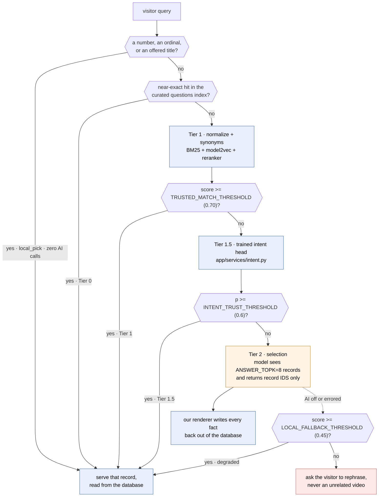

Caption to write under it: blue is local and costs nothing, orange is the one paid call, red is the refusal. The model in Tier 2 picks ids, it never writes a fact.

Note the deliberate exception to failure 2 below. Five "yes" edges land on one `SERVE` node, which is fan-in. The alternative, five separate terminal boxes, repeats the same box five times and reads worse. That is why every one of those edges carries the tier that took it: the label is what keeps the fan-in traceable. Rendered and checked, the lines stay followable.

### Decision and its contingencies (research doc, Decision section)

The navigational diagram at the top of `docs/features/<slug>/RESEARCH.md`. Keep it shallow: the pick, the gates it hangs on, and where each failed gate lands. Two chained gates is the practical ceiling. A third makes the reader trace a path instead of seeing one.

Gates are hexagons. Every gate edge is labelled with the answer that takes it, because an unlabelled branch out of a gate is unreadable. Name the fallback instead of pointing at "the alternative". A reader who only looks at this diagram should learn what ships if the gate fails.

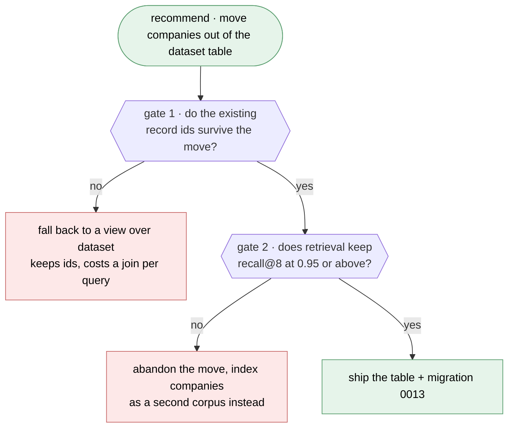

When the recommendation is a policy split rather than a gated bet, the same three ranks carry it. The pick, the axis it splits on, and what each branch gets:

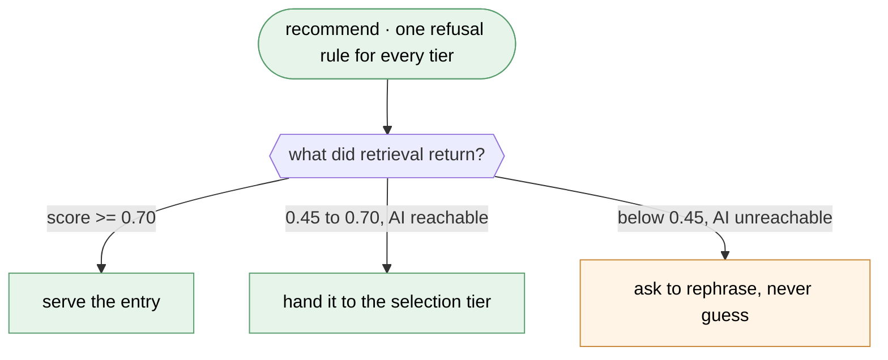

### Subsystem architecture (spec flow section, ARCHITECTURE.md)

Layers as subgraphs, one edge per relationship, the protocol or the guarantee on the edge label. Dashed means proposed.

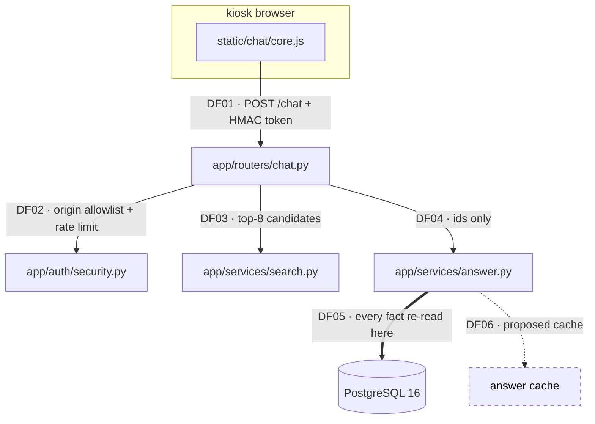

### Summary and detail pair (any diagram past about 15 nodes)

The summary carries the shape, the detail is for whoever needs it. Collapsed nodes list their contents, and the mapping table is what stops the summary from being a lie by omission. Summary flow IDs take an `S` prefix so the two sets never collide.

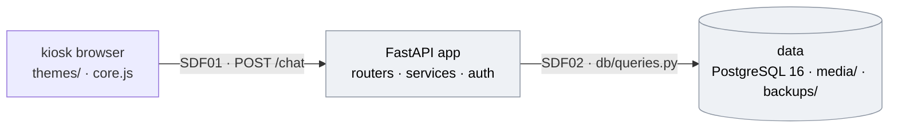

| Summary node | Collapses                                                    | Detail flows |
| ------------ | ------------------------------------------------------------ | ------------ |
| `APP`        | `routers/chat.py`, `services/search.py`, `services/answer.py`, `auth/security.py` | DF01 to DF06 |
| `DATA`       | PostgreSQL, uploaded media, backup dumps                     | DF07 to DF09 |

The detail diagram is omitted here for space, so those ID ranges stand in for it. In a real pair, every ID in that column exists in the detail diagram beside it. A range pointing at nothing is exactly the omission the table is supposed to prevent.

Grey is the collapsed-node convention. It reads as "there is more behind this" rather than as a category.

### Ordering across participants (a protocol, a retry, a failover)

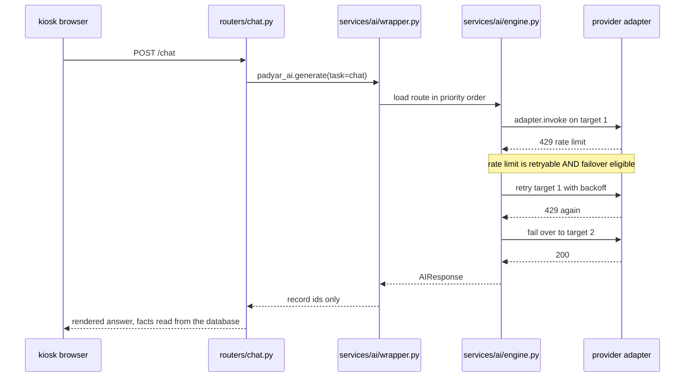

### Lifecycle (a status column)

Real example: `company_leads.status` in `app/services/leads.py`. Three statuses, not six, because the review outcome is a different axis and lives on `dataset_edits.status`.

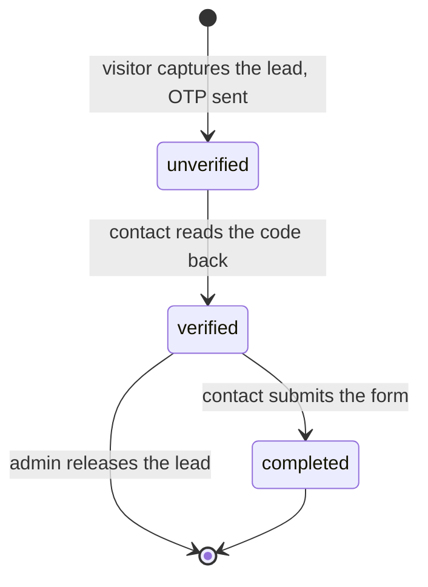

`verified` is a normal resting state, not an error. Plenty of contacts never open the link. Say that in the caption, or the diagram implies a stuck state.

### Schema change (a spec that adds or reshapes tables)

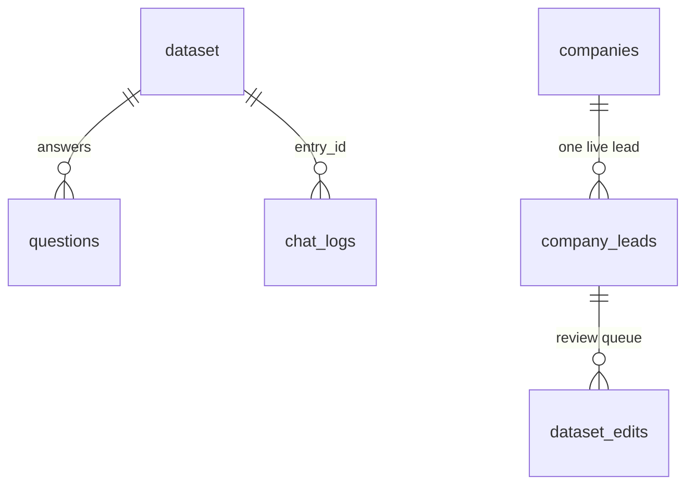

Keep it to keys and relationships. A column list gets long fast and a table reads better for that.

### Ranking candidates (research doc, alternatives)

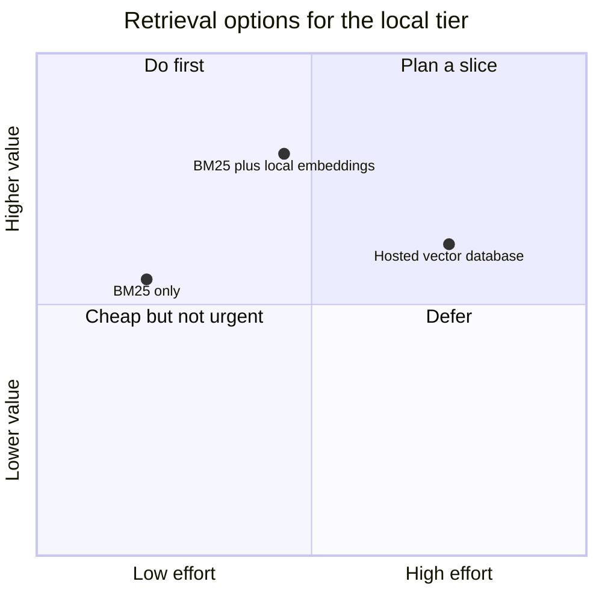

### Task dependency graph (a plan under docs/superpowers/plans/)

Show what stacks and what lands on its own. Label the edge with **why** it blocks.

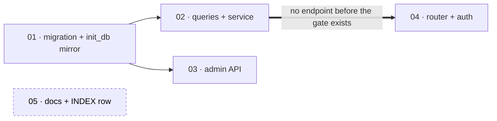

A schema change always starts the chain here, because a migration and its `init_db()` mirror have to land before anything reads the column.

### Deploy and rollback

Six steps, and the order is the safety. See `deploy/padyar-deploy.sh`.

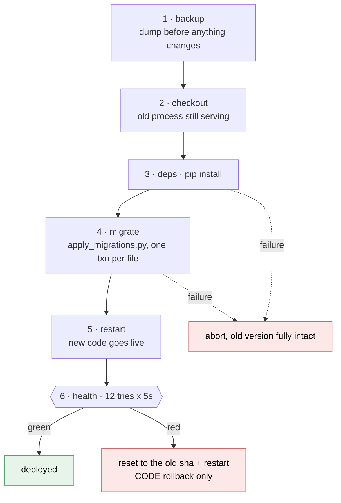

Caption it: step 6 rolls back **code**, not data. Restoring the step-1 backup is a manual, confirmed action from Infrastructure -> Backups.

### Symptom, cause, outcome (a user-facing framing)

Three ranks, colour-coded, no subgraphs (see failure 1).

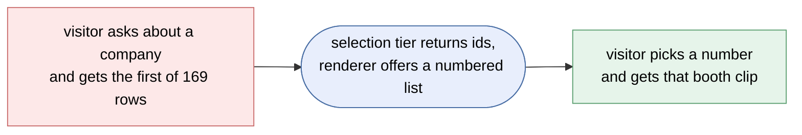
