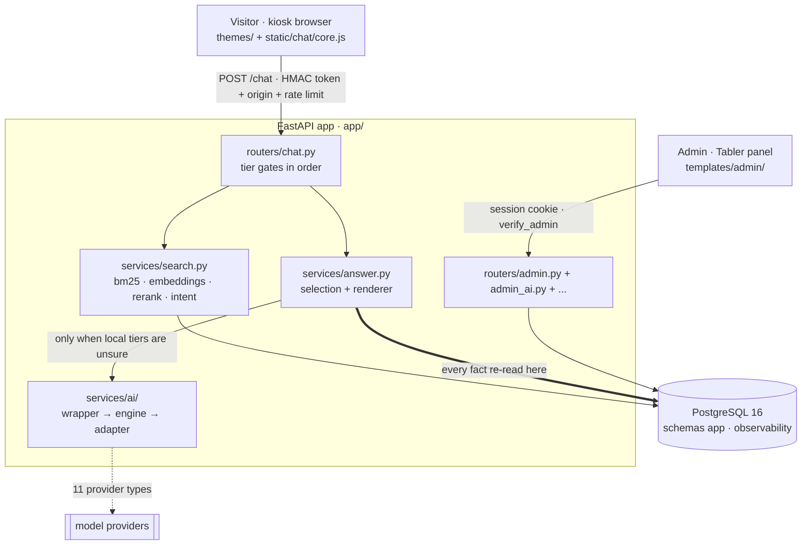

# PadyarAIChatbot diagram vocabulary

Canonical names, shapes, and starting points. Use these so a diagram of the answer pipeline and a diagram of the AI control plane compose into one picture of the product instead of two artists' impressions of it.

Paths are starting points for **reading before drawing** (SKILL.md step 3), not a substitute for it. Line numbers were checked on 2026-09-18 and they drift. Verify before you cite.

## Shapes

| Element                        | Shape                                 | Example                                              |
| ------------------------------ | ------------------------------------- | ---------------------------------------------------- |
| Router, endpoint               | rectangle                             | `CHAT["POST /chat<br/>app/routers/chat.py"]`         |
| Service, function              | rectangle                             | `SEL["select_records()<br/>app/services/answer.py"]` |
| Datastore                      | cylinder `[( )]`                      | `PG[("PostgreSQL 16<br/>schemas app · observability")]` |
| Threshold gate, decision       | hexagon `{{ }}`                       | `G1{{"score >= TRUSTED_MATCH_THRESHOLD (0.70)?"}}`   |
| Tier, phase, grouping node     | stadium `([ ])`                       | `T1(["Tier 1 · local retrieval"])`                   |
| External service or other doc  | subroutine `[[ ]]`                    | `TTS[["Chatterbox · 127.0.0.1:8003"]]`               |
| Proposed, not built yet        | any shape plus dashed                 | `classDef proposed stroke-dasharray: 5 5,color:#000` |
| Async or out-of-band edge      | dotted `-.->`                         | background reindex, scheduled backup, SMS delivery poll |
| Load-bearing dependency        | thick `==>`                           | the edge whose removal breaks the design             |

## Decision states

A research doc's decision diagram encodes an outcome per node, so the encoding must mean the same thing in every doc. Copy these three `classDef` lines instead of picking fills per document. A reader who has seen one decision diagram should not have to re-learn the legend.

```
classDef chosen   fill:#e6f4ea,stroke:#5a9e6f,color:#000
classDef fallback fill:#fde8e8,stroke:#c86a6a,color:#000
classDef forced   fill:#fff4e5,stroke:#c98a3a,color:#000
```

| Class      | Means                                                                                     |
| ---------- | ------------------------------------------------------------------------------------------ |
| `chosen`   | what ships if everything holds                                                            |
| `fallback` | where a failed gate lands, a worse outcome we have accepted                                |
| `forced`   | a branch an external constraint takes out of our hands (a provider refuses, a platform limit) |

`color:#000` is on every line for a reason. See failure 5 in `mermaid-recipes.md`. A pale fill without it disappears in GitHub's dark theme.

Still caption the diagram. A colour legend that only lives in this file is a legend the reader does not have.

## Naming rules

Get these right and diagrams stop contradicting the docs.

- **PostgreSQL 16 is the production database.** Schemas `app` and `observability`. SQLite is the **test backend** and a rollback artifact only. A diagram that shows SQLite as the product's database is wrong.
- **Module**, not "plugin" or "feature flag". A module is a row in `MODULES` in `app/modules/registry.py`, either core (`is_core=True`, always loaded) or optional (loaded per install through `ENABLED_MODULES`).
- **Router** for `app/routers/*.py`, **service** for `app/services/*.py`. Not "controller", not "repository".
- **Tier** for a stage of the answer pipeline, and name it with the string the code actually logs in `source`. The real values, from `app/routers/chat.py`: `local_pick`, `local_booth`, `local_company_search`, `local_company_field`, `local_guide`, `local_facet_overview`, `local_affirm`, `local_decline`, `local_gibberish`, `ai_selected`, `ai_options`, `ai_converse`, `openai` (the legacy tier), `refuse`, `no_answer`. Invented tier names make a diagram unverifiable.
- **Padyar AI Wrapper** for `app/services/ai/`. Business code calls `padyar_ai.generate()` or `padyar_ai.classify()`. No module outside `app/services/ai/` imports a vendor SDK. A diagram showing a router calling OpenAI directly is drawing a rule violation.
- **Adapter** for a provider client under `app/services/ai/adapters/`. There are 11 provider types behind one wrapper.
- **Theme** for a directory under `themes/`. Partials in `themes/<name>/partials/` override `themes/base/partials/`.
- **Visitor** is the person at the kiosk. **Admin** is the operator in the panel. They never share a credential and never share a door.
- **Kiosk is the threat model.** If a diagram shows visitor state that survives between two people at the same booth browser, label it, because that is the default bug in this product.

## Subsystems: where to start reading

### Tiered answer pipeline

The most-drawn subsystem. **`CLAUDE.md` carries an authoritative ASCII version.** Read it first. A Mermaid diagram that disagrees with it is wrong, or CLAUDE.md is stale and you fix both.

| Piece                  | Path                                                              |
| ---------------------- | ----------------------------------------------------------------- |
| Every tier gate        | `app/routers/chat.py` (about 1400 lines, the gates are in order)  |
| Thresholds             | `app/config.py` lines 41, 46, 47 and 219                          |
| Selection tier         | `app/services/answer.py`: `select_records()`, `render_options()` |
| Pick tier              | `app/services/answer.py`: `resolve_pick()`, `resolve_more()`     |
| Grounding firewalls    | `app/services/answer.py`: `frame_is_grounded()`, `generated_prose_is_grounded()` |
| Retrieval orchestration | `app/services/search.py`: `find_best_match()`, `find_top_matches()` |
| Lexical retriever      | `app/services/bm25.py`                                            |
| Local embeddings       | `app/services/embeddings.py` (model2vec, no external API)         |
| Intent head            | `app/services/intent.py`: trained on every reindex               |
| Reranker               | `app/services/rerank.py`                                          |
| Refusal wording        | `app/services/scope.py`                                           |

Named thresholds, current values:

| Constant                       | Value | What it gates                                        |
| ------------------------------ | ----- | ---------------------------------------------------- |
| `TRUSTED_MATCH_THRESHOLD`      | 0.70  | at or above this a local match is served outright    |
| `INTENT_TRUST_THRESHOLD`       | 0.6   | the trained intent classifier's confidence floor     |
| `LOCAL_FALLBACK_THRESHOLD`     | 0.45  | lowest local score answered when the AI tier is down |
| `QUESTIONS_FALLBACK_THRESHOLD` | 0.60  | same floor for the questions index                   |
| `ANSWER_TOPK`                  | 8     | records shown to the selection tier                  |
| `OPTIONS_MAX`                  | 5     | most records offered as a numbered choice on a turn  |
| `HISTORY_TURNS`                | 5     | prior turns handed to the model                      |

Two facts a pipeline diagram must not get wrong. The model **chooses record ids, it does not write facts**: every fact-bearing string is re-read from the database by the renderer in `app/services/answer.py`. And the cheap local tiers run **first**, so a diagram that puts the model at the front is drawing a different product.

### Module system

| Piece               | Path                                                    |
| ------------------- | ------------------------------------------------------- |
| Module catalogue    | `app/modules/registry.py`: `MODULES`                   |
| Enablement logic    | `app/modules/registry.py`: `resolve_enabled_modules()`, `module_enabled()` |
| Conditional loading | `app/modules/registry.py:161`: `load_module_routers()`, called from `app/main.py` lifespan |

Core modules (always loaded): `chat`, `admin`, `search`, `dataset`, `theme`, `conversations`. Optional modules (per install): `voice`, `video`, `infra`, `backups`, `ops`, `logs`, `tts`, `registration`, `leads`. An empty `ENABLED_MODULES` loads **all** optional modules, which is the full-featured install. A diagram showing empty as "nothing loads" is backwards.

The module list is a table in CLAUDE.md and it reads well as a table. Draw the module system only when the point is the **loading mechanism**, not the inventory.

### AI provider control plane

| Piece               | Path                                                          |
| ------------------- | ------------------------------------------------------------- |
| The one public API  | `app/services/ai/wrapper.py`: `padyar_ai.generate()` / `.classify()` |
| Routing engine      | `app/services/ai/engine.py`: task, ordered targets, retry, failover |
| Circuit breaker     | `app/services/ai/circuit.py`                                  |
| Error taxonomy      | `app/services/ai/errors.py`: carries `retryable` and `failover_eligible` separately |
| Provider clients    | `app/services/ai/adapters/`: openai, anthropic, gemini, zai, kimi, deepseek, qwen, xai, mistral, sakoo, openai_compatible |
| Model catalogue     | `app/services/ai/catalog.py`, pricing in `pricing.py`         |
| Persistence         | `app/services/ai/store.py`                                    |
| Admin API           | `app/routers/admin_ai.py` (Admin -> AI -> Routing)            |

The flow, from the docstring in `engine.py`: task, then load the route in priority order, then an eligibility check (route enabled, target enabled, provider enabled, provider configured, circuit permits, kill switch off), then `adapter.invoke`. Success records and returns. Failure retries the **same** target while the error is retryable, then fails over to the next target only if the error is `failover_eligible`. Exhausted means `AIError(all_routes_failed)`.

Do not draw `retryable` and `failover_eligible` as one thing. They are deliberately separate: an auth failure fails over but never retries, a context-limit error does neither, and `invalid_request` never fails over because cycling would turn one visible error into nine invisible ones.

Speech-to-text (Whisper) sits **outside** the wrapper: `app/routers/voice.py` and `app/services/ai/stt.py`.

### Auth and the kiosk session model

| Piece                    | Path                                                            |
| ------------------------ | --------------------------------------------------------------- |
| Admin session gate       | `app/auth/security.py:616`: `verify_admin()`                   |
| Chat token               | `app/auth/security.py`: `generate_chat_token()`, `validate_chat_token()` |
| Origin allowlist         | `app/auth/security.py`: `validate_request_origin()`            |
| Rate limiting            | `app/auth/security.py`: `check_rate_limit()`, `check_rate_limits()` |
| Brute-force counters     | `app/auth/security.py`: `login_block_active()`, `record_failed_login()`, `login_attempts` table |
| Secrets at rest          | `app/services/secure_store.py`: Fernet `enc:` tokens           |
| Visitor OTP              | `app/services/otp.py`, `app/routers/otp.py`                     |
| Leads' three doors       | `app/services/leads.py`, `app/routers/leads.py`                 |

Every admin endpoint authenticates and authorizes **independently**. A diagram showing one gate covering a group of endpoints is drawing a constitution violation unless that gate is a real `dependencies=[Depends(verify_admin)]` on the router.

A visitor-facing chat diagram needs all three of the chat trio: HMAC token, origin check, per-IP rate limit. Drawing one of the three and calling it "auth" understates the design.

The leads module has three doors with **no shared credential**: `/v/{code}` for a field visitor, `/edit/{token}` for a company contact holding a one-time invite, and the admin queue. Never merge them into one box.

### Database layer

| Piece                 | Path                                                     |
| --------------------- | -------------------------------------------------------- |
| Connection routing    | `app/db/connection.py`: `get_db_connection()`           |
| SQLite test schema    | `app/db/connection.py`: `init_db()`, `_create_sqlite_schema()` |
| Queries and mutations | `app/db/queries.py`                                      |
| Migrations            | `migrations/NNNN_name.sql`, applied by `scripts/apply_migrations.py` |
| PostgreSQL primitives | `app/services/pg_backup.py`, `app/services/pg_admin.py`  |

A schema change touches **two** places: a new numbered file in `migrations/` for PostgreSQL, and a mirror edit in `init_db()` for the SQLite test backend. An `erDiagram` of a proposed table should say which of the two already exists.

`apply_migrations.py` stores a sha256 of every file it applies. Editing an applied migration prints `REFUSING TO CONTINUE` and exits 2, which aborts the next deploy at step 4. There is no downgrade path. Rolling back means restoring a backup.

### Deploy pipeline

`deploy/padyar-deploy.sh`, about 200 lines, root-owned, called by the GitHub Actions job. It is also the rollback path: run it with an older sha and it walks the same steps.

Six steps, and **the order is the safety**:

| # | Step     | Why it sits there                                                             |
| - | -------- | ------------------------------------------------------------------------------ |
| 1 | backup   | the database is dumped before anything changes                                |
| 2 | checkout | new code lands, the **old** process keeps serving from files already imported |
| 3 | deps     | `pip install`. A failure aborts before any schema change or restart           |
| 4 | migrate  | `apply_migrations.py`, each file in its own transaction. A failure resets the worktree to the old commit while the old process still serves |
| 5 | restart  | only now does the new code go live                                            |
| 6 | health   | the liveness endpoint, 12 tries at 5s. Red means reset to the old commit and restart |

Step 6 is a **code** rollback, not a data rollback. Restoring the step-1 backup is a manual, explicitly confirmed action from Infrastructure -> Backups. A deploy diagram that draws an automatic database restore is wrong and dangerously so.

One deploy per install at a time: the script takes a lock, and a later run waits rather than losing.

### Themes and the chat UI

| Piece            | Path                                                           |
| ---------------- | --------------------------------------------------------------- |
| Theme discovery  | `app/services/themes.py`: `discover_themes()`, `get_active_theme()` |
| Render + cache   | `app/services/themes.py`: `render_theme_index()`, `_fingerprint()` |
| Default partials | `themes/base/partials/`: index, head, header, menu, messages, video, input, footer |
| Shipped themes   | `themes/inotex` (default), `liquid-glass`, `minimal`, `haj`. `base` is not selectable |
| Shared chat JS   | `static/chat/core.js`                                           |
| Shared layout CSS | `static/chat/base.css`                                         |
| Branding         | `app/services/branding.py`: `WL_DEFAULTS` is the single source of truth |

A theme overrides a partial by placing a file with the same name in its own `partials/`. Jinja2's loader resolves child first, then base. The active theme is a row in the `settings` table (`active_theme`).

## Platform skeleton

The backdrop most subsystem diagrams sit on. Take the layers you need and delete the rest. Every box below was checked against the repo.



Caption it. The thick edge is the grounding rule: the model chooses ids, the renderer reads the facts back out of the database.
