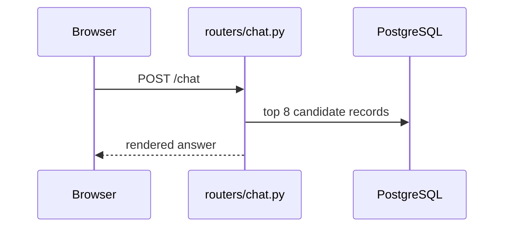

# Show me

Help the user understand the current topic visually. Skip the preamble and keep prose brief. Pick the smallest view that makes the key point clear.

**Scope:** the test is whether the visual lands in a git-tracked file.

If it does (a markdown file under `docs/features/`, `docs/superpowers/`, or `docs/engineering/`), it belongs to the `diagrams` skill. That one owns type choice, drawing from verified code, and the check-it-rendered step. Do not do that work here.

If it does not, it is this skill's work. Four surfaces qualify.

- **The conversation.** The default. A throwaway sketch answering the question in front of you.
- **A PR body.** GitHub renders `diff`, `text`, and `mermaid` blocks. See the `scoped-pr` and `gh-cli` skills.
- **A GitHub issue.** Same rendering as a PR body. This repo tracks work in GitHub Issues and PRs, plus `docs/features/<slug>/`.
- **A review comment.** Same rendering again. See the `code-review` skill.

Nothing here is committed. Raise the bar with the audience. A chat sketch can be rough. A PR body or an issue is read by people who were not in this conversation, so every label has to stand on its own.

**One product note.** The chat UI and the admin panel are Persian and RTL. A sketch of UI structure can use the real Persian strings, but keep the tree itself in ASCII. Mixing an RTL label into an ASCII tree usually breaks the alignment in a terminal.

## Pick a form

- Show logic or an algorithm as pseudocode:

```text
on(chat request)
  if the message resolves against the last turn's offered ids
    return that record            # local_pick, zero AI calls
  if retrieval score >= 0.70
    return the matched entry
  ask the model for record ids
  render the facts from the database
```

- Show runtime control flow as a call tree:

```text
POST /chat
  validate_chat_token
  validate_request_origin
  check_rate_limit
  resolve_pick                  # app/services/answer.py
  find_top_matches              # app/services/search.py
  select_records                # model returns ids only
    render_options              # facts re-read from the database
  log_chat
```

- Show UI structure as a partial or template tree, including the overrides that matter:

```text
themes/inotex/partials/         (overrides themes/base/partials/)
  index.html        -> base
  header.html       -> overridden
  menu.html         -> base
  messages.html     -> overridden
  input.html        -> overridden
  footer.html       -> overridden  (sets ChatConfig, then initChat())
```

- Show file responsibility or a broad refactor as a shallow file tree:

```text
app/
├── routers/    # parses the request, owns the tier gates
├── services/   # business logic
├── db/         # connection routing and queries
└── auth/       # tokens, rate limits, admin sessions
```

- Show component interaction or data flow with Mermaid:



- Use `diff` when the point is what changes and the surrounding shape already exists. Match the diff shape to the topic.

For a template change:

```diff
 themes/inotex/partials/
   header.html
+  chips.html          # new partial, included from messages.html
   messages.html
```

For a file-layout change:

```diff
 app/
 ├── routers/
+│   └── exports.py       # new router
 ├── services/
-└── services/pdf.py
+└── services/exports/
+    ├── build_html.py
+    └── render_pdf.py
```

For a call-tree change:

```diff
 POST /chat
   validate_chat_token
   resolve_pick
     find_top_matches
+    filter_by_module_enabled
     select_records
-  return answer
+  return answer
+    with the offer ids stored on the turn
```

For a state or control-flow change:

```diff
 on(save synonym)
-  DELETE WHERE source = ?
+  require a target parameter
+  DELETE WHERE source = ? AND target = ?
```

- Show the whole block when most of it is new, when leaving out context would hide ownership or order, or when the user needs a copyable target shape:

```python
def module_enabled(module_name: str, enabled_modules: list[str]) -> bool:
    module = MODULES.get(module_name)
    return bool(module) and (module.is_core or module_name in enabled_modules)
```

## The HTML artifact

For a visual UI, a layout, a state comparison, or a concept too dense for the forms above, write one focused HTML file. Make it a diagram, an infographic, or a short slide deck, whichever fits the point. Match the product's colours, type, spacing and components, use real labels and data, and support desktop and mobile. The product is RTL and Persian, so set `dir="rtl"` and use Vazirmatn when you are mocking a real screen.

Write it to `$TMPDIR`, never into the repo. A show-me artifact is throwaway and must not turn up in `git status`.

```bash
f="${TMPDIR:-/tmp}/show-me-<slug>.html"   # <slug> describes the topic
{ xdg-open "$f" || open "$f"; } >/dev/null 2>&1 || echo "$f"
```

The fallback matters. Some of this project's environments (a remote shell on the deploy host, a CI session) have neither `xdg-open` nor `open`, and the bare command fails there. On a miss the chain prints the absolute path, which the user can click.

## Guidance

Put each visual next to the short text it supports. Keep only the calls, files, partials, states and boundaries needed to answer the question in front of you.

**Default to the text forms.** Pseudocode, call trees, template trees, file trees and diffs are readable everywhere, including a plain terminal. A Mermaid block renders as a picture in the IDE and in web clients but arrives as raw source in the terminal. Reach for it only when the point genuinely needs a graph (a sequence, a state machine, a fan-out), not as the default.

You may use one of these, you may use several, you will rarely use all of them. Use your judgement and do not overwhelm the user.
