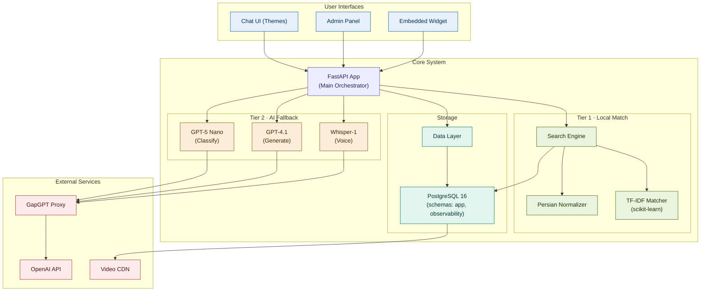

# PadyarAIChatbot

**PadyarAIChatbot** is a **CMS for AI video chatbots** — installed once per customer. Each customer deploys the app, enters their own content (Q&A dataset, videos, branding) and manages everything through a web admin panel. No multi-tenant SaaS, no shared database: one install, one customer, fully white-labeled.

The reference deployment is **INOTEX** (the international innovation & technology exhibition), but the app ships with nothing hard-coded — branding, content, theme and enabled features are all configured per install.

> **Product principle:** the app must be usable by anyone, from a child to an elderly person, with zero AI knowledge. Every screen is understandable in seconds; every action takes a few clicks. See [CLAUDE.md](CLAUDE.md) / [AGENTS.md](AGENTS.md) for the full design rules.

## 🚀 Features

- **Two-tier intelligence**
  - **Tier 1 — Local knowledge base:** matches the user's question against the customer's curated dataset using Persian text normalization, synonym expansion, TF-IDF vectorization and cosine similarity. Returns the best-matching video answer.
  - **Tier 2 — AI fallback:** when local confidence is low, GPT-5 Nano classifies intent; if it maps to a dataset entry that entry is returned, otherwise GPT-4.1 generates a free-text answer. All AI calls go through the GapGPT proxy.
- **Video answers** — every dataset entry can carry a video URL, played inline in the chat.
- **Voice input** *(optional module)* — transcribes voice messages to text via Whisper.
- **Visitor registration** *(optional module `registration`)* — phone verification by SMS one-time code (only a keyed HMAC of the code is stored, never the code itself), a profile form whose job / title / interest options are driven by a data file rather than code, and a targeted-visit planner that matches the visitor's profile to the event's own sections. Managed from two admin pages: SMS gateway + on/off switch, and a form-options editor with a raw-JSON mode.
- **White-label / branding** — app name, logo, primary/accent colors and welcome text (5 `whitelabel_*` settings), editable on the admin Settings → «برندینگ» page and injected into the chat page, admin sidebar and lead pages.
- **Pluggable chat themes** — WordPress-style partial templates; switch the active theme from the admin panel. Ships with `inotex` (active in this installation), `liquid-glass` and `minimal`.
- **Admin panel** (Tabler / Bootstrap 5 RTL) — dashboard with usage stats and low-confidence queries, dataset & questions CRUD, synonym management, video upload & library (in the dataset page), theme switching, white-label settings, AI-assistant settings, and scheduled database backups.
- **Import / export** — dataset and questions as JSON or CSV.
- **Database-backed backups** — PostgreSQL `pg_dump --format=custom` backups with SHA-256 verification, a safety backup before restore, maintenance mode during restore, and post-restore validation.
- **Modular architecture** — every feature is a module; optional modules are toggled per install via `ENABLED_MODULES`.
- **Security** — HMAC-signed chat tokens, origin validation, per-IP rate limiting, bcrypt admin password hashing (with legacy SHA-256 upgrade-on-login), brute-force lockout and sliding admin sessions.

## 🏗 Architecture

User interfaces talk to the FastAPI core orchestrator, which runs the two-tier pipeline: a request is first matched locally (Tier 1), and only falls back to an external model (Tier 2) when local confidence is low. **PostgreSQL 16 is the single source of truth.** Every external AI call exits through the **Padyar AI Wrapper**, which routes per task across configured providers with retry, failover and a shared circuit breaker — no business code talks to a vendor SDK.



| Tier | Layer | What it does |
| ---- | ----- | ------------ |
| 🔵 Blue | User interfaces | Themed public chat, Jinja2/Tabler admin panel, embeddable widget |
| 🟣 Purple | Core orchestrator | FastAPI app running the two-tier pipeline and routing every request |
| 🟢 Green | Tier 1 (local) | Persian normalization + synonym expansion + TF-IDF/cosine match (wins at confidence ≥ 0.20) |
| 🟠 Amber | Tier 2 (AI fallback) | GPT-5 Nano classifies intent, GPT-4.1 generates free text, Whisper-1 transcribes voice |
| 🟦 Teal | Storage | PostgreSQL 16 — single source of truth for dataset, questions, settings, logs |
| 🔴 Red | External services | AI calls exit via the GapGPT proxy to the OpenAI API; videos served from the CDN |

## 🛠 Tech Stack

| Layer            | Technology                                                     |
| ---------------- | -------------------------------------------------------------- |
| Language         | Python 3.10+                                                   |
| Web framework    | FastAPI + Uvicorn (gunicorn for multi-worker production)        |
| Template engine  | Jinja2 (admin panel + chat themes)                             |
| Frontend (chat)  | Vanilla HTML/CSS/JS — no framework                             |
| Frontend (admin) | Tabler / Bootstrap 5 RTL + Chart.js                           |
| Database         | PostgreSQL 16 (schemas `app`, `observability`); SQLite for tests/rollback |
| ML / search      | scikit-learn (TF-IDF + cosine similarity)                     |
| AI provider      | OpenAI via GapGPT proxy (`https://api.gapgpt.app/v1`)         |
| AI models        | GPT-5 Nano (classification), GPT-4.1 (chat), Whisper-1 (voice) |
| Font             | Vazirmatn (Persian web font)                                  |

## 📦 Installation

### Quick install (recommended)

```bash
git clone <repository_url>
cd PadyarAIChatbot
chmod +x setup.sh
./setup.sh
```

The interactive installer checks prerequisites (Python 3.10+, pip, venv), collects your API key, creates a virtual environment, installs dependencies, writes `.env`, and initializes the database.

### Manual install

```bash
git clone <repository_url>
cd PadyarAIChatbot

python3 -m venv .venv
source .venv/bin/activate

pip install -r requirements.txt

cp .env.example .env
# Edit .env and set your OPENAI_API_KEY

python main.py
```

The server starts at `http://127.0.0.1:8000`.

On first run, apply the database migrations and start the app:

```bash
python scripts/apply_migrations.py   # idempotent — creates/updates all tables
python main.py
```

A default admin account is seeded automatically. If you don't supply admin credentials via env vars, a random password is generated and written to `ADMIN_CREDENTIALS.txt` — log in, change it in the panel, then delete that file.

> **Docker:** `docker compose up` runs PostgreSQL 16 and the app together, applies migrations on boot, and needs no local database install.

## 🔧 Configuration

All configuration lives in `app/config.py`, with secrets and overrides supplied through `.env` (see `.env.example`).

| Variable          | Required | Default                | Description                                              |
| ----------------- | -------- | ---------------------- | -------------------------------------------------------- |
| `OPENAI_API_KEY`  | ✅ Yes   | —                      | API key for all AI operations (via the GapGPT proxy)     |
| `VIDEO_BASE_URL`  | No       | `/media/videos`        | Base URL for serving video files                         |
| `ENABLED_MODULES` | No       | *(all enabled)*        | Comma-separated optional modules to enable               |
| `ADMIN_USERNAME`  | No       | `inotex@admin`   | Seeded admin username (first run only)                   |
| `ADMIN_PASSWORD`  | No       | *(random)*             | Seeded admin password (first run only)                   |
| `DB_BACKEND`      | No       | `postgres`             | `postgres` (production) or `sqlite` (tests/rollback)     |
| `DATABASE_URL`    | No       | *(local dev DSN)*      | PostgreSQL connection string                              |

Branding, the active theme, AI toggles and backup schedule are **not** env vars — they live in the database and are edited from the admin panel.

### Modules

Every feature is a module. **Core modules** always load. **Optional modules** are toggled per install via `ENABLED_MODULES` (empty = all optional modules enabled).

| Module    | Type        | Description                                  |
| --------- | ----------- | -------------------------------------------- |
| `chat`    | 🔒 Core      | Chatbot engine (TF-IDF + GPT fallback)       |
| `admin`   | 🔒 Core      | Admin dashboard and API                      |
| `search`  | 🔒 Core      | Synonym management API                       |
| `dataset` | 🔒 Core      | Dataset and questions CRUD                   |
| `theme`   | 🔒 Core      | Theme management and switching               |
| `voice`   | ⚡ Optional  | Voice input via Whisper (`/api/transcribe`)  |
| `video`   | ⚡ Optional  | Video upload and serving                     |

```bash
ENABLED_MODULES=            # all optional modules (default)
ENABLED_MODULES=voice       # voice only
ENABLED_MODULES=voice,video # both optional modules
```

Re-run `./setup.sh` to reconfigure at any time.

## ▶️ Usage

```bash
source .venv/bin/activate
python main.py
```

- **Chat interface:** `http://127.0.0.1:8000/`
- **Admin panel:** `http://127.0.0.1:8000/secure-panel-inotex`
- **Health check:** `http://127.0.0.1:8000/api/health`

## 📂 Project Structure

```
PadyarAIChatbot/
├── main.py                     # Entry point — uvicorn runner
├── setup.sh                    # Interactive installer
├── migrate.sh                  # Move an existing install to a new host
├── backup_db.py                # SQLite backup primitives (app + standalone CLI)
├── requirements.txt            # Runtime dependencies
├── requirements-dev.txt        # Test-only deps (pytest, Playwright)
├── .env / .env.example         # Environment config
│
├── app/                        # Application package
│   ├── main.py                 # FastAPI app factory, lifespan, middleware
│   ├── config.py               # All env vars, paths, module config
│   ├── models.py               # Pydantic request/response schemas
│   ├── routers/                # public, chat, admin, voice, synonyms,
│   │                           #   dataset, media, themes
│   ├── services/               # search, openai, themes, media, backup
│   ├── db/                     # connection (schema + init_db), queries
│   ├── auth/                   # security (tokens, rate limit, admin auth)
│   ├── utils/                  # normalizer (Persian text + synonyms)
│   └── modules/                # registry (module defs + conditional loading)
│
├── templates/admin/            # Jinja2 admin panel (Tabler / Bootstrap 5 RTL)
│   ├── base.html, layout.html, login.html, dashboard.html
│   ├── dataset.html, questions.html, synonyms.html, themes.html
│   └── settings_account.html, settings_ai.html, settings_backup.html
│
├── static/                     # chat/ (core.js, base.css), admin/ css+js, vendor/
│
├── themes/                     # Pluggable chat UI themes (WordPress-style partials)
│   ├── base/                   # Default partials all themes inherit
│   ├── liquid-glass/           # Default theme (frosted glass)
│   └── minimal/                # Minimal clean theme
│
├── data/Videos/                # Source video files
├── media/                      # Runtime media storage (videos/, uploads/) — gitignored
├── backups/                    # Generated DB backups — gitignored
├── migrations/                 # Versioned PostgreSQL schema (apply_migrations.py)
├── docs/                       # Project knowledge base
├── scripts/                    # change-admin, debug_similarity, net_diag, *_test
└── tests/                      # pytest suite (unit + integration + e2e)
```

> **Content lives in the database, not in files.** The dataset and questions are stored in PostgreSQL only — the DB is the single source of truth. `media/videos/` holds video files; there are no `dataset.json` / `questions.json` data files to keep in sync. Use the admin panel (or its JSON/CSV import) to manage content.

## 🗄 Database

PostgreSQL 16 (schemas `app` + `observability`). The schema is owned by the versioned files in `migrations/` and applied by `scripts/apply_migrations.py` (idempotent, checksum-guarded). SQLite remains only as the test-suite backend and the rollback path (`DB_BACKEND=sqlite`).

| Table            | Purpose                                                    |
| ---------------- | --------------------------------------------------------- |
| `chat_logs`      | Every chat interaction with confidence, tokens, cost      |
| `settings`       | Key-value runtime settings (includes `whitelabel_*` keys) |
| `dataset`        | Knowledge base entries (id, title, text, video_url)       |
| `questions`      | Question → dataset mappings                                |
| `synonyms`       | Persian synonym mappings                                   |
| `admins`         | Admin credentials (bcrypt hash + salt, security question) |
| `admin_sessions` | Active admin sessions with sliding expiry                 |

## 🎨 White-Label & Themes

- **Branding** is stored in `settings` under exactly 5 `whitelabel_*` keys (app name, logo URL, primary/accent colors, welcome text). Defaults live in Python (`app/services/branding.py`), not the DB. The chat render receives pre-escaped values plus `--wl-primary`/`--wl-accent` custom properties and a `window.PADYAR_BRAND` JS override; the admin sidebar and the `/v` lead pages read the same keys. Editable from Settings → «برندینگ».
- **Chat themes** use a WordPress-style partial system: `themes/base/` provides default partials; each theme overrides only the partials it needs. Drop a new folder under `themes/` with a `theme.json` and it's auto-discovered at startup. The active theme is stored in `settings` and switched from the admin panel.

## 💾 Backups

`backup_db.py` provides WAL-safe online backups via SQLite's backup API. The admin panel can take a backup on demand, schedule automatic backups (interval + time of day, stored in `settings`), and restore from a backup (which first snapshots the current DB so a bad restore can be undone). Multi-worker safe: under gunicorn, workers atomically claim each due slot so only one backup runs.

```bash
python backup_db.py   # take one backup now + prune old ones
```

## 🔐 Admin Access

- **Default username:** `inotex@admin` (override with `ADMIN_USERNAME`).
- **First run:** a salt + bcrypt hash are generated; if no password is supplied via env, a random one is written to `ADMIN_CREDENTIALS.txt`.
- **Change password:** run `python scripts/change-admin.py`, or use the **Settings → Account** page in the admin panel.

## 📡 API Overview

### Public

| Method | Endpoint            | Description                                |
| ------ | ------------------- | ------------------------------------------ |
| `GET`  | `/`                 | Chat interface (active theme, HTML)        |
| `POST` | `/chat`             | Process a user message (token + origin + rate-limit guarded) |
| `GET`  | `/api/dataset`      | Dataset entries (for suggested questions)  |
| `GET`  | `/api/questions`    | Question mappings                          |
| `GET`  | `/api/health`       | Health check + module status               |
| `GET`  | `/api/voice-status` | Voice module availability                  |
| `POST` | `/api/transcribe`   | Audio → text (voice module)                |

### Admin (cookie-session protected, under `/admin/api` and `/secure-panel-inotex`)

Login/logout, usage stats, low-confidence queries, CSV export, dataset & questions CRUD + JSON/CSV import-export, synonym CRUD, video upload/list/delete, theme listing/activation, white-label & AI settings, backup create/list/restore/schedule, and password / security-question changes.

## 🧪 Testing

The project uses **pytest**. Test-only dependencies live in `requirements-dev.txt` (kept out of `requirements.txt` so customer installs stay lean):

```bash
.venv/bin/python -m pip install -r requirements-dev.txt
.venv/bin/python -m playwright install chromium   # only for browser e2e tests
.venv/bin/python -m pytest
```

Tests live under `tests/` (config in `pytest.ini`, asyncio auto-mode): unit tests for services/utils/auth, integration tests via FastAPI's `TestClient`, and browser e2e tests under `tests/e2e/`.

Before every commit:

```bash
python -m py_compile app/main.py app/routers/chat.py
.venv/bin/python -m pytest
```

### CI/CD

`.github/workflows/ci.yml` runs on every PR and push: `test`, `evaluation`, `dependency-audit` and `secret-scan` execute on GitHub-hosted `ubuntu-latest` runners (free while the repo is public). Merges to `main` additionally run `deploy` on the self-hosted `padyar` runner on the production server, gated by the `production` environment's reviewer approval.

## 🤝 Contributing

1. Branch off the repo's main branch.
2. Keep each PR scoped to one root cause.
3. Follow [Conventional Commits](https://www.conventionalcommits.org/).
4. Run `py_compile` + the pytest suite before committing.
5. Open a pull request.

---

_Built by Kohan System._
