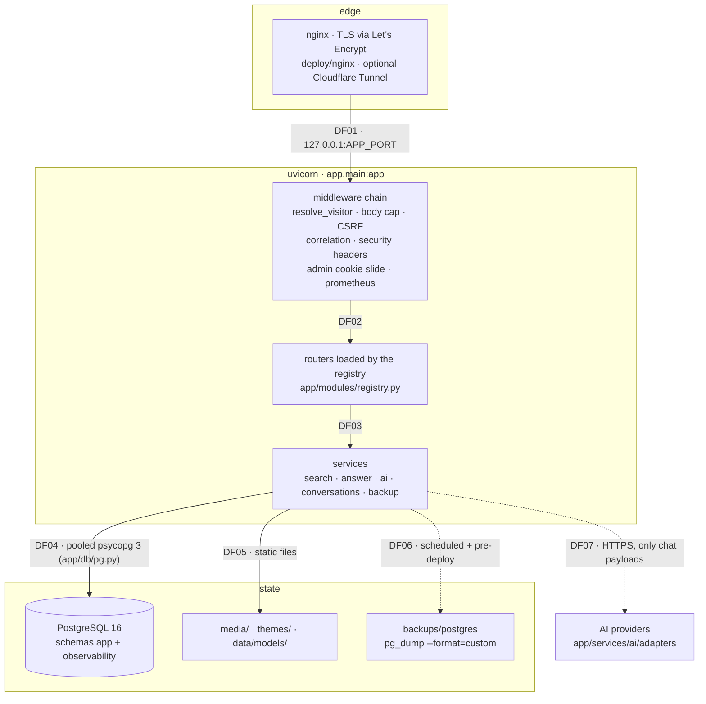
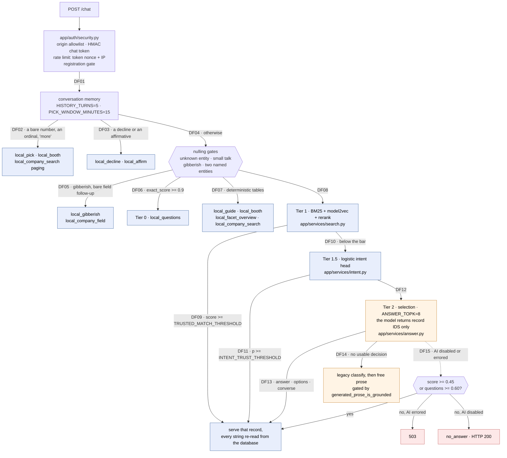
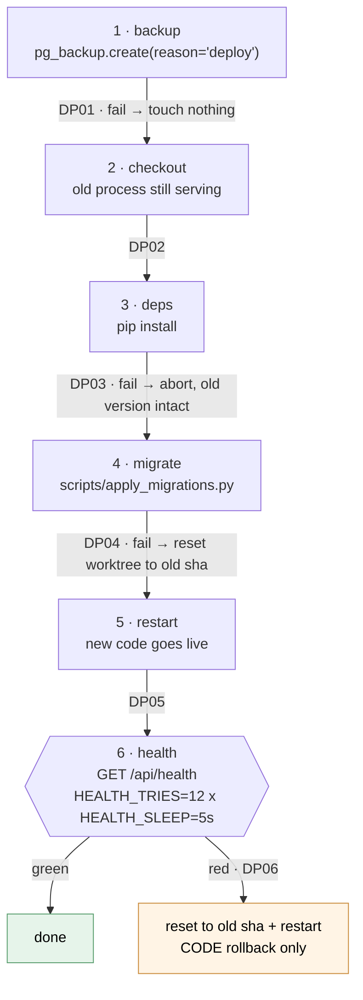

# معماری سامانه PadyarAIChatbot

تاریخ: 2026-09-19

این سند وضعیت کد را در همین تاریخ توصیف می‌کند. هر ادعا از روی کد بررسی شده و
مسیر فایلِ پشتوانه‌اش کنارش آمده است. چیزی که هنوز ساخته نشده در بخش ۱۴ به‌صراحت
فهرست شده، نه اینکه ناگفته بماند.

نام‌های Latin (مسیر فایل، نام تابع، نام ثابت، نام جدول) دقیقاً همان چیزی هستند که
در کد نوشته شده‌اند و ترجمه نشده‌اند.

---

## 1. محصول در یک نگاه

PadyarAIChatbot یک **CMS برای چت‌بات‌های هوش مصنوعی** است که **به‌ازای هر مشتری یک
نصب جداگانه** دارد. چند‌مستاجری (multi-tenant) نیست: هر مشتری نسخهٔ خودش را با
دیتابیس خودش، محتوای خودش و برند خودش اجرا می‌کند.

| لایه | چیست |
|---|---|
| زبان | Python 3.10+ |
| وب | FastAPI + Uvicorn. نقطهٔ ورود `main.py`، کارخانهٔ اپ `app/main.py` |
| پنل ادمین | Jinja2 + Tabler UI (Bootstrap 5 RTL) |
| رابط چت | HTML/CSS/JS ساده، بدون فریم‌ورک (`static/chat/core.js`، `static/chat/base.css`) |
| دیتابیس | PostgreSQL 16 در production. SQLite فقط backend تست و مسیر rollback است |
| بازیابی | BM25 خالص‌پایتون + امبدینگ محلی model2vec + بازرتبه‌بند ویژگی‌محور |
| scikit-learn | فقط برای هد logistic regression طبقه‌بند intent |
| ارائهٔ مدل | کنترل‌پلین AI داخلی (`app/services/ai/`) با ۱۱ نوع provider |
| اجرا در production | یک unit از systemd، uvicorn با `WEB_CONCURRENCY` worker، پشت nginx |

هیچ TypeScript، React، Next.js یا monorepo در این ریپازیتوری وجود ندارد.

---

## 2. لایه‌های اجرا



نکته: تنها چیزی که از این ماشین بیرون می‌رود پیام‌های چت است که به provider فرستاده
می‌شود (`app/services/providers.py`، `classify_data_policy`). تنظیمات، اعتبارنامهٔ
ادمین و لاگ‌ها هرگز از میزبان خارج نمی‌شوند.

---

## 3. خط لولهٔ پاسخ‌گویی

کد این مسیر در `app/routers/chat.py` است و آستانه‌ها در `app/config.py`. خط لوله یک
زنجیرهٔ `return` زودهنگام است: **هر tier که پاسخ بدهد، همان‌جا تمام می‌شود.**

اصل حاکم بر کل مسیر: **مدل انتخاب می‌کند، ما می‌نویسیم.** هیچ tier ای اجازه ندارد
رشتهٔ واقعیت (نام، شماره، تاریخ، غرفه) را از مدل بگیرد و به بازدیدکننده نشان دهد؛ آن
رشته‌ها همیشه از دیتابیس خوانده می‌شوند.

### 3.1 نمودار خلاصه



آبی = محلی و بدون هیچ فراخوانی شبکه. نارنجی = تنها جایی که به provider پول داده
می‌شود. قرمز = اعلام صادقانهٔ ناتوانی. جعبه‌های آبی هر کدام خودشان پاسخ می‌دهند و
خط لوله همان‌جا تمام می‌شود. نمودار خلاصه است؛ ترتیب کامل در جدول زیر آمده.

### 3.2 ترتیب کامل tierها

ستون `source` دقیقاً همان رشته‌ای است که در `chat_logs.source`، در لاگ ساختاریافته و
در برچسب `tier` متریک `chat_tier_served_total` می‌نشیند.

| # | tier (`source`) | شرط ورود | فراخوانی AI | confidence |
|---|---|---|---|---|
| 1 | `local_booth` | پیام فقط رقم است و هیچ فهرستی روی میز نیست؛ شمارهٔ غرفه تطبیق دقیق می‌خورد | خیر | 0.95 |
| 2 | `local_pick` | یک عدد، یک واژهٔ ترتیبی، یا عنوانِ پیشنهادشده، در برابر idهای turn قبلی | خیر | 0.9 |
| 3 | `local_company_search` (صفحه‌بندی) | «بیشتر» روی فهرست باز | خیر | 0.9 |
| 4 | `local_decline` | کل پیام یکی از `NEGATE_WORDS` است | خیر | 0.9 |
| 5 | `local_affirm` | کل پیام یکی از `AFFIRM_WORDS` است و پیشنهاد یا فهرستی در حافظه هست | خیر | 0.9 |
| 6 | `local_company_field` (دنباله‌رو) | پرسش فیلدیِ برهنه، روی شرکتی که turn قبل مطرح شد | خیر | 0.85 |
| 7 | `local_gibberish` | پیام کوتاه، ناشناخته و غیرقابل‌تلفظ | خیر | 0.9 |
| 8 | `local_questions` (Tier 0) | `exact_score >= 0.9` روی ایندکس پرسش‌های دست‌چین (Jaccard) | خیر | `exact_score` |
| 9 | `local_guide` | کلاس کلیدواژه‌ایِ راهنما (ساعت، درب، مترو، رستوران، خبر) | خیر | 0.9 |
| 10 | `local_booth` | «غرفه ۳۷۷» (تطبیق دقیق روی ستون `booth_number`) | خیر | 0.95 |
| 11 | `local_facet_overview` | پرسش دربارهٔ مجموعهٔ حوزه‌ها، نه یک حوزهٔ مشخص | خیر | 0.9 |
| 12 | `local_company_search` | پرسش فهرستی («شرکت‌های سالن ۶»)، مستقیم از جدول `companies` | خیر | 0.9 |
| 13 | `local` / `local_questions` (Tier 1) | `score >= TRUSTED_MATCH_THRESHOLD` روی بازیابی هیبریدی | خیر | نمرهٔ بازیابی |
| 14 | `local_entity` / `local_company_field` | لنگر موجودیتِ نام‌برده‌شده: بازنویسی یا نجات | خیر | `max(0.70, entity_coverage)` |
| 15 | `local_intent` (Tier 1.5) | `p >= INTENT_TRUST_THRESHOLD` روی طبقه‌بند آموزش‌دیدهٔ همین نصب | خیر | `p` |
| 16 | `ai_selected` (Tier 2) | مدل یک id از میان کاندیداها انتخاب کرد | بله | نمرهٔ همان کاندیدا |
| 17 | `ai_options` (Tier 2) | مدل ۲ تا `OPTIONS_MAX` id انتخاب کرد؛ فهرست شماره‌دار | بله | بالاترین نمرهٔ کاندیدا |
| 18 | `ai_converse` (Tier 2) | پیام دربارهٔ خودِ گفتگوست (سلام، احوال‌پرسی، پرسش دربارهٔ دستیار) | بله | 1.0 |
| 19 | `openai_classified` | مسیر قدیمی `classify_intent`، وقتی selection تصمیم قابل‌استفاده نداد | بله | نمرهٔ بازیابی |
| 20 | `openai` | نثر آزادِ مدل، **پس از** عبور از `generated_prose_is_grounded` | بله | نمرهٔ بازیابی |
| 21 | `refuse` | همان نثر، وقتی از فایروال grounding رد نشد | بله | نمرهٔ بازیابی |
| 22 | `local` / `local_questions` (fallback) | AI خاموش یا خطا داد، و `score >= 0.45` یا `q_score >= 0.60` | خیر | نمرهٔ بازیابی |
| 23 | `no_answer` | چیزی پیدا نشد. HTTP 200 با جملهٔ قابل‌تنظیم (`app/services/scope.py`) | خیر | نمرهٔ بازیابی |
| 24 | `system` → HTTP 503 | AI پرسیده شد و واقعاً در دسترس نبود، و هیچ تطبیق محلی قوی نبود | تلاش شد | ندارد |

سه «دروازهٔ صفرکننده» پیش از tierهای ۸ تا ۱۵ اجرا می‌شوند و هر کاندیدای محلی را
صفر می‌کنند تا پرسش به مدل برسد:

| دروازه | چه می‌کند | چرا |
|---|---|---|
| `unknown_salient_tokens` | پرسشی که واژهٔ کلیدی‌اش در کل پیکره ناشناخته است | بازیاب واژگانی توکن ناشناخته را بی‌صدا دور می‌اندازد و به پرسش بی‌ربط پاسخ مطمئن می‌دهد |
| `classify_conversational` | گپ، معرفی خود، پرسش دربارهٔ خودِ دستیار | این جمله‌ها دربارهٔ گفتگو هستند، نه دربارهٔ دانش |
| `named_entity_hits > 1` | پرسش دو موجودیت شناخته‌شده را نام می‌برد | این ابهام است، نه اطمینان پایین؛ باید پرسیده شود کدام‌یک |

---

## 4. آستانه‌ها و ثابت‌ها

همه در `app/config.py`. ستون «قابل تنظیم با env» دقیقاً همان چیزی است که کد
`os.getenv` صدا می‌زند.

| ثابت | مقدار | قابل تنظیم با env | معنا |
|---|---|---|---|
| `TRUSTED_MATCH_THRESHOLD` | 0.70 | خیر | در این نمره و بالاتر، تطبیق محلی بی‌چون‌وچرا سرو می‌شود |
| `LOCAL_FALLBACK_THRESHOLD` | 0.45 | خیر | کف نمره وقتی AI در دسترس نیست |
| `QUESTIONS_FALLBACK_THRESHOLD` | 0.60 | خیر | همان کف، برای ایندکس پرسش‌ها |
| `SIMILARITY_THRESHOLD` | = 0.45 | خیر | نام مستعار منسوخ؛ دیگر کف پاسخ نیست |
| `INTENT_TRUST_THRESHOLD` | 0.6 | `INTENT_TRUST_THRESHOLD` | کف اطمینان طبقه‌بند آموزش‌دیده |
| `ANSWER_TOPK` | 8 | خیر | تعداد رکوردی که به لایهٔ انتخاب نشان داده می‌شود |
| `HISTORY_TURNS` | 5 | خیر | تعداد turn قبلی که به مدل داده می‌شود |
| `HISTORY_WINDOW_MINUTES` | 15 | خیر | عمق زمانی آن turnها. یک کران حریم خصوصی است، نه یک کران همبستگی |
| `PICK_WINDOW_MINUTES` | 15 | خیر | تا کی یک فهرست ذخیره‌شده قابل انتخاب می‌ماند |
| `OPTIONS_MAX` | 5 | خیر | بیشترین گزینه در یک فهرست شماره‌دار |
| `OPTIONS_MARGIN` | 0.15 | خیر | فاصلهٔ اول تا دوم که «کدام‌یک؟» را به یک پاسخ جمع می‌کند |
| `OFFER_IDS_MAX` | 50 | خیر | idهای نگه‌داشته‌شده در یک offer برای صفحه‌بندی |
| `LEAD_MAX_CHARS` | 160 | خیر | بلندترین جملهٔ مدل‌نوشته بالای یک فهرست |
| `SUMMARY_MAX_CHARS` | 400 | خیر | بلندترین خلاصهٔ غلتان گفتگو |
| `CHAT_RATE_LIMIT` | 20 | `CHAT_RATE_LIMIT` | سقف درخواست در هر پنجره، به‌ازای هویتِ توکن |
| `CHAT_IP_RATE_LIMIT` | 5× بالایی | `CHAT_IP_RATE_LIMIT` | پشتیبان شل به‌ازای IP |
| `CHAT_RATE_WINDOW` | 60 ثانیه | `CHAT_RATE_WINDOW` | پنجرهٔ محدودیت نرخ |
| `CHAT_TOKEN_TTL` | 3600 | `CHAT_TOKEN_TTL` | عمر توکن HMAC چت |
| `SESSION_TIMEOUT_HOURS` | 1 | خیر | عمر نشست ادمین (با هر فعالیت می‌لغزد) |
| `MAX_LOGIN_ATTEMPTS` / `BLOCK_TIME_MINUTES` | 5 / 5 | خیر | قفل brute-force ادمین |
| `VISITOR_SESSION_DAYS` | 30 | `VISITOR_SESSION_DAYS` | بی‌فعالیتیِ نشست بازدیدکننده |
| `VISITOR_SESSION_MAX_HOURS` | 12 | `VISITOR_SESSION_MAX_HOURS` | سقف سخت از لحظهٔ ساخت نشست |
| `RERANK_ENABLED` | true | `RETRIEVAL_RERANK` | بازرتبه‌بند هیبریدی |
| `DB_BACKEND` | `postgres` | `DB_BACKEND` | انتخاب backend دیتابیس |
| `METRICS_TOKEN` | خالی | `METRICS_TOKEN` | توکن Bearer برای `GET /metrics` |

`ANSWER_TOPK = 8` از یک منحنی recall@K آمد که روی golden set یک رویدادِ
بازنشسته اندازه گرفته شد (2026-08-28). آن golden set و پیکره‌اش در کامیت
`4c4303f` حذف شدند، پس آن اندازه‌گیری دیگر بازتولیدپذیر نیست و عددهایش اینجا
تکرار نمی‌شوند. مقدار ۸ همان مقدار قبلی است.

اندازه‌گیری جاری و بازتولیدپذیر در
[`docs/features/eval-benchmark/RESULTS.md`](../features/eval-benchmark/RESULTS.md)
است: پیکرهٔ ساختگی `data/eval/corpus.json`، golden set `data/eval/golden.json`،
پنج حالت (`bm25`، `dense`، `hybrid`، `full`، `full_no_intent`) و دستور
بازتولید هر کدام. در حالت `full` روی این پیکره recall@8 برابر 0.979 است و
منحنی بعد از ۳ صاف می‌شود. این پیکره کوچک‌تر از پیکرهٔ رویداد است، پس
`ANSWER_TOPK = 8` را دوباره **اثبات نمی‌کند** و نقض هم نمی‌کند. تعریف
متریک‌ها در [`docs/features/eval-benchmark/SPEC.md`](../features/eval-benchmark/SPEC.md)
است.

job بلاک‌کنندهٔ `evaluation` در `.github/workflows/ci.yml` هر پنج حالت را با
`--check data/eval/floors.json` روی هر push و هر PR اجرا می‌کند. اگر یک
متریک از کفش پایین‌تر برود، job قرمز می‌شود.

چند تصمیم دیگر به‌جای env در جدول `settings` می‌نشینند تا مشتری بدون deploy
عوضشان کند: `options_shown`، `collection_noun_fa`/`_en`، `assistant_domain`/`_en`،
`refusal_text_fa`/`_en`، `chat_conversational_tier` (کلید خاموش‌کردن tierهای
گفتگویی)، `openai_enabled`، `registration_enabled` و `chat_log_retention_days`.

---

## 5. پشتهٔ بازیابی

`app/services/search.py` ارکستراتور است؛ ایندکس‌ها در حافظهٔ فرایند ساخته و
به‌صورت اتمی جایگزین می‌شوند، پس یک درخواست همزمان هرگز ایندکس نیم‌ساخته نمی‌بیند.

| جزء | فایل | چه می‌کند |
|---|---|---|
| نرمال‌سازی | `app/utils/normalizer.py` | تاکردن ی/ک عربی، حذف ZWNJ و نقطه‌گذاری، بسط مترادف از جدول `synonyms` |
| واژگانی | `app/services/bm25.py` | Okapi BM25 خالص‌پایتون، `K1=1.5`، `B=0.75`، فرم IDF مثبت‌مانده |
| معنایی | `app/services/embeddings.py` | model2vec، مدل `minishlab/potion-multilingual-128M` با snapshot ثابت، NumPy، بدون GPU، کش در `data/models` |
| کالیبراسیون | همان فایل | کسینوس خام روی بازهٔ `COSINE_FLOOR=0.45` / `COSINE_SPAN=0.35` به 0..1 نگاشت می‌شود (قابل تنظیم با `EMBEDDING_COSINE_FLOOR`/`SPAN`) |
| بازرتبه‌بند | `app/services/rerank.py` | ادغام ویژگی‌محور: dense 0.62، lexical 0.23، coverage 0.15، به‌علاوهٔ پاداش توافق 0.04 |
| intent | `app/services/intent.py` | logistic regression چندکلاسه روی امبدینگ‌های همان نصب، با holdout گزارش‌شده |

دو نکته که معماری را توضیح می‌دهند:

- **`coverage` سیگنال ضدتوهم است.** سهم توکن‌های محتواییِ پرسشِ **بسط‌نیافته** که
  واقعاً در کاندیدا هست. کاندیدایی که هیچ واژهٔ محتوایی مشترک ندارد، هر قدر هم در
  فضای امبدینگ نزدیک باشد، پایین کشیده می‌شود.
- **بازرتبه‌بند cross-encoder نیست.** cross-encoder به torch + transformers و چند صد
  مگابایت دانلود نیاز دارد؛ این نصب عمداً آن زیرساخت را برنمی‌دارد (ماشین نمایشگاه
  یک‌بار و آفلاین آماده می‌شود). دلیل در docstring خودِ `app/services/rerank.py`
  نوشته شده. **توجه:** همان docstring می‌گوید این تصمیم در
  `docs/engineering/DECISIONS.md` ثبت شده، اما امروز چنین ردیفی آنجا نیست. آن جمله
  در کد منسوخ است.

طبقه‌بند intent در هر reindex دوباره آموزش می‌بیند، پس ویرایش دیتاست در پنل ادمین
خودبه‌خود آن را تازه می‌کند. اگر پیکره کوچک باشد (کمتر از ۲۰ نمونه یا کمتر از ۲
کلاس) آموزش صرف‌نظر می‌شود و `None` برمی‌گردد؛ خط لوله بی‌سروصدا بقیهٔ tierها را
نگه می‌دارد.

---

## 6. لایهٔ انتخاب و دو فایروال grounding

`app/services/answer.py`. این ماژول جایگزین «tier مولد» شده است.

مدل حداکثر `ANSWER_TOPK` رکورد به‌علاوهٔ چند turn آخر را می‌بیند و باید **یک شیء
JSON** برگرداند:

```json
{"mode": "answer|options|converse|none", "ids": [], "lead": "", "reason": ""}
```

سپس:

- idهایی که پیشنهاد نشده بودند با یک اشتراک مجموعه در Python حذف می‌شوند. مدل
  نمی‌تواند به رکوردی برسد که بازیابی به او نداده، پس اصلاً نمی‌تواند به رکوردی
  خارج از پیکره برسد.
- هر رشته‌ای که بازدیدکننده می‌خواند، دوباره از دیتابیس خوانده می‌شود: متن پاسخ از
  `text` رکورد، خط گزینه از `title` رکورد، شمارش در Python، شماره‌گذاری با
  `enumerate()`.

تنها رشته‌ای که مدل حق نوشتنش را دارد `lead` است و باید از فایروال بگذرد.

| فایروال | تابع | چه چیزی را می‌سنجد |
|---|---|---|
| فایروال lead | `frame_is_grounded` | جملهٔ بالای فهرست شماره‌دار |
| فایروال نثر | `generated_prose_is_grounded` | تنها پاسخ آزادی که هنوز مدل می‌نویسد |

`frame_is_grounded` شش بررسی دارد و همه باید بگذرند: (A) طول تا `LEAD_MAX_CHARS`،
(B) هیچ رقمی در هیچ خطی، (C) هیچ نشانی و لینکی، (D) هیچ عددِ حروفی (`_CARDINALS`)،
(E) هر توکن محتوایی باید از پیش در پرسش بازدیدکننده، در قابی که خودمان نوشته‌ایم، یا
در `data/frame-vocabulary.json` آمده باشد، (F) هیچ توکنی از نامِ رکوردهای فهرست‌شده.

قانون در یک خط: **lead فهرست را معرفی می‌کند؛ فهرست نام‌ها را می‌گوید و فهرست
می‌شمارد.**

`generated_prose_is_grounded` فقط عدد و لینک را می‌سنجد و منبعش سه رکورد
`assistant_knowledge`، `assistant_phone` و `assistant_website` است، همان چیزی که
`openai.build_system_prompt()` جلوی مدل می‌گذارد. عددها به‌صورت **کلمهٔ کامل**
مقایسه می‌شوند، نه زیررشته. پیام خود بازدیدکننده عمداً در مجموعهٔ منبع نیست، وگرنه
به کانال پول‌شویی تبدیل می‌شد.

آنچه این دو فایروال **نمی‌گیرند** و در کد هم نوشته شده: ادعای غلط بدون عدد و بدون
لینک، عددِ حروفی، و عددِ واقعاً ثبت‌شده که در جمله‌ای غلط نشانده شده باشد. این‌ها
بررسی عدد و لینک هستند، نه fact checker. مرزِ بالادستشان لنگر موجودیت و دروازهٔ
موجودیت ناشناخته در `app/routers/chat.py` است.

---

## 7. سیستم ماژول

`app/modules/registry.py` فهرست مرجع است. `load_module_routers()` در
`app/main.py` روترها را در startup به‌صورت شرطی import می‌کند.

| ماژول | core | روتر | چه چیزی به مشتری می‌دهد |
|---|---|---|---|
| `chat` | بله | `app.routers.chat` | موتور چت‌بات |
| `admin` | بله | `app.routers.admin` | داشبورد و API ادمین |
| `search` | بله | `app.routers.synonyms` | مدیریت مترادف |
| `dataset` | بله | `app.routers.dataset` | CRUD دیتاست و پرسش‌ها |
| `theme` | بله | `app.routers.themes` | مدیریت و تعویض تم |
| `conversations` | بله | `app.routers.conversations_admin` | بازدیدکنندگان، رونوشت گفتگو، صف پاسخ‌های غلط |
| `voice` | خیر | `app.routers.voice` | ورودی صوتی (Whisper) |
| `video` | خیر | `app.routers.dataset` | آپلود و سرو ویدیو |
| `infra` | خیر | `app.routers.dbadmin` | تشخیص دیتابیس و فضای ذخیره‌سازی |
| `backups` | خیر | `app.routers.backups` | ساخت، دانلود و بازگردانی پشتیبان |
| `ops` | خیر | `app.routers.ops` | مرکز عملیات، سلامت سرویس، ابطال نشست |
| `logs` | خیر | `app.routers.logs` | انبار لاگ و رد حسابرسی |
| `tts` | خیر | `app.routers.tts` | پنل تبدیل متن به گفتار |
| `registration` | خیر | `app.routers.otp` | ثبت‌نام بازدیدکننده + تأیید پیامکی + برنامهٔ بازدید هدفمند |
| `leads` | خیر | `app.routers.leads` | ثبت سرنخ نمایشگاهی |

قواعد:

- ماژول core همیشه بارگذاری می‌شود و خاموش‌شدنی نیست.
- `ENABLED_MODULES` خالی یعنی **همهٔ** ماژول‌های اختیاری بارگذاری می‌شوند.
- نام ناشناخته در `ENABLED_MODULES` با یک warning نادیده گرفته می‌شود.
- ماژولی که import آن شکست بخورد، **خراب** است نه خاموش. کد این دو را جدا نگه
  می‌دارد: دروازهٔ ثبت‌نام در `chat.py` از رجیستری می‌پرسد
  (`config.is_module_enabled`)، نه از `ImportError`.
- `conversations` عمداً core است. نصبی که بتواند آن را خاموش کند همچنان نام و شمارهٔ
  تلفن جمع می‌کند، بدون اینکه کسی بتواند آن را بخواند یا بررسی کند.

---

## 8. کنترل‌پلین AI

`app/services/ai/`. کد کسب‌وکار هرگز SDK فروشنده را import نمی‌کند؛ فقط
`padyar_ai.generate()` و `padyar_ai.classify()` را صدا می‌زند.

| جزء | فایل | مسئولیت |
|---|---|---|
| wrapper | `wrapper.py` | تنها API عمومی؛ درخواست/پاسخ/خطای خنثی نسبت به فروشنده |
| engine | `engine.py` | task → هدف‌های مرتب‌شده → retry → failover |
| adapters | `adapters/` | شکل واقعی درخواست هر provider |
| circuit | `circuit.py` | قطع‌کنندهٔ مدار با حالت مشترک در جدول `ai_circuit_state` |
| pricing | `pricing.py` | هزینه از جدول قیمت نسخه‌دار، در زمان درخواست |
| health | `health.py` | سلامت **محاسبه‌شده**، نه ذخیره‌شده |
| catalog | `catalog.py` | تازه‌سازی فهرست مدل از endpoint رسمی provider |
| store | `store.py` | خواندن/نوشتن جدول‌های کنترل‌پلین |
| stt | `stt.py` | فقط تصمیم می‌گیرد کلید تبدیل گفتار به متن از کجا بیاید |

### 8.1 providerها

`AI_PROVIDER_REGISTRY` در `adapters/__init__.py` یازده کلید دارد: `openai`،
`anthropic`، `gemini`، `zai`، `kimi`، `deepseek`، `qwen`، `xai`، `mistral`،
`openai_compatible`، `sakoo`.

**صادقانه:** `sakoo` یک جای خالی معماری است و در آداپتورش هیچ رفتار شبکه‌ای وجود
ندارد. ده تای دیگر آداپتور واقعی دارند.

### 8.2 قواعد قفل‌شدهٔ engine

- `retryable` با `failover_eligible` یکی نیست. خطای احراز هویت روی همان provider
  دوباره تلاش نمی‌شود اما failover می‌کند؛ `invalid_request` و `content_rejected`
  هرگز failover نمی‌کنند چون اشکال از سمت ماست و چرخاندنشان یک خطای دیده‌شده را به
  نُه خطای نادیده تبدیل می‌کند.
- یک درخواست هرگز به هدفی که قبلاً امتحان شده برنمی‌گردد (A → B → A ممکن نیست).
- retry پیش‌فرض به‌ازای task: `chat` دو تلاش، `classify` یک تلاش.
- هیچ تراکنش دیتابیسی روی یک فراخوانی HTTP به provider باز نگه داشته نمی‌شود.
- به‌ازای هر فراخوانی wrapper دقیقاً **یک** سطر usage نوشته می‌شود، با مجموع توکن و
  هزینهٔ همهٔ تلاش‌ها (چون همهٔ تلاش‌ها صورتحساب خورده‌اند).

### 8.3 قطع‌کنندهٔ مدار

`CLOSED → OPEN → HALF_OPEN → (CLOSED | OPEN)`، و حالت در دیتابیس است نه در حافظهٔ
یک فرایند. وگرنه هر worker مدار خودش را می‌زد و N برابر به provideri که خوابیده
فشار می‌آورد. پیش‌فرض‌ها: ۵ خطای پشت‌سرهم در ۱۲۰ ثانیه، cooldown شصت ثانیه، و
خطای احراز هویت **بلافاصله** مدار را باز می‌کند با cooldown ششصد ثانیه. ورود به
half-open با یک UPDATE شرطی اتمی انجام می‌شود، پس دقیقاً یک worker کاوشگر می‌شود.

### 8.4 آنچه مدل هزینه می‌سازد

هزینه در زمان درخواست از ردیف قیمتِ آن‌زمان محاسبه و **روی** سطر usage ذخیره
می‌شود، پس تغییر قیمت بعدی تاریخ را بازنویسی نمی‌کند. قیمت نامشخص یعنی `None` و
همه‌جا `N/A` نمایش داده می‌شود، نه حدس. `pricing.py` خودش فهرست می‌کند که این مدل
چه چیزهایی را نمی‌تواند بیان کند (پلهٔ طول prompt، تخفیف ساعتی، نوشتن روی cache)؛
عدد یک برآورد با حسن نیت است و کنسول صورتحساب provider مرجع می‌ماند.

### 8.5 تبدیل گفتار به متن

STT بیرون از wrapper است. `app/services/ai/stt.py` فقط تصمیم می‌گیرد کلید از کجا
بیاید؛ مسیر رونویسی در `app/services/openai.py` مستقیم با SDK کار می‌کند. این یک
معماریِ «provider صوتی» نیست و کد هم چنین ادعایی نمی‌کند.

---

## 9. لایهٔ داده

### 9.1 backendها

production روی **PostgreSQL 16** با دو schema است: `app` و `observability`.
SQLite فقط backend تست و artifact عقب‌گرد است. `app/prodcheck.py` نصب production
را روی هر چیز دیگری راه نمی‌اندازد.

`app/db/pg.py` یک آداپتور با سطحِ SQLite-شکل روی psycopg 3 است. ۶۲ محل فراخوانی
علیه `sqlite3` نوشته شده بودند؛ به‌جای ۶۲ ویرایش، دیالکت در یک جای قابل‌حسابرسی
ترجمه می‌شود: `?` به `%s`، `INSERT OR IGNORE` به `ON CONFLICT DO NOTHING`،
`datetime('now', ...)` به `now() + interval`، `PRAGMA` به no-op، و `lastrowid` به
`RETURNING id`. ترجمهٔ placeholder از literal آگاه است: یک `?` داخل رشتهٔ نقل‌قول‌شده
دست‌نخورده می‌ماند، و این پیکرهٔ دانش پر از علامت سؤال فارسی است. یک pool
فرایندی هم اینجاست، چون باز کردن اتصال تازه به‌ازای هر فراخوانی یعنی یک رفت‌وبرگشت
TCP و احراز هویت به‌ازای هر query.

### 9.2 مهاجرت‌ها

- `migrations/NNNN_name.sql`، امروز **۲۹ فایل**، از `0001` تا `0029`. برای دیدن
  فهرست، `ls migrations/`.
- با `scripts/apply_migrations.py` اعمال می‌شوند. هر فایل در تراکنش خودش.
- اسکریپت sha256 هر فایل اعمال‌شده را نگه می‌دارد. **ویرایش یک مهاجرتِ اعمال‌شده
  ممنوع است**: اسکریپت `REFUSING TO CONTINUE` چاپ می‌کند و با کد ۲ خارج می‌شود، و
  چون این قدم چهارم از شش قدم `deploy/padyar-deploy.sh` است، deploy بعدی همان‌جا
  متوقف می‌شود.
- **هیچ مسیر downgrade وجود ندارد.** عقب‌گرد یعنی بازگردانی پشتیبان
  (`app/services/pg_backup.py`).
- تغییر باید در `init_db()` داخل `app/db/connection.py` هم آینه شود تا backend تست
  همان شکل را داشته باشد.

### 9.3 جدول‌ها

schema `app` امروز **۳۸ جدول** دارد. گروه‌بندی‌شان:

| گروه | جدول‌ها |
|---|---|
| هسته | `settings`، `dataset`، `questions`، `synonyms`، `chat_logs`، `schema_migrations` |
| احراز هویت ادمین | `admins`، `admin_sessions`، `login_attempts`، `rate_limit_hits` |
| بازدیدکننده و گفتگو | `visitors`، `visitor_sessions`، `conversations`، `messages`، `otp_challenges` |
| کنترل‌پلین AI | `ai_provider_instances`، `ai_provider_models`، `ai_routes`، `ai_route_targets`، `ai_circuit_state`، `ai_model_pricing`، `ai_usage_events` |
| شرکت‌ها و سرنخ | `companies`، `company_profiles`، `company_leads`، `lead_visitors`، `edit_invites`، `edit_sessions`، `dataset_edits`، `marketing_notes` |
| راهنمای رویداد | `guide_facts`، `gates`، `stations`، `restaurants`، `news`، `talks_events` |
| پیامک | `sms_messages`، `sms_campaigns` |

schema `observability` چهار جدول با یک مجموعه ستون مشترک دارد: `app_logs`،
`audit_logs`، `security_events`، `service_events`. آنجا `created_at` از نوع
`TIMESTAMPTZ` و `metadata` از نوع `JSONB` است. پارتیشن‌بندی بررسی و **عمداً اعمال
نشده**؛ دلیلش در خودِ `migrations/0002_observability.sql` نوشته شده.

### 9.4 پشتیبان

- `app/services/pg_backup.py`: `pg_dump --format=custom` با فهرست آرگومان **ثابت**،
  بدون مفسر شل و بدون درج رشتهٔ ورودی کاربر. تنها مقدار کاربرساخته که به این دستورها
  می‌رسد شناسهٔ پشتیبان است و آن هم با الگوی سخت‌گیرانه و بررسی realpath مهار می‌شود.
- بازگردانی مخرب‌ترین عملیات محصول است: فایل باید **در لحظهٔ بازگردانی** verify شود
  (پرچم «verified» هفتهٔ پیش شاهد این فایل روی این دیسک نیست) و اپراتور باید
  `RESTORE BACKUP <id>` را دقیقاً تایپ کند.
- `app/services/backup_offsite.py` نسخهٔ دوم را به دامنهٔ خرابی دیگری می‌برد
  (`rsync:user@host:/path` یا `dir:/mounted/path`). شکستِ این کپی **عمداً مرگبار
  نیست**: پشتیبان محلی از لحظهٔ verify معتبر است، و دیسک پر یا شبکهٔ قطع نباید یک
  پشتیبان شبانهٔ سالم را به کار شکست‌خورده تبدیل کند. هر شکست در `manifest.json` و
  به‌عنوان service event ثبت و سپس بلعیده می‌شود.

---

## 10. امنیت

### 10.1 سه در مجزا

| در | چه چیزی را می‌سنجد | کد |
|---|---|---|
| بازدیدکنندهٔ چت | سه‌گانهٔ توکن HMAC + allowlist مبدأ + محدودیت نرخ | `app/auth/security.py` |
| ادمین | نشست کوکی، SHA-256 + salt، قفل brute-force | `verify_admin` در همان فایل |
| سرنخ (`leads`) | سه در کاملاً جدا بدون اعتبارنامهٔ مشترک | `app/routers/leads.py` |

محدودیت نرخ چت **دو سطلی** است: سطل تنگ روی nonce توکن امضاشدهٔ بازدیدکننده، پس
یک سوءاستفاده‌گر پشت NAT مشترک غرفه فقط بودجهٔ خودش را تمام می‌کند؛ سطل شل روی IP،
که ترفند «توکن تازه بگیر تا هویت تازه بسازی» را مهار می‌کند. محدودکنندهٔ **اصلی**
جدول‌های `rate_limit_hits` و `login_attempts` هستند، نه حافظهٔ فرایند: با
`uvicorn --workers N` یک dict در حافظه یعنی N نسخهٔ مستقل، پس محدودیت واقعی
N × `CHAT_RATE_LIMIT` می‌شد و هر restart سهمیهٔ تازه می‌داد. dict حافظه‌ای فقط مسیر
fail-open باقی مانده برای وقتی خودِ دیتابیس در دسترس نیست: انبارِ از کار افتاده باید
محدودیت را تضعیف کند، نه اینکه endpoint چت را از کار بیندازد.

### 10.2 CSRF

`app/auth/csrf.py`. توکن `HMAC-SHA256(session_token, app secret)` است: بدون storage
جدید، مقید به یک نشست، و با آن نشست می‌میرد. یک **middleware** است نه وابستگی
per-endpoint، چون opt-in بودن یعنی هر mutation ادمینی که فردا اضافه شود بی‌صدا
محافظت‌نشده می‌ماند. `PROTECTED_PREFIXES` تعریف مرز است و `tests/test_csrf.py` آن
را صادق نگه می‌دارد. تنها معافیت `POST /admin/login` است، چون هنوز نشستی وجود
ندارد که توکن به آن مقید شود.

### 10.3 زنجیرهٔ middleware

در `app/main.py`، به ترتیب ثبت: `resolve_visitor` → `reject_oversized_bodies` →
`csrf_protection` → `request_correlation` → `security_headers` →
`slide_admin_cookie` → `prometheus_metrics`. آخرین ثبت‌شده بیرونی‌ترین است، پس
متریک‌ها 403 از CSRF و 413 از سقف بدنه را هم می‌شمارند.

`resolve_visitor` عمداً middleware است نه dependency: **تنها** چیزی که هویت را
تعیین می‌کند کوکی نشست است. نه فیلد بدنه، نه query parameter، نه بخشی از مسیر، نه
هدر. هر راه دیگر همان حفره‌ای بود که بسته شد.

### 10.4 مدل تهدید: کیوسک

این نرم‌افزار روی یک مرورگر مشترک غرفه اجرا می‌شود. باگ پیش‌فرض این است: **نفر بعدی
حالتِ نفر قبلی را به ارث می‌برد.** به همین دلیل `HISTORY_WINDOW_MINUTES` و
`PICK_WINDOW_MINUTES` هر دو ۱۵ دقیقه‌اند و `VISITOR_SESSION_MAX_HOURS` یک سقف سخت
است که هیچ چیز تمدیدش نمی‌کند.

### 10.5 موارد دیگر

- رازها در حال سکون: `app/services/secure_store.py` با توکن‌های Fernet با پیشوند
  `enc:`. کلید قدیمیِ متن‌ساده در startup یک‌بار و به‌صورت idempotent رمزگذاری می‌شود.
- `/openapi.json`، `/docs` و `/redoc` روی production منتشر نمی‌شوند. نشانگر
  `PADYAR_ENV` از طریق `app/prodcheck.py` است، نه `COOKIE_SECURE`.
- CORS روی `*` است با `allow_credentials=False`، تا مشتری بتواند چت را در سایت
  خودش جاسازی کند. پنل ادمین same-origin است و `/chat` جداگانه با
  `validate_request_origin` مهار می‌شود.
- unit سیستم‌دی سخت‌شده است: `NoNewPrivileges`، `PrivateTmp`، `ProtectSystem=full`،
  `ProtectHome`، و `ReadWritePaths` محدود.

---

## 11. تم و برند سفید

### 11.1 تم‌ها

امروز **فقط دو تم** روی دیسک است:

| تم | انتخاب‌پذیر | نقش |
|---|---|---|
| `base` | خیر (`"selectable": false`) | فقط partialهای پیش‌فرض را تأمین می‌کند |
| `inotex` | بله | تم پیش‌فرض و تنها تم قابل انتخاب |

تم‌های `liquid-glass`، `minimal` و `haj` در commit `d668911` حذف شده‌اند و دیگر
وجود ندارند.

الگو وردپرسی است: `themes/<name>/partials/` روی `themes/base/partials/` را
بازنویسی می‌کند و `FileSystemLoader` جین‌جا اول فرزند و بعد base را می‌گردد. تم فعال
در ردیف `active_theme` جدول `settings` است. صفحهٔ render‌شده کش می‌شود
(`app/services/themes.py`) و کلید کش شامل mtime همهٔ فایل‌های پشت render به‌علاوهٔ
هویت مقادیر برند است، پس ذخیرهٔ ادمین در درخواست بعدی کلید را عوض می‌کند.

### 11.2 برند سفید

`app/services/branding.py` تنها منبع حقیقت است. `WL_DEFAULTS` هر کلید
`whitelabel_*` و پیش‌فرضش را نگه می‌دارد؛ نصبی که هرگز فرم برندینگ را باز نکند
دقیقاً همان چیزی را نمایش می‌دهد که با آن عرضه شده، و مقدار ذخیره‌شدهٔ خالی به
پیش‌فرض برمی‌گردد.

قرارداد escape که باید پیش از هر تغییری خوانده شود:

- محیط Jinja2 تم با `autoescape=False` ساخته شده، پس `chat_branding_context()`
  **هر** مقداری را که تحویل می‌دهد از پیش escape می‌کند. یک مقدار خام در آن dict
  یعنی XSS ذخیره‌شده.
- payload JSON داخل `<script>` **نباید** `html.escape` شود (entity داخل بلوک
  اسکریپت decode نمی‌شود). به‌جایش `json.dumps` به‌علاوهٔ محافظ `</` → `<\/`.
- محیط ادمین `autoescape=True` دارد و فقط مقدار خام می‌گیرد.

---

## 12. مشاهده‌پذیری

| سطح | چیست | کجاست |
|---|---|---|
| liveness | `GET /api/health` | `app/routers/public.py` |
| readiness | `GET /api/ready` (و `?deep=true` فقط برای ادمین) | همان |
| لاگ برنامه | `logger` استاندارد؛ `LOG_FORMAT=json` رکورد تک‌خطیِ ساختاریافته می‌دهد | `app/config.py` |
| انبار لاگ | چهار جدول در schema `observability`، با سیاست محتوا روی PII | `app/services/applog.py` |
| متریک | `GET /metrics` با فرمت Prometheus | `app/routers/metrics.py` |

### 12.1 `/metrics`

- **هرگز عمومی نیست.** اگر `METRICS_TOKEN` ست باشد `Authorization: Bearer <token>`
  لازم است و مقایسه با `secrets.compare_digest` انجام می‌شود. اگر خالی باشد، نشست
  احراز هویت‌شدهٔ ادمین لازم است. هر دو مسیر به **403** ختم می‌شوند، نه 401: یک کاوشگر
  ناشناس نباید یاد بگیرد کدام اعتبارنامه کار می‌کرد.
- رجیستری **اختصاصی** است (`app/services/metrics.py`)، نه
  `prometheus_client.REGISTRY` سراسری. فقط سری‌های بازبینی‌شدهٔ همین برنامه منتشر
  می‌شوند.
- کاردینالیتی کل طراحی است. هر برچسب مجموعهٔ مقدار کراندار دارد: `route` همیشه
  **الگوی** مسیر است نه مسیر خام (`route_template()` هر چیز بی‌تطبیق را به رشتهٔ ثابت
  `unmatched` و هر mount را به پیشوند ثابتش جمع می‌کند).

سری‌های امروز: `http_requests_total`، `http_request_duration_seconds`،
`http_inflight`، `chat_tier_served_total`، `ai_calls_total`، `ai_circuit_state`،
`backup_outcome_total`، `health_score`.

`chat_tier_served_total` از همان نقطهٔ تنگ `_log_turn` تغذیه می‌شود که هر شاخهٔ
پاسخ‌دهنده از آن رد می‌شود، پس «کدام tier ترافیک را سرو کرد» یک خط کد است، نه یک
سیستم جدا.

جزئیات کامل هر سری، مدل امنیتی endpoint و فهرست صریح آنچه **ساخته نشده** در
`docs/engineering/MONITORING.md` است. خلاصه‌اش: `/metrics` یک سطح scrape است، نه یک
انبار. هیچ سروری آن را نمی‌خواند و مقادیر با هر restart صفر می‌شوند.

---

## 13. انتشار

`deploy/padyar-deploy.sh`، با `sudo /usr/local/bin/padyar-deploy <slug> <port> <sha>`
اجرا می‌شود. کل نیمهٔ سمت سرور خط لولهٔ انتشار همین است؛ کار privileged ی که GitHub
Actions انجام می‌دهد دقیقاً یک چیز است: صدا زدن این اسکریپت. کاربر runner می‌تواند
اپ را بخواند اما به systemd، postgres یا nginx دست نمی‌زند.



**ترتیب همان ایمنی است.** دیتابیس پیش از هر تغییری dump می‌شود؛ کد جدید می‌نشیند اما
فرایند قدیمی همچنان سرو می‌کند (uvicorn فایل‌های قدیمی را باز دارد و ماژول‌ها در
حافظه import شده‌اند)؛ شکست در `pip` یا در مهاجرت پیش از هر restart رخ می‌دهد.

پنجرهٔ سلامت `HEALTH_TRIES=12` ضربدر `HEALTH_SLEEP=5` است، یعنی تا یک دقیقه صبر.
boot فوری نیست: بارگذاری دیتاست، ایندکس امبدینگ، آموزش intent و seed محتوا همه در
lifespan اجرا می‌شوند. پنجرهٔ قدیمیِ ۳ ضربدر ۵ ثانیه دو بار در 2026-08-27 کدِ کاملاً
سالم را عقب برد. (بلوک توضیح بالای همان اسکریپت هنوز «۳» می‌گوید و منسوخ است؛ مقدار
متغیر مرجع است.)

چیزی که این اسکریپت **نمی‌کند**: بازگردانی خودکار دیتابیس. قدم ۶ فقط **کد** را عقب
می‌برد. تاریخ مهاجرت‌های این پروژه تا امروز فقط افزایشی بوده؛ اگر روزی مهاجرتی مخرب
باشد، بازگردانی پشتیبانِ قدم ۱ یک کار دستی و صریحاً تأییدشده از پنل ادمین است
(Infrastructure > Backups)، نه خودکار.

دو قفل دیگر: یک `flock` به‌ازای هر نصب (دو deploy تأییدشده در 2026-08-26 با هم
مسابقه دادند و هر دو شکستند)، و بررسی برابری sha که یک deploy تکراری را زود تمام
می‌کند.

**در طول رویداد deploy نکنید.** مهاجرت و restart کار ساعت‌های خلوت است. سمت GitHub
یک کلیک تأیید دارد؛ این اسکریپت تقویم را نمی‌داند، پس اپراتور تقویم است.

---

## 14. آنچه هنوز ساخته نشده

این بخش عمداً اینجاست. یک شکاف صادقانه از یک ادعای مطمئنِ غلط ارزشمندتر است.

| چیز | وضعیت واقعی امروز |
|---|---|
| سرور Prometheus | **وجود ندارد.** endpoint `/metrics` هست، اما هیچ فایل `scrape_configs` و هیچ چیزی شبیه Grafana یا Alertmanager در ریپازیتوری نیست. امروز کسی این متریک‌ها را جمع نمی‌کند و با هر restart همهٔ شمارنده‌ها صفر می‌شوند |
| نگه‌داشت و هشدار متریک | **وجود ندارد.** هر دو خاصیت یک سرور Prometheus هستند و چنین سروری نیست |
| tracing توزیع‌شده (OpenTelemetry، Jaeger) | **وجود ندارد.** هیچ وابستگی tracing در `requirements.txt` نیست |
| pgvector یا جست‌وجوی برداری در دیتابیس | **وجود ندارد.** هیچ ارجاعی به `pgvector` در `migrations/` یا `requirements.txt` نیست. امبدینگ‌ها در حافظهٔ فرایند نگه داشته می‌شوند و در هر reindex ساخته می‌شوند |
| HA / چندگرهی / replica خواندنی | **وجود ندارد.** هر نصب یک ماشین است: یک unit سیستم‌دی، یک PostgreSQL محلی، `WEB_CONCURRENCY` تا worker در همان میزبان |
| بازرتبه‌بند cross-encoder | ساخته نشده و عمداً (نیازمند torch + transformers). دلیلش در docstring `app/services/rerank.py` است، نه در `DECISIONS.md` |
| مسیر downgrade مهاجرت | وجود ندارد و قرار هم نیست باشد. عقب‌گرد یعنی بازگردانی پشتیبان |
| بازگردانی خودکار دیتابیس در deploy | وجود ندارد. قدم ۶ فقط کد را عقب می‌برد |
| آداپتور `sakoo` | یک جای خالی معماری است؛ هیچ رفتار شبکه‌ای در آن نیست |
| discovery مدل برای Z.AI و Qwen | این providerها endpoint فهرست مدل ندارند؛ مسیر ادمین آنجا ورود دستی مدل است |
| کش پاسخ | وجود ندارد. تنها کش، shell صفحهٔ render‌شدهٔ تم است |
| صف یا worker پس‌زمینه | وجود ندارد. کارهای پس‌زمینه `asyncio.create_task` داخل همان فرایند هستند (زمان‌بند پشتیبان، نگه‌داشت، polling پیامک) |
| اسکریپت render نمودار | وجود ندارد. بلوک‌های mermaid را GitHub خودش render می‌کند |

---

## 15. چه چیزی از نسخهٔ قبلی این سند حذف شد

نسخهٔ 2026-08-14 این فایل چند ادعای غلط داشت. برای اینکه کسی دوباره آن‌ها را از
تاریخچهٔ گیت برندارد، اینجا ثبت می‌شوند:

| ادعای قدیمی | واقعیت |
|---|---|
| «Tier 3: پاسخ مولد LLM (فقط برای out_of_domain تأییدشده)» و خط لولهٔ چهارلایه | آن شکل رفته است. لایهٔ انتخاب (`app/services/answer.py`) جایش را گرفته: مدل id انتخاب می‌کند و renderer ما هر رشتهٔ واقعیت را از دیتابیس می‌نویسد. ترتیب واقعی در بخش ۳ است |
| «SQLite (WAL) با ۸ جدول» | production روی PostgreSQL 16 است با schemaهای `app` و `observability`، ۳۸ جدول در `app` و ۲۹ مهاجرت شماره‌دار. SQLite فقط backend تست و artifact عقب‌گرد است |
| «دو لایهٔ منطقی: Padyar Core + تجربهٔ رویداد» | این تقسیم‌بندی مقدم بر رجیستری ماژول فعلی بود و در کد وجود ندارد. مرز واقعی core در برابر optional در `app/modules/registry.py` است (بخش ۷) |
| اشاره به تم رویداد در کنار تم‌های دیگر | فقط `themes/base` و `themes/inotex` وجود دارند. `liquid-glass`، `minimal` و `haj` در commit `d668911` حذف شدند |
| «مشاهده‌پذیری: `/api/health`، `/api/ready`، `LOG_FORMAT=json`» | ناقص بود. حالا endpoint متریک Prometheus روی `/metrics` هم هست، با احراز هویت Bearer یا نشست ادمین، به‌علاوهٔ چهار جدول لاگ در schema `observability` |
| «هیچ لایه‌ای به vendor خاصی وابسته نیست؛ endpoint خارجی هر سرویس سازگار با OpenAI API است» | نیمه‌درست بود و حالا دقیق‌تر است: کنترل‌پلین AI یازده نوع provider دارد که ده تایشان آداپتور واقعی با شکل درخواست اختصاصی خودشان دارند. `openai_compatible` یکی از آن یازده‌تاست، نه تنها مسیر |

`app/services/providers.py` هنوز وجود دارد و در سند قدیمی هم آمده بود، اما امروز
تنها مصرف‌کننده‌اش کاوشگر `GET /api/ready` در `app/routers/public.py` است. مسیر
اجرایی AI از `app/services/ai/` می‌گذرد.

---

## سندهای مرتبط

| سند | چه چیزی را پوشش می‌دهد |
|---|---|
| `docs/engineering/ENGINEERING_CONSTITUTION.md` | اصول غیرقابل‌مذاکره؛ در تعارض، این برنده است |
| `docs/engineering/API_STANDARDS.md` | قرارداد endpointها |
| `docs/engineering/SECURITY.md` و `SECURITY_MODEL.md` | مرزهای امنیتی |
| `docs/engineering/DATABASE.md` | قواعد schema و مهاجرت |
| `docs/engineering/TESTING.md` | عمق تست و لایه‌بندی آن |
| `docs/engineering/DECISIONS.md` | تصمیم‌های معماری و دلیلشان |
| `docs/engineering/DEPLOYMENT_RUNBOOK.md` | رویهٔ عملیاتی انتشار |
| `docs/engineering/MONITORING.md` | هر سری متریک، مدل امنیتی `/metrics` و شکاف‌های پایش |
