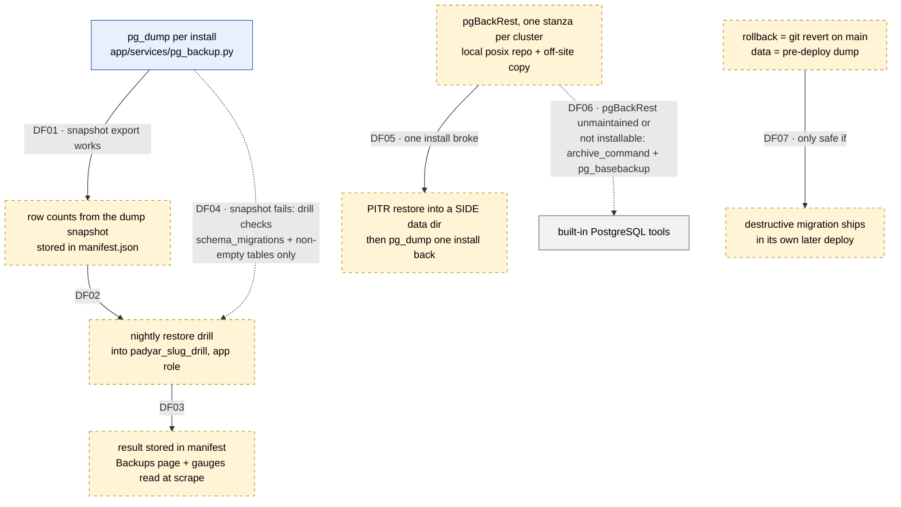

# SPIKE: بلوغ پایگاه داده و استقرار برای یک نصب تک‌مشتری

**Status:** In Review
**Owner:** dbmat-t1-res (عامل AI)، بازبینی انسانی: pending (Sina)
**Timebox:** یک نشست کاری (حدود 6 ساعت، شامل آزمایش‌های Docker)
**Date:** 2026-09-30
**Base commit:** `3a4a415` روی `main`

> قاعدهٔ شواهد این سند: هر ادعا دربارهٔ کد یک `file:line` در commit `3a4a415`
> دارد. هر عدد یا «اندازه‌گیری‌شده روی Mac توسعه در Docker، نه روی سرور» است،
> یا «تخمین» با دلیلش. هر ادعای بیرونی (ابزار، نسخه، مجوز) منبع اصلی و تاریخ
> دارد. استنتاج با کلمهٔ «استنتاج» مشخص شده است.

## 1. Question

یک مشتری سازمانی برای **ماندگاری داده** و **استقرار** یک CMS تک‌نصبی (یک نصب
برای هر مشتری، روی یک سرور) واقعاً به چه چیزی نیاز دارد، و ما چطور آن را بدون
پیچیدگی اضافه می‌سازیم و در همین مخزن (اسکریپت تست‌شده با Docker،
`tests/postgres`، CI) ثابت می‌کنیم؟

زیرسؤال‌ها، همان نه مورد قرارداد: بازیابی تا یک لحظهٔ مشخص (PITR)، replica،
تمرین بازیابی (restore drill)، محیط staging، هدف‌های RPO و RTO، بازگشت
(rollback)، connection pooling، تفکیک نقش‌های پایگاه داده، و برآورد ظرفیت.

## 2. Why It Matters

ارزیاب دانش‌بنیان این دلیل را برای رد نوشت: «پایگاه داده و استقرار برای سطح
سازمانی بالغ نیستند» (دلیل 4)، و «شواهد کافی از پایداری عملیاتی، فرایند
استاندارد استقرار، مانیتورینگ و مستندات رسمی نیست» (دلیل 6).

تا این سؤال جواب نگیرد، هیچ PR پیاده‌سازی در این حوزه نمی‌تواند شروع شود: معلوم
نیست PITR با چه ابزاری، drill کجا و با چه نقشی، staging با چه شکلی، و rollback
با چه قاعده‌ای ساخته شود. خروجی این سند یک ADR (ADR-022) و یک فهرست PR مرتب است.

## 3. Context

### وضع موجود (بررسی‌شده در کد)

| حوزه | امروز چه هست | شاهد |
|---|---|---|
| موتور | PostgreSQL 16 از بستهٔ اوبونتو، schemaهای `app` و `observability` | `deploy/00-bootstrap-server.sh:40`، `:44-48` |
| نقش و دیتابیس | برای هر slug یک نقش `padyar_<slug>` و یک دیتابیس `padyar_<slug>`؛ نقش `NOSUPERUSER NOCREATEDB NOCREATEROLE` و صاحب هر دو schema | `deploy/05-create-databases.sh:33-34`، `:49`، `:59`، `:63-64` |
| یک cluster مشترک | هر دو نصب روی سرور، دو دیتابیس در **یک** cluster پستگرس هستند | `deploy/05-create-databases.sh:24-67` (حلقه روی چند slug، یک سرور) |
| پشتیبان منطقی | `pg_dump --format custom --compress 6 --no-owner --no-privileges`، با نقش خود برنامه، سقف زمان 300 ثانیه | `app/services/pg_backup.py:51`، `:162-167` |
| زمان‌بند | هر شب ساعت 03:00، بعد verify، بعد prune به 14 عدد | `app/services/backup.py:21-29`، `:144-162` |
| کپی بیرون از سرور | اختیاری، با `OFFSITE_BACKUP_TARGET` (`rsync:` یا `dir:`)، فقط بعد از verify موفق | `app/services/pg_backup.py:267-269`، `app/services/backup_offsite.py:38-81` |
| بازیابی | از پنل ادمین، با عبارت تأیید دقیق، پشتیبان ایمنی قبلش، `--single-transaction`، و اعتبارسنجی بعدش | `app/services/pg_backup.py:348-468`، `:473-542` |
| استقرار | شش مرحله: dump، checkout، pip، migrate، restart، health با 12 تلاش | `deploy/padyar-deploy.sh:109-203` |
| CI | فقط یک slug را مستقر می‌کند (`vars.DEPLOY_SLUG`) | `.github/workflows/ci.yml:210-242` |
| متریک | `backup_outcome_total` یک Counter در حافظهٔ همان پروسه است | `app/services/metrics.py:67-70` |
| scraper | هیچ Prometheus یا scraper در مخزن نیست | `docs/engineering/MONITORING.md:16` |
| pool | پیش‌فرض کد 2/10؛ قالب نصب 1/5 با `WEB_CONCURRENCY=3` | `app/db/pg.py:60-66`، `deploy/env/instance.env.template:26-27`، `:35` |

`grep` برای `archive_mode|pgbackrest|wal-g|standby|PITR|RPO|RTO` در کد و `deploy/`
چیز واقعی پیدا نمی‌کند. پس امروز نه آرشیو WAL هست، نه PITR، نه replica، نه
drill، نه RPO/RTO نوشته‌شده.

### پنج اصلاح قرارداد (همه در کد تأیید شد)

1. **نقش production `padyar_<slug>` است، نه `padyar_app`.** `padyar_app` نقش
   dev و CI است (`.github/workflows/ci.yml:77-80`، `app/db/pg.py:48-51`). در
   CI این نقش `POSTGRES_USER` ایمیج Docker است و در نتیجه superuser است؛ پس CI
   امروز نمی‌تواند رفتار «بدون CREATEDB» را ثابت کند، مگر اینکه تست خودش یک
   نقش محدود بسازد. `tests/postgres/conftest.py:30-32` همین محدودیت را می‌گوید.
2. **دو نصب یک cluster مشترک دارند.** آرشیو WAL و PITR در سطح cluster کار
   می‌کنند، نه در سطح یک دیتابیس. آزمایش 3 (پایین) نشان می‌دهد این یعنی چه.
3. **rollback با sha قدیمی کار نمی‌کند.** توضیح بالای اسکریپت می‌گوید «صدا زدن
   با sha قدیمی همان مسیر rollback است» (`deploy/padyar-deploy.sh:19-20`)، ولی
   اسکریپت هر sha که نوک `main` نباشد را با `SUPERSEDED` و کد موفق رها می‌کند
   (`deploy/padyar-deploy.sh:129-139`). پس مسیر rollback مستند، امروز کار نمی‌کند.
4. **migrationها فقط افزایشی نیستند.** اسکریپت دو بار می‌گوید دیتابیس
   «additive-only» است (`deploy/padyar-deploy.sh:35-37`، `:187-188`). ولی چهار
   migration داده یا ساختار حذف می‌کنند:
   - `migrations/0006_lead_status.sql:51` و `:56` (یک ستون و جدول `edit_sessions`)
   - `migrations/0013_companies.sql:116` و `:119` (ردیف‌های `dataset` و جدول `company_profiles`)
   - `migrations/0028_drop_pwa_leftovers.sql:14-15` (دو ستون)
   - `migrations/0029_drop_search_backend_setting.sql:11` (یک ردیف settings)
5. **`/metrics` برای هر worker جداست و scraper ندارد.** registry اختصاصی در
   حافظهٔ پروسه است (`app/services/metrics.py:33`، `:67-70`)، سرویس با
   `--workers ${WEB_CONCURRENCY}` اجرا می‌شود
   (`deploy/systemd/padyar-app.service.template:34-36`)، و multiprocess mode در
   کد نیست. پس یک gauge به‌تنهایی مانیتورینگ نیست.

### چند یافتهٔ دیگر از خواندن کد

- بخش «بازیابی» در `docs/engineering/DEPLOYMENT_RUNBOOK.md:84` هنوز جایگزینی
  `chat_history.db` (SQLite) را توضیح می‌دهد. برای production پستگرس غلط است.
- توضیح مرحلهٔ 6 اسکریپت «`/health × 3`» می‌گوید (`deploy/padyar-deploy.sh:34`)،
  ولی کد 12 تلاش روی `/api/health` می‌کند (`:66`، `:176-184`).
- `backup_offsite.py` هیچ‌وقت کپی‌های قدیمی مقصد را پاک نمی‌کند (در فایل هیچ
  prune یا `--delete` نیست). مقصد دوم بی‌سقف رشد می‌کند.
- `pg_backup.create()` هیچ شمارشی از محتوای dump ثبت نمی‌کند
  (`app/services/pg_backup.py:179-192`). پس امروز نمی‌شود گفت «این پشتیبان
  چند ردیف داشت» و drill چیزی برای مقایسهٔ دقیق ندارد.
- 36 دستور DDL در زمان اجرا در سرویس‌ها هست (`ensure_table()` در
  `app/services/otp.py`، `leads.py`، `sms_outbox.py`، `campaigns.py`،
  `applog.py`). شمارش با
  `grep -rn "CREATE TABLE IF NOT EXISTS\|CREATE INDEX IF NOT EXISTS\|ALTER TABLE" app/services/*.py app/db/*.py | grep -v connection.py | wc -l`.
  این روی تفکیک نقش‌ها اثر مستقیم دارد (بخش 5.8).

## 4. Investigation

### Evidence

منابع بیرونی، همه در 2026-09-30 خوانده شدند:

| ادعا | منبع | تاریخ صفحه |
|---|---|---|
| pgBackRest آخرین نسخه 2.59.2، مجوز MIT | https://github.com/pgbackrest/pgbackrest (README و releases) | release در 2026-09-27 |
| pgBackRest در 2026-04-27 اعلام کرد «دیگر نگهداری نمی‌شود»، در 2026-05-18 با گروهی از اسپانسرها اعلام کرد «ادامه می‌دهد» | https://pgbackrest.org/news.html | «Updated September 27, 2026» |
| اوبونتو 24.04: بستهٔ `pgbackrest` نسخهٔ 2.50-1build2 در universe | https://packages.ubuntu.com/noble/pgbackrest | بدون تاریخ |
| مخزن PGDG برای noble نسخهٔ 2.59.1 دارد | https://apt.postgresql.org/pub/repos/apt/dists/noble-pgdg/main/binary-amd64/Packages.gz | Release file 2026-09-28 |
| انواع repo: posix (پیش‌فرض)، sftp، s3 و دیگران؛ `repo-retention-full`؛ `repo-retention-archive` | https://pgbackrest.org/configuration.html | «Updated July 20, 2026» |
| `restore --type=time`، `--delta`، دستور `check` | https://pgbackrest.org/command.html | «Updated July 20, 2026» |
| wal-g آخرین نسخه 3.0.9، مجوز Apache 2.0، فقط باینری در GitHub releases؛ بستهٔ اوبونتو و PGDG ندارد | https://github.com/wal-g/wal-g (releases، `docs/README.md`)، جستجوی packages.ubuntu.com | release در 2026-08-20 |
| مستند wal-g: نگه‌داشتن پشتیبان روی همان دیسک «برنامهٔ بازیابی از فاجعه نیست» | https://github.com/wal-g/wal-g/blob/master/docs/STORAGES.md | commit 2026-08-20 |
| Barman مجوز GPL 3، مستندش می‌گوید روی سرور جدا نصب شود | https://github.com/EnterpriseDB/barman، https://docs.pgbarman.org/release/3.20.1/user_guide/architectures.html | release در 2026-09-29 |
| `pg_dump` نمی‌تواند بخشی از آرشیو پیوسته باشد (پس PITR نمی‌دهد) | https://www.postgresql.org/docs/16/continuous-archiving.html | بدون تاریخ |
| `archive_command`، `restore_command`، `recovery.signal`، `recovery_target_time`، `archive_timeout` | همان صفحه و https://www.postgresql.org/docs/16/runtime-config-wal.html | بدون تاریخ |
| backup افزایشی (`pg_combinebackup`) از نسخهٔ 17 است، نه 16 | https://www.postgresql.org/docs/16/app-pgcombinebackup.html (404) و صفحهٔ نسخهٔ 17 | بدون تاریخ |
| standby با `standby.signal` و `primary_conninfo`؛ promote با `pg_promote()` | https://www.postgresql.org/docs/16/warm-standby.html | بدون تاریخ |
| `pg_restore --jobs` با فرمت custom کار می‌کند و با `--single-transaction` جمع نمی‌شود | https://www.postgresql.org/docs/16/app-pgrestore.html | بدون تاریخ |
| `pg_dump --snapshot` (dump از یک snapshot صادرشده) | خروجی `pg_dump --help` در ایمیج `postgres:16` (اجراشده، پایین) | 2026-09-30 |
| PgBouncer 1.26.0 (سه CVE)؛ حالت transaction برخی ویژگی‌های session را می‌شکند | https://www.pgbouncer.org/، https://www.pgbouncer.org/features.html | 2026-09-23 |
| psycopg 3 بعد از 5 اجرا خودش statement را prepare می‌کند (`prepare_threshold=5`)؛ با PgBouncer به libpq 17 به بالا نیاز دارد | https://www.psycopg.org/psycopg3/docs/advanced/prepare.html | مستند 3.3 |
| `pg_basebackup` به نقش با `REPLICATION` یا superuser نیاز دارد | https://www.postgresql.org/docs/16/app-pgbasebackup.html | بدون تاریخ |

### Experiments / Prototypes

همهٔ عددهای این بخش **اندازه‌گیری‌شده روی Mac توسعه (Apple M3، 16GB) در Docker
هستند، نه روی سرور**. Docker روی مک I/O کندتری از یک سرور لینوکس دارد، پس این
عددها را فقط برای مقایسهٔ ترتیب بزرگی به کار ببرید. همهٔ کانتینرها با نام
`dbmat-t1-*` ساخته و بعد پاک شدند. هیچ کد آزمایشی وارد مخزن نشده است.
دستورها و خروجی کامل در
`/Users/sinashamsizadeh/foreman/20260930-dbmaturity/dbmat-t1/handoffs/turn-1.md` هست.

**آزمایش 1: اندازهٔ داده و زمان `pg_dump`.**
کانتینر `postgres:16` (16.15). نقش `padyar_demo` دقیقاً مثل
`deploy/05-create-databases.sh` ساخته شد (`NOSUPERUSER NOCREATEDB NOCREATEROLE`)
و هر 29 migration روی آن اجرا شد. دادهٔ مصنوعی برای «یک رویداد بزرگ»، با متن
فارسی به‌اضافهٔ md5 تا فشرده‌سازی بیش از حد خوش‌بینانه نشود:

| جدول | ردیف | اندازهٔ کل (با index) | بایت برای هر ردیف |
|---|---|---|---|
| `app.messages` | 2,000,000 | 870 MB | 456 |
| `app.chat_logs` | 1,000,000 | 687 MB | 721 |
| `observability.app_logs` | 1,000,000 | 291 MB | 305 |
| `app.conversations` | 200,000 | 38 MB | 201 |
| `app.visitors` | 100,000 | 29 MB | 301 |

اندازهٔ دیتابیس: 1929 MB. `pg_dump` با **همان argv** در
`app/services/pg_backup.py:162-167` و با نقش محدود: **1 دقیقه و 49.5 ثانیه**،
فایل 131,113,223 بایت (حدود 15 برابر کوچک‌تر؛ متن تکراری مصنوعی این نسبت را
احتمالاً خوش‌بینانه می‌کند)، 232 مدخل در فهرست آرشیو.

**آزمایش 2: drill با نقش بدون CREATEDB.**
- نقش برنامه نمی‌تواند دیتابیس بسازد:
  `ERROR:  permission denied to create database` (تأیید شد).
- یک بار superuser دیتابیس `padyar_demo_drill` را با مالکیت `padyar_demo` ساخت
  (کاری که در زمان نصب انجام می‌شود). بعد **همهٔ drill با نقش برنامه** اجرا شد.
- `pg_restore` با همان flagهای `pg_backup.restore()`
  (`--clean --if-exists --no-owner --no-privileges --single-transaction`):
  **4 دقیقه و 22.7 ثانیه**. شمارش ردیف‌ها با مبدأ برابر بود
  (2000000 / 1000000 / 1000000 / 3000).
- اجرای دوباره روی همان دیتابیس با `--jobs 4` (بدون single-transaction):
  **3 دقیقه و 2.9 ثانیه**.
- پاک‌سازی با `DROP SCHEMA app CASCADE; DROP SCHEMA observability CASCADE;` با نقش
  برنامه کار کرد و دیتابیس drill به 8.6 MB برگشت. پس نیازی به `DROP DATABASE` نیست.
- آزمایش جدا: 29 migration با خود `scripts/apply_migrations.py` اجرا شد، dump و
  restore به دیتابیس drill انجام شد. جدول `app.schema_migrations` در هر دو 29
  ردیف و md5 یکسان (`626f76f120530b742904a127ddc0d14c`) داشت. پس مقایسهٔ
  checksum migrationها یک بررسی قابل اعتماد برای drill است.

**آزمایش 3: PITR با pgBackRest روی یک cluster با دو نصب.**
- `apt-get install pgbackrest` داخل `postgres:16` نسخهٔ 2.59.1 را از PGDG نصب
  کرد. تنظیم: repo از نوع posix روی دیسک محلی، `repo1-retention-full=2`،
  `compress-type=zst`، `archive_command=pgbackrest --stanza=main archive-push %p`،
  `archive_timeout=60`.
- دو دیتابیس `padyar_a` و `padyar_b`، هر کدام 400,000 ردیف. اندازهٔ cluster: 500 MB.
- پشتیبان کامل: **33.4 ثانیه**، اندازه در repo **31.2 MB**.
- بعد از پشتیبان: 1000 ردیف تازه در A و 500 ردیف در B. زمان T ثبت شد. بعد از T:
  در A جدول حذف شد (حادثه)، در B یک ردیف درست و قانونی نوشته شد.
- restore به زمان T در **یک پوشهٔ جدا** (`--pg1-path=/tmp/restore`)، بدون دست
  زدن به cluster زنده: **38.0 ثانیه**. بالا آمدن آن نمونه روی پورت 5433 تا
  آمادهٔ اتصال: **12.4 ثانیه**. در لاگ: `recovery stopping before commit of transaction 750`.
- نتیجه در نمونهٔ بازیابی‌شده: جدول A با **401,000** ردیف برگشت (شامل 1000 ردیف
  بعد از پشتیبان). B فقط ردیف‌های قبل از T را داشت: **ردیف قانونی B که بعد از T
  نوشته شده بود، در نمونهٔ بازیابی‌شده نیست.**

این آخرین نتیجه مهم‌ترین یافتهٔ آزمایش است: بازگرداندن کل cluster به زمان T،
نصب دوم را هم به عقب می‌برد و نوشته‌های درستش را از دست می‌دهد.

### Constraints Discovered

- **CREATEDB نداریم.** drill نمی‌تواند دیتابیس موقت بسازد. راه حل اندازه‌گیری‌شده:
  یک دیتابیس `padyar_<slug>_drill` که در زمان نصب ساخته می‌شود و مالکش نقش برنامه است.
- **PITR در سطح cluster است.** با دو نصب روی یک cluster، restore درجا برای خطای
  یک نصب، داده‌های نصب دیگر را هم عقب می‌برد (آزمایش 3).
- **سقف 300 ثانیه برای `pg_dump`** (`app/services/pg_backup.py:51`). روی مک،
  1.9 GB در 110 ثانیه تمام شد. **تخمین** با فرض رشد خطی: از حدود 5 GB به بعد
  پشتیبان شبانه و پشتیبان قبل از deploy با timeout شکست می‌خورند و deploy
  متوقف می‌شود (`deploy/padyar-deploy.sh:113-116`). سرور واقعی احتمالاً سریع‌تر
  است؛ اندازه‌گیری نشده است.
- **دانلود از GitHub در ایران ممکن است بسته یا کند باشد** (فرض قرارداد). wal-g
  فقط از GitHub نصب می‌شود. pgBackRest از مخزن اوبونتو نصب می‌شود.
- **امنیت.** pgBackRest به‌عنوان کاربر سیستمی `postgres` اجرا می‌شود و به کل
  cluster دسترسی کامل دارد. این یک مرز اعتماد تازه است. قاعدهٔ پیشنهادی: برنامه
  هرگز آن را صدا نمی‌زند؛ فقط اسکریپت‌های root در `deploy/` و timerهای systemd
  آن را اجرا می‌کنند، و برنامه فقط یک فایل وضعیت یا `pg_stat_archiver` را می‌خواند.
  برای drill مرز تازه‌ای لازم نیست: همان نقش برنامه، روی دیتابیسی که مالکش است.
  یک خطر مشخص drill: اگر به اشتباه به دیتابیس زنده اشاره کند، `--clean` آن را
  پاک می‌کند. پس نام دیتابیس drill باید از نام زنده مشتق شود و کد در صورت
  برابری رد کند، و یک تست منفی همین را قفل کند.
- **داده‌های شخصی در staging.** دادهٔ production نام و شمارهٔ تلفن بازدیدکننده
  دارد (`app.visitors`). کپی آن به staging یعنی یک جای دیگر برای داده‌های شخصی.
- **محصول.** هیچ‌کدام از این کارها صفحهٔ بازدیدکننده را تغییر نمی‌دهد. تنها
  سطح کاربری، صفحهٔ Backups پنل ادمین است و باید برای کارمند غیر فنی قابل فهم
  بماند: «آخرین تمرین بازیابی: موفق، دیروز 03:12، 4 دقیقه».

## 5. Findings

### 5.1 PITR

- `pg_dump` شبانه در بدترین حالت حدود 24 ساعت داده از دست می‌دهد (پشتیبان
  ساعت 03:00، `app/services/backup.py:21-24`). PITR با `pg_dump` ممکن نیست
  (مستند PostgreSQL 16).
- **pgBackRest** در آزمایش 3 کار کرد، از مخزن خود اوبونتو نصب می‌شود
  (2.50، universe)، repo محلی و sftp دارد، retention و `check` و restore به
  زمان را خودش دارد. ریسک: پروژه در آوریل 2026 تقریباً رها شد و هنوز عمدتاً
  به یک نگه‌دارنده وابسته است (استنتاج از news.html).
- **wal-g** از نظر فنی خوب است ولی فقط از GitHub نصب می‌شود. در ایران این یک
  ریسک واقعی برای نصب و به‌روزرسانی است (استنتاج).
- **`archive_command` ساده + `pg_basebackup`** بدون وابستگی تازه است، ولی
  retention، پاک کردن WAL قدیمی، بررسی سلامت آرشیو و restore به زمان را باید
  خودمان در bash بنویسیم و نگه داریم. این همان چیزی است که pgBackRest آماده دارد.
- **Barman** برای یک سرور جدا طراحی شده (مستند خودش). ما سرور دوم نداریم.
- `pg_dump` جایگزین نمی‌شود، **مکمل** می‌ماند: فقط `pg_dump` یک نصب را جدا از
  نصب دیگر برمی‌گرداند، و فقط `pg_dump` از پنل ادمین قابل بازیابی است.

### 5.2 Replica

- replica روی **همان سرور** از از دست رفتن سرور محافظت نمی‌کند (استنتاج؛ مستند
  PostgreSQL فقط برای دیسک مشترک همین را صریح می‌گوید). سرور دوم امروز وجود ندارد.
- replica جلوی خطای انسانی و migration بد را هم نمی‌گیرد: یک `DROP` بلافاصله
  روی replica هم اجرا می‌شود. آن کار PITR است.
- یک نصب تک‌مشتری برای یک رویداد یا یک سازمان، بدون قرارداد SLA، سود کمی از
  failover خودکار می‌برد و هزینهٔ عملیاتی بالایی دارد (استنتاج).

### 5.3 Restore drill

- طرح اندازه‌گیری‌شده کار می‌کند: دیتابیس drill از قبل ساخته‌شده، نقش برنامه،
  `pg_restore` با همان flagها، شمارش، پاک کردن schemaها.
- «شمارش در برابر مبدأ» فقط وقتی دقیق است که شمارش از **همان snapshot** dump
  باشد. شمارش زندهٔ دیتابیس در لحظهٔ drill با dump دیشب فرق دارد. راه دقیق:
  در `create()` یک تراکنش `REPEATABLE READ` باز شود، `pg_export_snapshot()`،
  شمارش جدول‌ها، و `pg_dump --snapshot=<id>`. شمارش‌ها در `manifest.json` ثبت
  می‌شوند و drill با آن‌ها مقایسه می‌کند (سازوکار `--snapshot` وجود دارد؛
  اجرای کامل این زنجیره هنوز تست نشده و کار PR است).
- بررسی `app.schema_migrations` (تعداد و checksum) در آزمایش 2 کار کرد.
- `validate_restored_database()` امروز فقط روی دیتابیس زنده کار می‌کند
  (`app/services/pg_backup.py:487-493`). برای drill باید روی یک اتصال دلخواه
  کار کند، نه اینکه کپی شود.
- زمان‌بندی: زمان‌بند فعلی (`app/services/backup.py:184-213`) با claim اتمی
  یک بار در هر slot اجرا می‌شود و الان همین کار را برای dump و verify می‌کند.
  drill منطقاً قدم بعدی همان زنجیره است: «پشتیبانی که همین الان گرفتیم را
  واقعاً بازیابی کن». timer جدای systemd یک الگوی دوم برای همین کار می‌شد.
- دیده شدن نتیجه: چون `/metrics` برای هر worker جداست و scraper ندارد، نتیجه
  باید **پایدار** ذخیره شود (در `manifest.json` همان پشتیبان، مثل `verification`)
  و صفحهٔ Backups آن را نشان دهد. gaugeها در لحظهٔ scrape از همان رکورد پایدار
  خوانده شوند تا هر worker همان عدد را بدهد. هشدار (alert) کار track 4 است
  (`deploy/monitoring/alerts.yml`)؛ این سند فقط نام متریک‌ها را پیشنهاد می‌کند.

### 5.4 Staging

- `PADYAR_ENV=staging` از قبل وجود دارد و gate production را اجرا می‌کند ولی
  فقط لاگ می‌کند (`docs/engineering/DEPLOYMENT_RUNBOOK.md`، بخش Environment marker).
- `docker-compose.yml` شکل production نیست: نه systemd، نه nginx، نه
  `padyar-deploy.sh`، نه نقش محدود (`docker-compose.yml:5-6`، کاربر superuser
  ایمیج). staging با آن، مسیر واقعی استقرار را تست نمی‌کند.
- یک slug دوم (`staging`) روی همان سرور، با `05` و `10` و همان
  `padyar-deploy.sh` ساخته می‌شود. یعنی همان مسیر، همان اسکریپت، همان نقش.
  هزینه: RAM و CPU همان سرور، و یک دیتابیس دیگر در همان cluster.

### 5.5 RPO و RTO

امروز هیچ هدفی نوشته نشده. وضع امروز، به‌عنوان مبنا:

| سناریو | RPO امروز | RTO امروز |
|---|---|---|
| خطای داده یا migration بد، سرور سالم | تا 24 ساعت (از dump شبانه)؛ برای deploy، صفر (dump قبل از deploy) | اندازه‌گیری نشده. restore یک dump با 1.9 GB روی مک: 4 دقیقه و 23 ثانیه |
| از دست رفتن دیسک یا سرور | تا 24 ساعت اگر `OFFSITE_BACKUP_TARGET` تنظیم شده باشد؛ وگرنه همه‌چیز | اندازه‌گیری نشده؛ ساخت سرور تازه با `deploy/` |

### 5.6 Rollback

- **کد:** rollback خودکار بعد از health قرمز کار می‌کند
  (`deploy/padyar-deploy.sh:185-200`). rollback دستی به یک sha قدیمی کار
  نمی‌کند (اصلاح 3). راهی که امروز **بدون تغییر اسکریپت** کار می‌کند: یک
  `git revert` روی `main` که از مسیر عادی CI مستقر می‌شود.
- **داده:** dump قبل از deploy (`deploy/padyar-deploy.sh:109-116`) و restore از
  پنل ادمین. این برای یک نصب کار می‌کند و به نصب دیگر دست نمی‌زند.
- **مشکل اصلی:** با migration مخرب، rollback کد به‌تنهایی کافی نیست. کد قدیمی
  ممکن است ستونی را بخواند که دیگر نیست (مثلاً کد قبل از `0028` ستون
  `visitor_settings` را می‌خواند). پس قاعده باید در زمان نوشتن migration اعمال
  شود، نه در زمان rollback: حذف یک ستون یا جدول در یک deploy **جدا و بعدی**
  انجام شود، وقتی کدی که از آن استفاده نمی‌کند قبلاً مستقر و پایدار شده است
  (الگوی expand/contract). آن‌وقت rollback کد یک deploy هیچ‌وقت از روی یک حذف
  عبور نمی‌کند. `0028` تقریباً همین را رعایت کرد (خوانندهٔ آن در همان تغییر حذف
  شد، طبق توضیح خود فایل)، ولی در یک deploy.

### 5.7 Connection pooling

- قالب نصب: `WEB_CONCURRENCY=3` × `DB_POOL_MAX_SIZE=5` = **15 اتصال** برای هر نصب
  (`deploy/env/instance.env.template:27`، `:35`؛ همین عدد در
  `deploy/05-create-databases.sh:72`). دو نصب: 30. staging پیشنهادی: 45.
  به‌اضافهٔ اتصال‌های `pg_dump`، drill و pgBackRest (هر کدام چند اتصال کوتاه).
  `max_connections` پیش‌فرض PostgreSQL 100 است (اسکریپت `05` زیر 60 هشدار
  می‌دهد، `:74-76`). حاشیه کافی است.
- PgBouncer در حالت transaction با prepare خودکار psycopg 3 تداخل دارد، مگر
  libpq 17 به بالا و تنظیم `max_prepared_statements`، یا خاموش کردن prepare
  (مستند psycopg). یعنی یک سرویس دیگر، یک پیکربندی دیگر، و یک ریسک رفتاری،
  برای مشکلی که عددها نشان نمی‌دهند.
- `app/prodcheck.py:207-216` بالای 80 اتصال هشدار می‌دهد. این هشدار کافی است.

### 5.8 تفکیک نقش‌ها

امروز یک نقش همه کار می‌کند: مالک schemaها، اجرای برنامه، migration، dump و
restore. `NOSUPERUSER NOCREATEDB NOCREATEROLE` و `statement_timeout = 30s` و
`idle_in_transaction_session_timeout = 60s` خوب است
(`deploy/05-create-databases.sh:49-53`). ولی:

- یک SQL injection در برنامه می‌تواند `DROP TABLE` اجرا کند، چون نقش برنامه
  مالک جدول‌هاست.
- جدا کردن «نقش مالک برای migration» از «نقش اجرای برنامه فقط با DML» این را
  می‌بندد، ولی هزینهٔ واقعی دارد: 36 دستور DDL در زمان اجرا در سرویس‌ها باید
  یا به migration منتقل شوند یا ثابت شود با نقش غیر مالک بی‌خطر اجرا می‌شوند
  (تست نشده)، و restore از پنل ادمین (`--clean`، یعنی DROP) به نقش مالک نیاز
  دارد. پس برنامه باز هم به رمز نقش مالک نیاز پیدا می‌کند.
- یک نقش **فقط خواندنی** (`padyar_<slug>_ro` با `pg_read_all_data`، مستند
  PostgreSQL 16) ارزان است و برای گزارش‌گیری و psql دستی کاربرد مستقیم دارد.
- نقش پشتیبان جدا فعلاً لازم نیست: `pg_dump` با نقش مالک همه چیز را می‌خواند،
  و pgBackRest با کاربر سیستمی `postgres` و از راه socket محلی کار می‌کند.

### 5.9 برآورد ظرفیت (همه تخمین)

- **هر نوبت گفتگو:** یک ردیف `chat_logs` (کد: `app/db/queries.py:64-73`) و دو ردیف
  `messages` (پرسش و پاسخ؛ `app/services/conversations.py:535`). **فرض:** حدود
  یک ردیف `app_logs`. با اندازه‌های اندازه‌گیری‌شده در آزمایش 1:
  721 + 2 × 456 + 305 ≈ **1.9 KB برای هر نوبت**، با index. متن واقعی ممکن است
  کوتاه‌تر یا بلندتر باشد.
- **یک رویداد:** 10,000 بازدیدکننده × 10 نوبت = 100,000 نوبت ≈ **190 MB**
  (تخمین، با فرض‌های بالا).
- **رشد بی‌سقف:** `chat_log_retention_days` پیش‌فرض 0 یعنی «برای همیشه نگه دار»
  (`app/routers/admin.py:663`، `app/db/queries.py:193-210`). `app_logs` پیش‌فرض
  90 روز نگه‌داری دارد (`docs/engineering/MONITORING.md:189-192`).
- **مرز 300 ثانیه:** با این نرخ، رسیدن به حدود 5 GB یعنی حدود 25 رویداد مثل
  بالا بدون پاک‌سازی (تخمین). دور است، ولی deploy را متوقف می‌کند، پس باید
  قبل از آن دیده شود.
- **WAL:** در آزمایش 3، نوشتن حدود 500 MB داده 36 فایل WAL (هر کدام 16 MB،
  حدود 576 MB بدون فشرده‌سازی) ساخت. پشتیبان کامل در repo 31.2 MB شد. با
  `repo1-retention-full=2`، repo محلی تقریباً «دو پشتیبان کامل فشرده + WAL
  فشردهٔ بین آن‌ها» جا می‌گیرد (تخمین؛ حجم WAL فشرده اندازه‌گیری نشد).

## 6. Decision / Recommendation

**خلاصه:** pgBackRest برای PITR کل cluster، کنار `pg_dump` برای هر نصب (نه به
جای آن). drill شبانه از روی همان dump شبانه، در زمان‌بند موجود، با نقش خود
برنامه، روی یک دیتابیس drill از پیش ساخته. بدون replica. بدون PgBouncer.
staging با یک slug دوم روی همان سرور. قاعدهٔ expand/contract برای migration
مخرب. یک نقش فقط خواندنی الان؛ جدا کردن مالک از اجرا بعداً.

راهنما: خط‌چین زرد یعنی پیشنهادی (هنوز ساخته نشده). آبی یعنی امروز وجود
دارد (`app/services/pg_backup.py:150-204`). خاکستری یعنی مسیر جایگزین اگر یک
شرط شکست بخورد. یال‌های خط‌چین مسیر جایگزین هستند.

### تصمیم برای هر زیرسؤال

1. **PITR:** pgBackRest، از بستهٔ اوبونتو (همان منبع خود PostgreSQL، بدون منبع
   apt تازه). repo1 از نوع posix روی دیسک محلی. کپی بیرون از سرور به همان مقصد
   `OFFSITE_BACKUP_TARGET`. اینکه این کپی با repo2 از نوع sftp باشد یا با یک
   rsync زمان‌بندی‌شدهٔ پوشهٔ repo، در PR مربوط با آزمایش تعیین می‌شود (پشتیبانی
   چند repo همزمان را در این spike تأیید نکردم). برنامه: پشتیبان کامل هفتگی،
   differential روزانه، `repo1-retention-full=2` (پنجرهٔ PITR بین 7 تا 14 روز)،
   `archive_timeout=60`. `pg_dump` می‌ماند.
   **دو نصب روی یک cluster:** restore درجای کل cluster فقط برای خرابی کل سرور یا
   cluster. برای خطای یک نصب: restore به زمان T در یک پوشهٔ جدا روی پورت دیگر
   (دقیقاً آزمایش 3)، بعد `pg_dump` فقط دیتابیس آن نصب از نمونهٔ جدا، و restore
   آن با مسیر موجود پنل. نصب دیگر دست نمی‌خورد.
2. **Replica:** نه، الان. نه اسکریپت، نه failover. در عوض یک بند در runbook:
   «اگر مشتری در دسترس‌پذیری بالا خواست، این ADR باز می‌شود». شرط بازبینی در ADR.
3. **Drill:** شبانه، بلافاصله بعد از dump و verify در همان slot زمان‌بند موجود.
   مقصد: `padyar_<slug>_drill` که `deploy/05-create-databases.sh` می‌سازد،
   مالک نقش برنامه. کد نام را از نام زنده مشتق می‌کند و اگر برابر باشد رد می‌کند.
   بررسی‌ها: شمارش ردیف هر جدول در برابر شمارش ثبت‌شده از snapshot dump،
   `app.schema_migrations` (تعداد و checksum)، و همان بررسی‌های
   `validate_restored_database()` روی اتصال drill. بعد schemaهای drill پاک
   می‌شوند. نتیجه در بلوک `drill` در `manifest.json` همان پشتیبان.
   متریک‌ها (gauge، خوانده در لحظهٔ scrape از آخرین manifest):
   `backup_drill_last_success_timestamp_seconds`،
   `backup_drill_last_duration_seconds`، `backup_drill_last_ok` (0 یا 1).
   صفحهٔ Backups: یک خط وضعیت ساده («آخرین تمرین بازیابی: موفق، زمان،
   مدت»)، و با کلیک، جدول شمارش‌ها. هشدار در track 4.
4. **Staging:** slug دوم `staging` روی همان سرور، `PADYAR_ENV=staging`.
   جریان CI: `deploy-staging` (بدون تأیید) ← health ← `deploy` production (با
   همان تأیید فعلی). داده: محتوای dataset از production، ولی بدون داده‌های شخصی
   بازدیدکننده، مگر اینکه Sina طور دیگری تصمیم بگیرد (سؤال باز).
5. **RPO و RTO** (هدف پیشنهادی؛ مالک محصول تأیید می‌کند):

   | سناریو | هدف RPO | چطور برآورده می‌شود | چطور اندازه گرفته می‌شود | هدف RTO | چطور اندازه گرفته می‌شود |
   |---|---|---|---|---|---|
   | خطای یک نصب، سرور سالم | 5 دقیقه | آرشیو WAL با `archive_timeout=60` | سن آخرین WAL آرشیوشده (`pg_stat_archiver.last_archived_time`) | 1 ساعت | مدت restore در drill شبانه، به‌اضافهٔ مدت restore در تست PITR |
   | خرابی cluster، سرور سالم | 5 دقیقه | همان | همان | 2 ساعت | تست PITR دوره‌ای (اسکریپت PR C) |
   | از دست رفتن سرور | 24 ساعت (بعداً کمتر، با کپی WAL بیرون از سرور) | dump شبانهٔ verify‌شده به مقصد دوم | وضعیت `offsite` در manifest | 1 روز کاری (تخمین) | فقط با یک تمرین بازسازی کامل روی سرور دیگر؛ امروز انجام نشده |

6. **Rollback:** مسیر استاندارد کد: `git revert` روی `main`. اسکریپت یک حالت
   rollback صریح می‌گیرد که sha قدیمی را فقط اگر جد (ancestor) `main` باشد
   می‌پذیرد، و قبل از هر کار، migrationهایی که دیتابیس دارد و کد قدیمی ندارد را
   فهرست می‌کند و بدون تأیید صریح اپراتور ادامه نمی‌دهد. توضیح‌های غلط اسکریپت
   («additive-only»، «`/health × 3`»، «sha قدیمی») اصلاح می‌شوند. قاعدهٔ
   expand/contract در `docs/engineering/DATABASE.md` نوشته می‌شود.
7. **Pooling:** همان `psycopg_pool` داخل برنامه. PgBouncer نه. شرط بازبینی: اگر
   جمع اتصال‌ها بالای 80 رفت (همان هشدار `prodcheck`) یا بیش از سه نصب روی یک
   cluster آمد.
8. **نقش‌ها:** الان: نقش `padyar_<slug>_ro` با `pg_read_all_data`. بعداً (ADR
   جدا): جدا کردن مالک از اجرا، بعد از اینکه DDLهای زمان اجرا بررسی و
   مسیر restore پنل برای آن طراحی شد.
9. **ظرفیت:** یک هشدار در صفحهٔ Backups وقتی مدت `pg_dump` از 50 درصد سقف 300
   ثانیه گذشت، و یک بند در runbook دربارهٔ `chat_log_retention_days`.

### چه چیزی را از دست می‌دهیم

| از دست می‌دهیم | چرا قبولش می‌کنیم | کاهش ریسک |
|---|---|---|
| یک ابزار تازه با دسترسی کامل به cluster (pgBackRest) | PITR بدون آن یعنی نوشتن و نگه داشتن retention و بررسی سلامت آرشیو در bash | فقط اسکریپت root اجرایش می‌کند؛ برنامه فقط وضعیت می‌خواند |
| وابستگی به پروژه‌ای که در 2026 تقریباً رها شد | امروز فعال است و از مخزن اوبونتو نصب می‌شود | مسیر جایگزین با ابزار خود PostgreSQL (DF06)؛ اسکریپت‌ها پشت دو فایل در `deploy/` می‌مانند |
| نسخهٔ 2.50 اوبونتو قدیمی است | منبع apt تازه در ایران شاید در دسترس نباشد | PGDG اختیاری؛ در PR با `pgbackrest version` ثبت می‌شود |
| PITR نمی‌تواند یک نصب را جدا برگرداند | cluster مشترک واقعیت سرور است | restore در پوشهٔ جدا و بعد انتقال با `pg_dump` (آزمایش 3) |
| بدون replica، خرابی سرور یعنی ساعت‌ها قطعی | سرور دوم نیست و replica روی همان سرور محافظت نمی‌کند | کپی بیرون از سرور + runbook بازسازی؛ شرط بازبینی در ADR |
| drill هر شب چند دقیقه CPU و I/O ساعت 3 صبح می‌گیرد | همان ساعتی است که dump هم اجرا می‌شود و ترافیک کم است | مدت در manifest ثبت و در صفحه دیده می‌شود |
| staging روی همان سرور منابع production را می‌خورد | ساده‌ترین راهی است که همان مسیر استقرار را تست می‌کند | staging با `WEB_CONCURRENCY=1` |
| نقش برنامه هنوز می‌تواند جدول حذف کند | تفکیک کامل امروز مسیر restore پنل را می‌شکند | ADR جدا با شرط مشخص |

**چقدر برگشت‌پذیر است:** pgBackRest و آرشیو WAL برگشت‌پذیرند (خاموش کردن
`archive_mode` و حذف بسته). drill و staging کاملاً برگشت‌پذیرند. تنها تصمیم
یک‌طرفه‌تر، قاعدهٔ migration است، که آن هم فقط روی migrationهای آینده اثر دارد.

## 7. Alternatives Considered

| گزینه | چرا انتخاب نشد |
|---|---|
| wal-g به جای pgBackRest | فقط باینری GitHub؛ نصب و به‌روزرسانی در ایران ریسک دارد. مستند خودش repo روی همان دیسک را «برنامهٔ بازیابی نیست» می‌داند، پس به‌هرحال به مقصد بیرونی نیاز داریم |
| `archive_command` + `pg_basebackup` بدون ابزار | صفر وابستگی، ولی retention، پاک کردن WAL، `check` و restore به زمان را باید خودمان بنویسیم. به‌عنوان جایگزین (DF06) نگه داشته شد |
| Barman | برای سرور پشتیبان جدا طراحی شده؛ GPL 3؛ ما سرور دوم نداریم |
| هیچ کاری نکردن برای PITR | RPO 24 ساعت برای یک مشتری سازمانی با داده‌های ثبت‌نام و سرنخ فروش زیاد است؛ و دقیقاً همان چیزی است که ارزیاب رد کرد |
| جایگزین کردن `pg_dump` با pgBackRest | بازیابی یک نصب جدا از نصب دیگر و بازیابی از پنل ادمین از دست می‌رود |
| replica روی همان سرور | در برابر خرابی سرور و خطای انسانی محافظت نمی‌کند |
| replica روی سرور دوم با failover | سرور دوم وجود ندارد؛ هزینهٔ عملیاتی بالا برای یک نصب تک‌مشتری |
| drill با timer جدای systemd | الگوی دوم برای همان کار زمان‌بند موجود؛ روی نصب Docker کار نمی‌کند |
| drill در schema موقت داخل دیتابیس زنده | dump نام schemaهای `app` و `observability` را دارد و `pg_restore` نمی‌تواند آن‌ها را تغییر نام دهد؛ و restore کنار دادهٔ زنده خطر اشتباه دارد |
| drill در کانتینر Docker موقت | سرور production برای برنامه Docker ندارد؛ یک وابستگی تازه روی سرور |
| drill با گرفتن CREATEDB برای نقش برنامه | دسترسی بیشتر به نقشی که در معرض وب است، برای کاری که یک دیتابیس ثابت هم انجامش می‌دهد |
| staging با docker compose | شکل production نیست (بدون systemd، nginx، `padyar-deploy.sh`، نقش محدود) |
| PgBouncer | عددها نیاز نشان نمی‌دهند؛ با prepare خودکار psycopg 3 تداخل دارد |
| تفکیک کامل نقش‌ها الان | 36 DDL زمان اجرا و restore پنل را می‌شکند؛ به ADR جدا منتقل شد |

## 8. Remaining Risks / Unknowns

| مورد | وضعیت |
|---|---|
| مشخصات دیسک، CPU و حجم آزاد سرور | تأییدنشده. همهٔ زمان‌ها روی مک است |
| دسترسی به apt.postgresql.org و GitHub از سرور | تأییدنشده؛ فرض قرارداد |
| پشتیبانی همزمان repo1 و repo2 در pgBackRest 2.50 | تأییدنشده؛ در PR C آزمایش شود |
| `pg_dump --snapshot` همراه با شمارش در یک تراکنش | flag تأیید شد؛ کل زنجیره تست نشد |
| `statement_timeout = 30s` نقش روی `pg_restore` در drill | تأییدنشده. نقش آزمایشی من این تنظیم را نداشت. در PR B با همین تنظیم تست شود |
| خواندن `pg_stat_archiver` با نقش برنامه | تأییدنشده |
| هزینهٔ CPU فشرده‌سازی WAL روی سرور GPU | تأییدنشده |
| یک ردیف `app_logs` برای هر نوبت | فرض، برای برآورد ظرفیت |
| نسبت فشرده‌سازی 15 برابر dump | اندازه‌گیری روی دادهٔ مصنوعی؛ دادهٔ واقعی احتمالاً کمتر فشرده می‌شود |
| آیا اسکریپت root نصب‌شدهٔ `padyar-deploy` روی سرور با نسخهٔ مخزن یکی است | تأییدنشده؛ به سرور دست نزدم |
| سقف 300 ثانیه روی سرور واقعی کی می‌رسد | تخمین 5 GB؛ اندازه‌گیری نشده |
| `backup_outcome_total` امروز هم برای هر worker جداست | تأیید شد در کد؛ اصلاحش خارج از این spike است (track 4) |

## 9. Production Impact

خود این spike هیچ کد production ندارد. همهٔ آزمایش‌ها در کانتینرهای موقت بودند
و پاک شدند.

خروجی: **→ ADR** (ADR-022 در `docs/engineering/DECISIONS.md`، وضعیت Proposed).
شرط‌هایی که ADR را لازم کرد: یک وابستگی خارجی تازه با دسترسی کامل به cluster
(pgBackRest)، یک مرز اعتماد تازه (کاربر `postgres` در timerها)، و یک قاعدهٔ
عرضی تازه برای همهٔ migrationهای آینده (expand/contract). بعد از ADR، هر PR
زیر یک SPEC یا PLAN کوتاه خودش را دارد.

### فهرست کار (PRها، به ترتیب وابستگی، هر کدام یک علت ریشه‌ای)

| # | PR | علت ریشه‌ای | فایل‌هایی که لمس می‌کند | وابسته به |
|---|---|---|---|---|
| A | اصلاح مستندات و توضیح‌های غلط | اسناد و توضیح‌ها با کد نمی‌خوانند (SQLite در runbook، additive-only، `/health × 3`، sha قدیمی) | `docs/engineering/DEPLOYMENT_RUNBOOK.md`، `docs/engineering/DATABASE.md` (قاعدهٔ expand/contract)، `deploy/padyar-deploy.sh` (فقط توضیح) | هیچ |
| B1 | شمارش ردیف در manifest | پشتیبان ثبت نمی‌کند چه چیزی در آن است | `app/services/pg_backup.py` (`create()` با snapshot صادرشده)، `tests/postgres/test_pg_backup_counts.py` | هیچ |
| B2 | تمرین بازیابی شبانه | هیچ‌کس ثابت نمی‌کند پشتیبان‌ها قابل بازیابی‌اند | `app/services/restore_drill.py` (تازه)، `app/services/pg_backup.py` (`validate_restored_database` روی اتصال دلخواه)، `app/services/backup.py` (قدم drill بعد از verify)، `deploy/05-create-databases.sh` (دیتابیس `_drill`)، `app/routers/backups.py`، `templates/admin/infra_backups.html` و JS آن، `app/routers/metrics.py` و `app/services/metrics.py` (gaugeها در لحظهٔ scrape)، `tests/postgres/test_restore_drill.py` (با نقش بدون CREATEDB که خود تست می‌سازد، و تست منفی «دیتابیس زنده را هدف نگیر»)، `docs/engineering/MONITORING.md` | B1 |
| C | آرشیو WAL و PITR | امروز هیچ بازیابی تا یک لحظه ممکن نیست | `deploy/55-pitr.sh` (تازه: نصب، پیکربندی، `stanza-create`، `check`، اولین full)، `deploy/systemd/padyar-pgbackrest-*.service/.timer` (تازه)، `deploy/pitr-restore-test.sh` (تازه: restore به پوشهٔ جدا و بررسی)، یک job در `.github/workflows/ci.yml` که این اسکریپت را در کانتینر `postgres:16` اجرا می‌کند، `deploy/README.md`، runbook (روش «پوشهٔ جدا بعد انتقال یک نصب») | A |
| D | حالت rollback امن | rollback دستی به sha قدیمی کار نمی‌کند | `deploy/padyar-deploy.sh` (حالت rollback با بررسی ancestor و فهرست migrationهای جلوتر)، runbook | A |
| E | staging | مسیر استقرار قبل از production تست نمی‌شود | `.github/workflows/ci.yml` (job `deploy-staging` و environment)، `deploy/README.md`، `deploy/env/instance.env.template` (نکتهٔ staging)، runbook | D |
| F | نقش فقط خواندنی | هر خواندن دستی با نقش مالک انجام می‌شود | `deploy/05-create-databases.sh`، `docs/engineering/SECURITY.md` | هیچ |
| G | RPO و RTO و ظرفیت | هیچ هدف نوشته‌شده‌ای نیست | `docs/engineering/DEPLOYMENT_RUNBOOK.md` (یا یک فایل تازه در `docs/engineering/`)، با عددهای drill و تست PITR واقعی | B2، C |

خارج از این track: هشدار روی متریک‌ها و شکل multiprocess متریک‌ها (track 4،
`deploy/monitoring/alerts.yml`).

### سؤال‌های باز برای Sina

1. هدف‌های RPO و RTO بخش 6 قابل قبول‌اند؟ این‌ها وعده به مشتری می‌شوند.
2. staging دادهٔ شخصی بازدیدکننده داشته باشد یا فقط محتوای dataset؟
3. `OFFSITE_BACKUP_TARGET` امروز روی سرور تنظیم شده؟ (من به سرور دست نزدم.)
4. pgBackRest از اوبونتو (2.50) یا از PGDG (2.59.x)؟ پیشنهاد: اوبونتو، مگر PGDG از سرور در دسترس باشد.

## 10. Related Artifacts

- PRD: ندارد
- Spec: ندارد (هر PR بالا SPEC یا PLAN کوتاه خودش را می‌گیرد)
- ADR: ADR-022 در `docs/engineering/DECISIONS.md` (Proposed)
- Plan: ندارد
- اسناد مرتبط: `docs/engineering/DATABASE.md`، `docs/engineering/DEPLOYMENT_RUNBOOK.md`،
  `docs/engineering/MONITORING.md`
- خروجی آزمایش‌ها: `/Users/sinashamsizadeh/foreman/20260930-dbmaturity/dbmat-t1/handoffs/turn-1.md`

## واژه‌نامه

- **PITR:** بازیابی دیتابیس به وضعیت یک لحظهٔ مشخص، نه فقط به زمان آخرین پشتیبان.
- **WAL:** فایل‌های گزارش تغییرات پستگرس. آرشیو آن‌ها PITR را ممکن می‌کند.
- **cluster:** یک نمونهٔ در حال اجرای پستگرس، با همهٔ دیتابیس‌هایش.
- **RPO:** بیشترین مقدار داده‌ای که در یک حادثه از دست می‌رود، به زمان.
- **RTO:** بیشترین زمانی که سرویس بعد از حادثه قطع می‌ماند.
- **drill:** تمرین منظم بازیابی واقعی یک پشتیبان، برای اثبات اینکه قابل بازیابی است.
- **expand/contract:** اول کد را طوری مستقر کن که دیگر از ستون استفاده نکند، و در یک deploy بعدی ستون را حذف کن.
