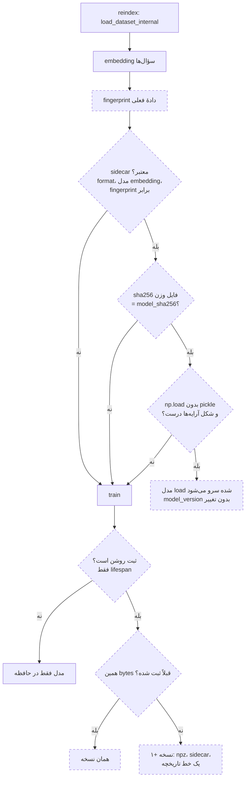

# SPEC: مدل intent به‌عنوان یک artifact ماندگار و نسخه‌دار (`intent-model`)

| Field | Value |
|-------|-------|
| Created | 2026-09-30 |
| Updated | 2026-09-30 |
| Status | Approved |
| Domain | search |
| Author | تیم پادیار |
| Sources | ارزیابی دانش‌بنیان («مدل اختصاصی ندارد»، «پوسته‌ای روی سرویس‌های آماده») + قرارداد مأموریت `20260930-danesh-t2/intentart-t1` + ADR-025 |

این سند قرارداد پیش از کد است. تصمیم‌های طراحی در ADR-025 آمده‌اند و اینجا
دوباره باز نمی‌شوند.

---

## ۱. هدف

هر نصب پادیار همین امروز مدل خودش را روی دادهٔ خودش آموزش می‌دهد
(`app/services/intent.py`: رگرسیون لجستیک چندکلاسه روی embedding سؤال‌ها،
که `dataset_id` را پیش‌بینی می‌کند). اما این مدل فقط در حافظهٔ پروسه زندگی
می‌کند: فایلی نیست، نسخه‌ای نیست، کیفیتش جایی ثبت نمی‌شود.

این SPEC مدل را به یک **artifact ماندگار، نسخه‌دار و قابل‌وارسی** تبدیل
می‌کند: ذخیره می‌شود، نسخه می‌گیرد، hash دارد، توضیح دارد، کیفیتش اندازه
گرفته می‌شود، و **فقط وقتی** از دیسک خوانده می‌شود که ثابت شود دقیقاً مدل
همین دادهٔ فعلی است.

## ۲. دامنه

### در دامنه

- ذخیرهٔ وزن‌ها به شکل `.npz` (فقط آرایهٔ عددی و رشته، بدون pickle).
- یک sidecar JSON خوانا با `cat` که مدل را توصیف می‌کند.
- یک «اثر انگشت آموزش» (training fingerprint) که تعیین می‌کند مدل روی دیسک
  برای دادهٔ فعلی معتبر است یا نه.
- مسیر load محافظت‌شده: اگر fingerprint و sha256 وزن‌ها درست بود، آموزش رد
  می‌شود و مدل از دیسک خوانده می‌شود. در هر حالت دیگر آموزش دوباره.
- `model_version` صحیح و افزایشی برای هر نصب، و یک فایل تاریخچهٔ محدود
  (JSON lines).
- ثبت روی دیسک فقط وقتی اپ سرویس‌دهنده آن را روشن کند (opt-in در lifespan).
- gauge دقت holdout و gauge نسخهٔ مدل در `/metrics`، و هر دو در
  `/api/ready`.
- یک CLI آموزش (`scripts/train/train_intent_model.py`) که فقط ورودی نازکی
  روی همان تابع آموزش است.
- کارت مدل (`MODEL_CARD.md`) با عددهایی که واقعاً اندازه گرفته شده‌اند.

### خارج از دامنه

- هیچ تغییری در نحوهٔ پاسخ‌دادن. دروازهٔ اعتماد وابسته به دقت در
  `search.classify_intent_local` دقیقاً همان می‌ماند.
- نگه‌داشتن وزن‌های نسخه‌های قدیمی. تاریخچه فقط metadata است.
- صفحهٔ ادمین برای مدل. عدد دقت و نسخه روی `/metrics` و `/api/ready` است.
  (بعداً در یک PR جدا اضافه شد: یک کارت فقط‌خواندنی در پنل. بخش ۱۴ را ببینید.)
- انتخاب hyperparameter یا مدل دیگر. `C=50` و بقیه همان مقدار امروزند.
- dependency تازه، migration، یا جدول دیتابیس.
- تغییر `scripts/run_eval.py` (مال track دیگری است).

## ۳. بازیگران / دسترسی

| بازیگر | از کجا | چه می‌کند |
|---|---|---|
| اپ سرویس‌دهنده | lifespan در `app/main.py` | ثبت را روشن می‌کند، سپس reindex مدل را load یا آموزش و ثبت می‌کند |
| ادمین | ویرایش محتوا در پنل (`verify_admin`) | به‌طور غیرمستقیم reindex می‌زند. endpoint تازه‌ای ندارد |
| worker دیگر | poll نسخهٔ index در `search.py` | reindex پس‌زمینه. همان مسیر |
| اسکریپت بیرون از اپ | `scripts/debug_similarity.py`، `scripts/run_eval.py --golden` | reindex بدون lifespan: شاید load کند، نمی‌نویسد و پاک نمی‌کند |
| اسکریپتی که اپ را با `TestClient` بالا می‌آورد | `scripts/run_eval.py --conversations` | lifespan ثبت را روشن می‌کند، پس اسکریپت باید پیش از import اپ `INTENT_MODEL_DIR` را به پوشهٔ موقت خودش ببرد. یک تست ایستا این را برای هر اسکریپت زیر `scripts/` چک می‌کند |
| CLI آموزش | `scripts/train/train_intent_model.py` | عمداً می‌نویسد: یک reindex با ثبت روشن. با `--corpus` فقط در یک پوشهٔ موقت |
| اپراتور | shell روی سرور | CLI آموزش را اجرا می‌کند، sidecar را با `cat` و وزن‌ها را با `shasum -a 256` وارسی می‌کند |
| Prometheus | `GET /metrics` با Bearer `METRICS_TOKEN` یا نشست ادمین | دو gauge تازه را می‌خواند |
| هر کسی | `GET /api/ready` (عمومی، همان قبل) | دقت و نسخه را در `detail` می‌بیند |

endpoint تازه‌ای ساخته نمی‌شود، پس قاعدهٔ دسترسی تازه‌ای هم نیست.

## ۴. جریان سیستم

گره‌های خط‌چین تازه‌اند. `train` همان تابع امروز است.

## ۵. رفتار

### ورودی‌ها

- بردارهای نرمال‌شدهٔ سؤال‌ها و برچسب `dataset_id` هر کدام (همان
  `_intent_training_set` امروز).
- متن نرمال‌شدهٔ همان سؤال‌ها (برای fingerprint).
- نام مدل embedding (تنظیم `ai_embedding_model` یا پیش‌فرض) و
  `embeddings.DEFAULT_MODEL_REVISION`.
- `config.INTENT_MODEL_DIR` (پیش‌فرض `data/intent-model`).

### خروجی‌ها

- `intent_classifier` در `search.py`، همان شیء امروز با چند فیلد توصیفی
  بیشتر (`model_version`، `training_fingerprint`).
- سه فایل در `INTENT_MODEL_DIR` (بخش ۷).
- gauge `intent_holdout_accuracy` و gauge تازهٔ `intent_model_version`.
- فیلدهای `intent_holdout_accuracy` و `intent_model_version` در
  `/api/ready`، و `accuracy=...` و `version=...` در متن `detail`.

### fingerprint آموزش

sha256 روی JSON کانونی (کلیدها مرتب، بدون فاصلهٔ اضافه، UTF-8) از:

- `format_version`
- `embedding_model_name` و `embedding_model_revision`
- `hyperparameters` (همان مقادیری که `train` استفاده می‌کند، از یک ثابت
  مشترک خوانده می‌شود)
- `pairs`: لیست مرتب‌شدهٔ `[متن نرمال‌شدهٔ سؤال، dataset_id]`
- `scikit_learn_version` و `numpy_version` (از دور بازبینی اول اضافه شد)

تغییر یک متن سؤال، یک نگاشت، یک synonym که متن نرمال‌شده را عوض کند، مدل
embedding، revision، یک hyperparameter، یا ارتقای scikit-learn یا numpy،
fingerprint را عوض می‌کند. پس «این همان مدلی است که کد فعلی روی این داده
می‌سازد» دقیقاً درست است. هزینهٔ یک ارتقا: یک بار آموزش، زیر یک ثانیه.

### شرط load (همه باید برقرار باشند)

1. sidecar وجود دارد و یک شیء JSON است.
2. `format_version` برابر نسخهٔ فرمتی است که کد می‌شناسد.
3. `embedding_model_name` و `embedding_model_revision` برابر مقدار فعلی‌اند.
4. `training_fingerprint` برابر fingerprint دادهٔ فعلی است.
5. sha256 بایت‌های فایل وزن برابر `model_sha256` است. همان بایت‌هایی که
   hash شده‌اند parse می‌شوند، نه یک خواندن دوم.
6. `numpy.load(..., allow_pickle=False)` موفق است، و آرایه‌ها نوع و شکل
   درست دارند (`coef` و `intercept` عدد اعشاری، `classes` رشته، ابعاد
   با هم و با بعد بردار سازگار).
7. عددهای holdout درون فایل وزن (`holdout`: دقت، اندازهٔ holdout، اندازهٔ
   پیکره) معقول‌اند: شمارش‌ها عدد صحیح، دقت بین ۰ و ۱ و کسری از holdout، و
   دقت فقط وقتی هست که holdout اجرا شده.
8. `holdout_accuracy`، `holdout_size` و `sample_count` در sidecar همان
   عددهای درون فایل وزن‌اند. رشته، bool، NaN یا عددی که اندازه گرفته نشده
   رد می‌شود.

چرا ۷ و ۸: دروازهٔ اعتماد در `search.classify_intent_local` دقت را
می‌خواند. اگر این عدد فقط در sidecar بود (یک فایل `0644` برای خواندن
انسان، بیرون از sha256)، ویرایش آن به `NaN` یا `0.99` دروازه را باز می‌کرد.
اکنون عدد سرو‌شده از فایل وزن زیر sha256 می‌آید.

هر شرطی که نقض شود: یک خط log با دلیل، و آموزش دوباره. هیچ‌کدام exception
به reindex نمی‌دهد.

### نسخه و تاریخچه

- `model_version` برای هر نصب یک عدد صحیح است که با هر مدل **تازه** که
  آموزش و ثبت می‌شود یکی بالا می‌رود. load آن را عوض نمی‌کند.
- نسخهٔ بعدی = بیشینهٔ (نسخهٔ sidecar، نسخهٔ آخرین خط تاریخچه) + ۱. پس
  حتی بعد از پاک‌شدن sidecar، شماره عقب نمی‌رود.
- اگر مدلی که همین حالا آموزش دیده بایت‌به‌بایت همان مدل ثبت‌شده است (همان
  fingerprint و همان sha256)، نسخهٔ تازه‌ای ساخته نمی‌شود. این حالت چند
  worker است که هم‌زمان یک ویرایش را reindex می‌کنند.
- هر نسخهٔ تازه یک خط به `intent-classifier.history.jsonl` اضافه می‌کند.
  سقف: ۵۰۰ خط (ثابت در کد). خط‌های قدیمی‌تر حذف می‌شوند.

### حالت‌ها

| وضعیت داده | نتیجه |
|---|---|
| کمتر از ۲ کلاس یا ۲۰ نمونه (یا صفر سؤال) | مدلی نیست. با ثبت روشن، وزن و sidecar پاک می‌شوند (تاریخچه می‌ماند). این حکم از خود داده است و embedding لازم ندارد |
| خطای گذرا: embedding در این boot نیست، یا خواندن سؤال‌ها شکست خورد | مدلی سرو نمی‌شود، ولی فایل‌ها **دست نمی‌خورند**. boot سالم بعدی همان مدل را با همان نسخه load می‌کند |
| داده بدون تغییر، artifact سالم | load، بدون آموزش، همان نسخه |
| دادهٔ تغییرکرده | آموزش، نسخه +۱، fingerprint تازه، یک خط تاریخچه |
| artifact خراب، دستکاری‌شده، ناسازگار | آموزش، با ثبت روشن نسخه +۱ |
| ثبت خاموش (اسکریپت بیرونی) | load یا آموزش در حافظه، دیسک دست نمی‌خورد |
| `INTENT_MODEL_DIR` خالی | هیچ artifact: نه load، نه نوشتن. همیشه آموزش در حافظه |

## ۶. API / قرارداد

endpoint تازه‌ای نیست. تغییرات در قراردادهای موجود:

- `GET /api/ready`: شیء provider محلی دو فیلد عددی دارد:
  `intent_holdout_accuracy` (۰ تا ۱ یا `null`) و `intent_model_version`
  (عدد صحیح یا `null`). `detail` مثلاً:
  `dataset=25 entries, backend=embedding+bm25, intent=trained, accuracy=0.840, version=3`.
  بخش `intent=trained|off` همان قبل است، پس هر خوانندهٔ قبلی نمی‌شکند.
- `GET /metrics`: دو سری بدون label:
  `intent_holdout_accuracy` (NaN یعنی اندازه‌گیری نداریم) و
  `intent_model_version` (NaN یعنی مدل ثبت‌شده‌ای نداریم).
- CLI: `python scripts/train/train_intent_model.py` یک reindex با ثبت روشن
  اجرا می‌کند، دقیقاً مثل اپ: اگر مدل ذخیره‌شده ثابت‌شده مال همین داده است
  load می‌کند (آموزش دوباره همان بایت‌ها را می‌ساخت)، وگرنه از همان `train`
  آموزش می‌دهد و نسخهٔ بعدی را ثبت می‌کند. sidecar را به شکل JSON روی stdout
  چاپ می‌کند. کد خروج ۰ یعنی یک مدل ثبت‌شده این داده را توصیف می‌کند، ۱
  یعنی مدلی نیست یا ثبت نشد (دلیل روی stderr).

## ۷. داده / ماندگاری

بدون جدول و بدون migration. فایل‌ها در `config.INTENT_MODEL_DIR`:

| فایل | محتوا | مجوز |
|---|---|---|
| `intent-classifier.npz` | `coef`، `intercept`، `classes` (رشته)، `holdout` (دقت، اندازهٔ holdout، اندازهٔ پیکره). بدون آرایهٔ object | `0600` (از محتوای مشتری ساخته شده) |
| `intent-classifier.json` | sidecar، کلیدها در ادامه | `0644` |
| `intent-classifier.history.jsonl` | یک خط JSON برای هر نسخه، حداکثر ۵۰۰ | `0644` |
| `.intent-artifact.lock` | قفل `flock` نویسنده‌ها | خالی |

کلیدهای sidecar: `format_version`، `model_version`، `model_file`،
`model_sha256`، `training_fingerprint`، `trained_at` (UTC، ISO-8601)،
`holdout_accuracy`، `holdout_size`، `sample_count` (کل پیکره)،
`class_count`، `embedding_model_name`، `embedding_model_revision`،
`hyperparameters`، `scikit_learn_version`، `numpy_version`.

هر فایل از راه یک فایل موقت و `os.replace` نوشته می‌شود. ترتیب نوشتن: وزن،
بعد sidecar، بعد تاریخچه. اگر وزن یا sidecar نوشته نشد، هر دو پاک می‌شوند:
نبودن رکورد صادقانه است، رکورد ناهمخوان نه.

همهٔ این مسیرها gitignore هستند: وزن‌های آموزش‌دیدهٔ مشتری دادهٔ خود اوست.

## ۸. خطا و حالت‌های لبه

- **دیسک پر یا فقط‌خواندنی:** log، reindex با مدل در حافظه ادامه می‌دهد.
- **خرابی نوشتن sidecar بعد از نوشتن وزن:** هر دو فایل پاک می‌شوند. هیچ
  sidecar دربارهٔ وزن دیگری نمی‌ماند.
- **چند worker هم‌زمان:** نوشتن زیر `flock` است. worker دوم sidecar را
  دوباره می‌خواند و اگر همان bytes ثبت شده، نسخه نمی‌سازد.
- **خواندن هم‌زمان با نوشتن:** load بدون قفل است. یک خواندن نیمه‌کاره در
  چک sha256 رد می‌شود و به آموزش می‌رسد.
- **فایل JSON خراب، فرمت ناشناخته، revision دیگر، فایل وزن گم‌شده:** هر کدام
  یک خط log و آموزش دوباره.
- **`.npz` با آرایهٔ object:** `allow_pickle=False` رد می‌کند، آموزش دوباره.
- **خطای خود آموزش:** همان رفتار امروز (`train` لاگ می‌کند و `None`
  برمی‌گرداند). try/except تازه هرگز دور `train` کشیده نمی‌شود.
- **`INTENT_MODEL_DIR` خالی:** نه ثبت و نه load، حتی در اپ. بدون این،
  مسیرها نسبی می‌شدند و اپ هر جفت فایلی را که در پوشهٔ شروعش بود سرو می‌کرد.
- **embedding در دسترس نیست یا خواندن سؤال‌ها شکست خورد:** خطای گذرا. مدل
  ذخیره‌شده پاک نمی‌شود، و boot بعدی همان نسخه را load می‌کند.

متن رو به بازدیدکننده تغییری نمی‌کند، چون پاسخ‌دادن تغییری نمی‌کند.

## ۹. امنیت / حریم خصوصی

- **هیچ pickle روی هیچ مسیر load.** unpickle کردن یک فایل یعنی اجرای کد از
  آن. کسی که بتواند در `INTENT_MODEL_DIR` بنویسد، با `.pkl` روی boot بعدی
  کد اجرا می‌کرد. با `.npz` و `allow_pickle=False` بدترین حالت یک مدل
  غلط است، و آن هم با fingerprint و sha256 رد می‌شود.
- **sha256 یک checksum است، نه امضا.** کسی که هم وزن و هم sidecar را عوض
  کند، از چک sha256 رد می‌شود. دفاع در برابر او این است که **فقط مالک
  بتواند در پوشه بنویسد**: جایگزین‌کردن فایل با مجوز نوشتن پوشه کنترل
  می‌شود، نه مجوز خود فایل. پوشه با `0755` ساخته می‌شود (umask ۰۰۲ آن را
  group-writable نمی‌کند). پوشه‌ای که از قبل هست، مجوزش را نگه می‌دارد.
  `0600` روی وزن‌ها فقط خواندن را می‌بندد.
  fingerprint همچنان باید با دادهٔ فعلی برابر باشد، پس مدل ساختگی باید روی
  همین سؤال‌ها ساخته شده باشد.
- **عددی که دروازه را کنترل می‌کند زیر sha256 است.** دقت holdout از فایل
  وزن خوانده می‌شود، نه از sidecar. ویرایش sidecar (مثلاً `NaN` یا `0.99`)
  مدل را رد می‌کند و آموزش دوباره می‌زند؛ دروازه را باز نمی‌کند.
- **دادهٔ مشتری:** وزن‌ها از محتوای مشتری ساخته می‌شوند. `0600`، gitignore،
  و هیچ‌جا بیرون فرستاده نمی‌شوند.
- **`/api/ready` عمومی است.** دقت و نسخه یک عدد کیفیت‌اند، نه اطلاعات حمله.
  کنار `dataset=<n> entries` که از قبل عمومی بود قرار می‌گیرند.
- **کیوسک:** این قابلیت حالت هیچ بازدیدکننده‌ای را نگه نمی‌دارد. نفر بعدی
  پشت همان مرورگر چیزی از نفر قبل به ارث نمی‌برد، چون مدل از محتوای ادمین
  ساخته می‌شود، نه از گفتگوها.
- **تست‌ها:** fixture خودکار در `tests/conftest.py` پوشه را برای هر تست به
  `tmp_path` می‌برد، و یک تست نگهبان اگر آن fixture حذف شود قرمز می‌شود.

## ۱۰. وضعیت‌های UX

- Default: N/A، این قابلیت UI ندارد. پاسخ‌های چت تغییری نمی‌کنند.
- Loading: N/A
- Success: N/A
- Empty: N/A
- Error: N/A
- Disabled: N/A
- Permission denied: N/A
- Long content / overflow: N/A
- Mobile / narrow viewport: N/A
- Accessibility: N/A

## ۱۱. سازگاری / انتشار

- **ماژول:** بخشی از `search` و `chat` (هستهٔ همیشه‌روشن)، چون مدل intent
  همین امروز در هسته است. ماژول تازه‌ای نیست.
- **فراخوان‌های `load_dataset_internal()` که بررسی شدند:** lifespan در
  `app/main.py`، `reindex_and_publish` و poll در `search.py`،
  `scripts/run_eval.py:444`، `scripts/debug_similarity.py:22`، و تست‌ها.
  `debug_similarity.py` و حالت `--golden` در `run_eval.py` بدون lifespan
  کار می‌کنند و تغییری لازم ندارند. حالت `--conversations` در
  `run_eval.py` اپ را با `TestClient` بالا می‌آورد، پس یک خط لازم داشت:
  `INTENT_MODEL_DIR` کنار `DB_PATH` و `LOGS_DB_PATH` به پوشهٔ موقت می‌رود
  (استثنای مالکیت در دور سوم بازبینی). بدون آن خط، اجرای آن رکورد نصب را
  پاک می‌کرد (اندازه‌گیری‌شده).
- **نصب موجود:** اولین boot فایلی پیدا نمی‌کند، آموزش می‌دهد و نسخهٔ ۱ را
  ثبت می‌کند. boot بعدی با همان داده load می‌کند.
- **Rollback:** پوشه را پاک کنید. reindex بعدی دوباره می‌سازد. کد قدیمی
  فایل‌ها را نمی‌خواند.
- **env تازه:** `INTENT_MODEL_DIR` در `.env.example`.

## ۱۲. معیارهای پذیرش

- [ ] SC-001: بعد از reindex سرویس‌دهنده با دادهٔ کافی، `.npz` و sidecar هر دو موجود و غیرخالی‌اند.
- [ ] SC-002: sidecar همهٔ کلیدهای بخش ۷ را دارد. دقت برابر عددی است که `train` حساب کرد و `model_sha256` برابر sha256 بایت‌های فایل وزن است.
- [ ] SC-003: با دادهٔ بدون تغییر، reindex دوم (حالت تازهٔ پروسه) load می‌کند: `train` صدا زده نمی‌شود، نسخه تغییر نمی‌کند، احتمال‌ها برابرند.
- [ ] SC-004: یک متن یا یک نگاشت عوض شود: آموزش، نسخه +۱، fingerprint تازه، یک خط تاریخچهٔ تازه.
- [ ] SC-005: وزن با sha256 ناهمخوان هرگز سرو نمی‌شود، آموزش دوباره با log. کنترل: همان فایل بدون بایت دستکاری‌شده load می‌شود.
- [ ] SC-006: artifact با fingerprint دیگر هرگز سرو نمی‌شود.
- [ ] SC-007: `.npz` نیازمند pickle هرگز load نمی‌شود. کنترل: `.npz` عددی ساده load می‌شود.
- [ ] SC-008: فایل گم‌شده، JSON خراب، `format_version` ناشناخته، revision دیگر: هر کدام آموزش دوباره، بدون exception.
- [ ] SC-009: مدل load‌شده همان `classify()` و همان احتمال (تا 1e-9) را می‌دهد.
- [ ] SC-010: `load_dataset_internal()` بیرون از lifespan پوشهٔ پر را بایت‌به‌بایت دست‌نخورده می‌گذارد.
- [ ] SC-011: هیچ تستی پوشهٔ واقعی را لمس نمی‌کند. تست نگهبان بدون fixture قرمز می‌شود.
- [ ] SC-012: خرابی نوشتن هر کدام از دو فایل reindex را نمی‌شکند و sidecar ناهمخوان باقی نمی‌گذارد.
- [ ] SC-013: `/metrics` دو gauge را دارد و `/api/ready` دقت و نسخه را.
- [ ] SC-014: CLI روی بک‌اند SQLite تست آموزش می‌دهد، ثبت می‌کند و sidecar را چاپ می‌کند.
- [ ] SC-015: `tests/test_intent_routing.py tests/test_embedding_search.py tests/test_metrics.py` بدون ویرایش سبزند (پایه: 30 passed).

### تست‌ها

`tests/test_intent_artifact.py` همهٔ معیارها را پوشش می‌دهد. تست‌های reindex
از `load_dataset_internal()` واقعی روی SQLite با یک embedder جعلی می‌گذرند،
پس بدون شبکه و بدون دانلود مدل اجرا می‌شوند.

## ۱۳. مستندات مرتبط

- PRD: ندارد. انگیزه در بخش ۱ و در ADR-025.
- Spike: ندارد. الگوی موجود: نوشتن اتمی با فایل موقت و `os.replace`، همان
  مسیر نسخهٔ نوشتنی قبلی در `app/services/intent.py`، و fixtureهای
  redirect در `tests/conftest.py` (`_never_touch_the_real_env_file`).
- ADR: ADR-025 در `docs/engineering/DECISIONS.md`.
- Plan: ندارد. کار یک PR است با یک علت ریشه‌ای.
- کارت مدل: `docs/features/intent-model/MODEL_CARD.md`.
- مانیتورینگ: `docs/engineering/MONITORING.md`.

## ۱۴. نمای پنل ادمین (افزوده در PR بعدی)

این بخش بعد از تأیید این SPEC اضافه شد. شاخهٔ
`feat/admin-own-model-readout` روی همین کار سوار است.

- **کجا:** پنل ادمین، منوی «هوش مصنوعی»، صفحهٔ «مدل‌ها»
  (`/secure-panel-admin/ai/models`). اولین کارت صفحه: «مدل اختصاصی این نصب».
- **داده از کجا:** `GET /admin/api/ai/own-model` در `app/routers/admin_ai.py`،
  پشت همان `Depends(verify_admin)` کل router. این endpoint اول
  `search._maybe_refresh()` و بعد `intent.read_record(search.intent_classifier)`
  را صدا می‌زند.
- **منبع حقیقت، مدلی است که الان پاسخ می‌دهد.** یعنی طبقه‌بند درون حافظهٔ
  همین پروسه، که از مسیر load وارسی‌شده یا یک آموزش تازه آمده. فایل‌ها فقط
  آن را تأیید می‌کنند. `IntentClassifier` برای این کار یک فیلد فقط‌خواندنی
  `model_sha256` دارد که همان‌جا پر می‌شود که `model_version` پر می‌شود.
- **فقط خواندن:** sidecar و تاریخچه خوانده می‌شوند. از فایل وزن فقط sha256
  بایت‌ها گرفته می‌شود؛ وزن‌ها parse نمی‌شوند. خود کارت قفل نمی‌گیرد، پوشه
  نمی‌سازد، آموزش نمی‌دهد، چیزی نمی‌نویسد و پاک نمی‌کند. هیچ دکمه‌ای در کارت
  چیزی را عوض نمی‌کند. یک استثنا: در workerی که از نسخهٔ index عقب است،
  باز کردن کارت همان reindex پس‌زمینه‌ای را شروع می‌کند که یک پرسش چت هم
  شروع می‌کرد (بخش «لحظه‌های گذرا»). آن reindex مسیر عادی خودش را می‌رود:
  مدل را load می‌کند یا اگر لازم باشد دوباره آموزش می‌دهد و ثبت می‌کند.
- **چهار حالت** (`state`):
  - `trained`: مدلی پاسخ می‌دهد، sidecar دقیقاً همان را می‌گوید که مدل
    می‌گوید (نسخه، sha256، اثر انگشت، دقت، اندازهٔ holdout، تعداد پرسش‌ها و
    موضوع‌ها، نام و revision مدل embedding، نسخهٔ scikit-learn و numpy)، و
    sha256 فایل وزن برابر sha256 همان مدل است. کارت: «این نصب مدل
    آموزش‌دیدهٔ خودش را دارد.» با نسخه، تاریخ آموزش، تعداد پرسش‌ها و موضوع‌ها،
    و دقت در سه جملهٔ ساده: «در آزمون، از هر ۱۰۰ پرسش حدود N پرسش درست
    تشخیص داده شد. برای این آزمون M پرسش کنار گذاشته شد و یک مدل آزمایشی روی
    بقیهٔ پرسش‌ها آموزش دید. مدلی که الان کار می‌کند بعد از آزمون روی همهٔ
    پرسش‌ها آموزش دیده است.» (همان چیزی که `train()` می‌کند؛ بخش ۵ کارت مدل.)
    همهٔ عددها از مدل در حال کار می‌آیند. **`trained_at` تنها چیزی است که
    فایل‌ها تأییدش نمی‌کنند:** فقط از sidecar می‌آید، پس یک تاریخ
    ویرایش‌شده نشان داده می‌شود.
  - `not_saved`: `INTENT_MODEL_DIR` خالی است، یعنی اپراتور خواسته این نصب
    رکوردی روی دیسک نگه ندارد. مدلی پاسخ می‌دهد و عددهایش از حافظه می‌آیند و
    واقعی‌اند. کارت همان خط سبز را می‌گوید، و یک خط ساده: «این نصب نسخه‌ای از
    مدل را روی دیسک نگه نمی‌دارد، پس شمارهٔ نسخه و تاریخچه ندارد.» نسخه،
    تاریخ، sha256 و تاریخچه نشان داده نمی‌شوند. هیچ فایلی خوانده نمی‌شود.
  - `none`: مدلی پاسخ نمی‌دهد و sidecar هم نیست. «این نصب فعلاً مدل
    آموزش‌دیده ندارد.» و «برای ساخت مدل دست‌کم ۲۰ پرسش در ۲ موضوع لازم است.»
    (`needs`، از `HYPERPARAMETERS`). کارت نمی‌گوید «پرسش اضافه کنید»، چون
    علت ممکن است دادهٔ کم نباشد: اگر مدل embedding در این boot بار نشود، با
    هر تعداد پرسشی هم مدلی ساخته نمی‌شود.
  - `unreadable`: هر حالت دیگر. sidecar خراب، sidecar با عددهای ویرایش‌شده
    (حتی عددهای باورپذیر)، وزن‌های دیگر، رکورد بدون مدل در حال کار، یا مدلی
    که با پوشهٔ تنظیم‌شده ثبت نشده (مثلاً قفل نویسنده تمام شد). «پروندهٔ
    ذخیره‌شدهٔ مدل خوانده نشد یا با مدلی که الان کار می‌کند یکی نیست. چت‌بات
    همچنان پاسخ می‌دهد.» در این حالت **هیچ عددی از مدل فعلی** نشان داده
    نمی‌شود. جدول تاریخچه (اگر خوانده شود) می‌ماند.
- **دقت اندازه‌گیری‌نشده** (`null`) با کلمه نوشته می‌شود، هرگز ۰ یا NaN.
- **تاریخچه جدا است و هرگز `state` را عوض نمی‌کند.** هر خط جدا وارسی می‌شود:
  قالبش باید یکی از قالب‌های شناخته‌شده باشد (۱ تا `FORMAT_VERSION`، چون فایل
  خط‌های قدیمی را بعد از تغییر قالب نگه می‌دارد) و شش فیلد نمایشی‌اش عددهایی
  باشند که `train()` می‌توانست بسازد (همان `_holdout_numbers`). وقتی مدل
  `trained` است، خطی که نسخه‌اش از مدل تأییدشده بالاتر است، یا خط همان نسخه
  که حتی یک فیلدش (تاریخ هم) با مدل تأییدشده فرق دارد، هم رد می‌شود. خطی که
  رد شود نشان داده نمی‌شود. `history_status`: `ok`، `partial` (چند خط رد شد؛
  یک خط توضیح زیر جدول) یا `unreadable` (خود فایل خوانده نشد یا بزرگ‌تر از
  `HISTORY_MAX_BYTES` است؛ جدول پنهان می‌شود و یک خط توضیح می‌آید). ۱۰ خط
  معتبر آخر، جدیدترین اول (`HISTORY_SHOWN`).
- **سقف خواندن تاریخچه:** `HISTORY_MAX_BYTES` = `HISTORY_MAX_LINES` × ۴ کیلوبایت
  (۲ مگابایت). یک خط واقعی کمتر از ۱ کیلوبایت است. خط‌ها در یک `deque` با
  طول `HISTORY_SHOWN` جمع می‌شوند، پس فقط ۱۰ خط در حافظه می‌ماند.
- **حد این وارسی:** خط‌های قدیمی‌تر از نسخهٔ فعلی وزن ندارند، پس فقط
  معقول‌بودنشان وارسی می‌شود، نه درستی‌شان. ویرایش باورپذیر یک خط قدیمی دیده
  نمی‌شود. وقتی مدل تأیید نشده (`none`، `unreadable`) خط‌ها با هیچ مدلی
  مقایسه نمی‌شوند.
- **لحظه‌های گذرا:** دو حالت کارت را کوتاه‌مدت به `unreadable` می‌برد.
  - reindex خود همین worker. `record_artifact` نسخهٔ تازه را در میانهٔ
    reindex ثبت می‌کند، ولی `search.intent_classifier` فقط در پایان reindex
    عوض می‌شود. در این فاصله (باقی‌ماندهٔ همان reindex، نه چند میلی‌ثانیه)
    فایل از مدل در حال کار جلوتر است. همین‌طور وسط پاک‌کردن رکورد، بین پاک
    شدن وزن و sidecar. تازه‌کردن صفحه بعد از پایان reindex درستش می‌کند.
  - نصب چند worker دارد (`--workers`). worker‌ی که ویرایش ادمین را گرفته
    نسخهٔ تازه را ثبت می‌کند، ولی بقیه هنوز مدل قبلی را سرو می‌کنند. این
    endpoint مثل مسیر پرسش‌ها اول `search._maybe_refresh()` را صدا می‌زند:
    حداکثر هر `INDEX_REFRESH_SECONDS` ثانیه یک بار نسخهٔ index را می‌خواند، و
    اگر عقب باشد reindex را **در پس‌زمینه** شروع می‌کند. پس همان درخواستی که
    عقب‌بودن را می‌بیند هنوز مدل قبلی و هشدار را نشان می‌دهد؛ اولین
    تازه‌کردن صفحه بعد از تمام‌شدن reindex در آن worker مدل تازه را نشان
    می‌دهد. هر تازه‌کردن ممکن است به worker دیگری برسد، پس تا همهٔ workerها
    reindex کنند کارت ممکن است بین سبز و هشدار عوض شود.
- **جزئیات فنی** پشت یک toggle بسته: sha256، اثر انگشت آموزش، نام و revision
  مدل embedding، نسخهٔ scikit-learn و numpy. در `not_saved` ردیف sha256 نیست.
- **چه چیزی بیرون نمی‌رود:** هیچ مسیر فایل، نام پوشه، نام فایل، hyperparameter
  یا متن exception. همهٔ رشته‌ها در مرورگر escape می‌شوند.
- **تست‌ها:** `tests/test_admin_own_model.py` (endpoint) و
  `tests/e2e/test_admin_own_model_e2e.py` (مرورگر، async Playwright).
