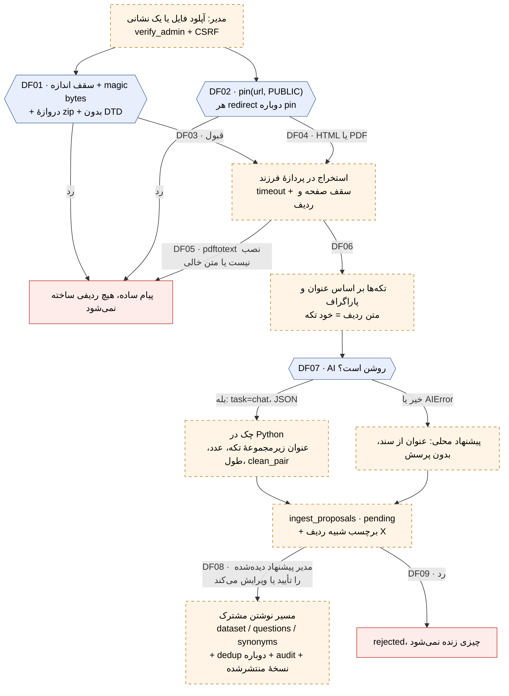

# SPIKE: ورود نیمه‌خودکار دانش از سند و وب‌سایت

**Status:** Resolved
**Outcome:** نتیجه با تأیید SPEC توسط Sina در chat در 2026-09-30 (منتقل‌شده توسط Foreman db5-ingest) پذیرفته شد.
**Owner:** ingest-t1-res (عامل پژوهش، Claude Opus 5.5). مالک فنی و بازبین انسانی: Sina
**Timebox:** یک نوبت کاری (turn 1 از مأموریت `20260930-danesh-t5-ingest`)
**Date:** 2026-09-30
**Base commit:** `3a4a415` (همهٔ ارجاع‌های `path:line` روی همین commit هستند)

## 1. Question

این نصب چطور باید یک سند آپلودشده (PDF، DOCX، XLSX، CSV، TXT/MD) یا نشانی یک
صفحهٔ وب را، به‌شکل امن و با تجزیهٔ فقط محلی، به پیشنهاد ردیف دانش (`dataset`)،
پرسش (`questions`) و مترادف (`synonyms`) تبدیل کند، طوری که هیچ‌چیز بدون تأیید
انسان زنده نشود؟

زیرپرسش‌هایی که این سند باید جواب بدهد (از SPEC تیم، بخش ۲):

1. کتابخانهٔ استخراج متن برای هر قالب، و کیفیت متن فارسی.
2. امنیت آپلود: magic bytes، سقف اندازه، zip bomb، حملهٔ XML، سقف صفحه و ردیف، timeout.
3. امنیت نشانی وب (SSRF): scheme، IP خصوصی، redirect، DNS rebinding، سقف اندازه و زمان.
4. تکه‌تکه کردن (chunking) متن فارسی، نگاشت تکه به ردیف دانش، و حذف تکراری.
5. گام AI از مسیر wrapper موجود، سازگار با مدل محلی، و قاعدهٔ grounding.
6. محل نگه‌داری پیشنهادها پیش از تأیید، جریان تأیید، سابقهٔ ممیزی، و بازسازی نمایه.
7. شکل ماژول، پوشش CSRF، و قاعدهٔ migration.
8. کار طولانی: درخواست همگام، کار پس‌زمینه، یا جدول job.
9. استفادهٔ دوباره از اسکریپت‌های موجود یا ساخت دوباره.

## 2. Why It Matters

ارزیاب دانش‌بنیان در دلیل ۲ و ۳ نوشته است: «ورود دستی دانش» و «دانش، پرسش‌ها و
مترادف‌ها دستی مدیریت می‌شوند». امروز تنها راه ورود انبوه، فایل CSV/JSON با
ستون‌های از پیش آماده است (`app/routers/dataset.py:457`، `app/routers/dataset.py:516`).
یعنی کسی باید اول سند را دستی به جدول تبدیل کند.

چیزی که منتظر این پاسخ است:

- SPEC این قابلیت (`docs/features/knowledge-ingestion/SPEC.md`، واحد B). بدون
  انتخاب کتابخانه، مدل امنیتی و محل staging، SPEC فقط حدس می‌نویسد.
- یک ADR تازه (ADR-023). اصل «انتشار دانش فقط با دروازهٔ انسانی» (ADR-006) در
  2026-09-15 بازنشسته شد (`docs/engineering/DECISIONS.md:33`). این قابلیت دوباره
  همان اصل را لازم دارد و باید آن را با تصمیم تازه برگرداند.

محدودیت محصول (CLAUDE.md): مدیر غیرفنی باید بتواند کار را با «آپلود، نگاه، تأیید»
تمام کند. هر تنظیم اضافه یا اصطلاح فنی روی این صفحه، خلاف این اصل است.

## 3. Context

### آنچه امروز وجود دارد

| تکه | کجا | نکته |
|-----|-----|------|
| ورود CSV/JSON | `app/routers/dataset.py:457`، `:516`، تجزیه در `_decode_rows` (`:391`) | بدون سقف اندازه: `raw = await file.read()` (`:461`، `:520`) |
| نوشتن ردیف دانش | `create_dataset_item`، `app/routers/dataset.py:165` | SQL درون روتر است، نه سرویس |
| نوشتن پرسش | `_insert_question`، `app/routers/dataset.py:237` | «تنها INSERT» پشت هر ساخت پرسش |
| نوشتن مترادف | `_insert_synonym_pairs`، `app/routers/synonyms.py:19` | همان مسیر افزودن دستی |
| بازسازی نمایه | `_trigger_reindex`، `app/routers/dataset.py:27-40` → `reindex_and_publish`، `app/services/search.py:365` | در executor اجرا می‌شود و منتظرش نمی‌مانیم |
| پیشنهاد پرسش با AI | `app/services/question_assist.py` (تماس در `:112-120`، اعتبارسنجی `_clean_suggestions` در `:139`) | پیشنهاد فقط به مرورگر برمی‌گردد، جدول staging ندارد |
| پیشنهاد مترادف با AI | `app/services/synonym_suggest.py` (`clean_pair` در `:83`، cooldown در `:198`) | همان الگو |
| wrapper هوش مصنوعی | `padyar_ai.generate`، `app/services/ai/wrapper.py:29`، نمونه در `:109` | فقط دو task: `chat` و `classify` (`app/services/ai/request.py:37-39`) |
| سیاست نشانی خروجی | `app/services/ai/endpoint_policy.py` (`validate` در `:220`، `pin` در `:289`) | برای base URL مدل ساخته شده |
| آپلود لوگو | `upload_logo`، `app/routers/admin.py:869` | بهترین الگوی آپلود امروز: خواندن با سقف (`:883-884`) و magic bytes (`:890`) |
| صف بازبینی | `dataset_edits`، `app/services/leads.py:360`؛ تأیید `review_edit` در `:1694`؛ برگشت `revert_edit` در `:1770` | تنها الگوی staging با تأیید انسانی در کد |
| job طولانی | `sms_campaigns`: جدول `app/services/campaigns.py:49`، `launch` در `:286`، `run` در `:193`، شروع با `BackgroundTasks` در `app/routers/leads.py:907-919`، poll در `:923` | الگوی «ردیف وضعیت + کار پس‌زمینه + poll» |

### محدودیت‌هایی که هر گزینه باید رعایت کند

- **اجرا:** Python 3.10+، FastAPI، PostgreSQL 16 در تولید، SQLite فقط برای تست.
  تولید با سه worker اجرا می‌شود: `--workers ${WEB_CONCURRENCY}`
  (`deploy/systemd/padyar-app.service.template:36`) و `WEB_CONCURRENCY=3`
  (`deploy/env/instance.env.template:35`). پس حالت یک job نمی‌تواند در حافظهٔ یک
  worker بماند.
- **ماژول:** هر قابلیت تازه یک ماژول اختیاری است (`is_core=False`) در
  `app/modules/registry.py:25`. نمونه: `leads` در `app/modules/registry.py:119-125`.
- **تجزیهٔ محلی:** برای خواندن سند هیچ API بیرونی مجاز نیست.
- **مدل محلی (Track 3):** گام AI باید بدون تغییر روی یک مدل محلی سازگار با OpenAI
  (llama.cpp از مسیر آداپتور `openai_compatible`) کار کند.
- **Grounding (ADR-018):** مدل انتخاب می‌کند، واقعیت نمی‌نویسد
  (`docs/engineering/DECISIONS.md:208-265`).
- **امنیت:** فقط مدیر (`verify_admin`). جهش‌ها زیر پیشوندهای CSRF
  (`app/auth/csrf.py:55`) و تست انطباق `tests/test_csrf.py:216`.
- **Migration:** فایل تازهٔ شماره‌دار، هرگز ویرایش یک migration اجراشده. بالاترین
  شمارهٔ فعلی در `migrations/` برابر 0029 است.

## 4. Investigation

### Evidence

#### E1. بدنهٔ درخواست فقط با Content-Length محدود می‌شود

`MAX_BODY_BYTES` پیش‌فرض ۵۱۲ مگابایت است (`app/main.py:343`) و middleware فقط
هدر `Content-Length` را می‌خواند (`app/main.py:346-356`). بدنهٔ chunked بدون این
هدر چک نمی‌شود. پس هر endpoint آپلود باید خودش با سقف بخواند، مثل
`file.read(LOGO_MAX_BYTES + 1)` در `app/routers/admin.py:883`. ورود CSV امروز این
کار را نمی‌کند (`app/routers/dataset.py:461`).

#### E2. کمکی مشترک برای magic bytes وجود ندارد

`_sniff_image_format` (`app/routers/admin.py:851`) خصوصیِ روتر مدیر است و فقط
PNG/JPEG/GIF/WebP را می‌شناسد. برای PDF و ZIP (DOCX/XLSX) کد تازه لازم است.

#### E3. سیاست نشانی موجود قابل استفادهٔ دوباره است، اما کامل نیست

آنچه `endpoint_policy` دارد:

- فقط `http`/`https` (`app/services/ai/endpoint_policy.py:78`).
- ردهٔ `public` برای http خطا می‌دهد (`:249-251`) و IP خصوصی را رد می‌کند
  (`:266-271`).
- نشانی‌های metadata ابری در هر رده بسته‌اند (`:124-131`)؛ link-local و
  multicast و reserved هم (`_is_forbidden_everywhere`، `:141`).
- `_resolve` همهٔ پاسخ‌های DNS را چک می‌کند، نه فقط اولی (`:186`).
- `pin` یک بار resolve می‌کند و نشانی اتصال را روی IP چک‌شده قفل می‌کند (`:289`).
  این همان دفاع DNS rebinding است.

آنچه ندارد، یا برای مصرف ما مناسب نیست:

- ردهٔ `internal` عمداً loopback را باز می‌گذارد (`:147-153`) تا مدل محلی
  کار کند. واکشی صفحهٔ وب باید همیشه `PUBLIC` بگذرد.
- کلاینت آداپتور redirect را دنبال نمی‌کند (`app/services/ai/adapters/base.py:69`)
  و روی 3xx خطا می‌دهد (`:379-381`). `assert_safe_redirect` (`:358-365`) فقط
  `validate` را صدا می‌زند و IP را قفل نمی‌کند، و هیچ فراخواننده‌ای در `app/` ندارد
  (با `grep -rn assert_safe_redirect app/` فقط در توضیح‌ها آمده است).
- پاسخ بدون سقف اندازه خوانده می‌شود (`app/services/ai/adapters/base.py:390`).

#### E4. wrapper هوش مصنوعی همهٔ چیزی که لازم است را دارد

- `generate(..., task="chat", response_format="json_object", timeout_s=...)`
  (`app/services/ai/wrapper.py:29-31`). حالت JSON در `app/services/ai/request.py:51` و در آداپتور
  `openai_compatible` به `{"type": "json_object"}` تبدیل می‌شود
  (`app/services/ai/adapters/openai_compatible.py:124-125`).
- `question_assist` دقیقاً همین شکل را بدون task تازه استفاده می‌کند
  (`app/services/question_assist.py:112-120`). ADR-018 دلیل را نوشته است: task
  تازه یعنی migration روی `app.ai_routes` و چهار جای تازه برای خطا.
- وقتی AI خاموش است، `AIError(code="provider_unavailable")` می‌آید
  (`app/services/ai/engine.py:87-91`). پس «AI خاموش» یک استثنای مشخص است که
  می‌شود به حالت محلی برگرداند.
- برای مدل محلی: هدفی که کلید ندارد رد می‌شود (`app/services/ai/engine.py:75-76`).
  llama.cpp بی‌کلید به یک کلید ساختگی و ردهٔ `internal` نیاز دارد. این کار Track 3
  است، نه این قابلیت.
- سقف پیش‌فرض خروجی `chat` برابر ۵۵۵ توکن و timeout برابر ۴۵ ثانیه است
  (`app/services/ai/engine.py:45-47`).

#### E5. نرمال‌سازی و امبدینگ برای حذف تکراری آماده است

- `normalize_persian(text, expand_synonyms=True)` (`app/utils/normalizer.py:136`)
  ي/ك عربی را به ی/ک فارسی تبدیل می‌کند (`:146`) و نیم‌فاصله را به فاصله (`:149`).
  برای مقایسه خوب است، برای ذخیره نه، چون نیم‌فاصله را از بین می‌برد.
- `build_index` (`app/services/embeddings.py:136`) و `search_topk`
  (`app/services/embeddings.py:114`) با مدل `minishlab/potion-multilingual-128M`
  (`:23`). امتیاز خروجی کالیبره شده است (`_calibrate`، `:88`)، نه کسینوس خام. پس
  آستانهٔ «تقریباً تکراری» باید روی همین مقیاس اندازه‌گیری شود.

#### E6. مسیر ورود CSV امروز داده را از بین می‌برد

حالت «add» در `import_dataset` کل جدول را از نو می‌نویسد: ردیف‌ها فقط با
`id, title, text, video_url` خوانده می‌شوند (`app/routers/dataset.py:494-512`) و
`save_dataset` اول `DELETE FROM dataset` می‌زند و فقط
`id, title, text, video_url, position` را برمی‌گرداند (`app/db/queries.py:282-296`).
پس هر ورود، `title_en` و `text_en` همهٔ ردیف‌ها را خالی می‌کند (ستون‌ها در
`app/db/connection.py:238-246`). این یافته خارج از دامنهٔ این spike است (بخش ۹)،
اما نتیجهٔ مهمی دارد: **مسیر تأیید این قابلیت نباید از `save_dataset` بگذرد.**

#### E7. الگوی job طولانی و کمبود آن

`sms_campaigns` یک ردیف با وضعیت `running` می‌سازد
(`app/services/campaigns.py:297`)، کار را با `BackgroundTasks` در همان worker
اجرا می‌کند (`app/routers/leads.py:919`) و پنل با GET وضعیت را می‌خواند
(`app/routers/leads.py:923`). وضعیت‌ها `running/done/stopped` هستند
(`app/services/campaigns.py:47`). در جست‌وجو هیچ کدی پیدا نشد که ردیف
`running` را بعد از restart شدن worker بازیابی کند. با سه worker و deploy هایی
که سرویس را restart می‌کنند، این کمبود برای ingest (که دقیقه‌ها طول می‌کشد)
واقعی است.

#### E8. اسکریپت‌های موجود

| اسکریپت | چه می‌کند | قابل استفادهٔ دوباره؟ |
|---------|-----------|-----------------------|
| `scripts/import-content.py` | FAQ و فهرست شرکت‌ها را از XLSX می‌خواند (`openpyxl`، `:58`)، با SQL خام می‌نویسد | فقط ایدهٔ تشخیص سرستون. SQL خام نه، چون از مسیر نوشتن مشترک نمی‌گذرد |
| `scripts/import-guide-from-crawl.py` | جدول‌های `crawl.*` را به جدول راهنما کپی می‌کند (`read_crawl`، `:96`) | نه. کار پایگاه‌داده به پایگاه‌داده است، سند نمی‌خواند |
| `scripts/train/talksiran_crawl.py` | یک سایت ثابت را با `httpx` و `bs4` می‌خزد (`:23-32`) | نه. host و الگوی لینک ثابت است و هیچ دفاع SSRF ندارد |

### Experiments / Prototypes

همهٔ آزمایش‌ها **دور ریختنی** هستند. در یک venv جدا زیر
`/private/tmp/claude-501/.../scratchpad/exp/` با Python 3.12 اجرا شدند، نه در
`.venv` مشترک. هیچ‌کدام کد تولید نیست و وارد مخزن نمی‌شود.

**نمونه:** شش خط فارسی (`sample.txt`): دو عنوان، هشت نیم‌فاصله، عدد فارسی
(`۹`، `۱۸`، `۱۵`، `۲٬۵۰۰٬۰۰۰`)، یک جمله با ک و ی عربی، و یک ایمیل انگلیسی.
PDF با Chrome headless (chromium-1243) از HTML ساخته شد، یک بار با فونت
Vazirmatn (فونت Type 3 در PDF) و یک بار با Geeza Pro (CID TrueType). DOCX با
python-docx و XLSX با openpyxl ساخته شد.

**محدودیت نمونه:** PDF خروجی Word، PDF اسکن‌شده، و فایل واقعی مشتری آزموده
نشد. نتیجه‌ها برای این دو PDF معتبرند، نه برای همهٔ PDFها.

**X1. کیفیت استخراج متن فارسی**

فرمان: `./venv/bin/python extract_check.py` و `./venv/bin/python layout.py`.
`chars_ratio` نسبت `difflib.SequenceMatcher` روی نویسه‌ها با متن منبع است و
`token_order_ratio` همین نسبت روی توالی کلمه‌ها.

| ابزار (نسخه) | PDF با Vazirmatn | PDF با Geeza Pro | نیم‌فاصله | عدد |
|--------------|------------------|------------------|-----------|-----|
| pypdf 6.19.0 | 0.333 / 0.129، ۱۸۲ نویسهٔ presentation form | 0.584 / 0.380 | 0 از 8 | **وارونه:** `۱۸`→`۸۱`، `۲٬۵۰۰٬۰۰۰`→`۰۰۰٬۰۰۵٬۲` |
| pypdf حالت `layout` | 0.238 / 0.045 | 0.289 / 0.055 | 0 از 8 | درست، اما حروف همه وارونه |
| pdfminer.six 20260107 | 0.244 / 0.055 | 0.286 / 0.055 | 0 از 8 | متن به ترتیب دیداری (وارونه) |
| PyMuPDF 1.28.2 | 0.699 / 0.603 | 0.612 / 0.496 | 8 از 8 | درست، اما تکه‌های یک خط دور عدد جابه‌جا |
| poppler `pdftotext` 26.02.0، بعد از حذف U+202A..U+202E | **0.985 / 0.827** | **0.982 / 0.812** | 8 از 8 | درست |
| python-docx 1.2.0 | 1.000 / 1.000 (DOCX) | | 8 از 8 | درست |
| stdlib `zipfile` + `defusedxml` (DOCX) | ۶ پاراگراف، برابر دقیق با منبع، سبک `Heading2` خوانده شد | | 8 از 8 | درست |
| openpyxl 3.1.5 (XLSX) | همهٔ ردیف‌ها درست | | 7 از 7 | درست |
| stdlib/bs4 `html.parser` (HTML) | 1.000 / 1.000 | | 8 از 8 | درست |

نمونهٔ خروجی pypdf (PDF با Vazirmatn، بعد از NFKC):
`... در ورودی بخرند.۸۱ صبح تا ۹نمایشگاه هر روز از ساعت`

نمونهٔ خروجی `pdftotext` خام (کاراکترهای کنترل bidi نشان داده شده):
`<RLE>نمایشگاه هر روز از ساعت <LRE> ۹<PDF>صبح تا <LRE> ۱۸<PDF>باز است ...`

باقی‌ماندهٔ خطا در بهترین ابزار (`pdftotext`):

- فاصلهٔ بین عدد و کلمهٔ بعدی از بین می‌رود (`۹صبح`).
- جای نقطه در یک جمله جابه‌جا شد (`پر کنند .هزینٔه`).
- همزهٔ «هزینهٔ» قبل از «ه» آمد (`هزینٔه`).
- در PDF با Geeza Pro، «متن» به «منت» تبدیل شد. PyMuPDF هم همین خطا را داد،
  پس خطا در نگاشت ToUnicode خود PDF است، نه در ابزار.

**X2. حملهٔ entity در XML (billion laughs)**

فرمان: `./venv/bin/python attacks2.py docx_lol|xlsx_lol` و
`./venv/bin/python docx_stdlib.py`. DTD نه‌سطحی با ضریب ۱۰ (در صورت باز شدن،
حدود ۱۰^۹ نویسه).

| مسیر | نتیجه | زمان | حافظهٔ بیشینه |
|------|-------|------|---------------|
| python-docx (lxml) | `XMLSyntaxError: Maximum entity amplification factor exceeded` | 5.15 ثانیه | 26 MB |
| stdlib + `defusedxml` با `forbid_dtd=True` | `DTDForbidden` | 0.008 ثانیه | کم |
| openpyxl با defusedxml نصب‌شده | `ValueError: Unable to read workbook` | 8.20 ثانیه | 28 MB |
| openpyxl با `OPENPYXL_DEFUSEDXML=False` (expat 2.7.4) | `ParseError: limit on input amplification factor ... breached` | 5.52 ثانیه | 122 MB |

همهٔ مسیرها حمله را رد کردند. تفاوت در هزینه است: lxml و expat چند ثانیه CPU
خرج می‌کنند تا به سقف برسند؛ `forbid_dtd` در چند میلی‌ثانیه رد می‌کند. هیچ DOCX
یا XLSX معمولی DTD ندارد، پس ممنوع کردن DTD چیزی از کاربر نمی‌گیرد.

**X3. zip bomb در DOCX/XLSX**

فرمان: `./venv/bin/python attacks.py zipbomb`، `attacks3.py chunked|whole`،
`gate.py`. یک عضو `word/document.xml` با ۱ گیگابایت صفر.

| آزمایش | نتیجه |
|--------|-------|
| فایل روی دیسک | 1.04 MB، اندازهٔ اعلام‌شده 1074 MB، نسبت 1029 برابر |
| جمع `ZipInfo.file_size` پیش از تجزیه | فایل صادق را رد می‌کند |
| جعل اندازه **و** CRC در central directory، خواندن تکه‌ای 64 KiB | از دروازه **رد شد**: 1024 بایت خواند، CRC درست |
| همان فایل جعلی، خواندن کامل مثل پارسر (`read()`) | 1024 بایت برگرداند، اما حافظه به **806 MB** رسید |
| دروازهٔ «شمارش بایت واقعی»: خواندن جریان deflate خام با `zlib.decompressobj(-15)` و `max_length=64 KiB` | در 50 MiB رد کرد، 0.38 ثانیه، 24 MB حافظه |

نتیجه: هر چکی که به اندازهٔ اعلام‌شده در سرفایل zip اعتماد کند، دور زده می‌شود.
دروازهٔ درست، بایت‌های واقعی را از جریان فشرده می‌شمارد و به سرفایل نگاه
نمی‌کند. دروازهٔ `gate.py` روی فایلی آزموده شد که سرفایلش صادق بود؛ کد آن مقدار
`file_size` را برای تصمیم نمی‌خواند، پس جعل سرفایل روی آن اثری ندارد (این
استدلال از روی کد است، روی فایل جعلی اجرا نشد).

**X4. سقف حافظه در پردازهٔ فرزند**

تلاش برای `resource.setrlimit(RLIMIT_AS, 512 MB)` در `preexec_fn` روی macOS با
`SubprocessError: Exception occurred in preexec_fn` شکست خورد. روی Linux
(سرور تولید) **اندازه‌گیری نشد**.

### Constraints Discovered

- **PDF فارسی با هیچ ابزاری بی‌خطا نیست.** بهترین ابزار (`pdftotext`) هنوز فاصله
  و جای نقطه را جابه‌جا می‌کند، و خطای ToUnicode خود PDF («منت») به همه
  می‌رسد. پس پیشنهاد استخراج‌شده از PDF **باید** پیش از زنده شدن کنار متن منبع
  به انسان نشان داده شود. دروازهٔ انسانی اینجا کنترل اصلی است، نه تزئین.
- **pypdf عدد را وارونه می‌کند.** `۲٬۵۰۰٬۰۰۰ تومان` به `۰۰۰٬۰۰۵٬۲` تبدیل می‌شود.
  در این محصول این یعنی یک واقعیت جعلی (قیمت اشتباه) با ظاهر «از سند خودتان».
  هیچ چک grounding هم آن را نمی‌گیرد، چون متن منبع از دید سیستم همین متن خراب است.
- **مجوز:** PyMuPDF زیر AGPL-3.0 یا مجوز تجاری Artifex است (PyPI، نسخهٔ 1.28.2،
  2026-08-06). این محصول به‌صورت نصب اختصاصی به مشتری تحویل داده می‌شود. poppler
  زیر GPL-2 یا GPL-3 است (فایل copyright دبیان:
  `metadata.ftp-master.debian.org/changelogs/main/p/poppler/unstable_copyright`)،
  اما به‌صورت یک برنامهٔ جدا با `subprocess` اجرا می‌شود و به کد ما link نمی‌شود.
  ارزیابی حقوقی دقیق کار این سند نیست (بخش ۸).
- **امنیت zip:** مستند رسمی Python، `zipfile` را در برابر decompression bomb
  آسیب‌پذیر می‌داند (docs.python.org/3/library/zipfile.html، بخش «Decompression
  pitfalls»، Python 3.14.7، خوانده‌شده در 2026-09-30). X3 نشان داد که چک سرفایل
  کافی نیست.
- **امنیت XML:** مستند رسمی Python می‌گوید expat پایین‌تر از 2.7.2 ممکن است در
  برابر billion laughs و quadratic blowup آسیب‌پذیر باشد
  (docs.python.org/3/library/xml.html، Python 3.14.7، به‌روزشده 2026-09-29).
  openpyxl خودش می‌نویسد که به‌طور پیش‌فرض از این حمله‌ها محافظت نمی‌کند و نصب
  `defusedxml` را توصیه می‌کند (openpyxl.readthedocs.io/en/stable، خوانده‌شده
  2026-09-30). نسخهٔ expat روی سرور تولید معلوم نیست (بخش ۸).
- **defusedxml قدیمی است:** آخرین نسخه 0.7.1 از 2021-03-08 است (PyPI). کوچک و
  pure-Python است (120 KB، اندازه‌گیری‌شده در venv آزمایش) و openpyxl خودش آن را
  تشخیص می‌دهد، اما نگه‌داری فعالی ندارد.
- **SSRF:** OWASP SSRF Prevention Cheat Sheet (خوانده‌شده 2026-09-30) می‌گوید:
  scheme فقط از allowlist، همهٔ رکوردهای A و AAAA را resolve و چک کن، redirect را
  خاموش کن (یا هر گام را دوباره چک کن)، metadata و شبکهٔ خصوصی و loopback و
  link-local را ببند، و از DNS rebinding بین چک و اتصال بپرهیز. `endpoint_policy`
  همهٔ این‌ها به‌جز چک گام‌به‌گام redirect و سقف اندازهٔ پاسخ را دارد (E3).
- **PUBLIC فقط https است** (`app/services/ai/endpoint_policy.py:249-251`). پس
  سایتی که فقط http دارد با استفادهٔ مستقیم از این سیاست پذیرفته نمی‌شود.
- **پاسخ مدل کوچک ممکن است JSON ناقص باشد.** `question_assist` پاسخ بریده‌شده یا
  JSON خراب را «بدون پیشنهاد» حساب می‌کند (`app/services/question_assist.py:125-136`).
  همین رفتار برای ingest درست است.
- **رقابت در بازسازی نمایه (خواندن کد، نه آزمایش):** اگر بازسازی دیگری قفل را
  گرفته باشد، `_rebuild` بدون انتشار نسخه برمی‌گردد
  (`app/services/search.py:344-345`). نسخه فقط درون قفل منتشر می‌شود
  (`app/services/search.py:350-353`)، و `reindex_and_publish` همان
  `_rebuild(publish=True)` است (`app/services/search.py:365-368`). پس اگر یک
  بازسازی در جریان، داده را پیش از commit تأیید خوانده باشد، ردیف تازه در این
  worker دیده نمی‌شود و نسخهٔ تازه‌ای هم منتشر نمی‌شود که workerهای دیگر را به
  بازسازی وادارد. poll پنج‌ثانیه‌ای (`app/services/search.py:305`) این را جبران
  **نمی‌کند**، چون چیزی برای دیدن منتشر نشده. این رفتار موجود است و همهٔ
  نویسنده‌های امروز (`_trigger_reindex` در `app/routers/dataset.py:27-40`) را هم
  می‌زند. `bump_index_version` (`app/services/search.py:331-337`) بدون بازسازی
  نسخه منتشر می‌کند، اما نسخهٔ محلی همان worker را هم جلو می‌برد، پس به‌تنهایی
  جبران کامل نیست (F6).

## 5. Findings

پاسخ هر زیرپرسش، با برچسب «اندازه‌گیری‌شده» (M)، «از کد» (C) یا «پژوهش
میزی، اندازه‌گیری‌نشده» (D). عددهایی که «پیشنهاد» نوشته شده‌اند، تصمیم طراحی‌اند و
در SPEC باید نهایی شوند؛ اندازه‌گیری نیستند.

### F1. کتابخانهٔ استخراج برای هر قالب

| قالب | انتخاب | هزینه | برچسب |
|------|--------|-------|-------|
| PDF | poppler `pdftotext` با `subprocess`، بعد حذف U+202A..U+202E | بستهٔ سیستمی `poppler-utils`؛ در Ubuntu 24.04 در مخزن main، نسخهٔ 24.02.0 (packages.ubuntu.com/noble/poppler-utils، خوانده‌شده 2026-09-30). باید به فهرست apt در `deploy/00-bootstrap-server.sh:36` اضافه شود. هیچ بستهٔ pip تازه‌ای نه | M برای کیفیت روی نمونه، D برای نسخهٔ Ubuntu |
| DOCX | stdlib `zipfile` + `defusedxml.ElementTree.fromstring(..., forbid_dtd=True)`؛ خواندن `w:p`، `w:t`، و `w:pStyle` برای عنوان | `defusedxml` (PSF، 120 KB). python-docx و lxml (20 MB) لازم نیست | M |
| XLSX | `openpyxl` در حالت `read_only=True, data_only=True` | انتقال `openpyxl` از `requirements-dev.txt:21` به `requirements.txt` (MIT، 2.7 MB، وابستهٔ `et_xmlfile`). با نصب `defusedxml`، خودکار از آن استفاده می‌کند | M |
| CSV | stdlib `csv`، با قاعدهٔ decode پایین | صفر | C |
| TXT/MD | stdlib، با قاعدهٔ decode پایین؛ عنوان از خط‌های `#` در Markdown | صفر | C |
| HTML (از نشانی وب) | stdlib `html.parser`؛ نادیده گرفتن `script`، `style`، `nav`، `header`، `footer`؛ عنوان از `h1..h3` | صفر. bs4 هم کار می‌کند (M: 1.000) اما چیزی بیش از stdlib نمی‌خرد | M برای کیفیت، D برای حذف بخش‌های منو |

**یک قاعدهٔ decode برای همهٔ قالب‌های متنی (CSV، TXT، MD)، به این ترتیب:**

1. اگر فایل با BOM UTF-16 شروع شود (`FF FE` یا `FE FF`)، decode سخت‌گیر UTF-16.
2. وگرنه decode سخت‌گیر `utf-8-sig` (بدون `errors="replace"`). متن ASCII خالص هم
   همین‌جا قبول می‌شود.
3. وگرنه `cp1256` (رمزگذاری قدیمی ویندوز فارسی)، **فقط اگر** دروازهٔ باورپذیری
   بگذرد: هیچ بایت NUL نباشد، سهم نویسه‌های کنترلی (به‌جز `\t`، `\n`، `\r` و
   نیم‌فاصله) کمتر از ۱٪ باشد، و دست‌کم ۵۰٪ حرف‌ها در بازهٔ U+0600..U+06FF باشند.
   اگر قبول شد، این در job ثبت می‌شود.
4. وگرنه رد، با پیام ساده («این فایل را با رمزگذاری UTF-8 ذخیره کنید»).

چرا دروازه لازم است: decode با `cp1256` هرگز شکست نمی‌خورد، چون هر ۲۵۶ مقدار بایت
را نگاشت می‌کند. بدون دروازه، هر فایل غیر UTF-8 (UTF-16 بی‌BOM، فایل دودویی با
پسوند `.txt`) بی‌صدا به متن فارسی‌نما و بی‌معنی تبدیل می‌شد. اندازه‌گیری
(`decode_gate.py` در همان venv آزمایش، یک نمونه برای هر ردیف):

| ورودی | NUL | سهم حرف عربی‌نویس | سهم کنترلی | نتیجهٔ دروازه |
|-------|-----|-------------------|-------------|---------------|
| `bytes(range(256)).decode('cp1256')` | | | | decode موفق (پس شکست ممکن نیست) |
| متن فارسی ذخیره‌شده با cp1256 | 0 | 0.922 | 0.000 | قبول |
| UTF-16-LE بدون BOM | 99 | 0.164 | 0.500 | رد |
| ۴۰۹۶ بایت تصادفی | 9 | 0.404 | 0.128 | رد |
| فایل دودویی (woff2) با پسوند `.txt` | 54 | 0.404 | 0.135 | رد |

فرمان و خروجی کامل (همان venv آزمایش؛ ردیف «بایت تصادفی» در هر اجرا کمی فرق می‌کند،
چون `os.urandom` است؛ جدول بالا اجرای اول است و این اجرای دوم):

```text
$ /opt/homebrew/bin/python3.12 decode_gate.py
bytes(range(256)).decode('cp1256') ok: True
persian text saved as cp1256     {'nul': 0, 'arabic_share': 0.922, 'ctrl_share': 0.0}
english csv as cp1256            {'nul': 0, 'arabic_share': 0.0, 'ctrl_share': 0.0}
utf-16-le without BOM            {'nul': 99, 'arabic_share': 0.164, 'ctrl_share': 0.5}
random bytes 4096                {'nul': 19, 'arabic_share': 0.413, 'ctrl_share': 0.125}
binary (woff2) renamed .txt      {'nul': 54, 'arabic_share': 0.404, 'ctrl_share': 0.135}
```

`decode_gate.py` برای هر ورودی `b.decode('cp1256')` می‌کند و سه عدد می‌شمارد: تعداد
بایت `0x00`؛ سهم حرف‌های (`isalpha`) در U+0600..U+06FF؛ و سهم نویسه‌های دستهٔ `Cc`/`Cf`
به‌جز `\t\n\r` و U+200C..U+200F. متن فارسی با `ی`→`ي`، حذف همزهٔ U+0654، و رقم فارسی→رقم
ASCII به cp1256 ذخیره شد، چون این نویسه‌ها در cp1256 نیستند. ردیف «english csv» فقط
برای مقایسه است؛ در عمل ASCII خالص در قدم ۲ (UTF-8) قبول می‌شود و به cp1256 نمی‌رسد.

نکته: سهم حرف عربی‌نویس در بایت تصادفی و دودویی ۰.۴ است، پس این شرط به‌تنهایی
کافی نیست؛ NUL و سهم کنترلی هستند که آن‌ها را رد می‌کنند. آستانه‌ها پیشنهادند و
هر کدام روی یک نمونه سنجیده شده‌اند. نکتهٔ دیگر: `ی` فارسی (U+06CC) در cp1256
نیست؛ فایل قدیمی ویندوز `ي` عربی دارد، که `normalize_persian` هنگام مقایسه یکی
می‌کند (`app/utils/normalizer.py:146`). دلیل کل قاعده: ورود CSV امروز
`errors="replace"` دارد (`app/routers/dataset.py:397`)، یعنی حرف خراب بی‌صدا به
`�` تبدیل می‌شود و وارد دانش می‌شود. این رفتار کپی نمی‌شود. (C برای رفتار امروز، M
برای دروازه روی این نمونه‌ها)

رد شده‌ها: pypdf (عدد وارونه، M)، pdfminer.six (ترتیب وارونه، M)، PyMuPDF (AGPL
و 58 MB، M برای اندازه)، python-docx (به lxml نیاز دارد و حملهٔ entity را پس از
حدود ۵ ثانیه CPU رد می‌کند، M).

اندازهٔ بسته‌ها، اندازه‌گیری‌شده در همان venv آزمایش (Python 3.12؛ نسخه‌ها در جدول X1):

```text
$ SPK=venv/lib/python3.12/site-packages; du -sh $SPK/pypdf $SPK/pymupdf $SPK/fitz $SPK/pdfminer $SPK/docx $SPK/openpyxl $SPK/bs4 $SPK/defusedxml $SPK/lxml $SPK/et_xmlfile $SPK/soupsieve $SPK/charset_normalizer $SPK/cryptography
3.8M  pypdf
 58M  pymupdf
 24K  fitz
9.3M  pdfminer
2.6M  docx
2.7M  openpyxl
816K  bs4
120K  defusedxml
 20M  lxml
 84K  et_xmlfile
320K  soupsieve
1.2M  charset_normalizer
 13M  cryptography
```

(مسیرها در خروجی کوتاه شده‌اند.) `cryptography` و `charset_normalizer` وابستگی
pdfminer.six هستند و `cryptography` از قبل در `requirements.txt` هست.

**PDF اسکن‌شده** (فقط تصویر) متنی ندارد. OCR خارج از دامنه است. اگر `pdftotext`
تقریباً هیچ متنی برنگرداند، به مدیر پیام ساده داده می‌شود که «این فایل متن قابل
خواندن ندارد». (D)

**اگر `pdftotext` روی نصب نباشد**، فقط آپلود PDF با پیام روشن رد می‌شود؛ بقیهٔ
قالب‌ها کار می‌کنند. پنل باید این را نشان دهد (ADR-017: «سبزِ دروغ ممنوع»). (C)

### F2. امنیت آپلود

لایه‌ها، به ترتیب اجرا:

1. **مدیر:** `Depends(verify_admin)` روی هر endpoint. (C)
2. **خواندن با سقف:** `file.read(MAX + 1)` مثل `app/routers/admin.py:883`.
   `MAX_BODY_BYTES` کافی نیست (E1). پیشنهاد: ۲۰ مگابایت برای هر فایل. (C برای
   الگو، پیشنهاد برای عدد)
3. **پسوند در allowlist و magic bytes هم‌خوان:** PDF با `%PDF-`؛ DOCX و XLSX با
   `PK\x03\x04` و وجود `[Content_Types].xml` و `word/document.xml` یا
   `xl/workbook.xml`؛ متن با decode موفق UTF-8. نام فایل کاربر هرگز مسیر دیسک
   نمی‌شود (برخلاف `upload_video` که نام کاربر را نگه می‌دارد،
   `app/routers/dataset.py:99-103`). (D)
4. **دروازهٔ zip:** سقف تعداد عضو (پیشنهاد ۲۰۰۰)، رد عضو رمزدار، و شمارش
   **بایت واقعی** از جریان deflate با سقف مجموع (پیشنهاد ۱۰۰ مگابایت). (M برای
   روش، پیشنهاد برای عددها)
5. **XML:** `defusedxml` با `forbid_dtd=True` برای DOCX؛ openpyxl با defusedxml
   نصب‌شده. (M)
6. **سقف محتوا:** PDF با `pdftotext -l N` (پیشنهاد ۲۰۰ صفحه)؛ XLSX و CSV
   (پیشنهاد ۵۰۰۰ ردیف)؛ متن استخراج‌شده (پیشنهاد ۲ میلیون نویسه). (D)
7. **پردازهٔ جدا با timeout:** استخراج در یک پردازهٔ فرزند با timeout دیواری
   (پیشنهاد ۶۰ ثانیه) و روی Linux با `RLIMIT_AS`. کشتن پردازهٔ فرزند تنها راه
   قطع یک پارسر گیرکرده است؛ یک thread را در Python نمی‌شود کشت. X2 نشان داد که
   پارسرها برای رد یک حمله چند ثانیه CPU خرج می‌کنند؛ X3 نشان داد که حافظه
   می‌تواند بدون این سقف به صدها مگابایت برسد. `pdftotext` خودش پردازهٔ جداست.
   (M برای نیاز، اندازه‌گیری‌نشده برای `RLIMIT_AS` روی Linux)
8. **نگه‌داری فایل:** فایل اصلی فقط تا پایان استخراج روی دیسک موقت می‌ماند؛ متن
   استخراج‌شده در پایگاه‌داده می‌ماند تا بازبین کنار پیشنهاد ببیند. (D)

### F3. امنیت نشانی وب (SSRF)

دامنه: **فقط یک صفحه**، نه خزش (crawl). خزش تعداد درخواست بیرونی، سطح SSRF، و
پرسش‌های حقوقی و robots.txt را چند برابر می‌کند، و برای «دانش را دستی تایپ نکن»
لازم نیست: مدیر می‌تواند چند نشانی را یکی‌یکی بدهد. (D)

طرح:

1. `endpoint_policy.pin(url, PUBLIC)` روی نشانی. این https، IP عمومی، رد
   metadata، چک همهٔ A/AAAA، و قفل IP (ضد DNS rebinding) را می‌دهد (E3). (C)
2. یک واکشی‌کنندهٔ کوچک تازه با `httpx`، `follow_redirects=False`، اتصال به IP
   قفل‌شده با `Host` و SNI درست، همان کاری که `BaseAdapter.http` می‌کند
   (`app/services/ai/adapters/base.py:326-327`، `:337`، `:365`). (C)
3. redirect دستی، حداکثر ۳ گام (پیشنهاد). **هر گام دوباره `pin` می‌شود**، نه فقط
   `assert_safe_redirect`، چون آن IP را قفل نمی‌کند (E3). (C)
4. پاسخ به‌صورت stream با سقف بایت (پیشنهاد ۵ مگابایت) و timeout کل (پیشنهاد ۲۰
   ثانیه). (D)
5. نوع محتوا فقط `text/html`، `text/plain`، یا `application/pdf` (که به همان
   مسیر PDF آپلود می‌رود). (D)
6. بدون cookie، بدون هدر احراز هویت، با User-Agent مشخص. (D)

خروجی: اصلاح کوچک در کد مشترک لازم نیست؛ واکشی‌کنندهٔ تازه از `pin` استفاده
می‌کند و `endpoint_policy` دست نمی‌خورد.

### F4. تکه‌تکه کردن و حذف تکراری

**تکه‌ها بر اساس ساختار سند، نه طول ثابت:**

- مرز اصلی عنوان است: سبک `Heading*` در DOCX، `#` در Markdown، `h1..h3` در
  HTML، و در PDF خط کوتاه جدا از پاراگراف (حدس ساختاری؛ D).
- پاراگراف‌های زیر یک عنوان تا سقف پیشنهادی ۹۰۰ نویسه کنار هم می‌روند. عدد ۹۰۰
  از `TEXT_LIMIT` در `app/services/question_assist.py:42` آمده، که همان بودجهٔ
  متنی است که مدل برای ساختن پرسش از یک ردیف می‌بیند. (C برای منبع عدد)
- هیچ تکه‌ای وسط جمله بریده نمی‌شود. پایان جمله در فارسی: `.`، `؟`، `!`، و خط
  تازه. (D)
- XLSX و CSV: هر ردیف یک پیشنهاد است. اگر سرستون‌ها به `title`/`text` (یا
  «عنوان»/«پاسخ») نگاشت شوند، همان مقدارها استفاده می‌شوند؛ ایدهٔ تشخیص سرستون از
  `scripts/import-content.py` است. (C)

**نگاشت تکه به ردیف دانش:**

| فیلد | منبع | نویسنده |
|------|------|---------|
| `text` | خودِ تکه، کلمه به کلمه | سند، نه مدل |
| `title` | عنوانِ بالای تکه، هر وقت سند عنوان دارد (اولویت همیشه با عنوان سند است)؛ فقط اگر نبود، پیشنهاد مدل که باید از چک grounding بگذرد و در صف به‌عنوان «عنوان پیشنهادی» مشخص است؛ اگر AI خاموش بود، جملهٔ اول کوتاه‌شده | سند، یا مدل با چک و بازبین |
| `id` | ساخته‌شده توسط سیستم (مثلاً پیشوند `ing-`) | سیستم |
| `video_url` | خالی | |
| پرسش‌ها | پیشنهاد مدل، با قواعد `_clean_suggestions` | مدل با چک |
| مترادف‌ها | پیشنهاد مدل، با `clean_pair` | مدل با چک |

**حذف تکراری، سه لایه:**

1. دقیق: همان `title` یا همان `text`. (C)
2. نرمال‌شده: برابری بعد از `normalize_persian(..., expand_synonyms=False)`
   (`app/utils/normalizer.py:136`)، که ی/ک عربی و نیم‌فاصله را یکی می‌کند. (C)
3. نزدیک: `build_index` روی متن ردیف‌های موجود و `search_topk` برای هر پیشنهاد
   (`app/services/embeddings.py:136`، `:114`). آستانه **اندازه‌گیری نشده** است و
   امتیاز کالیبره است، نه کسینوس. پس لایهٔ سوم فقط برچسب «شبیه ردیف X» می‌زند و
   حذف خودکار نمی‌کند. همین لایه متن ردیف‌های `companies` را هم مقایسه می‌کند تا
   پیشنهادی که شبیه شناسنامهٔ یک شرکت است، هشدار بگیرد (F6، ADR-021). (C برای
   API، اندازه‌گیری‌نشده برای آستانه)

تکراری داخل همان سند هم با لایهٔ ۱ و ۲ حذف می‌شود.

### F5. گام AI و grounding

**تماس:** همان شکل `question_assist`:
`padyar_ai.generate(..., task="chat", response_format="json_object", max_output_tokens=N, timeout_s=45.0)`
(`app/services/question_assist.py:112-120`). **هیچ task تازه‌ای نه** (ADR-018،
`docs/engineering/DECISIONS.md:262-265`). یک تماس برای هر تکه، نه یک تماس برای کل
سند. (C)

**`max_output_tokens` صریح است و SPEC باید اندازه‌اش را تعیین کند.** سقف پیش‌فرض
`chat` برابر ۵۵۵ است (`app/services/ai/engine.py:47`)، اما `question_assist` فقط
برای فهرست پرسش ۸۰۰ می‌گذارد (`app/services/question_assist.py:116`). خروجی ما
عنوان و پرسش و مترادف است، پس نقطهٔ شروع پیشنهادی حدود ۹۰۰ تا ۱۰۰۰ توکن است
(برآورد، اندازه‌گیری‌نشده). پاسخ بریده به‌خاطر سقف، «بدون پیشنهاد» حساب می‌شود
(پایین)، پس سقف کم بی‌صدا پیشنهادها را از بین می‌برد و باید روی نمونهٔ واقعی
سنجیده شود. (C برای عددهای موجود، برآورد برای عدد تازه)

**هزینهٔ اشتراک `task="chat"` با چت زنده:** circuit breaker برای هر provider
instance است، نه برای هر task (`app/services/ai/engine.py:142`)، و بعد از ۵ خطای
پشت‌سرهم در ۱۲۰ ثانیه باز می‌شود و ۶۰ ثانیه بسته نمی‌شود
(`app/services/ai/circuit.py:1-20`، پیش‌فرض‌ها در `:28-30`). پس یک job ingest که
به خطای provider (مثلاً rate limit) بخورد، می‌تواند مدار را برای بازدیدکننده‌ای
که همان لحظه چت می‌کند هم باز کند، و هزینهٔ توکن هم از همان حساب می‌رود. جبران:

- **فاصله بین تماس‌ها:** یک تماس در لحظه برای هر job و یک job فعال در هر نصب
  برای مرحلهٔ مدل، با فاصلهٔ پیشنهادی ۱ ثانیه بین تماس‌ها (پیشنهاد). «یک job فعال»
  در پایگاه‌داده تضمین می‌شود، مثل قاعدهٔ hash در F6، نه در حافظه و نه با یک
  SELECT: یک UPDATE شرطی که تنها جای «مرحلهٔ مدل» را می‌گیرد (یا یک unique index
  جزئی روی jobهایی که در مرحلهٔ مدل‌اند). jobی که جا نگرفت، در صف `queued`
  می‌ماند. دلیل: سه worker هم‌زمان کار می‌کنند؛ دو job روی دو worker، هر کدام با
  حلقهٔ فاصله‌دار خودش، نرخ تماسی را که مدار می‌بیند دو برابر می‌کرد.
- **توقف، نه تکرار:** اولین `AIError` با کد `provider_unavailable` یا
  `all_routes_failed` (وقتی همهٔ هدف‌ها رد یا مدارشان باز است،
  `app/services/ai/engine.py:312-316`) مرحلهٔ مدل همان job را متوقف می‌کند. job
  تماس دوباره نمی‌زند؛ تکه‌های باقی‌مانده پیشنهاد محلی می‌گیرند و job با توضیح
  «هوش مصنوعی در تکهٔ N متوقف شد» تمام می‌شود.

**برآورد تماس و زمان برای یک سند معمولی (برآورد، اندازه‌گیری‌نشده):** یک PDF
۲۰ صفحه‌ای با حدود ۳۰۰۰ نویسه در صفحه، حدود ۶۰٬۰۰۰ نویسه است؛ با تکهٔ میانگین
حدود ۷۰۰ نویسه، حدود ۸۵ تکه و همان‌قدر تماس مدل. اگر هر تماس ۳ تا ۸ ثانیه طول
بکشد و ۱ ثانیه فاصله باشد، مرحلهٔ مدل حدود ۶ تا ۱۳ دقیقه است. هیچ‌کدام از این
عددها اندازه‌گیری نشده؛ زمان واقعی به provider یا مدل محلی بستگی دارد.

**آنچه مدل برمی‌گرداند** (یک شیء JSON کوتاه):

```json
{"title": "...", "questions": ["...", "..."], "synonyms": [{"word": "...", "suggestion": "..."}]}
```

**آنچه مدل نمی‌نویسد:** متن ردیف. `text` همیشه خودِ تکهٔ سند است. این قاعدهٔ
ADR-018 را در ورود دانش هم نگه می‌دارد: مدل فقط برچسب و پرسش پیشنهاد می‌دهد، و
هیچ واقعیتی که بازدیدکننده می‌خواند از قلم مدل نمی‌آید. (C برای قاعده)

**چک‌ها (همه در Python، پیش از رسیدن به صف بازبینی):**

- `title`: طول محدود، بدون عدد و نشانی، و هر توکن محتوایی آن باید در توکن‌های
  تکه باشد. این همان چک زیرمجموعهٔ توکن در `frame_is_grounded` است
  (`app/services/answer.py:446`) که با `content_tokens` و `normalize_persian`
  ساخته شده. (C)

  **این چک یک حفرهٔ شناخته‌شده و اندازه‌گیری‌شده دارد.** docstring خود
  `frame_is_grounded` می‌گوید (`app/services/answer.py:446-470`، اندازه‌گیری
  2026-08-28): مجموعهٔ کلمه‌ها نمی‌تواند دربارهٔ رابطهٔ بین دو نام تصمیم بگیرد، و
  مدل می‌تواند کلمه‌های واقعی را به یک رابطهٔ غلط کنار هم بچیند («شرکت آلفا شرکت
  بتا را دارد» از چک رد نمی‌شد). برای عنوان هم همین درست است: عنوانی که فقط از
  کلمه‌های تکه ساخته شده، باز هم می‌تواند ادعای غلط کند. پس:
  1. هر وقت سند برای تکه عنوان دارد، عنوان سند استفاده می‌شود و مدل عنوان
     نمی‌نویسد (F4).
  2. عنوان مدل فقط برای تکهٔ بی‌عنوان است و در صف بازبینی جدا علامت می‌خورد.
  3. کنترل واقعی برای عنوان مدل، دروازهٔ انسانی است، نه این چک. چک فقط خطای
     درشت (عدد، نشانی، کلمهٔ بیرون از تکه) را زودتر حذف می‌کند.
- پرسش‌ها: قواعد `_clean_suggestions` (`app/services/question_assist.py:139`):
  طول ۵ تا ۱۲۰ (`:35-36`)، فارسی، بدون تکرار. به‌علاوه: هر عددی در پرسش باید در
  تکه باشد، به همان روش چک عدد در `generated_prose_is_grounded`
  (`app/services/answer.py:526`). پرسش واقعیت نیست، اما پرسشی با عدد جعلی می‌تواند
  بازدیدکننده را به ردیف غلط برساند. (C)
- مترادف‌ها: `clean_pair` (`app/services/synonym_suggest.py:83`). (C)
- JSON خراب یا بریده: «بدون پیشنهاد»، مثل `app/services/question_assist.py:125-136`. (C)

**مدل کوچک و محلی:** prompt کوتاه (تکه حداکثر ۹۰۰ نویسه) و خروجی JSON کوچک، با
سقف خروجی صریح بالا. رفتار این prompt **روی مدل محلی اندازه‌گیری نشده**؛ Track 3
مالک آن است.
آداپتور `openai_compatible` حالت JSON را می‌فرستد
(`app/services/ai/adapters/openai_compatible.py:124-125`)؛ اینکه llama.cpp آن را
رعایت کند، کار Track 3 است. (C برای مسیر، اندازه‌گیری‌نشده برای کیفیت)

**AI خاموش:** `AIError` گرفته می‌شود (`app/services/ai/engine.py:87-91`) و پیشنهاد
محلی ساخته می‌شود: عنوان از عنوان سند یا جملهٔ اول، متن از تکه، بدون پرسش و
مترادف. مدیر بعداً می‌تواند دکمهٔ موجود «پیشنهاد پرسش» را روی ردیف بزند. (C)

### F6. staging و دروازهٔ انسانی

**جای پیشنهادها:** دو جدول تازه که مالکشان همین ماژول است:

- `ingest_jobs`: یک ردیف برای هر آپلود یا نشانی. منبع (نام فایل یا نشانی)،
  hash محتوا (یکتا بین jobهای فعال)، وضعیت (`queued`، `extracting`، `proposing`،
  `ready`، `failed`)، شمارنده‌ها، دلیل شکست، زمان ضربان (heartbeat)، سازنده.
- `ingest_proposals`: یک ردیف برای هر تکه. متن منبع تکه، `title` و `text`
  پیشنهادی، پرسش‌ها و مترادف‌ها (JSON)، ارجاع «شبیه ردیف X»، وضعیت (`pending`،
  `approved`، `rejected`)، `seen_at`/`seen_by`، `reviewed_by`، `reviewed_at`، و
  `dataset_id` ساخته‌شده.

چرا جدول تازه و نه `dataset_edits`: آن جدول ویرایش یک ردیف موجود `companies` را
نگه می‌دارد (`app/services/leads.py:360`، تأیید در `:1694` روی `companies`
می‌نویسد)، نه ساخت ردیف تازه. استفادهٔ دوباره یعنی دو معنا در یک جدول. الگوی
وضعیت و تأیید و برگشت همان است و کپی می‌شود، جدول نه. (C)

**جریان مدیر (سه کلیک):** آپلود یا چسباندن نشانی → فهرست پیشنهادها، هرکدام
کنار متن منبع → «تأیید»، «رد»، یا ویرایش و بعد تأیید. (D، برای SPEC)

**تأیید دسته‌ای فقط برای پیشنهادهای دیده‌شده (تصمیم Foreman، گزینهٔ b):** هر
پیشنهاد یک حالت «دیده‌شده» (`seen_at`، `seen_by`) دارد. این حالت وقتی ثبت می‌شود
که پیشنهاد واقعاً کنار تکهٔ متن منبعش به مدیر نمایش داده شده است. دکمهٔ «تأیید
همهٔ این‌ها» فقط پیشنهادهایی را تأیید می‌کند که هم دیده‌شده‌اند و هم برچسب «شبیه
ردیف X» ندارند. تأیید کورکورانهٔ پیشنهادهای ندیده وجود ندارد. سرور این شرط را خودش
چک می‌کند و به شمارهٔ فرستاده‌شده از مرورگر اعتماد نمی‌کند.

چرا: دلیل اصلی دروازهٔ انسانی در این قابلیت، خطای بی‌صدای استخراج PDF است (X1:
فاصله، جای نقطه، «منت» به‌جای «متن»). این خطا را فقط کسی می‌گیرد که پیشنهاد را
کنار منبع دیده باشد. «تأیید همه» روی موارد ندیده، همین دلیل را باطل می‌کند و
دروازه را به یک دکمهٔ تشریفاتی تبدیل می‌کند. آزمون مادربزرگ هنوز برقرار است:
«نگاه کن، بعد تأیید را بزن». تنها چیزی که حذف شد، تأیید بدون نگاه است. (D برای
طرح، M برای خطاهایی که دلیل آن‌اند)

**دامنهٔ نوشتن (ADR-021):** این قابلیت فقط در `dataset`، `questions` و
`synonyms` می‌نویسد. شناسنامهٔ شرکت‌ها خارج از دامنه است و روی مسیر
`companies`/leads می‌ماند (`docs/engineering/DECISIONS.md:346`). ADR-021 نشان داد
که ردیف شرکت در `dataset` بازیابی را خراب می‌کند (۱۶۸ از ۲۲۲ ردیف). برای همین
SPEC باید **هشدار** بدهد، نه اینکه باز بگذارد: لایهٔ ۳ حذف تکراری (F4) هر پیشنهاد
را با متن ردیف‌های `companies` هم مقایسه می‌کند، و پیشنهادی که به یک شرکت نزدیک
است برچسب «به نظر شناسنامهٔ شرکت X است؛ جایش صفحهٔ شرکت‌ها است» می‌گیرد و از
تأیید دسته‌ای بیرون می‌ماند. دلیل انتخاب هشدار: هزینه‌اش تقریباً صفر است، چون
همان نمایهٔ لایهٔ ۳ است و هیچ طبقه‌بند تازه‌ای نمی‌سازد، و خطرش (تکرار ریشهٔ
ADR-021) اندازه‌گیری‌شده است. حدش: شرکتی که هنوز در `companies` نیست، این هشدار
را نمی‌گیرد. صفحهٔ آپلود هم یک جملهٔ ثابت دارد که شرکت‌ها را به صفحهٔ شرکت‌ها
می‌فرستد. (D)

**ارسال تکراری و هم‌زمانی (قاعده برای SPEC):**

1. هر job یک hash از محتوای خوانده‌شده دارد (SHA-256 بایت‌های فایل، یا بایت‌های
   پاسخ برای نشانی).
2. برای هر hash فقط یک job فعال یا آماده وجود دارد. ارسال دوبارهٔ همان فایل، job
   موجود را برمی‌گرداند و job تازه نمی‌سازد. این را یک قید یکتایی در پایگاه‌داده
   تضمین می‌کند، نه یک SELECT پیش از INSERT، چون سه worker هم‌زمان کار می‌کنند.
3. لایهٔ ۱ و ۲ حذف تکراری (F4) **در لحظهٔ تأیید دوباره** اجرا می‌شود، داخل همان
   تراکنش نوشتن. پس اگر دو دسته از یک سند (مثلاً دو نسخهٔ کمی متفاوت از یک فایل)
   هم‌زمان در صف باشند، دومی که تأیید می‌شود به‌جای ساختن ردیف تکراری، برچسب
   «همین حالا اضافه شد» می‌گیرد.
4. تأیید یک پیشنهاد idempotent است: پیشنهادی که `approved` است، دوباره ردیف
   نمی‌سازد (UPDATE شرطی روی `status = 'pending'`). (D)

**تأیید از مسیر نوشتن موجود:**

- ساخت ردیف: SQL امروز درون روتر است (`create_dataset_item`،
  `app/routers/dataset.py:165`). پیشنهاد: آن INSERT به یک تابع سرویس منتقل شود و
  هم روتر و هم ingest آن را صدا بزنند. کپی کردن SQL در ماژول تازه یعنی دو
  پیاده‌سازی از یک قاعده (خلاف قانون «business rule یک پیاده‌سازی دارد» در
  CLAUDE.md). **از `save_dataset` استفاده نمی‌شود** (E6). (C)
- پرسش‌ها: `_insert_question` (`app/routers/dataset.py:237`)، که آن هم باید از
  روتر به جای مشترک برود تا ماژول دیگری بتواند صدایش بزند. (C)
- مترادف‌ها: `_insert_synonym_pairs` (`app/routers/synonyms.py:19`)، همان
  وضعیت. (C)
- یک بار `_trigger_reindex` برای هر دستهٔ تأیید، نه برای هر ردیف
  (`app/routers/dataset.py:27-40`). (C)
- **الزام برای SPEC: بعد از commit تأیید، یک نسخهٔ نمایه حتماً منتشر شود.**
  `_rebuild` وقتی قفل گرفته است بدون انتشار برمی‌گردد
  (`app/services/search.py:344-345`) (بخش ۴، محدودیت‌ها). پس مسیر تأیید نباید به
  `reindex_and_publish` تنها اکتفا کند. دو چیز باید تضمین شود: (الف) یک نسخهٔ
  تازه‌تر از لحظهٔ commit منتشر شود تا workerهای دیگر بسازند؛ (ب) خود همین worker
  هم یک بازسازی داشته باشد که **بعد از** commit شروع شده است. `bump_index_version`
  (`app/services/search.py:331-337`) به‌تنهایی فقط (الف) را می‌دهد: نسخهٔ محلی
  همین worker را هم جلو می‌برد (`:335`)، پس poll خود این worker دیگر بازسازی
  نمی‌کند (`app/services/search.py:384`). شکل دقیق (مثلاً تکرار بازسازی بعد از
  آزاد شدن قفل) کار SPEC است. تست SPEC: «تأیید در حالی که بازسازی دیگری در جریان
  است؛ پرسش بعدی در هر worker ردیف تازه را پیدا می‌کند». همین رقابت نویسنده‌های موجود را هم می‌زند؛ رفع آن برای همه در
  یک PR جداست (بخش ۹)، نه اینجا. (C برای رفتار، D برای الزام)

**سابقهٔ ممیزی:** `applog.audit(event, message, actor, target, outcome)`
(`app/services/applog.py:524`) روی ساخت job، تأیید، رد و ویرایش. به‌علاوه
`reviewed_by`/`reviewed_at` روی خود پیشنهاد. `question_assist` و مسیر apply
مترادف امروز audit نمی‌نویسند (`grep` برای `applog` و `audit(` در
`app/services/question_assist.py`، `app/routers/synonyms.py` و `app/routers/dataset.py` خالی است)؛ این قابلیت باید بنویسد، چون شاهد
«بازبینی انسانی» برای ارزیاب همین سابقه است. (C)

**ADR-006:** بازنشسته است (`docs/engineering/DECISIONS.md:33`)، چون صف بازبینی
رویداد با خود رویداد حذف شد. این spike آن را زنده نمی‌کند و ویرایشش نمی‌کند. به
جایش ADR-023 (تازه، Proposed) همان اصل را برای این مسیر تازه ثبت می‌کند: هیچ
محتوای استخراج‌شده یا پیشنهاد مدل بدون تأیید یک مدیر مشخص به `dataset`،
`questions` یا `synonyms` نمی‌رسد.

### F7. شکل ماژول

- ماژول اختیاری `ingest` در `MODULES` (`app/modules/registry.py:25`)، با
  `is_core=False` و `router_module="app.routers.ingest"`، به شکل `leads`
  (`app/modules/registry.py:119-125`). (C)
- API زیر `/admin/api/ingest/...` و صفحه زیر `/secure-panel-admin/ingest`. هر دو
  زیر `PROTECTED_PREFIXES` هستند (`app/auth/csrf.py:55`)، پس CSRF بی‌هیچ تغییری
  پوشش می‌دهد و `tests/test_csrf.py:216` آن را ماشینی چک می‌کند. (C)
- جدول‌ها: یک migration تازه با شمارهٔ بعد از 0029 برای PostgreSQL، و
  `ensure_tables()` در سرویس برای SQLite تست، به الگوی `leads`
  (`app/services/leads.py:450`). شمارهٔ migration هم مثل شمارهٔ ADR ممکن است با
  Trackهای موازی برخورد کند. (C)
- وابستگی‌های تازه: `openpyxl` (انتقال از dev) و `defusedxml` در
  `requirements.txt`؛ `poppler-utils` در apt. (M برای اندازه)

### F8. کار طولانی

**اندازه‌ها (برآورد، اندازه‌گیری‌نشده):** یک سند ۵۰ صفحه‌ای شاید ۱۰۰ تکه بدهد؛
با یک تماس مدل برای هر تکه و چند ثانیه برای هر تماس، کار چند دقیقه طول می‌کشد.
درخواست همگام این را تحمل نمی‌کند: nginx `proxy_read_timeout 120s` دارد
(`deploy/nginx/instance.conf.template:202`).

**انتخاب:** الگوی `sms_campaigns` (E7): ردیف `ingest_jobs` با وضعیت، کار با
`BackgroundTasks`، و poll با GET. به‌علاوهٔ دو چیز که آن الگو ندارد:

1. **ضربان و بازیابی:** job در حال اجرا هر چند ثانیه `heartbeat_at` را به‌روز
   می‌کند. jobی که ضربانش از یک حد (پیشنهاد ۵ دقیقه) کهنه‌تر شد، `failed` با دلیل
   «کار قطع شد، دوباره بفرستید» می‌شود. بدون این، restart یک worker ردیف را
   برای همیشه «در حال اجرا» می‌گذارد. (C برای کمبود، D برای طرح)
2. **پیشنهادهای ساخته‌شده تا لحظهٔ قطع، از بین نمی‌روند:** هر تکه به‌محض ساخته
   شدن در `ingest_proposals` نوشته می‌شود. (D)

استخراج در پردازهٔ فرزند (F2) است؛ تماس‌های مدل پشت‌سرهم، با circuit breaker
موجود wrapper. سقف تکه برای هر job (پیشنهاد ۳۰۰) هزینهٔ مدل را محدود می‌کند.
فهرست پیشنهادها صفحه‌بندی دارد (`limit`/`offset`، قاعدهٔ constitution). (D)

صف پایدار (Redis، Celery، یا جدول صف با worker جدا) رد شد: زیرساخت تازه برای یک
ماژول (اصل ۳ constitution: «زیرساخت یک‌باره برای یک فراخواننده ممنوع»).

### F9. اسکریپت‌های موجود

هیچ‌کدام به‌عنوان کد استفاده نمی‌شوند (E8). از `scripts/import-content.py` فقط
ایدهٔ نگاشت سرستون XLSX برداشته می‌شود. اسکریپت‌ها ابزار عملیاتی می‌مانند و دست
نمی‌خورند.

## 6. Decision / Recommendation

**پیشنهاد (گزینهٔ B):** یک ماژول اختیاری `ingest`، فقط برای مدیر، که:

1. سند را با ابزار محلی می‌خواند: `pdftotext` برای PDF، stdlib با `defusedxml`
   برای DOCX، `openpyxl` برای XLSX، stdlib برای CSV و TXT/MD و HTML.
2. یک صفحهٔ وب را، فقط یک صفحه، از مسیر `endpoint_policy.pin(url, PUBLIC)` با
   redirect گام‌به‌گام و سقف اندازه می‌گیرد.
3. متن را بر اساس عنوان و پاراگراف تکه می‌کند. **متن هر ردیف خودِ تکهٔ سند است.**
4. با `padyar_ai.generate(task="chat", json_object)` برای هر تکه فقط عنوان، پرسش و
   مترادف پیشنهاد می‌گیرد، و همه را در Python چک می‌کند. بدون AI، پیشنهاد محلی
   می‌سازد.
5. همه‌چیز را در `ingest_proposals` نگه می‌دارد تا یک مدیر ببیند و تأیید کند.
   تأیید دسته‌ای فقط روی پیشنهادهایی کار می‌کند که کنار متن منبع به مدیر نشان
   داده شده‌اند (حالت «دیده‌شده»)؛ تأیید کورکورانهٔ موارد ندیده وجود ندارد، چون
   دلیل دروازه، خطای بی‌صدای استخراج است که فقط با نگاه پیدا می‌شود. آزمون
   مادربزرگ همان «نگاه کن، بعد تأیید را بزن» است.
6. تأیید را از همان مسیر نوشتن موجود (بعد از انتقال به سرویس) می‌نویسد، حذف
   تکراری را در لحظهٔ تأیید دوباره اجرا می‌کند، انتشار یک نسخهٔ نمایه را تضمین
   می‌کند، و audit ثبت می‌کند. فقط در `dataset`، `questions` و `synonyms`
   می‌نویسد؛ شرکت‌ها روی مسیر `companies` می‌مانند.

**چرا این گزینه:**

- به دلیل ۲ و ۳ ارزیاب مستقیم جواب می‌دهد: دانش از سند می‌آید، نه از تایپ.
- قاعدهٔ ADR-018 را نمی‌شکند: مدل متن ردیف را نمی‌نویسد.
- وابستگی کم: دو بستهٔ pip کوچک و یک بستهٔ apt. PyMuPDF، lxml، و خزنده نه.
- هیچ الگوی تازه‌ای جز دروازهٔ zip و واکشی‌کنندهٔ وب نمی‌سازد؛ بقیه کپی الگوهای
  موجود است (ماژول، job، صف تأیید، wrapper، CSRF).

**آنچه از دست می‌دهیم، و جبرانش:**

| هزینه | جبران |
|-------|-------|
| PDF فارسی هنوز خطای فاصله، جای نقطه، و گاهی حرف دارد (X1) | متن منبع کنار پیشنهاد نمایش داده می‌شود و ویرایش پیش از تأیید ممکن است |
| متن ردیف همان متن سند است، پس ممکن است بلند یا نثر رسمی باشد | عنوان و پرسش‌ها کوتاه‌اند و بازیابی از روی پرسش هم کار می‌کند؛ مدیر می‌تواند ویرایش کند |
| بستهٔ سیستمی `poppler-utils` باید روی سرور باشد، و GPL است | فقط PDF به آن وابسته است؛ نبودنش آشکار گزارش می‌شود؛ پرسش مجوز به Sina ارجاع شد |
| `defusedxml` از 2021 نسخهٔ تازه ندارد | کوچک و بدون وابستگی است؛ برای DOCX فقط `forbid_dtd` لازم است که سادگی‌اش ریسک را کم می‌کند |
| خزش سایت نداریم | مدیر چند نشانی را یکی‌یکی می‌دهد؛ اگر بعداً لازم شد، ADR جدا |
| job با `BackgroundTasks` با مرگ worker قطع می‌شود | ضربان + علامت `failed` + نگه داشتن پیشنهادهای ساخته‌شده |
| `task="chat"` مدار (circuit breaker) و هزینه را با چت زندهٔ بازدیدکننده شریک است (`app/services/ai/engine.py:142`، `app/services/ai/circuit.py:1-20`) | یک تماس در لحظه با فاصله، یک job فعال در مرحلهٔ مدل، و توقف (نه تکرار) با اولین `provider_unavailable`/`all_routes_failed`؛ برآورد: حدود ۸۵ تماس و ۶ تا ۱۳ دقیقه برای یک PDF بیست صفحه‌ای (برآورد، اندازه‌گیری‌نشده، F5) |
| تأیید دسته‌ای فقط برای موارد دیده‌شده، پس یک سند ۸۵ تکه‌ای کندتر تأیید می‌شود | صفحه‌ای که هر پیشنهاد را کنار منبعش نشان می‌دهد، هر صفحه یکجا «دیده‌شده» می‌شود؛ این هزینه همان دروازه است، نه اضافه |
| عنوانی که مدل می‌نویسد، با چک توکن فقط تا حدی کنترل می‌شود (`app/services/answer.py:446-470`) | عنوان سند همیشه مقدم است؛ عنوان مدل علامت‌دار است و بازبین آن را می‌بیند |
| سه تابع نوشتن باید از روتر به سرویس بروند | کار کوچک و یک‌بار، و قاعدهٔ «یک پیاده‌سازی» را درست می‌کند |

**برگشت‌پذیری:** ماژول اختیاری است و با `ENABLED_MODULES` خاموش می‌شود. دو جدول
تازه به هیچ جدول موجود کلید خارجی ندارند. ردیف‌های تأییدشده ردیف معمولی `dataset`
هستند و با حذف ماژول باقی می‌مانند. پس تصمیم ارزان برگشت‌پذیر است، جز خود
migration که مثل همهٔ migrationها downgrade ندارد.



*نمودار: گزینهٔ پیشنهادی. همهٔ جعبه‌های خط‌چین هنوز ساخته نشده‌اند. تنها مسیری که
به جدول‌های زنده می‌رسد DF08 است، یعنی تأیید یک مدیر. هر دروازهٔ ناموفق به «پیام
ساده» می‌رسد و هیچ ردیفی نمی‌سازد.*

**نتیجه (outcome):** `→ ADR`، بعد `→ SPEC`. محرک‌های ADR (از
`.claude/skills/writing-spikes/references/adr-escalation.md`): یک مرز اعتماد تازه
(سرور به نشانی‌ای که مدیر می‌دهد وصل می‌شود، و فایل ناشناس تجزیه می‌شود)، وابستگی
تازه (`poppler-utils`، `defusedxml`، `openpyxl` در تولید)، و بازگرداندن اصل
دروازهٔ انسانی که ADR-006 با بازنشستگی‌اش خالی گذاشت. ADR-023 در
`docs/engineering/DECISIONS.md` با وضعیت Proposed ثبت شد.

## 7. Alternatives Considered

| گزینه | چه بود | چرا انتخاب نشد |
|-------|--------|----------------|
| **A. کاری نکن / فقط ورود CSV را بهتر کن** (سقف اندازه، قالب نمونه، رفع E6) | ارزان‌ترین. خود رفع E6 ارزش دارد | به دلیل ۳ ارزیاب جواب نمی‌دهد: کسی هنوز باید سند را دستی به جدول تبدیل کند. رفع E6 به‌عنوان کار جدا پیشنهاد شد (بخش ۹) |
| **B. ماژول ingest، استخراجی، با دروازهٔ انسانی** | بخش ۶ | **انتخاب شد** |
| **C. مدل متن ردیف را بنویسد** (خلاصه یا بازنویسی تکه) | متن کوتاه‌تر و روان‌تر | خلاف ADR-018. هر حادثهٔ جعل واقعیت این محصول از متنی آمده که مدل نوشته (`docs/engineering/DECISIONS.md:229-232`). دروازهٔ انسانی جعل ظریف (یک عدد) را همیشه نمی‌گیرد |
| **D. سرویس بیرونی تجزیهٔ سند** (API ابری document AI) | کیفیت PDF بهتر، شاید OCR | سند مشتری از سرور خارج می‌شود؛ خلاف «تجزیهٔ فقط محلی» در مأموریت و خلاف قرارداد `providers.py` که فقط پیام چت از سرور خارج می‌شود |
| **E. خزش کامل سایت** | یک نشانی، همهٔ سایت | سطح SSRF و بار و پرسش robots چند برابر؛ برای هدف لازم نیست |
| **F. پشتهٔ پارسر سنگین** (PyMuPDF، python-docx+lxml، trafilatura) | کمی کد کمتر برای ما | PyMuPDF زیر AGPL و 58 MB؛ python-docx به lxml 20 MB نیاز دارد و حملهٔ entity را دیرتر رد می‌کند (X2)؛ trafilatura اندازه‌گیری نشد و برای یک صفحه لازم نیست |
| **G. pypdf به‌جای pdftotext** (pure-Python، بدون بستهٔ سیستمی) | استقرار ساده‌تر | عدد فارسی را وارونه می‌کند (X1). در محصولی که قیمت و ساعت پاسخ می‌دهد، رد قطعی |
| **H. صف پایدار جدا** (Celery/Redis) | job مقاوم در برابر restart | زیرساخت تازه برای یک ماژول؛ ضربان + `failed` همین نیاز را در مقیاس این محصول برآورده می‌کند |

## 8. Remaining Risks / Unknowns

**پرسش‌های باز (اندازه‌گیری‌نشده):**

- **Q1. نسخهٔ expat روی سرور تولید. اندازه‌گیری‌نشده.** روی این Mac، هم venv
  مشترک و هم Python سیستم `expat_2.7.4` دارند. سرور دیده نشد (اجازهٔ دسترسی
  نبود). مستند Python نسخه‌های زیر 2.7.2 را آسیب‌پذیر می‌داند. طرح پیشنهادی با
  `defusedxml` و `forbid_dtd` به این نسخه وابسته نیست، اما openpyxl فقط وقتی امن
  است که `defusedxml` واقعاً نصب باشد. تست SPEC باید این را چک کند.
- **Q2. `RLIMIT_AS` در پردازهٔ فرزند روی Linux. اندازه‌گیری‌نشده.** روی macOS
  شکست خورد (X4). اگر روی سرور هم کار نکند، سقف حافظه باید از راه دیگری بیاید
  (مثلاً `MemoryMax` در systemd برای یک سرویس جدا). پیش از قطعی شدن SPEC باید
  روی Linux (مثلاً در CI) اجرا شود.
- **Q3. آستانهٔ «تقریباً تکراری» روی امتیاز کالیبره. اندازه‌گیری‌نشده.** تا
  اندازه‌گیری، فقط برچسب می‌زنیم و حذف نمی‌کنیم.
- **Q4. کیفیت روی PDF واقعی مشتری (خروجی Word، InDesign، اسکن). اندازه‌گیری‌نشده.**
  X1 فقط دو PDF ساختهٔ Chrome را دید.
- **Q5. رفتار مدل محلی (Track 3) با prompt و JSON این قابلیت. اندازه‌گیری‌نشده.**
- **Q6. مجوز GPL برای `poppler-utils` در نصب تحویلی به مشتری.** پژوهش میزی
  می‌گوید اجرای یک برنامهٔ جدا با `subprocess` link نیست، اما این نظر حقوقی نیست.
  تصمیم با Sina.
- **Q7. سایت فقط-http.** `PUBLIC` فقط https را می‌پذیرد. پیشنهاد: فعلاً رد شود،
  با پیام ساده.
- **Q8. برگشت برای یک منبع (per-source undo).** اگر مدیر بعداً بفهمد یک سند
  غلط بوده، آیا یک دکمه همهٔ ردیف‌ها، پرسش‌ها و مترادف‌های تأییدشده از همان job را
  برمی‌گرداند؟ `dataset_id` روی پیشنهاد این را ممکن می‌کند؛ اما ردیفی که بعد از
  تأیید دستی ویرایش شده، باید برگردد یا نه؟ برای SPEC.
- **Q9. نگه‌داری متن استخراج‌شده.** تکهٔ منبع برای بازبینی لازم است، اما بعد از
  تأیید یا رد تا کی بماند؟ سند مشتری ممکن است متن حساس داشته باشد. پیشنهاد:
  مدت محدود مثل `chat_log_retention_days`، اما تصمیم با SPEC است.
- **Q10. مرز تراکنش تأیید و شکست نیمه‌کاره.** تأیید یک پیشنهاد به سه جدول
  (`dataset`، `questions`، `synonyms`) و وضعیت پیشنهاد می‌نویسد، و بعد reindex
  می‌کند. SPEC باید بگوید: هر چهار نوشتن در یک تراکنش؛ اگر reindex شکست خورد،
  ردیف‌ها می‌مانند و انتشار نسخه دوباره تلاش می‌شود (F6)؛ و در تأیید دسته‌ای،
  یک پیشنهاد خراب کل دسته را برنمی‌گرداند، بلکه همان یکی `pending` با دلیل
  می‌ماند. هیچ‌کدام اندازه‌گیری یا آزموده نشده.

**ریسک‌ها:**

- **شمارهٔ ADR و migration:** ADR-022 روی شاخهٔ `feat/intent-model-artifact`
  گرفته شده است. شمارهٔ ADR-023 از 2026-10-01 ثابت است (بعد از merge کردن `main`). شمارهٔ
  migration بعد از 0029 هم همین ریسک را دارد.
- **تأیید و بازسازی نمایه (خواندن کد):** اگر هنگام تأیید یک بازسازی دیگر قفل را
  گرفته باشد، `_rebuild` **بدون انتشار نسخه** برمی‌گردد
  (`app/services/search.py:344-345`)؛ انتشار فقط درون قفل است (`:350-353`).
  پس ردیف تأییدشده ممکن است در هیچ workerی تا نوشتن بعدی دیده نشود، و poll
  پنج‌ثانیه‌ای جبرانش نمی‌کند. الزام SPEC در F6 آمده است: بعد از commit، انتشار
  نسخه و یک بازسازی بعد از commit در همین worker تضمین شود.
- **حفرهٔ چک عنوان:** چک زیرمجموعهٔ توکن رابطهٔ غلط بین کلمه‌های واقعی را
  نمی‌گیرد (`app/services/answer.py:446-470`، اندازه‌گیری 2026-08-28). کنترل عنوان
  مدل، بازبین انسانی است؛ عنوان سند همیشه مقدم است (F5).
- **اشتراک مدار با چت زنده:** job ingest از همان provider و همان circuit breaker
  چت بازدیدکننده استفاده می‌کند (`app/services/ai/engine.py:142`). فاصله بین
  تماس‌ها و توقف با اولین خطای مدار ریسک را کم می‌کند، حذف نمی‌کند (F5).
- **متن طولانی به‌عنوان پاسخ:** پاسخ چت همان `text` ردیف است. تکهٔ ۹۰۰ نویسه‌ای
  برای یک پاسخ کیوسک بلند است. اثرش روی تجربهٔ بازدیدکننده اندازه‌گیری نشده.
- **بازیابی:** اضافه شدن ده‌ها ردیف متنی بلند ممکن است امتیاز بازیابی ردیف‌های
  موجود را جابه‌جا کند (نسبت ردیف‌ها، مثل مسئلهٔ ADR-021). پیش از زنده شدن روی
  نصب واقعی، `scripts/run_eval.py --golden` باید قبل و بعد اجرا شود. (کار Track 1
  برای مجموعهٔ طلایی.)

**فرض‌ها:**

| فرض | وضعیت |
|-----|-------|
| مسیرهای CSRF زیر `/admin/` پوشش دارند | تأییدشده با کد (`app/auth/csrf.py:55`) |
| wrapper حالت JSON را به آداپتور `openai_compatible` می‌رساند | تأییدشده با کد |
| `assert_safe_redirect` در `app/` فراخواننده ندارد | تأییدشده با grep |
| هیچ کدی ردیف `running` کمپین را بازیابی نمی‌کند | از جست‌وجو؛ مستقل تأیید نشد |
| `poppler-utils` روی سرور تولید نصب نیست | تأییدنشده؛ در فهرست apt `deploy/00-bootstrap-server.sh:36` نیست |

**امنیت، خلاصه:** دو مرز اعتماد تازه باز می‌شود: (۱) تجزیهٔ فایل ناشناس روی سرور،
(۲) اتصال سرور به نشانی‌ای که مدیر می‌دهد. هر دو فقط برای مدیر است، اما مدیر هم
ممکن است فایل یا نشانی آلوده از دیگری بگیرد. کیوسک اینجا تهدید نیست، چون هیچ
مسیری برای بازدیدکننده باز نمی‌شود و بازدیدکننده فقط ردیف تأییدشده را می‌بیند.

## 9. Production Impact

این spike هیچ کد تولیدی نمی‌سازد. همهٔ اسکریپت‌های آزمایش دور ریختنی‌اند و در
`/private/tmp` مانده‌اند.

کار تولیدی که از این سند می‌آید (برای SPEC، واحد B):

1. ماژول اختیاری `ingest` با دو جدول، migration تازه و آینهٔ SQLite.
2. انتقال سه INSERT (ردیف دانش، پرسش، مترادف) از روتر به سرویس، بدون تغییر رفتار.
3. `openpyxl` و `defusedxml` در `requirements.txt`؛ `poppler-utils` در apt.
4. واکشی‌کنندهٔ وب با `pin` و redirect گام‌به‌گام.
5. تست‌ها: واحد، TestClient، PostgreSQL، و e2e ناهمگام.

**خارج از دامنه، برای Track یا PR دیگر:**

- E6: ورود CSV حالت «add» ستون‌های `title_en`/`text_en` را پاک می‌کند
  (`app/routers/dataset.py:494-512`، `app/db/queries.py:282-296`). یک ریشه، یک PR جدا.
- `import_dataset`، `import_questions`، `restore_backup_upload_api` و
  `tts_add_voice` بدنه را بدون سقف می‌خوانند (`app/routers/dataset.py:461`، `:520`،
  `app/routers/admin.py:1218`؛ `app/routers/tts.py:353`).
- `docs/features/INDEX.md:35-36` دو ویژگی `synonym-suggestions` و `question-assist`
  را Implemented نشان می‌دهد، اما پوشهٔ مستندشان در commit `9c3b060` حذف شده
  (`git show --stat 9c3b060`).
- سقف حافظه و آستانهٔ تکراری روی مدل محلی: Track 3؛ مجموعهٔ طلایی: Track 1.
- رقابت بازسازی نمایه برای همهٔ نویسنده‌های موجود: `_rebuild` وقتی قفل گرفته است
  بدون انتشار برمی‌گردد (`app/services/search.py:344-345`)، پس هر ویرایش مدیر از
  `_trigger_reindex` (`app/routers/dataset.py:27-40`) هم ممکن است دیده نشود. یک
  ریشه، یک PR جدا. این spike فقط الزام مسیر تأیید خودش را می‌نویسد (F6).

## 10. Related Artifacts

- PRD: ندارد. هدف در `/Users/sinashamsizadeh/herdr-worktrees/briefs/5-knowledge-ingestion.md` است.
- Spec: `docs/features/knowledge-ingestion/SPEC.md` (واحد B، هنوز نوشته نشده)
- ADR: ADR-023 در `docs/engineering/DECISIONS.md` (Proposed، شمارهٔ ثابت)؛ مرتبط: ADR-006 (بازنشسته)، ADR-016، ADR-017، ADR-018
- Plan: ندارد

**منابع بیرونی (همه در 2026-09-30 خوانده شدند):**

- Python `xml` security: https://docs.python.org/3/library/xml.html (Python 3.14.7)
- Python `zipfile` decompression pitfalls: https://docs.python.org/3/library/zipfile.html
- OWASP SSRF Prevention Cheat Sheet: https://cheatsheetseries.owasp.org/cheatsheets/Server_Side_Request_Forgery_Prevention_Cheat_Sheet.html
- PyMuPDF (مجوز AGPL، 1.28.2، 2026-08-06): https://pypi.org/project/PyMuPDF/
- pypdf (BSD-3، 6.19.0، 2026-09-16): https://pypi.org/project/pypdf/
- defusedxml (PSFL، 0.7.1، 2021-03-08): https://pypi.org/project/defusedxml/
- openpyxl security note: https://openpyxl.readthedocs.io/en/stable/
- poppler license (GPL-2 or GPL-3): https://metadata.ftp-master.debian.org/changelogs/main/p/poppler/unstable_copyright
- poppler-utils در Ubuntu 24.04: https://packages.ubuntu.com/noble/poppler-utils

## واژه‌نامه

- **chunk (تکه):** بخشی از متن سند که یک ردیف دانش پیشنهادی می‌شود.
- **staging:** جای نگه‌داری پیشنهاد پیش از تأیید انسان.
- **SSRF:** وقتی سرور فریب می‌خورد و به نشانی داخلی (مثل پایگاه‌داده یا metadata ابر) وصل می‌شود.
- **DNS rebinding:** نشانی اول به IP عمومی و لحظه‌ای بعد به IP داخلی resolve می‌شود؛ قفل IP (`pin`) جلویش را می‌گیرد.
- **zip bomb:** فایل فشرده‌ای که کوچک است اما باز شده‌اش حافظه یا دیسک را پر می‌کند.
- **billion laughs:** XML با entityهای تودرتو که باز شدنش حافظه را پر می‌کند.
- **ZWNJ (نیم‌فاصله):** U+200C، در «می‌خواهند» و «کتاب‌ها».
- **presentation form:** شکل‌های چسبان حروف عربی/فارسی در Unicode (U+FB50..U+FEFF) که به‌جای حرف اصلی در خروجی بعضی ابزارها می‌آیند.
