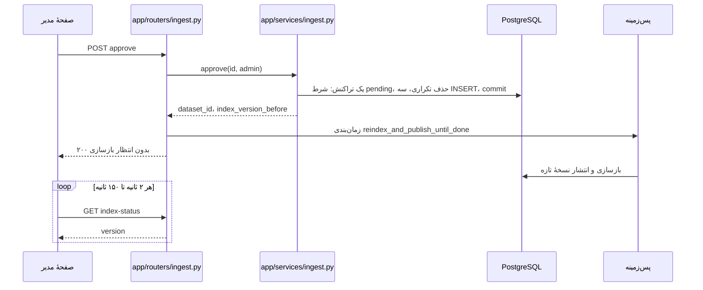
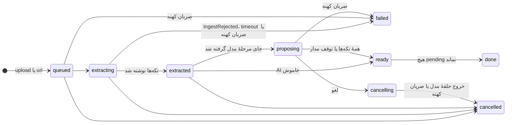

# SPEC: ورود نیمه‌خودکار دانش از سند و وب‌سایت

| Field | Value |
|-------|-------|
| Created | 2026-09-30 |
| Updated | 2026-09-30 |
| Status | Approved |
| Domain | content |
| Author | ingest-t1-res (عامل، Claude Opus 5.5). مالک فنی و تأییدکننده: Sina |
| Sources | `docs/features/knowledge-ingestion/RESEARCH.md` (spike پذیرفته‌شده، commit `075b935`)، ADR-023 در `docs/engineering/DECISIONS.md` (Proposed)، ورودی‌های بازبینی spike (بندهای 10 تا 18، N1، N2، I1، بخش «تصمیم‌ها» در پایان این سند) |

Approved by Sina in chat on 2026-09-30 (relayed by Foreman db5-ingest); PR #146 review still open.

**چطور این سند را بخوانید.** هر نیازمندی یک شناسه دارد: `REQ` کارکردی، `SEC`
امنیتی، `US` داستان کاربر، `SC` معیار پذیرش. «باید» یعنی اجباری؛ «بهتر است» فقط
جایی آمده که واقعاً اختیاری است. عددهایی که در این سند آمده‌اند **تصمیم قرارداد**
هستند، نه اندازه‌گیری؛ هر عددی که از اندازه‌گیری آمده، به بخش آزمایش RESEARCH.md
(X1 تا X4 و دروازهٔ decode) ارجاع دارد. همهٔ ارجاع‌های `path:line` روی commit
`3a4a415` هستند.

نیازمندی‌ها در شش گروه‌اند و هر گروه به یک برش PR می‌رسد (بخش «برش‌های تحویل»):

| گروه | شناسه‌ها | برش |
|------|----------|-----|
| A. خواندن امن فایل | REQ-001..REQ-016 | S1 |
| B. واکشی امن یک صفحهٔ وب | REQ-017..REQ-023 | S2 |
| C. کار (job)، تکه‌ها، حذف تکراری | REQ-024..REQ-041 | S3 |
| D. گام هوش مصنوعی | REQ-042..REQ-051 | S3 |
| E. بازبینی و تأیید | REQ-052..REQ-062، REQ-065..REQ-068، REQ-081 | S3 |
| E0. نوشتن مشترک و انتشار تضمین‌شدهٔ نمایه | REQ-063، REQ-064 | S3a |
| F. صفحهٔ مدیر | REQ-069..REQ-080، REQ-082 | S4 |

---

## 1. Purpose

مدیر یک نصب باید بتواند یک فایل (PDF، DOCX، XLSX، CSV، TXT، MD) یا نشانی یک صفحهٔ
وب بدهد و به‌جای تایپ دستی، فهرستی از پاسخ‌های پیشنهادی با پرسش و مترادف ببیند که
از خود همان سند آمده‌اند، هرکدام را کنار متن اصلی نگاه کند، و با یک دکمه تأیید کند.
هیچ‌چیز بدون این تأیید در دانش چت‌بات زنده نمی‌شود.

هدف مالک محصول (خلاصه از brief مالک که در مخزن نیست): «دانش نباید دستی تایپ شود.
مدیر سند یا نشانی می‌دهد، سیستم متن را بیرون می‌کشد و پیشنهاد می‌دهد، و انسان پیش
از زنده شدن تأیید می‌کند. آزمون مادربزرگ: آپلود، نگاه، تأیید.» این به دلیل‌های ۲ و
۳ ارزیاب دانش‌بنیان جواب می‌دهد («ورود دستی دانش»، «دانش، پرسش‌ها و مترادف‌ها دستی
مدیریت می‌شوند»).

### داستان‌های کاربر

- **US-001** مدیر یک فایل Word با پرسش‌های پرتکرار را روی صفحه می‌کشد و بعد از چند
  دقیقه فهرست پیشنهادها را می‌بیند.
- **US-002** مدیر نشانی یک صفحهٔ «دربارهٔ ما» را می‌چسباند و همان فهرست را می‌گیرد.
- **US-003** مدیر هر پیشنهاد را کنار متن اصلی سند می‌بیند، اگر لازم بود متن یا عنوان
  را درست می‌کند، و «تأیید» می‌زند؛ از همان لحظه چت‌بات با آن پاسخ می‌دهد.
- **US-004** مدیر بعد از مرور یک صفحه از پیشنهادها، «تأیید همهٔ موارد دیده‌شده» را
  می‌زند و فقط همان‌هایی که دیده تأیید می‌شوند.
- **US-005** وقتی هوش مصنوعی خاموش یا خراب است، مدیر باز هم پیشنهاد می‌گیرد (عنوان
  از سند، بدون پرسش) و کار را تمام می‌کند.
- **US-006** وقتی فایل خراب، خطرناک یا خیلی بزرگ است، مدیر یک جملهٔ سادهٔ فارسی
  می‌بیند که می‌گوید چه کند، و هیچ ردیفی ساخته نمی‌شود.

## 2. Scope

### In scope

- یک ماژول اختیاری تازه به نام `ingest` (`is_core=False`)، فقط برای مدیر.
- خواندن محلی شش قالب: PDF با `pdftotext`، DOCX با stdlib و `defusedxml`، XLSX با
  `openpyxl`، CSV و TXT و MD با stdlib.
- واکشی **یک** صفحهٔ وب (HTML، متن ساده، یا PDF) از یک نشانی https.
- تکه‌تکه کردن متن بر اساس عنوان و پاراگراف؛ متن هر پیشنهاد خودِ تکهٔ سند است.
- حذف تکراری در سه لایه، و هشدار «شبیه شناسنامهٔ شرکت».
- گام هوش مصنوعی برای عنوان (فقط وقتی سند عنوان ندارد)، پرسش و مترادف، از مسیر
  `padyar_ai.generate` با `task="chat"`.
- صف بازبینی با دیدن، ویرایش، تأیید، رد، تأیید دسته‌ای موارد دیده‌شده، و لغو کار.
- تأیید از مسیر نوشتن مشترک `dataset`، `questions`، `synonyms`، با audit و انتشار
  تضمین‌شدهٔ نسخهٔ نمایه.
- یک migration تازه (`migrations/0030_ingest.sql`) و آینهٔ SQLite.
- یک صفحهٔ مدیر با پیوند در منوی کناری که فقط وقتی ماژول روشن است دیده می‌شود.

### Out of scope

- این نسخه OCR ندارد. PDF اسکن‌شده با پیام «متن قابل خواندن ندارد» رد می‌شود.
- این نسخه خزش (crawl) سایت ندارد. فقط همان یک نشانی واکشی می‌شود.
- این نسخه سایت فقط-http را نمی‌پذیرد (پرسش باز Q7 در RESEARCH.md، تصمیم: رد).
- این نسخه شناسنامهٔ شرکت نمی‌سازد و در جدول `companies` نمی‌نویسد (ADR-021). شرکت‌ها
  روی مسیر `companies`/leads می‌مانند.
- این نسخه «برگرداندن همهٔ ردیف‌های یک سند» با یک دکمه ندارد (Q8، بخش «تصمیم‌ها»).
- این نسخه ستون‌های انگلیسی (`title_en`، `text_en`) را پر نمی‌کند.
- این نسخه `video_url` را پر نمی‌کند؛ ردیف تازه بدون ویدیو است.
- رفع رقابت بازسازی نمایه برای نویسنده‌های موجود (`_trigger_reindex`) در یک PR جدا
  است؛ این سند فقط تضمین مسیر تأیید خودش را می‌خواهد (REQ-064).
- رفع باگ ورود CSV که `title_en`/`text_en` را پاک می‌کند (RESEARCH.md، E6) در یک PR
  جدا است.
- تنظیم مدل محلی (کلید ساختگی، ردهٔ `internal`) کار Track 3 است.

### نکته دربارهٔ ADR-006

brief مالک نوشته بود ADR-006 («انتشار دانش با دروازهٔ انسانی») «هنوز برقرار است».
مخزن آن را در 2026-09-15 بازنشسته کرده است (`docs/engineering/DECISIONS.md:33`). این
تعارض عمداً با یک ADR تازه (ADR-023) حل شد، نه با زنده کردن ADR-006. پس brief نادیده
گرفته نشده؛ اصل آن با یک تصمیم تازه و قابل ردیابی برگشته است.

## 3. Actors / Permissions

- **تنها بازیگر: مدیر نصب**، از در موجود `Depends(verify_admin)`
  (`app/auth/security.py`). هیچ در تازه‌ای ساخته نمی‌شود.
- هر endpoint API این ماژول خودش `verify_admin` را صدا می‌زند؛ هیچ‌کدام به «صفحه
  قبلاً چک کرده» اتکا نمی‌کند، و داشتن شناسهٔ یک job یا پیشنهاد مجوز نیست (SEC-001).
- صفحهٔ مدیر مثل بقیهٔ صفحه‌های ماژولی، با `_require_admin` از
  `app/routers/public.py` و الگوی `app/routers/leads.py:958-967` سرو می‌شود.
- همهٔ مدیرها مجوز یکسان دارند (مخزن نقش جداگانه برای مدیر ندارد). یک مدیر
  می‌تواند پیشنهادی را که مدیر دیگری آپلود کرده، تأیید کند؛ `reviewed_by` نام
  تأییدکننده را ثبت می‌کند.
- بازدیدکننده هیچ مسیری به این ماژول ندارد. او فقط ردیف تأییدشده را، مثل هر ردیف
  دیگر `dataset`، از چت می‌بیند.

## 4. User / System Flow

1. مدیر در منوی کناری «افزودن دانش از فایل» را می‌زند.
2. یک فایل را می‌کشد یا انتخاب می‌کند، یا یک نشانی را می‌چسباند و «بخوان» را می‌زند.
3. سرور: `verify_admin` + CSRF + محدودیت نرخ ← خواندن با سقف ← (برای نشانی: واکشی
   امن همین‌جا، حداکثر ۲۰ ثانیه) ← hash محتوا ← ساخت job. اگر همین محتوا job فعال
   دارد، همان برمی‌گردد.
4. کار پس‌زمینه: استخراج در پردازهٔ فرزند ← تکه‌ها ← پیشنهاد محلی برای هر تکه
   (عنوان از سند) ← برچسب‌های تکراری و شرکت ← `extracted`.
5. اگر جای «مرحلهٔ مدل» آزاد است و AI روشن است: برای هر تکه یک تماس مدل با فاصله،
   پیشنهاد عنوان (فقط بی‌عنوان‌ها)، پرسش و مترادف، چک در Python ← `ready`. اگر AI
   خاموش است یا مدار باز شد: بقیه محلی می‌مانند ← `ready`.
6. صفحه هر چند ثانیه وضعیت را می‌خواند و پیشرفت را نشان می‌دهد.
7. مدیر کارت‌ها را می‌بیند (هر کارت: متن اصلی کنار پیشنهاد). کارتی که واقعاً روی
   صفحه دیده شد، «دیده‌شده» ثبت می‌شود.
8. مدیر هر کارت را تأیید، ویرایش و تأیید، یا رد می‌کند؛ یا «تأیید همهٔ موارد
   دیده‌شده» را می‌زند.
9. سرور برای هر تأیید: در یک تراکنش، حذف تکراری دوباره ← ساخت ردیف `dataset` و
   پرسش‌ها و مترادف‌ها ← وضعیت پیشنهاد `approved`؛ بعد از commit: بارگذاری مترادف‌ها و
   audit، و پاسخ. انتشار تضمین‌شدهٔ نسخهٔ نمایه در پس‌زمینه ادامه می‌یابد و صفحه تا جلو
   رفتن نسخه «در حال به‌روزرسانی» نشان می‌دهد.
10. وقتی هیچ پیشنهاد `pending` نماند، job به `done` می‌رود.

تأیید از همه بیشتر شکل دارد، چون پاسخ و انتشار نمایه از هم جدا شده‌اند (REQ-059):



*نمودار: هیچ‌کدام از این مسیرها امروز وجود ندارد. پاسخ ۲۰۰ پیش از بازسازی می‌رود؛
صفحه با خواندن `index-status` می‌فهمد پاسخ کی در چت دیده می‌شود.*

نمودار تصمیم کامل در RESEARCH.md، بخش ۶ است. چرخهٔ حالت‌ها در بخش ۵ همین سند است.
`erDiagram` کشیده نشد: دو جدول تازه فقط با یک ستون `job_id` (بدون FK) به هم وصل‌اند و
به هیچ جدول موجودی کلید ندارند؛ جدول‌های بخش ۷ همین را کامل‌تر می‌گویند. نمودار
دنبالهٔ آپلود هم کشیده نشد، چون فهرست شماره‌دار بالا خطی است و انشعابی ندارد.

## 5. Behavior

### Inputs

- فایل با پسوند `.pdf`، `.docx`، `.xlsx`، `.csv`، `.txt`، `.md` (حروف کوچک یا بزرگ).
- یا یک نشانی `https://`.
- ویرایش مدیر روی یک پیشنهاد: عنوان، متن، فهرست پرسش، فهرست مترادف.
- فهرست شناسهٔ پیشنهادهایی که روی صفحه دیده شدند.

### Outputs

- ردیف‌های `ingest_jobs` و `ingest_proposals` (بخش ۷).
- پس از تأیید: یک ردیف `dataset`، صفر تا ۵ ردیف `questions`، صفر تا ۵ ردیف `synonyms`،
  یک نسخهٔ منتشرشدهٔ نمایه، و رویدادهای audit.

### A. خواندن امن فایل (برش S1)

همهٔ این‌ها در `app/services/ingest_extract.py` (تازه) است و هیچ router، جدول یا
تماس شبکه‌ای ندارد.

- **REQ-001** رابط عمومی باید دقیقاً این باشد:
  - `extract_file(data: bytes, filename: str) -> Extracted` (در همان پردازه).
  - `extract_file_isolated(data: bytes, filename: str, timeout_s: float = 60.0) -> Extracted`
    (در پردازهٔ فرزند، REQ-013).
  - `extract_html(data: bytes) -> Extracted`.
  - `pdf_available() -> bool` (آیا `pdftotext` روی PATH هست).
  - `detect_format(data: bytes, filename: str) -> str`: فقط قاعدهٔ نوع REQ-002، بدون
    استخراج. یکی از `pdf`، `docx`، `xlsx`، `csv`، `txt`، `md` را برمی‌گرداند یا
    `IngestRejected("bad_type", ...)` یا `IngestRejected("zip_too_big", ...)` می‌دهد.
    فقط پسوند، ۸ بایت اول، و برای zip فقط ساختار فهرست را می‌خواند؛ هیچ عضوی باز
    (inflate) نمی‌شود، هیچ XML تجزیه نمی‌شود، و قاعدهٔ decode اجرا نمی‌شود. برای zip،
    **پیش از** `zipfile.ZipFile(BytesIO(data)).namelist()`، رکورد End of Central
    Directory (امضای `PK\x05\x06` در ۶۵٬۵۵۷ بایت آخر: ۲۲ بایت رکورد به‌علاوهٔ حداکثر
    ۶۵٬۵۳۵ بایت توضیح) خوانده می‌شود: تعداد کل اعضا (دو بایت در offset ۱۰) بیش از
    ۲٬۰۰۰، یا اندازهٔ central directory (چهار بایت در offset ۱۲) بیش از ۴ MiB، یا
    نشانهٔ zip64 (`0xFFFF` یا `0xFFFFFFFF` در این دو فیلد) ← `zip_too_big`؛ نبودن
    رکورد ← `bad_type`. پس `namelist()` حداکثر روی ۲٬۰۰۰ عضو و ۴ MiB فهرست اجرا
    می‌شود. دلیل: بازبینی یک zip ذخیره‌شدهٔ ۱۸.۷ MiB با ۲۳۰٬۰۰۰ عضو خالی را اندازه
    گرفت که `namelist` آن ۴.۰۴ ثانیه و ۱۰۲ MiB حافظه خرج کرد (اندازه‌گیری منتقد، نه این
    سند)، و این روی event loop worker وب، چت بازدیدکننده را هم نگه می‌داشت. برای
    CSV/TXT/MD فقط چک می‌کند که داده خالی نیست و امضای PDF یا zip ندارد؛ نوع از پسوند
    می‌آید. این تنها تابعی است که route آپلود **درون درخواست** صدا می‌زند (REQ-025).
    خواندن فهرست یک zip ناشناس در worker وب ریسکی پذیرفته‌شده است که با این دو سقف و
    سقف ۲۰ MiB کل داده بسته شده است.
  - `Extracted` یک dataclass است: `format: str` (`pdf`، `docx`، `xlsx`، `csv`،
    `txt`، `md`، `html`)، `blocks: list[Block]`، `encoding_note: str` (خالی یا
    `"utf-16"`/`"cp1256"`).
  - `Block` یک dataclass است: `kind` یکی از `"heading"`، `"para"`، `"row"`؛ `text: str`؛
    `level: int` (برای عنوان ۱ تا ۳، وگرنه ۰)؛ `fields: dict | None` (فقط برای `row`:
    `{"title": ..., "text": ...}`).
  - خطا فقط با `IngestRejected(code: str, message_fa: str)` بالا می‌رود؛ کدها و
    جمله‌ها در بخش ۸ ثابت شده‌اند.
- **REQ-002** نوع فایل از **پسوند و magic bytes با هم** تعیین می‌شود، و اگر هم‌خوان
  نباشند، `bad_type`:
  - PDF: پنج بایت اول `%PDF-`.
  - DOCX: `PK\x03\x04` و وجود عضو `[Content_Types].xml` و `word/document.xml`.
  - XLSX: `PK\x03\x04` و وجود `[Content_Types].xml` و `xl/workbook.xml`.
  - CSV/TXT/MD: نبودِ هیچ‌کدام از امضاهای بالا، و داده‌ای غیرخالی؛ نوع از پسوند.
    قاعدهٔ decode (REQ-004) بخشی از **تشخیص نوع نیست**؛ بعداً درون استخراج اجرا می‌شود
    و شکستش job را با `bad_encoding` به `failed` می‌برد (فیکسچرهای H7 و H8)، نه یک ۴۱۵
    در درخواست.
- **REQ-003** دروازهٔ zip برای DOCX و XLSX، **پیش از** هر پارسر:
  - حداکثر ۲٬۰۰۰ عضو، وگرنه `zip_too_big`.
  - هر عضو با پرچم رمز (`flag_bits & 0x1`) ← `encrypted`.
  - برای هر عضو فشرده با deflate، بایت‌های واقعی با خواندن جریان خام از روی
    local header و `zlib.decompressobj(-15)` با `max_length=65536` شمرده می‌شوند؛
    مجموع بایت واقعی همهٔ اعضا حداکثر ۱۰۰ MiB، وگرنه `zip_too_big`. اندازهٔ اعلام‌شده
    در سرفایل (`ZipInfo.file_size`) برای این تصمیم **خوانده نمی‌شود**. دلیل
    اندازه‌گیری‌شده: RESEARCH.md، X3 (سرفایل جعلی از چک عبور کرد و حافظهٔ پارسر به
    806 MB رسید؛ شمارش واقعی در 24 MB رد کرد).
  - روش فشرده‌سازی غیر از stored و deflate ← `bad_zip`.
- **REQ-004** قاعدهٔ decode برای CSV، TXT و MD، دقیقاً به این ترتیب:
  1. BOM UTF-16 (`FF FE` یا `FE FF`) ← decode سخت‌گیر UTF-16.
  2. وگرنه decode سخت‌گیر `utf-8-sig`.
  3. وگرنه `cp1256`، فقط اگر: هیچ بایت `0x00` نباشد، سهم نویسه‌های با دستهٔ Unicode
     `Cc` یا `Cf` (به‌جز `\t`، `\n`، `\r`، U+200C، U+200D، U+200E، U+200F) کمتر از
     ۰.۰۱ باشد، و دست‌کم ۰.۵ حرف‌ها (`str.isalpha`) در U+0600..U+06FF باشند.
  4. وگرنه `bad_encoding`.
  هیچ‌جا `errors="replace"` یا `errors="ignore"` به‌کار نمی‌رود. `encoding_note`
  وقتی قدم ۱ یا ۳ استفاده شد، پر می‌شود. (دروازه اندازه‌گیری‌شده: RESEARCH.md، F1.)
- **REQ-005** PDF: `pdftotext -enc UTF-8 -l 200 <file> -` به‌صورت `subprocess` با
  timeout ۴۵ ثانیه. بعد نویسه‌های U+202A..U+202E حذف می‌شوند. اگر `pdftotext` نبود
  ← `pdf_tool_missing`. اگر خروجی خطا گفت که PDF رمز دارد ← `encrypted`. اگر
  کد خروج غیرصفر بود ← `parse_failed`. متن به پاراگراف‌ها (جدا با خط خالی) تقسیم
  می‌شود؛ پاراگرافی که فقط یک خط، حداکثر ۶۰ نویسه، و بدون `.`، `؟`، `!`، `:` در پایان
  است، `heading` با `level=2` می‌شود.
- **REQ-006** DOCX: `word/document.xml` با
  `defusedxml.ElementTree.fromstring(..., forbid_dtd=True)` خوانده می‌شود. هر `w:p`
  یک بلوک است؛ متن از `w:t`، `w:tab` (فاصله) و `w:br` (خط تازه). اگر `w:pStyle`
  با `Heading` یا `Title` شروع شود، `heading` با level از رقم آخر (پیش‌فرض ۱، حداکثر
  ۳). جدول‌ها (`w:tbl`): متن هر ردیف با ` | ` به هم وصل و یک `para` می‌شود. DTD ←
  `dtd_forbidden`.
- **REQ-007** XLSX: `openpyxl.load_workbook(BytesIO, read_only=True, data_only=True)`،
  فقط برگهٔ اول. پیش از خواندن، `openpyxl.xml.DEFUSEDXML` باید `True` باشد، وگرنه
  `parse_failed` (یعنی نصب `defusedxml` را گم کرده؛ پاسخ به پرسش باز Q1 همین است).
  پیش از `openpyxl`، ۴ KiB اول (بازشده) هر عضو `.xml` برای `<!DOCTYPE` بررسی می‌شود؛
  اگر پیدا شد ← `dtd_forbidden`. این کد را برای XLSX قطعی می‌کند، به‌جای خطایی که
  `openpyxl` خودش بسته‌بندی می‌کند.
- **REQ-008** XLSX و CSV: ردیف اول سرستون است. ستون عنوان اولین ستونی است که نامش
  (بعد از `strip` و حروف کوچک) در `{"title","question","عنوان","سوال","سؤال","پرسش"}`
  باشد؛ ستون متن اولین ستون در `{"text","answer","پاسخ","جواب","متن","توضیح"}`. اگر
  ستون متن پیدا نشد ← `missing_columns`. هر ردیف با متن غیرخالی یک `row` با
  `fields={"title": ..., "text": ...}` است. حداکثر ۵٬۰۰۰ ردیف داده، وگرنه
  `too_many_rows`. فقط ۲۰ ستون اول خوانده می‌شود.
- **REQ-009** MD: خطی که با ۱ تا ۳ `#` شروع شود، `heading` با همان level. خط‌های
  خالی پاراگراف جدا می‌کنند. TXT: همان قاعدهٔ پاراگراف و عنوانِ PDF (REQ-005).
- **REQ-010** HTML (`extract_html`): با `html.parser` از stdlib. محتوای `script`،
  `style`، `noscript`، `nav`، `header`، `footer`، `form`، `svg` نادیده گرفته می‌شود.
  `h1`..`h3` ← `heading`؛ `p`، `li`، `td`، `dd`، `blockquote`، `pre` ← `para`. decode
  از charset هدر یا `<meta charset>`؛ اگر نبود، همان قاعدهٔ REQ-004.
- **REQ-011** بعد از استخراج، کل متن بلوک‌ها حداکثر ۲۵۰٬۰۰۰ نویسه، وگرنه
  `too_long`. اگر کمتر از ۲۰ نویسهٔ حرفی (`isalpha`) بماند ← `no_text` (PDF اسکن‌شده،
  صفحهٔ وبی که متنش با JavaScript ساخته می‌شود).
- **REQ-012** فاصله‌ها در هر بلوک یکی می‌شوند (فاصله‌های پشت‌سرهم به یکی)، اما
  نیم‌فاصله (U+200C)، `ي`/`ك` عربی و رقم‌ها **دست نمی‌خورند**. متن ذخیره‌شده
  نرمال‌سازی نمی‌شود؛ `normalize_persian` فقط برای مقایسه است.
- **REQ-013** `extract_file_isolated` استخراج را در یک پردازهٔ فرزند
  (`python -m app.services.ingest_extract`، داده از stdin، خروجی JSON روی stdout) با
  timeout دیواری `timeout_s` اجرا می‌کند؛ بعد از timeout پردازه کشته می‌شود و
  `timeout` برمی‌گردد. روی Linux، فرزند پیش از هر کاری
  `resource.setrlimit(RLIMIT_AS, (1 GiB, 1 GiB))` می‌گذارد؛ اگر سیستم‌عامل رد کرد،
  فرزند یک هشدار روی stderr می‌نویسد و ادامه می‌دهد، و والد آن را با
  `applog` ثبت می‌کند. `MemoryError` در فرزند ← `parse_failed`.
- **REQ-014** فرزند هیچ اتصال پایگاه‌داده یا شبکه‌ای باز نمی‌کند و فقط
  `app.services.ingest_extract` و stdlib و `defusedxml` و `openpyxl` را import می‌کند
  (`app.config` را نه، چون `.env` و پایگاه‌داده را لمس می‌کند).
- **REQ-015** `openpyxl` و `defusedxml` به `requirements.txt` اضافه می‌شوند. سطر
  `openpyxl` در `requirements-dev.txt:21` حذف می‌شود، چون حالا از فایل پایه می‌آید.
  `poppler-utils` به فهرست apt در `deploy/00-bootstrap-server.sh:36` و به job های
  `test` و `postgres-tests` در `.github/workflows/ci.yml` اضافه می‌شود.
- **REQ-016** نام فایل کاربر هرگز مسیر دیسک نمی‌شود. فقط برای نمایش ذخیره می‌شود،
  حداکثر ۲۰۰ نویسه، بعد از `os.path.basename`.

### B. واکشی امن یک صفحهٔ وب (برش S2)

همه در `app/services/ingest_fetch.py` (تازه). `endpoint_policy` تغییر نمی‌کند.

- **REQ-017** رابط عمومی: `fetch_url(url: str) -> Fetched` (همگام؛ فراخواننده آن را
  در thread اجرا می‌کند). `Fetched`: `final_url: str`، `content_type: str` (بدون
  پارامتر، حروف کوچک)، `charset: str`، `data: bytes`. خطا فقط با
  `FetchRejected(code: str, message_fa: str)`.
- **REQ-018** نشانی: فقط `https`، بدون userinfo، و پورت یا خالی یا `443`. هر پورت
  دیگر ← `bad_port`؛ `http` ← `http_only`؛ نشانی با userinfo (`user@`) یا نشانی‌ای که
  `urllib.parse.urlsplit` نمی‌خواند یا host ندارد ← `bad_url`. این چک‌ها پیش از
  `pin` اجرا می‌شوند. (`validate` در
  `app/services/ai/endpoint_policy.py:253-258` هر پورت ۱ تا ۶۵۵۳۵ را می‌پذیرد، پس این
  چک در `ingest_fetch` است.)
- **REQ-019** هر گام (نشانی اول و هر redirect) با
  `endpoint_policy.pin(url, endpoint_policy.PUBLIC)` قفل می‌شود و اتصال به IP قفل‌شده
  با `Host` برابر `authority` و SNI برابر `host` می‌رود؛ همان روشی که
  `app/services/ai/adapters/base.py:326-365` دارد. `EndpointRejected` ←
  `blocked_address`.
- **REQ-020** `follow_redirects=False`. کدهای ۳۰۱، ۳۰۲، ۳۰۳، ۳۰۷، ۳۰۸ دستی دنبال
  می‌شوند، حداکثر ۳ گام، وگرنه `too_many_redirects`. `Location` نسبی نسبت به نشانی
  همان گام حل می‌شود و REQ-018 و REQ-019 دوباره روی آن اجرا می‌شوند.
- **REQ-021** پاسخ به‌صورت stream خوانده می‌شود؛ حداکثر ۵ MiB (اتصال به‌محض رد شدن
  سقف بسته می‌شود) ← `too_large`. timeout کل (همهٔ گام‌ها با هم) ۲۰ ثانیه، اتصال ۱۰
  ثانیه ← `timeout`. وضعیت غیر ۲۰۰ ← `fetch_failed`.
- **REQ-022** نوع محتوا فقط `text/html`، `application/xhtml+xml`، `text/plain` یا
  `application/pdf`؛ وگرنه `bad_content_type`. PDF به همان مسیر فایل PDF می‌رود.
- **REQ-023** درخواست بدون cookie و بدون هدر احراز هویت، با
  `User-Agent: PadyarIngest/1.0` و `Accept-Encoding: identity` (تا بایت‌شماری
  REQ-021 همان بایت واقعی باشد)، و با `trust_env=False` تا متغیرهای `HTTPS_PROXY` و
  مانند آن درخواست را از مسیر پروکسی نبرند. client با یک تابع ماژول `_client()`
  ساخته می‌شود تا تست‌ها آن را با `httpx.MockTransport` جایگزین کنند.

### C. کار، تکه‌ها، حذف تکراری (برش S3)

در `app/services/ingest.py` (تازه) و `app/routers/ingest.py` (تازه).

- **REQ-024** ثبت ماژول در `MODULES` (`app/modules/registry.py:25`):
  `"ingest": ModuleDef(name="ingest", description="Semi-automatic knowledge ingestion from documents and web pages, with human approval", is_core=False, router_module="app.routers.ingest")`.
- **REQ-025** ساخت job از فایل: `POST /admin/api/ingest/jobs/upload`. بدنه با
  `file.read(MAX_FILE_BYTES + 1)` خوانده می‌شود (`MAX_FILE_BYTES = 20 MiB`)؛ بیشتر ←
  ۴۱۳. بعد `ingest_extract.detect_format(data, filename)` درون همین درخواست؛
  `bad_type` ← ۴۱۵ و هیچ job ساخته نمی‌شود. `sha256` بایت‌ها `content_hash` است.
- **REQ-026** ساخت job از نشانی: `POST /admin/api/ingest/jobs/url` با
  `{"url": "..."}`. واکشی (REQ-017) **درون همین درخواست** و در thread انجام می‌شود،
  چون سقف ۲۰ ثانیه زیر `proxy_read_timeout 120s` nginx است
  (`deploy/nginx/instance.conf.template:202`). `content_hash` = `sha256` بایت‌های
  پاسخ.
- **REQ-027** یکتایی محتوا: قید پایگاه‌داده (بخش ۷) اجازه نمی‌دهد دو job با یک
  `content_hash` هم‌زمان در وضعیت‌های `queued`، `extracting`، `extracted`،
  `proposing`، `cancelling`، `ready` باشند. اگر INSERT به این قید خورد
  (`dberrors.is_unique_violation`، `app/db/dberrors.py:45`)، پاسخ ۲۰۰ با همان job
  موجود و `"existing": true` است و job تازه‌ای ساخته نمی‌شود. SELECT پیش از INSERT
  به‌عنوان کنترل استفاده نمی‌شود.
- **REQ-028** بایت‌های آپلود تا پایان استخراج در یک فایل موقت با `tempfile.mkstemp`
  و مجوز `0600` می‌مانند؛ مسیرش در `tmp_path` روی job است و بعد از استخراج، شکست،
  لغو یا بازیابی (REQ-036) پاک می‌شود. متن کامل سند جدا ذخیره نمی‌شود؛ فقط تکه‌ها.
- **REQ-029** بعد از ساخت job، `BackgroundTasks` تابع `ingest.run_job(job_id)` را
  (async) اجرا می‌کند. `run_job` استخراج را با `anyio.to_thread.run_sync` روی
  `extract_file_isolated` اجرا می‌کند تا event loop بند نیاید.
- **REQ-030** تکه‌تکه کردن (`ingest.chunk(extracted) -> list[Chunk]`):
  - بلوک‌های `row` (XLSX/CSV): هر ردیف یک تکه؛ `heading` = ستون عنوان (اگر خالی نبود)،
    `text` = ستون متن. هیچ ادغامی نیست.
  - بقیه: هر `heading` یک بخش تازه باز می‌کند. پاراگراف‌های یک بخش پشت‌سرهم با
    `"\n\n"` در یک تکه جمع می‌شوند تا طول از ۹۰۰ نویسه نگذرد.
  - پاراگراف بلندتر از ۹۰۰ در آخرین پایان جمله (`.`، `؟`، `!`، `?`، `؛` و به‌دنبالش
    فاصله) پیش از ۹۰۰ بریده می‌شود؛ اگر پایان جمله‌ای نبود، در آخرین فاصله پیش از
    ۹۰۰.
  - تکهٔ کوتاه‌تر از ۴۰ نویسه به تکهٔ قبلی همان بخش می‌چسبد؛ اگر تکهٔ قبلی نبود،
    به بعدی؛ اگر بخش فقط همین را داشت، می‌ماند.
  - حداکثر ۳۰۰ تکه در هر job؛ بیشتر ← job `failed` با کد `too_many_chunks`.
- **REQ-031** برای هر تکه یک ردیف `ingest_proposals` با `status='pending'` و
  `ai_state='waiting'` نوشته می‌شود:
  - `source_text` = متن تکه، کلمه به کلمه.
  - `text` = همان `source_text`.
  - `heading` = عنوان بخش (یا خالی).
  - `title`: اگر `heading` بود و بخش فقط یک تکه دارد، همان عنوان
    (`title_source='heading'`). اگر بخش به k > 1 تکه تقسیم شد، تکهٔ i عنوان
    `<heading> (بخش i از k)` با رقم فارسی می‌گیرد (`title_source='heading'`)، تا
    ردیف‌های زندهٔ یک بخش عنوان مشترک نداشته باشند. اگر `heading` نبود، جملهٔ اول
    تکه، بریده در آخرین فاصله پیش از ۸۰ نویسه (`title_source='local'`).
  - `questions` و `synonyms` = `[]`.
- **REQ-032** حذف تکراری، لایهٔ ۱ و ۲ (هنگام استخراج و دوباره هنگام تأیید، REQ-058).
  **هویت تکراری فقط `text` است، نه عنوان.** پیشنهاد «تکراری» است اگر `text` آن با
  `text` یک ردیف موجود `dataset` برابر باشد (لایهٔ ۱: برابری دقیق؛ لایهٔ ۲: برابری
  بعد از `normalize_persian(..., expand_synonyms=False)`)، یا با `text` پیشنهاد
  دیگری در همان job که `seq` کمتری دارد. پیشنهاد تکراری `similar_kind='duplicate'` و
  `similar_to=<dataset id یا proposal id>` می‌گیرد.
  برابری **عنوان** (نرمال‌شده) با عنوان یک ردیف موجود فقط یک برچسب نرم است:
  `same_title_as=<dataset id>`. کارت یک یادداشت خاکستری نشان می‌دهد («عنوانی برابر با
  پاسخ X دارد؛ اگر لازم است عنوان را عوض کنید»)، و این برچسب نه تأیید یکی را می‌بندد
  نه تأیید دسته‌ای را. دلیل: یک بخش بلند چند تکه زیر یک عنوان می‌سازد، و عنوان‌های
  رایج («تماس با ما») در دانش موجود هم هست؛ عنوان به‌عنوان کلید تکراری، همان کار
  دستی‌ای را برمی‌گرداند که این قابلیت برای حذفش ساخته شده است.
- **REQ-033** لایهٔ ۳ (نزدیک): یک `EmbeddingIndex` روی `text` ردیف‌های `dataset` و
  یکی روی `text` ردیف‌های `companies` ساخته می‌شود. برای هر پیشنهاد، بالاترین
  **کسینوس خام** (نه امتیاز کالیبره، چون `_calibrate` در
  `app/services/embeddings.py:88-89` در 1.0 اشباع می‌شود) حساب می‌شود. اگر شباهت با
  یک ردیف `dataset` ≥ ۰.۹۰ بود: `similar_kind='dataset'`. اگر با یک شرکت ≥ ۰.۹۰ بود:
  `similar_kind='company'` (شرکت بر `dataset` مقدم است). عدد ۰.۹۰ برآورد است و
  اندازه‌گیری نشده؛ چون برچسب فقط هشدار می‌دهد و از تأیید دسته‌ای بیرون می‌گذارد
  (REQ-061)، عدد غلط هیچ ردیفی را حذف یا زنده نمی‌کند.
- **REQ-034** برای REQ-033 یک متد عمومی تازه به `EmbeddingIndex` اضافه می‌شود:
  `search_topk_raw(query: str, k: int = 1) -> list[tuple[int, float]]` که همان
  ضرب `self.matrix @ (vec / norm)` در `app/services/embeddings.py:126` را بدون
  `_calibrate` برمی‌گرداند. `search_topk` موجود تغییر نمی‌کند. اگر
  `embeddings.available()` نادرست بود، لایهٔ ۳ رد می‌شود و job ادامه می‌دهد.
- **REQ-035** وضعیت‌های job و گذارها (بخش «چرخهٔ حالت‌ها» پایین). هر گذار یک
  `UPDATE ... WHERE id = ? AND status = <قبلی>` است و اگر `rowcount` صفر بود، کار
  متوقف می‌شود (یعنی کسی دیگر وضعیت را عوض کرده، مثلاً لغو).
- **REQ-036** ضربان و بازیابی: در `extracting`، `heartbeat_at` درست پیش و درست بعد از
  فراخوان `extract_file_isolated` نوشته می‌شود (خود فراخوان حداکثر ۶۰ ثانیه است،
  REQ-013). در `proposing` و `cancelling`، بعد از هر تکه (فاصلهٔ دو ضربان حداکثر حدود
  ۹۵ ثانیه: دو تلاش ۴۵ ثانیه‌ای و ۱ ثانیه فاصله). هر دو زیر حد ۵ دقیقه‌اند.
  `ingest.recover_stale()` هر job در `queued`، `extracting` یا `proposing` که
  `heartbeat_at` (یا `created_at` برای `queued`) قدیمی‌تر از ۵ دقیقه دارد را با UPDATE
  شرطی به `failed` با `error_code='interrupted'` می‌برد، و job در `cancelling` با ضربان
  کهنه را به `cancelled`؛ فایل موقتش را پاک می‌کند، و پیشنهادهای `ai_state='waiting'`
  آن را `ai_state='local'` می‌کند (پس قابل بازبینی می‌مانند).
  `recover_stale()` در ابتدای `GET /admin/api/ingest/jobs` و
  `GET /admin/api/ingest/jobs/{id}` صدا زده می‌شود.
- **REQ-037** «یک job در مرحلهٔ مدل»: قید پایگاه‌داده (بخش ۷) اجازه نمی‌دهد بیش از
  یک job هم‌زمان در `proposing` یا `cancelling` باشد (`cancelling` هنوز یک تماس مدل در
  جریان دارد، REQ-039). گرفتن جا یعنی
  `UPDATE ... SET status='proposing' WHERE id=? AND status='extracted'`؛ اگر به قید
  خورد، job در `extracted` می‌ماند. SELECT پیش از UPDATE به‌عنوان کنترل استفاده
  نمی‌شود، چون سه worker هم‌زمان کار می‌کنند
  (`deploy/env/instance.env.template:35`).
- **REQ-038** ادامهٔ کار صف‌شده، از دو جا و با دو سازوکار:
  - **از یک درخواست:** `GET /admin/api/ingest/jobs` تابع
    `ingest.resume_waiting(background: BackgroundTasks)` را صدا می‌زند: اگر هیچ job در
    `proposing` یا `cancelling` نیست و یک job در `extracted` هست، `run_model_loop` را با
    همان `BackgroundTasks` درخواست زمان‌بندی می‌کند.
  - **از درون یک کار پس‌زمینه** (پایان مرحلهٔ مدل یک job، یا خروج حلقهٔ `cancelling`،
    REQ-039): آنجا `BackgroundTasks` درخواستی وجود ندارد، پس **همان coroutine ادامه
    می‌دهد**: `ingest.run_model_loop()` بعد از تمام کردن یک job، قدیمی‌ترین job در
    `extracted` را با UPDATE شرطی REQ-037 claim می‌کند و مرحلهٔ مدل آن را در همان حلقه
    اجرا می‌کند، تا وقتی claim ناموفق شود (هیچ job در `extracted` نیست، یا جا را کس
    دیگری گرفته). `asyncio.create_task` استفاده نمی‌شود، چون taskی که کسی به آن ارجاع
    ندارد ممکن است بی‌صدا گم شود و خطایش دیده نشود.
  - اجرای هم‌زمان دو حلقه بی‌خطر است، چون فقط یکی جای REQ-037 را می‌گیرد و دیگری با
    claim ناموفق خارج می‌شود.
- **REQ-039** لغو: `POST /admin/api/ingest/jobs/{id}/cancel`.
  - job در `queued`، `extracting` یا `extracted`: مستقیم `cancelled`.
  - job در `proposing`: `cancelling`، نه `cancelled`، چون ممکن است یک تماس مدل (تا دو
    تلاش ۴۵ ثانیه‌ای) در جریان باشد. جای «مرحلهٔ مدل» (REQ-037) تا خروج حلقه گرفته
    می‌ماند، پس job بعدی هم‌زمان تماس نمی‌زند. حلقه پیش از هر تکه و بعد از هر تماس
    وضعیت را می‌خواند؛ با `cancelling` نتیجهٔ تماس جاری را دور می‌ریزد، وضعیت را
    `cancelled` می‌کند، و همان حلقه (REQ-038) job بعدی را claim می‌کند.
  - در هر دو حالت: فایل موقت پاک و همهٔ پیشنهادهای `pending` آن `rejected` با
    `reject_reason='cancelled'` می‌شوند (همان لحظه، نه بعد از خروج حلقه).
  - job در `ready`، `done`، `failed`، `cancelling` یا `cancelled` ← ۴۰۹.
- **REQ-040** job وقتی هیچ پیشنهاد `pending` ندارد و در `ready` است، با UPDATE شرطی به
  `done` می‌رود (بعد از هر تأیید یا رد).
- **REQ-041** نگه‌داری (پاسخ به Q9): job در `done`، `failed` یا `cancelled` که
  `finished_at` آن بیش از ۳۰ روز پیش است **و** هیچ پیشنهاد `pending` ندارد، همراه
  پیشنهادهایش پاک می‌شود. `ingest.purge_expired()` از `_retention_loop` موجود در
  `app/main.py:19` صدا زده می‌شود، فقط وقتی `is_module_enabled("ingest")`. ردیف‌های
  `dataset` ساخته‌شده و رویدادهای audit پاک نمی‌شوند.

#### چرخهٔ حالت‌ها



*چرخهٔ `ingest_jobs.status`. همهٔ این حالت‌ها تازه‌اند. جای «مرحلهٔ مدل» در
`proposing` و `cancelling` گرفته است. `failed` پیشنهادهای ساخته‌شده
را نگه می‌دارد و آن‌ها قابل بازبینی می‌مانند (REQ-036). چرخهٔ پیشنهاد ساده‌تر است:
`pending` به `approved` یا `rejected`، و هیچ برگشتی ندارد.*

### D. گام هوش مصنوعی (برش S3)

- **REQ-042** هر تکه با `ai_state='waiting'`، به ترتیب `seq`، یک تماس دارد:
  `padyar_ai.generate(messages=[{"role": "user", "content": <تکه>}], system_prompt=<ثابت فارسی>, task="chat", max_output_tokens=1000, temperature=0.2, response_format="json_object", timeout_s=45.0)`.
  **هیچ task تازه‌ای ساخته نمی‌شود** (ADR-018). `max_output_tokens` صریح است (نه
  پیش‌فرض ۵۵۵ در `app/services/ai/engine.py:47`)؛ عدد ۱۰۰۰ برآورد است و REQ-051
  اندازه‌گیری‌اش را ممکن می‌کند.
- **REQ-043** system prompt کوتاه، فارسی، و شامل کلمهٔ «JSON» است (DeepSeek و Qwen آن را
  لازم دارند). از مدل فقط این شیء را می‌خواهد:
  `{"title": "", "questions": ["..."], "synonyms": [{"word": "...", "suggestion": "..."}]}`.
  می‌گوید `title` را فقط وقتی پر کند که تکه عنوان ندارد، حداکثر ۵ پرسش و ۵ مترادف،
  و هیچ واقعیت یا عددی که در تکه نیست ننویسد. متن ثابت prompt در کد و در تست
  snapshot می‌شود.
- **REQ-044** مدل هرگز `text` را نمی‌نویسد. هر کلید دیگری در پاسخ نادیده گرفته
  می‌شود.
- **REQ-045** عنوان مدل فقط وقتی استفاده می‌شود که `title_source` برابر `local` باشد
  (یعنی سند برای این تکه عنوان نداشت). عنوان مدل پذیرفته می‌شود اگر: ۱ تا ۱۰۰ نویسه،
  بعد از `fold_digits` (`app/services/answer.py:160`) هیچ رقمی نداشته باشد، شامل
  `@`، `http` یا `www.` نباشد، و `content_tokens(normalize_persian(title))`
  (`app/services/rerank.py:50`) زیرمجموعهٔ همان تابع روی `source_text` باشد. اگر
  پذیرفته شد، `title_source='model'`. **این چک حفرهٔ شناخته‌شده دارد:** کلمه‌های
  واقعی تکه را می‌شود به یک رابطهٔ غلط چید و چک رد نمی‌کند
  (`app/services/answer.py:446-470`، اندازه‌گیری 2026-08-28). پس کنترل عنوان مدل،
  بازبین است: کارت عنوان مدل را با برچسب «عنوان پیشنهادی» نشان می‌دهد (REQ-073).
- **REQ-046** هر پرسش پذیرفته می‌شود اگر: بعد از یکی کردن فاصله‌ها ۵ تا ۱۲۰ نویسه،
  دست‌کم یک حرف در U+0600..U+06FF، هر دنبالهٔ رقم (بعد از `fold_digits`) در
  `fold_digits(source_text)` هم باشد، و بعد از
  `normalize_persian(..., expand_synonyms=False)` با پرسش‌های موجود جدول `questions` و
  پرسش‌های قبلی همین پیشنهاد برابر نباشد. حداکثر ۵ پرسش.
- **REQ-047** هر مترادف با `synonym_suggest.clean_pair(word, suggestion)`
  (`app/services/synonym_suggest.py:83`) چک می‌شود؛ `None` یعنی رد. حداکثر ۵.
- **REQ-048** پاسخ با `finish_reason` برابر `FINISH_LENGTH`، یا JSON نامعتبر، یا
  شیئی که `dict` نیست: `ai_state='failed'` و پیشنهاد محلی دست‌نخورده می‌ماند. اقلامی
  که از چک رد می‌شوند یکی‌یکی حذف می‌شوند؛ بقیه می‌مانند. موفق: `ai_state='done'`.
- **REQ-049** فاصله و توقف (هزینهٔ اشتراک مدار با چت زنده،
  `app/services/ai/engine.py:142`، `app/services/ai/circuit.py:1-20`):
  - بین پایان یک تماس و شروع بعدی دست‌کم ۱ ثانیه (`asyncio.sleep`).
  - اولین `AIError` با `code` برابر `provider_unavailable` یا `all_routes_failed`
    مرحلهٔ مدل را برای این job **متوقف** می‌کند؛ تماس دوباره زده نمی‌شود.
  - سه `AIError` پشت‌سرهم از هر کد دیگری هم همین کار را می‌کند.
  - در توقف: همهٔ پیشنهادهای `waiting` باقی‌مانده `ai_state='local'`، روی job
    `ai_stopped_at=<seq>`، و job به `ready`.
- **REQ-050** AI خاموش: اگر `padyar_ai.external_ai_enabled()`
  (`app/services/ai/wrapper.py:98`) نادرست بود، مرحلهٔ مدل اجرا نمی‌شود؛ همهٔ
  پیشنهادها `ai_state='local'` و job مستقیم از `extracted` به `ready` می‌رود. چیزی در
  این مسیر به نوع provider بستگی ندارد، پس مدل محلی سازگار با OpenAI (Track 3) بدون
  تغییر کد همین مسیر را می‌گیرد.
- **REQ-051** برای هر تماس یک رویداد `applog` با `finish_reason`، توکن‌های خروجی و
  تأخیر ثبت می‌شود (نه متن). این همان شاهدی است که عدد REQ-042 را بعداً قابل
  اندازه‌گیری می‌کند.

### E. بازبینی و تأیید (برش S3)

- **REQ-052** فهرست jobها: `GET /admin/api/ingest/jobs?limit&offset`، مرتب بر
  `created_at` نزولی.
- **REQ-053** جزئیات job: `GET /admin/api/ingest/jobs/{id}` با شمارنده‌ها:
  `chunk_count`، `ai_done` (تعداد `done`+`failed`+`local`)، `pending`، `approved`،
  `rejected`، `seen_pending`.
- **REQ-054** فهرست پیشنهادها: `GET /admin/api/ingest/jobs/{id}/proposals?status&limit&offset`،
  مرتب بر `seq`. `status` یکی از `pending`، `approved`، `rejected`، `all`
  (پیش‌فرض `pending`).
- **REQ-055** ثبت دیده‌شدن: `POST /admin/api/ingest/proposals/seen` با
  `{"ids": [...]}`، حداکثر ۵۰ شناسه. برای هر پیشنهاد `pending` که `seen_at` خالی
  دارد، `seen_at=now` و `seen_by=<admin>`. شناسهٔ ناموجود بی‌صدا نادیده گرفته می‌شود؛
  پاسخ تعداد ثبت‌شده است. «دیده‌شده» در REQ-074 تعریف شده است.
- **REQ-056** ویرایش: `PUT /admin/api/ingest/proposals/{id}` با `title`، `text`،
  `questions`، `synonyms` (هر کدام اختیاری). فقط برای `pending`، وگرنه ۴۰۹. چک‌ها:
  `title` ۱ تا ۱۰۰، `text` ۱ تا ۵٬۰۰۰ نویسه، پرسش‌ها با قاعدهٔ REQ-046 به‌جز شرط رقم
  (رقم نوشتهٔ انسان است)، مترادف‌ها با `clean_pair`. هر فیلد رد شده ← ۴۲۲ با نام
  فیلد. ذخیره: `edited=1`؛ اگر `title` عوض شد، `title_source='admin'`. ویرایش،
  پیشنهاد را دیده‌شده هم می‌کند.
- **REQ-057** تأیید یکی: `POST /admin/api/ingest/proposals/{id}/approve`. شرط: پیشنهاد
  `pending`، `ai_state` در (`done`، `failed`، `local`)، و job نه `cancelled`. وگرنه
  ۴۰۹. تأیید یکی، پیشنهاد را دیده‌شده هم می‌کند (دکمه روی همان کارت است).
- **REQ-058** نوشتن تأیید، **در یک تراکنش** (پاسخ به Q10):
  1. `UPDATE ingest_proposals SET status='approved', reviewed_at, reviewed_by WHERE id=? AND status='pending'`؛
     `rowcount` صفر ← rollback و ۴۰۹ («این پیشنهاد قبلاً بررسی شده است»). این تأیید را
     idempotent می‌کند.
  2. لایهٔ ۱ و ۲ (REQ-032) دوباره روی جدول‌های زنده اجرا می‌شود؛ تکراری ← rollback و
     ۴۰۹ با `"duplicate_of": <id>`.
  3. `queries.insert_dataset_entry(conn, id, title, text)` با id به شکل
     `ing-<token_hex(5)>` و `position = MAX(position)+10`؛ برخورد id (بسیار نادر) ←
     یک بار تلاش دوباره با id تازه.
  4. برای هر پرسش `queries.insert_question(conn, question, dataset_id, "")`.
  5. `queries.insert_synonym_pairs(conn, pairs)`.
  6. `dataset_id` روی پیشنهاد.
  7. commit.
  خطای هر مرحله ← rollback کامل؛ هیچ ردیف نیمه‌ای نمی‌ماند.
- **REQ-059** بعد از commit، بیرون از تراکنش، به این ترتیب: (۱) اگر مترادفی نوشته شد،
  `load_synonyms_from_db()` (`app/utils/normalizer.py:19`)؛ (۲) audit (REQ-066)؛ (۳)
  زمان‌بندی `search.reindex_and_publish_until_done` (REQ-064) با `BackgroundTasks`.
  **پاسخ تأیید منتظر بازسازی نمی‌ماند:** بعد از commit و قدم ۱ تا ۳ برمی‌گردد. قدم ۳
  فقط زمان‌بندی است؛ اولین تلاش بازسازی و تلاش‌های بعدی در پس‌زمینه اجرا می‌شوند.
  پاسخ `index_version_before` (نسخهٔ منتشرشده در لحظهٔ پاسخ، REQ-081) را دارد تا صفحه
  بداند کی نسخه جلو رفته است (REQ-082). در `approve-seen` قدم ۳ یک بار برای کل دسته
  است. کران پاسخ، **برآورد و اندازه‌گیری‌نشده:** کمتر از ۱ ثانیه برای یک تأیید و کمتر
  از ۵ ثانیه برای ۵۰ تأیید در یک `approve-seen`، چون هر تأیید یک تراکنش با حداکثر ۱۱
  INSERT و دو SELECT حذف تکراری است و هیچ کار سنگینی در مسیر پاسخ نیست. چیزی که
  قطعی و تست‌شدنی است: بازسازی فقط زمان‌بندی می‌شود و در مسیر پاسخ اجرا نمی‌شود
  (SC-028). شکست قدم ۱ یا
  ۲ ردیف‌ها را برنمی‌گرداند؛ با `applog` در سطح error ثبت می‌شود.
- **REQ-060** رد: `POST /admin/api/ingest/proposals/{id}/reject` با `reason` اختیاری
  (حداکثر ۲۰۰ نویسه). فقط `pending`، با UPDATE شرطی؛ وگرنه ۴۰۹.
- **REQ-061** تأیید دسته‌ای: `POST /admin/api/ingest/jobs/{id}/approve-seen`. سرور خودش
  انتخاب می‌کند، نه از فهرست مرورگر: پیشنهادهای همین job با `status='pending'`،
  `seen_at IS NOT NULL`، `similar_kind` خالی، و `ai_state` در (`done`، `failed`،
  `local`)، به ترتیب `seq`، حداکثر ۵۰ در هر درخواست. هر کدام جدا با REQ-058 نوشته
  می‌شود؛ شکست یکی (مثلاً تکراری) بقیه را متوقف نمی‌کند و آن یکی `pending` می‌ماند.
  یک REQ-064 برای کل دسته در پایان. پاسخ: `{"approved": n, "skipped": [{"id", "reason"}], "remaining": m}`.
  پیشنهادهای ندیده **هرگز** با این endpoint تأیید نمی‌شوند.
- **REQ-062** چرا فقط دیده‌شده: دلیل دروازه خطای بی‌صدای استخراج PDF است
  (RESEARCH.md، X1)، که فقط با نگاه به متن کنار منبع پیدا می‌شود. آزمون مادربزرگ
  «نگاه کن، بعد تأیید را بزن» است؛ تأیید بدون نگاه حذف شد.
- **REQ-063** سه تابع نوشتن به `app/db/queries.py` منتقل می‌شوند، هر کدام با `conn` و
  بدون commit:
  - `insert_dataset_entry(conn, item_id, title, text, video_url="", title_en="", text_en="") -> None`
    (همان INSERT و محاسبهٔ `position` در `app/routers/dataset.py:165-204`)؛
  - `insert_question(conn, question, dataset_id, video_url="") -> int` (همان
    `app/routers/dataset.py:237-244`)؛
  - `insert_synonym_pairs(conn, pairs) -> int` (همان حلقهٔ INSERT در
    `app/routers/synonyms.py:29-36`).
  روترهای موجود همین‌ها را صدا می‌زنند و رفتارشان (کد وضعیت، reindex، ۴۰۹ روی id
  تکراری) عوض نمی‌شود. `_insert_synonym_pairs` در روتر مترادف بعد از commit همچنان
  `load_synonyms_from_db()` و `bump_index_version()` را صدا می‌زند. مسیر تأیید ingest
  `_insert_synonym_pairs` را صدا **نمی‌زند** (چون commit خودش را دارد)، پس در هر تأیید
  فقط یک انتشار نسخه رخ می‌دهد (ورودی بازبینی ۱۸).
- **REQ-064** انتشار تضمین‌شدهٔ نمایه بعد از تأیید: تابع تازهٔ
  `search.reindex_and_publish_until_done(timeout_s: float = 120.0) -> bool` که:
  `_rebuild(publish=True)` را صدا می‌زند؛ اگر `_rebuild` به‌خاطر قفل اجرا نشد
  (`app/services/search.py:344-345`)، هر ۰.۵ ثانیه دوباره تلاش می‌کند تا یک اجرای
  کامل **که بعد از commit شروع شده** انجام شود یا timeout برسد؛ در timeout
  `bump_index_version()` می‌زند تا دست‌کم workerهای دیگر بسازند، `False` برمی‌گرداند و
  با `applog` در سطح error ثبت می‌کند. برای این کار `_rebuild` باید `True`/`False`
  برگرداند (اجرا شد یا نه)؛ فراخواننده‌های موجود مقدار را نادیده می‌گیرند. این تابع
  همگام است و با `BackgroundTasks` در threadpool اجرا می‌شود، نه روی event loop و نه
  در مسیر پاسخ (REQ-059). `_trigger_reindex` و بقیهٔ نویسنده‌ها در این سند تغییر
  نمی‌کنند. این REQ و REQ-063 در برش جدای S3a هستند.
- **REQ-065** برای ردیف `dataset` تازه، `title_en` و `text_en` خالی و `video_url` خالی
  است.
- **REQ-066** audit با `applog.audit(event, message, actor, target, outcome)`
  (`app/services/applog.py:524`) برای: `ingest.job.created`، `ingest.job.failed`،
  `ingest.job.cancelled`، `ingest.proposal.edited`، `ingest.proposal.approved`
  (target: شناسهٔ پیشنهاد و `dataset_id`)، `ingest.proposal.rejected`،
  `ingest.bulk_approved` (تعداد). پیام audit متن سند را ندارد.
- **REQ-067** برگرداندن یک سند کامل با یک دکمه در این نسخه نیست (Q8). ردیف تأییدشده
  یک ردیف معمولی `dataset` است و از صفحهٔ موجود دانش حذف می‌شود؛ `dataset_id` روی
  پیشنهاد نگه داشته می‌شود تا یک نسخهٔ بعدی بتواند این دکمه را بسازد.
- **REQ-081** وضعیت نمایه: `GET /admin/api/ingest/index-status` ←
  `{"version": <int>}`، نسخهٔ منتشرشدهٔ کنونی از تابع عمومی تازهٔ
  `search.published_index_version()` (پوشش همان `_read_index_version` در
  `app/services/search.py:311`، که کلید `search_index_version` را می‌خواند، `:304`).
  این تابع در S3a اضافه می‌شود. با `verify_admin`.
- **REQ-068** همهٔ endpointهای فهرست `limit` (پیش‌فرض ۲۰، سقف ۵۰؛ بیشتر به ۵۰ بریده
  می‌شود) و `offset` (≥ ۰) دارند، ترتیب قطعی دارند (`created_at DESC, id` برای job،
  `seq` برای پیشنهاد)، و `total` برمی‌گردانند.

### F. صفحهٔ مدیر (برش S4)

- **REQ-069** صفحه در `GET /secure-panel-admin/ingest`، در `app/routers/ingest.py` با
  الگوی `app/routers/leads.py:958-967` (`_require_admin`، `_render`،
  `active_page="ingest"`)، با قالب `templates/admin/ingest.html` (extends
  `layout.html`) و `static/admin/js/ingest.js`.
- **REQ-070** پیوند منوی کناری در `templates/admin/layout.html` داخل
  `` (الگوی `templates/admin/layout.html:81`)،
  با متن «افزودن دانش از فایل» و آیکن `fa-file-import`.
- **REQ-071** بالای صفحه یک کارت ورودی: ناحیهٔ کشیدن فایل («فایل را اینجا بکشید یا
  انتخاب کنید»)، زیرش خط کوچک قالب‌های پذیرفته («Word، PDF، Excel، CSV، متن»)، یک
  فیلد نشانی («یا نشانی یک صفحهٔ وب») و دکمهٔ «بخوان». یک جملهٔ ثابت: «برای
  شناسنامهٔ شرکت‌ها از صفحهٔ شرکت‌ها استفاده کنید.» اگر `pdf_available()` نادرست
  باشد، زیر کارت: «خواندن PDF روی این سرور فعال نیست.»
- **REQ-072** وقتی یک job در جریان است، کارت پیشرفت: جملهٔ مرحله («در حال خواندن
  فایل…»، «در حال آماده کردن پیشنهادها: ۱۲ از ۸۵»)، نوار پیشرفت، و دکمهٔ «لغو» با
  تأیید («کار این فایل متوقف شود؟ پیشنهادهای بررسی‌نشده حذف می‌شوند.»). صفحه هر ۳
  ثانیه `GET /jobs/{id}` را می‌خواند و وقتی job در `ready`، `done`، `failed` یا
  `cancelled` است، خواندن را متوقف می‌کند.
- **REQ-073** هر پیشنهاد یک کارت است با دو ستون (در عرض ≥ ۹۹۲px) یا دو بخش زیر هم:
  «متن اصلی سند» (`source_text`) و «پاسخ پیشنهادی» (`title`، `text`، پرسش‌ها به‌صورت
  برچسب، مترادف‌ها). اگر `title_source='model'`، کنار عنوان برچسب «عنوان
  پیشنهادی». اگر `similar_kind` پر است، یک نوار زرد: «شبیه یک پاسخ موجود است: <عنوان>»
  یا «به نظر شناسنامهٔ شرکت <نام> است؛ جایش صفحهٔ شرکت‌ها است.» یا «این متن تکراری
  است.» سه دکمه: «تأیید»، «ویرایش»، «رد».
- **REQ-074** «دیده‌شده» یعنی: کارت دست‌کم ۵۰٪ در viewport بوده و دست‌کم ۱ ثانیهٔ پیوسته
  آنجا مانده (با `IntersectionObserver`، `threshold: 0.5`). شناسه‌ها هر ۲ ثانیه
  دسته‌ای به REQ-055 فرستاده می‌شوند. صرفِ واکشی یک صفحه از فهرست، کارتی را
  دیده‌شده نمی‌کند (ورودی بازبینی I1).
- **REQ-075** نوار بالای فهرست: «تأیید همهٔ موارد دیده‌شده (N)» که N همان
  `seen_pending` منهای برچسب‌دارها است و بعد از هر ارسال REQ-055 به‌روز می‌شود. وقتی
  N صفر است، دکمه غیرفعال است با توضیح «اول پیشنهادها را ببینید». بعد از زدن، پاسخ
  REQ-061 به‌صورت پیام نشان داده می‌شود و اگر `remaining > 0`، دکمه همان را تکرار
  می‌کند.
- **REQ-076** ویرایش درون همان کارت باز می‌شود (بدون پنجرهٔ جدا): فیلد عنوان، متن،
  پرسش‌ها (یکی در هر خط)، مترادف‌ها (هر خط `کلمه = مترادف`)، و «ذخیره و تأیید» و
  «انصراف». خطای ۴۲۲ کنار همان فیلد نشان داده می‌شود.
- **REQ-077** فهرست پیشنهادها و فهرست «فایل‌های اخیر» با `pager.js` صفحه‌بندی
  می‌شوند (۲۰ در هر صفحه).
- **REQ-078** همهٔ متن‌هایی که از سند، صفحهٔ وب یا مدل آمده‌اند با `textContent` یا
  `escapeHtml` (`static/admin/js/utils.js:3`) نوشته می‌شوند، هرگز با `innerHTML` خام
  (SEC-020).
- **REQ-079** همهٔ درخواست‌های تغییر با `fetchAuth()` از `static/admin/js/utils.js`
  فرستاده می‌شوند تا هدر `X-CSRF-Token` خودکار برود.
- **REQ-082** بعد از هر تأیید (یکی یا دسته‌ای)، صفحه حالت «در حال به‌روزرسانی
  پاسخ‌ها…» را روی کارت (یا نوار بالا برای دسته) نشان می‌دهد و هر ۲ ثانیه REQ-081 را
  می‌خواند تا `version` از `index_version_before` پاسخ تأیید بزرگ‌تر شود؛ بعد «از همین
  حالا در پاسخ‌ها است». اگر بعد از ۱۵۰ ثانیه جلو نرفت، خواندن متوقف می‌شود و متن
  «پاسخ ذخیره شد و به‌زودی در چت دیده می‌شود.» می‌آید (این شکست تأیید نیست؛ ردیف
  commit شده است).
- **REQ-080** هیچ کلمهٔ فنی روی صفحه نیست: «job»، «proposal»، «chunk»، «AI»،
  «embedding» و کد خطا نشان داده نمی‌شوند. نام‌ها: «فایل»، «پیشنهاد»، «بخش»، «هوش
  مصنوعی»، و جمله‌های بخش ۸.

## 6. API / Contract

همهٔ مسیرها زیر `/admin/` یا `/secure-panel-admin` هستند، پس CSRF موجود
(`app/auth/csrf.py:55`) آن‌ها را پوشش می‌دهد و `tests/test_csrf.py:216` ماشینی چک
می‌کند. همه `Depends(verify_admin)` دارند. بدنهٔ خطا `{"detail": "<جملهٔ فارسی>", "code": "<کد>"}`
است.

| متد و مسیر | بدنه | موفق | خطاها |
|------------|------|------|-------|
| `POST /admin/api/ingest/jobs/upload` | multipart `file` | ۲۰۲ `{job}`؛ ۲۰۰ `{job, "existing": true}` | ۴۰۱، ۴۰۳ (CSRF)، ۴۱۳ (`too_large` یا `zip_too_big` از `detect_format`)، ۴۱۵ (`bad_type`)، ۴۲۲ (نام خالی)، ۴۲۹ |
| `POST /admin/api/ingest/jobs/url` | `{"url": str}` | ۲۰۲ یا ۲۰۰ مثل بالا | ۴۰۱، ۴۰۳، ۴۲۲ (کدهای `FetchRejected`)، ۴۲۹، ۵۰۴ (`timeout`) |
| `GET /admin/api/ingest/jobs` | `limit`، `offset` | ۲۰۰ `{items: [job], total}` | ۴۰۱ |
| `GET /admin/api/ingest/jobs/{id}` | | ۲۰۰ `{job, counts}` | ۴۰۱، ۴۰۴ |
| `GET /admin/api/ingest/jobs/{id}/proposals` | `status`، `limit`، `offset` | ۲۰۰ `{items: [proposal], total}` | ۴۰۱، ۴۰۴، ۴۲۲ |
| `POST /admin/api/ingest/jobs/{id}/cancel` | | ۲۰۰ `{job}` | ۴۰۱، ۴۰۳، ۴۰۴، ۴۰۹ |
| `POST /admin/api/ingest/jobs/{id}/approve-seen` | | ۲۰۰ `{approved, skipped, remaining, index_version_before}` | ۴۰۱، ۴۰۳، ۴۰۴، ۴۰۹ (job لغوشده) |
| `POST /admin/api/ingest/proposals/seen` | `{"ids": [str]}` (≤ ۵۰) | ۲۰۰ `{marked: n}` | ۴۰۱، ۴۰۳، ۴۲۲ |
| `PUT /admin/api/ingest/proposals/{id}` | `{title?, text?, questions?, synonyms?}` | ۲۰۰ `{proposal}` | ۴۰۱، ۴۰۳، ۴۰۴، ۴۰۹، ۴۲۲ |
| `POST /admin/api/ingest/proposals/{id}/approve` | | ۲۰۰ `{proposal, dataset_id, index_version_before}` | ۴۰۱، ۴۰۳، ۴۰۴، ۴۰۹ |
| `GET /admin/api/ingest/index-status` | | ۲۰۰ `{version}` | ۴۰۱ |
| `POST /admin/api/ingest/proposals/{id}/reject` | `{reason?}` | ۲۰۰ `{proposal}` | ۴۰۱، ۴۰۳، ۴۰۴، ۴۰۹ |
| `GET /secure-panel-admin/ingest` | | ۲۰۰ HTML | ۳۰۳ به `/secure-panel-admin/login` |

**شکل `job`:** `id`، `source_kind` (`file`/`url`)، `source_name`، `format`، `status`،
`error_code`، `error_message` (فارسی)، `encoding_note`، `chunk_count`، `ai_stopped_at`،
`created_by`، `created_at`، `finished_at`. `content_hash`، `tmp_path` و `heartbeat_at`
برگردانده نمی‌شوند.

**شکل `proposal`:** `id`، `job_id`، `seq`، `source_text`، `heading`، `title`،
`title_source`، `text`، `questions` (آرایه)، `synonyms` (آرایهٔ `{word, suggestion}`)،
`ai_state`، `similar_kind`، `similar_to`، `similar_title`، `same_title_as`، `status`، `edited`، `seen`
(بولی)، `reviewed_by`، `reviewed_at`، `dataset_id`. `similar_title` ستون نیست؛ هنگام خواندن از عنوان ردیف `dataset`،
نام شرکت، یا عنوان پیشنهاد اشاره‌شده در `similar_to` ساخته می‌شود. `seen` یعنی
`seen_at IS NOT NULL`.

وقتی ماژول خاموش است، router mount نمی‌شود و همهٔ این مسیرها ۴۰۴ می‌دهند.

## 7. Data Model / Persistence

### جدول‌ها

`ingest_jobs`:

| ستون | نوع | توضیح |
|------|-----|-------|
| `id` | TEXT PK | `secrets.token_hex(12)` |
| `source_kind` | TEXT NOT NULL | `file` یا `url` |
| `source_name` | TEXT NOT NULL | نام فایل (REQ-016) یا نشانی نهایی |
| `content_hash` | TEXT NOT NULL | sha256 هگز |
| `byte_size` | INTEGER NOT NULL | |
| `format` | TEXT NOT NULL DEFAULT '' | از REQ-001 |
| `encoding_note` | TEXT NOT NULL DEFAULT '' | |
| `status` | TEXT NOT NULL | چرخهٔ بخش ۵ |
| `error_code` | TEXT NOT NULL DEFAULT '' | |
| `chunk_count` | INTEGER NOT NULL DEFAULT 0 | |
| `ai_stopped_at` | INTEGER NULL | `seq` تکه‌ای که مدار آن‌جا باز شد |
| `tmp_path` | TEXT NOT NULL DEFAULT '' | REQ-028 |
| `created_by` | TEXT NOT NULL | نام مدیر |
| `created_at`، `updated_at`، `heartbeat_at` | TIMESTAMP | از مسیر `app/db/timeutil.py` |
| `finished_at` | TIMESTAMP NULL | ورود به `done`/`failed`/`cancelled` |

`ingest_proposals`:

| ستون | نوع | توضیح |
|------|-----|-------|
| `id` | TEXT PK | `secrets.token_hex(12)` |
| `job_id` | TEXT NOT NULL | بدون FK، مثل `questions.dataset_id` (`app/db/connection.py:251-259`) |
| `seq` | INTEGER NOT NULL | ترتیب در سند |
| `source_text` | TEXT NOT NULL | تکه، کلمه به کلمه |
| `heading` | TEXT NOT NULL DEFAULT '' | |
| `title`، `text` | TEXT NOT NULL | |
| `title_source` | TEXT NOT NULL | `heading`، `local`، `model`، `admin` |
| `questions`، `synonyms` | TEXT NOT NULL DEFAULT '[]' | JSON |
| `ai_state` | TEXT NOT NULL | `waiting`، `done`، `failed`، `local` |
| `similar_kind` | TEXT NOT NULL DEFAULT '' | ``، `duplicate`، `dataset`، `company` |
| `similar_to` | TEXT NOT NULL DEFAULT '' | |
| `same_title_as` | TEXT NOT NULL DEFAULT '' | برچسب نرم REQ-032؛ هیچ تأییدی را نمی‌بندد |
| `status` | TEXT NOT NULL DEFAULT 'pending' | `pending`، `approved`، `rejected` |
| `reject_reason` | TEXT NOT NULL DEFAULT '' | |
| `edited` | INTEGER NOT NULL DEFAULT 0 | |
| `seen_at` | TIMESTAMP NULL | |
| `seen_by` | TEXT NOT NULL DEFAULT '' | |
| `reviewed_at` | TIMESTAMP NULL | |
| `reviewed_by` | TEXT NOT NULL DEFAULT '' | |
| `dataset_id` | TEXT NOT NULL DEFAULT '' | |
| `created_at` | TIMESTAMP | |

### ایندکس‌ها و قیدها

- `ix_ingest_proposals_job_seq` روی `(job_id, seq)`.
- `ix_ingest_proposals_job_status` روی `(job_id, status)`.
- `ix_ingest_jobs_created` روی `(created_at)`.
- **`ux_ingest_jobs_active_hash`**: UNIQUE روی `(content_hash)` با
  `WHERE status IN ('queued','extracting','extracted','proposing','cancelling','ready')`
  (REQ-027).
- **`ux_ingest_jobs_one_proposing`**: UNIQUE روی `((1))` با
  `WHERE status IN ('proposing','cancelling')` (REQ-037، REQ-039).

  **اندازه‌گیری‌شده (2026-09-30، دور ریختنی، هر دو بک‌اند با یک فایل SQL):**

  فایل `index_check.sql` (در scratchpad، نه در مخزن):

  ```sql
  create table j(id text primary key, status text, h text);
  create unique index one_p on j((1)) where status in ('proposing','cancelling');
  create unique index ah on j(h) where status in ('queued','extracting','extracted','proposing','cancelling','ready');
  insert into j values('a','proposing','x');
  insert into j values('b','extracted','y');
  update j set status='proposing' where id='b' and status='extracted';
  update j set status='cancelling' where id='a';
  update j set status='proposing' where id='b' and status='extracted';
  update j set status='cancelled' where id='a';
  update j set status='proposing' where id='b' and status='extracted';
  insert into j values('c','queued','h1');
  insert into j values('d','ready','h1');
  insert into j values('e','done','h1');
  ```

  SQLite: `python3` (sqlite3 پایتون، `sqlite_version 3.53.3`) هر دستور را جدا با
  `conn.execute` اجرا کرد. خروجی (خلاصه):

  ```text
  ERROR update ... 'b' ... | UNIQUE constraint failed: index 'one_p'
  OK    update ... 'a' -> cancelling
  ERROR update ... 'b' ... | UNIQUE constraint failed: index 'one_p'
  OK    update ... 'a' -> cancelled
  OK    update ... 'b' -> proposing | rows 1
  ERROR insert ... ('d','ready','h1') | UNIQUE constraint failed: j.h
  OK    insert ... ('e','done','h1')
  ```

  PostgreSQL: `docker run -d --rm --name ingest-t1-res-pgcheck -e POSTGRES_PASSWORD=x postgres:16-alpine`،
  بعد `docker exec -i ingest-t1-res-pgcheck psql -U postgres < index_check.sql`، بعد
  `docker rm -f ingest-t1-res-pgcheck` (container حذف شد؛ به containerهای دیگر دست
  زده نشد). `server_version` برابر `16.15`. خروجی (خلاصه):

  ```text
  ERROR:  duplicate key value violates unique constraint "one_p"
  DETAIL:  Key ((1))=(1) already exists.
  UPDATE 1
  ERROR:  duplicate key value violates unique constraint "one_p"
  UPDATE 1
  UPDATE 1
  ERROR:  duplicate key value violates unique constraint "ah"
  DETAIL:  Key (h)=(h1) already exists.
  INSERT 0 1
  ```

  نتیجه روی هر دو یکی است: جای «مرحلهٔ مدل» در `proposing` و `cancelling` گرفته
  می‌ماند و در `cancelled` آزاد می‌شود؛ hash تکراری در وضعیت فعال رد می‌شود و در
  `done` پذیرفته. تست‌های `tests/postgres/test_ingest_pg.py` همین را روی migration
  واقعی دوباره ثابت می‌کنند.

### migration

- فایل تازهٔ `migrations/0030_ingest.sql`، فقط افزایشی: `CREATE TABLE IF NOT EXISTS
  app.ingest_jobs`، `CREATE TABLE IF NOT EXISTS app.ingest_proposals`، و
  `CREATE [UNIQUE] INDEX IF NOT EXISTS` برای پنج ایندکس بالا. شمارهٔ ۰۰۳۰ موقت است؛
  اگر Track 7 زودتر migration اضافه کند، هنگام merge شمارهٔ آزاد بعدی گرفته می‌شود.
  هیچ migration اجراشده‌ای ویرایش نمی‌شود.
- آینهٔ SQLite در `init_db()` در `app/db/connection.py`، با همان ستون‌ها و ایندکس‌ها.
- migration به ماژول وابسته نیست؛ روی هر نصب اجرا می‌شود و روی نصبی که ماژول را
  ندارد، دو جدول خالی می‌سازد.
- برگشت: downgrade وجود ندارد. جدول‌ها به هیچ جدول دیگری FK ندارند؛ اگر لازم شد،
  یک migration بعدی آن‌ها را `DROP` می‌کند. ردیف‌های `dataset` ساخته‌شده معمولی‌اند و
  به این جدول‌ها وابسته نیستند.

### نگه‌داری

REQ-041 (۳۰ روز پس از پایان، بدون `pending`). فایل موقت آپلود حداکثر تا پایان
استخراج یا REQ-036 می‌ماند.

## 8. Error / Edge Cases

جمله‌های فارسی زیر قرارداد هستند و در تست‌ها بررسی می‌شوند.

| کد | کجا | وضعیت HTTP / job | جملهٔ مدیر |
|----|-----|------------------|------------|
| `too_large` | آپلود، واکشی | ۴۱۳ / ۴۲۲ | «این فایل بزرگ‌تر از ۲۰ مگابایت است. آن را به چند فایل کوچک‌تر تقسیم کنید.» (برای نشانی: «این صفحه بیش از اندازه بزرگ است.») |
| `bad_type` | آپلود | ۴۱۵ | «این نوع فایل پشتیبانی نمی‌شود. فایل Word، PDF، Excel، CSV یا متن بفرستید.» |
| `bad_zip` | استخراج | failed | «این فایل خراب است یا قالبش شناخته نشد.» |
| `zip_too_big` | آپلود (`detect_format`، REQ-001)، استخراج | ۴۱۳ / failed | «محتوای این فایل بیش از اندازه بزرگ است.» |
| `encrypted` | استخراج | failed | «این فایل رمز دارد. نسخهٔ بدون رمز را بفرستید.» |
| `dtd_forbidden` | استخراج | failed | «این فایل ساختار غیرعادی دارد و خوانده نشد.» |
| `bad_encoding` | استخراج | failed | «حروف این فایل خوانده نشد. آن را با رمزگذاری UTF-8 ذخیره کنید.» |
| `missing_columns` | استخراج | failed | «ستون پاسخ پیدا نشد. ردیف اول فایل باید عنوان ستون‌ها باشد، مثلاً «عنوان» و «پاسخ».» |
| `too_many_rows` | استخراج | failed | «این فایل بیش از ۵٬۰۰۰ ردیف دارد. آن را تقسیم کنید.» |
| `too_long` | استخراج | failed | «متن این فایل خیلی طولانی است. آن را به چند فایل تقسیم کنید.» |
| `too_many_chunks` | تکه‌ها | failed | «این فایل بیش از ۳۰۰ بخش دارد. آن را به چند فایل تقسیم کنید.» |
| `no_text` | استخراج | failed | «در این فایل یا صفحه متن قابل خواندن پیدا نشد. اگر فایل اسکن‌شده است، نسخهٔ متنی آن را بفرستید.» |
| `pdf_tool_missing` | استخراج | failed | «خواندن PDF روی این سرور فعال نیست. فایل Word یا متن بفرستید.» |
| `timeout` | استخراج، واکشی | failed / ۵۰۴ | «خواندن این فایل بیش از حد طول کشید.» / «این صفحه دیر جواب داد. دوباره امتحان کنید.» |
| `parse_failed` | استخراج | failed | «این فایل خوانده نشد.» |
| `interrupted` | بازیابی | failed | «کار این فایل نیمه‌کاره ماند. پیشنهادهای آماده را می‌توانید بررسی کنید، یا فایل را دوباره بفرستید.» |
| `bad_url` | واکشی | ۴۲۲ | «این نشانی درست نیست.» |
| `http_only` | واکشی | ۴۲۲ | «فقط نشانی‌هایی که با https شروع می‌شوند پذیرفته می‌شوند.» |
| `bad_port` | واکشی | ۴۲۲ | «این نشانی پذیرفته نمی‌شود.» |
| `blocked_address` | واکشی | ۴۲۲ | «این نشانی به یک شبکهٔ داخلی اشاره می‌کند و پذیرفته نمی‌شود.» |
| `too_many_redirects` | واکشی | ۴۲۲ | «این صفحه بیش از حد به جای دیگری می‌فرستد.» |
| `bad_content_type` | واکشی | ۴۲۲ | «این نشانی یک صفحهٔ متنی یا PDF نیست.» |
| `fetch_failed` | واکشی | ۴۲۲ | «این صفحه باز نشد.» |
| rate limit | ساخت job | ۴۲۹ | «در یک ساعت گذشته فایل‌های زیادی فرستاده‌اید. کمی بعد دوباره امتحان کنید.» |
| تأیید دوباره | تأیید | ۴۰۹ | «این پیشنهاد قبلاً بررسی شده است.» |
| تکراری هنگام تأیید | تأیید | ۴۰۹ | «همین پاسخ همین حالا اضافه شده است.» |
| job لغوشده | تأیید، لغو | ۴۰۹ | «کار این فایل لغو شده است.» |

حالت‌های مرزی دیگر:

- **ارسال دوبارهٔ همان فایل در حین کار:** REQ-027؛ صفحه همان پیشرفت را نشان می‌دهد.
- **دو مدیر، یک پیشنهاد:** REQ-058 قدم ۱؛ دومی ۴۰۹ می‌گیرد.
- **دو دسته از یک سند (دو فایل کمی متفاوت):** REQ-058 قدم ۲؛ دومی ۴۰۹ با
  `duplicate_of`.
- **مدار در میانهٔ کار باز شد:** REQ-049؛ پیشنهادهای بعدی محلی‌اند و کارت پیشرفت
  می‌گوید «هوش مصنوعی در بخش N متوقف شد؛ بقیهٔ پیشنهادها بدون پرسش آماده شدند.»
- **restart worker در حین کار:** REQ-036.
- **بازسازی نمایه در جریان هنگام تأیید:** REQ-064.
- **فایل خالی (۰ بایت):** `bad_type`.
- **XLSX با فرمول:** `data_only=True` مقدار ذخیره‌شده را می‌خواند؛ فرمول بدون مقدار
  ذخیره‌شده خالی است.
- **PDF با ToUnicode خراب** (RESEARCH.md، X1: «متن» به «منت»): کشف نمی‌شود؛ بازبین
  متن اصلی را کنار پیشنهاد می‌بیند و ویرایش می‌کند. این دلیل REQ-061 است.

## 9. Security / Privacy

دو مرز اعتماد تازه (RESEARCH.md، بخش ۸): تجزیهٔ فایل ناشناس روی سرور، و اتصال سرور
به نشانی‌ای که مدیر می‌دهد.

- **SEC-001** هر endpoint در بخش ۶ `Depends(verify_admin)` دارد؛ هیچ‌کدام مجوز را از
  شناسهٔ job یا پیشنهاد نتیجه نمی‌گیرد. تست: هر مسیر API بدون نشست ۴۰۱، صفحه ۳۰۳.
- **SEC-002** همهٔ مسیرهای تغییر زیر `/admin/` هستند و بدون `X-CSRF-Token` معتبر ۴۰۳
  می‌گیرند. `PROTECTED_PREFIXES` (`app/auth/csrf.py:55`) تغییر نمی‌کند و
  `tests/test_csrf.py:216` بدون ویرایش سبز می‌ماند.
- **SEC-003** وقتی ماژول خاموش است، هیچ مسیر `ingest` mount نیست (۴۰۴) و پیوند منو
  دیده نمی‌شود.
- **SEC-004** سقف آپلود داخل endpoint (REQ-025)، چون middleware فقط `Content-Length`
  را می‌خواند (`app/main.py:346-356`). nginx هم `client_max_body_size 500m` دارد
  (`deploy/nginx/instance.conf.template:47`) که بالاتر از سقف ما است و جای آن را
  نمی‌گیرد.
- **SEC-005** پسوند و magic bytes با هم (REQ-002).
- **SEC-006** دروازهٔ zip با شمارش بایت واقعی، سقف عضو، و رد عضو رمزدار (REQ-003).
- **SEC-007** XML: `forbid_dtd=True` برای DOCX؛ برای XLSX، `DEFUSEDXML` باید فعال باشد
  (REQ-006، REQ-007).
- **SEC-008** سقف محتوا: ۲۰۰ صفحه، ۵٬۰۰۰ ردیف، ۲۵۰٬۰۰۰ نویسه، ۳۰۰ تکه (REQ-005،
  REQ-008، REQ-011، REQ-030).
- **SEC-009** پردازهٔ فرزند با timeout ۶۰ ثانیه و کشتن پردازه، `pdftotext` با timeout
  ۴۵ ثانیه، و `RLIMIT_AS` یک گیگابایت روی Linux (REQ-013). تست CI روی Linux ثابت
  می‌کند که `RLIMIT_AS` واقعاً فعال است (پاسخ Q2).
- **SEC-010** قاعدهٔ decode بدون `errors="replace"` و با دروازهٔ باورپذیری (REQ-004).
- **SEC-011** نام فایل هرگز مسیر نمی‌شود (REQ-016)؛ فایل موقت `0600` و پاک‌شده
  (REQ-028).
- **SEC-012** نشانی: فقط `https`، بدون userinfo، پورت خالی یا `443` (REQ-018).
- **SEC-013** resolve و قفل IP در هر گام با `endpoint_policy.pin(url, PUBLIC)`؛ این
  loopback، شبکهٔ خصوصی، link-local، multicast، reserved، و metadata ابری
  (`app/services/ai/endpoint_policy.py:124-131`) را رد می‌کند و همهٔ رکوردهای A/AAAA
  را چک می‌کند (REQ-019).
- **SEC-014** DNS rebinding: اتصال به IP قفل‌شده می‌رود، نه به نام، پس resolve دوم
  بین چک و اتصال وجود ندارد (REQ-019).
- **SEC-015** redirect دستی، حداکثر ۳، و هر گام دوباره `pin` (REQ-020).
- **SEC-016** سقف پاسخ ۵ MiB با قطع اتصال، timeout کل ۲۰ ثانیه، نوع محتوای مجاز
  (REQ-021، REQ-022).
- **SEC-017** بدون cookie و هدر احراز هویت در واکشی (REQ-023).
- **SEC-018** محدودیت نرخ ساخت job برای هر مدیر: ۲۰ job در ساعت (فایل و نشانی با هم)
  با `security.check_rate_limit(request, key=f"ingest:{admin}", limit=20, window=3600)`
  (`app/auth/security.py:263`).
- **SEC-019** هر فهرست صفحه‌بندی دارد با سقف ۵۰ (REQ-068).
- **SEC-020** XSS ذخیره‌شده: متن سند، صفحهٔ وب و مدل در صفحهٔ مدیر فقط به‌صورت متن
  نوشته می‌شود (REQ-078)؛ قالب Jinja آن‌ها را نمی‌گیرد (همه از API می‌آیند).
- **SEC-021** مدل واقعیت نمی‌نویسد: `text` همیشه تکهٔ سند یا ویرایش انسان است
  (REQ-044)، عنوان سند مقدم است (REQ-045)، و هیچ پیشنهادی بدون تأیید انسان زنده
  نمی‌شود (REQ-057، REQ-061).
- **SEC-022** تأیید دسته‌ای فقط روی موارد دیده‌شده، و سرور انتخاب می‌کند نه مرورگر
  (REQ-061). «دیده‌شده» یک کنترل تجربهٔ کاربری در برابر تأیید اشتباهی است، نه یک مرز
  امنیتی: مدیری که عمداً درخواست دستی بفرستد، همان مجوز تأیید یکی‌یکی را دارد.
- **SEC-023** audit برای هر ساخت، لغو، شکست، ویرایش، تأیید و رد (REQ-066)؛ پیام audit و
  لاگ‌ها متن سند را ندارند.
- **SEC-024** حریم خصوصی: متن سند فقط به‌صورت تکه در `ingest_proposals` و حداکثر ۳۰
  روز پس از پایان (REQ-041) می‌ماند. متن تکه‌ها به provider هوش مصنوعی پیکربندی‌شده
  فرستاده می‌شود؛ صفحه این را زیر کارت ورودی می‌گوید: «متن فایل برای پیشنهاد پرسش به
  سرویس هوش مصنوعی همین نصب فرستاده می‌شود.» با AI خاموش یا مدل محلی (Track 3)، متن
  از سرور خارج نمی‌شود.
- **کیوسک:** این ماژول هیچ مسیر بازدیدکننده‌ای ندارد و هیچ حالتی در مرورگر
  بازدیدکننده نمی‌گذارد. نفر بعدی پشت مرورگر غرفه چیزی از آن به ارث نمی‌برد. در پنل
  مدیر، `localStorage` یا `sessionStorage` استفاده نمی‌شود؛ شناسهٔ job فعال فقط در
  نشانی صفحه (`?job=<id>`) است و بدون نشست مدیر هیچ‌چیز باز نمی‌کند.

## 10. UX States

- **Default:** کارت ورودی (REQ-071) و زیرش «فایل‌های اخیر» با وضعیت هر کدام به زبان
  ساده («آمادهٔ بررسی: ۱۲ پیشنهاد»، «تمام شد»، «خوانده نشد»).
- **Loading:** بعد از انتخاب فایل یا زدن «بخوان»، دکمه غیرفعال با متن «در حال
  فرستادن…»؛ بعد کارت پیشرفت (REQ-072) با `aria-live="polite"`.
- **Success:** job `ready`: پیام «۸۵ پیشنهاد آماده است. هرکدام را کنار متن اصلی ببینید و
  تأیید کنید.» و فهرست کارت‌ها. بعد از هر تأیید، کارت سبز با «تأیید شد؛ در حال
  به‌روزرسانی پاسخ‌ها…» و وقتی نسخهٔ نمایه جلو رفت (REQ-082)، «از همین حالا در
  پاسخ‌ها است» و کارت جمع می‌شود.
- **Empty:** بدون فایل قبلی: «هنوز فایلی نفرستاده‌اید.» job بدون پیشنهاد `pending`:
  «همهٔ پیشنهادهای این فایل بررسی شده‌اند.»
- **Error:** جملهٔ بخش ۸ در یک نوار قرمز بالای کارت ورودی یا روی job، با دکمهٔ «فایل
  دیگری بفرستید». هیچ کد خطا نشان داده نمی‌شود.
- **Disabled:** «بخوان» تا وقتی فایل یا نشانی نیست؛ «تأیید همهٔ موارد دیده‌شده» با N
  صفر؛ «تأیید» روی کارتی که `ai_state='waiting'` است، با توضیح «در حال آماده شدن».
- **Permission denied:** بدون نشست، صفحه به ورود می‌رود (۳۰۳)؛ اگر نشست وسط کار تمام
  شد، پاسخ ۴۰۱ همان رفتار موجود پنل (`fetchAuth`) را دارد و به ورود می‌برد. ماژول
  خاموش: پیوند نیست و نشانی مستقیم ۴۰۴ است.
- **Long content / overflow:** `source_text` تا ۹۰۰ نویسه در کارت با ارتفاع حداکثر
  ۱۸ خط و اسکرول درونی؛ عنوان‌های طولانی می‌شکنند؛ فهرست با صفحه‌بندی ۲۰تایی؛ ۳۰۰
  پیشنهاد یعنی ۱۵ صفحه.
- **Mobile / narrow viewport:** زیر ۹۹۲px، «متن اصلی سند» بالای «پاسخ پیشنهادی» و
  دکمه‌ها تمام‌عرض؛ در ۳۷۵px هیچ اسکرول افقی نیست؛ ناحیهٔ کشیدن فایل به دکمهٔ «انتخاب
  فایل» تبدیل می‌شود.
- **Accessibility:** همه RTL و فارسی؛ دکمه‌ها `<button>` واقعی با برچسب قابل خواندن
  («تأیید پیشنهاد: <عنوان>»)؛ ترتیب Tab: کارت ورودی، فهرست، هر کارت (تأیید، ویرایش،
  رد)؛ Enter و Space کار می‌کنند؛ Escape ویرایش را می‌بندد؛ فوکوس دیده می‌شود؛ پیشرفت و
  نتیجهٔ تأیید دسته‌ای با `aria-live`؛ رنگ نوار هشدار تنها نشانه نیست (متن هم دارد).

## 11. Compatibility / Rollout

- **ماژول اختیاری.** نصبی که `ingest` را در `ENABLED_MODULES` ندارد (و فهرستش خالی
  نیست) هیچ مسیر و پیوندی نمی‌بیند. `ENABLED_MODULES` خالی یعنی همهٔ ماژول‌ها، پس
  نصب کامل آن را دارد.
- **وزن نصب (ورودی بازبینی ۱۲):** `openpyxl` و `defusedxml` در `requirements.txt` پایه
  می‌روند، نه در یک فایل جدا برای ماژول. دلیل: هر دو pure-Python و کوچک‌اند، مخزن
  هیچ سازوکار «وابستگی به ازای ماژول» ندارد و ساختنش یک الگوی تازه است، و
  `ENABLED_MODULES` در زمان نصب عوض می‌شود بی‌آنکه کسی دوباره `pip install` بزند.
  اندازه (اندازه‌گیری‌شده در venv آزمایش، Python 3.12، openpyxl 3.1.5، defusedxml
  0.7.1):

  ```text
  $ du -sh venv/lib/python3.12/site-packages/openpyxl venv/lib/python3.12/site-packages/et_xmlfile venv/lib/python3.12/site-packages/defusedxml
  2.7M	venv/lib/python3.12/site-packages/openpyxl
   84K	venv/lib/python3.12/site-packages/et_xmlfile
  120K	venv/lib/python3.12/site-packages/defusedxml
  ```

  `poppler-utils` به فهرست apt راه‌اندازی می‌رود به همین دلیل. اندازهٔ آن **اندازه‌گیری
  نشد**؛ packages.ubuntu.com برای Ubuntu 24.04 (noble، amd64، نسخهٔ 24.02.0) اندازهٔ
  نصب را ۷۱۸ KB می‌گوید (خوانده‌شده 2026-09-30)، به‌علاوهٔ کتابخانهٔ `libpoppler134` که
  جدا حساب می‌شود.
- **سرورهای موجود:** اسکریپت راه‌اندازی دوباره اجرا نمی‌شود، پس روی سرور فعلی یک بار
  `sudo apt-get install -y poppler-utils` لازم است. تا آن موقع PDF با
  `pdf_tool_missing` رد می‌شود و صفحه همان را می‌گوید (REQ-071). این قدم در
  `docs/engineering/DEPLOYMENT_RUNBOOK.md` یک خط می‌گیرد (برش S1).
- **فراخواننده‌های موجود که چک شدند:**
  - `create_dataset_item` (`app/routers/dataset.py:165`)، `_insert_question`
    (`app/routers/dataset.py:237`) و دو فراخوانش (ساخت یکی و apply پرسش)،
    `_insert_synonym_pairs` (`app/routers/synonyms.py:19`) و دو فراخوانش (افزودن دستی
    و apply مترادف): بعد از REQ-063 همان کد وضعیت و همان reindex را دارند. تست‌های
    موجود این مسیرها بدون ویرایش باید سبز بمانند.
  - `_rebuild` (`app/services/search.py:340`): فقط یک مقدار برگشتی می‌گیرد؛ هیچ
    فراخواننده‌ای امروز مقدار را نمی‌خواند.
  - `EmbeddingIndex.search_topk`: تغییر نمی‌کند؛ `search_topk_raw` تازه است.
  - `_retention_loop` (`app/main.py:19`): یک فراخوان تازه، پشت `is_module_enabled`.
- **CI:** `poppler-utils` در job های `test` و `postgres-tests` نصب می‌شود تا تست‌های
  PDF واقعاً اجرا شوند. روی ماشین محلی بدون `pdftotext`، همان تست‌ها با دلیل روشن
  skip می‌شوند.
- **مدل محلی (Track 3):** این ماژول هیچ کد وابسته به provider ندارد (REQ-050). کلید
  ساختگی و ردهٔ `internal` برای llama.cpp کار Track 3 است.
- **پس از استقرار:** چیزی دوباره ساخته نمی‌شود؛ هیچ کش یا نمایه‌ای باطل نمی‌شود.

## 12. Acceptance Criteria

- [ ] **SC-001** یک DOCX فارسی با دو عنوان و چهار پاراگراف، چهار پیشنهاد می‌سازد که
  `source_text` هرکدام دقیقاً برابر پاراگراف‌های منبع (با نیم‌فاصله) است و `title`
  همان عنوان سند (REQ-006، REQ-030، REQ-031).
- [ ] **SC-002** PDF نمونهٔ `tests/fixtures/ingest/fa-sample.pdf` با `pdftotext` متنی
  می‌دهد که `۲٬۵۰۰٬۰۰۰` و `۱۸` را درست دارد و هیچ نویسهٔ U+202A..U+202E ندارد
  (REQ-005).
- [ ] **SC-003** هر فیکسچر خصمانهٔ H1 تا H10 با کد بخش ۸ رد می‌شود، هیچ ردیف پیشنهادی
  نمی‌سازد، و برای H1 تابع پارسر DOCX هرگز صدا زده نمی‌شود (SEC-005..SEC-011).
- [ ] **SC-004** هر فیکسچر U1 تا U9 با کد بخش ۸ رد می‌شود و هیچ اتصالی به IP رد شده
  برقرار نمی‌شود (SEC-012..SEC-017).
- [ ] **SC-005** دو آپلود هم‌زمان یک فایل، یک job می‌سازد؛ دومی ۲۰۰ با
  `existing: true` می‌گیرد (REQ-027)، روی SQLite و PostgreSQL.
- [ ] **SC-006** دو job آماده، هرگز هم‌زمان در `proposing` نیستند؛ دومی بعد از پایان
  اولی شروع می‌شود (REQ-037، REQ-038)، روی هر دو بک‌اند.
- [ ] **SC-007** با `generate` جعلی که در تماس سوم `AIError(all_routes_failed)` می‌دهد،
  دقیقاً سه تماس زده می‌شود، `ai_stopped_at=3`، بقیه `ai_state='local'`، و job `ready`
  (REQ-049).
- [ ] **SC-008** هر تماس مدل `task="chat"`، `max_output_tokens=1000` و
  `response_format="json_object"` دارد و بین دو تماس دست‌کم ۱ ثانیه `sleep` هست
  (REQ-042، REQ-049).
- [ ] **SC-009** با AI خاموش، job به `ready` می‌رسد، همهٔ پیشنهادها `local`، عنوان از
  سند، و صفر تماس مدل (REQ-050).
- [ ] **SC-010** پاسخی از مدل که `text` دارد، روی `text` پیشنهاد اثری ندارد؛ پرسشی با
  عددی که در تکه نیست حذف می‌شود؛ عنوان مدل وقتی سند عنوان دارد استفاده نمی‌شود
  (REQ-044..REQ-046).
- [ ] **SC-011** `approve-seen` روی ۱۰ پیشنهاد که ۴ تا دیده‌شده‌اند و یکی از آن ۴ برچسب
  شرکت دارد، دقیقاً ۳ ردیف `dataset` می‌سازد (REQ-061).
- [ ] **SC-012** تأیید دوم همان پیشنهاد ۴۰۹ می‌دهد و ردیف `dataset` دوم ساخته
  نمی‌شود (REQ-058).
- [ ] **SC-013** دو پیشنهاد با متن برابر از دو job، اولی تأیید می‌شود و دومی ۴۰۹ با
  `duplicate_of` می‌گیرد (REQ-058 قدم ۲).
- [ ] **SC-014** خطای ساختگی در `insert_synonym_pairs` هنگام تأیید، هیچ ردیف `dataset`
  یا `questions` نمی‌گذارد و پیشنهاد `pending` می‌ماند (REQ-058)، روی PostgreSQL.
- [ ] **SC-015** (S3a) وقتی تست `_rebuild_lock` را نگه داشته،
  `reindex_and_publish_until_done` تا آزاد شدن قفل برنمی‌گردد؛ بعد از آزاد کردن، `True`
  برمی‌گرداند، نسخهٔ منتشرشده در `settings` بزرگ‌تر از پیش است، و جست‌وجوی متن یک ردیف
  تازه (نوشته‌شده پیش از فراخوان) آن را پیدا می‌کند. با قفلی که تا timeout آزاد نشود،
  `False` برمی‌گرداند و نسخه باز هم جلو رفته است (`bump_index_version`) (REQ-064).
- [ ] **SC-016** هر مسیر API بخش ۶ بدون نشست ۴۰۱ و صفحه ۳۰۳ می‌دهد؛ هر مسیر تغییر
  بدون CSRF ۴۰۳ می‌دهد؛ با ماژول خاموش همه ۴۰۴ (SEC-001..SEC-003).
- [ ] **SC-017** ۲۱مین ساخت job یک مدیر در یک ساعت ۴۲۹ می‌گیرد (SEC-018).
- [ ] **SC-018** `limit=500` به ۵۰ بریده می‌شود و صفحهٔ دوم قابل رسیدن است (REQ-068).
- [ ] **SC-019** در مرورگر، `source_text` برابر `` به‌صورت
  متن دیده می‌شود و هیچ عنصر `img` در کارت ساخته نمی‌شود (SEC-020).
- [ ] **SC-020** در مرورگر، کارت‌هایی که هرگز به viewport نرسیده‌اند بعد از ۵ ثانیه
  «دیده‌شده» نیستند، و کارتی که ۱ ثانیه دیده شده، هست (REQ-074).
- [ ] **SC-021** در عرض ۳۷۵px، صفحه اسکرول افقی ندارد (`scrollWidth <= clientWidth`).
- [ ] **SC-022** job در `proposing` با `heartbeat_at` شش دقیقه پیش، با یک
  `GET /jobs` به `failed` با `interrupted` می‌رود و پیشنهادهای `waiting` آن `local`
  می‌شوند (REQ-036).
- [ ] **SC-023** پاک‌سازی: job `done` با `finished_at` ۳۱ روز پیش و بدون `pending` پاک
  می‌شود؛ همان با یک `pending` نه؛ ردیف `dataset` ساخته‌شده می‌ماند (REQ-041).
- [ ] **SC-024** روی CI (Linux)، فرزند استخراج با `RLIMIT_AS` فعال اجرا می‌شود و تخصیص
  ۲ GiB در آن `MemoryError` یا کشته شدن می‌دهد (SEC-009).
- [ ] **SC-025** (S3a) تست‌های موجود `tests/test_csrf.py`، تست‌های dataset و synonyms
  بدون ویرایش سبزند (REQ-063).
- [ ] **SC-026** یک DOCX با یک عنوان و یک بخش ۲٬۰۰۰ نویسه‌ای (جمله‌های حدود ۱۰۰
  نویسه‌ای، بدون خط خالی) دقیقاً ۳ پیشنهاد می‌سازد با عنوان‌های
  `<عنوان> (بخش ۱ از ۳)` تا `(بخش ۳ از ۳)`، هیچ‌کدام `similar_kind` ندارد، و هر سه
  یکی‌یکی و با `approve-seen` (بعد از دیده شدن) تأیید می‌شوند و سه ردیف `dataset` با
  سه عنوان متفاوت می‌سازند (REQ-030..REQ-032).
- [ ] **SC-027** زوج رد: پیشنهادی که `text` آن بعد از نرمال‌سازی با `text` یک ردیف
  موجود برابر است، `similar_kind='duplicate'` می‌گیرد، در `approve-seen` رد می‌شود، و
  تأیید یکی‌اش ۴۰۹ با `duplicate_of` می‌دهد؛ اما پیشنهادی که فقط **عنوانش** با یک ردیف
  موجود برابر است (متن متفاوت)، `same_title_as` می‌گیرد و تأیید می‌شود (REQ-032).
- [ ] **SC-028** (S3، TestClient) با `search.reindex_and_publish_until_done` که در تست
  با یک ضبط‌کننده جایگزین شده (در ماژولی که آن را import می‌کند): `POST .../approve`
  ۲۰۰ برمی‌گرداند، ردیف در `dataset` commit شده است، پاسخ `index_version_before` دارد، و
  ضبط‌کننده **دقیقاً یک بار** و بعد از commit زمان‌بندی شده است؛ برای یک
  `approve-seen` با چند تأیید هم دقیقاً یک بار برای کل دسته. `GET .../index-status`
  همان مقدار `search.published_index_version()` را برمی‌گرداند (REQ-059، REQ-081).
  رفتار قفل و انتشار واقعی را SC-015 در S3a پوشش می‌دهد. زمان پاسخ اینجا تست نمی‌شود،
  چون TestClient و `ASGITransport` تا پایان `BackgroundTasks` صبر می‌کنند (اندازه‌گیری
  منتقد: route با کار پس‌زمینهٔ ۳ ثانیه‌ای، `TestClient.post` ← `200 3.23s`)؛ در تولید
  uvicorn پاسخ را پیش از اجرای کارهای پس‌زمینه می‌فرستد. کران زمان پاسخ در REQ-059
  برآورد می‌ماند.
- [ ] **SC-029** لغو job در `proposing` وضعیت را `cancelling` می‌کند و همهٔ `pending`ها
  را همان لحظه `rejected`؛ تا وقتی تماس مدل جعلیِ در جریان تمام نشده، job دوم نمی‌تواند
  `proposing` شود؛ بعد از آن job اول `cancelled` است و job دوم شروع می‌شود (REQ-037،
  REQ-039)، روی SQLite و PostgreSQL.

### تست‌ها

همهٔ تست‌ها با `.venv/bin/python -m pytest`؛ پایگاه‌داده هرگز mock نمی‌شود؛ شبکه
هرگز لمس نمی‌شود (`padyar_ai.generate` و `ingest_fetch._client` patch می‌شوند)؛ نشست
مدیر مستقیم در `admin_sessions` نوشته می‌شود و `X-CSRF-Token` با `token_for_session`
ساخته می‌شود (skill `api-test`).

| فایل | برش | چه چیزی |
|------|-----|---------|
| `tests/test_ingest_extract.py` | S1 | REQ-001..REQ-016، SC-001..SC-003، SC-024؛ هر قالب روی نمونهٔ فارسی؛ قاعدهٔ decode با پنج ورودی جدول RESEARCH.md؛ H1..H10؛ timeout فرزند با یک ورودی ساختگی کند |
| `tests/test_ingest_fetch.py` | S2 | REQ-017..REQ-023، SC-004؛ U1..U9 با `httpx.MockTransport` و patch کردن `socket.getaddrinfo` |
| `tests/test_search_publish.py` | S3a | REQ-063، REQ-064؛ SC-015، SC-025: قفل نگه‌داشته، timeout، و مقدار برگشتی `_rebuild` |
| `tests/test_ingest_pipeline.py` | S3 | REQ-024..REQ-051: تکه‌ها، حذف تکراری، برچسب شرکت، گام AI، توقف مدار، AI خاموش، بازیابی، پاک‌سازی؛ SC-007..SC-010، SC-022، SC-023 |
| `tests/test_ingest_api.py` | S3 | بخش ۶ کامل، REQ-052..REQ-062، REQ-065..REQ-068، REQ-081، SEC-001..SEC-003، SEC-018، SEC-019؛ SC-005 (SQLite)، SC-011..SC-013، SC-016..SC-018، SC-026..SC-029 (SQLite) |
| `tests/postgres/test_ingest_pg.py` | S3 | SC-005، SC-006، SC-014، SC-029 روی PostgreSQL واقعی (دو ایندکس جزئی، تراکنش تأیید، `is_unique_violation`) |
| `tests/test_ingest_pages.py` | S4 | صفحه ۳۰۳ بدون نشست، ۴۰۴ با ماژول خاموش، پیوند منو فقط با ماژول روشن |
| `tests/e2e/test_ingest_review.py` | S4 | Playwright **async** با fixture `browser` خود فایل (skill `e2e-test-gen`؛ `tests/test_suite_isolation.py` API همگام را ممنوع می‌کند): صفحهٔ واقعی رندرشده با TestClient و نشست مدیر، APIها با `page.route` جواب داده می‌شوند؛ SC-019..SC-021، کارت پیشرفت، ویرایش درون‌کارتی، کیبورد |

**فیکسچرهای خصمانه** (فایل‌های کوچک در `tests/fixtures/ingest/` کامیت می‌شوند؛ بزرگ‌ها
در زمان تست ساخته می‌شوند):

| شناسه | فیکسچر | انتظار |
|-------|--------|--------|
| H1 | DOCX با عضو deflate که با سقف تست (در تست به ۱ MiB patch می‌شود) واقعاً بیشتر باز می‌شود، و سرفایلش (اندازه و CRC) جعلی است؛ در زمان تست ساخته می‌شود | `zip_too_big`، پارسر صدا زده نمی‌شود |
| H2 | DOCX با DTD نه‌سطحی billion laughs در `word/document.xml` (کامیت، چند KB) | `dtd_forbidden` |
| H3 | XLSX با همان DTD در `xl/worksheets/sheet1.xml` (کامیت) | `dtd_forbidden` (پیش‌بررسی REQ-007)، `openpyxl` صدا زده نمی‌شود |
| H4 | DOCX با یک عضو که پرچم رمز دارد (بایت `flag_bits` در زمان تست دست‌کاری می‌شود) | `encrypted` |
| H5 | PDF رمزدار (کامیت، کمتر از ۵ KB) | `encrypted` |
| H6 | بایت‌های PNG با نام `.pdf` | `bad_type` |
| H7 | متن فارسی UTF-16-LE بدون BOM با نام `.txt` | `bad_encoding` |
| H8 | ۴٬۰۹۶ بایت تصادفی با نام `.csv` | `bad_encoding` |
| H9 | بدنهٔ ۲۰ MiB + ۱ بایت | ۴۱۳ `too_large` |
| H10 | CSV با ۵٬۰۰۱ ردیف داده | `too_many_rows` |
| U1 | پاسخ ۳۰۲ به `https://127.0.0.1/` | `blocked_address` |
| U2 | نام که بار اول به IP عمومی و بار دوم به `10.0.0.5` resolve می‌شود | اتصال فقط به IP اول؛ `getaddrinfo` برای هر گام یک بار |
| U3 | `https://169.254.169.254/` | `blocked_address` |
| U4 | `https://example.com:8443/` | `bad_port` |
| U5 | `http://example.com/` | `http_only` |
| U6 | چهار redirect پشت‌سرهم | `too_many_redirects` |
| U7 | بدنهٔ stream بزرگ‌تر از ۵ MiB | `too_large`، خواندن زود قطع می‌شود |
| U8 | `Content-Type: image/png` | `bad_content_type` |
| U9 | `https://user@example.com/` | `bad_url` (REQ-018)، `pin` صدا زده نمی‌شود |

نمونه‌های فارسی سالم (`fa-sample.docx`، `fa-sample.xlsx`، `fa-sample.csv`،
`fa-sample-cp1256.txt`، `fa-sample.pdf`) از همان متن شش‌خطی RESEARCH.md (X1) ساخته و
کامیت می‌شوند.

### برش‌های تحویل (stacked PR)

هر برش یک ریشه دارد و فقط از همین SPEC ساخته می‌شود. هر برش `python -m py_compile` روی
فایل‌های پایتونی لمس‌شده و CI سبز لازم دارد.

**S1. خواندن امن فایل** (ریشه: «بایت ناشناس را به متن ساخت‌یافتهٔ امن تبدیل کن»)
- شناسه‌ها: REQ-001..REQ-016، SEC-005..SEC-011، SC-001..SC-003، SC-024.
- فایل‌های تازه: `app/services/ingest_extract.py`، `tests/test_ingest_extract.py`،
  `tests/fixtures/ingest/*`.
- فایل‌های تغییر: `requirements.txt`، `requirements-dev.txt`،
  `deploy/00-bootstrap-server.sh`، `.github/workflows/ci.yml`،
  `docs/engineering/DEPLOYMENT_RUNBOOK.md` (یک خط).
- وابستگی: هیچ. router و جدول ندارد.

**S2. واکشی امن یک صفحهٔ وب** (ریشه: «یک نشانی مدیر را بدون SSRF بخوان»)
- شناسه‌ها: REQ-017..REQ-023، SEC-012..SEC-017، SC-004.
- فایل‌های تازه: `app/services/ingest_fetch.py`، `tests/test_ingest_fetch.py`.
- فایل‌های تغییر: هیچ.
- وابستگی: هیچ. با S1 **موازی** ساخته می‌شود (فایل‌ها جدا).

**S3a. نوشتن مشترک و انتشار تضمین‌شدهٔ نمایه** (ریشه: «یک تأیید باید به یک نسخهٔ
منتشرشدهٔ نمایه برسد»)
- شناسه‌ها: REQ-063، REQ-064، بخش `search.published_index_version()` از REQ-081،
  SC-015، SC-025.
- فایل‌های تازه: `tests/test_search_publish.py`.
- فایل‌های تغییر: `app/db/queries.py` (سه تابع نوشتن با `conn`)،
  `app/routers/dataset.py` و `app/routers/synonyms.py` (همان توابع را صدا می‌زنند،
  رفتار بدون تغییر)، `app/services/search.py` (مقدار برگشتی `_rebuild`،
  `reindex_and_publish_until_done`، `published_index_version`).
- وابستگی: هیچ. فایل‌هایش با S1 (`app/services/ingest_extract.py`، requirements،
  deploy، CI، runbook، تست‌های خودش) و S2 (`app/services/ingest_fetch.py` و تستش)
  **جدا** است (بررسی‌شده با فهرست فایل‌های همین بخش)، پس با آن دو موازی ساخته می‌شود.
  فراخوان تولیدی توابع تازه در S3 است.

**S3. ماژول، جدول‌ها، کار، گام AI، بازبینی و تأیید، API** (ریشه: «پیشنهاد را بساز،
نگه دار، و فقط با تأیید انسان زنده کن»)
- شناسه‌ها: REQ-024..REQ-062، REQ-065..REQ-068، REQ-081 (endpoint)، SEC-001..SEC-004،
  SEC-018، SEC-019، SEC-021..SEC-024، SC-005..SC-014، SC-016..SC-018، SC-022، SC-023،
  SC-026..SC-029.
- فایل‌های تازه: `app/services/ingest.py`، `app/routers/ingest.py` (فقط API)،
  `migrations/0030_ingest.sql`، `tests/test_ingest_pipeline.py`،
  `tests/test_ingest_api.py`، `tests/postgres/test_ingest_pg.py`.
- فایل‌های تغییر: `app/modules/registry.py`، `app/db/connection.py`،
  `app/services/embeddings.py` (`search_topk_raw`)، `app/main.py` (فراخوان
  `purge_expired`).
- وابستگی: S1، S2 و S3a (import می‌کند). می‌تواند پیش از merge آن‌ها روی رابط‌های ثابت
  REQ-001، REQ-017، REQ-063 و REQ-064 نوشته شود، اما بعد از آن‌ها merge می‌شود.

**S4. صفحهٔ مدیر** (ریشه: «مدیر غیرفنی بتواند ببیند و تأیید کند»)
- شناسه‌ها: REQ-069..REQ-080، REQ-082، SEC-020، بخش پیوند منوی SEC-003 (بخش mount آن
  در S3)، SC-019..SC-021.
- فایل‌های تازه: `templates/admin/ingest.html`، `static/admin/js/ingest.js`،
  `tests/test_ingest_pages.py`، `tests/e2e/test_ingest_review.py`.
- فایل‌های تغییر: `app/routers/ingest.py` (فقط مسیر صفحه، REQ-069)،
  `templates/admin/layout.html`.
- وابستگی: S3.

ترتیب: S1 ‖ S2 ‖ S3a ← S3 ← S4. پیش از PR آخر، `graphify update .` اجرا می‌شود.

**استثنای صریح از قاعدهٔ ۵ constitution.** قاعده می‌گوید: «A capability that is not
wired to a real production caller is incomplete. Reader/writer, producer/consumer and
route/UI pairs must close in the same change.»
(`docs/engineering/ENGINEERING_CONSTITUTION.md:33-37`). این تقسیم آن را سه بار
موقتاً می‌شکند: S1، S2 و بخشی از S3a تا S3 فراخوان تولیدی ندارند، و API ادمین S3 تا S4
صفحه ندارد. طبق قاعدهٔ ۹ (`docs/engineering/ENGINEERING_CONSTITUTION.md:53-62`):
- **آنچه هست:** چهار برش stacked که هرکدام یک ریشه دارد و جدا بازبینی می‌شود.
- **چرا:** تیم‌های پیاده‌سازی هر کدام یک برش می‌گیرند، و یک PR با همهٔ آن‌ها (حدود
  ۸۰ REQ) قابل بازبینی انسانی نیست؛ بازبینی انسانی خودش بخشی از شاهد برای دلیل ۵
  ارزیاب است.
- **هدف:** بعد از S4، هر تولیدکننده خواننده و هر مسیر صفحه دارد؛ هیچ قطعهٔ
  بی‌فراخوان نمی‌ماند.
- **کار تازه باید:** برش‌ها به‌صورت یک stack و به ترتیب merge می‌شوند؛ Sina آن‌ها را به
  ترتیب merge می‌کند؛ بین merge برش S3 و S4 هیچ deploy انجام نمی‌شود. همهٔ
  endpointهای بی‌صفحه فقط برای مدیرند و ماژول اختیاری است، پس در این فاصله هیچ
  بازدیدکننده‌ای چیزی نمی‌بیند.
- **migration برنامه‌ریزی‌شده:** ندارد؛ استثنا با merge برش S4 خودبه‌خود بسته می‌شود.
- پذیرندهٔ استثنا: Sina (در بازبینی PRها).

### تصمیم‌ها و پرسش‌های باز

| ورودی | تصمیم در این SPEC | کجا |
|-------|--------------------|-----|
| 10 escape متن در صفحهٔ مدیر | فقط متن، هرگز HTML خام | REQ-078، SEC-020، SC-019 |
| 11 پورت، نرخ واکشی، PDF رمزدار، صفحهٔ فقط-JS | فقط ۴۴۳؛ ۲۰ job در ساعت برای هر مدیر؛ `encrypted`؛ `no_text` | REQ-018، SEC-018، REQ-005، REQ-011 |
| 12 وزن نصب | فایل پایه، با دلیل | بخش ۱۱ |
| 13 فیکسچرهای خصمانه | H1..H10، U1..U9 | بخش «تست‌ها» |
| 14 مسیر brief روی یک ماشین | هدف در دو خط نقل شد؛ «brief مالک، در مخزن نیست» | بخش ۱ |
| 15 تعارض ADR-006 با brief | نام برده و توضیح داده شد | بخش ۲ |
| 16 سقف nginx ۵۰۰m | ذکر شد؛ سقف ما ۲۰ MiB داخل endpoint | SEC-004 |
| 17 اشباع امتیاز کالیبره | کسینوس خام با `search_topk_raw` | REQ-033، REQ-034 |
| 18 مترادف خودش bump می‌کند | مسیر ingest `_insert_synonym_pairs` را صدا نمی‌زند؛ یک انتشار | REQ-063، REQ-064 |
| N1 decode | UTF-16 با BOM، UTF-8، cp1256 با دروازه، وگرنه رد | REQ-004 |
| N2 یک job در مرحلهٔ مدل | ایندکس جزئی یکتا | REQ-037، بخش ۷ |
| I1 تعریف «دیده‌شده» | ≥ ۵۰٪ در viewport و ≥ ۱ ثانیه | REQ-074، SC-020 |
| Q8 برگشت یک سند | در این نسخه نیست؛ `dataset_id` نگه داشته می‌شود. **تصمیم نسخهٔ بعد: Sina** | REQ-067 |
| Q9 نگه‌داری متن | ۳۰ روز پس از پایان، بدون `pending` | REQ-041، SEC-024 |
| H1 بازبینی SPEC: تکراری روی عنوان | هویت تکراری فقط `text`؛ عنوان برچسب نرم؛ تکه‌های یک بخش عنوان جدا | REQ-031، REQ-032، SC-026، SC-027 |
| M2 بازبینی SPEC: انتظار پاسخ تأیید | پاسخ منتظر بازسازی نمی‌ماند؛ انتشار در پس‌زمینه؛ صفحه تا جلو رفتن نسخه «در حال به‌روزرسانی» | REQ-059، REQ-081، REQ-082، SC-028 |
| L4 بازبینی SPEC: لغو در مرحلهٔ مدل | حالت `cancelling` که جای مرحلهٔ مدل را تا خروج حلقه نگه می‌دارد | REQ-039، بخش ۷، SC-029 |
| Q10 تراکنش تأیید | یک تراکنش برای چهار نوشتن؛ بعد از commit بارگذاری مترادف و انتشار؛ در دسته، شکست یکی بقیه را نمی‌زند | REQ-058، REQ-059، REQ-061 |

**هنوز باز (پذیرفته‌شده به‌عنوان ریسک):**

- **Q1 نسخهٔ expat روی سرور:** اندازه‌گیری‌نشده. طرح به آن وابسته نیست (`forbid_dtd`،
  و REQ-007 که بدون `defusedxml` رد می‌کند). تصمیم لازم نیست.
- **Q2 `RLIMIT_AS` روی Linux:** با SC-024 در CI اندازه‌گیری می‌شود. اگر شکست خورد،
  برش S1 باید آن را گزارش کند و Foreman/Sina دربارهٔ `MemoryMax` در systemd تصمیم
  می‌گیرند.
- **Q3 آستانهٔ ۰.۹۰:** برآورد. اثر اشتباه فقط یک هشدار اضافه یا کم است (REQ-033).
  اندازه‌گیری روی داده‌های واقعی، کار بعد از استقرار است.
- **Q4 کیفیت روی PDF واقعی مشتری:** اندازه‌گیری‌نشده. Sina چند PDF واقعی (بدون دادهٔ
  حساس) می‌دهد تا بعد از S1 روی آن‌ها اجرا شود.
- **Q5 رفتار مدل محلی:** Track 3.
- **Q6 مجوز GPL برای `poppler-utils`:** تصمیم‌گرفته‌شده توسط Sina: پذیرفته
  («Ghabul ast»)، چون `pdftotext` به‌صورت یک پردازهٔ جدا اجرا می‌شود و به کد ما link
  نمی‌شود. منبع: Sina در chat در 2026-09-30 (منتقل‌شده توسط Foreman db5-ingest).

## 13. Related Artifacts

- PRD: ندارد. هدف از brief مالک (در مخزن نیست) در بخش ۱ نقل شده است.
- Spike: `docs/features/knowledge-ingestion/RESEARCH.md` (پذیرفته‌شده در بازبینی تیم،
  commitهای `eaaf0d4`، `4d79351`، `075b935`؛ وضعیت In Review تا تأیید Sina).
- ADR: ADR-023 در `docs/engineering/DECISIONS.md` (Proposed، شمارهٔ ثابت)؛ مرتبط:
  ADR-006 (بازنشسته)، ADR-016 (CSRF)، ADR-017 (سیم‌کشی کامل)، ADR-018 (مدل انتخاب
  می‌کند)، ADR-021 (جدول شرکت‌ها).
- Plan: ندارد. برش‌های بالا جای plan را می‌گیرند؛ هر تیم پیاده‌سازی یک برش می‌گیرد.
- الگوهای موجود که این SPEC تکرار می‌کند: ماژول اختیاری `leads`
  (`app/modules/registry.py:119-125`)، صفحهٔ ماژولی (`app/routers/leads.py:958-967`)،
  job با `BackgroundTasks` و poll (`app/services/campaigns.py:286`،
  `app/routers/leads.py:907-923`)، تماس JSON بدون task تازه
  (`app/services/question_assist.py:112-120`)، قفل IP (`app/services/ai/adapters/base.py:326-365`).
