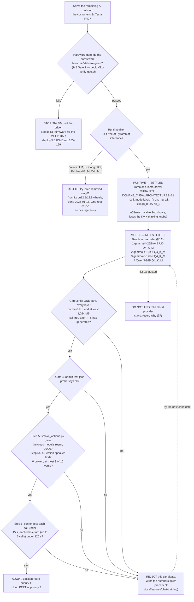

# SPIKE — Can the remaining external AI calls run on the customer's own Tesla P40s?

**Status:** In Review
**Owner:** Sina Shamsizadeh (technical owner)
**Prepared with:** AI assistance (Claude Code). Human review of this draft is pending.
**Timebox:** one session, desk research only — no server access
**Date:** 2026-09-20
**Updated:** 2026-09-30 (review corrections; still desk research; nothing measured except the host facts in the §3.1 box, measured 2026-09-30)
**Base commit for every code citation:** `3a4a415`

**Outcome:** → ADR, then a SPEC (§9.4).

> **Read the labels.** **Nothing in this document was measured on the target
> hardware, except the host facts in the §3.1 box, measured 2026-09-30.** When
> the spike was written the server was unreachable and reaching it was
> forbidden, so `nvidia-smi` was never run for it. Every figure is tagged:
>
> | Label | Means |
> |---|---|
> | **measured** | someone ran it, and the source says who and when |
> | **measured-from-repo** | read off a file listing, a repo file, or a Hugging Face file listing |
> | **reported** | a third party states it (a paper, a leaderboard, a project benchmark) — not independently reproduced |
> | **estimated** | computed here, with the arithmetic shown so it can be rejected |
>
> Where the only honest answer is "run it and see", §9.2 gives the exact command.
> **A question this spike could not settle is recorded as open (§8), not guessed.**

**The recommendation in three lines.** Proceed. The *runtime* is settled by the
evidence: `llama.cpp`'s `llama-server`, CUDA 12.9, built for `sm_61`, reached
through the existing `openai_compatible` adapter on the `internal` trust class,
with the cloud provider kept at route priority 2. The *model* is deliberately
**not** settled — §6.2 gives a ranked bench list and §9.2 the gate — because the
number that would decide it is the least reproducible number in the evidence
(§4.4) and no Gemma model has ever been benchmarked on Pascal (§8.1, U8).

## 1. Question

Can PadyarAIChatbot serve its remaining external AI calls — the selection
tier, the legacy classifier, and speech-to-text — from the customer's own
hardware, and if so on which serving runtime, which model, and with what
configuration?

Sub-questions that surfaced, each answered below:

| # | Sub-question | Section |
|---|---|---|
| 1 | Which runtime supports compute capability 6.1 today? | §4.2, §4.3, §6.1 |
| 2 | Which model and quantization, and does it fit? | §4.4, §4.5, §6.2 |
| 3 | Is the throughput enough for an exhibition kiosk? | §4.7 |
| 4 | Does the local stack honour `response_format="json_object"`? | §4.8 |
| 5 | Which self-hosted STT runs on Pascal? | §4.9, §6.3 |
| 6 | What exactly gets typed into the admin panel? | §4.10 |
| 7 | What does this NOT solve? | §8.3 |
| 8 | How is it verified on the server? | §9.2 |

## 2. Why It Matters

The evaluator's finding was "reliance on OpenAI/GapGPT APIs … no proprietary
model." Two things are blocked until this question is answered: whether the
product can be sold as a fully on-premise install, and whether the exhibition
kiosk keeps answering when the venue's internet does not.

**The gap is not code.** The repository is already built for this and has
never been pointed at a local server:

- `app/services/ai/endpoint_policy.py:12-18` says the on-prem case is the
  reason the module exists: "This product is sold for on-prem and enterprise
  deployment, where the whole point is that the model runs on `10.0.x.x`, or
  on `127.0.0.1:11434` as a local Ollama / vLLM / LiteLLM gateway. A blanket
  RFC1918 ban would make the on-prem product impossible."
- Two trust classes exist at `app/services/ai/endpoint_policy.py:74-76`, and
  loopback is gated by class rather than forbidden at `:147-152`.
- `app/services/ai/adapters/openai_compatible.py:52` already advertises the
  target in the admin panel: «هر سرویس‌دهنده‌ای که قرارداد Chat Completions را
  پیاده کند (گیت‌وی سازمانی، vLLM، LiteLLM و…)».
- It is already tested. `tests/test_ai_endpoint_policy.py:115-121` asserts
  that `http://127.0.0.1:11434/v1` (Ollama) and `http://10.0.0.5:8000/v1`
  (vLLM / LiteLLM) are permitted for an `internal` endpoint, under a docstring
  that reads "This is the on-prem product working. If these start failing, it
  broke."
- A self-hosted neural model already ships and already runs on these cards:
  the Persian TTS service, `deploy/tts/server.py`, loopback-bound on
  `127.0.0.1:8003` (`deploy/systemd/padyar-tts.service:49-50`).

**This spike does not re-open ADR-007.** `docs/engineering/DECISIONS.md:39-44`
already decided that the only external contract is OpenAI API compatibility
with a per-install base URL and key. This spike exercises that decision; it
does not revisit it.

## 3. Context

### 3.1 The hardware, as the repository reports it

The owner's request (2026-09-20) gave a hardware table that corrects an earlier
one built from recollection. The repository agrees with it:

| Fact | Value | Evidence | Label |
|---|---|---|---|
| Host | `gpu@192.168.100.6` — the existing box, not a new one | `deploy/README.md:3` | measured-from-repo |
| CPU | 40 vCPU per the repository; **36** per `nproc` on the host (box below) | `deploy/README.md:3` | measured-from-repo (40); measured 2026-09-30 on the host (36) |
| RAM | **27 GB** | `deploy/README.md:3` | measured-from-repo |
| GPUs | 2× Tesla P40, 24576 MB each | `deploy/README.md:3`, `docs/engineering/DECISIONS.md:94-95` | measured-from-repo |
| Compute capability | 6.1 (Pascal GP102) | see §4.1 | — |
| Virtualization | VMware guest with PCI passthrough | `deploy/20-gpu-driver.sh:44-53` | measured-from-repo |

**Why 27 GB and not 32.** The host is a VMware guest. 27 GB is what the guest
reports and therefore what any process on it can actually allocate; 32 GB
would be the figure before the hypervisor's reservation. The whole budget in
§4.6 is computed against 27 GB. Budgeting against 32 GB would hand back about
5 GB that does not exist, and RAM — not VRAM — is the binding constraint here.

> **Host facts measured after this spike.** Every figure in this box is
> **measured 2026-09-30 on the host**, by an AI-assisted session working for
> the owner, with read-only commands over SSH. Nothing was installed or
> changed. Every other number in this document keeps its own label.
>
> | Fact | Value |
> |---|---|
> | CPU | **36** vCPU from `nproc` (the repository says 40) |
> | Root filesystem `/` | 195G total, 111G free |
> | RAM | 27G total, about 14G available, from `free -g` |
> | NVIDIA driver | 580.173.02 |
> | Build tools | no `nvcc` and no `cmake` installed |
> | GPU memory, TTS at rest | GPU0 4311 MiB, GPU1 3283 MiB used, of 24576 each |
> | `https://developer.download.nvidia.com/...` | HTTP 403 from the host (likely export-control geo-blocking; inferred, not confirmed by NVIDIA) |
> | PyPI, Docker Hub, huggingface.co, github.com | reachable; `nvidia-cuda-nvcc-cu12==12.9.86` downloads from PyPI |
>
> What changes because of them:
>
> - **The TTS instances are on the GPUs** (U3 settled). The at-rest figures are
>   exactly ADR-012's after-load figures (3283 and 4311 MB). The capacity
>   measure is still the post-generation figure (§3.3), which this box does
>   not contain, so U2 stays open.
> - **The CUDA toolkit cannot come from NVIDIA's own servers.** The runfile and
>   the apt repository are behind the 403. An installer has to take `nvcc` from
>   PyPI or build inside a container image from Docker Hub. Whether the PyPI
>   wheels alone are enough to build llama.cpp (it also needs the CUDA runtime
>   headers and cuBLAS) is not checked here (U19).
> - **The CPU count is 36, not 40.** §4.9.5 and §6.3 now use 36.
> - **The weights can be downloaded:** huggingface.co is reachable (U18). The
>   ≈16 GiB GGUF fits in 111G free.
>
> **The model bench is being run separately.** Its results will be in
> `docs/features/local-inference/BENCH.md`. This spike contains no bench numbers,
> and none of the estimates in §4.5 or §4.7 has been replaced by a measurement.

### 3.2 A prerequisite the original request did not mention

`deploy/README.md:185-199` records that these cards did not work at all until
the VM was switched to **EFI firmware**:

> the VM must use EFI firmware. On BIOS firmware the hypervisor never maps the
> 24GB aperture, and the driver refuses both cards:
> `NVRM: BAR1 is 0M @ 0x0`

`pciPassthru.use64bitMMIO=TRUE` and `64bitMMIOSizeGB=128` are required but
**inert on a BIOS VM** (`deploy/20-gpu-driver.sh:44-53`). The README records
the fix as applied, and the resulting `Region 1: … [size=32G]`. Anything in
this document that puts a second CUDA process on these cards inherits that
prerequisite. `deploy/21-verify-gpu.sh` is the check, and §9.2 runs it first.

### 3.3 What already lives on the GPUs — ADR-012, re-resolved

`docs/engineering/DECISIONS.md:89-98` (ADR-012, "one model instance per
graphics card"). Re-resolved at base `3a4a415`, the load-bearing sentence is
at `:94-96`:

> هر نمونه درست بعد از بارگذاری ۳۲۸۳ تا ۴۳۱۱ مگابایت است و بعد از تولید به
> ۶۵۸۵ تا ۷۴۴۷ مگابایت می‌رسد، از ۲۴۵۷۶ مگابایت هر کارت؛ **معیار ظرفیت عدد
> دوم است نه اول.**

Translated: each instance is 3283–4311 MB right after loading and reaches
6585–7447 MB after generation, out of 24576 MB per card; **the capacity
measure is the second number, not the first.** (measured — ADR-012 records it
as an observation on this host.)

The difference matters exactly as much as the ADR says it does:

| | per instance | label |
|---|---|---|
| after load | 3283–4311 MB | measured (ADR-012) |
| after generation | 6585–7447 MB | measured (ADR-012) |
| difference | 3302 MB / 3136 MB | estimated (subtraction, shown) |

Budgeting against the load figure would overstate free VRAM by roughly 3.1–3.3
GB **per card**. A model that "just fits" on the load figure does not fit.
Every VRAM number in §4.5 uses the post-generation figure, and uses the top of
its range (7447 MB), because a kiosk's worst case is the one that matters.

**TTS keeps both cards.** That is the owner's decision (2026-09-20), and this
document does not propose consolidating it onto
one card. `deploy/systemd/padyar-tts.service:34` sets `TTS_WORKERS=2` and
`:43` sets `CUDA_VISIBLE_DEVICES=0,1`; `deploy/tts/server.py:221` places
worker *i* on `cuda:i`. So both cards carry a resident Chatterbox instance.

One thing the repository cannot tell me: `deploy/systemd/padyar-tts.service:39`
sets `EnvironmentFile=-/etc/default/padyar-tts`, which overrides `TTS_DEVICE`
and is not in the repository. The unit's comment at `:35-38` describes a CPU
mode used "while the P40s are unusable". The README says that blocker was
fixed. **I cannot confirm from the repository whether TTS is on the GPUs right
now.** §9.2 checks it. This document budgets as if it is, per that decision.

### 3.4 What the model is actually asked to do — and why that is the crux

This is the most important thing in the spike, and it comes from the code
rather than from any benchmark.

ADR-018 (`docs/engineering/DECISIONS.md:208-266`, "the model chooses, it does
not write") makes the model a **chooser**. It sees up to `ANSWER_TOPK` records
and the last few turns and returns one JSON object naming record ids. Every
fact string the visitor reads is re-read from the database.

On the **list path**, the model's only free text is a single lead sentence,
and `app/services/answer.py:446-475` gates it behind six checks. Check E is the
one that settles the feasibility question: **every content token in the lead
must already appear in the visitor's question, in the frame we wrote, or in
`FRAME_VOCAB`** — a fixed list of 74 Persian connector words
(`data/frame-vocabulary.json`). Check F bans any token belonging to a listed
record's name outright.

When the lead fails, `app/services/answer.py:735-742` keeps the deterministic
frame, renders the list anyway, and logs `answer.frame.rejected`.

**On the list path, a weaker model cannot degrade the Persian the visitor
reads.** It can only fail the check and lose one introductory sentence.

**But the list path is not the only path, and an earlier draft of this spike
missed that.** Two paths send model-written Persian to the visitor with **no
vocabulary check**:

| Path | What the visitor reads | Its only guards |
|---|---|---|
| **Converse reply** (tier `ai_converse`): greetings, small talk, self-introductions. All small talk goes to the model (`app/routers/chat.py:716-723`), and at a booth that is a large share of traffic (§4.7.3) | the model's `lead`, returned as the whole answer (`app/routers/chat.py:1190-1193`) | not empty, at most 200 characters (`_CONVERSE_LEAD_MAX_CHARS`, `app/services/answer.py:113`), no digit (`app/services/answer.py:1040-1047`) |
| **Written answer** on the third call (§4.7.5): out-of-scope questions. The code calls it "the ONE place the model still writes what a visitor reads" (`app/routers/chat.py:1215-1217`) | up to 555 tokens of prose from `get_openai_response` (`app/routers/chat.py:1218`, `app/services/openai.py:346`) | `generated_prose_is_grounded` (`app/routers/chat.py:1219`), which by its own docstring runs "Only the digit and shape checks ... a whole paragraph would fail the vocabulary subset check" (`app/services/answer.py:526-534`) |

So the bar for a local model has **two parts**. The first is the chooser bar:
emit a JSON object and pick correct ids from eight candidates. The second is a
writing bar: short, natural Persian for a greeting, and a readable Persian
paragraph for an out-of-scope question. A weaker model **can** degrade both of
those, and a visitor sees the greeting on their first message. The fact
guards still hold on both paths (no invented digits, bounded length), so the
risk is poor Persian, not invented facts. §9.2 Step 5b gates on it.

### 3.5 How often the external tier is reached

`app/services/metrics.py:52-55` exports `chat_tier_served_total{tier}`, and
`docs/engineering/MONITORING.md:103` notes the label set is closed. Read out
of `app/routers/chat.py`, it is **13 local tiers against 3 that reach a
provider**:

| Local (zero network calls) | line |
|---|---|
| `local_pick` | 444 |
| `local_booth` | 433, 891 |
| `local_company_search` | 530, 967 |
| `local_decline` | 554 |
| `local_affirm` | 594 |
| `local_company_field` | 687, 803 |
| `local_gibberish` | 703 |
| `local_entity` | 809 |
| `local_questions` | 838, 999 |
| `local_guide` | 866 |
| `local_facet_overview` | 920 |
| `local` | 988 |
| `local_intent` | 1021 |

| Reaches a provider | line |
|---|---|
| `ai_options` | 1163 |
| `ai_converse` | 1192 |
| `openai` | 1242 |

The request's figure of "13 local tiers" is confirmed, tier by tier.

**But three gates force the external tier regardless of local confidence**,
and any estimate that treats the AI tier as "only low-confidence queries" is
wrong:

- `app/routers/chat.py:719-723` — small talk and self-introductions null every
  local candidate. The comment above the gate (`:716-718`) is explicit: "Small
  talk is answered ONLY by the model — a product decision, 2026-08-31."
- `app/routers/chat.py:747-750` — a query naming two known entities defers to
  the tiers that can ask which one was meant.
- `app/routers/chat.py:623-628` — the unknown-entity gate.

### 3.6 The constraints any answer must respect

- **The local tiers must keep working with the model switched off.**
  `app/routers/chat.py:1265-1273` answers from a strong local match and
  otherwise returns a 200 with `no_answer`. Replacing a cloud provider with a
  local one must not turn a soft degradation into an outage.
- **Kiosk threat model.** The booth browser is shared. Nothing here may
  introduce state that leaks between visitors.
- **Product rule (`CLAUDE.md`).** No jargon on a visitor screen; nothing here
  may add a visitor-facing setting. Everything proposed lands in the admin
  panel or in a systemd unit.
- **Licensing.** `deploy/README.md:242-244` already records a licence trap on
  this host: the Persian Chatterbox voice is CC BY-NC 4.0 and "cannot ship in
  an installation sold to a customer without permission from the author." A
  model chosen here must not repeat that.
- **The team's standard for accepting a model.**
  `docs/features/chat-training/RESEARCH.md:32-55`: a teacher fine-tuned on
  these very P40s reached holdout retrieval acc@1 = 1.0, was distilled, then
  **rejected** because hit@1 fell from 0.9333 to 0.8750. "A confident worse
  retriever is a regression, not a feature." The same bar applies below.


## 4. Investigation

### 4.0 Method, and what it could not do

- Every codebase claim cites `file:line` at base `3a4a415`, and every line cited
  was opened and read.
- Every outside claim cites a primary source with its date. Where two sources
  publish the same upstream fact, they are counted as **one** and the text says
  so.
- **Two kinds of `file:line` appear in this document and they must not be
  confused.** A path starting `app/`, `deploy/`, `scripts/`, `tests/`, `data/`,
  `docs/`, `static/`, `templates/` or `migrations/` is **this repository at base
  `3a4a415`** and resolves locally. Any other path — `ggml/src/ggml-cuda/mmq.cu`,
  `openai/openai.go`, `src/cuda/utils.cc`, `tools/server/README.md`,
  `CMakeLists.txt`, `litellm/...`, `whisper/transcribe.py` — belongs to the
  **named external project** and is given with its commit or release date instead.
  All 114 in-repo citations were checked against the working tree when the
  draft was written. A later review found three that pointed at the wrong line
  (§3.5, §4.6.2, §4.8.7); they are corrected. On 2026-09-30 every citation added
  or changed in the revision was re-resolved at `3a4a415` with
  `git show 3a4a415:<path> | sed -n '<a>,<b>p'`.
- **No experiment was run and nothing was measured on the target hardware,
  except the host facts in the §3.1 box, measured 2026-09-30.** The
  server was unreachable and reaching it was forbidden, as were installing
  packages and downloading weights. There is therefore **no prototype code** to
  separate from production work.
- The repository supplies the epistemic rule this document follows.
  `deploy/README.md:253-257`, about the TTS model on this same host:

  > **Measure before you design around it.** … The published Chatterbox
  > latencies are RTX 4090 float16 figures and will not transfer.

  That is exactly this spike's exposure. Published tokens-per-second figures for
  modern GPUs do not transfer to a 2016 Pascal card, so none are borrowed. Where
  a figure is derived from a measurement on different hardware, the derivation is
  shown.

### 4.1 Evidence — the hardware facts everything else rests on

The request asked for these to be verified against a primary source rather than
assumed. All three hold, and one of them is more precise than the request's
wording.

**Source: NVIDIA CUDA C++ Programming Guide v12.6, dated 2024-08-01**, Table 4
"Throughput of Native Arithmetic Instructions (Number of Results per Clock Cycle
per Multiprocessor)".
<https://docs.nvidia.com/cuda/archive/12.6.0/cuda-c-programming-guide/index.html#arithmetic-instructions>
Cited from the 12.6 archive deliberately: the current guide has dropped compute
capability 6.1 from these tables entirely (see the CUDA 13 note below).

| Operation | CC 6.0 (P100) | **CC 6.1 (P40)** | CC 7.x |
|---|---|---|---|
| 16-bit FP add / multiply / multiply-add | 128 | **2** | 128 |
| 32-bit FP add / multiply / multiply-add | 64 | **128** | 64 |
| 64-bit FP add / multiply / multiply-add | 32 | **4** | 16 |
| 32-bit integer add | 64 | **128** | 64 |

- **fp16 : fp32 on CC 6.1 = 2 : 128 = exactly 1/64.** The request's claim is right
  to the number. (measured — vendor specification.)
- **Correct phrasing matters: fp16 is present and unusably slow, not absent.**
  It compiles and runs; it runs 64× slower than fp32.
- **CC 6.1 is a deliberate one-off, so "Pascal" is the wrong unit of
  analysis.** CC 6.0 (P100) runs fp16 at **2×** fp32, and CC 6.2 likewise. Only
  6.1 — the GP102/GP104 consumer-derived silicon this card uses — is crippled.
  Any advice about "Pascal" that does not distinguish 6.0 from 6.1 is unsafe
  here.

**No bf16, no tensor cores** — same guide, "Feature Support per Compute
Capability" table: bfloat16 operations first appear at 8.x, Tensor Cores and
WMMA first appear at 7.x, both "No" for 6.x. Half-precision operations are "Yes"
from 5.3. (measured — vendor specification.)

**DP4A / INT8 is present, and it is the whole opportunity.** NVIDIA *Pascal
Compatibility and Tuning Guide* v13.4, dated 2026-09-13
(<https://docs.nvidia.com/cuda/pascal-tuning-guide/index.html>):

> The `__dp4a` intrinsic computes a dot product of four 8-bit integers with
> accumulation into a 32-bit integer. … GP104 provides specialized instructions
> for two-way and four-way integer dot products. These are well suited for
> accelerating Deep Learning inference workloads. … The specific compute
> capabilities of GP100 and GP104 are 6.0 and 6.1, respectively. **The GP102
> architecture is similar to GP104.**

So the P40 (GP102, 6.1) **has** DP4A and the P100 (6.0) does not — the opposite
way round from fp16.

**Tesla P40 Product Brief, PB-08338-001_v01, dated 2016-11-29**
(<https://images.nvidia.com/content/pdf/tesla/Tesla-P40-Product-Brief.pdf>):

> A new feature of the Tesla P40 GPU Accelerator is the support of the "INT8"
> instruction which is optimized for deep learning inference. As a result, Tesla
> P40 delivers **47 TOPS** … It is designed for **single precision** GPU compute
> tasks…

Specifications from the same brief: GP102-895-A1, **3840 CUDA cores**, boost
**1531 MHz**, 24 GB GDDR5, 250 W. The brief mentions fp16, bf16 and tensor cores
nowhere, consistent with the feature table.

**A caution for anyone re-checking this:** do **not** use
`nvidia-p40-datasheet.pdf` for throughput. That document is the Quadro vDWS /
virtual-graphics datasheet and contains no FLOPS or TOPS figures at all. The
Product Brief is the primary source.

**The arithmetic that makes the decision (estimated — my calculation from the
vendor figures above, not a vendor number):**

- fp32 peak = 3840 × 2 × 1.531 GHz ≈ **11.76 TFLOPS**
- int8 via DP4A at 4 MACs per fp32-lane-equivalent = 11.76 × 4 ≈ **47.0 TOPS** —
  which reproduces NVIDIA's published 47 TOPS to three significant figures, so
  the model of the hardware is right.
- fp16 at the measured 1/64 ratio ≈ **184 GFLOPS**
- **int8 : fp16 ≈ 256 : 1**

That one ratio is the entire engineering argument of this spike. **Quantized
int8/int4 inference through DP4A is the only fast path on this card, and any
runtime whose hot loop is an fp16 GEMM is structurally wrong for it** — which is
what eliminates vLLM, SGLang, TGI and ExLlamaV2 below, and it eliminates them on
hardware grounds rather than on a missing build flag.

An independent cross-check from a different direction: ExLlamaV2 issue #786,
maintainer-adjacent comment dated 2025-05-05 — "it is not recommended to use
exllamav2 on Pascal GPUs due to their extremely poor fp16 compute performance,
**with the exception of the P100**." A third party hit the same 6.0-versus-6.1
split from the performance side.

### 4.2 Evidence — the constraint that dates this whole decision

**CUDA 13 removed Pascal. This is an expiry date on the hardware, and it should
be written into any plan that follows.**

NVIDIA *CUDA Toolkit 13.0 Release Notes*, §2.6.2 "Deprecated Architectures",
dated 2025-08-08
(<https://docs.nvidia.com/cuda/archive/13.0.0/cuda-toolkit-release-notes/index.html>):

> Architecture support for Maxwell, Pascal, and Volta is considered
> feature-complete. Offline compilation and library support for these
> architectures have been **removed in CUDA Toolkit 13.0** major version
> release. … The use of CUDA Toolkits through the 12.x series to build
> applications for these architectures will continue to be supported, but newer
> toolkits will be unable to target these architectures.

The NVIDIA developer blog "Navigating GPU Architecture Support" (2025-08-04)
says the same thing operationally — remain on 12.9, remain on driver branch 580,
"the final branch that supports GPUs before CC 7.5", supported through roughly
2028. **These two are one source, not two:** the blog publishes the same upstream
policy as the release notes.

Confirmed independently by inspection: the current CUDA Programming Guide
(v13.4.2, last updated 2026-09-10) contains no occurrence of "6.1" or "Pascal"
in its compute-capabilities appendix.

**Operational envelope, and it is a hard ceiling:**

| Constraint | Value |
|---|---|
| CUDA toolkit | ≤ 12.9 |
| Driver branch | ≤ 580, and ≥ 570 (Ollama's stated floor for CC 5.0–6.2) |
| NVIDIA support horizon | roughly 2028 |

Two consequences that belong in the recommendation, not in a footnote:

1. **Pin the toolchain and record it.** Every runtime below is fine *today* and
   every one of them will drop sm_61 the moment it moves to a CUDA-13 build. The
   evidence for that is already visible in the build files: both llama.cpp and
   Ollama gate their sm_61 line on `CUDA < 13`.
2. **This is a bridge, not a destination.** Committing the product's inference
   path to these cards buys roughly three years. That is genuinely useful for an
   exhibition install and a bad foundation for a long-lived product decision,
   and the ADR that follows should say so.

#### The deeper root cause: PyTorch dropped Pascal too

"Stay on CUDA 12.9" does **not** rescue a PyTorch-based runtime, and this is the
single most useful mechanism in the whole spike.

**pytorch/pytorch issue #157517**, "[release 2.8-2.9] Delete support for Maxwell,
Pascal, and Volta architectures for CUDA 12.8 and 12.9 builds" — opened
2025-07-03, **closed 2026-01-16** as completed (`closed_at`
2026-01-16T19:11:22Z, `state_reason: completed`, read from the GitHub API on
2026-09-30).
<https://github.com/pytorch/pytorch/issues/157517>

The issue body is a plan, not a changelog, so read it for what it lists. It
says Pascal is "deprecated however still supported" in CUDA 12.8 and 12.9 as
a *toolkit*, and it lists the arch set PyTorch 2.8 builds for each wheel:

> For Release 2.8 Option 1 (Currently in trunk):
> CUDA 12.6: 5.0;6.0;7.0;7.5;8.0;8.6;9.0
> CUDA 12.8: 7.5;8.0;8.6;9.0;10.0;12.0 -> Version Released on pypi
> CUDA 12.9: 7.5;8.0;8.6;9.0;10.0;12.0+PTX

The alternative that kept `6.0` in the cu12.8 wheel ("Option 2") is marked in
the same body as "not a possible due to large binary size". So the claim that
holds is narrower than "PyTorch dropped Pascal from CUDA 12.8": **the PyTorch
cu12.8 and cu12.9 wheels start at sm_75**, even though the CUDA 12.8/12.9
toolkits themselves can still target Pascal. Its own runtime error, quoted in
ExLlamaV2 issue #786 (2025-05-05):
"Found GPU0 NVIDIA GeForce GTX 1080 Ti which is of cuda capability 6.1. PyTorch
no longer supports this GPU … The minimum cuda capability supported by this
library is 7.5."

PyTorch's wheel architecture lists (`.ci/wheel/linux/build_env_setup.py`) are
cu12.6 = {50, 60, 70, 75, 80, 86, 90} and every cu13.x = {75, 80, 86, 90, 100,
120}. **sm_61 is absent even from cu12.6.** It works only through binary
compatibility — the CUDA Programming Guide §3.1.2 states that "a cubin object
generated for compute capability X.y will only execute on devices of compute
capability X.z where z >= y", so the sm_60 cubin runs on sm_61. A cu13.x wheel
will not run on a P40 at all.

**This one fact explains five of the six rejections in §4.3.** vLLM, SGLang,
TGI, ExLlamaV2/TabbyAPI and MLC-LLM are all PyTorch-based. llama.cpp, Ollama and
KoboldCpp touch no PyTorch at inference time, which is exactly why they are the
only survivors. That is a more durable reason than any per-project version
number, because it will not change when those projects bump a minor release.

**This repository already knows it, and is already pinned by it.**
`deploy/tts/requirements.txt:1-9` (verified at base `3a4a415`):

> ```
> # Pinned for a Tesla P40 (Pascal, sm_61). DO NOT bump torch.
> # PyTorch removed Maxwell/Pascal from its CUDA 12.8+ wheels, so any newer
> # build contains no sm_61 machine code and every kernel launch fails with
> # cudaErrorNoKernelImageForDevice. torch 2.6.0 from the cu124 index is both
> ```

and `deploy/25-install-tts.sh:35-37` installs `torch==2.6.0 torchaudio==2.6.0`
from the cu124 index, logging "the last build with sm_61 kernels".
`deploy/20-gpu-driver.sh:6-8` pins the driver with the same reasoning: "580 is
the LAST NVIDIA branch that supports Pascal … there is nothing to gain and the
cards stop working."

Three consequences:

1. **The TTS service is already standing on the far side of this cliff**, held in
   place by one pinned wheel. `pip install -U torch` in that virtualenv breaks
   Persian speech on this host. That risk exists today and is not created by this
   spike, but anything added to these cards should not add a second copy of it.
2. **A non-PyTorch runtime is therefore the safer addition**, not merely the
   faster one. llama.cpp and Ollama ship their own CUDA kernels.
3. **A driver reporting "CUDA Version: 13.0" does not mean CUDA 13 can compile
   for the card.** Community comments on that PyTorch issue (2025-10-23,
   2025-10-27) note driver 580 reporting CUDA 13.0 on Pascal cards and read
   NVIDIA's datacenter matrix as covering Pascal to 8/2028. I did **not** verify
   the 8/2028 date against an NVIDIA page — treat it as a community reading
   consistent with the vendor blog's "sometime in 2028". Whoever provisions the
   box must not be misled by that version string.

### 4.3 Evidence — which runtime supports sm_61 today (question 1)

#### 4.3.1 Recommended

**llama.cpp (`llama-server`) — RECOMMEND.** sm_61 is in the default build and is
an actively tuned target, and this is verified in the code rather than in prose:

- `ggml/src/ggml-cuda/CMakeLists.txt` (commit `5a4d0fec`, 2026-09-09) carries
  the comment `# 61 == Pascal, __dp4a instruction (per-byte integer dot product)`
  and appends `50-virtual 61-virtual 70-virtual` — but **only**
  `if (CUDAToolkit_VERSION VERSION_LESS "13")`.
- `ggml/src/ggml-cuda/common.cuh` (commit `ad6c6683`, 2026-09-13) —
  `fast_fp16_available()` and `fast_fp16_hardware_available()` both hard-exclude
  `cc == 610`. The maintainers have encoded "6.1 has no usable fp16" directly
  into the kernel selector.
- `ggml/src/ggml-cuda/mmq.cu` (commit `fccf7166`, 2026-09-16) —
  `ggml_cuda_should_use_mmq()` returns true unconditionally at cc 610, because
  `fp16_mma_hardware_available()` requires cc ≥ 700. So a P40 is **always**
  routed through the int8/DP4A MMQ kernels. MMQ covers Q4_0/Q4_1/Q5_0/Q5_1/Q8_0,
  Q2_K–Q6_K and the IQ types.
- A maintainer benchmarks on physical P40s: PR #15769, "CUDA: faster tile FA
  (Pascal/AMD), headsize 256", merged 2025-09-06 — "I tuned `kq_stride` and
  `kq_nbatch` for P40/RX 6800/Mi 50."

Two operational notes that follow from the same files:

- `61-virtual` is **PTX only**, JIT-compiled to SASS on first run (the CMake
  file says so). A `GGML_NATIVE` / `-arch=native` build on the host itself
  avoids the first-run JIT and is the cleaner path.
- **Known open bug: do not use `-sm tensor` on a multi-P40 host.** Issue #27577,
  opened 2026-08-22 and **still open** as of 2026-09-20: "`-sm tensor` crashes
  with CUDA error on Pascal (sm_61) during graph compute — loads fine". Use the
  default layer split.
- `GGML_CUDA_FORCE_MMQ` is widely recommended in community posts and is a
  **no-op here** — MMQ is already unconditional at cc 610 per `mmq.cu` above.

**Honest gap.** I looked for a maintainer *sentence* stating "Pascal works but
fp16 is slow, use Q4_K / MMQ" and did not find one in llama.cpp's docs or
issues. The claim is verified, but its evidence is the code above, not a quote.
Saying so is the point: an invented quotation would be worse than a gap.

**Ollama — VIABLE, and it carries the single strongest piece of evidence.**

- `docs/gpu.mdx` (commit `948f6933`, 2026-08-11): "Ollama supports Nvidia GPUs
  with compute capability 5.0+ and driver version 550 and newer. Nvidia GPUs with
  compute capability 5.0 through 6.2 require driver version 570 or newer." Its
  support table has a 6.1 row whose Tesla entry is exactly **`P40`**.
- Stronger than the docs: `llama/server/CMakePresets.json` (commit dated
  2026-07-21) sets the CUDA-12 Linux preset to
  `50-virtual;52-virtual;60;61;70;75;…` — `61` with no suffix means **real
  precompiled SASS**, not just PTX. Its CUDA-13 preset starts at `75`, exactly
  mirroring NVIDIA's removal.

So Ollama ships native sm_61 device code and names the card in its own
documentation. It is the lower-risk install; llama-server is where the Pascal
tuning actually lands and gives more control.

**KoboldCpp — VIABLE, third choice.** `Makefile` (last commit 2026-09-13): the
CU11 and CU12 `LLAMA_PORTABLE` variants both emit
`-gencode arch=compute_61,code=compute_61`; the CU13 variant starts at
`compute_75`, and `CMakeLists.txt` carries the rationale as a comment,
`# 61 == integer CUDA intrinsics`. The **default published release binary** takes
the sm_61 path (the release workflow sets `KCPP_CUDA: 12.1.0`), and a dedicated
"oldpc" CUDA 11.4 lane exists for exactly this hardware (release v1.121,
2026-09-15). Genuinely viable. Not recommended here only because it adds nothing
over `llama-server` for this use.

#### 4.3.2 Rejected, with reasons

| Runtime | Verdict | Why | Source + date |
|---|---|---|---|
| **vLLM** | **REJECT** | Upstream floor is **7.5**, not 7.0 — the request's premise is out of date and the bar has risen. `CMakeLists.txt` (commit 2026-09-13) lists `7.5;8.0;…` for CUDA ≥ 12.8 and `7.0;7.5;…` only on the pre-12.8 branch; **6.1 appears in no branch**. Docs: "GPU: compute capability 7.5 or higher". Issue #963 "Support for compute capability <7.0" was opened 2023-09-06 and **closed 2023-09-11** without implementation | `docs/getting_started/installation/gpu.cuda.inc.md` (rendered page dated 2026-05-11 — same file, one source); `CMakeLists.txt` 2026-09-13 |
| **vLLM Pascal forks** | **REJECT** | `sasha0552/pascal-pkgs-ci`: last commit 2025-08-23, single rolling `wheels` tag published 2024-08-10, README tops out at vLLM v0.10.0 against upstream v0.29.0 (2026-09-09) — roughly 13 months stale and ~19 minor versions behind. Its own README warns "Support for new GPUs has been disabled" and that the wheels are "in a soft-broken state due to PyTorch. To use them, you need to manually patch PyTorch after installation." `cduk/vllm-pascal`: last commit 2025-02-21, README says discontinued in favour of the above | both repositories, dates as given |
| **HF TGI** | **REJECT** | `Dockerfile:76` sets `TORCH_CUDA_ARCH_LIST="8.0;8.6;9.0+PTX"` (last commit 2025-05-21) — the only PTX is 9.0, which cannot JIT *down* to sm_61. `docs/source/installation_nvidia.md` names H100/A100/A10G/T4, lowest being sm_75. Independently, TGI is in maintenance: its README now points users at vLLM/SGLang/llama.cpp, last release v3.3.7 (2025-12-19) | as cited |
| **SGLang** | **REJECT, hard** | `docs/docs/get-started/install.mdx:33` (last commit 2026-09-10): "SGLang requires CUDA 13. The CUDA 12 (cu129) wheels and images are retired"; `:105` "`lmsysorg/sglang:v0.5.19-cu129` is the last CUDA 12 tag." CUDA 13 cannot target Pascal at all (§4.2). Also `:233` FlashInfer "only supports sm75 and above", and `FLASHINFER_CUDA_ARCH_LIST="8.0 8.9 9.0a 10.0a 12.0a"` floors at Ampere. Maintainer `zhyncs`, issue #1059, 2024-08-12: "We primarily focus on sm80+ and sm75" | as cited |
| **TabbyAPI / ExLlamaV2** | **REJECT** — and note the mechanism precisely | Its wheels **do** compile sm_61: `.github/workflows/build-wheels-release.yml:29-33` (last commit 2025-12-09) lists `cudaarch: '6.0 6.1 7.0 7.5 8.0 8.6 8.9 9.0+PTX'`. So there is no ExLlamaV2 arch gate. The blockers are PyTorch (§4.2) plus fp16: issue #786, 2025-05-05, "not recommended to use exllamav2 on Pascal GPUs due to their extremely poor fp16 compute performance, with the exception of the P100 … `flash-attn` 2 is not supported on Pascal." Issue #40 closed as stale by `turboderp`, 2024-06-14 | as cited |
| **ExLlamaV3** | **REJECT** | Hard floor sm_80, two generations above this card. `turboderp`, issue #162, 2026-03-05: Turing "don't support the m16n8k16 fragment shapes used in the kernel." PR #325 "Turing (sm_75) support", opened 2026-09-02, still open, shows `ptxas error : Feature 'cp.async' requires .target sm_80 or higher` | as cited |
| **MLC-LLM** | **REJECT in practice** (no stated floor either way) | `docs/install/tvm.rst` leaves `CUDA_ARCH` to the user and no minimum is published. Maintainer positions, issue #2100: `Hzfengsy` 2024-04-08, "I think it should work if you turn off flashinfer and cutlass support. However, we do not have resource to optimize for such old device"; `tqchen` 2024-05-28 similar. Nobody in that thread reported a working P40; wheels are cu128/cu130 only. Not a serious option rather than an unknown one | as cited |

**One root cause, not six.** Every rejection above except MLC-LLM reduces to
§4.2: the project is built on PyTorch, and PyTorch no longer carries sm_61.
llama.cpp, Ollama and KoboldCpp survive because they ship their own CUDA kernels.

**Empirical corroboration of the 1/64 figure, from the opposite direction.**
`IMbackK` on ExLlamaV2 issue #40, 2024-08-26: "exllama's kernels do all
calculations on half floats, Pascal gpus other than GP100 (p100) are very slow in
fp16 because only a tiny fraction of the devices shaders can do fp16 (1/64th of
fp32)." The same issue records **1.19 tok/s** for a 34B model at 4.0 bpw on a
Tesla P40 through an fp16 runtime — against the 20+ tok/s llama.cpp users report
on the same card. That contrast is the 1/64 ratio showing up as a product
decision rather than a spec table. (Anecdotal, single machine; it corroborates
the vendor table in §4.1, it does not replace it.)

#### 4.3.3 LiteLLM is not a competitor here

LiteLLM is **not a serving runtime**. It loads no weights and runs no kernels;
it is an SDK plus a gateway, and its docs state no GPU requirement of any kind
(<https://docs.litellm.ai/docs/> — no date found on the page). The request listed it
alongside the others; the honest answer is that the question does not apply.

It is also **not needed**, and that is the more useful finding. Its job —
one OpenAI-shaped endpoint in front of several backends, with ordered failover —
is already done inside this application by the AI control plane:
`app/services/ai/store.py:83-96` (ordered route targets) and
`app/services/ai/engine.py:112-132` (the failover walk). Adding LiteLLM would put
a second router in front of the one we already maintain, with a second place for
`response_format` to be transformed (`litellm/llms/ollama/chat/transformation.py:169-173`
does transform it) and a second process to run. **Rejected as duplication**, per
`CLAUDE.md`'s rule against a second way of doing something that already has a
standard implementation.

### 4.4 Evidence — which model, and does Persian actually work (question 2)

#### Two independent Persian leaderboards, and they agree

**Source A: Open Persian LLM Leaderboard v2.0.0** — `opll-org/Open-Persian-LLM-Leaderboard`
(Hugging Face Space, updated 2026-09-19). Built by Part DP AI and the Amirkabir
University NLP Lab on EleutherAI's LM Evaluation Harness: 21 Persian tasks, more
than 40k samples, partly held out. Note `PartAI/open-persian-llm-leaderboard` is
the **same team's v1** — one source, not two.

**Source B: MIZAN Persian LLM Leaderboard** — `MCINext/mizan-llm-leaderboard`
(Hugging Face Space, updated 2025-11-25). Persian IFEval, Persian MT-Bench,
PerMMLU, PerCoR, Persian NLU, Persian NLG. It predates Gemma 4.

| Model | OPLL v2 MMLU-Pro(fa) | MIZAN average | Both labels |
|---|---|---|---|
| gemma-4-31B-it | 62.2 | not covered | reported |
| Qwen3.8-27B | **67.12** | not covered | reported |
| gemma-4-26B-A4B-it | 54.55 | not covered | reported |
| Qwen3-32B | 42.8 | 0.6224 | reported |
| gemma-3-27b-it | 36.6 | **0.6247** (top open model) | reported |
| Qwen3-14B | 35.5 | 0.5912 | reported |
| gemma-3-12b-it | 32.6 | 0.6008 | reported |
| Qwen2.5-14B-Instruct | 34.6 | not covered | reported |
| Mistral-Small (3.1/2409) | 21.3 | 0.5576 | reported |
| aya-expanse-32b | 32.1 | 0.4945 | reported |
| Dorna2-Llama3.1-8B | 22.7 | not covered | reported |
| Llama-3.1-8B-Instruct | 25.7 | not covered | reported |
| PersianMind-v1.0 | 14.5 | not covered | reported |

**Where the two leaderboards overlap they agree on the ordering**:
gemma-3-27b ≈ Qwen3-32B > gemma-3-12b ≈ Qwen3-14B > Mistral Small > Aya. Two
independently-built harnesses reaching the same ranking is the strongest Persian
evidence available. **Gemma wins per parameter**: its 12B ties Qwen's 14B and its
27B ties Qwen's 32B.

#### The load-bearing caveat, stated because it decides the recommendation

The `gemma-3-*`, `Qwen3-*`, `aya-*` and `Dorna*` rows on Source A carry
`Precision: BF16` and a real commit sha. **The `gemma-4-*` and `Qwen3.8-*` rows
carry `Precision: unknown` and `Model sha: unknown`** — they were not produced by
the same reproducible pipeline. Worse, `Qwen3.8-27B` and `gemma-4-26B-A4B-it`
score 44.4–44.9 on BoolQA and 34–38 on Hallucination while `gemma-4-31B-it`
scores 96.2 and 74.37 on the same tasks. That pattern looks like thinking-mode
output defeating the harness's answer extraction, not a capability gap.

**So the highest Persian scores in this table are its least reproducible
numbers.** Treat the three newest rows as indicative, not measured. §6.2 gates the
model choice on a local measurement for exactly this reason.

#### Model-card language claims are a poor predictor

| Family | What the card says | Persian named? |
|---|---|---|
| Llama 3.1 | HF metadata `language: en, de, fr, it, pt, hi, es, th` | **No** — the request's suspicion is confirmed |
| Qwen2.5 | "over 29 languages"; HF metadata `language: en` only | Not named |
| Qwen3 | "100+ languages"; tech report arXiv:2505.09388 (2025-05-15) says 119, and `fa` appears in its Table 10 list | Yes, in the report |
| Qwen3.8-27B | **no multilingual claim and no language list at all** | Could not verify |
| Gemma 3 | HF metadata `language: en`; repo gated, card body unreadable | Could not verify |
| Gemma 4 | "multilingual support in over 140 languages", "35+ out of the box"; tech report arXiv:2607.02770 names **no** languages and gives **no** Persian benchmark | **No — Google never names Persian** |
| Mistral Small 3.2 | HF metadata explicitly lists `fa` | Yes |
| Aya Expanse | HF metadata explicitly lists `fa` | Yes |

**The two families that explicitly claim Persian (Mistral, Aya) both underperform
the family that never mentions it (Gemma).** Aya Expanse 32B scores below
gemma-3-12b on MIZAN. So a card's language list is not evidence; a benchmark is.

#### Persian-specific fine-tunes are a dead end

`Dorna2-Llama3.1-8B-Instruct` scores **48.81** on Source A against its own base
`Llama-3.1-8B-Instruct` at **50.31** — worse than the model it was tuned from, on
the leaderboard Dorna's own authors built. `PersianMind-v1.0` (37.14) and
`Maral-7B-alpha-1` (33.37) sit near the bottom. Every Persian-tuned model found is
built on a 2024-era 7–13B base (Llama-2/3-8B, Mistral-7B, Phi-3-mini,
Gemma-2/3-2B/4B); a 2026 general model of 12B+ beats them on Persian by a wide
margin. Licences compound it: PersianMind is cc-by-nc-sa-4.0, PersianLLaMA-13B is
cc-by-nc-4.0, Dorna is Llama-licensed and gated.

This is also the right answer architecturally: the Persian-specific lexical work
in this product is already done by the local tiers — normalization
(`app/utils/normalizer.py`), synonym expansion, BM25 (`app/services/bm25.py`) and
the model2vec embeddings. The model only has to pick ids (§3.4).

#### Persian tokenizer efficiency — a real measurement exists

**Source: TokSuite, "Measuring the Impact of Tokenizer Choice on Language Model
Behavior", arXiv:2512.20757 — v1 2025-12-23, v2 2026-07-06, ICML 2026
(PMLR 306), Appendix B Table 4.** Subword fertility (mean tokens per word, Rust
et al. 2021) over 10,000 parallel FLORES-200 samples, Persian = `pes_Arab`, words
split by DataTrove's language-specific tokenizers rather than whitespace.

| Tokenizer | vocab | Persian tokens/word | parity vs English |
|---|---|---|---|
| Gemma-2 | 256,128 | **1.83** | **1.45** |
| Aya | 255,029 | 1.85 | 1.48 |
| Tekken / Mistral | 130,000 | 1.92 | 1.47 |
| GPT-4o o200k | 200,000 | 1.93 | 1.55 |
| Llama-3.2 | 128,256 | 1.94 | 1.52 |
| BLOOM | 250,680 | 2.01 | 1.80 |
| **Qwen-3** | 151,646 | **2.45** | **2.63** |

(All **reported** by the paper.) **Qwen-3's tokenizer costs 34% more tokens per
Persian word than Gemma's, and its English-parity gap is 1.8× worse.** The paper
states the general point itself: "vocabulary size alone does not guarantee
efficiency; Qwen-3 and Gemma-2, despite having large vocabularies (>150K), show
comparable or worse performance than smaller vocabulary tokenizers like mBERT on
certain metrics."

Directional corroboration from a second paper and a different script: "Soro: A
Lightweight Foundation Model and Chatbot for Tajik", arXiv:2605.27379,
2026-05-26, Table 2 — Gemma 3-12B 2.380 (best), Ministral 3-8B 2.696,
Llama 3.1-8B 2.798, Qwen 3 / 2.5 2.860 (worst). Tajik is Persian in Cyrillic, so
this does **not** transfer numerically to Farsi script, but two papers across two
scripts produce the same ordering.

**Why this matters here, concretely.** The selection prompt pastes
`ANSWER_TOPK=8` records plus `HISTORY_TURNS=5` turns of Persian into one request
(§3.4, §4.7). Under Qwen's tokenizer that same prompt costs about a third more
tokens — which is a third more prefill on a card whose prefill is the bottleneck.
It also burns the context window faster. That partly cancels Qwen3's advantage of
being a plain dense architecture with actual published Pascal experience.

**The honest gap:** TokSuite measured Gemma-**2**'s 256,128-entry tokenizer. The
262,144-entry tokenizer shipped in Gemma 3 and Gemma 4 has **never been measured
on Persian**, and neither Gemma tech report gives per-language fertility. Closing
that gap is a ten-minute CPU-only job and §9.3 lists it first.

**One repo-specific subtlety.** Persian fertility is very sensitive to
normalization — Arabic versus Persian yeh and kaf, ZWNJ half-spaces, optional
diacritics — and TokSuite calls this out for Farsi by name.
`app/utils/normalizer.py` already normalizes text before it reaches the model, so
the number that matters is fertility **on normalized text**. Measuring raw text
would give the wrong answer.

### 4.5 Evidence — the VRAM budget, with TTS still running (question 2)

#### 4.5.1 What is left on each card, with TTS still running

Per the owner's decision, TTS keeps both cards untouched. Per ADR-012, the capacity
measure is the **post-generation** figure, and this table uses the top of its
range because a kiosk's worst case is the one that matters.

| Line | Per card | Label |
|---|---|---|
| Card capacity | 24,576 MB | measured (ADR-012, `docs/engineering/DECISIONS.md:95`) |
| − TTS instance, post-generation, worst case | −7,447 MB | measured (ADR-012, `:94-95`) |
| − CUDA context for a second process on the same card | −≈300 MB | **estimated** — a separate process needs its own context; no measurement available |
| **= available to an LLM, per card** | **≈16,829 MB** | estimated (subtraction of the above) |
| **= available across both cards** | **≈33,658 MB** | estimated |

Had this been budgeted against ADR-012's *after-load* figure (4,311 MB), the
per-card line would read ≈19,965 MB — **3,136 MB more VRAM than exists once TTS
has generated once.** That is the error the request warned about, and it is large
enough to make a 22 GB model look like it fits on one card when it does not.

#### 4.5.2 The rule that follows

> **Fit the model on ONE card, in the ≈16.8 GB that card has left.**

Not because 33 GB is unavailable, but because using both cards costs three
things: tensors crossing PCIe on every token (these are 2016 cards in a VMware
guest, with no NVLink), a second CUDA context to pay for, and — the real
objection — it puts the LLM in direct contention with **both** TTS instances
instead of one. ADR-012 already measured what contention does on these cards:
four concurrent TTS requests became two pairs, 25.8 / 25.8 / 44.6 / 46.4 s
(`docs/engineering/DECISIONS.md:96-97`). A visitor waiting on both a spoken
answer and a model decision is the case to avoid.

Single-card residency also leaves the other card's TTS instance undisturbed,
which is the shape the owner asked for.


#### 4.5.3 Candidate weights, KV cache, and what actually fits

GGUF file sizes are **measured-from-repo** — read off the Hugging Face file
listing on 2026-09-20, not derived from a formula. GiB = bytes / 1024³.

**A warning before the table: "Q4_K_M" is not one number.** For
`gemma-4-31B-it`, `unsloth` ships 17.07 GiB, `bartowski` ships 18.25 GiB, and
Google's own QAT `q4_0` is 16.44 GiB — a 1.2 GiB spread at the same nominal
quant. Always check the specific file.

KV-cache figures are **estimated** (my arithmetic from each model's `config.json`
on Hugging Face, fp16, at 16k context). The plain
`2 × layers × kv_heads × head_dim × ctx × 2 B` formula **badly over-counts the
Gemma models**, which are hybrid: `gemma-4-31B-it` has 50 of 60 layers on
sliding-window-1024 attention (a fixed cost, independent of context) and the 10
global layers use unified K=V (`attention_k_eq_v: true`), so they store one tensor
rather than two. That architecture detail is worth more here than a parameter
count.

| Model | GGUF repo | weights GiB | KV @16k GiB | total | fits ONE card (16.43)? | fits two (32.87)? |
|---|---|---|---|---|---|---|
| gemma-4-26B-A4B-it UD-Q4_K_M (MoE, 3.8B active) | `unsloth/gemma-4-26B-A4B-it-GGUF` | 15.78 | 0.35 | **16.13** | **yes** | yes |
| gemma-4-12b-it Q4_K_M | `unsloth/gemma-4-12b-it-GGUF` | 6.63 | 1.41 | 8.04 | yes | yes |
| gemma-3-12b-it Q4_K_M | `unsloth/gemma-3-12b-it-GGUF` | 6.80 | 1.66 | 8.46 | yes | yes |
| Qwen3-14B Q4_K_M | `unsloth/Qwen3-14B-GGUF` | 8.38 | 2.50 | 10.88 | yes | yes |
| Mistral-Small-3.2-24B Q4_K_M | `unsloth/…-GGUF` | 13.35 | 1.50 | 14.85 | yes | yes |
| gemma-3-27b-it Q4_K_M | `unsloth/gemma-3-27b-it-GGUF` | 15.41 | 1.66 | 17.07 | **no** | yes |
| gemma-4-31B-it Q4_K_M | `unsloth/gemma-4-31B-it-GGUF` | 17.07 | 1.41 | 18.48 | **no** | yes |
| Qwen3-32B Q4_K_M | `unsloth/Qwen3-32B-GGUF` | 18.40 | 4.00 | 22.40 | **no** | yes |
| aya-expanse-32b Q4_K_M | `bartowski/aya-expanse-32b-GGUF` | 18.44 | — | — | no | yes |

Two results fall straight out of this table:

1. **Nothing above 24B fits on one card.** The highest-scoring Persian model,
   `gemma-4-31B-it`, misses the single-card budget by 2.05 GiB even at Q4_K_M, and
   dropping to Q4_K_S (16.20) or Google's QAT q4_0 (16.44) does not rescue it once
   the KV cache is added.
2. **The MoE is the only strong candidate that fits one card with a 16k
   context** — 16.13 of 16.43 GiB, and its KV cache is the smallest on the table
   at 0.35 GiB because 25 of its 30 layers are sliding-window with K=V unified.

`Qwen3.8-27B` is excluded from the fit table because §4.7 rejects it on
correctness grounds, not capacity.

#### 4.5.3b The whole stack against the full 48 GB, TTS still running

The criterion is that the proposed stack fits **with TTS untouched on both
cards**. Taking the recommended first bench candidate,
`gemma-4-26B-A4B-it` UD-Q4_K_M at 16k context, resident on card 0:

| Card | Item | MB | Label |
|---|---|---|---|
| 0 | TTS instance, post-generation worst case | 7,447 | measured (ADR-012) |
| 0 | LLM weights, UD-Q4_K_M (15.78 GiB) | 16,159 | measured-from-repo |
| 0 | LLM KV cache @16k (0.35 GiB) | 358 | estimated |
| 0 | LLM CUDA context | ~300 | estimated |
| | **card 0 subtotal** | **≈24,264 of 24,576** | **fits, 312 MB spare** |
| 1 | TTS instance, post-generation worst case | 7,447 | measured (ADR-012) |
| 1 | *nothing added* | 0 | — |
| | **card 1 subtotal** | **7,447 of 24,576** | **fits, 17,129 MB spare** |
| | **TOTAL** | **≈31,711 of 49,152** | **≈65% used; 17,441 MB spare across both cards** |

**It fits, and it says so.** But read the card-0 line honestly: **312 MB of spare
on the card that carries both workloads is not comfortable.** It is a single-digit
percentage of one card, computed from an estimated CUDA-context figure, against a
TTS number measured for a different purpose. Two mitigations, either of which
restores real headroom:

- drop the context from 16k to 8k — the KV cache is sliding-window-dominated, so
  this saves only ~80 MB and is *not* the lever it would be on a Qwen model;
- **put the LLM on card 1 instead**, which is the sensible default: card 0 is the
  one ADR-012 observed carrying every generation before `TTS_WORKERS=2` was set
  (`docs/engineering/DECISIONS.md:92-93`), so the two workloads are less likely to
  peak together on card 1. The arithmetic is identical; only the label changes.

If Gate 2 of §9.2 finds TTS using more than ADR-012's figure, candidates #2–#4 in
§6.2 (8.0–10.9 GiB) leave 6–8 GB of headroom instead of 312 MB, and that is a
further reason the recommendation is a bench list rather than one model.

**What fails when the 312 MB runs out, and who absorbs it.** The two processes
do not allocate at the same time. `llama-server` reserves its weights, KV cache
and compute buffers when it starts (expected from how llama.cpp allocates; not
verified on this host). Chatterbox runs on PyTorch, which grows its allocation
during generation. So the process that asks for memory *next* is TTS, and TTS
is the one that fails. Reading the code: a PyTorch out-of-memory error is a
`RuntimeError`, but its text does not match the "poisoned context" markers at
`deploy/tts/server.py:250-251`, so `:693-695` re-raises it and that one speech
request fails with a 500; the process is not restarted. The visitor sees
"the voice broke" on a question that has nothing to do with the chat model.
(Reading of the code, not reproduced.) The ADR-012 range itself spans 862 MB
between two instances of the same model (`docs/engineering/DECISIONS.md:94-95`).
Hence a floor: **Gate 3 requires at least 1,024 MB free on the LLM's card,
read by `nvidia-smi` after TTS has generated and the LLM has loaded. Below
that, candidate #1 is not used and the bench moves to #2.** 1,024 MB is the
862 MB spread rounded up; it is a chosen margin, not a measured one.

#### 4.5.4 Why "both cards" buys capacity and not speed

This corrects an intuition worth stating, because it changes what the second card
is for.

- `-sm row` was **deleted from the CUDA backend** in llama.cpp PR #24216, merged
  2026-07-06.
- `-sm tensor` **hard-crashes on sm_61** — issue #27577, opened 2026-08-22 and
  still open as of 2026-09-20, reproduced on 4× GTX 1080 Ti with flash attention
  both on and off, while `-sm layer` works on the identical build.

So the only usable split on this hardware is `--split-mode layer`, which is
**pipelined**: one card computes while the other waits. Two cards therefore give
**capacity, not throughput**, and NVLink is moot.

That makes the single-card rule in §4.5.2 stronger, not weaker. Splitting across both
cards costs contention with **both** resident TTS instances (ADR-012,
`docs/engineering/DECISIONS.md:96-97`) and buys no tokens per second. It is worth
doing only when the model will not otherwise fit.

### 4.6 Evidence — the RAM budget, and why it is the constraint that bites

#### 4.6.1 Budgeting against 27 GB, and why

`deploy/README.md:3` says 27 GB. The host is a VMware guest
(`deploy/20-gpu-driver.sh:44-53`), so 27 GB is what the guest reports and
therefore what any process can actually allocate. The earlier recollection of
32 GB is the pre-reservation figure. Budgeting against 32 GB would hand back
about 5 GB that does not exist.

The request calls RAM the tight constraint. At 27 GB that is more true, not less —
and it turns out to be the constraint that decides the configuration, not the
model choice.

#### 4.6.2 What already lives there

Every line is **estimated** unless marked. No `free -m` was run; Gate 2 in the
verification checklist replaces this whole table with measurements.

| Consumer | Estimate | Basis |
|---|---|---|
| OS, systemd, nginx, fail2ban | ≈1.0–1.5 GB | estimated — typical Ubuntu 24.04 server; `deploy/00-bootstrap-server.sh:40-42` installs these |
| PostgreSQL 16 | ≈1–2 GB | estimated — the deploy kit sets no `shared_buffers` override anywhere (searched `deploy/`), so the packaged default plus per-backend memory; the connection budget is 15 per install (`deploy/05-create-databases.sh:72-73`) |
| Per app install: 3 uvicorn workers | ≈1.2–1.5 GB each → **3.6–4.5 GB per install** | estimated, but the biggest term is measured-from-repo: each worker process holds its **own** copy of `potion-multilingual-128M`, because the model is cached in a module-level global (`app/services/embeddings.py:50-52`) and `WEB_CONCURRENCY=3` means three OS processes (`deploy/env/instance.env.template:35`, `deploy/systemd/padyar-app.service.template:36`). The files it loads are `model.safetensors` 512,361,560 B + `tokenizer.json` 18,616,131 B ≈ **531 MB** (measured-from-repo, Hugging Face file listing for `minishlab/potion-multilingual-128M`; `app/services/embeddings.py:81` lists these two files in `allow_patterns`, next to the small `config.json` and `README.md`) |
| TTS service | ≈3–4 GB | estimated — one uvicorn process (`deploy/systemd/padyar-tts.service:49-50`) holding two Chatterbox instances plus host-side torch and two CUDA contexts |

Parametrically, for *N* installs: **≈6.5 + 4N GB**. At one install ≈10.5 GB, at
two ≈14.5 GB. **I could not verify how many installs this host currently
carries** — the deploy kit is per-slug and the repository does not record the
live set. Gate 2 settles it.

Free, therefore: roughly **12–16 GB** — wide, because it is an estimate stacked
on an unknown install count. The host later reported about 14G available
(`free -g`, measured 2026-09-30 on the host, §3.1), inside this range. The
per-consumer lines above are still estimates.

#### 4.6.3 The finding that actually matters

**A fully GPU-offloaded GGUF model costs almost no host RAM.** The weights live
in VRAM; the host side is the server process (a few hundred MB) plus the GGUF
file in the page cache, which is file-backed and reclaimable rather than
anonymous. So the 27 GB constraint is survivable.

**The failure mode is partial offload.** Any layer left on the CPU puts its
weights in anonymous host RAM *and* runs its arithmetic on the CPU. At 27 GB
with an unknown number of installs already resident, a model that spills is the
one way this plan runs the host out of memory — and the symptom would be the
OOM killer taking a `padyar-<slug>` worker, i.e. the chatbot dying, not the LLM.

Two consequences, both configuration:

1. **Choose a quantization that fits VRAM with room to spare, not one that
   "just fits".** The VRAM budget in §4.5 is the constraint; the RAM budget is
   what punishes getting it wrong.
2. **Offload every layer explicitly and verify it.** Gate 3 of the checklist
   reads the server's own offload line rather than trusting a default.

This is also why RAM, not VRAM, is the constraint the request was right to name:
VRAM decides whether the model loads, RAM decides whether the *rest of the
host* survives the attempt.


### 4.7 Evidence — throughput and latency (question 3)

#### 4.7.1 Which calls would go to the local server

Exactly three, and all three already route through one seam.

| Call | Code | Task | Cap |
|---|---|---|---|
| Selection tier | `app/services/answer.py:934-946` | `chat` | `max_output_tokens=400`, `temperature=0.0`, `timeout_s=45.0` |
| Legacy classifier | `app/routers/chat.py:1200` → `classify_intent` | `classify` | — |
| Written-answer fallback | `app/routers/chat.py:1218` → `get_openai_response` | `chat` | — |

There are only two routed tasks in the whole control plane:
`app/services/ai/store.py:165` — `_KNOWN_TASKS = ("chat", "classify")`, mirrored
at `app/services/ai/request.py:39`. Repointing both repoints every
visitor-facing LLM call. STT is a separate binding and is §4.9 / §4.10.4.

#### 4.7.2 Prompt size — bounded by config constants, not by visitor input

This is the useful part of the throughput answer, because it does not depend on
any benchmark. Every component of the selection prompt has a hard cap in the
code:

| Component | Cap | Source | Label |
|---|---|---|---|
| Instruction block | ~2,145 characters | character count of the literals in `build_selection_prompt`, `app/services/answer.py:811-878` | measured-from-repo |
| History block | ≤ 2,000 characters | `HISTORY_BLOCK_CHARS`, `app/config.py:380` (per turn: 300 query + 400 answer, `:378-379`) | measured-from-repo |
| Records block | 8 records × ~320 characters ≈ 2,560 | `ANSWER_TOPK=8` (`app/config.py:330`); per-record line is `id \| title \| snippet[:240]` (`app/services/answer.py:767`) plus at most two short profile fields (`:781-784`) | estimated (arithmetic shown) |
| Visitor message | a few hundred characters | — | estimated |
| **Total** | **≈ 7,000 characters worst case** | sum of the above | estimated |

Output is tiny by construction: one JSON object holding a mode, up to
`OPTIONS_MAX=5` ids (`app/config.py:354`), a lead capped at
`LEAD_MAX_CHARS=160` (`app/config.py:373`), and a reason the prompt caps at 120
characters. `max_output_tokens=400` at `app/services/answer.py:942` is the hard
ceiling, and a reply that hits it is **discarded** rather than used
(`app/services/answer.py:972-974` rejects `finish_reason == FINISH_LENGTH`).

Two consequences for a slow card:

1. **This is a prefill-heavy, decode-light workload.** Roughly 7,000 characters
   in, a few hundred out. On a card whose weakness is arithmetic throughput
   rather than memory bandwidth, that is the less favourable shape — prefill is
   compute-bound. Any estimate that reasons only from tokens-per-second of
   *generation* will be optimistic.
2. **About a third of the prompt is English** (the instruction block is written
   in English; see the literals at `app/services/answer.py:811-878`). Persian
   tokenizer inefficiency therefore applies to the records and history, not to
   the whole prompt.

#### 4.7.3 Required concurrency

I cannot give a measured arrival rate; no production tier histogram was
available this session. What can be established:

- **The external tier is not rare.** §3.5 shows three gates that force it
  regardless of local confidence — all small talk
  (`app/routers/chat.py:719-723`), any query naming two known entities
  (`:747-750`), and the unknown-entity gate (`:623-628`). At a booth, greetings
  and self-introductions are a large share of traffic.
- **The concurrency bound the app itself sets.** The real ceiling on
  simultaneous provider calls is a semaphore, not the worker count:
  `AI_MAX_CONCURRENCY` defaults to 16 **per process**
  (`app/services/ai/engine.py:56`, gate at `:57`; calls past the cap queue
  there). Each install runs `WEB_CONCURRENCY=3` uvicorn processes
  (`deploy/env/instance.env.template:35`), so one install can have up to
  **48** calls in flight, and two installs on this host up to 96. The chat
  rate limit (20 requests per 60 s per visitor token,
  `CHAT_RATE_LIMIT`/`CHAT_RATE_WINDOW`) bounds each visitor, not the total.
- **What that means for `llama-server`.** A single-GPU server cannot run 48
  requests at once; it runs `--parallel N` slots and queues the rest, and the
  queued time counts against the caller's 45 s timeout. The upstream defaults
  must not be left in place: `-np` defaults to auto and `-c` defaults to the
  model's own full context (`tools/server/README.md` in llama.cpp, lines 50
  and 176, last changed 2026-09-28, commit `680a036285`), which would size the
  KV cache for a context this workload never uses. A starting point, **not a
  measured value**: `-c 16384 -np 4`. The KV pool is unified across slots by
  default when slots are auto (same README, line 168). With an explicit `-np`
  the expected result is four 4,096-token slots; the README does not state
  the split, so Gate 3 reads the per-slot context from the server's startup
  log. A 4,096-token slot holds one selection call (≈2,441 prompt tokens +
  ≤400 output, §4.7.2, §4.7.4), and the KV memory stays the 16k budget of
  §4.5.3. Whether the admin
  prompts (§4.8.1) fit a 4,096-token slot is not checked. **The slot count is
  an open question settled at Gate 3** (§9.2), by the queue it produces under
  `stress_chat.py`, and it is recorded as U14 in §8.
- **The timeout that decides whether "slow" becomes "broken."** The chat task
  allows 45 s and two attempts (`app/services/ai/engine.py:45-46`), and the
  selection call passes `timeout_s=45.0` explicitly. A per-target override
  exists and wins over the caller's value
  (`app/services/ai/engine.py:157-159`), so a local target can be given a
  longer budget without touching code.
- **What happens when it is too slow.** Five failures in 120 s opens the
  circuit for that instance and the engine skips it
  (`app/services/ai/circuit.py:28-30`, `app/services/ai/engine.py:142-150`).
  With a cloud provider still at priority 2, that is an automatic, silent
  return to paying for tokens. Good for the visitor, invisible to the operator
  unless they watch `ai_calls_total{outcome="failed"}`.

**This is the number that has to be measured, not argued.** ADR-012 already
measured the concurrency shape of the *other* model on these cards: four
concurrent TTS requests became two pairs at 25.8 / 25.8 / 44.6 / 46.4 s
(measured, `docs/engineering/DECISIONS.md:96-97`). Two cards, two resident
instances, and the third and fourth requests waited. An LLM sharing those cards
inherits that contention. §9.2 gives the command.


#### 4.7.4 The only P40 anchor that exists

There is **no primary benchmark of any LLM runtime on a Tesla P40** that measures
a model in this size class. The one usable anchor:

> **Reported.** llama.cpp discussion #15013, dated 2025-08-01: a single Tesla P40,
> Llama-2-7B **Q4_0**, `-fa on` — prefill `pp512 = 1079.66 t/s`, generation
> `tg128 = 53.73 t/s`.

Everything in the next table is **estimated** from that single datapoint. The
derivation, in full, so a reviewer can reject it:

- Llama-2-7B Q4_0 is about 3.6 GiB. Generation is memory-bandwidth-bound, so
  effective bandwidth ≈ 53.73 tok/s × 3.6 GiB ≈ **193 GiB/s** (≈207 GB/s),
  roughly 60% of the P40's 346 GB/s specification, which is a plausible
  efficiency and is the reason to trust the model at all.
- **The anchor is Q4_0; every candidate below is Q4_K_M.** K-quants dequantize
  differently per weight, so the transfer carries an error of unknown size and
  unknown direction. It matters most where the margin is thin: the 27B+ rows
  sit a few percent from the 45 s timeout.
- Generation for another model ≈ 193 GiB/s ÷ (its weight bytes read per token).
- Prefill is compute-bound, so it is scaled by active parameters:
  1079.66 × 7 ÷ (active B).
- Prompt length comes from §4.7's character budget converted with the TokSuite
  fertility figures in §4.4: **≈2,044 tokens under a Gemma tokenizer, ≈2,441 under
  Qwen-3's.** Output is taken as 150 tokens (a mode, up to 5 ids, a ≤160-character
  Persian lead, a ≤120-character reason).

| Model | prefill t/s | gen t/s | prefill | decode | **total** | **contended (×2)** | cards |
|---|---|---|---|---|---|---|---|
| gemma-4-26B-A4B (3.8B active) | ~1990 | ~83 | 1.0 s | 1.8 s | **2.8 s** | **5.7 s** | one |
| gemma-4-12b-it | ~630 | ~29 | 3.2 s | 5.1 s | **8.4 s** | **16.8 s** | one |
| gemma-3-12b-it | ~619 | ~28 | 3.3 s | 5.3 s | **8.6 s** | **17.1 s** | one |
| Qwen3-14B | ~511 | ~23 | 4.8 s | 6.5 s | **11.3 s** | **22.6 s** | one |
| Mistral-Small-3.2-24B | ~315 | ~15 | 6.5 s | 10.4 s | **16.8 s** | **33.7 s** | one |
| gemma-3-27b-it | ~276 | ~13 | 7.4 s | 12.0 s | **19.4 s** | **38.7 s** | two |
| gemma-4-31B-it | ~244 | ~11 | 8.4 s | 13.2 s | **21.6 s** | **43.2 s** | two |
| Qwen3-32B | ~236 | ~11 | 10.3 s | 14.3 s | **24.6 s** | **49.2 s** | two |

The "contended" column doubles the single-request figure, because that is what
ADR-012 measured on these exact cards when work overlapped: four concurrent TTS
requests went from four serial generations to two pairs at 25.8 / 25.8 / 44.6 /
46.4 s (`docs/engineering/DECISIONS.md:96-97`). A 2× factor is a rough stand-in,
not a measurement.

**The MoE row is the least trustworthy in the table.** Its ~83 tok/s assumes
decode reads only the active expert slice (15.78 GiB × 3.8/25.8 ≈ 2.32 GiB).
Real MoE decode also reads attention and router weights every layer, and llama.cpp
issue #27980 (opened 2026-08-29, **still open**) measures a 6B-active hybrid model
at 18 tok/s while a 10B-active classic MoE reaches 29.5 tok/s on the same 4× P40
host — i.e. active-parameter arithmetic can come out **backwards** on this
hardware. Read the MoE row as "plausibly 25–80 tok/s", and treat §6's ordering as
a bench list rather than a prediction.

#### 4.7.5 The finding that decides the model

**Compare the contended column against the timeout.** `chat` allows 45.0 s
(`app/services/ai/engine.py:46`), and five failures in 120 s open the circuit
(`app/services/ai/circuit.py:28-30`).

> **Every dense model of 27B or more lands at or over the 45-second timeout once
> the cards are contended.** `gemma-4-31B-it` at ~43 s and `Qwen3-32B` at ~49 s
> are not "slow" — they are inside the band where the circuit breaker opens and
> the engine silently fails over to the paid cloud provider at priority 2.

So **latency, not VRAM and not Persian benchmark score, is what eliminates the
best-scoring models.** That inverts the obvious reading of §4.4: the model with
the highest Persian numbers is the one this hardware cannot serve on the visitor
path.

Even the survivors are a regression against a cloud API answering in 2–4 s. The
MoE at ~3–6 s is roughly at parity; `gemma-3-12b-it` at ~9–17 s is two to four
times worse; anything larger is worse still. On a kiosk, that is a human-visible
change, and §5 treats it as a finding rather than a detail.

**Per call is not per turn.** Every figure above is one provider call. One
visitor turn can make **three sequential calls**, and the code says so:
`app/routers/chat.py:1081` calls `select_records`; when there is no usable
decision, the guard at `:1196` falls through to `classify_intent` at `:1200`; when that
finds nothing, `:1218` calls `get_openai_response`. The comment at `:1210-1213`
names the cost: "a third sequential provider call per visitor message is a
queue every other visitor waits behind." The three-call path is not rare. It
runs when `select_records` returns `None`, and a weaker local model makes that
more likely (§8.3 item 1). Retries add to it: `chat` allows 2 attempts,
`classify` 1 (`app/services/ai/engine.py:45`).

The third call is also a different shape. It writes prose with
`max_output_tokens=555` (`app/services/openai.py:346`), so it is
decode-heavy, where the selection call is prefill-heavy. The per-turn budget is
the nginx window, **120 s** (`deploy/nginx/instance.conf.template:202`), and
each call is still bound by its own 45 s.

| Model | one call, contended | three selection-shaped calls, contended (×3) | worst turn, contended | label |
|---|---|---|---|---|
| gemma-4-26B-A4B | 5.7 s | 17.1 s | **≈25 s** | estimated |
| gemma-4-12b-it | 16.8 s | 50.4 s | **≈72 s** | estimated |
| gemma-3-12b-it | 17.1 s | 51.3 s | **≈74 s** | estimated |
| Qwen3-14B | 22.6 s | 67.8 s | **≈94 s** | estimated |
| Mistral-Small-3.2-24B | 33.7 s | 101 s | ≈141 s | estimated |
| gemma-3-27b-it and larger | 38.7–49.2 s | 116–148 s | 163–199 s | estimated |

"Worst turn" = 2 × (selection call + a classifier call taken as the same size
+ a prose call that hits the 555-token cap, decode only: 555 ÷ gen t/s). The
classifier's real prompt size and the prose call's prefill were not measured;
both assumptions are stated so they can be rejected.

**Which §6.2 candidates still clear a per-turn budget.** Only candidate #1
stays well inside 120 s in the worst case (≈25 s). Candidates #2 and #3 fit
(≈72–74 s), but a visitor waits more than a minute. And one per-call limit
bites first: the prose call alone, contended, is ≈40 s for the 12B models
(2 × 555 ÷ 28), against a 45 s timeout. **For candidate #4, `Qwen3-14B`, the
contended prose call alone is ≈48 s (2 × 555 ÷ 23), over the 45 s limit**
(`app/services/ai/engine.py:46`, `app/services/openai.py:348`). So #4 is
expected to fail the latency check (§9.2 Step 6) unless measurement beats the
estimate, and its ≈94 s "worst turn" row counts a call that would time out.
Step 6 therefore measures the **three-call turn**, not only the selection call
(§9.2).

**The visitor sees nothing until the whole reply arrives.**
`app/services/ai/adapters/openai_compatible.py:117` sends `"stream": False`.
Time to first token buys nothing on this path; a streamed partial answer does
not soften a 17-second wait, because none is streamed.

#### 4.7.6 One thing that cannot be split by task

A tempting design — a big accurate model for the three admin features, a small
fast one for visitors — **does not work without a code change.** All four LLM
call sites use the same routed task:

- `app/services/answer.py:939` — `task="chat"`
- `app/services/question_assist.py:115` — `task="chat"`
- `app/services/synonym_suggest.py:250` — `task="chat"`
- `app/services/company_autofill.py:342` — `task="chat"`

and there are only two tasks in the whole control plane
(`app/services/ai/store.py:165`). ADR-018 records deliberately why no new task
name was created (`docs/engineering/DECISIONS.md:262-266`): a new name means a
migration on `app.ai_routes`, edits to `TASKS`/`_KNOWN_TASKS`, an engine dict
change and a routing-UI change — "four fresh places to make a mistake, for zero
capability." Splitting by task is therefore a real option but a **separate
decision**, recorded in §9.3 as a follow-up rather than assumed here.

### 4.8 Evidence — `response_format="json_object"` (question 4)

This was flagged as the question most likely to sink the plan. Investigating it
changed the shape of the answer: **the visitor path already survives a runtime
that ignores the field, and three admin features do not.**

#### 4.8.1 There are five call sites, not two

The request named two. Searching the tree at base `3a4a415` finds five:

| Call site | Parser | What a non-JSON reply costs |
|---|---|---|
| `app/services/answer.py:944` — selection tier | `_parse_json_object` (`:878-904`), **tolerant** | degraded, not broken (see §4.8.2) |
| `app/services/question_assist.py:118` | `json.loads` (`:130`), strict | button silently returns zero suggestions (`:131-132`) |
| `app/services/synonym_suggest.py:253` | `json.loads` (`:265`), strict | button silently returns zero suggestions (`:266-269`) |
| `app/services/company_autofill.py:348` | `json.loads` (`:357`), strict | autofill yields nothing |
| `app/services/ai/health.py:187` — the admin JSON probe | `json.loads` (`:199-203`), strict | the probe reports **failed** |

#### 4.8.2 The visitor path was already built for providers that drop the field

`app/services/answer.py:878-886` is not an error path. Its own docstring:

> Read one JSON object out of whatever the provider actually sent.
>
> A DESIGNED-FOR PATH, not an error path. Two live routes drop the json_object
> request field on the floor: the sakoo adapter reports
> `supports_json_object() == False` so the field is stripped from the body, and
> the Anthropic adapter never reads it while still reporting True. On either
> route a compliant-looking model answers in prose or fences its JSON, with
> HTTP 200 and tokens billed.

It strips a leading ``` fence, then falls back to the first `{`…`}` block
(`:895-903`). So a chatty local model that wraps its JSON still works.

The failure that is **not** absorbed is already recorded from production, at
`app/services/answer.py:1009-1013`:

> The live trigger is a provider whose adapter drops response_format … answering
> `{"mode":"options","ids":["1","2","3"]}` — line numbers, not record ids.

That is a *grounding* failure, not a parsing one. The ids are rejected by the
grounding gate at `app/services/answer.py:983-990`, the turn falls through, and
the visitor gets the fall-through answer instead of a list. **This is the real
risk of a weak local model, and it is a quality risk, not a crash.**

#### 4.8.3 What the adapter actually sends

`app/services/ai/adapters/openai_compatible.py:124-125` sends
`response_format: {"type": "json_object"}` only when
`supports_json_object(model_id)` is true, and the base implementation returns
`True` unconditionally (`app/services/ai/adapters/base.py:275-276`). The
generic `openai_compatible` adapter does not override it. So **the field will
be sent to a local gateway**, and everything then depends on whether that
gateway honours it — §6.

#### 4.8.4 The probe that makes the failure visible

The repository already ships the pre-flight test.
`app/routers/admin_ai.py:108-117` exposes
`POST /admin/api/ai/providers/{instance_id}/test-json`, and its docstring says
why:

> Separate from /test because it SENDS one paid request. Multi-choice answers
> are dead on a provider that drops the field, and without this button that
> failure is invisible: the reply arrives as prose with HTTP 200 and the
> chatbot silently behaves as it did before the feature shipped.

`app/services/ai/health.py:181-188` sends `Reply with {"ok": true}` under the
system prompt "Answer with exactly one JSON object and nothing else", then
strict-parses the whole reply (`:199-203`). Because it is strict, **it is a
harsher test than the visitor path needs** — it will report `failed` for a
runtime that merely fences its JSON, which `_parse_json_object` would have
absorbed. That is the right way round for a pre-flight check, and §9.2 uses it.

#### 4.8.5 What the runtimes actually do — and this answer is good news

The request expected this to be the question that sinks the plan. It is not.
**All three candidate runtimes enforce `response_format` with a grammar or a
token mask, not with a prompt hint.**

| Runtime | `json_object` | `json_schema` | Mechanism | Primary source + date |
|---|---|---|---|---|
| llama.cpp `llama-server` | yes | yes (OpenAI nesting) | GBNF grammar, token-level constrained decoding | `tools/server/README.md`, `tools/server/server-common.cpp:1185-1203`, `tools/server/server-schema.cpp:251-282` — commit `acecd5603`, 2026-09-12 |
| Ollama (`/v1/chat/completions`) | yes → native `format:"json"` | yes → native `format:<schema>` | xgrammar token masks | `docs/api/openai-compatibility.mdx` 2026-09-15; `openai/openai.go:709-718` commit `d0c8cdb79` 2026-09-18; ollama/ollama `docs/api.md` line 246, 2026-09-15 |
| vLLM | yes | yes | xgrammar / guidance | `docs/features/structured_outputs.md` 2026-05-19; `vllm/entrypoints/generate/base/protocol.py:136-166` commit `e962733e0` 2026-09-05 |
| LiteLLM (proxy only) | passes through (OpenAI-like backend); transforms for its `ollama` provider | same | none of its own | `litellm-docs/docs/completion/json_mode.md` 2026-09-15; `litellm/llms/ollama/chat/transformation.py:169-173` |

Source-counting note: for vLLM the rendered docs page and the file in the
repository are **one** source, not two — the page renders that file. Same for
LiteLLM's rendered docs and its docs repository.

**The exact behaviour our adapter triggers.** We send bare
`{"type": "json_object"}` with no schema
(`app/services/ai/adapters/openai_compatible.py:125`). In llama-server's
`server-common.cpp:1185-1203`, an absent or empty schema is replaced with
`{"type": "object"}`, so the grammar constrains output to any JSON object.
That is precisely what the selection tier needs — it does not need a schema,
because `app/services/answer.py:977-990` validates the mode and intersects the
ids in Python anyway.

Two projects state the guarantee in their own words:

- llama.cpp `grammars/README.md` (2026-09-12): GBNF is "a format for defining
  formal grammars to constrain model outputs … you can use it to force the
  model to generate valid JSON".
- Ollama's own `docs/api.md`, line 246 (ollama/ollama, 2026-09-15): "When `format` is set to `json`, the
  output will always be a well-formed JSON object. It's important to also
  instruct the model to respond in JSON." (Our prompt already does — see the
  literals at `app/services/answer.py:811-878`.)

**So the answer to question 4 is: nothing breaks, and the three strict-parsing
admin call sites in §4.8.1 are safe on any of these runtimes.** That removes the
risk the request was most worried about.

#### 4.8.6 The four ways it can still go wrong

None of these is a reason not to proceed. All four are configuration, and §9.2
checks each one.

1. **`--reasoning-format none` on a thinking model.** The thinking text then
   stays in `message.content` and `json.loads()` fails. This is stated
   behaviour, not a bug: llama.cpp maintainer `aldehir`, 2026-05-30, on issue
   #22537 — "this is expected, as it no longer makes the content field a
   parseable JSON string." **Do not set that flag.** Related: issue #20345
   (opened and closed 2026-03-10) was grammar enforcement going inactive when
   thinking was enabled; it is fixed, and the maintainer's guidance on #22537
   (closed not-planned, 2026-04-30) is to use `response_format` rather than the
   raw `grammar` field on a thinking model.
2. **Fail-open on a grammar that does not compile.** llama.cpp issues #19051
   (2026-01-23) and #21228 (2026-03-31), both closed, both the same shape: the
   schema-to-grammar step failed, the server logged it and kept generating
   unconstrained, and returned HTTP 200. **We are already covered**:
   `app/services/answer.py:878-904` is exactly the guard that class of failure
   needs, and it exists for an unrelated reason.
3. **Schema nesting, if a schema is ever added.** llama-server's code reads
   `response_format["json_schema"]["schema"]`. The README's flatter example
   (`{"type":"json_schema","schema":{…}}`) is stale and is dropped **silently**
   — no 400. We send no schema today, so this is a note for whoever adds one.
4. **Silently skipped schema keywords.** llama.cpp's own limitations list
   (`grammars/README.md`, 2026-09-12) says "Unsupported features are skipped
   silently", `additionalProperties` defaults to `false`, and nested `$ref` is
   broken. Again only relevant if a schema is added later.

#### 4.8.7 One concrete reason this points at llama.cpp over Ollama

`app/services/ai/adapters/openai_compatible.py:143-146` can send
`chat_template_kwargs: {"enable_thinking": false}` to switch a Qwen3-style
model's thinking off.

- **llama-server honours it.** `tools/server/README.md:1318` (2026-09-12):
  "`chat_template_kwargs`: Allows sending additional parameters to the json
  templating system. For example: `{"enable_thinking": false}`", merged
  per-request over the server-wide `--chat-template-kwargs`
  (`tools/server/server-common.cpp:1330-1353`).
- **Ollama ignores it.** It is not a field on Ollama's request struct, so its
  Go JSON decoding drops it without erroring; Ollama's own supported-field list
  for that route offers `reasoning_effort` / `reasoning.effort` instead
  (`docs/api/openai-compatibility.mdx`, 2026-09-15). (Code-level inference from
  `middleware/openai.go` and `openai/openai.go`; the docs do not state the
  ignore-unknown-keys rule, so treat the mechanism as inferred and the
  field-list omission as verified.)

This matters because a thinking model that cannot be told to stop thinking
burns its 400-token budget on reasoning and trips the truncation discard at
`app/services/answer.py:972-974`.

**A caveat on the config seam.** `reasoning_param` is read from the instance
config (`app/services/ai/adapters/openai_compatible.py:141`) but is **not** in
`configuration_schema()` (`:57-61`), which offers only `base_url` and
`api_key`. So there is no admin field for it today. Either pick a non-thinking
model, disable thinking server-side with `--chat-template-kwargs`, or add the
field — a small follow-up, recorded in §9.3.


### 4.9 Evidence — self-hosted speech-to-text (question 5)

#### 4.9.1 CTranslate2 singles out compute capability 6.1 by name

This is the single most decisive external fact in the STT lane. CTranslate2's
quantization documentation
(<https://opennmt.net/CTranslate2/quantization.html>), "Implicit type conversion
on load", **On GPU**:

| Compute capability | int8_float32 | int8_float16 | float16 |
|---|---|---|---|
| ≥ 8.0 | int8_float32 | int8_float16 | float16 |
| ≥ 7.0, < 8.0 | int8_float32 | int8_float16 | float16 |
| 6.2 | float32 | float32 | float32 |
| **6.1** | **int8_float32** | **int8_float32** | float32 |
| ≤ 6.0 | float32 | float32 | float32 |

And its "Supported types" section, verbatim: **int8** requires "NVIDIA GPU with
Compute Capability >= 7.0 **or Compute Capability 6.1**"; **float16** requires
">= 7.0"; **bfloat16** ">= 8.0"; **AWQ** ">= 7.5".

**6.1 is the only row below 7.0 that keeps int8**, because 6.1 is exactly where
DP4A appears (§4.1). Confirmed in the source, `src/cuda/utils.cc`:

```cpp
bool gpu_supports_int8(int device) {
  return device_prop.major > 6 || (device_prop.major == 6 && device_prop.minor == 1);
}
```

And the shipped wheel really contains the machine code:
`ctranslate2-4.8.2-cp312-...manylinux.whl` (uploaded 2026-08-31) embeds native
CUBIN for `{53, 60, 61, 70, 75, 80, 86}` — **sm_61 native SASS, no JIT**
(measured by extracting and parsing the fatbins in the shared object; the same list
also follows from the build script's `-DCUDA_ARCH_LIST="Common"` under CUDA 12.8).

Maintainer confirmations: `guillaumekln`, faster-whisper issue #42, 2023-03-15 —
"Since your GPU does not support float16, you should set 'int8' and not
'int8_float16'." `ozancaglayan`, issue #955, 2024-08-07 — "INT8 precision requires
a CUDA GPU with a compute capability of 6.1, 7.0, or higher." Issue #378
(2023-07-25) captures CT2's own warning on a real Tesla P40.

**Two stale upstream docs not to cite.** CT2's `hardware_support.html` still claims
the prebuilt binaries cover compute capability ≥ 3.5; the wheel actually starts at
5.3 (CT2 issue #1765, open since 2024-08-27, is a user hitting exactly that).
And faster-whisper's README still lists "cuDNN 9 for CUDA 12" as a requirement —
obsolete since CT2 **4.6.3** (2026-01-06), whose changelog records "Conv1d pure
CUDA implementation (#1949), makes cuDNN an optional dependency", and the wheel is
built `-DWITH_CUDNN=OFF`. That matters because cuDNN 9.11 dropped Pascal outright
("GPU architectures earlier than the NVIDIA Turing architecture … are no longer
supported"), which genuinely did break Pascal faster-whisper users in 2025
(linuxserver/docker-faster-whisper issue #47, 2025-07-28). **On CT2 ≥ 4.6.3 that
trap is gone** — inferred from the build flag and the empty dependency list, so
§9.2 verifies it on the box with
`ctranslate2.get_supported_compute_types("cuda")`.

#### 4.9.2 The trap that makes fp16 runtimes dangerous rather than merely slow

CTranslate2 **refuses** float16 on compute capability 6.1 and raises. The
PyTorch-native Whisper runtimes **default to it silently**:

| Runtime | fp16 behaviour on a P40 | Fails |
|---|---|---|
| CTranslate2 / faster-whisper | raises `ValueError` on `float16`; auto-downgrades a float16 checkpoint to float32 with a warning | **safe** |
| `openai-whisper` | `whisper/transcribe.py` sets `dtype = float16` unless `fp16=False`, and the downgrade block is guarded by `if model.device == torch.device("cpu")` — so on **any** CUDA device it stays fp16 and never warns | **silent** |
| WhisperX | `asr.py` turns `compute_type="default"` into `"float16"` on cuda | **silent** |
| Wyoming faster-whisper | "defaults to float16 on CUDA" | **silent** |
| `insanely-fast-whisper` | hard-codes `torch_dtype=torch.float16`, no precision flag | **silent** |

A silent fp16 path on this card is the 1/64 penalty (§4.1) with no error message.
`--fp16 False` is mandatory if `openai-whisper` is ever used. **This is an
argument for CTranslate2 on safety grounds, not only on speed.**

#### 4.9.3 Persian accuracy — what is actually known

**Zero-shot Whisper is not usable for Persian, so fine-tuning is mandatory rather
than an optimisation.** Whisper paper, Radford et al., arXiv:2212.04356, Table 13,
WER (%) on FLEURS, Persian column (**paper-reported**): tiny 101.8, base 86.1,
small 55.8, medium 41.0, large 36.1, **large-v2 32.9**. Table 11, CommonVoice9
Persian: large-v2 = 39.4. `large-v3`'s Persian WER: **could not verify** — it is
not in the model card and the paper predates it.

**The best independent evidence: PSRB**, arXiv:2505.21230, "PSRB: A Comprehensive
Benchmark for Evaluating Persian ASR Systems", submitted 2025-05-27, Table 4 — ten
systems on a 10.4-hour spontaneous, accented Persian benchmark (**paper-reported**):

| System | CER | WER |
|---|---|---|
| Avanegar (commercial, Persian) | 8.75 | 19.30 |
| Chirp v2 (Google) | 9.05 | 19.92 |
| **Faster-Whisper large-v3** | **13.72** | **33.93** |
| Azure | 15.78 | 33.94 |
| Whisper large-v3 (stock) | 18.92 | 41.49 |
| FastConformer fa (NVIDIA NeMo) | 19.42 | 44.85 |
| Vosk (fa-0.5) | 23.96 | 44.62 |

Two things this settles. **Faster-Whisper large-v3 is the best open-source Persian
system in the one independent evaluation that exists, and it matches Azure.** And
it beats stock Whisper on *identical weights* (33.93 vs 41.49), which the paper
attributes to "significantly fewer hallucinations" — an accuracy argument for the
runtime, not just a speed one.

**Every Persian fine-tune's own WER claim is self-reported and mutually
incomparable** — different datasets, different normalisers. Candidates:

| HF repo | Base | Size (bytes, measured-from-repo) | Licence | Modified | CT2? |
|---|---|---|---|---|---|
| `AmirMohseni/whisper-large-v3-persian-ct2-int8` | large-v3 → CV17-fa | **1,551,326,177** (1.44 GiB) | apache-2.0 | 2025-09-28 | **already int8** |
| `nezamisafa/whisper-persian-v4` | large-v3 | 6,174,112,072 (fp32) | apache-2.0 | 2025-06-03 | no |
| `vhdm/whisper-large-fa-v1` | large-v3-**turbo** | 3,235,581,408 | MIT | 2025-06-12 | no |
| `oi-uae/farsi-faster-whisper-large-v3` | CV17-fa | 3,087,284,237 | apache-2.0 | 2026-09-15 | fp16 |
| `steja/whisper-large-persian` | a **Hindi** fine-tune | 3,086,784,957 | apache-2.0 | 2024-11-28 | no |

For scale: CT2 int8 large-v3 is **1.45 GiB** and whisper.cpp `q5_0` large-v3 is
**1.01 GiB** (1,081,140,203 B, measured-from-repo). Against ≈16.4 GiB free per
card (§4.5), **VRAM is a non-issue for STT. Compute contention with TTS is the
only real constraint.**

**The number that matters most is not a WER.** The two Persian ASR leaderboards
contradict each other by up to 50×: `C1Tech/Open_Persian_ASR_Leaderboard`
(2025-11-05) puts `vhdm/whisper-large-fa-v1` at 0.1194 FLEURS WER, while
`navidved/open_persian_asr_leaderboard` (2025-08-22) puts the same model at 25.034
FLEURS and **603.696%** on Common Voice — a runaway repetition loop. The vhdm card
itself warns "It may occasionally produce hallucinations." **Both leaderboards are
run by parties who also submit their own competing models, and in each one their
own model wins**; C1Tech sells ASR commercially. Treat both as vendor material.

That 603% is the finding to carry forward. A shared booth in a noisy exhibition
hall is precisely where a hallucination loop fires, and the kiosk is this repo's
stated threat model. **No published WER predicts it, so hallucination behaviour on
short noisy Persian utterances — not WER — is the acceptance criterion.**

`nvidia/stt_fa_fastconformer_hybrid_large` does exist (Persian, CC-BY-4.0,
2025-02-18) but its card states the "standard train/dev/test splits were discarded
and replaced with custom splits", so its 13.16 WER is not comparable to anyone
else's; PSRB independently measured it at 44.85.

**No Persian whisper.cpp GGML model exists on the Hub** — converting one would be
our work.

#### 4.9.4 The server, and the integration point

Because `app/services/openai.py:370` already resolves `base` from the control
plane (§4.10.4), any server that speaks `POST /v1/audio/transcriptions` drops in
with **no Python change and no new entry in `requirements.txt`**.

| Project | OpenAI route | `compute_type` settable? | State |
|---|---|---|---|
| **speaches** (`speaches-ai/speaches`) | **yes** — `POST /v1/audio/transcriptions`, `src/speaches/routers/stt.py` | **yes** — `WHISPER__COMPUTE_TYPE=int8`, plus `WHISPER__DEVICE_INDEX` to pin a card | **staler than it looks**: master head 2026-04-18, 147 open issues, last tag `v0.9.0-rc.3` 2025-12-27. Pin a commit SHA. The source comment beside the knob we depend on reads `# TODO: should this even be a configuration option?` |
| **WhisperLive** (`collabora/WhisperLive`, MIT, v0.10.0 2026-09-07) | yes — `whisper_live/server.py` | **no** — but it **auto-detects Pascal correctly**: `compute_type = "float16" if major >= 7 else "float32"` | healthy; the safe option, not the fast one (float32, never int8) |
| whisper.cpp `whisper-server` | **synthesised** — `--request-path /v1/audio --inference-path /transcriptions` | baked into the GGML file | v1.9.4, 2026-09-11. **One request at a time** — a global `std::lock_guard` on every request |
| `ahmetoner/whisper-asr-webservice` | **no** — `/asr`, not OpenAI-shaped | yes | would need app code changes. Rejected |
| LocalAI | has the route | **no** — hardcodes `compute_type="default"` | rejected |
| Wyoming faster-whisper | Wyoming over TCP, wrong shape | — | rejected |

**One format detail that decides the runtime.** The browser sends
`audio/webm;codecs=opus` as `recording.webm` (`static/chat/core.js:1161-1163`,
`:1199`). faster-whisper depends on PyAV and decodes webm directly; whisper.cpp
needs 16-bit WAV unless built with `WHISPER_COMMON_FFMPEG=yes` or run with
`--convert`.

**No language hint is sent.** The transcription call passes only `model` and
`file` (`app/services/openai.py:389-392`): no `language`, no
`response_format`. The upload cap is 25 MB (`app/routers/voice.py:21`) and the
client timeout 60 s (`app/services/openai.py:380`). For the recommended Persian
fine-tune this is harmless. For a **multilingual** model (the `WhisperLive`
option, or the CPU-only option in §4.9.5 run on stock weights), the server must
auto-detect Persian on every short, noisy booth recording, which is the input
§4.9.3 names as the hallucination-loop risk. Either pin the language on the
server, if the chosen server allows it (not checked here for any of them), or
add `language="fa"` to the call, which is a code change, recorded in §9.3.

**A correctness warning on the runner-up.** whisper.cpp issue #1502, opened
2023-11-16 and **still open**: a GTX 1080 Ti (sm_61) user reports large-v3 crashing
on both f16 and q5_0 with an illegal memory access, confirmed by GTX 1080/1060
users. It is anecdotal and predates the ggml-cuda rewrite, but it is the **only
Pascal correctness report in that tracker** and it names the runner-up's exact
configuration. Separately, `ggml_cuda_should_use_mmq()` bails when
`sharedMemPerBlockOptin < 48×1024`, and Pascal's is exactly 49,152 bytes — it
passes by **zero margin** (inferred from the source, not observed), so a driver or
ggml bump could silently drop the int8 path to BLAS. §9.2 asserts it.

#### 4.9.5 The CPU option deserves to be a candidate, not a fallback

**Measured upstream by SYSTRAN** (i7-12700K, 8 threads): the `small` model at
int8 transcribes 13 minutes of audio in 1m42s ≈ **7.6× realtime**, and with
`batch_size=8` in 51s ≈ **15× realtime**, using 1,477 MB of RAM.

The repository says 40 vCPU (`deploy/README.md:3`); `nproc` on the host reports
**36** (measured 2026-09-30 on the host, §3.1). A CPU-only STT deployment would
be plausibly fast enough for short kiosk utterances, uses one env var
(`WHISPER__INFERENCE_DEVICE=cpu`), and **removes GPU contention with TTS
entirely** — which §4.7 identifies as the real constraint. It should be
benchmarked as a primary option, not filed as a consolation. One condition the
measurement cannot settle: the 36 vCPU are what the guest sees, not
necessarily cores reserved for it. If the hypervisor oversubscribes them, this
option is weaker than it reads (U17 in §8).

One architectural note that makes short utterances cheaper than expected to get
wrong: Whisper always processes a fixed 30-second window, so a 3-second question
pays a full 30-second encode. `large-v3` is 32 encoder + 32 decoder layers while
`turbo` is 32 encoder + **4** decoder layers (measured from `config.json`), so
turbo cuts decoding ~8× but keeps the whole encoder. **For short kiosk questions
the encoder dominates and turbo's advantage is smaller than its parameter count
suggests.**

**Licence traps found in this lane**, worth recording because
`deploy/README.md:242-244` shows this install has been caught by one before:
`nvidia/canary-1b` is cc-by-nc-4.0 (moot — no Persian); the wav2vec2 Persian
models `m3hrdadfi/wav2vec2-large-xlsr-persian-v3` and
`masoudmzb/wav2vec2-xlsr-multilingual-53-fa` declare **no licence at all**; only
`jonatasgrosman/wav2vec2-large-xlsr-53-persian` is apache-2.0.

**Vosk**, as a CPU fallback with no OpenAI endpoint (a shim would be needed):
`vosk-model-fa-0.42` 1,667,089,770 B and `vosk-model-small-fa-0.42` 53,431,220 B,
both dated 2024-10-26 (measured via HTTP `Last-Modified`; the page publishes no
dates). Vendor-reported 16.7 / 23.4 WER — but PSRB independently measured the
older `fa-0.5` at 44.62 against the vendor's claim, so treat vendor WER with
suspicion.

**No P40 throughput number exists for any STT runtime.** faster-whisper's own
benchmark is an RTX 3070 Ti; CTranslate2's is an A10G on a translation workload;
openai/whisper discussion #918 has no Pascal row, and when asked directly about
the P40 the author replied 2023-08-04 "Unfortunately, I did not do tests on Tesla
P40" — then added the **false** claim that the P40 has good fp16, corrected
in-thread on 2024-01-10. That wrong claim is what search engines surface. The
CTranslate2 issue tracker has zero hits for P40, Pascal, or compute capability 6.1.
The only Pascal datapoint anywhere is an **encoder-only** table on a GTX 1080 Ti
(whisper.cpp issue #89, comment dated 2024-10-01, whisper.cpp v1.6.2): tiny 13.52
ms, base 27.67 ms, small 91.85 ms, medium 233.79 ms per 30-second window. It has
no decode, no large row, and cannot be turned into a real-time factor. **Anecdotal,
single machine, single run — it must not be quoted as a P40 throughput figure.**

### 4.10 Evidence — the exact configuration (question 6)

No code change is needed to point chat and classify at a local gateway. Every
value below is an admin-panel field or a settings row.

#### 4.10.1 The provider instance

Admin → AI → Providers → new instance. Fields, from
`templates/admin/ai_providers.html` and
`app/services/ai/adapters/openai_compatible.py:57-61`:

| Admin field | Value | Cited from |
|---|---|---|
| نوع سرویس‌دهنده (type) | «سرویس سازگار با OpenAI» = `openai_compatible` | `openai_compatible.py:38` (`PROVIDER_TYPE`), `:48` (display name) |
| نام نمونه (display name) | e.g. `Local llama.cpp` | `templates/admin/ai_providers.html:43-44` |
| **ردهٔ اعتماد نشانی (trust class)** | **«درون‌سازمانی — شبکهٔ خصوصی و localhost مجاز»** = `internal` | `templates/admin/ai_providers.html:47-52` |
| نشانی پایه (Base URL) | `http://127.0.0.1:8080/v1` | `openai_compatible.py:58-59` (required, must serve `/chat/completions`) |
| کلید API | any non-empty placeholder — see §4.10.4 | `openai_compatible.py:60-61` |

**`internal` is mandatory, not optional.** With the default `public` class,
`app/services/ai/endpoint_policy.py:249` rejects plain `http`, and `:266`
rejects a private address. `internal` permits both
(`app/services/ai/endpoint_policy.py:74-76`, docstring `:25-35`), and loopback
is gated by the class rather than forbidden at `:147-152`. This is already
tested: `tests/test_ai_endpoint_policy.py:115-121` asserts
`http://127.0.0.1:11434/v1` and `http://10.0.0.5:8000/v1` are permitted for
`internal`.

What `internal` does **not** open: cloud instance metadata stays blocked in
both classes (`app/services/ai/endpoint_policy.py:141-173`
(`_is_forbidden_everywhere`, called at `:262`)). The admin help text says so
(`templates/admin/ai_providers.html:52`).

The URL is validated at save time via
`endpoint_policy.validate(url, trust_class)`
(`app/services/ai/adapters/base.py:240`) and DNS-pinned on every call via
`endpoint_policy.pin(url, rt.trust_class)`
(`app/services/ai/adapters/base.py:327`).

#### 4.10.2 The order of operations is fixed by the code

`app/services/ai/store.py:289-291`: "New instances are saved DISABLED unless
explicitly enabled — traffic must never flow to an untested provider by
accident (admin flow: save → test → enable → route)." Follow that order.

#### 4.10.3 The routes

Admin → AI → Routing. There are exactly two tasks
(`app/services/ai/store.py:165`, `app/services/ai/request.py:39`) and both must
be pointed at the new instance:

| Task | Priority 1 | Priority 2 | Why |
|---|---|---|---|
| `chat` | the local instance | keep the existing cloud provider | selection tier + written fallback |
| `classify` | the local instance | keep the existing cloud provider | legacy intent classifier |

**Keep the cloud provider at priority 2.** `ai_route_targets` is an ordered
chain (`app/services/ai/store.py:83-96`, `UNIQUE (task, priority)`), read in
try-order (`:657`), and the engine walks it (`app/services/ai/engine.py:112`,
`:132`). A local box that is down, slow, or circuit-broken
(`app/services/ai/circuit.py:28-30`) then falls through to the paid provider
instead of taking the kiosk down. This is free — no code, no flag.

Two per-target fields worth setting on the local row
(`app/services/ai/engine.py:157-159`, which shows the per-target value
overriding the caller's):

- `timeout_s` — higher than the default 45 s (`engine.py:46`), because a Pascal
  card's prefill on a ~7,000-character prompt is the unknown in §9.
- `max_attempts` — leave at the `chat` default of 2 (`engine.py:45`).

#### 4.10.4 STT — and the trap in it

The request said the Whisper call is a hard-wired external dependency. **It is
not.** `app/services/openai.py:370` already resolves the endpoint from the
control plane:

```python
base, key, stt_model, source = stt.resolve()
```

and `:375-380` constructs `OpenAI(base_url=base, …)`. So a local server that
speaks `POST /v1/audio/transcriptions` needs **no code change**.
`app/services/ai/stt.py:46` allows it explicitly:
`STT_CAPABLE_TYPES = ("openai", "openai_compatible")`.

| Setting | Value | Cited from |
|---|---|---|
| `ai_stt_provider_instance_id` | the local instance's id | `app/services/ai/stt.py:48` |
| `ai_model_stt` | whatever the local server names its model | `app/services/ai/stt.py:49-50` (default `whisper-1`) |

**The trap, and it is a silent one.** `app/services/ai/stt.py:128` is
`if base and key:`. A local server usually needs no API key — and an instance
saved with an empty key falls straight through to the legacy
`ai_api_base`/`ai_api_key` settings (`:130-134`), i.e. back to the cloud, with
only a `logger.warning` to show it. `_implicit()` filters on `has_secret` for
the same reason (`:99`). **So the local instance must carry a non-empty
placeholder key**, and llama-server should be started with a matching
`--api-key` so the value is not merely decorative.

**A real security gap on this path, stated not hidden.** `_transcribe_sync`
builds its own `OpenAI` client and never calls `endpoint_policy`. The chat path
pins DNS on every call (`app/services/ai/adapters/base.py:327`); the
transcription path does not, and has no trust class. Pointing it at loopback is
the safest thing it has ever done, but the asymmetry is a real finding and is
recorded in §8.

#### 4.10.5 Cost accounting will read N/A, not zero

`app/services/ai/pricing.py:7` — "Unknown pricing → (None, ""): rendered as N/A
everywhere, never guessed" — and `:39-40` — "None cost means unknown pricing,
not free." So the saving will not show up on its own. To make it visible, upsert
a pricing row of 0 for the local model via
`POST /admin/api/ai/pricing` (`app/routers/admin_ai.py:296-309`).

**The saving was not sized, and this is not a cost decision.** Current cloud
spend was not available to this session. It lives in the `ai_usage_events`
rows the engine writes (`app/services/ai/store.py:127-128`, insert at `:906`),
aggregated by `GET /admin/api/ai/usage` (`app/routers/admin_ai.py:318-320`)
and shown at `/secure-panel-admin/ai/usage` (`app/routers/public.py:480-481`).
The driver for this spike is the external dependency, not the bill. Where the
text below says "the saving stops", read it as "the dependency returns"; the
money involved is unknown until someone reads that view.


### 4.11 Constraints discovered

Things that were not obvious before the investigation and that any plan must
respect:

1. **The toolchain is frozen and dated.** CUDA ≤ 12.9, driver branch 570–580,
   PyTorch ≤ 2.6.0+cu124 for anything torch-based. NVIDIA support ends around
   2028 (§4.2).
2. **Only `--split-mode layer` works, and it is pipelined.** The second card adds
   capacity, not throughput (§4.5.4).
3. **Nothing above 24B fits on one card** once ADR-012's post-generation TTS
   figure is subtracted (§4.5.3).
4. **The 45-second `chat` timeout is a hard gate**, and contended dense 27B+
   models sit on it (§4.7.5).
5. **All four LLM call sites share one routed task**, so visitors and admin
   features cannot get different models without a schema change (§4.7.6).
6. **STT needs a non-empty placeholder API key** or it silently reverts to the
   cloud (§4.10.4).
7. **`internal` trust class is mandatory**, not cosmetic — `public` rejects both
   plain http and private addresses (§4.10.1).
8. **The transcription path has no SSRF pin**, unlike the chat path (§4.10.4).
9. **Persian tokenizer choice has a production cost** — a third more prefill under
   Qwen's tokenizer for the same prompt (§4.4).
10. **The visitor-facing quality risk is id selection, not Persian fluency**,
    because six grounding checks already fence the model's only free text (§3.4).

## 5. Findings

1. **Feasible, on two runtimes, for one reason.** llama.cpp and Ollama both
   compile and ship sm_61 today and both route P40 work through int8/DP4A kernels
   automatically. Everything else is rejected by a single root cause: the PyTorch
   ecosystem dropped compute capability 6.1, finished 2026-01-16 (§4.2, §4.3).

2. **The hardware claim in the request is exactly right, and its consequence is the
   whole plan.** fp16 : fp32 on compute capability 6.1 is 2 : 128 = **1/64**, no
   bf16, no tensor cores — but DP4A gives int8 at roughly **4×** fp32, so
   int8 : fp16 ≈ **256 : 1** (§4.1). Quantized inference is not a compromise on
   this card; it is the only sane path.

3. **The question expected to sink the plan does not.** All three candidate
   runtimes enforce `response_format` with a grammar or token mask rather than a
   prompt hint, and the bare `{"type":"json_object"}` our adapter already sends
   maps onto a constraint of "any JSON object" (§4.8.5). Better: the visitor path
   already has a tolerant parser built for providers that drop the field
   (`app/services/answer.py:878-904`), so it is covered even on a fail-open.

4. **Latency, not VRAM and not Persian score, eliminates the best models.** Every
   dense model of 27B+ lands at or over the 45-second `chat` timeout once the cards
   are contended, which trips the circuit breaker and silently reverts to the paid
   provider. The model with the best Persian numbers, `gemma-4-31B-it`, is one of
   them (§4.7.5).

5. **The strongest Persian number in the evidence is its weakest-sourced one.**
   `gemma-4-31B-it` tops the Open Persian LLM Leaderboard v2 above gpt-4o, but its
   row carries `Precision: unknown` and `Model sha: unknown` while every older row
   carries BF16 and a real sha, and two sibling rows show a
   BoolQA/Hallucination collapse consistent with broken answer extraction (§4.4).
   Two independent leaderboards do agree on everything they both cover — and what
   they cover is the *older* models.

6. **Persian-specific fine-tunes are worse than general models.** Dorna2 scores
   below its own Llama-3.1-8B base on the leaderboard its own authors built
   (§4.4). The Persian-specific work in this product is already done by the local
   retrieval tiers.

7. **RAM is the binding constraint, and it decides a flag rather than a model.** A
   fully GPU-offloaded GGUF costs almost no host RAM; a partially offloaded one puts
   weights in anonymous host RAM and the OOM killer takes a chatbot worker, not the
   LLM (§4.6). Offload every layer and verify it.

8. **STT needs no code change at all, and the request was wrong about this.**
   `app/services/openai.py:370` already resolves the transcription base URL from
   the control plane, and `app/services/ai/stt.py:46` already admits
   `openai_compatible`. It is a configuration act — with one silent trap
   (§4.10.4).

9. **For STT, one runtime is safe by construction and the rest are dangerous.**
   CTranslate2 refuses fp16 on 6.1 and its docs name that exact compute capability
   for int8; `openai-whisper`, WhisperX and Wyoming all default to fp16 on CUDA and
   never warn, which on this card is a silent 64× penalty (§4.9.1, §4.9.2).

10. **The STT acceptance criterion is not WER.** The two Persian ASR leaderboards
    disagree by up to 50× and are both run by vendors of competing models; one
    records **603%** WER for the most-downloaded Persian model — a repetition loop.
    In a noisy booth that is the failure that matters, and no published WER predicts
    it (§4.9.3).

11. **Nothing here is visitor-facing, which is the only reason it passes the
    product rule.** Every change is a systemd unit, an admin field or a settings
    row. No new screen, no new setting, no jargon a visitor can see.

12. **This is a bridge with an expiry date.** Committing the inference path to
    these cards buys roughly three years (§4.2). Useful for an exhibition install;
    a poor foundation for a long-lived product decision, and the ADR should say so.

## 6. Decision / Recommendation

> **Proceed. Serve the local model with `llama.cpp`'s `llama-server`, pinned to
> CUDA 12.9 and built for `sm_61`, reached through a new `openai_compatible`
> provider instance on the `internal` trust class, with the existing cloud
> provider kept at route priority 2.**
>
> **The runtime is settled by the evidence. The model is not, and this document
> refuses to settle it without a measurement** — because the number that would
> decide it is the least reproducible number in §4.4, and because no Gemma model
> has ever been benchmarked on Pascal. §6.2 gives a ranked bench list instead of a
> pick, and §9.2 gives the gate.

### 6.1 The runtime, and why it beats Ollama

`llama-server`, not Ollama, on three specific grounds:

1. **The flags the model decision depends on are llama.cpp flags**: `-ngl` to
   force full offload (the RAM finding, §4.6), `-ctk q8_0 -ctv q8_0` to halve the
   KV cache, `--split-mode layer` (the only working split, §4.5.4), `-c` to cap
   context below the FA-vec bugs, and `-fa on` to reach the kernel a maintainer
   tuned on a physical P40. Ollama abstracts these away.
2. **`llama-server` honours `chat_template_kwargs`, and Ollama ignores it**
   (§4.8.7). Our adapter can already send
   `chat_template_kwargs: {"enable_thinking": false}`
   (`app/services/ai/adapters/openai_compatible.py:143-146`). A thinking model that
   cannot be quieted spends its 400-token budget reasoning and hits the truncation
   discard at `app/services/answer.py:972-974`.
3. Ollama's real advantage — precompiled sm_61 SASS rather than JIT-from-PTX — is
   a **one-time first-run cost**, and a `GGML_NATIVE` build on the host removes it
   entirely.

**Named trade-off:** Ollama is the lower-effort install, names the Tesla P40 in
its own documentation, and ships real sm_61 machine code. An operator who wants
fewer moving parts and no build step should use it, accepting the loss of the KV
quantization and thinking-control knobs. That is a legitimate second choice, not a
wrong one.

**Pin, and write the pin down:** CUDA 12.8.1 or 12.9, `nvidia-driver-580-server`
(already pinned at `deploy/20-gpu-driver.sh:28-33`; the host runs 580.173.02,
§3.1), and
`-DGGML_CUDA=ON -DCMAKE_CUDA_ARCHITECTURES=61`. Do **not** set
`GGML_CUDA_FORCE_MMQ` (a no-op — MMQ is already unconditional at cc 610) and never
`GGML_CUDA_FORCE_CUBLAS` or `FORCE_DMMV` (the only ways to lose the DP4A path).

### 6.2 The model — a bench list, not a pick

Ranked by the gate they must pass, with the fit and latency arithmetic from §4.5.3
and §4.7. **All latency figures are estimated from one third-party datapoint on
different weights.**

| # | Model | Quant / GGUF | Fits | Est. latency (contended) | Why it is in this position |
|---|---|---|---|---|---|
| 1 | `google/gemma-4-26B-A4B-it` | UD-Q4_K_M, `unsloth/gemma-4-26B-A4B-it-GGUF`, 15.78 GiB | **one card**, 16.13 of 16.43 GiB | ~2.8 s (~5.7 s) | The only strong candidate that fits one card at 16k context, so the second card's TTS instance is untouched. 3.8B active parameters put it inside the latency budget with margin. Apache-2.0, ungated. Smallest KV cache on the table (0.35 GiB) |
| 2 | `google/gemma-4-12b-it` | Q4_K_M, 6.63 GiB | one card, 8.04 GiB | ~8.4 s (~16.8 s) | Apache-2.0, ungated, plain dense, large headroom. **But no Persian benchmark number was found for it at all** — it is the de-risked *engineering* choice and an unknown *quality* choice |
| 3 | `google/gemma-3-12b-it` | Q4_K_M, 6.80 GiB | one card, 8.46 GiB | ~8.6 s (~17.1 s) | The best-**evidenced** model that fits: reproducible BF16 + sha rows on both leaderboards, MIZAN 0.6008. Cost: gated repo and the Gemma licence, not Apache — the same class of problem as `deploy/README.md:242-244` |
| 4 | `Qwen/Qwen3-14B` | Q4_K_M, 8.38 GiB | one card, 10.88 GiB | ~11.3 s (~22.6 s) | Plain dense Qwen3 — the architecture class with the most published Pascal experience. Apache-2.0. Cost: its tokenizer costs 34% more tokens per Persian word (§4.4), which is why it is slower here despite being smaller than #1. **Expected to fail the latency check:** its contended prose call alone is ≈48 s estimated, over the 45 s per-call limit (§4.7.5). Kept on the list only so a measurement can overturn the estimate |

**Rejected for the visitor path, on latency:** every dense model of 27B or more,
including `google/gemma-4-31B-it` (the best Persian scores in the evidence),
`google/gemma-3-27b-it` (the best-evidenced under 32B) and `Qwen/Qwen3-32B`. At
~39–49 s contended they sit on or past the 45 s timeout (§4.7.5). They remain
interesting for the three admin-only features, but §4.7.6 shows that split needs a
new task name and is therefore a separate decision.

**Rejected outright:**

- **`Qwen/Qwen3.8-27B`** — highest Persian MMLU-Pro on the board and still wrong
  for this hardware. Its Gated DeltaNet layers have an **open, unfixed**
  out-of-bounds read on sm_61 (llama.cpp issue #26546, opened 2026-08-04, closed
  stale 2026-09-18, not fixed) and issue #27980 (still open) measures a throughput
  inversion on 4× P40. A correctness bug on the target architecture is
  disqualifying regardless of score.
- **Any Aya model** — cc-by-nc-4.0, which `deploy/README.md:242-244` shows this
  project already understands as unshippable to a paying customer. It also loses to
  gemma-3-12b on MIZAN despite explicitly claiming Persian.
- **Every Persian-specific fine-tune** — Dorna2 scores below its own base
  (§4.4), and the licences are cc-by-nc-sa or Llama-gated.

### 6.3 STT

**Recommend faster-whisper (CTranslate2) at `compute_type="int8"`, behind a
loopback OpenAI-compatible server, on a Persian fine-tune.** It is the only
runtime whose documentation names compute capability 6.1 for int8, its wheel
demonstrably carries sm_61 SASS, it needs no PyTorch so it escapes the torch-2.6
ceiling, it decodes the browser's webm natively, and it is the best open-source
Persian system in the one independent benchmark that exists (§4.9).

Start from `AmirMohseni/whisper-large-v3-persian-ct2-int8` (1.44 GiB, already
int8, zero conversion work) as the smoke test, and convert
`nezamisafa/whisper-persian-v4` (apache-2.0) with
`ct2-transformers-converter --quantization int8` for comparison.

**Server:** `speaches`, **pinned to a commit SHA** — its mainline is ~5 months
stale and the option we depend on carries a `# TODO` questioning its own existence
(§4.9.4). If that is unacceptable, `WhisperLive` is healthy and auto-detects Pascal
correctly, at the cost of float32 instead of int8.

**Also benchmark CPU-only** (`WHISPER__INFERENCE_DEVICE=cpu`). With 36 vCPU (§3.1) and a
measured 7.6× realtime upstream for int8 `small`, it may be fast enough for short
kiosk questions, and it removes GPU contention with TTS entirely — which §4.7
identifies as the real constraint. This is a genuine candidate, not a fallback.

**Deploy it the way TTS is already deployed:** a `deploy/26-install-stt.sh`, a
systemd unit bound to `127.0.0.1`, and an `STT_URL` mirroring
`app/config.py:289`'s `TTS_URL`.

### 6.4 The decision, as a diagram



Every failed check sends the candidate to "REJECT", which loops back to the
bench list; the checks are the model gate in §9.2, in the same order. Rendered
with `@mermaid-js/mermaid-cli` 11 on 2026-09-30 and checked by eye.

## 7. Alternatives Considered

| Alternative | Why it lost |
|---|---|
| **vLLM**, the obvious default | Compute capability floor is **7.5** and rising; 6.1 appears in no branch of its `CMakeLists.txt`. Issue #963 was closed in 2023 without implementation. Root cause: PyTorch (§4.2) |
| **A community vLLM Pascal fork** | `sasha0552/pascal-pkgs-ci` last committed 2025-08-23, ~19 upstream minor versions behind, and its own README says the wheels are "in a soft-broken state due to PyTorch. To use them, you need to manually patch PyTorch after installation." Adopting it is a fork-maintenance project, not an install step |
| **Ollama** | Genuinely viable and the lower-risk install; loses on the KV-quantization and thinking-control knobs the model choice depends on (§6.1). Named as the second choice, not rejected |
| **KoboldCpp** | Viable — sm_61 in the default release binary plus an "oldpc" CUDA 11.4 lane. Adds nothing over `llama-server` here |
| **LiteLLM as the gateway** | Not a serving runtime at all, and **not needed**: ordered multi-backend failover already exists in this codebase (`app/services/ai/store.py:83-96`, `app/services/ai/engine.py:112-132`). Adding it means a second router, a second process, and a second place `response_format` gets transformed. Rejected as duplication, per `CLAUDE.md` |
| **`gemma-4-31B-it`, the highest Persian scorer** | Does not fit one card, and at ~43 s contended it sits on the 45 s timeout. Rejected on latency, not quality (§4.7.5) |
| **`Qwen3.8-27B`, the highest Persian MMLU-Pro** | Open, unfixed out-of-bounds read in its Gated DeltaNet kernels on sm_61 |
| **A Persian-specific fine-tune** | Dorna2 scores below its own base model; PersianMind and Maral are near the bottom; licences are mostly non-commercial (§4.4) |
| **Consolidating TTS onto one card to free the other** | Explicitly excluded by the owner's decision (2026-09-20). Not re-litigated |
| **fp16 or bf16 weights** | 1/64 of fp32, and no bf16 at all on this architecture (§4.1) |
| **Splitting across both cards by default** | Layer split is pipelined, so it buys capacity and not speed, and doubles TTS contention (§4.5.4) |
| **Removing the cloud provider entirely** | Achievable but a worse product: the GPU host becomes a new single point of failure on the visitor path. A separate, customer-level decision (§8) |
| **Whisper via `openai-whisper` / WhisperX** | Both default to fp16 on CUDA and never warn — a silent 64× penalty on this card (§4.9.2) |
| **Doing nothing** | At its strongest: zero new moving parts, zero new operator work, cloud answer quality kept, and a cost that may be small (it was not sized, §4.10.5). It still leaves the evaluator's finding unanswered and the kiosk dependent on the venue's internet, and those, not cost, are the driver. Rejected, but it is the correct outcome if no model in §6.2 passes the model gate (§9.2) |

## 8. Remaining Risks / Unknowns

Tagged **verified-against-code** or **unverified**. No unverified item below is
allowed to become a requirement.

| # | Risk / unknown | Status | How it gets settled |
|---|---|---|---|
| U1 | Tokens/second and prefill latency for any model on a P40 | **unverified** — no primary benchmark for Pascal was found; borrowing a modern-GPU figure is exactly the trap `deploy/README.md:253-257` warns about | Gate 3 + Step 6 of the checklist |
| U2 | How much VRAM each card really has free after TTS has generated | **unverified** this session — ADR-012's figures are measured but were taken for a different purpose and possibly a different model revision | Gate 2 |
| U3 | Whether TTS is currently on GPU or CPU | **settled: on the GPUs** (measured 2026-09-30 on the host, §3.1: 4311 and 3283 MiB used at rest). The repository alone could not tell, because `deploy/systemd/padyar-tts.service:39` reads `/etc/default/padyar-tts` | settled |
| U4 | How many installs share the 27 GB | **unverified** — the deploy kit is per-slug; the repository does not record the live set | Gate 2 |
| U5 | What share of turns actually reach the external tier | **unverified** — no production tier histogram was available | Step 8, `chat_tier_served_total` |
| U6 | RSS of one uvicorn worker | **unverified** — no measured figure exists anywhere in the repository (searched `docs/`, `deploy/`) | Gate 2 |
| U7 | Whether a smaller local model picks the same records | **unverified**, and it is the finding that would change the recommendation | Step 5, `scripts/smoke_options.py`, compared against the cloud provider |
| S1 | The transcription path has no SSRF pin and no trust class. `app/services/openai.py:375-380` builds its own `OpenAI` client; the chat path pins DNS at `app/services/ai/adapters/base.py:327`, this one does not | **verified-against-code** | Not introduced by this spike, but this spike is the first thing to send it to a non-default base URL. Recorded as a follow-up |
| S2 | An empty API key on the local instance silently reverts STT to the legacy cloud credential (`app/services/ai/stt.py:128`, `:130-134`) | **verified-against-code** | Set a non-empty placeholder; confirm via `credential_source` in Step 9 |
| S3 | `reasoning_param` is read from instance config (`openai_compatible.py:141`) but absent from `configuration_schema()` (`:57-61`), so thinking cannot be switched off from the admin form | **verified-against-code** | Pick a non-thinking model, or set it server-side, or add the field |
| S4 | A local model server on loopback has no authentication of its own. `deploy/systemd/padyar-tts.service:46-48` already treats this as a known pattern — "This service has no auth and must never be reachable from the internet; nginx does not proxy to it" | **verified-against-code** | Bind to `127.0.0.1` only, set `--api-key`, and do not add an nginx location for it |
| K1 | Kiosk threat model: nothing proposed here stores per-visitor state, so no new cross-visitor leak. The prompt is built per request from `HISTORY_TURNS` bounded by `HISTORY_WINDOW_MINUTES` | **verified-against-code** | — |
| D1 | ADR-007's honesty note (`docs/engineering/DECISIONS.md:43-44`) says the multi-provider router was "planned", but `app/services/ai/engine.py:112-132` now implements ordered failover. The ADR's status line is stale | **verified-against-code** | Out of this spike's scope; recorded as a follow-up |
| U14 | The `llama-server` slot count (`--parallel`). Up to 48 calls can be in flight per install (§4.7.3); the right `-np` for one P40 is unknown | **unverified** | Gate 3 starts at `-c 16384 -np 4`; Step 6 reads the queue it produces |
| U15 | Whether one `llama-server` serves both installs on the host. TTS already does ("Both chatbot installs call it", `deploy/tts/server.py:4`). If the LLM follows that pattern, a bulk admin job on one install (all four call sites share `task="chat"`, §4.7.6) queues visitors on the other | **unverified** — the live install count is U4 | Decide in the SPEC: one server per install, or one shared server with the blast radius stated |
| U16 | Power and heat. Two 250 W cards (§4.1) in a passthrough VM; the LLM adds SM load to cards that already carry TTS, not a third card. Thermal throttling would lower every latency figure in §4.7 | **unverified** — no power or temperature reading in the repository | Step 6: `nvidia-smi -q -d POWER,TEMPERATURE,PERFORMANCE` during the combined stress run |
| U17 | Whether the 36 vCPU the guest reports (`nproc`, §3.1; the repository says 40, `deploy/README.md:3`) are reserved for this guest or shared by the hypervisor. The CPU-only STT option (§4.9.5) leans on that count | **unverified** | Ask the VM owner; `mpstat` steal time during the Step 9 benchmark |
| U18 | Where the GGUF weights come from at install time. A ≈16 GiB download from Hugging Face. huggingface.co is reachable from the host and 111G is free (measured 2026-09-30 on the host, §3.1); whether a token or a gated repository gets in the way depends on the model. The repo already treats this as real: `app/services/embeddings.py:75-77` restricts its download because "an offline exhibition box would raise", and `deploy/25-install-tts.sh:80` refuses to download without an `HF_TOKEN` | **unverified** | Copy the TTS installer's pattern: it takes a local copy through `TTS_MODEL_SRC` when "this server cannot reach huggingface.co" (`deploy/25-install-tts.sh:91-92`). The SPEC names the LLM equivalent |
| U19 | How the installer gets a CUDA 12.9 toolchain. The host has no `nvcc` or `cmake`, and NVIDIA's download server answers 403 (§3.1). `nvidia-cuda-nvcc-cu12==12.9.86` downloads from PyPI, but whether the PyPI wheels also give the runtime headers and cuBLAS that a llama.cpp CUDA build needs is not checked | **unverified** | The separate bench build (`docs/features/local-inference/BENCH.md`) shows which route works: PyPI wheels, or a build inside a Docker Hub image |


### 8.1 Risks specific to the recommendation

| # | Risk | Status | Mitigation |
|---|---|---|---|
| U8 | **No Gemma model has ever been benchmarked on Pascal.** No number, no bug report, no maintainer statement about Gemma 3/4's hybrid sliding-window attention or Gemma 4's MTP head on sm_61. This is the single largest gap between the recommendation and the hardware | **unverified** | Gate 3 of §9.2, and it is why §6.2 is a bench list. Skip the optional `mmproj` and `mtp` files on the first run to reduce surface area |
| U9 | The MoE at #1 is both untested on Pascal **and** an architecture class with a measured throughput inversion there (llama.cpp #27980, open) | **unverified** | If it benches badly, #2–#4 in §6.2 are plain dense models. The list is ordered so a failure moves down it, not off it |
| U10 | Gemma 3/4 ship a **262,144**-entry tokenizer; TokSuite measured Gemma-**2**'s 256,128 one. The Persian fertility advantage is inferred across a tokenizer change | **unverified** | A ten-minute CPU-only measurement on normalized text, first item in §9.3 |
| U11 | `sharedMemPerBlockOptin` on Pascal is exactly 49,152 bytes against a 48×1024 gate in `ggml_cuda_should_use_mmq()` — it passes by **zero margin**, so a driver or ggml bump could silently drop the int8 path to BLAS | **unverified** (inferred from source) | Assert the MMQ path in the bench; re-assert after any driver or ggml upgrade |
| U12 | whisper.cpp issue #1502 (open since 2023-11-16) reports large-v3 crashing on sm_61 at both f16 and q5_0 — the only Pascal correctness report in that tracker, naming the STT runner-up's exact configuration | **unverified**, anecdotal | Smoke-test q5_0 on the real card before preferring whisper.cpp over CTranslate2 |
| U13 | `speaches` mainline is ~5 months stale with 147 open issues, and the `compute_type` option we depend on carries `# TODO: should this even be a configuration option?` | **verified** (repository state) | Pin a commit SHA. `WhisperLive` is the named fallback, at the cost of float32 |
| S5 | The toolchain pin is load-bearing and silent. `pip install -U torch` in the TTS virtualenv breaks Persian speech; a CUDA-13 build of anything breaks the cards | **verified-against-code** (`deploy/tts/requirements.txt:1-9`, `deploy/20-gpu-driver.sh:6-8`) | Both pins are already documented in the repo. Adding llama.cpp does not add a third PyTorch pin, which is part of why it was chosen |
| S6 | A local model server on loopback has no authentication. `deploy/systemd/padyar-tts.service:46-48` already states the pattern: "This service has no auth and must never be reachable from the internet; nginx does not proxy to it" | **verified-against-code** | Bind `127.0.0.1` only, set `--api-key`, add no nginx location |

### 8.2 The security question, answered

No new trust boundary is created, and one existing weakness is surfaced.

- **The chat path is unchanged and still pinned.** Pointing the adapter at a local
  gateway goes through `endpoint_policy.validate()` at save time
  (`app/services/ai/adapters/base.py:240`) and `endpoint_policy.pin()` on every call
  (`:327`). Loopback is reachable only under the `internal` class
  (`app/services/ai/endpoint_policy.py:147-152`, `:266`), and cloud instance
  metadata stays blocked in both classes (`:141-173`).
- **`internal` widens exactly one door.** It permits RFC1918, loopback and plain
  http. On a host whose model server is on `127.0.0.1`, that is the intended use
  and the reason the module exists (`:12-18`).
- **The transcription path is the real gap.** `_transcribe_sync` builds its own
  `OpenAI` client (`app/services/openai.py:375-380`) and never calls
  `endpoint_policy` — no DNS pin, no trust class. It predates this spike, but this
  spike is the first change to point it somewhere new. Pointing it at loopback is
  the safest thing it has ever done; the asymmetry should still be fixed (§9.3).
- **Kiosk threat model: nothing new.** No per-visitor state is introduced. The
  prompt is rebuilt per request from `HISTORY_TURNS` turns bounded by
  `HISTORY_WINDOW_MINUTES`, so a local model cannot retain one visitor's context
  into the next visitor's turn any more than a remote one could.
- **One genuine improvement:** visitor questions stop leaving the building. Every
  chat turn currently goes to a third-party API; on-prem inference removes that
  transfer entirely, which for an exhibition collecting names and phone numbers is
  a privacy gain worth stating.

### 8.3 What this does NOT solve (question 7)

Stated plainly. None of these is a reason not to proceed; all of them are
reasons to run §9.2 before believing the plan.

**1. Answer quality will probably drop, and it drops in two places.** §3.4
shows that on the list path the model only picks ids and writes one
heavily-gated sentence, so there it cannot degrade the *Persian* the visitor
reads. It can still degrade the Persian on the two free-text paths in §3.4:
the converse reply (guarded only by empty, length and digit checks,
`app/services/answer.py:1040-1047`) and the written answer (digit and shape
checks only, `app/services/answer.py:526-534`). Poor Persian there is a
visible regression with no error behind it. On the list path, what it can
degrade is **which record gets picked from eight candidates**, and that is the
whole value of the tier. The already-recorded production failure mode
(`app/services/answer.py:1009-1013`) is a model answering
`{"mode":"options","ids":["1","2","3"]}` — list positions instead of record ids
— which the grounding gate rejects, dropping the visitor to the fall-through
answer. A weaker model makes that more likely, and the symptom is not an error:
it is a worse answer with HTTP 200.

This is the exact shape of regression this team has rejected before.
`docs/features/chat-training/RESEARCH.md:32-55`: a model trained on these same
cards was thrown away because hit@1 fell from 0.9333 to 0.8750, on the grounds
that "a confident worse retriever is a regression, not a feature." **The same
bar must be applied here, using `scripts/smoke_options.py` as the instrument
for the record choice.** That script checks the tier only: it exits 0 "when
every query landed on its expected shape" (`scripts/smoke_options.py:17`). It
reads no reply text, so it cannot see poor Persian. The prose check is a
separate gate, §9.2 Step 5b.

**2. It does not remove the external dependency unless the cloud fallback is
also removed — and removing it is a worse product.** §4.10 recommends
keeping the cloud provider at priority 2 precisely so a local outage does not
take the kiosk down. That means the install still *has* an external
dependency and still *has* a key. "No proprietary model on the visitor path in
normal operation" is achievable; "no external dependency at all" is a separate
decision with a real availability cost, and it belongs to the customer, not to
this spike.

The cost of keeping it is invisible: if the local box is slow enough to trip the
circuit breaker (`app/services/ai/circuit.py:28-30`), traffic returns to the
paid provider silently and the saving stops, with no visitor-facing symptom.
Only `ai_calls_total{outcome="failed"}` shows it.

**3. It does not reduce the load on these two cards — it adds to it.** TTS keeps
both cards per the owner's decision, and ADR-012 measured what contention costs
there (`docs/engineering/DECISIONS.md:96-97`). Adding a resident LLM makes TTS
latency worse by an amount nobody has measured. On a kiosk where the visitor is
waiting for a spoken answer, that is the risk most likely to be noticed by a
human, and it is the one this document is least able to quantify.

**4. It does not simplify the operator's job.** It adds a systemd service, a
model file, a second thing that can be down, and a provider instance that must
be configured in the right order (`app/services/ai/store.py:289-291`). Measured
against `CLAUDE.md`'s product rule, that is acceptable only because **none of it
is visitor-facing** — no new screen, no new setting, no new word of jargon
anywhere a visitor can see. If any of it leaked into the chat UI it would be
the wrong plan.

**5. It does not remove the licence question, it moves it.**
`deploy/README.md:242-244` already records this host shipping a CC BY-NC 4.0
model that "cannot ship in an installation sold to a customer without permission
from the author." Whatever model is chosen must be checked against the same
test, and the check is per-customer, not once.

**6. It does not make the offline claim true on its own.** The local tiers
already work with the model switched off (`app/routers/chat.py:1265-1273`).
Moving the model on-prem improves what happens when the *internet* is down; it
does nothing for when the *GPU host* is down, which is now a new single point of
failure sitting on the visitor path.

## 9. Production Impact

### 9.1 What becomes production work, and what does not

**Becomes production work — and none of it is application code:**

| Item | Where | Why it is not app code |
|---|---|---|
| A `llama-server` systemd unit, loopback-bound | `deploy/systemd/padyar-llm.service` | Mirrors `deploy/systemd/padyar-tts.service` exactly |
| An installer | `deploy/27-install-llm.sh` | Mirrors `deploy/25-install-tts.sh`, including the toolchain pin |
| A GGUF model file | `/var/lib/padyar/llm/` | Mirrors the TTS model layout. How it gets there (download or a copied file, ≈16 GiB) is open, U18 |
| A provider instance + two route rows + a pricing row of 0 | Admin panel | §4.10 — configuration only |
| An STT service, if adopted | `deploy/26-install-stt.sh` + `STT_URL` | Mirrors `app/config.py:289`'s `TTS_URL` |

**Cold start is a cost the unit has to carry.** How long a ≈16 GiB GGUF takes to
load on a P40 is **not measured**. The repository's own precedent, at a model
eight times smaller, says minutes: `deploy/systemd/padyar-tts.service:59-60`
("Loading 2 GB of weights onto a P40 is not fast", `TimeoutStartSec=600`) and
`deploy/25-install-tts.sh:144` ("this takes a few minutes on a P40"). During
that window the local provider is down and the engine fails over to the cloud at
priority 2. The visitor is fine; the operator sees nothing. The watchdog probes
each install's `/api/health` every 60 s (`deploy/README.md:277-280`), and that
endpoint "touches NOTHING" (`app/routers/public.py:589`), so it cannot see the
model server at all. After every deploy restart, the only signal is
`ai_calls_total{outcome="failed"}` (§8.3 item 2). Gate 3 therefore times the
load and requires a warm-up call before any traffic is routed.

**The toolchain has to come from somewhere the host can reach.** The host has
no `nvcc` and no `cmake`, and NVIDIA's download server answers 403 (§3.1). So
the installer cannot use the CUDA runfile or NVIDIA's apt repository. The two
routes left are `nvcc` and friends from PyPI (`nvidia-cuda-nvcc-cu12==12.9.86`
downloads) or a build inside a container image pulled from Docker Hub. Which
one works is U19.

**Explicitly NOT production work from this spike:**

- **No application code change.** Every integration point already exists
  (§4.10). This spike settles a decision; it does not implement it, and it
  changes no file under `app/**`, `deploy/**`, `scripts/**` or `tests/**`.
- **No prototype to promote.** Nothing was built (§4, Method).
- **No new module.** This adds no feature to `app/modules/registry.py`; it changes
  where an existing one sends its requests.

### 9.2 How it is verified on the server — a runnable checklist

Nothing below was run. Steps 1–4 are **gates**: a failure stops the rollout rather
than being worked around.

**The model gate.** Gates 1 and 2 check the host once. Every §6.2 candidate must
then pass all six checks below, in this order. A failed check moves the bench to
the next candidate. If no candidate passes, the outcome is "do nothing" (§7).
ADR-022 lists the same six checks under the same names.

| Check | Pass bar |
|---|---|
| **Gate 3, VRAM floor** | at least 1,024 MB free on the LLM's card, read by `nvidia-smi` after a TTS generation and the LLM load (§4.5.3b) |
| **Gate 3, full offload** | every layer on the GPU, per the server's own offload line (§4.6.3) |
| **Gate 4, JSON** | the admin `test-json` probe records `outcome="ok"` (§4.8.4) |
| **Step 5, record choice** | `scripts/smoke_options.py` gives the same result as the cloud model on all 20 queries |
| **Step 5b, Persian prose** | zero `broken` replies and `worse` on at most 3 of 15, rated by a native Persian speaker (§3.4) |
| **Step 6, latency** | under concurrent chat and TTS load, every call under 45 s and every whole turn (up to three calls) under the 120 s nginx window (§4.7.5) |

**Gate 1 — the cards are usable from the guest**

```bash
bash deploy/21-verify-gpu.sh
```

Passes on `All GPU checks passed.`, which needs `nvidia-smi` to run, **two** GPUs
present, and PyTorch to launch a real kernel. If `nvidia-smi` fails the cause is
the VM, not the driver — §3.2 and `deploy/20-gpu-driver.sh:44-53`.

**Gate 2 — what is already resident, and what is actually free**

```bash
nvidia-smi --query-gpu=index,memory.total,memory.used --format=csv
systemctl show -p Environment padyar-tts    # is TTS_DEVICE cuda or cpu?
cat /etc/default/padyar-tts 2>/dev/null     # the override the repo cannot see
free -m
systemd-cgtop -1 --order=memory | head -20
ls /opt/padyar-*/ -d                        # how many installs share the 27 GB
```

This replaces every estimate in §4.5 and §4.6 with a measurement, and settles U2,
U3, U4 and U6. **Read `memory.used` after a TTS generation, not at boot** — ADR-012
is explicit that the post-generation figure is the capacity measure
(`docs/engineering/DECISIONS.md:94-96`).

**Gate 3 — the runtime runs on sm_61, and every layer is on the GPU**

```bash
# built with: -DGGML_CUDA=ON -DCMAKE_CUDA_ARCHITECTURES=61   (CUDA 12.8.1/12.9;
#   nvcc from PyPI or a Docker Hub image, not NVIDIA's server, see §3.1 and U19)
time_start=$(date +%s)
llama-server -m <model>.gguf -ngl 999 --split-mode layer -fa on \
             -c 16384 -np 4 -ctk q8_0 -ctv q8_0 \
             --host 127.0.0.1 --port 8080 --api-key <placeholder> &

# /health answers 503 "Loading model" until the weights are in
# (llama.cpp tools/server/README.md, lines 470-477). Record the load time.
until curl -fs http://127.0.0.1:8080/health >/dev/null; do sleep 5; done
echo "load seconds: $(( $(date +%s) - time_start ))"

curl -s http://127.0.0.1:8080/v1/models
# warm-up: one real completion before any route points here
curl -s http://127.0.0.1:8080/v1/chat/completions -H 'Authorization: Bearer <placeholder>' \
  -H 'Content-Type: application/json' \
  -d '{"model":"<id>","messages":[{"role":"user","content":"سلام"}],"max_tokens":8}'

# after a TTS generation AND the LLM load, on the LLM's card:
nvidia-smi --query-gpu=index,memory.total,memory.used --format=csv
```

Read the server's own offload line and confirm **all** layers are on the GPU —
partial offload is the failure mode §4.6 is about. Read the per-slot context from
the startup log (U14). Also assert the int8 MMQ path is taken rather than a cuBLAS
fallback (U11). **Fail the gate if the LLM's card has less than 1,024 MB free**;
the bench then moves to the next model (§4.5.3b). Write the load time down: it is
the outage every deploy restart causes (§9.1).

**Gate 4 — JSON mode, before any traffic**

```bash
curl -s http://127.0.0.1:8080/v1/chat/completions \
  -H 'Content-Type: application/json' \
  -d '{"model":"<id>","messages":[{"role":"user","content":"Reply with {\"ok\": true}"}],
       "response_format":{"type":"json_object"},"max_tokens":64}'
```

Then through the app, which is the test that counts:

```
Admin → AI → Providers → the local instance → «آزمون پاسخ JSON»
POST /admin/api/ai/providers/{instance_id}/test-json
```

Passes when the audit row `admin.ai_provider.json_mode_tested` records
`outcome="ok"` (`app/services/ai/health.py:212-217`). This probe strict-parses the
whole reply (`:199-203`), so it is deliberately harsher than the visitor path needs
(§4.8.4). **Do not run the server with `--reasoning-format none`** — §4.8.6.

**Step 5 — the acceptance test, and it already exists**

```bash
.venv/bin/python scripts/smoke_options.py --base http://127.0.0.1:8000
```

20 queries from `data/eval/smoke-options.json`; exit 0 only when every one lands on
its expected tier (`scripts/smoke_options.py:15-17`). **Run it against the cloud
provider and the local one and compare.** A model that changes the tier a query
lands on is the regression this document exists to avoid, and
`docs/features/chat-training/RESEARCH.md:32-55` is the precedent for rejecting it
and writing the numbers down.

This step checks the **tier only**. It never reads the reply text, so it cannot
see poor Persian (§3.4). Step 5b covers that.

**Step 5b: Persian prose, judged by a person**

The two free-text paths in §3.4 have no vocabulary check, so no script can
judge them. This step uses a person.

- **Inputs.** A fixed list, written down **before** the run and stored with the
  results: 10 Persian greetings, small-talk lines and self-introductions (the
  converse path), and 5 Persian questions outside the assistant's domain (the
  written-answer path).
- **Run.** Send each one through the running install, once with the local
  model at route priority 1 and once with the cloud model, and keep the reply
  text. The `ask()` helper in `scripts/smoke_options.py:42-58` already posts to
  `/chat` and returns `text`, so a short loop over the list is enough.
- **Judge.** A native Persian speaker reads each pair side by side, without
  knowing which model wrote which. For every local reply they write down one of
  `better`, `same`, `worse`, and flag it `broken` if it is in the wrong
  language, ungrammatical, unreadable, or off-topic. An AI rater may pre-sort
  the pairs, but its opinion does not count toward the result.
- **Pass bar (a proposal; the owner confirms it when accepting the ADR).** Zero
  `broken` local replies, and `worse` on at most 3 of the 15. Also record how
  many converse replies the gate rejected (`app/services/answer.py:1048` logs
  `converse lead rejected`), because a rejected greeting is a missing answer.
- **Record.** The list, both replies, each rating, the rater's name and the date,
  in the bench results.

**Until Step 5b has passed for a candidate, that candidate is not adopted,**
even if every other gate passes.

**Step 6 — latency and contention, together**

```bash
python scripts/stress_chat.py --url http://127.0.0.1:8000 --users 20 --duration 60
# AT THE SAME TIME:
/opt/padyar-tts/.venv/bin/python deploy/tts/stress_test.py
```

`scripts/stress_chat.py:18` garbles one query in five to force the low-confidence
path, so this exercises the AI tier (that ratio is the tool's, not a measured
production rate). **Run the TTS stress tool concurrently** — sequential runs will
not reproduce the contention ADR-012 measured, and contention is the actual risk.
This settles U1 and the ×2 factor in §4.7. **Time whole turns, not single
calls:** include queries that reach `get_openai_response` (the three-call path,
§4.7.5), and compare each turn with the 120 s nginx window. Read power, clocks and
temperature during the run (U16).

**Step 7 — retrieval quality did not move**

```bash
python scripts/run_eval.py --golden <golden.json>
```

`scripts/run_eval.py` never calls the AI, so it is the control: if it moves,
something other than the model changed.

**Step 8 — watch two metrics for a day**

```
chat_tier_served_total{tier="ai_options"|"ai_converse"|"openai"}
ai_calls_total{provider,outcome}
```

(`app/services/metrics.py:52-58`, `docs/engineering/MONITORING.md:59-60`.) The
first finally answers U5 — what share of turns reach the model. The second catches
the silent failure: if `outcome="failed"` climbs on the local provider, the circuit
is opening (`app/services/ai/circuit.py:28-30`) and traffic is quietly returning to
the paid provider at priority 2. **That is the rollout working as designed and the
saving not happening, and no visitor-facing symptom will reveal it.**

**Step 9 — STT, if adopted**

```bash
python -c "import ctranslate2; print(ctranslate2.get_supported_compute_types('cuda'))"
# must contain int8 / int8_float32  (settles the cuDNN inference in §4.9.1)

curl -s http://127.0.0.1:8000/api/transcribe -F audio=@sample-fa.webm
```

Then confirm the log line names the local instance and **not** `legacy`
(`app/services/openai.py:373-374`) — `credential_source` exists for exactly this
question, and `legacy` means the instance has no API key (§4.10.4). Test with
**real recorded booth audio**, short and noisy, watching for repetition loops
rather than WER (§4.9.3).

### 9.3 Follow-ups, in order

1. **Measure Gemma 4's real tokenizer on normalized Persian** (U10). CPU-only, ten
   minutes, no GPU needed, and it closes the last gap in the model comparison. Use
   FLORES+ `pes_Arab`, and run the text through `app/utils/normalizer.py` first,
   because that is the production string.
2. **Reproduce one Persian eval locally on the §6.2 shortlist** (U7, and the
   sourcing problem in §4.4). This is the single most valuable follow-up: the
   number that would otherwise decide the model is the least reproducible one in
   the evidence.
3. **Add `reasoning_param` to `configuration_schema()`** in
   `app/services/ai/adapters/openai_compatible.py:57-61` (S3), or the thinking
   switch at `:143-146` stays unreachable from the admin form.
4. **Give the transcription path an `endpoint_policy` pin** (S1, §8.2) so it
   matches the chat path.
5. **Reuse `_parse_json_object` at the three strict call sites** —
   `app/services/question_assist.py:130`, `app/services/synonym_suggest.py:265`,
   `app/services/company_autofill.py:357` — so an admin button degrades the way the
   visitor path already does (§4.8.1). Not needed for the recommended runtimes, but
   it removes a whole class of provider-dependence.
6. **Send a language hint on transcription** (§4.9.4): `language="fa"` in the
   call at `app/services/openai.py:389-392`, or a server-side pin. Needed only if
   a multilingual STT model is chosen.
7. **Correct ADR-007's stale honesty note** (D1): it says the multi-provider router
   was "planned", and `app/services/ai/engine.py:112-132` now implements it.
8. **Decide whether admin features get a bigger model**, which needs a new task
   name and therefore a migration (§4.7.6). Only worth it if §6.2's shortlist
   proves too weak for `company_autofill`.

### 9.4 Outcome

**→ ADR**, then a SPEC.

This clears the bar for an architecture decision record on three counts: it pins a
toolchain with an expiry date (§4.2), it makes the customer's hardware a
dependency of the visitor path, and it is hard to reverse cheaply once a customer
install ships against it. It also touches a settled decision without overturning
it — ADR-007 (`docs/engineering/DECISIONS.md:39-44`) already chose
OpenAI-compatibility with a per-install base URL, and this exercises that choice
rather than replacing it.

**Questions the ADR must settle**, none of which this spike has the authority to
decide:

1. Does the cloud provider stay at route priority 2 permanently, or is "fully
   on-prem" a product promise that requires removing it and accepting the GPU host
   as a single point of failure (§7)?
2. Is a roughly three-year hardware horizon acceptable for a product decision, or
   does the on-prem story need hardware newer than compute capability 6.1 (§4.2)?
3. What latency is acceptable at a kiosk, **per turn** and not per call? §4.7.5
   turns that answer directly into a model choice.
4. What quality regression on `scripts/smoke_options.py` is acceptable — and the
   default answer, from `docs/features/chat-training/RESEARCH.md:32-55`, is none.

**The ADR is drafted as ADR-022** in `docs/engineering/DECISIONS.md`, status
Proposed. It records the direction and defers the model to the bench. It does
not answer the four questions above; the owner does, when the ADR is accepted.

## 10. Related Artifacts

- **PRD:** none.
- **Spec:** none yet — `docs/features/local-inference/SPEC.md` follows the ADR.
- **Bench results:** `docs/features/local-inference/BENCH.md`, from a bench run
  separately from this spike. It does not exist yet at this commit.
- **ADR:** ADR-022 (`docs/engineering/DECISIONS.md`), Proposed, drafted from
  this spike (§9.4). Existing ADRs this rests on:
  - **ADR-007** (`docs/engineering/DECISIONS.md:39-44`) — OpenAI-compatibility as
    the only external contract, base URL and key per install. This spike exercises
    it.
  - **ADR-012** (`:89-98`) — one TTS model instance per card, and the rule that the
    post-generation VRAM figure is the capacity measure. The whole budget in §4.5
    depends on it.
  - **ADR-018** (`:208-266`) — the model chooses, it does not write. The reason a
    smaller local model is viable at all (§3.4), and the reason there is no separate
    task name (§4.7.6).
- **Plan:** none. Plans need the owner's approval.
- **Prior art in this repo:**
  - `docs/features/chat-training/RESEARCH.md` — a model trained on these same P40s
    and then rejected on measured numbers. The standard §6.2 is held to.
  - `docs/features/grounded-selection/RESEARCH.md` — what the selection tier is and
    why the model is a chooser.
  - `deploy/README.md:183-257` — how these cards were made to work, the measured TTS
    figures on this host, and the licence trap.

## 11. Glossary

| Term | Meaning |
|---|---|
| **sm_61 / compute capability 6.1** | The Tesla P40's GPU generation (Pascal GP102). The number gates which software can run on it |
| **DP4A** | A hardware instruction that multiplies four 8-bit integers at once. Present from 6.1, and the reason int8 is fast on this card |
| **GGUF** | llama.cpp's model file format. Holds quantized weights |
| **Q4_K_M / q5_0 / int8** | Quantization levels — how many bits each weight uses. Fewer bits means a smaller, faster, slightly less accurate model |
| **Quantization** | Storing weights at lower precision to save memory and time |
| **Prefill vs decode** | Prefill reads the prompt (compute-bound); decode writes the answer one token at a time (memory-bandwidth-bound). They scale differently, which is why §4.7 separates them |
| **KV cache** | Per-conversation memory the model keeps while generating. Grows with context length |
| **MoE** | Mixture of Experts. Only a fraction of the parameters run per token, so it is faster than its total size suggests |
| **Fertility** | Tokens per word. Higher means a language costs more tokens to say the same thing |
| **Grammar-constrained decoding** | Forcing output to match a format by blocking invalid next-tokens. How these runtimes guarantee valid JSON |
| **RTF (real-time factor)** | Seconds of compute per second of audio. Below 1 is faster than real time |
| **Trust class** | This codebase's term for which addresses a provider may reach — `public` or `internal` (`app/services/ai/endpoint_policy.py`) |
