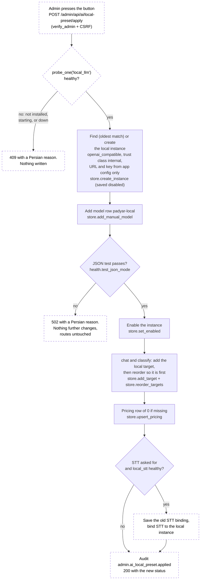

# SPEC: Local inference (the customer's own server answers, the cloud is a fallback)

| Field | Value |
|-------|-------|
| Created | 2026-09-30 |
| Updated | 2026-09-30 |
| Status | Draft |
| Domain | infrastructure |
| Owner | Sina Shamsizadeh (technical owner) |
| Prepared with | AI assistance (Claude Code). Human review of this draft is pending. |
| Sources | `docs/features/local-inference/RESEARCH.md` (spike, status In Review); ADR-022 in `docs/engineering/DECISIONS.md` (Proposed); `docs/features/local-inference/BENCH.md` (pending bench, not written yet) |
| Gate | Owner accepted direction 2026-09-30; spike status is the owner's to set |
| Base commit for every code citation | `3a4a415` |

**How to read the numbers.** No model has been measured on the target host yet.
Where a number depends on the model (context size, slot count, load time,
timeouts), this spec says **pending bench** and names the place in
`BENCH.md` it will come from. Host facts come from the spike's §3.1 box,
measured 2026-09-30.

---

## 1. Purpose

The product must be able to answer visitors with **zero external AI API calls**:
the selection tier, the legacy classifier, the written-answer fallback, and
speech-to-text all served by the customer's own server (2× Tesla P40). The cloud
provider stays available as an optional fallback, not a dependency.

This matters to the customer because the install keeps answering when the
venue's internet does not, and visitor questions stop leaving the building. It
also answers the evaluator's finding "reliance on OpenAI/GapGPT APIs".

The code already has every seam this needs (`openai_compatible` adapter, the
`internal` trust class, ordered failover, an STT binding). What is missing is a
server to point them at, a safe way to point them, and a way to see it working.
This spec defines those four pieces.

### User stories

- **US-001** As the booth operator, I want the chatbot to keep answering when
  the venue's internet is down, so that visitors are not left waiting.
- **US-002** As the admin (not technical), I want to switch the chatbot to this
  server's own model with one button, and back with one button, without learning
  what a provider, route or priority is.
- **US-003** As the admin, I want the panel to tell me plainly whether the local
  model is ready, starting, broken or not installed, and where answers come from
  right now.
- **US-004** As the server operator, I want one re-runnable script per service
  that installs it without internet access to NVIDIA and without touching TTS or
  the running apps.
- **US-005** As the person on call, I want a metric that turns bad when the local
  model stops serving, so the silent return to the cloud is not silent.

## 2. Scope

### In scope

1. **LLM serving** (§5.A): `deploy/27-install-llm.sh` and
   `deploy/systemd/padyar-llm.service`, running llama.cpp `llama-server` on
   loopback.
2. **STT serving and the app's STT seam** (§5.B, §5.C):
   `deploy/26-install-stt.sh`, `deploy/systemd/padyar-stt.service` (faster-whisper
   int8 behind a pinned OpenAI-compatible server), and three fixes on the app's
   transcription path: it must go through `endpoint_policy`, send a language
   hint, and stop requiring a cloud key.
3. **Health and metrics** (§5.D): the two local services appear in the ops
   health checks and in `/metrics`; the AI health check stops reporting
   "disabled" on an install that has no cloud key.
4. **Admin preset** (§5.E): one screen action, "use this server's own model",
   with a clear way back to the cloud.
5. **Tests** the implementation must ship (§12, Tests).
6. **Work units**: the PR-sized split with dependency order (after §13).

### Out of scope

- This spec does not pick the model. The bench does (`BENCH.md`, pending). The
  installer takes the model file and its sha256 as inputs.
- This phase does not fine-tune or train any model.
- This phase does not remove the cloud path. A customer who wants "no cloud at
  all" simply does not configure a cloud provider; nothing here deletes one.
- This phase does not write alert rules. §5.D names the metric and condition
  the monitoring track should alert on.
- This phase does not run the Persian prose rating (spike §9.2 Step 5b). That is
  part of the bench, done by a person.
- This phase does not split admin features onto a different model (needs a new
  task name, spike §4.7.6, ADR-018).
- This phase does not change TTS, its unit, or its GPU placement.
- This phase does not split one model across both cards
  (`--split-mode layer` stays capacity-only, spike §4.5.4).
- This phase does not add a new optional module (reason in §11).

## 3. Actors / Permissions

| Actor | Door | What they can do here |
|---|---|---|
| Server operator (shell, root) | `sudo bash deploy/2x-install-*.sh` | Install, re-run, or stop the local services. No web door. |
| Admin operator (browser) | `verify_admin`, applied to the whole AI router at `app/routers/admin_ai.py:21` (`router = APIRouter(dependencies=[Depends(verify_admin)])`) | See the local-model card, apply the preset, go back to the cloud |
| Booth visitor | the chat trio on `/chat` and `/api/transcribe` (origin, HMAC chat token, two-tier rate limit; `app/routers/voice.py:30`, guards per its docstring at `:31-43`) | Nothing new. They get answers and transcripts from wherever the routes point |
| App process (`padyar-<slug>`) | loopback HTTP with a bearer key | Calls `127.0.0.1:8004` (LLM) and `127.0.0.1:8005` (STT) |

Every preset endpoint authorizes on its own through the router-level
`verify_admin` dependency. None of them takes a provider id, URL or key from the
request, so there is no resource id to infer authorization from (SEC-004).

## 4. User / System Flow

### 4.1 Setup, end to end

1. The server operator runs `deploy/27-install-llm.sh <slug>...` with the model
   file inputs from `BENCH.md`. It builds or fetches `llama-server`, verifies the
   model, starts `padyar-llm`, waits until it is ready, and writes the loopback
   URL and key into each named install's `.env`.
2. Optionally, the operator runs `deploy/26-install-stt.sh <slug>...` the same
   way for speech-to-text.
3. The next restart of each app (a deploy, or the ops restart action) picks the
   new `.env` values up. Until then the admin card says the app does not see the
   server yet.
4. The admin opens AI → Providers. A card at the top says whether this server's
   own model is ready.
5. The admin presses «استفاده از مدل همین سرور». The server sets everything up
   in one request and the card turns to "active".
6. To go back, the admin presses «بازگشت به سرویس ابری» and confirms.

### 4.2 The apply request

The diagram shows the apply request from `POST /admin/api/ai/local-preset/apply`
to the final state. Dashed boxes are new code; solid boxes already exist.
Every failure lands on "no traffic change".



The dashed nodes are the new service and endpoint. The solid nodes are store and
health functions that exist at `3a4a415` (cited in §5.E).

## 5. Behavior

Requirements are grouped by work unit (after §13), so each group can merge on
its own.

### 5.A LLM serving (work unit U1)

#### Inputs

- Positional arguments: zero or more install slugs. For each slug the installer
  writes the connection values into `/opt/padyar-<slug>/.env`.
- Required environment: `LLM_MODEL_SHA256` and exactly one of `LLM_MODEL_SRC`
  (a local file path, the offline route) or `LLM_MODEL_URL` (an HTTPS download,
  for example from huggingface.co). Values come from `BENCH.md` (pending bench).
- Optional environment: `LLM_BUILD_ROUTE` (`pypi` or `docker`, default decided
  by the bench), `LLM_GPU` (default `1`), `HF_TOKEN` (only if the model repo is
  gated).

#### Outputs

- `/opt/padyar-llm/bin/llama-server` built for `sm_61`, plus
  `/opt/padyar-llm/BUILD_INFO` (tag, commit sha, CUDA version, build route).
- `/var/lib/padyar/llm/models/<file>.gguf`, verified.
- `/var/lib/padyar/llm/api-key`, mode 0600, owner `padyar-llm`.
- `/etc/systemd/system/padyar-llm.service`, enabled and running.
- `/etc/default/padyar-llm` holding the operator's choices (GPU, model path).
- In each named install's `.env`: `LOCAL_LLM_URL=http://127.0.0.1:8004/v1` and
  `LOCAL_LLM_API_KEY=<the key>`.

#### Requirements

- **REQ-001** The installer must never contact `developer.download.nvidia.com`.
  The host gets HTTP 403 from it (spike §3.1). The CUDA 12.9 toolchain must come
  from one of two routes, chosen by `LLM_BUILD_ROUTE`: PyPI wheels
  (`nvidia-cuda-nvcc-cu12==12.9.86` and the matching runtime and cuBLAS wheels),
  or a build inside a container image from Docker Hub. The route is pinned: PyPI
  wheels by exact version, a container image by digest (`image@sha256:...`).
  Which route works on this host is spike U19, settled by the bench.
- **REQ-002** llama.cpp is fetched from github.com at a pinned tag, and the
  installer refuses to build unless `git rev-parse HEAD` equals the pinned commit
  sha written in the script. Build flags: `-DGGML_CUDA=ON
  -DCMAKE_CUDA_ARCHITECTURES=61`. It must not set `GGML_CUDA_FORCE_CUBLAS` or
  `GGML_CUDA_FORCE_DMMV` (spike §6.1).
- **REQ-003** The model file is copied from `LLM_MODEL_SRC` or downloaded from
  `LLM_MODEL_URL` into `/var/lib/padyar/llm/models/`, and the installer computes
  its sha256. On a mismatch with `LLM_MODEL_SHA256` it deletes the file and exits
  non-zero before touching the unit. `deploy/25-install-tts.sh` has no such
  check (its model check is only "file is non-empty", `:126-136`); this one must.
- **REQ-004** The installer creates the `padyar-llm` system user if missing, with
  the same `useradd --system --create-home --home-dir /opt/padyar-llm --shell
  /usr/sbin/nologin` form `deploy/00-bootstrap-server.sh:57-58` uses, guarded by
  `id -u` the same way.
- **REQ-005** The API key is 32 random bytes from the OS (hex or base64), written
  to `/var/lib/padyar/llm/api-key` with `install -m 0600 -o padyar-llm`. An
  existing key file is kept on re-run, so installs that already hold it keep
  working. The key is never printed.
- **REQ-006** For each slug argument, the installer sets `LOCAL_LLM_URL` and
  `LOCAL_LLM_API_KEY` in `/opt/padyar-<slug>/.env`: replace the line if present,
  append if not, keep mode 0600 and the owner the file already has (the pattern
  of `deploy/10-install-app.sh:74,80`). It must **not** restart
  `padyar-<slug>`. It prints one line telling the operator the app picks the
  value up on its next restart.
- **REQ-007** `padyar-llm.service` mirrors `deploy/systemd/padyar-tts.service`:
  `Type=exec`, `User=`/`Group=padyar-llm`, `EnvironmentFile=-/etc/default/padyar-llm`,
  `Restart=always`, `RestartSec=5`, `NoNewPrivileges=true`, `PrivateTmp=true`,
  `ProtectSystem=full`, `ProtectHome=true`, `ReadWritePaths=/var/lib/padyar/llm`,
  journal logging with `SyslogIdentifier=padyar-llm` (TTS unit `:7-10`,
  `:39`, `:57-58`, `:62-70`).
- **REQ-008** `ExecStart` runs `llama-server` with `--host 127.0.0.1 --port 8004
  --api-key-file /var/lib/padyar/llm/api-key --alias padyar-local -m <model>
  -ngl 999 -fa on -ctk q8_0 -ctv q8_0 -c <ctx> -np <slots>`. `--alias` makes the
  model id `padyar-local` whatever file is loaded (llama.cpp
  `tools/server/README.md` line 189 and 1251, commit `680a036285`). `-c` and `-np`
  are **pending bench**, starting point `-c 16384 -np 4` (spike §4.7.3).
- **REQ-009** `CUDA_VISIBLE_DEVICES` defaults to `1` (spike §4.5.3b: card 1 is
  less likely to peak together with TTS). The operator can change it in
  `/etc/default/padyar-llm` (`LLM_GPU`). The unit never lists both cards.
- **REQ-010** `TimeoutStartSec` is long enough for a cold start. The value is
  **pending bench** (load time is spike §9.1's unmeasured cost); until measured
  it is 900, above the TTS unit's 600 (`:60`) because the model is about eight
  times larger.
- **REQ-011** After starting the unit the installer waits for readiness: poll
  `http://127.0.0.1:8004/health` every 5 s until it returns 200 (it returns 503
  "Loading model" while loading, README lines 470-477), for up to
  `TimeoutStartSec`. Then it sends one warm-up completion with the key. It prints
  the load time in seconds. On timeout it prints `journalctl -u padyar-llm -n 40`
  and exits 1, the way `deploy/25-install-tts.sh:144-159` does.
- **REQ-012** Re-running the installer is safe and cheap. It skips the build when
  `BUILD_INFO` already matches the pinned tag, sha and route; skips the model
  copy when the file's sha256 already matches; and restarts the unit **only**
  when the binary, the model, the unit file or `/etc/default/padyar-llm`
  changed. (The TTS installer always restarts, `:142`; a restart here costs a
  cold start, REQ-010.)
- **REQ-013** The installer refuses to start when port 8004 is already bound by
  another process, with a one-line message naming the port.
- **REQ-014** The installer changes nothing that belongs to TTS or to an app
  except the two `.env` lines of REQ-006: it does not touch
  `/opt/padyar-tts`, `/var/lib/padyar/tts`, `padyar-tts.service`,
  `/etc/default/padyar-tts`, or any `padyar-<slug>.service`.
  `deploy/padyar-deploy.sh` restarts only the app service (`:164`, `:191`), so the
  app deploy path never touches `padyar-llm` either.
- **REQ-015** `deploy/README.md` gets a "Local LLM" section next to `### TTS`
  (`:230`), a row in the port table (`:14`, loopback 8004, user `padyar-llm`),
  and the install line in the order of operations after `25-install-tts.sh`
  (`:47`). `deploy/30-verify.sh` checks `padyar-llm` is active **only when** its
  unit file exists (today it checks a fixed list, `:24`).

#### State / Transitions

`padyar-llm` is: not installed → starting (health 503) → ready (health 200) →
down (connection refused or timeout). `Restart=always` returns a crashed process
to "starting".

### 5.B STT serving (work unit U3)

- **REQ-020** `deploy/26-install-stt.sh` installs faster-whisper at
  `compute_type` `int8` behind **one pinned** OpenAI-compatible server
  (`speaches` pinned to a commit sha, spike §6.3). It serves
  `POST /v1/audio/transcriptions` on `127.0.0.1:8005`. Python wheels are pinned
  by version in a requirements file, like `deploy/tts/requirements.txt`.
- **REQ-021** The device is a setting, `STT_DEVICE` (`cpu` or `cuda`), in
  `/etc/default/padyar-stt`. With `cuda`, `STT_GPU` picks the card (default `1`).
  With `cpu`, the unit sets no `CUDA_VISIBLE_DEVICES` and the thread count comes
  from `STT_CPU_THREADS` (default: `nproc` minus 4, so 32 on this host, spike
  §3.1). The bench decides the default device (pending bench).
- **REQ-022** The model is a local directory or a download, verified by sha256
  the same way as REQ-003 (`STT_MODEL_SRC` / `STT_MODEL_URL`,
  `STT_MODEL_SHA256`). The installer writes the model id the server expects into
  each named install's `.env` as `LOCAL_STT_MODEL`, with `LOCAL_STT_URL` and
  `LOCAL_STT_API_KEY`, under the same rules as REQ-006.
- **REQ-023** The key follows REQ-005 (`/var/lib/padyar/stt/api-key`, 0600,
  owner `padyar-stt`). If the pinned server version cannot check a bearer key,
  the unit still binds loopback only, the key is still generated and written to
  `.env`, and `deploy/README.md` says plainly that loopback binding is the only
  control. The key must stay non-empty either way, because
  `app/services/ai/stt.py:128` falls back to the cloud when the key is empty.
- **REQ-024** The unit, readiness wait, idempotent re-run, port check and "touch
  nothing else" rules of REQ-004, REQ-007, REQ-011 to REQ-015 apply to
  `padyar-stt` with its own names and port 8005.

### 5.C The app's STT seam (work unit U2)

Today `_transcribe_sync` resolves the endpoint from the control plane
(`app/services/openai.py:370`) but builds its own `OpenAI` client
(`:376-381`), never calls `endpoint_policy`, and sends only `model` and `file`
(`:389-392`). `/api/transcribe` also refuses with a 500 when the **legacy** cloud
key is empty (`app/routers/voice.py:62`), before the control plane is asked.

- **REQ-030** `/api/transcribe` must decide "is STT configured" with
  `stt.resolve()`, not with `provider_config()[1]`. An install whose only STT is a
  bound local instance must transcribe. The status code and body for "not
  configured" stay what they are today (500, same detail), so the chat client
  (`static/chat/core.js:1196-1206`) sees no change.
- **REQ-031** `stt.resolve()` must also return the trust class of the instance it
  resolved (`internal` or `public`); the legacy path returns `public`.
- **REQ-032** The transcription request must connect through
  `endpoint_policy.pin(url, trust_class)` (`app/services/ai/endpoint_policy.py:289`)
  and send to the pinned address with the original `Host` and SNI, exactly as the
  chat path does (`app/services/ai/adapters/base.py:326-365`). There must be
  **one** implementation of "pin, then connect": the pinning loop moves into a
  helper in `adapters/base.py` that both `BaseAdapter.http()` (JSON,
  `base.py:301`) and the transcription call (multipart) use. The OpenAI SDK
  client is no longer used on this path.
- **REQ-033** The request sends `language`. `static/chat/core.js` adds a `lang`
  form field with the current UI language. The server accepts only `fa` or `en`;
  anything else, or no field, becomes `fa`. This closes the auto-detection risk
  in spike §4.9.4.
- **REQ-034** A new counter `stt_requests_total{source, outcome}` counts every
  transcription attempt. `source` is the closed set `explicit`, `implicit`,
  `legacy` (the values `stt.resolve()` already returns, `stt.py:113`); `outcome`
  is `ok` or `failed`. It is defined in `app/services/metrics.py`, incremented in
  the transcription path, and added to `docs/engineering/MONITORING.md`'s metric
  table (which says "All eight are defined", `:52`) in the same change.
- **REQ-035** Nothing else about `/api/transcribe` changes: the guard trio, the
  voice module 404, the `voice_enabled` 403, the 25 MB cap (`voice.py:21`).

### 5.D Health and metrics (work unit U4)

- **REQ-040** `app/config.py` reads `LOCAL_LLM_URL`, `LOCAL_LLM_API_KEY`,
  `LOCAL_STT_URL`, `LOCAL_STT_API_KEY`, `LOCAL_STT_MODEL` next to `TTS_URL`
  (`app/config.py:289`), each defaulting to empty. `.env.example` lists them.
- **REQ-041** Two rows are added to `REGISTRY` in `app/services/health.py`
  (`:265-276`): `local_llm` («مدل هوش مصنوعی همین سرور») and `local_stt`
  («گفتار به متن همین سرور»), both non-critical, no dependencies, default 15 s
  cache (they are loopback, `:48`).
- **REQ-042** Each probe calls `GET <base>/health` (base without `/v1`) with a
  2 s timeout through `endpoint_policy.pin(url, "internal")`, and maps the result:
  key or URL unset → `disabled` («روی این سرور نصب نشده است.»); 200 → `healthy`;
  503 → `degraded` («در حال آماده شدن است.»); refused, timeout or any other
  status → `down` («جواب نمی‌دهد.»). A probe never raises (the contract at
  `health.py:60-78`).
- **REQ-043** `_probe_ai_provider` must stop returning `disabled` just because the
  legacy key is empty (`app/services/health.py:189-191`). New rule: kill switch
  off → `disabled` (unchanged, `:187-188`); otherwise, if `eligible_target_counts()`
  finds routable chat and classify targets, continue to the existing checks, even
  with no legacy key. Only "no legacy key **and** no routable targets" is
  `disabled`. A zero-cloud install served by the local instance must read
  `healthy`.
- **REQ-044** No per-check health gauge is added. Health gauges only update when
  a page asks (`health_score` is set in `health_score()`, `health.py:339`), so
  they are a poor alert source. Alerts use event-driven metrics instead:

| Alert-worthy state | Metric and condition for the monitoring track |
|---|---|
| Local LLM down, traffic silently on the cloud (or AI off if there is no cloud) | `ai_circuit_state{instance="<local instance id>"} == 2` for more than 5 minutes. The gauge is per instance (`app/services/metrics.py`, set at `app/services/ai/circuit.py:92`). The id is shown on the admin card (REQ-058) |
| Local STT failing | `increase(stt_requests_total{outcome="failed"}[10m]) > 0` |
| STT quietly back on the cloud after the preset | `increase(stt_requests_total{source="legacy"}[1h]) > 0` while the preset is active |

`ai_calls_total{provider,outcome}` is **not** a usable signal for "local
failing": its `provider` label is the provider **type** (`engine.py:364-366`),
and the local instance and a cloud gateway can both be `openai_compatible`.

### 5.E Admin preset (work unit U5)

The preset lives in a new service module, `app/services/ai/local_preset.py`,
with three functions: `status()`, `apply(actor, want_stt)`, `revert(actor)`. The
router stays thin. The service calls only existing store and health functions;
it has no SQL of its own.

#### Inputs

- From the request: only `want_stt` (a boolean) on apply. Nothing else.
- From server config (REQ-040): URLs, keys, STT model id.

#### Outputs

A status object (§6) and, on apply or revert, the new state in the database plus
one audit row.

#### Requirements

- **REQ-050** `status()` returns, without writing anything: the `local_llm` and
  `local_stt` probe results (via `health.probe_one`, `health.py:296`, so there is
  one implementation of "is it up"); whether the preset is active; whether a
  cloud fallback exists; the local instance id if one exists.
  - "Preset active" means: an enabled local instance exists, and the first
    target of both `chat` and `classify` in `store.ordered_targets` is that
    instance with model `padyar-local`.
  - "Cloud fallback exists" means: `chat` has at least one enabled target on an
    enabled instance other than the local one.
- **REQ-051** The local instance is found by matching, not by a stored id: an
  instance of type `openai_compatible` whose `config.base_url` equals
  `LOCAL_LLM_URL`. If several match, the oldest (`created_at`) is the local
  instance; `apply` removes the route targets of the others and disables them.
  This is how a duplicate from two simultaneous presses converges (§8).
- **REQ-052** `apply` runs these steps in order and stops at the first failure.
  Every step is idempotent, so pressing twice gives the same state:
  1. `local_llm` must be `healthy`, else 409 with the probe's Persian text.
  2. Find the local instance (REQ-051). If none: `store.create_instance(
     "openai_compatible", "مدل همین سرور", {"base_url": LOCAL_LLM_URL},
     LOCAL_LLM_API_KEY, enabled=False, trust_class="internal", actor=actor)`
     (`store.py:285`; it validates the URL through `endpoint_policy`,
     `base.py:240`). If found: `store.update_instance` only for fields that
     differ (key, trust class).
  3. `store.add_manual_model(instance, "padyar-local")` (`store.py:546`,
     `INSERT OR IGNORE`).
  4. `health.test_json_mode(instance, actor)` (`app/services/ai/health.py:138`).
     If it fails: 502 with a Persian reason and nothing further changes. A new
     instance stays disabled; an existing one keeps its current state; no route
     changes. This is the "test" of the repo's order rule
     (`store.py:289-291`: save → test → enable → route).
  5. `store.set_enabled(instance, True, actor)` (`store.py:374`).
  6. For `chat` and `classify`: if the task has no target for
     (instance, `padyar-local`), `store.add_target` (it appends at the end,
     `store.py:755-759`). Then `store.reorder_targets` (`store.py:810`, atomic)
     with the local target first and every other target in its current relative
     order. Existing cloud targets are kept, now at priority 2 and later. No
     per-target timeout is set; the engine default applies
     (`engine.py:157-159`).
  7. If `store.lookup_pricing("openai_compatible", "padyar-local")`
     (`store.py:852`) is missing or not all zero,
     `store.upsert_pricing("openai_compatible", "padyar-local", "USD", 0, 0, 0,
     source="local-preset")` (`store.py:875`). A zero row is written once, so a
     second press adds no row (the function always inserts).
  8. If `want_stt` and `local_stt` is `healthy`: find or create a second
     `openai_compatible` instance for `LOCAL_STT_URL` the same way (steps 2, 5;
     no JSON test, no routes). Before the first binding, save the current
     `ai_stt_provider_instance_id` and `ai_model_stt` into
     `ai_local_preset_prev_stt_instance_id` and `ai_local_preset_prev_stt_model`.
     Then set `ai_stt_provider_instance_id` to the local STT instance and
     `ai_model_stt` to `LOCAL_STT_MODEL`. If `want_stt` and `local_stt` is not
     healthy, the LLM part still applies and the response says STT was skipped
     and why.
  9. Audit `admin.ai_local_preset.applied` through `applog.audit`
     (`app/services/applog.py:524`) with the instance ids and which steps
     changed something.
- **REQ-053** `revert` ("back to cloud"):
  1. Remove the local instance's route targets from `chat` and `classify`
     (`store.remove_target`, `store.py:774`, which closes the gap, so the old
     cloud target becomes first again).
  2. Disable the local instance (`store.set_enabled(..., False)`). Keep the row,
     so applying again is quick and its usage history stays.
  3. If the saved STT values exist, restore `ai_stt_provider_instance_id` and
     `ai_model_stt` from them (an empty saved value restores empty), then delete
     the two saved keys. Disable the local STT instance.
  4. Audit `admin.ai_local_preset.reverted`.
  5. Revert is idempotent: pressing it when the preset is not active returns 200
     with the unchanged status and writes an audit row with outcome `noop`.
- **REQ-054** The preset never deletes an instance, a model, a price row, or a
  cloud route target.
- **REQ-055** The preset does not touch the kill switch. `openai_enabled` still
  turns off **all** AI, local included (`engine.py:60-65`). The card says so when
  the switch is off (§10, Disabled).
- **REQ-056** A new page is not added. The card goes at the top of the existing
  AI providers page (`templates/admin/ai_providers.html`, page route in
  `app/routers/public.py:456`), with its logic in `static/admin/js/ai_providers.js`
  using `fetchAuth()` (CSRF header, `static/admin/js/utils.js`).
- **REQ-057** Copy on the card uses no technical words: no "instance", "route",
  "priority", "endpoint", "trust class". The exact Persian text is in §10.
- **REQ-058** When the preset is active, a "details" toggle (closed by default)
  shows the local instance id and the loopback URL, for the monitoring track and
  for support. This is the only place those appear.

## 6. API / Contract

All three endpoints are on `app/routers/admin_ai.py`, so `verify_admin` applies
(`:21`) and CSRF applies by prefix (`app/auth/csrf.py:55`,
`("/admin/", ...)`). None returns a collection, so none needs paging.

### `GET /admin/api/ai/local-preset`

200:

```json
{
  "llm": {"state": "ready|starting|down|not_installed", "message_fa": "..."},
  "stt": {"state": "ready|starting|down|not_installed", "message_fa": "..."},
  "active": true,
  "stt_active": false,
  "cloud_fallback": true,
  "kill_switch_off": false,
  "details": {"instance_id": "...", "url": "http://127.0.0.1:8004/v1"}
}
```

`state` maps from the probe: `healthy` → `ready`, `degraded` → `starting`,
`down` → `down`, `disabled` → `not_installed`. `details` is `null` when there is
no local instance. The response never contains a key.

### `POST /admin/api/ai/local-preset/apply`

Body `{"stt": true|false}` (missing = `false`; any other type = 400).

| Status | When | Body |
|---|---|---|
| 200 | applied, or already applied | the status object above, plus `"stt_skipped_fa": "..."` when STT was asked for but not ready |
| 400 | body is not JSON or `stt` is not a boolean | `{"detail": "..."}` |
| 401 | no admin session | from `verify_admin` |
| 403 | missing or wrong CSRF token | from the middleware |
| 409 | `local_llm` not `healthy` | `{"detail": "<Persian reason>"}` |
| 502 | JSON test failed | `{"detail": "<Persian reason>"}` |

### `POST /admin/api/ai/local-preset/revert`

No body. 200 with the status object (also when nothing was active). 401 and 403
as above.

## 7. Data Model / Persistence

**No schema change.** No migration and no `init_db()` edit. Everything is
written through existing tables and functions:

| Write | Where | Reader |
|---|---|---|
| provider instance, model row, route targets, pricing row | `ai_provider_instances`, `ai_provider_models`, `ai_route_targets`, `ai_model_pricing` (`store.py:34-126`) | the engine (`ordered_targets`), the admin AI pages, `status()` |
| `ai_stt_provider_instance_id`, `ai_model_stt` | `settings` | `app/services/ai/stt.py:71`, `:110` |
| `ai_local_preset_prev_stt_instance_id`, `ai_local_preset_prev_stt_model` (new keys) | `settings` | `revert()` only; deleted after use |
| audit rows | `applog.audit` | the logs module |

Files outside the database: `.env` lines (REQ-006, REQ-022), read once at app
start by `app/config.py` (REQ-040).

Rollback of the feature: `revert`, then optionally `systemctl disable --now
padyar-llm padyar-stt`. There is nothing to migrate back.

## 8. Error / Edge Cases

| Case | Behavior | Operator sees (Persian) |
|---|---|---|
| Service not installed (key unset in `.env`) | card state `not_installed`; apply → 409 | «مدل روی این سرور نصب نشده است. برای نصب با پشتیبانی فنی تماس بگیرید.» |
| Installed, but this app has not restarted since | same as not installed (config is read at start) | same text, plus «اگر تازه نصب شده، برنامه را یک بار دوباره راه‌اندازی کنید.» |
| Model still loading (health 503) | state `starting`; apply → 409 | «مدل در حال آماده شدن است. چند دقیقه صبر کنید و دوباره امتحان کنید.» |
| Service down after apply | the engine fails over to the cloud target (priority 2) or, with none, AI answers stop and the chat falls back to local tiers (`app/routers/chat.py:1265-1273`) | with cloud: «مدل این سرور جواب نمی‌دهد. تا درست شود، پاسخ‌ها از سرویس ابری می‌آیند.» Without: «مدل این سرور جواب نمی‌دهد. تا درست شود، ربات فقط از دانسته‌های خودش جواب می‌دهد.» |
| JSON test fails on apply | 502; instance disabled; routes untouched | «مدل این سرور به آزمون پاسخ درست جواب نداد. هیچ چیزی تغییر نکرد.» |
| Apply pressed twice in a row | second press finds everything in place; 200; no new rows (REQ-052 steps 2, 3, 6, 7) | same success text |
| Two admins press at the same moment | each run is idempotent; `UNIQUE (task, provider_instance_id, model_id)` (`store.py:95`) stops duplicate targets; a duplicate instance is possible and is cleaned up by the next apply (REQ-051) | success text |
| Revert with no cloud target | proceeds after the confirm; AI tier off until a cloud provider is added | confirm text in §10 |
| Revert when not active | 200, no change, audit `noop` | «الان هم پاسخ‌ها از سرویس ابری می‌آیند.» |
| Kill switch off | apply still allowed (it only changes routes); the card warns | «هوش مصنوعی در تنظیمات خاموش است. تا روشن نشود، هیچ مدلی استفاده نمی‌شود.» |
| STT asked for, not ready | LLM part applies; STT skipped | «گفتار به متن روی این سرور آماده نیست؛ فعلاً همان سرویس قبلی می‌ماند.» |
| Installer: model sha mismatch | exits 1 before the unit is touched | shell message |
| Installer: port 8004 busy | exits 1 | shell message |
| Installer: readiness timeout | exits 1 with the last 40 journal lines | shell message |

The visitor never sees any of these. The visitor-facing behaviour when the local
model is slow or down is the existing failover and local fallback; this spec
adds no visitor text.

## 9. Security / Privacy

- **SEC-001** Both services bind `127.0.0.1` only. No nginx location proxies to
  them, the same rule the TTS unit states (`padyar-tts.service:47-48`). The
  installer refuses a non-loopback host value.
- **SEC-002** Each service requires a bearer key (REQ-005, REQ-023). The key file
  is 0600, owner the service user. The app's copy lives only in the install's
  0600 `.env`. The key is never printed by an installer, never logged by the app,
  never returned by any endpoint. In the database it is stored the way every
  provider key is, `enc:` Fernet via `secure_store.protect` (`store.py:306`,
  `app/services/secure_store.py:82`).
- **SEC-003** The preset endpoints are admin-only (`verify_admin`, router level)
  and CSRF-protected by prefix. Tests cover 401 without a session and 403 without
  the CSRF header, for all three endpoints.
- **SEC-004** The preset takes no URL, key, instance id or model id from the
  request. They come from server config only. So the preset cannot be used to
  point the app at an arbitrary address (no SSRF through it), and there is no id
  whose possession could imply permission.
- **SEC-005** The local instance uses trust class `internal`, the only class that
  allows loopback and plain http (`endpoint_policy.py:147-153`, `:249`, `:266`).
  Cloud metadata addresses stay blocked in both classes (`:141-173`).
- **SEC-006** The transcription path gets the same DNS pin as the chat path
  (REQ-032). This closes the gap the spike found (spike §8.2, S1).
- **SEC-007** Every apply and revert writes an audit row with the admin's name
  (`_actor`, `admin_ai.py:429`). The existing store functions add their own rows
  (`admin.ai_provider.created`, `.enabled`, `admin.ai_route.updated`, ...).
- **SEC-008** Supply chain: the installers fetch only from PyPI, Docker Hub,
  github.com and the model URL, each pinned (version, digest, commit sha,
  sha256). A mismatch stops the install.
- **SEC-009** The visitor `lang` field (REQ-033) is a closed set; any other
  value becomes `fa`. It is never logged back or echoed.
- **Privacy.** With the preset active and the local server up, visitor text and
  audio do not leave the host. When the local server is down and a cloud
  fallback exists, they go to the cloud as they do today. The admin card says
  which is happening (§10).
- **Kiosk.** Nothing here stores per-visitor state. The only new visitor input is
  `lang`, read per request and not kept. The next person at the booth browser
  inherits nothing new.

## 10. UX States

Admin surface only: one card at the top of AI → Providers. Visitors see no UI
change. Copy is Persian, RTL, no technical words (REQ-057).

- **Default** (ready, not active): title «مدل هوش مصنوعی همین سرور». Line: «مدل
  روی همین سرور آماده است. با یک کلیک، پاسخ‌ها از همین‌جا می‌آیند.» Primary
  button «استفاده از مدل همین سرور». If STT is ready, a checkbox (checked by
  default) «گفتار به متن هم روی همین سرور باشد». One click to apply.
- **Loading:** while the status loads, the card shows a spinner and «در حال
  بررسی…». While apply or revert runs, the pressed button is disabled and shows
  a spinner, so a second click is not possible from the same page.
- **Success** (active): green badge «فعال». Line: «پاسخ‌ها از مدل همین سرور
  می‌آیند. اگر این سرور جواب ندهد، سرویس ابری جایگزین می‌شود.» (without a cloud
  fallback: «... اگر این سرور جواب ندهد، ربات فقط از دانسته‌های خودش جواب
  می‌دهد.»). Secondary button «بازگشت به سرویس ابری».
- **Empty** (not installed): grey badge «نصب نشده». Text from §8. Button hidden,
  not just disabled, so nothing looks broken.
- **Error:** the `detail` text from 409 or 502 in a red alert inside the card,
  plus «دوباره امتحان کنید» that re-reads the status.
- **Disabled:** state `starting`: button disabled, text from §8, and the card
  re-reads the status every 15 s until it changes. Kill switch off: a yellow
  warning line (§8) above the button; the button stays usable.
- **Permission denied:** a non-admin never reaches the page (the page route
  redirects to login) and the API answers 401. No special card state.
- **Long content / overflow:** the only variable text is the probe message and
  the error detail, both short and server-written. The details toggle wraps the
  URL and id with `word-break`.
- **Mobile / narrow viewport:** the card is a normal Tabler card, full width on a
  phone; buttons stack vertically below 576 px.
- **Accessibility:** buttons are real `<button>` elements with text labels; the
  state badge has `aria-live="polite"` so a screen reader hears the change after
  apply; focus stays on the pressed button; the revert confirm is a Bootstrap
  modal that traps focus and closes with Escape.

**Revert confirm (destructive, reversible):** «مطمئنید؟ از این لحظه پاسخ‌ها
دوباره از سرویس ابری می‌آیند.» With no cloud fallback: «هیچ سرویس ابری تنظیم
نشده است. با بازگشت، هوش مصنوعی خاموش می‌ماند تا یک سرویس ابری اضافه کنید.»
Buttons «بله، برگرد» and «انصراف». Two clicks in total. Applying again undoes it.

## 11. Compatibility / Rollout

- **Where it lives.** The admin AI control plane is always loaded as a core admin
  surface (`app/main.py:606-608`), not a registry module. The preset only writes
  rows that control plane already owns, so it is part of it, not a new optional
  module. On an install without the local services, the card says «نصب نشده»
  and nothing else changes. The STT seam fixes live in the optional `voice`
  module's path (`app/modules/registry.py:72-75`); an install without `voice`
  never calls it.
- **Existing installs.** Nothing changes until an operator runs an installer and
  an admin presses the button. Existing routes, the cloud provider, and any STT
  binding stay as they are.
- **Callers checked.**
  - `/api/transcribe` → `_transcribe_sync` is the only transcription caller
    (`voice.py:89`).
  - `BaseAdapter.http()` is the only pinned connect today (`base.py:301`);
    REQ-032 moves its loop into a shared helper, so every adapter is affected
    and the existing adapter tests must still pass.
  - `_probe_ai_provider` is read by the ops pages (`app/routers/ops.py:34`,
    `:138`, `:159`) and by `health_score()`; REQ-043 can only turn a false
    `disabled` into a real state.
  - The chat client sends one new form field; an old cached `core.js` that does
    not send it still works (`lang` defaults to `fa`).
- **One server for both installs.** This host runs two installs and TTS is
  already shared (`deploy/tts/server.py:4`). The VRAM budget cannot hold a second
  model copy (spike §4.5.3b), so **one `padyar-llm` serves every install on the
  host**: the installer takes all slugs and gives them the same key. Blast
  radius, stated: a bulk admin job on one install (all four call sites share
  `task="chat"`, spike §4.7.6) queues visitors of the other behind the same
  slots. The `-np` value (pending bench) bounds it.
- **Order.** U2 (STT seam) can ship first and is useful on its own. U1 and U3
  (installers) can ship in parallel. U4 needs nothing from them in code. U5
  needs U4.
- **Documentation in the same PRs:** `deploy/README.md` (U1, U3), `CLAUDE.md`
  env table and `.env.example` (U4), `docs/engineering/MONITORING.md` (U2),
  `docs/features/INDEX.md` status when each ships.

## 12. Acceptance Criteria

- [ ] **SC-001** With only the local instance routed (no legacy key, no cloud
  target) and `llama-server` answering, a `/chat` query that reaches the
  selection tier is served by the local instance and records an
  `ai_usage_events` row for it. (Integration test with a stub server on
  loopback.)
- [ ] **SC-002** `/api/transcribe` returns text on an install whose only STT is a
  bound local instance and whose legacy key is empty (REQ-030).
- [ ] **SC-003** The transcription request carries `language=fa` when the client
  sends no `lang`, and `language=en` when it sends `en` (REQ-033).
- [ ] **SC-004** The transcription path calls `endpoint_policy.pin`; a test that
  makes `pin` raise gets a failed transcription, not a request to the host
  (REQ-032).
- [ ] **SC-005** `_probe_ai_provider` returns `healthy` for a zero-cloud install
  with healthy local targets, and still `disabled` when the kill switch is off
  (REQ-043).
- [ ] **SC-006** `probe_one("local_llm")` returns `disabled`, `degraded`,
  `healthy`, `down` for: no key, a stub answering 503, a stub answering 200, a
  closed port (REQ-042).
- [ ] **SC-007** After one apply: both `chat` and `classify` have the local
  target at priority 1, the previous first target at priority 2, the instance is
  enabled with trust class `internal`, and one zero pricing row exists.
- [ ] **SC-008** Apply twice: the database state after the second press equals
  the state after the first (same row counts in all four AI tables) (REQ-052).
- [ ] **SC-009** Apply when the probe is `degraded` or `down` returns 409 and
  writes nothing.
- [ ] **SC-010** Apply when `test_json_mode` fails returns 502; the instance
  exists but is disabled; no route target changed.
- [ ] **SC-011** Revert after apply restores the original route order exactly and
  the original STT binding values (including empty); a second revert is a 200
  with audit outcome `noop` (REQ-053).
- [ ] **SC-012** All three preset endpoints return 401 without an admin session
  and 403 without the CSRF header; `tests/test_csrf.py` still passes.
- [ ] **SC-013** No preset response body contains the value of
  `LOCAL_LLM_API_KEY` or `LOCAL_STT_API_KEY`.
- [ ] **SC-014** Two matching local instances before apply → after apply exactly
  one is enabled and routed (REQ-051).
- [ ] **SC-015** `bash -n` passes on `deploy/26-install-stt.sh` and
  `deploy/27-install-llm.sh`, and the static checks in
  `tests/test_deploy_local_services.py` pass (see Tests).
- [ ] **SC-016** `stt_requests_total` appears in `/metrics` output after one
  transcription, with `source` and `outcome` labels from the closed sets.

### Tests the implementation must ship

| Unit | File | Covers |
|---|---|---|
| U1, U3 | `tests/test_deploy_local_services.py` (new) | runs `bash -n` on both installers; reads the scripts and units as text and asserts: `--host 127.0.0.1`, `--api-key-file`, `install -m 0600`, sha256 check present, no `developer.download.nvidia.com`, no `systemctl restart padyar-` for an app, no `padyar-tts` write, `Restart=always`, hardening lines. The repo has no installer dry-run pattern (only `45-prerender.sh --dry-run`, which passes the flag to a Python script) and no test reads a deploy script today, so static checks plus `bash -n` are the floor. |
| U2 | `tests/test_stt_local.py` (new), plus the existing `/api/transcribe` guard tests in `tests/test_security_hardening.py` and the binding tests in `tests/postgres/test_stt_binding.py`, which must still pass | REQ-030 to REQ-035, SC-002 to SC-004, SC-016; the negative path: no instance and no legacy key still gives today's 500 |
| U2 | adapter tests | the shared pin helper; every existing adapter test still passes |
| U4 | `tests/test_health_surface.py` (extend) | SC-005, SC-006, REQ-042 message texts |
| U5 | `tests/test_ai_local_preset.py` (new, TestClient) | SC-007 to SC-014; plus: local service down after apply → `status()` reports `down` and `cloud_fallback` truthfully; STT asked for but not ready → LLM applied, STT skipped |
| U5 | `tests/e2e/test_ai_local_preset_card.py` (new, async Playwright) | the card's default, active and not-installed states and the revert confirm, with the API mocked |

## 13. Related Artifacts

- **PRD:** none.
- **Spike:** `docs/features/local-inference/RESEARCH.md` (status In Review; the
  owner sets it). Runtime and STT choices: §6.1, §6.3. Model gate: §9.2.
- **ADR:** ADR-022 in `docs/engineering/DECISIONS.md` (Proposed). Rests on ADR-007
  (OpenAI-compatible contract), ADR-012 (one TTS instance per card, post-generation
  VRAM), ADR-018 (the model chooses, it does not write).
- **Bench:** `docs/features/local-inference/BENCH.md`, pending. It supplies the
  model file and sha256, the build route, `-c`, `-np`, the start timeout, and the
  STT device.
- **Plan:** none yet. Each work unit below is a PR.
- **Gate evidence:** owner accepted direction 2026-09-30 (runtime llama-server
  through `openai_compatible`, cloud kept as fallback; STT faster-whisper int8
  behind a loopback OpenAI-compatible server; model chosen by the measured
  bench). Spike status is the owner's to set.

---

## Work units

One root cause per PR (the `scoped-pr` rule). The brief expected four units; the
STT part is split in two because it holds two root causes that can be reverted
independently.

| Unit | Root cause | Owns these files | Depends on |
|---|---|---|---|
| **U1** LLM serving deploy | no local LLM server exists on the host | `deploy/27-install-llm.sh`, `deploy/systemd/padyar-llm.service`, `deploy/README.md` (Local LLM section, port row, order line), `deploy/30-verify.sh` (conditional check), `tests/test_deploy_local_services.py` (LLM part) | bench values (the script takes them as inputs, so it can merge before the bench ends) |
| **U2** STT app seam | the transcription path bypasses the endpoint policy, sends no language, and requires a cloud key | `app/services/openai.py`, `app/services/ai/stt.py`, `app/services/ai/adapters/base.py`, `app/routers/voice.py`, `static/chat/core.js`, `app/services/metrics.py`, `docs/engineering/MONITORING.md`, voice and adapter tests | none. Useful on its own: it fixes spike S1 for any STT base URL, cloud included |
| **U3** STT serving deploy | no local STT server exists on the host | `deploy/26-install-stt.sh`, `deploy/systemd/padyar-stt.service`, `deploy/stt/requirements.txt`, `deploy/README.md` (STT section, port row), `deploy/30-verify.sh`, `tests/test_deploy_local_services.py` (STT part) | U2 before it is useful in production (without U2 a keyless-legacy install cannot use it), but it can merge in either order |
| **U4** health and config | health reports "disabled" for a zero-cloud install, and nothing can see the local services | `app/config.py`, `.env.example`, `app/services/health.py`, `CLAUDE.md` (env table), `tests/test_health_surface.py` | none in code |
| **U5** admin preset | pointing the app at the local server takes many expert steps in the right order | `app/services/ai/local_preset.py` (new), `app/routers/admin_ai.py`, `templates/admin/ai_providers.html`, `static/admin/js/ai_providers.js`, `tests/test_ai_local_preset.py`, `tests/e2e/test_ai_local_preset_card.py` | U4 (config values and the two probes) |

Why U1 and U3 are not merged: different services, different users, different
failure modes, and either can be reverted alone. Why U4 is separate from U5: the
health fix (REQ-043) is a real defect on any zero-cloud install, with or without
the preset.

## Open questions

1. **Key handoff to the app.** This spec copies the key into each install's
   `.env` (REQ-006). The alternative is systemd credentials (`LoadCredential=` in
   both units) with one root-owned file, which avoids a second copy but changes
   the app unit template. The `.env` route matches the current secrets pattern;
   the owner may prefer the other.
2. **STT server bearer key.** Whether the pinned `speaches` version checks a key
   is not verified here (REQ-023 covers both answers).
3. **Ports 8004 and 8005** are free in the repository's port table
   (`deploy/README.md:14`) but were not checked on the host. REQ-013 makes the
   installer check.
4. **Every "pending bench" value** (§5.A, §5.B) waits for `BENCH.md`.
