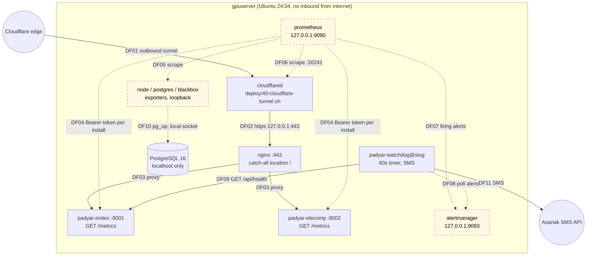
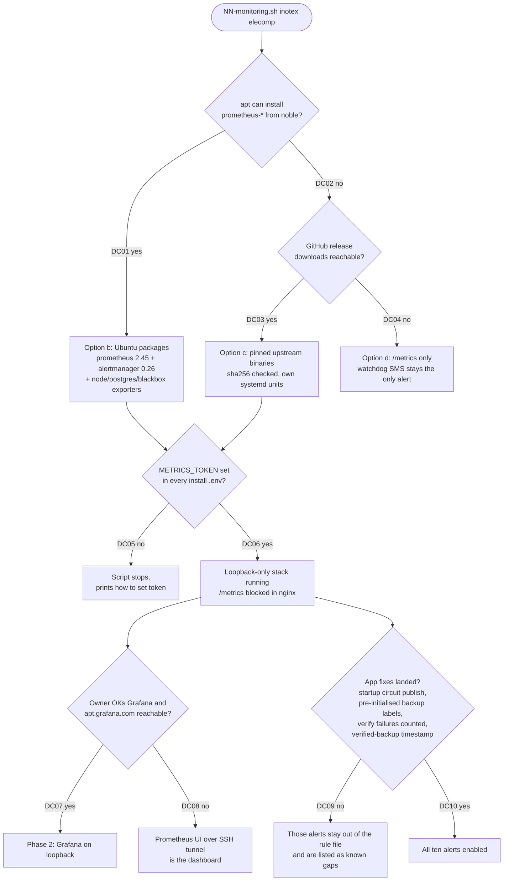

# SPIKE: پشتهٔ پایش و هشدار روی gpuserver چطور ساخته و نصب شود؟

**Status:** Complete (پیشنهاد آماده، تصمیم نهایی با Sina)
**Owner:** Sina Shamsizadeh
**Authoring:** پیش‌نویس با کمک AI (Claude Opus 5.5) نوشته شد. بازبینی انسانی: pending.
**Timebox:** یک نشست کاری (حدود ۳ ساعت)
**Date:** 2026-09-30 (به‌روزرسانی 2026-10-01: تصمیم مالک دربارهٔ کانال هشدار، و اصلاح‌های بازبینی)
**Base:** همهٔ ارجاع‌های `file:line` روی commit `3a4a415` هستند.

## 1. Question

**سؤال اصلی:** پشتهٔ پایش (Prometheus، هشدار، داشبورد) روی میزبان production
(gpuserver، Ubuntu 24.04، داخل ایران، فقط با Cloudflare Tunnel خروجی) با چه
روشی نصب شود، و هر هشدار از کدام metric واقعی بیاید، تا تیم پیاده‌سازی بتواند
config و `deploy/NN-monitoring.sh` را بدون حدس بنویسد؟

زیرسؤال‌ها، به همان شماره‌های قرارداد:

| # | زیرسؤال |
|---|---|
| D1 | روش نصب: Docker Compose، بسته‌های آرشیو Ubuntu، باینری upstream، یا هیچ. و Grafana از کجا بیاید |
| D2 | هر هشدار لازم از کدام metric و کدام منبع می‌آید، و امروز چه چیزی کم است |
| D3 | هشدار چطور به یک آدم برسد |
| D4 | دو نصب روی یک میزبان: توکن هر نصب، مجوز فایل‌ها، آرگومان‌های اسکریپت |
| D5 | هیچ چیز عمومی نشود. اپراتور چطور به داشبورد برسد. بودجهٔ دیسک و RAM |
| D6 | تستی که ثابت کند هر metric در هشدار و پنل واقعاً وجود دارد |
| D7 | شکل SLO: کدام ۲ تا ۴ SLI، و چرا هنوز هیچ اندازهٔ پایه‌ای نداریم |

## 2. Why It Matters

- ارزیاب دانش‌بنیان در دلیل ۴ و ۶ نوشت که بلوغ عملیاتی و پایش کافی نیست.
  امروز فقط یک endpoint `/metrics` داریم و **هیچ چیزی آن را نمی‌خواند**
  (`docs/engineering/MONITORING.md:7-24`).
- یک پیش‌نویس محلی و commit‌نشده با Docker Compose وجود دارد (بیرون از
  repo، پس اینجا لینک ندارد). کل کیت `deploy/` امروز
  bash و apt و systemd است و هیچ جا Docker ندارد. تا روش نصب روشن نشود، تیم
  بعدی نمی‌داند آن پیش‌نویس را ادامه بدهد یا دور بریزد.
- هشداری که به هیچ کس نمی‌رسد، هشدار نیست. هشداری که بعد از هر restart
  دروغ می‌گوید، اپراتور را یاد می‌دهد که هشدارها را نادیده بگیرد.

## 3. Context

### آنچه امروز هست

| جزء | وضعیت | شاهد |
|---|---|---|
| هشت خانوادهٔ metric روی یک registry اختصاصی | هست | `app/services/metrics.py:35-75` |
| `GET /metrics` با Bearer `METRICS_TOKEN` یا نشست ادمین، شکست همیشه 403 | هست | `app/routers/metrics.py:32-53` |
| `METRICS_TOKEN` فقط یک بار موقع import خوانده می‌شود | هست | `app/config.py:422` |
| `METRICS_TOKEN` در قالب env نصب | **نیست** | `deploy/env/instance.env.template` (هیچ خطی با `METRICS`) |
| nginx مسیر `/metrics` را جدا نمی‌کند، پس از اینترنت هم می‌رسد و فقط 403 داخل برنامه جلوی آن است | هست | `deploy/nginx/instance.conf.template:184`، `docs/engineering/MONITORING.md:132-155` |
| ۳ worker uvicorn برای هر نصب | هست | `deploy/env/instance.env.template:35`، `deploy/systemd/padyar-app.service.template:36` |
| watchdog پیامکی: هر ۶۰ ثانیه `/api/health` را روی loopback می‌زند و بعد از ۳ شکست با Asanak پیامک می‌دهد | هست | `deploy/watchdog/watchdog.py:222-253`، `deploy/systemd/padyar-watchdog@.timer` |
| cloudflared از مخزن apt خود Cloudflare نصب می‌شود | هست | `deploy/40-cloudflare-tunnel.sh:35-45` |
| config تونل کلید `metrics:` ندارد | هست | `deploy/40-cloudflare-tunnel.sh:75-97` |
| PostgreSQL فقط روی localhost، `host` با scram | هست | `deploy/00-bootstrap-server.sh:76-84` |
| UFW فقط 22، 80، 443 را باز می‌کند | هست | `deploy/00-bootstrap-server.sh:88-91` |
| Prometheus، Alertmanager، exporter، Grafana | **نیست** | `docs/engineering/MONITORING.md:14-18` |

محدودیت‌هایی که پاسخ باید رعایت کند:

- **سازگاری با کیت:** bash، apt، systemd، idempotent (اجرای دوباره بی‌خطر)،
  هر اسکریپت با `sudo bash deploy/NN-x.sh <args>` (`deploy/README.md:26-46`).
- **شبکه:** میزبان در ایران است. هیچ راه ورودی از اینترنت ندارد، و این اندازه‌گیری
  شده (`deploy/README.md:144-153`). دانلود از منابع آمریکایی ممکن است به‌خاطر
  تحریم بسته باشد.
- **امنیت:** هیچ listener تازه‌ای نباید عمومی شود. توکن‌ها در repo نمی‌روند.
- **میزبان مشترک:** همین VM سرویس TTS را روی ۲ کارت P40 اجرا می‌کند
  (40 vCPU، 27 GB RAM، `deploy/README.md:3`).
- **محصول:** این کار فقط به اپراتور مربوط است. هیچ صفحه‌ای که بازدیدکننده می‌بیند
  عوض نمی‌شود.

### نمای میزبان، با بخش‌های پیشنهادی

خط‌چین یعنی پیشنهادی (امروز وجود ندارد). همهٔ listenerهای تازه روی
`127.0.0.1` هستند.



نکتهٔ این شکل: DF03 نشان می‌دهد nginx امروز `/metrics` را هم به اینترنت
می‌دهد. Prometheus پیشنهادی (DF04) مستقیم به پورت loopback هر نصب وصل
می‌شود و به nginx نیازی ندارد، پس بستن `/metrics` در nginx چیزی را خراب
نمی‌کند. DF08 و DF11 نشان می‌دهند که پیامک هشدار از همان watchdog موجود هر نصب
می‌رود، نه از یک سرویس تازه (D3).

## 4. Investigation

### Evidence

**کد (روی `3a4a415`):**

- محل نوشتن هر metric:
  `app/main.py:560-580` (middleware برای `http_*`)،
  `app/routers/chat.py:164-165` (`chat_tier_served_total` داخل `_log_turn`)،
  `app/services/ai/engine.py:365-366` (`ai_calls_total`)،
  `app/services/ai/circuit.py:84-92` (`ai_circuit_state`، فقط هنگام تغییر حالت)،
  `app/services/pg_backup.py:173-174` و `:202-203` (`backup_outcome_total`)،
  `app/services/health.py:338-339` (`health_score`).
- `health_score()` فقط از مسیرهای ادمین ماژول اختیاری `ops` صدا زده می‌شود:
  `app/routers/ops.py:35`، `:148`، `:218` و `app/services/service_control.py:91`.
- مسیر چت `@router.post("/chat")` است (`app/routers/chat.py:256`)، پس برچسب
  `route` آن `/chat` است (`app/services/metrics.py:97-99`).
- بالاترین bucket محدود histogram تأخیر `10.0` ثانیه است
  (`app/services/metrics.py:46`). nginx تا ۱۲۰ ثانیه برای پاسخ صبر می‌کند
  (`deploy/README.md`، جدول تنظیمات nginx).
- وقتی handler استثنا می‌دهد، middleware فقط شمارندهٔ 500 را زیاد می‌کند و
  تأخیر را ثبت نمی‌کند (`app/main.py:565-572`).
- حالت نگهداری (maintenance) برای بازدیدکننده 503 برمی‌گرداند
  (`app/services/maintenance.py:104-105`)، و این 503 در `http_requests_total`
  شمرده می‌شود.
- زمان‌بند پشتیبان داخل خود برنامه اجرا می‌شود، هر ۶۰ ثانیه بررسی می‌کند
  (`app/services/backup.py:30`)، و پیش‌فرض آن روزی یک بار است
  (`app/services/backup.py:23-24`). یک worker برنده اجرا می‌کند
  (`app/services/backup.py:210-213`).
- پشتیبان پیش از deploy در یک پروسهٔ جدا و کوتاه‌عمر ساخته می‌شود
  (`deploy/padyar-deploy.sh:110-115`). metric آن پروسه هرگز scrape نمی‌شود.
  شکست آن deploy را متوقف می‌کند، پس دیده می‌شود، ولی نه در Prometheus.
- تعداد handlerهای HTTP: ۲۶۶ دکوراتور `@router.get/post/put/delete` در
  `app/routers/` (شمارش با grep). این سقف تعداد مقادیر برچسب `route` است.
- فایل `.env` هر نصب با مالک `padyar-<slug>` و مجوز `0600` ساخته می‌شود
  (`deploy/10-install-app.sh:74`).

**منابع بیرونی (همه در 2026-09-30 خوانده شدند):**

| موضوع | یافته | منبع و تاریخ |
|---|---|---|
| بسته‌های noble | `prometheus` 2.45.3، `prometheus-alertmanager` 0.26.0، `prometheus-node-exporter` 1.7.0، `prometheus-postgres-exporter` 0.15.0، `prometheus-blackbox-exporter` 0.24.0، همه در **universe**، آخرین به‌روزرسانی در noble-updates/security در 2025-07-21 | Launchpad API `getPublishedSources` و `https://packages.ubuntu.com/noble/<pkg>` |
| Grafana در آرشیو Ubuntu | نیست ("No such package") | `https://packages.ubuntu.com/noble/grafana` |
| پشتیبانی امنیتی universe | پشتیبانی رایگان فقط برای main است؛ universe با Ubuntu Pro (ESM) | `https://ubuntu.com/about/release-cycle` (بدون تاریخ) |
| چرخهٔ LTS خود Prometheus | خط 2.45 از 2024-07-31 «End of life» است؛ LTS فعلی 3.13 تا 2027-07-31 | `https://prometheus.io/docs/introduction/release-cycle/` (بدون تاریخ) |
| آخرین نسخه‌های upstream | prometheus v3.15.0 (2026-09-25)، alertmanager v0.34.1 (2026-09-17)، node_exporter v1.12.1 | GitHub releases API |
| شرایط Grafana Labs | بند 21: دانلود یا ارائه به «any country subject to U.S. trade sanctions» ممنوع | `https://grafana.com/legal/terms/` (به‌روزشده 2026-07-10) |
| geofence واقعی Grafana | خطای `ERROR 451: geofence:blocked` از روسیه | `https://community.grafana.com/t/cant-download-grafana-9-0-2-from-russia/68391` (2022-07-07) |
| Grafana از ایران | **تأیید نشد.** هیچ گزارش مستقیمی پیدا نشد | ندارد |
| شرایط Docker | بند 13: کاربر نباید در «Embargoed Country» باشد | `https://www.docker.com/legal/docker-terms-use/` (اجرا از 2026-08-26) |
| Docker از ایران | گزارش‌های کاربر از 403 برای Docker Hub (2015) و `download.docker.com` (2018) از ایران. `hub-feedback/issues/2103` گزارشی از سودان است که پیام بلاک خود Docker را نقل می‌کند؛ آن پیام ایران را صریح نام می‌برد. این منابع 2015 تا 2021 هستند و **اثبات وضع امروز نیستند**؛ شاهد امروز شرایط استفادهٔ فعلی Docker (ردیف بالا) است | `github.com/docker/hub-feedback/issues/369` (2015-09-28)، `github.com/docker/for-linux/issues/363` (2018-07-18)، `github.com/docker/hub-feedback/issues/2103` (2021-05-17) |
| GitHub در ایران | GitHub از OFAC مجوز گرفت و «all services» را برای ایران باز کرد | `https://github.blog/news-insights/policy-news-and-insights/advancing-developer-freedom-github-is-fully-available-in-iran/` (2021-01-05)، `https://docs.github.com/en/site-policy/other-site-policies/github-and-trade-controls` |
| فیلترینگ داخلی روی GitHub | **تأیید نشد** | ندارد |
| metricهای cloudflared | پیش‌فرض `127.0.0.1:<PORT>/metrics` روی اولین پورت آزاد 20241 تا 20245؛ `cloudflared_tunnel_ha_connections` | `https://developers.cloudflare.com/cloudflare-one/networks/connectors/cloudflare-tunnel/monitor-tunnels/metrics/` (2026-04-17)؛ CHANGES.md نسخهٔ 2024.12.1 |
| توکن از فایل | `authorization.credentials_file` در scrape config | `https://prometheus.io/docs/prometheus/latest/configuration/configuration/` |
| خواندن دوبارهٔ فایل توکن | در هر درخواست `os.ReadFile` می‌شود (از کد `prometheus/common` v0.44.0 که 2.45.3 استفاده می‌کند، نه از مستندات) | کد منبع، تگ v0.44.0 |
| گیرنده‌های Alertmanager | `webhook_configs`، `email_configs`، `telegram_configs` (از 0.24.0) در 0.26 هستند | `https://prometheus.io/docs/alerting/latest/configuration/`، CHANGELOG |
| Telegram در ایران | با حکم قضایی 2018-04-30 مسدود شد. وضعیت امروز فقط نیمه‌تأیید | techcrunch.com (2018-04-30)، iranhumanrights.org (2018-04) |
| promtool | در بستهٔ noble هست (`/usr/bin/promtool`)؛ `check config`، `check rules`، `test rules` | `https://packages.ubuntu.com/noble/amd64/prometheus/filelist`، `https://prometheus.io/docs/prometheus/latest/configuration/unit_testing_rules/` |
| اندازهٔ ذخیره | «1-2 bytes per sample»، پیش‌فرض retention 15 روز، `retention.size` پیش‌فرض خاموش | `https://prometheus.io/docs/prometheus/latest/storage/` |
| حداقل Grafana | 512 MB RAM، 1 هستهٔ CPU | `https://grafana.com/docs/grafana/latest/setup-grafana/installation/` |
| حالت multiprocess در client_python | حالت پیش‌فرض gauge، `all`، برای هر پروسه یک سری با برچسب `pid` برمی‌گرداند (زنده یا مرده). حالت‌های دیگر (`liveall` هم برچسب `pid` دارد؛ `max`، `livemax`، `min`، `livemin`، `sum`، `livesum`، `mostrecent`، `livemostrecent`) یک سری برمی‌گردانند. خود کد نمی‌تواند برچسبی به نام `pid` تعریف کند. تغییر multiprocess حالت‌های صریح (`livesum`، `mostrecent`) را به کار می‌برد، ولی قواعد باز هم باید با `max by`/`sum by` جمع کنند تا اگر یک gauge حالت پیش‌فرض گرفت، هشدار نشکند | `https://prometheus.github.io/client_python/multiprocess/` |

نام metricهای exporterها روی **همان نسخهٔ بستهٔ noble** در کد منبع تگ همان نسخه
چک شد: `node_filesystem_avail_bytes` و `node_filesystem_size_bytes` با برچسب‌های
`device`، `mountpoint`، `fstype` (node_exporter v1.7.0،
`collector/filesystem_common.go`)؛ `pg_up` (postgres_exporter v0.15.0)؛
`probe_success`، `probe_ssl_earliest_cert_expiry`، `probe_http_status_code`
(blackbox_exporter v0.24.0)؛ `up` (ساخت خود Prometheus).

### Experiments / Prototypes

یک آزمایش کوچک روی لپ‌تاپ اجرا شد (نه روی سرور). کد دور ریختنی است و در
repo نمی‌ماند:

```bash
.venv/bin/python -c "
from prometheus_client import generate_latest
from app.services.metrics import registry
for l in generate_latest(registry).decode().splitlines():
    if not l.startswith('#'): print(l)"
```

خروجی با `prometheus_client` 0.26.0:

```
http_inflight 0.0
health_score 0.0
```

یعنی یک پروسهٔ تازه فقط این دو سری را دارد. `health_score` از لحظهٔ شروع صفر
است. `ai_circuit_state` و `backup_outcome_total` و `http_requests_total` تا
اولین رویداد **هیچ سری ندارند**.

هیچ اندازه‌گیری روی gpuserver انجام نشد. قرارداد اجازهٔ SSH نمی‌دهد.

### Constraints Discovered

- **counter برچسب‌دار که تازه به دنیا می‌آید، اولین رویدادش گم می‌شود.**
  `increase()` و `rate()` در Prometheus فقط تفاوت بین دو نمونه را می‌بینند.
  اگر سری `backup_outcome_total{result="failed"}` بعد از restart وجود نداشته
  باشد و اولین نمونه‌اش `1` باشد، `increase()` صفر نشان می‌دهد. با پیش‌فرض
  «روزی یک پشتیبان» و deployهای مکرر، اولین شکست بعد از هر restart عملاً
  نامرئی است. راه‌حل در کد برنامه است: مقدار برچسب‌ها موقع import ساخته شوند
  (`backup_outcome_total.labels(result="failed")` و `"success"`)، تا سری از
  صفر شروع شود.
- **حالت circuit فقط هنگام تغییر منتشر می‌شود.** بعد از restart، circuit که در
  جدول `ai_circuit_state` باز مانده، هیچ سری ندارد و هیچ قاعده‌ای روشن
  نمی‌شود (`app/services/ai/circuit.py:84-92`، و آزمایش بالا).
- **`/metrics` امروز per-process است.** با ۳ worker هر scrape یکی از سه پروسه
  را می‌بیند. یک تغییر موازی دارد حالت multiprocess را اضافه می‌کند. این spike
  فرض می‌کند خروجی بعد از آن کار جمع‌شدهٔ همهٔ workerها است. برای gaugeها
  حالت multiprocess مهم است (بخش 5، D2).
- **امنیت:** مرز اعتماد تازه فقط روی loopback است. توکن‌های `METRICS_TOKEN`
  روی دیسک میزبان با مجوز بسته نگه داشته می‌شوند. تنها سطح عمومی موجود،
  `/metrics` از راه nginx، باید بسته شود (بخش 5، D5).

## 5. Findings

### D1. روش نصب

| معیار | (a) Docker Compose | (b) بسته‌های Ubuntu + systemd | (c) باینری upstream + systemd | (d) هیچ |
|---|---|---|---|---|
| منبع دانلود | Docker Hub و `download.docker.com` | آرشیو Ubuntu (یا mirror ایرانی) | `github.com/prometheus/*/releases` | ندارد |
| دسترسی از ایران | گزارش‌های مستند 403 و متن صریح Docker که ایران را بلاک می‌کند | هیچ مانع مستندی. همان مسیر `apt-get` که `00-bootstrap` امروز استفاده می‌کند (`deploy/00-bootstrap-server.sh:32-42`) | از نظر سیاست GitHub مجاز است؛ فیلترینگ داخلی **تأیید نشد** | ندارد |
| سازگاری با کیت `deploy/` | ضعیف. اولین Docker در کل کیت، یک daemon تازه و قوانین شبکهٔ تازه | کامل. همان الگوی apt و systemd و `install -m` | متوسط. unit دستی، کاربر دستی، checksum دستی | کامل |
| نسخه | جدیدترین | Prometheus 2.45.3 (خط LTS تمام‌شده)، Alertmanager 0.26.0 | جدیدترین (مثلاً 3.13 LTS) | ندارد |
| به‌روزرسانی امنیتی | با pull دستی image | `unattended-upgrades` (در کیت نصب است، `deploy/00-bootstrap-server.sh:42`)، ولی universe فقط با Ubuntu Pro تعهد دارد. در عمل سه وصلهٔ امنیتی آمد (2024-07، 2024-11، 2025-07) | کاملاً دستی | ندارد |
| Grafana | image `grafana/grafana` از Docker Hub | در آرشیو نیست. فقط `apt.grafana.com` | `.deb` یا tarball از `dl.grafana.com` | ندارد |
| پاسخ به تیکت | بله، اگر pull کار کند | بله، به‌جز داشبورد Grafana | بله، اگر دانلود کار کند | نه |

**Grafana در هر سه گزینه از Grafana Labs می‌آید** (Docker Hub، `apt.grafana.com`،
`dl.grafana.com`). شرایط استفادهٔ Grafana Labs دانلود به کشورهای تحریمی را
صریحاً ممنوع می‌کند، و یک geofence واقعی برای روسیه ثبت شده. برای ایران گزارش
مستقیم پیدا نشد، پس «بسته است» یک استنتاج است، نه اندازه‌گیری. ولی حتی اگر
دانلود فنی کار کند، شرایط استفاده آن را منع می‌کند، و این سؤالی حقوقی است که
تصمیمش با مالک محصول است، نه با این spike.

**گزینهٔ (a) عملاً کنار می‌رود:** هم منبع image از ایران گزارش 403 دارد، هم
کیت را از «bash + apt + systemd» به «bash + Docker» می‌برد. پیش‌نویس
محلی و commit‌نشده روی همین گزینه ساخته شده.

**گزینهٔ (b) و (c) واقعاً رقیب‌اند.** (b) با کیت یکی است و منبعش در دسترس
است، ولی نسخه‌اش قدیمی است. (c) نسخهٔ جدید می‌دهد ولی نصب، کاربر، unit و
وصلهٔ امنیتی را دستی می‌کند و در دسترس بودن GitHub از داخل ایران تأیید نشده.
برای کاری که ما لازم داریم، نسخهٔ 2.45 همه چیز دارد: `credentials_file`،
`promtool check/test rules`، و Alertmanager 0.26 با API `GET /api/v2/alerts`
(جدول منابع بالا و D3).

### D2. منبع هر هشدار

«موجود» یعنی نام در کد یا در کد منبع exporter روی نسخهٔ noble دیده شد.
«برنامه‌ریزی‌شده» یعنی هنوز وجود ندارد.

| هشدار | عبارت پیشنهادی (شکل، نه متن نهایی) | منبع | وضعیت | کمبود امروز |
|---|---|---|---|---|
| برنامه پایین است | `up{app="padyar"} == 0` برای 2m | خود Prometheus | موجود | اگر توکن غلط باشد هم 403 می‌شود و `up` صفر می‌شود؛ متن هشدار باید این را بگوید. watchdog پیامکی همین حالت را امروز پوشش می‌دهد (`deploy/watchdog/watchdog.py:222-236`) |
| نرخ 5xx | `sum by (install)(rate(http_requests_total{status=~"5..",status!="503"}[5m])) / sum by (install)(rate(http_requests_total[5m])) > 0.05` | `app/services/metrics.py:37-40` | موجود | 503 حالت نگهداری شمرده می‌شود (`app/services/maintenance.py:105`). ولی `status!="503"` یک 503 واقعی را هم پنهان می‌کند: `/api/ready` وقتی مدل محلی بالا نیاید 503 می‌دهد (`app/routers/public.py:595-605`). بهتر: یا با route کنار گذاشته شود، یا 503 بماند و نگهداری با silence همراه شود. 502 و 504 خود nginx هرگز به این metric نمی‌رسند، چون برنامه آن‌ها را نمی‌بیند (`app/main.py:560-580`)؛ پوشش با `up` |
| p95 تأخیر چت | `histogram_quantile(0.95, sum by (le, install)(rate(http_request_duration_seconds_bucket{route="/chat"}[5m])))` | `app/services/metrics.py:42-46` | موجود | سقف bucket محدود 10s است، پس p95 بالای 10s فقط «10» نشان داده می‌شود. درخواستی که استثنا بدهد تأخیرش ثبت نمی‌شود (`app/main.py:565-572`). histogram برچسب tier ندارد، پس تأخیر tier محلی و tier هوش مصنوعی از هم جدا نیست |
| circuit هوش مصنوعی باز | `max by (install, instance)(ai_circuit_state) == 2` برای 5m | `app/services/metrics.py:62-65` | موجود، با نقص | فقط هنگام تغییر حالت نوشته می‌شود؛ بعد از restart سری ندارد. برنامه باید موقع شروع، حالت را از جدول `ai_circuit_state` دوباره منتشر کند. در حالت multiprocess، gauge باید حالت `mostrecent` بگیرد، نه پیش‌فرض |
| پشتیبان شکست خورد | `increase(backup_outcome_total{result="failed"}[26h]) > 0` | `app/services/metrics.py:67-70` | موجود، با نقص | **فقط شکست خود `pg_dump` را می‌بیند.** `result="failed"` فقط در `except BackupError` دور `pg_dump` زیاد می‌شود (`app/services/pg_backup.py:169-175`). `result="success"` در `:203` زیاد می‌شود، **پیش از** verify؛ و شکست verify فقط log می‌شود (`app/services/backup.py:152-157`). خطای پیش از dump (`app/services/pg_backup.py:151-157`) و خطای زمان‌بند (`app/services/backup.py:215-223`) هیچ چیزی نمی‌شمارند. به‌علاوه سری تا اولین رویداد وجود ندارد، پس اولین شکست بعد از restart گم می‌شود (بخش 4). لازم در کد برنامه: برچسب‌ها موقع import ساخته شوند، و شکست verify و هر استثنای `_run_backup_now` هم `failed` شمرده شود. جزئیات در SPEC |
| پشتیبان کهنه | `time() - backup_last_success_timestamp_seconds > 26*3600`، به‌علاوهٔ `absent(...)` | کد برنامه (تغییر موازی تازگی پشتیبان) | **برنامه‌ریزی‌شده، هنوز نیست** | این metric باید زمان آخرین پشتیبان **verify‌شده** باشد، نه فقط ساخته‌شده، چون امروز «موفق» پیش از verify شمرده می‌شود. مقدار باید بعد از restart زنده بماند (مثلاً از جدیدترین manifest روی دیسک یا DB خوانده شود)؛ اگر در حافظه باشد، هر restart آن را صفر می‌کند و هشدار کهنگی دروغ می‌گوید. قاعده باید برای `backup_auto_enabled=false` (`app/services/backup.py:22`) نگهبان داشته باشد، وگرنه نصبی که عمداً پشتیبان خودکار را خاموش کرده، همیشه هشدار دارد. جزئیات در SPEC |
| دیسک | `node_filesystem_avail_bytes{fstype!~"tmpfs|overlay"} / node_filesystem_size_bytes < 0.10` | node_exporter 1.7.0 | موجود (در exporter) | کدام mountpointها مهم‌اند روی سرور معلوم نیست (سؤال باز Q5) |
| DB پایین | `pg_up == 0`، به‌علاوهٔ `up{job="postgres"} == 0` | postgres_exporter 0.15.0 | موجود (در exporter) | یک exporter برای کل cluster کافی است، چون هر دو نصب روی یک PostgreSQL هستند (`deploy/00-bootstrap-server.sh:36-40`) |
| انقضای گواهی | `probe_ssl_earliest_cert_expiry - time() < 14*86400` | blackbox_exporter 0.24.0، probe روی `https://127.0.0.1:443` با `server_name` هر دامنه | موجود (در exporter) | گواهی مهم، گواهی Let's Encrypt مبدأ است، چون تونل با `originServerName` آن را اعتبارسنجی می‌کند (`deploy/40-cloudflare-tunnel.sh:89-93`). گواهی لبهٔ Cloudflare را خود Cloudflare مدیریت می‌کند |
| تونل پایین | `cloudflared_tunnel_ha_connections < 1` برای 2m، به‌علاوهٔ `up{job="cloudflared"} == 0` | cloudflared | موجود، با شرط | config فعلی کلید `metrics:` ندارد (`deploy/40-cloudflare-tunnel.sh:75-97`). پیش‌فرض از نسخهٔ 2024.12.1 به بعد پورت 20241 تا 20245 است، و اگر همه پر باشند پورت تصادفی. پس باید `metrics: 127.0.0.1:20241` صریح در config نوشته شود. نسخهٔ cloudflared روی سرور معلوم نیست (Q4) |

**دربارهٔ `health_score`:** پیشنهاد این است که **هیچ هشداری روی آن ساخته نشود.**
دلیل: تنها نویسنده‌اش (`app/services/health.py:339`) فقط وقتی اجرا می‌شود که
ادمینی صفحهٔ Operations را باز کند، و روی نصبی که ماژول `ops` خاموش است هرگز
اجرا نمی‌شود. آزمایش بخش 4 نشان داد مقدارش از شروع صفر است، پس هشدار
«بحرانی» بعد از هر restart دروغ روشن می‌شود. هر جزء مهمی که این عدد
جمع می‌کند، سیگنال مستقیم خودش را در جدول بالا دارد: `app_db` با `pg_up`،
`storage` با دیسک، `ai_provider` با circuit. هشدار روی سیگنال مستقیم دقیق‌تر
است، و متن هشدار می‌گوید دقیقاً چه چیزی خراب است. اگر بعداً پنلی برای این عدد
لازم شد، برنامه به یک نویسندهٔ دوره‌ای نیاز دارد. آن کار جدا است و به این پشته
مربوط نیست.

**حالت multiprocess برای gaugeها (برای تغییر multiprocess):** `http_inflight` باید
`livesum` باشد (جمع درخواست‌های در حال اجرای workerهای زنده). `ai_circuit_state`
باید `mostrecent` باشد (آخرین حالت ثبت‌شده، مستقل از این‌که کدام worker آن را
نوشت). `health_score` اگر بماند `mostrecent`. این نام‌ها در مستندات
client_python هستند (جدول منابع). این فقط توصیه است؛ تصمیمش با همان تغییر است.

### D3. رساندن هشدار به آدم

**کانال را مالک محصول تعیین کرد** (2026-10-01): هشدار باید
هم در رابط کاربری دیده شود و هم با پیامک، از همان مسیر Asanak که watchdog
استفاده می‌کند (`app/services/sms.py`، `deploy/watchdog/watchdog.py:248-253`).
این بخش دیگر کانال را انتخاب نمی‌کند. فقط طراحی می‌کند که یک هشدار چطور به
پیامک می‌رسد.

**رابط کاربری:** صفحهٔ Alerts خود Prometheus، و رابط Alertmanager که silenceها
را هم نشان می‌دهد. هر دو روی loopback، از راه تونل SSH (D5). **چه کسی آن را
می‌بیند:** فقط اپراتوری که دسترسی SSH به میزبان دارد. کارکنان غیرفنی مشتری آن را
نمی‌بینند، در حالی که `CLAUDE.md` می‌گوید پنل مدیر باید برای همین کارکنان
قابل فهم باشد. جایگزین نام‌دار: فهرست هشدارهای روشن در Admin → Operations
(`app/routers/ops.py`)، که کار برنامه لازم دارد. این سؤال باز است (Q10).

#### چه چیزی پیامک را می‌فرستد

دو طرح بررسی شد:

| | (P) watchdog هشدارها را از Alertmanager می‌خواند | (W) Alertmanager با webhook به یک relay تازه |
|---|---|---|
| جهت | pull: watchdog هر ۶۰ ثانیه `GET /api/v2/alerts` روی `127.0.0.1:9093` | push: Alertmanager به یک listener تازه POST می‌کند |
| listener تازه | ندارد | یک پورت loopback تازه برای هر نصب، و یک راز برای احراز هویت آن |
| سرویس تازه | ندارد؛ `padyar-watchdog@<slug>` یک مرحله بیشتر می‌گیرد | یک سرویس همیشه‌روشن برای هر نصب |
| اعتبار Asanak و گیرنده | همان کاربر و DB و `.env` نصب، که watchdog امروز دارد (`deploy/systemd/padyar-watchdog@.service`) | باید همان جداسازی را از نو بسازد |
| ضد اسپم | dedup و تکرار با fingerprint هشدار، در state file موجود watchdog | `group_wait`، `group_interval`، `repeat_interval` آمادهٔ Alertmanager |
| مرگ Prometheus یا Alertmanager | watchdog می‌بیند که API جواب نمی‌دهد و پیامک می‌دهد | هیچ کس نمی‌بیند؛ Alertmanager مرده webhook نمی‌فرستد |
| تأخیر | تا ۶۰ ثانیه بیشتر (قواعد خودشان `for:` چنددقیقه‌ای دارند) | چند ثانیه |

**پیشنهاد: (P).** دلیل‌ها: هیچ listener یا راز تازه‌ای ساخته نمی‌شود؛ پیامک
با همان کاربر و همان اعتبار و همان DB هر نصب فرستاده می‌شود، پس جداسازی نصب‌ها
که `deploy/17-watchdog.sh:32-34` به‌عمد ساخته، دست نمی‌خورد؛ و watchdog مرگ
خود پشتهٔ پایش را هم می‌بیند، که در (W) هیچ کس نمی‌بیند. هزینه‌اش این است که
dedup در watchdog نوشته می‌شود، نه در Alertmanager. watchdog امروز همین منطق را
برای «برنامه پایین است» دارد (`next_action`، `REALERT_SECONDS = 1800`،
`deploy/watchdog/watchdog.py:62,79-105`)، پس الگو تازه نیست.

Alertmanager همچنان نصب می‌شود، ولی **بدون گیرندهٔ بیرونی**: یک route با یک
receiver خالی. کارش سه چیز است که watchdog از نو نمی‌سازد: silence (مثلاً در
نگهداری برنامه‌ریزی‌شده، با `amtool`)، inhibit (یک رویداد، یک پیامک)، و رابط
کاربری.

API لازم در نسخهٔ noble وجود دارد: در `api/v2/openapi.yaml` تگ `v0.26.0`،
`GET /alerts` پارامترهای `active`، `silenced`، `inhibited`، `unprocessed`
(پیش‌فرض همه `true`) و `filter` (آرایهٔ matcher) را دارد، و هر هشدار
`fingerprint` و `status.state`، `status.silencedBy`، `status.inhibitedBy` دارد
(خوانده‌شده در 2026-10-01 از
`https://raw.githubusercontent.com/prometheus/alertmanager/v0.26.0/api/v2/openapi.yaml`).

#### چرخهٔ watchdog بعد از تغییر (شکل، نه کد)

1. کار امروزش را انجام می‌دهد: probe روی `/api/health`، و پیامک «برنامه پایین
   است» (`deploy/watchdog/watchdog.py:271-360`).
2. `GET http://127.0.0.1:9093/api/v2/alerts?active=true&silenced=false&inhibited=false&filter=page="sms"`
   و فقط هشدارهایی که مال این نصب‌اند نگه می‌دارد: `install="<slug>"`، یا
   هشدار سطح میزبان اگر این نصب «صاحب هشدارهای میزبان» باشد (پایین‌تر).
3. fingerprintهای تازه را با state file مقایسه می‌کند. هشدار تازه پیامک
   می‌شود؛ هشدار قدیمی فقط بعد از `REALERT_SECONDS` یادآوری می‌شود.
4. همهٔ هشدارهای تازهٔ یک چرخه در **یک** پیامک جمع می‌شوند (مثلاً «۲ هشدار:
   دیسک پر، پشتیبان ناموفق»)، نه یک پیامک برای هر هشدار.
5. اگر API سه چرخهٔ پشت‌سرهم جواب ندهد، یک پیامک «سیستم پایش از کار افتاده»
   می‌فرستد، با همان منطق `FAILS_BEFORE_ALERT = 3` (`deploy/watchdog/watchdog.py:61`).
   این همان هشدار «مرگ Prometheus» است که در بخش 8 به‌عنوان کمبود آمده بود.

#### اعتبار gateway از کجا می‌آید

از همان جایی که watchdog امروز می‌خواند: `send_asanak` در
`app/services/sms.py:681`، که اعتبار را اول از جدول `settings` نصب و بعد از env
می‌خواند (فیلدهای `Field("sms_asanak_*", "ASANAK_*")`،
`app/services/sms.py:183-205`). watchdog با `EnvironmentFile` و
`WorkingDirectory` همان نصب اجرا می‌شود، پس هر نصب با حساب Asanak **خودش**
پیامک می‌دهد. هیچ اعتبار تازه‌ای روی دیسک نوشته نمی‌شود و Prometheus و
Alertmanager هرگز اعتبار Asanak را نمی‌بینند.

#### گیرنده‌ها

- هشدار یک نصب به `alert_critical_phone` همان نصب می‌رود
  (`app/routers/admin.py:391-398`، `:438`)، همان شماره‌ای که پیامک «برنامه
  پایین است» می‌گیرد. اپراتور یک جا را تنظیم می‌کند. این تنظیم امروز یک شماره
  است، نه فهرست.
- **هشدارهای سطح میزبان** (دیسک، DB، تونل، گواهی) برچسب `install` ندارند. اگر
  watchdog همهٔ نصب‌ها آن‌ها را بفرستد، یک رویداد دو پیامک می‌شود. پیشنهاد:
  `deploy/NN-monitoring.sh` یک نصب را «صاحب هشدارهای میزبان» می‌کند (پیش‌فرض:
  اولین slug در آرگومان‌ها، یا صریح با `--host-alerts <slug>`) و نام آن را در یک
  فایل `0644` زیر `/etc/padyar-monitoring/` می‌نویسد. فقط watchdog آن نصب
  هشدارهای بی‌`install` را می‌فرستد. جزئیات در SPEC.
- اگر `alert_critical_phone` خالی باشد، همان رفتار امروز: پیامکی نمی‌رود و
  watchdog در journal می‌نویسد (`deploy/watchdog/watchdog.py:353`). هشدار در
  رابط کاربری همچنان دیده می‌شود.
- **پیامک «DB پایین است» به سه چیز وابسته است:** (1) وقتی DB خراب است،
  `get_setting` به‌جای خطا `None` برمی‌گرداند (`app/db/queries.py:33-43`) و
  `setting()` به env برمی‌گردد (`app/services/sms.py:271-287`)؛ (2) اعتبار
  Asanak فقط از راه آینهٔ `save_settings` به `.env` می‌رسد
  (`app/services/sms.py:8-14`، `:314-327`)، و اگر `.env` قابل نوشتن نباشد آن
  آینه `False` برمی‌گرداند و اعتبار فقط در DB است (`app/services/sms.py:294-296`)؛
  (3) شمارهٔ گیرنده از کش watchdog می‌آید (`deploy/watchdog/watchdog.py:318-328`).
  ریسک: روی نصبی که اعتبار Asanak فقط در DB است، وقتی DB پایین است هیچ پیامکی
  نمی‌رود، نه برای «DB پایین است» و نه برای بقیه. SPEC باید بگوید اسکریپت نصب
  این را چک کند.

#### ضد اسپم و حفظ اعتبار پیامک

لایه‌ها، از بالا به پایین:

1. **فقط هشدارهایی که برچسب `page="sms"` دارند** پیامک می‌شوند. هشدارهای
   `warning` فقط در رابط کاربری‌اند. پیشنهاد اولیه برای `page="sms"`: 5xx،
   تأخیر چت، circuit باز، پشتیبان ناموفق، پشتیبان کهنه، دیسک، DB، گواهی، تونل.
2. **`for:`** روی هر قاعده، تا یک لحظهٔ بد پیامک نشود.
3. **inhibit در Alertmanager:** وقتی `PadyarAppDown` برای یک نصب روشن است،
   هشدارهای دیگر همان نصب (5xx، تأخیر، circuit) inhibit می‌شوند
   (`equal: [install]`). وقتی `pg_up == 0` روشن است، هشدارهای 5xx و تأخیر هر
   دو نصب inhibit می‌شوند. watchdog با `inhibited=false` آن‌ها را نمی‌بیند.
4. **silence:** اپراتور پیش از نگهداری برنامه‌ریزی‌شده یک silence می‌گذارد.
   watchdog با `silenced=false` آن‌ها را نمی‌بیند.
5. **dedup با fingerprint** و یادآوری حداکثر هر `REALERT_SECONDS` (امروز ۳۰
   دقیقه).
6. **یک پیامک در هر چرخه** برای همهٔ هشدارهای تازه.
7. **سقف روزانهٔ خود هشدارها** در state file watchdog (عدد در SPEC). بعد از
   رسیدن به سقف، یک پیامک «سقف هشدار امروز پر شد؛ رابط کاربری را ببینید»
   و تا فردا سکوت.

**یک تعارض که SPEC باید ببندد:** `send_asanak` هر پیامک را از
`sms_daily_budget` کم می‌کند و وقتی بودجه تمام شود، ارسال را رد می‌کند
(`app/services/sms.py:104-114`، `:385-400`، `_spend_budget("freetext")` در
`:710`). این بودجه بین OTP بازدیدکننده‌ها، دعوت‌ها و هشدارها مشترک است. پس
(الف) سیل هشدار می‌تواند بودجهٔ OTP یک رویداد را بخورد، و (ب) یک روز شلوغ OTP
می‌تواند پیامک هشدار را مسدود کند. لایهٔ ۷ مورد (الف) را محدود می‌کند. برای (ب)،
SPEC باید تصمیم بگیرد: هشدار از بودجه معاف شود، یا سهم رزروشده داشته باشد، یا
همین رفتار بماند و سند بگوید. تغییر رفتار بودجه تغییر کد برنامه است.
watchdog امروز هم همین مشکل را دارد.

#### هم‌زیستی با پیامک «برنامه پایین است»

- قاعدهٔ `PadyarAppDown` برچسب `page="sms"` **ندارد**. «برنامه پایین است» فقط
  از probe خود watchdog پیامک می‌شود، همان‌طور که امروز. پس یک رویداد، یک
  پیامک.
- همان قاعده در Alertmanager با inhibit جلوی هشدارهای وابسته را می‌گیرد (لایهٔ
  ۳)، پس وقتی برنامه پایین است، پیامک 5xx یا تأخیر هم نمی‌رود.
- چون هر دو مسیر در یک پروسه و یک state file هستند، watchdog می‌تواند وقتی
  خودش «برنامه پایین است» را فرستاده، هشدارهای Alertmanager همان نصب را تا
  بالا آمدن برنامه نفرستد. این لایهٔ دوم است، برای وقتی که inhibit هنوز
  نرسیده (مثلاً `for: 2m` قاعدهٔ `PadyarAppDown` هنوز تمام نشده).

#### امنیت این طرح

- API Alertmanager روی loopback بدون احراز هویت است. هر پروسهٔ محلی می‌تواند
  silence بگذارد و هشدارها را ساکت کند. در این میزبان پروسه‌های محلی
  سرویس‌های خود ما هستند. این‌که Alertmanager 0.26 از `--web.config.file` برای
  basic auth پشتیبانی کند **تأیید نشد**؛ SPEC باید آن را چک کند.
- همان API باز اجازهٔ **تزریق هشدار** هم می‌دهد (`POST /api/v2/alerts`). یک
  پروسهٔ محلی می‌تواند هشدار جعلی با `page="sms"` بسازد، و watchdog آن را به
  پیامک پولی تبدیل می‌کند. سقف روزانهٔ لایهٔ ۷ هزینه را محدود می‌کند، ولی راه‌حل
  واقعی احراز هویت روی API با `--web.config.file` است، که SPEC باید تعیین کند.
- watchdog فقط GET می‌زند و فقط به `127.0.0.1` وصل می‌شود. متن پیامک از
  `alertname` و متن‌های ثابت فارسی ساخته می‌شود، نه از annotationهای آزاد، تا
  متن طولانی پیامک چندبخشی و گران نشود.

### D4. چند نصب و رازها

- **یک Prometheus برای کل میزبان**، یک job برای هر نصب. `credentials_file`
  مال هر scrape config است، پس توکن جدا یعنی job جدا:
  `job_name: padyar-<slug>` با برچسب‌های ثابت `app="padyar"` و
  `install="<slug>"`. قواعد هشدار با `app="padyar"` کار می‌کنند و روی هر دو
  نصب درست‌اند.
- **آرگومان‌ها مثل `00-bootstrap-server.sh`**، که چند slug می‌گیرد
  (`deploy/00-bootstrap-server.sh:10-24`)، نه مثل `17-watchdog.sh` که یک نصب
  می‌گیرد (`deploy/17-watchdog.sh:5,19-25`)، چون پشته یک بار برای کل میزبان
  نصب می‌شود:

  ```bash
  sudo bash deploy/NN-monitoring.sh inotex elecomp
  ```

  پورت از `APP_PORT` در `/opt/padyar-<slug>/.env` خوانده می‌شود، همان منبع
  واحد پورت که کیت امروز دارد (`deploy/env/instance.env.template:36-40`).
  اسکریپت پورت را به‌عنوان آرگومان نمی‌گیرد، چون وقتی چیزی خودکار پیدا
  می‌شود نباید از اپراتور پرسیده شود (قاعدهٔ ۳ سادگی در `CLAUDE.md`).
- **توکن:** اسکریپت به‌عنوان root، `METRICS_TOKEN` را از `.env` هر نصب می‌خواند
  و در `/etc/prometheus/secrets/<slug>.token` می‌نویسد، با مالک
  `root:prometheus` و مجوز `0640`، و پوشه با `0750`. هیچ توکنی در repo یا در
  `prometheus.yml` نیست؛ فقط مسیر فایل. توکن هرگز چاپ نمی‌شود (مثل
  `deploy/40-cloudflare-tunnel.sh:49-67`).
- **اگر `METRICS_TOKEN` خالی باشد، اسکریپت متوقف می‌شود** و یک دستور یک‌خطی
  برای ساخت توکن و restart برنامه چاپ می‌کند. خودش `.env` برنامه را عوض
  نمی‌کند، چون این کار restart برنامه لازم دارد (`app/config.py:422`) و نباید
  وسط یک رویداد بی‌خبر اتفاق بیفتد. `METRICS_TOKEN` باید به
  `deploy/env/instance.env.template` اضافه شود، که امروز نیست.
- **چرخش توکن:** Prometheus فایل توکن را در هر scrape دوباره می‌خواند (جدول
  منابع). پس چرخش یعنی: توکن تازه در `.env`، restart برنامه، اجرای دوبارهٔ
  اسکریپت. reload لازم نیست.
- **رمز postgres_exporter:** هیچ رمزی لازم نیست اگر exporter از socket محلی با
  احراز هویت `peer` وصل شود، با یک نقش `prometheus` که عضو `pg_monitor` است.
  کیت فقط خطوط `host` را به scram تغییر می‌دهد
  (`deploy/00-bootstrap-server.sh:81-82`) و خط `local` پیش‌فرض Ubuntu می‌ماند.
  این‌که خط `local` روی سرور `peer` باشد **تأیید نشد** (Q8). اگر نباشد،
  `DATA_SOURCE_PASS_FILE` با مجوز `0640` جایگزین است (README نسخهٔ 0.15.0).

### D5. در معرض بودن و بودجهٔ منابع

- **هر listener تازه روی `127.0.0.1`:** Prometheus روی 9090، Alertmanager روی
  9093، exporterها روی پورت‌های پیش‌فرض‌شان. این
  با `--web.listen-address` در `/etc/default/<package>` تنظیم می‌شود. این‌که
  بسته‌های Ubuntu به‌طور پیش‌فرض روی همهٔ interfaceها گوش می‌دهند **تأیید نشد**؛
  اسکریپت در هر حال باید صریحاً loopback بنویسد و بعد با `ss -ltn` چک کند که
  هیچ کدام روی `0.0.0.0` نیست. UFW لایهٔ دوم است، نه لایهٔ اصلی.
- **بستن `/metrics` در nginx:** یک بلوک `location = /metrics { return 404; }`
  بالای catch-all در `deploy/nginx/instance.conf.template`. Prometheus مستقیم
  به پورت loopback برنامه وصل می‌شود، پس چیزی خراب نمی‌شود. این شرط «هیچ
  چیز عمومی نیست» در تیکت است، و امروز برقرار نیست
  (`docs/engineering/MONITORING.md:132-155`).
- **دسترسی اپراتور:** با تونل SSH، مثلاً
  `ssh -N -L 9090:127.0.0.1:9090 gpu@<host>`. SSH امروز راه دسترسی اپراتور
  است و سطح تازه‌ای باز نمی‌کند. Cloudflare Access یک hostname عمومی تازه روی
  تونل می‌سازد؛ حتی پشت ورود Zero Trust، یک سطح عمومی تازه است. برای فاز اول
  رد می‌شود.
- **دیسک (تخمین، اندازه‌گیری نیست):**
  - سقف سری برای هر نصب: histogram تأخیر حداکثر 266 route × 14 سری (11 bucket،
    `+Inf`، `_sum`، `_count`) ≈ 3,700؛ `http_requests_total` حدود 266 × 5 وضعیت
    ≈ 1,300. در عمل خیلی کمتر، چون همهٔ routeها صدا زده نمی‌شوند.
  - دو نصب ≈ 10,000؛ node_exporter و بقیه (تخمین تأییدنشده) چند هزار. سقف
    محافظه‌کارانه: 15,000 سری.
  - با scrape هر 15 ثانیه: 1,000 نمونه در ثانیه. با فرمول مستندات
    (`retention × samples/s × 1-2 bytes`): 30 روز ≈ 2.6 تا 5.2 GB، 90 روز ≈
    7.8 تا 15.6 GB.
  - پیشنهاد اولیه: `--storage.tsdb.retention.time=30d` و
    `--storage.tsdb.retention.size=5GB`، هر کدام زودتر برسد. پیش‌نویس
    محلی نود روز و 8GB گذاشته بود؛ تا فضای آزاد دیسک معلوم نشود (Q5)،
    عدد کوچک‌تر امن‌تر است.
- **RAM و CPU:** برای ~15,000 سری، Prometheus چند صد مگابایت RAM لازم دارد.
  این تخمین است و منبع اولیه‌ای برایش پیدا نشد. Grafana، اگر نصب شود، حداقل
  512 MB و یک هسته (مستندات Grafana). میزبان 27 GB RAM دارد
  (`deploy/README.md:3`) ولی مصرف فعلی TTS و برنامه‌ها معلوم نیست (Q5). GPU
  درگیر نمی‌شود. پیشنهاد: `MemoryMax=` در unit هر سرویس، تا یک پشتهٔ پایش
  بی‌قاعده نتواند TTS یا برنامه را از حافظه بیرون کند.

### D6. تست وجود metric

دو نوع metric داریم و هر کدام منبع حقیقت جدا دارد:

1. **metricهای برنامه:** تست `app.services.metrics.registry` را import می‌کند و
   نام خانواده‌ها را از `registry.collect()` می‌گیرد، نه با regex روی فایل.
   پسوندهای `_bucket`، `_sum`، `_count` برای histogram و `_total` برای counter از
   نوع metric ساخته می‌شوند. نام برنامه‌ریزی‌شده
   (`backup_last_success_timestamp_seconds`) تا وقتی در registry نیست، تست
   را قرمز می‌کند. این درست است: قاعده باید همراه با metricش وارد شود.
2. **metricهای exporter:** یک allowlist ثابت برای هر exporter، کنار config:
   مثلاً `deploy/monitoring/exporter-metrics/node_exporter-1.7.0.txt`. هر خط یک
   نام است با لینک به فایل منبع در تگ همان نسخه (مثلاً
   `collector/filesystem_common.go` در `v1.7.0`). تست دو چیز را چک می‌کند:
   - هر نامی که در قاعده یا پنل آمده، در registry برنامه یا در allowlist
     exporter همان job یا در فهرست کوچک نام‌های ساخت خود Prometheus (`up`،
     `scrape_*`) باشد.
   - نسخهٔ نام فایل allowlist با نسخهٔ بسته‌ای که اسکریپت نصب pin می‌کند یکی
     باشد. اگر کسی نسخه را بالا ببرد و allowlist را نه، تست قرمز می‌شود.
3. **چک زنده روی میزبان (نه در CI):** آخر `deploy/NN-monitoring.sh`، بعد از
   اولین scrape، از `/api/v1/label/__name__/values` در Prometheus نام‌ها را
   بخواند و هر نامی را که در قواعد هست ولی هیچ سری ندارد چاپ کند. نام‌هایی
   که فقط با رویداد به دنیا می‌آیند (مثلاً `ai_circuit_state` قبل از اولین
   تغییر حالت) در یک فهرست کوچک «منتظر رویداد» می‌آیند تا این چک دروغ نگوید.
4. **promtool:** `promtool check config` و `promtool check rules` نحو را چک
   می‌کنند، و `promtool test rules` منطق هر هشدار را با سری‌های ساختگی تست
   می‌کند. این‌ها وجود metric را ثابت **نمی‌کنند**، ولی مکمل‌اند. promtool در
   بستهٔ noble هست. اجرای آن در CI یعنی نصب بستهٔ `prometheus` روی runner؛
   این‌که `.github/workflows/ci.yml` این را بپذیرد را تیم پیاده‌سازی تصمیم
   می‌گیرد.
5. **نام برچسب‌ها هم چک شوند، نه فقط نام metric:** برای metricهای برنامه، هر
   برچسبی که قاعده یا پنل به کار می‌برد باید در `labelnames` همان metric در
   registry باشد. نمونهٔ واقعی: `backup_outcome_total` برچسب `result` دارد
   (`app/services/metrics.py:67-70`)، نه `outcome`، ولی docstring همان فایل
   (`app/services/metrics.py:21-22`) از `outcome` برای backups حرف می‌زند و
   گمراه‌کننده است. قاعده‌ای با `{outcome="failed"}` بی‌صدا هیچ چیز را
   نمی‌گیرد.
6. **فهرست هشدارهای لازم:** تست یک فهرست ثابت از ده هشدار تیکت را با فایل
   قواعد مقایسه کند (هر کدام باید یک قاعده داشته باشد). استثناها به نام
   نوشته شوند: هشدارهایی که منتظر کد برنامه‌اند (DC09: circuit باز، پشتیبان
   شکست‌خورده به شکل کامل، پشتیبان کهنه) تا آمدن آن کد در فهرست «منتظر» با
   دلیل می‌مانند، تا حذف بی‌صدای یک هشدار ممکن نباشد.

استخراج نام metric از PromQL در Python parser رسمی ندارد. یک استخراج‌گر
regex کافی است، به شرط این‌که تست‌های کنترلی خودش را داشته باشد: تابع‌ها
(`rate`، `histogram_quantile`)، نام برچسب‌ها، مقدار برچسب‌ها و مدت‌ها (`[5m]`)
نباید نام metric خوانده شوند، و پسوندهای `_bucket`، `_sum`، `_count` باید به
نام خانواده برگردند.

### D7. شکل SLO

**هیچ اندازهٔ پایه‌ای نداریم.** دلیل: هیچ سروری این metricها را ذخیره نمی‌کند
(`docs/engineering/MONITORING.md:22-24`)، شمارنده‌ها با هر restart صفر
می‌شوند، و تا تغییر multiprocess نیاید هر scrape فقط یک worker از سه تا را
می‌بیند. پس همهٔ عددهای زیر **هدف اولیه** هستند، نه اندازه. بعد از ۳۰ روز
دادهٔ واقعی باید بازبینی شوند.

| SLI | از کدام metric | هدف اولیه (نه اندازه) | چرا این SLI |
|---|---|---|---|
| دسترس‌پذیری (زمانی) | `avg_over_time(probe_success{job="blackbox-local"}[30d])`، probe روی `https://127.0.0.1:443/api/health` با `server_name` هر دامنه، یعنی از راه nginx | 99.5٪ در 30 روز | وقتی برنامه پایین است، probe شکست می‌خورد و 502/504 خود nginx هم دیده می‌شود |
| خطای سرور هنگام کار | `1 - (5xx / کل)` از `http_requests_total`، برای هر نصب | 99.5٪ در 30 روز | بازدیدکننده خطای سرور نبیند. **این uptime نیست** (پایین‌تر) |
| تأخیر چت | سهم `/chat` زیر 5 ثانیه: `rate(http_request_duration_seconds_bucket{route="/chat",le="5.0"}[..]) / rate(..._count{route="/chat"}[..])` | 95٪ | مرز bucket 5.0 واقعاً وجود دارد (`app/services/metrics.py:46`). tier هوش مصنوعی کند است، پس هدف تنگ‌تر فعلاً معنی ندارد |
| تازگی پشتیبان | سهم زمانی که `time() - backup_last_success_timestamp_seconds < 26h` | 99٪ | پشتیبانی که ساخته نشده، فقط موقع restore کشف می‌شود. وابسته به metric برنامه‌ریزی‌شده (تغییر تازگی پشتیبان) |
| دسترسی از بیرون (اختیاری) | `probe_success` blackbox روی `https://<domain>/api/health` از راه Cloudflare | 99٪ | تنها SLI که تونل و لبه را هم می‌بیند. به Q9 وابسته است |

**نقطهٔ کور SLI خطا:** وقتی برنامه کامل پایین است، هیچ چیزی در
`http_requests_total` ثبت نمی‌شود، و 502/504 خود nginx هرگز به این metric
نمی‌رسد (`app/main.py:560-580`). پس در یک قطعی کامل این نسبت 100٪ می‌خواند.
برای همین دسترس‌پذیری از `probe_success` حساب می‌شود، و SLI خطا فقط «خطا
هنگام کار» نام دارد.

SLI تأخیر یک سهم است، نه p95، چون سهم را می‌شود در 30 روز جمع کرد و با
bucketهای موجود دقیق حساب می‌شود. p95 همچنان برای هشدار و پنل می‌ماند.

## 6. Decision / Recommendation

**پیشنهاد: گزینهٔ (b).** Prometheus، Alertmanager، node_exporter،
postgres_exporter و blackbox_exporter از بسته‌های آرشیو Ubuntu 24.04، با
systemd، همه روی loopback، با یک `deploy/NN-monitoring.sh` که چند slug می‌گیرد.
هشدارها در رابط Prometheus و Alertmanager دیده می‌شوند، و هشدارهای
`page="sms"` را watchdog موجود هر نصب از API Alertmanager می‌خواند و با
Asanak پیامک می‌کند (D3؛ کانال را مالک تعیین کرد).
**Grafana در فاز اول نصب نمی‌شود**؛ فقط اگر مالک محصول دو چیز را تأیید کند:
این‌که `apt.grafana.com` از سرور در دسترس است، و این‌که با شرایط استفادهٔ
Grafana Labs مشکلی نیست. تا آن زمان، رابط خود Prometheus (نمودار و صفحهٔ
Alerts) از راه تونل SSH، داشبورد است.



نکتهٔ شکل: انتخاب (b) به یک شرط فنی (DC01) بستگی دارد که هنوز روی سرور چک
نشده. اگر آن شرط شکست بخورد، (c) جایگزین است، و اگر آن هم شکست بخورد، وضع
امروز می‌ماند (watchdog). Grafana (DC07) و هشدارهای وابسته به کد برنامه (DC09)
هیچ کدام نصب اصلی را متوقف نمی‌کنند.

**چرا (b) با این محدودیت‌ها برنده است:**

- تنها گزینه‌ای است که منبع دانلودش هیچ مانع مستندی از ایران ندارد و همین
  امروز برای `00-bootstrap` استفاده می‌شود.
- با کیت یکی است: apt، systemd، `install -m`، idempotent. اپراتوری که
  `17-watchdog.sh` را می‌شناسد، این را هم می‌فهمد.
- هر چیزی که لازم داریم در نسخهٔ noble هست (`credentials_file`، `promtool`،
  API `GET /api/v2/alerts` در Alertmanager 0.26، و نام metricهای جدول D2).
- `unattended-upgrades` وصله‌هایی را که Ubuntu منتشر کند خودکار نصب می‌کند.

**چه چیزی را از دست می‌دهیم، و جبرانش:**

| هزینه | جبران |
|---|---|
| Prometheus 2.45 از نظر upstream پایان عمر است (از 2024-07-31) | همه چیز روی loopback است و هیچ ورودی بیرونی ندارد، پس سطح حمله کوچک است. اگر وصلهٔ مهمی نیاید، گزینهٔ (c) با همین config قابل اجرا است (config 2.45 با 3.x تا حد زیادی سازگار است، ولی **تأیید نشد**؛ تغییرات 3.0 باید قبل از مهاجرت خوانده شوند) |
| universe بدون Ubuntu Pro تعهد امنیتی ندارد | همان جبران بالا. در عمل سه وصله منتشر شد |
| بدون Grafana، داشبورد زیبا نداریم؛ تیکت «Grafana dashboards» گفته | تصمیم با Sina؛ این spike فقط می‌گوید منبع دانلود و شرایط استفاده مشکل دارند. JSON داشبورد را می‌شود در repo نگه داشت و بعداً وارد کرد |
| watchdog یک مرحلهٔ تازه می‌گیرد (خواندن هشدارها از Alertmanager، dedup، سقف روزانه) | سرویس، listener و راز تازه‌ای ساخته نمی‌شود؛ منطق dedup از الگوی `next_action` موجود می‌آید (D3) |
| پیش‌نویس محلی و commit‌نشدهٔ Docker دور ریخته می‌شود | `prometheus.yml`، `alerts.yml`، تست استخراج نام و README آن قابل استفادهٔ دوباره‌اند؛ فقط `docker-compose.yml` کنار می‌رود |

**چقدر برگشت‌پذیر است:** زیاد. هیچ migration دیتابیس، هیچ تغییر در مسیر چت، و
هیچ داده‌ای که کاربر به آن وابسته باشد نیست. برداشتن آن یعنی
`apt-get purge` و پاک کردن `/etc/prometheus`. تنها تغییری که بیرون از پشته
می‌ماند، بستن `/metrics` در nginx است، که خودش درست است.

## 7. Alternatives Considered

- **(a) Docker Compose** (پیش‌نویس محلی و commit‌نشده). رد شد: منبع image
  (Docker Hub) و مخزن نصب Docker (`download.docker.com`) هر دو گزارش مستند
  403 از ایران دارند و شرایط Docker ایران را منع می‌کند. همچنین اولین Docker
  در کیتی است که هیچ Docker ندارد. اگر معلوم شود Docker روی سرور هست و از
  یک mirror داخلی pull می‌کند (Q1، Q2)، این گزینه دوباره قابل بررسی است، ولی
  مشکل سازگاری با کیت می‌ماند.
- **(c) باینری upstream از GitHub.** رقیب واقعی. نسخهٔ جدید (3.13 LTS) و
  پشتیبانی upstream می‌دهد. رد برای فاز اول: دسترسی GitHub از داخل ایران
  تأیید نشد، و کاربر، unit، checksum و به‌روزرسانی همه دستی می‌شوند. به‌عنوان
  مسیر جایگزین در شکل تصمیم ماند (DC03).
- **(d) هیچ کار، فقط `/metrics` و watchdog.** رد شد: تیکت را برآورده نمی‌کند و
  «برنامه بالا است ولی DB یا پشتیبان یا دیسک خراب است» را هیچ کس نمی‌بیند.
  ولی اگر (b) و (c) هر دو نصب نشوند، همین وضع می‌ماند (DC04)، و watchdog
  هنوز حالت «برنامه پایین است» را پوشش می‌دهد.
- **timer به سبک watchdog به‌جای Alertmanager، بدون Alertmanager.** رد شد:
  silence و inhibit را از نو می‌سازد، و Alertmanager در همان آرشیو هست.
- **Alertmanager با webhook به یک relay پیامکی تازه (طرح W در D3).** رد شد:
  یک listener و یک راز تازه برای هر نصب می‌سازد، جداسازی اعتبار نصب‌ها را از
  نو لازم دارد، و مرگ خود Alertmanager را نمی‌بیند.
- **Telegram یا ایمیل.** کانال را مالک تعیین کرد (رابط کاربری + پیامک Asanak،
  تصمیم مالک، 2026-10-01). برای ثبت: Telegram از ایران مسدود است و ایمیل تأیید نشده
  (Q6).
- **Cloudflare Access برای Grafana یا Prometheus.** رد شد: یک hostname عمومی
  تازه می‌سازد. تونل SSH سطح تازه‌ای باز نمی‌کند.

## 8. Remaining Risks / Unknowns

### سؤال‌های باز (از مالک پرسیده می‌شود)

| # | سؤال | کدام جواب پیشنهاد را عوض می‌کند |
|---|---|---|
| Q1 | Docker روی gpuserver نصب است؟ | «بله» به‌تنهایی چیزی را عوض نمی‌کند، مگر Q2 هم «بله» باشد |
| Q2 | سرور می‌تواند از Docker Hub یا یک mirror داخلی pull کند؟ | «بله» گزینهٔ (a) را دوباره فنی ممکن می‌کند، ولی مشکل سازگاری با کیت می‌ماند |
| Q3 | `apt-get install prometheus` روی سرور کار می‌کند؟ (کدام mirror در `sources.list` است؟) `apt.grafana.com` و `github.com/prometheus/.../releases` از سرور در دسترس‌اند؟ | «نه» برای apt، مسیر را به (c) یا (d) می‌برد (DC02). «بله» برای Grafana، فاز ۲ را فنی ممکن می‌کند (تصمیم حقوقی جدا است) |
| Q4 | نسخهٔ `cloudflared` روی سرور چیست و پورت metrics آن باز است؟ (`ss -ltnp | grep cloudflared`) | اگر قدیمی‌تر از 2024.12.1 باشد، metrics پیش‌فرض ندارد و حتماً باید `metrics:` در config نوشته شود |
| Q5 | فضای آزاد دیسک، mountpointها (`df -h`)، و مصرف فعلی RAM با TTS روشن؟ | زیر حدود 10 GB آزاد، retention باید کوچک‌تر از 30d/5GB شود. mountpointها فیلتر هشدار دیسک را معین می‌کنند |
| Q6 | پورت SMTP خروجی باز است و یک حساب ایمیل برای هشدار هست؟ | فقط برای یک کانال دوم در آینده مهم است؛ کانال فعلی را مالک تعیین کرده |
| Q7 | کدام نصب «صاحب هشدارهای میزبان» باشد (دیسک، DB، تونل، گواهی)؟ | فقط پیش‌فرض `--host-alerts` را عوض می‌کند (D3) |
| Q8 | خط `local` در `pg_hba.conf` روی `peer` است؟ | «نه» یعنی postgres_exporter به فایل رمز نیاز دارد |
| Q9 | از خود سرور، `https://<domain>/api/health` از راه Cloudflare برمی‌گردد؟ | «نه» یعنی probe بیرونی (SLI چهارم و پشتیبان هشدار تونل) ممکن نیست؛ فقط `cloudflared_tunnel_ha_connections` می‌ماند |
| Q10 | «هشدار در رابط کاربری» یعنی رابط Prometheus/Alertmanager برای اپراتوری که SSH دارد، یا فهرست هشدارهای روشن در Admin → Operations (`app/routers/ops.py`) برای کارکنان مشتری، که کار برنامه لازم دارد؟ | دومی یک بخش تازه در SPEC و کار در `app/` اضافه می‌کند؛ روش نصب (D1) را عوض نمی‌کند |

### ریسک‌ها و فرض‌ها

- **فرض (تأییدنشده):** خروجی `/metrics` بعد از تغییر multiprocess جمع همهٔ workerها
  است. اگر نباشد، `rate()` روی counterها بین سه پروسه جابه‌جا می‌شود و هشدار
  5xx و تأخیر بی‌معنی است.
- **فرض (تأییدنشده):** `backup_last_success_timestamp_seconds` با این نام و به
  شکل زنده بعد از restart از تغییر موازی تازگی پشتیبان می‌آید. تا نیاید، هشدار کهنگی و
  SLI سوم وجود ندارند.
- **چهار تغییر کد برنامه لازم است که این spike مالکش نیست:** انتشار حالت circuit
  موقع شروع، ساخت برچسب‌های `backup_outcome_total` موقع import، شمردن شکست
  verify و هر استثنای `_run_backup_now` به‌عنوان `failed` (D2)، و metric زمان
  آخرین پشتیبان verify‌شده. تا نیایند، هشدار مربوط در فایل قواعد نمی‌آید (DC09)، تا هشدار
  ساکتی که پوشش دروغ نشان می‌دهد نداشته باشیم.
- **مرگ Prometheus یا Alertmanager.** با طرح D3، watchdog وقتی API
  Alertmanager سه چرخه جواب ندهد پیامک می‌دهد. مرگ Prometheus به‌تنهایی (وقتی
  Alertmanager زنده است) هشداری تولید نمی‌کند، چون هیچ قاعده‌ای ارزیابی نمی‌شود.
  SPEC باید تصمیم بگیرد watchdog `127.0.0.1:9090/-/healthy` را هم چک کند یا یک
  قاعدهٔ همیشه‌روشن (deadman) بگذارد که نبودنش در Alertmanager یعنی Prometheus
  مرده.
- **بودجهٔ مشترک پیامک.** هشدار و OTP از یک `sms_daily_budget` مصرف می‌کنند
  (D3). تا SPEC تصمیم نگیرد، یک روز شلوغ OTP می‌تواند پیامک هشدار را مسدود
  کند.
- **شرایط استفادهٔ Grafana:** این یک سؤال حقوقی است. این spike مشاورهٔ حقوقی
  نمی‌دهد و فقط متن بند 21 را نقل می‌کند.
- **امنیت:** مرز اعتماد تازه فقط loopback است. رازهای تازه: فایل توکن هر نصب
  (0640، `root:prometheus`). هیچ listener تازه‌ای پیامک نمی‌فرستد؛ پیامک فقط
  از watchdog می‌رود. ولی API Alertmanager روی loopback بی‌احراز هویت است و هر
  پروسهٔ محلی می‌تواند silence بگذارد یا هشدار جعلی تزریق کند (D3، بخش امنیت).

## 9. Production Impact

آنچه از این spike باید کار production شود (هیچ کدام در این PR نیست):

1. یک ADR برای روش نصب (نوشته نشده؛ خروجی پایین را ببینید).
2. یک SPEC در `docs/features/monitoring-stack/SPEC.md`: فهرست دقیق قواعد و
   برچسب `page`، inhibit و silence در Alertmanager، مرحلهٔ تازهٔ watchdog (dedup،
   سقف روزانه، متن پیامک، صاحب هشدارهای میزبان)، تصمیم بودجهٔ پیامک،
   آرگومان‌ها و خروجی `deploy/NN-monitoring.sh`، تست D6، و runbook و سند SLO به
   فارسی. SPEC همچنین باید این‌ها را ببندد:
   - اجرای دوبارهٔ اسکریپت با slugهای کمتر نباید job نصب دیگری را پاک کند.
   - عدد NN و جای آن نسبت به `17-watchdog.sh` و `40-cloudflare-tunnel.sh`.
   - تغییر بعدی قواعد چطور به میزبان می‌رسد؛ `deploy/padyar-deploy.sh:22-40`
     به پشتهٔ پایش دست نمی‌زند.
   - رفتار وقتی پیامک نمی‌رسد: Asanak پایین، اعتبار تمام، یا ردِ بودجه.
   - دسترسی Asanak از میزبان: از کار watchdog امروز انتظار می‌رود، ولی **تأیید
     نشد**.
   - تست مرحلهٔ تازهٔ watchdog بدون پیامک واقعی، با dev outbox
     (`app/services/sms.py:151`).
3. کار در `deploy/`: اسکریپت تازه، بلوک `location = /metrics` در nginx،
   `metrics: 127.0.0.1:20241` در config تونل، `METRICS_TOKEN` در قالب env، و
   مرحلهٔ تازه در `deploy/watchdog/watchdog.py`.
4. چهار تغییر کد برنامه که بیرون از این کار انجام می‌شوند (بخش 8).

آزمایش بخش 4 دور ریختنی است و در repo نمی‌ماند.

**Outcome: → ADR، سپس SPEC.** این spike خود ADR را نمی‌نویسد (مهارت
`writing-spikes`). نویسندهٔ بعدی یک ADR تازه در
`docs/engineering/DECISIONS.md` با قالب `docs/engineering/templates/ADR.md`
می‌نویسد. دلیل: این پیشنهاد سرویس‌های تازهٔ میزبان و یک
وابستگی بیرونی تازه (بسته‌های Prometheus، و شاید Grafana) اضافه می‌کند و یک
الگوی تازهٔ کیت (اسکریپت سطح میزبان با چند slug) می‌سازد. این همان محرک
«new external dependency or service» در `references/adr-escalation.md` است.

سؤال‌هایی که ADR باید ببندد:

- (b) پذیرفته است، با آگاهی از پایان عمر upstream خط 2.45؟
- Grafana در فاز اول نیست؛ مالک این را برای پاسخ به تیکت می‌پذیرد؟
- «رابط کاربری هشدار» فقط برای اپراتور با SSH است، یا فهرست هشدارهای روشن در
  Admin → Operations (`app/routers/ops.py`) هم لازم است، که کار برنامه دارد؟ (Q10)
- پیامک هشدار با watchdog (طرح P در D3) پذیرفته است، نه یک relay تازه؟
- کدام نصب صاحب هشدارهای میزبان است، و هشدار از `sms_daily_budget` معاف است؟
- شرط برگشت به (c): چه چیزی باید اتفاق بیفتد (مثلاً یک CVE بالای 7 بدون وصلهٔ
  Ubuntu)؟

## 10. Related Artifacts

- PRD: ندارد
- Spec: `docs/features/monitoring-stack/SPEC.md` (هنوز نوشته نشده)
- ADR: هنوز نوشته نشده (خروجی این spike: → ADR، سپس SPEC)
- Plan: ندارد
- اسناد مرتبط: `docs/engineering/MONITORING.md`،
  `docs/features/metrics-endpoint/SPEC.md`،
  `docs/features/critical-watchdog/SPEC.md`

## واژه‌نامه

| واژه | معنی ساده |
|---|---|
| scrape | Prometheus هر چند ثانیه `/metrics` را می‌خواند و عددها را ذخیره می‌کند |
| exporter | برنامهٔ کوچکی که عددهای یک چیز دیگر (دیسک، PostgreSQL) را به شکل Prometheus نشان می‌دهد |
| Alertmanager | سرویسی که هشدارهای روشن را می‌گیرد، گروه می‌کند، و ساکت کردن (silence) آن‌ها را ممکن می‌کند |
| webhook | یک درخواست HTTP که یک سرویس به سرویس دیگر می‌فرستد وقتی اتفاقی می‌افتد |
| fingerprint | شناسهٔ ثابت یک هشدار در Alertmanager؛ با آن می‌فهمیم هشدار تازه است یا قبلاً پیامک شده |
| inhibit | قاعده‌ای که می‌گوید وقتی هشدار A روشن است، هشدار B را نشان نده |
| loopback (`127.0.0.1`) | آدرسی که فقط از داخل همان ماشین در دسترس است |
| SLI / SLO | SLI یک عدد اندازه‌گیری‌شده از کیفیت است؛ SLO هدفی است که برای آن عدد می‌گذاریم |
| universe | بخشی از آرشیو Ubuntu که جامعه نگه می‌دارد، نه Canonical |
| multiprocess | حالتی از `prometheus_client` که عددهای چند worker را جمع می‌کند |
