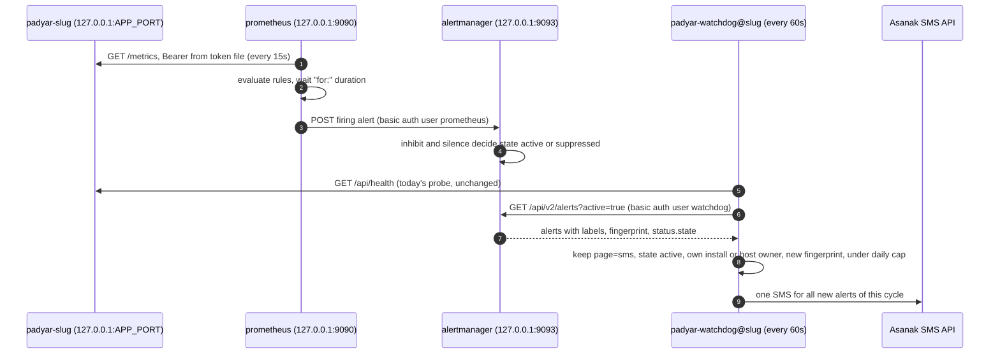

# SPEC: پشتهٔ پایش و هشدار (Prometheus، Alertmanager، پیامک هشدار)

| Field | Value |
|---|---|
| Created | 2026-10-01 |
| Updated | 2026-10-02 |
| Status | Draft |
| Domain | infrastructure |
| Author | Sina Shamsizadeh (مالک). پیش‌نویس با کمک AI (Claude Opus 5.5). بازبینی انسانی: pending |
| Sources | `docs/features/monitoring-stack/RESEARCH.md` (Complete، خروجی: ADR، سپس SPEC)، ADR-024 در `docs/engineering/DECISIONS.md` |
| Base | همهٔ ارجاع‌های `file:line` روی commit `fcdf14c` هستند، مگر جایی که نام یک PR باز آمده |

**وضعیت تصمیم‌ها:** روش نصب و تصمیم‌های وابسته در ADR-024 با وضعیت
Proposed ثبت شده‌اند. این SPEC آن‌ها را دقیق می‌کند و دوباره باز نمی‌کند.

## 1. Purpose

اپراتور باید بفهمد کی یک نصب پادیار یا میزبان آن خراب است، پیش از آن‌که
بازدیدکننده یا مشتری خبر بدهد. این SPEC دقیقاً مشخص می‌کند چه چیزی روی
میزبان نصب می‌شود، کدام ده هشدار تیکت با کدام عبارت ساخته می‌شوند، و یک
هشدار چطور در رابط کاربری دیده و با پیامک Asanak فرستاده می‌شود.

### User stories

- **US-001** به‌عنوان اپراتور میزبان، می‌خواهم وقتی یک نصب یا خود میزبان خراب
  است، بدون باز کردن هیچ صفحه‌ای یک پیامک کوتاه فارسی بگیرم.
- **US-002** به‌عنوان اپراتور، می‌خواهم با یک فرمان کل پشتهٔ پایش را نصب یا
  به‌روز کنم، بدون این‌که نصب دیگری روی همان میزبان خراب شود.
- **US-003** به‌عنوان اپراتور، می‌خواهم پیش از کار نگهداری هشدارها را ساکت
  کنم تا پیامک بی‌مورد نگیرم.
- **US-004** به‌عنوان مالک محصول، می‌خواهم هیچ سطح تازه‌ای از اینترنت در
  دسترس نباشد و هیچ رازی در repo نرود.

## 2. Scope

### In scope

- اسکریپت تازهٔ `deploy/55-monitoring.sh` و فایل‌های config زیر
  `deploy/monitoring/`.
- Prometheus، Alertmanager، node_exporter، postgres_exporter و
  blackbox_exporter از آرشیو Ubuntu noble، زیر systemd، همه روی `127.0.0.1`.
- فهرست کامل قواعد هشدار (بخش 5.3)، route و inhibit در Alertmanager، و
  basic auth روی API آن.
- بستن `/metrics` در nginx، کلید `metrics:` در config تونل، و
  `METRICS_TOKEN` در قالب env.
- یک مرحلهٔ تازه در `deploy/watchdog/watchdog.py` که هشدارهای `page="sms"` را
  از Alertmanager می‌خواند و پیامک می‌کند.
- دو تغییر کوچک در کد برنامه که هشدارها به آن وابسته‌اند (بخش 11.1).
- تست وجود metric (D6 spike)، تست منطق قواعد با `promtool`، و تست مرحلهٔ
  watchdog.
- سند حادثه (runbook) و سند SLO در `docs/engineering/`.

### Out of scope

- **Grafana.** فاز اول Grafana نصب نمی‌کند و JSON داشبورد هم در repo
  نمی‌آید. داشبورد فعلاً رابط خود Prometheus است (ADR-024، تصمیم 2).
- **فهرست هشدارها در Admin → Operations.** یک گزینهٔ نام‌دار برای آینده
  (ADR-024، تصمیم 3).
- **گیرندهٔ بیرونی در Alertmanager** (webhook، ایمیل، Telegram).
- **probe بیرونی از راه Cloudflare** (SLI پنجم spike). به Q9 وابسته است.
- **هشدار روی `health_score`** (spike، D2).
- **معافیت پیامک هشدار از `sms_daily_budget`.** بدیل ADR-024 برای مالک است.
  اگر مالک آن را بپذیرد، یک کار جدا می‌شود.
- **fallback رمز برای postgres_exporter** (`DATA_SOURCE_PASS_FILE`). اگر Q8
  «نه» باشد، اسکریپت متوقف می‌شود و این کار جدا ساخته می‌شود.
- **درست کردن `deploy/40-cloudflare-tunnel.sh` برای چند دامنه.** آن اسکریپت
  کل config را برای یک دامنه بازنویسی می‌کند (بخش 8). این یک مشکل جدا است.
- **تغییر `deploy/padyar-deploy.sh`.** قواعد با اجرای دوبارهٔ
  `deploy/55-monitoring.sh` به میزبان می‌رسند.

## 3. Actors / Permissions

| بازیگر | از کدام در وارد می‌شود | چه کاری می‌تواند |
|---|---|---|
| اپراتور میزبان | SSH با رمز به `gpu@<host>`، سپس `sudo` | اجرای `deploy/55-monitoring.sh`، دیدن رابط Prometheus و Alertmanager با تونل SSH، گذاشتن silence با `amtool` |
| Prometheus (کاربر سیستمی `prometheus`) | Bearer `METRICS_TOKEN` از فایل توکن هر نصب (`app/routers/metrics.py:32-46`) | خواندن `/metrics` روی پورت loopback هر نصب. فرستادن هشدار به Alertmanager با کاربر basic auth `prometheus` |
| watchdog هر نصب (کاربر `padyar-<slug>`) | کاربر basic auth `watchdog` روی API Alertmanager | فقط `GET /api/v2/alerts`. پیامک با اعتبار Asanak همان نصب |
| کارکنان مشتری و بازدیدکننده | هیچ | هیچ چیز. هیچ صفحه‌ای که می‌بینند عوض نمی‌شود |

تنها endpoint برنامه که درگیر است `GET /metrics` است. آن امروز احراز هویت
خودش را دارد و این SPEC آن را عوض نمی‌کند: با توکن پر، Bearer لازم است و
هر شکست 403 است (`app/routers/metrics.py:32-41`).

## 4. User / System Flow

### 4.1 نصب (یک بار برای میزبان، و هر بار که قواعد عوض شوند)

1. اپراتور برای هر نصب یک `METRICS_TOKEN` در `/opt/padyar-<slug>/.env`
   می‌گذارد و برنامه را restart می‌کند.
2. اپراتور اجرا می‌کند: `sudo bash deploy/55-monitoring.sh inotex elecomp`.
3. اسکریپت پیش‌شرط‌ها را چک می‌کند (بخش 5.1). هر شکست: یک خط علت، یک خط
   دستور رفع، خروج با کد غیرصفر.
4. اسکریپت بسته‌ها را نصب می‌کند، configها را می‌نویسد، `promtool` را اجرا
   می‌کند، سرویس‌ها را restart می‌کند، و در آخر `ss -ltn` و نام metricها را
   چک می‌کند.
5. اسکریپت یک جمع‌بندی چاپ می‌کند: چه چیزی نصب شد، کدام نصب صاحب
   هشدارهای میزبان است، و دستور تونل SSH برای دیدن رابط.

### 4.2 مسیر یک هشدار

نمودار زیر مسیر یک هشدار را از metric تا پیامک نشان می‌دهد. همهٔ اجزا
پیشنهادی‌اند به‌جز برنامه، watchdog و Asanak. مرحلهٔ تازهٔ watchdog بعد از
probe امروزی آن اجرا می‌شود.



نکتهٔ نمودار: Alertmanager هیچ وقت خودش به بیرون وصل نمی‌شود. watchdog
می‌کشد (pull)، پس اگر Alertmanager یا Prometheus بمیرد، watchdog آن را
می‌بیند (REQ-048).

## 5. Behavior

### 5.1 اسکریپت `deploy/55-monitoring.sh`

**امضا:**

```bash
sudo bash deploy/55-monitoring.sh <slug> [<slug>...] [--host-alerts <slug>]
```

- **REQ-001** اسکریپت با الگوی کیت نوشته می‌شود: `set -euo pipefail`، چک
  `EUID` با پیام `Run with sudo: ...`، تابع `log`، و slug با همان regex
  `^[a-z0-9][a-z0-9-]*$` (`deploy/17-watchdog.sh:15-24`). بدون slug یا با slug
  نامعتبر، `Usage:` چاپ می‌شود و خروج 1 است.
- **REQ-002** ترتیب: بعد از `deploy/40-cloudflare-tunnel.sh` اجرا می‌شود.
  اگر `/etc/cloudflared/config.yml` نباشد، اسکریپت متوقف می‌شود و می‌گوید اول
  `40-cloudflare-tunnel.sh` را اجرا کنید.
- **REQ-003** برای هر slug، `APP_PORT` و `METRICS_TOKEN` از
  `/opt/padyar-<slug>/.env` خوانده می‌شوند، **فقط با روش SEC-010** (هرگز با
  `source`). اسکریپت هیچ پورتی به‌عنوان آرگومان نمی‌گیرد. `APP_PORT` که با
  `^[0-9]+$` نخواند، یا `METRICS_TOKEN` پر که با `^[A-Za-z0-9_-]+$` نخواند:
  توقف، بدون چاپ مقدار.
- **REQ-004** اگر `METRICS_TOKEN` خالی یا نبود، اسکریپت متوقف می‌شود و یک
  دستور یک‌خطی رفع چاپ می‌کند. اگر کلید در فایل هست ولی خالی است:
  `sudo sed -i "s/^METRICS_TOKEN=.*/METRICS_TOKEN=$(openssl rand -hex 32)/" /opt/padyar-<slug>/.env && sudo systemctl restart padyar-<slug>`.
  اگر کلید نیست: همان با `echo ... | sudo tee -a`. اسکریپت خودش `.env` برنامه
  را عوض نمی‌کند، چون آن کار restart برنامه لازم دارد.
- **REQ-005** اسکریپت هیچ وقت توکن یا رمزی چاپ نمی‌کند، و هیچ توکنی را در
  argv یک فرمان نمی‌گذارد. برای چک توکن، header از یک فایل موقت `0600` با
  `curl -H @<file>` خوانده می‌شود و فایل بعد پاک می‌شود.
- **REQ-006** توکن هر نصب در `/etc/prometheus/secrets/<slug>.token` نوشته
  می‌شود، مالک `root:prometheus`، مجوز `0640`. پوشهٔ
  `/etc/prometheus/secrets` با `root:prometheus` و `0750`.
- **REQ-007** چک توکن زنده، **پیش از نصب هر بسته و پیش از نوشتن فایل توکن**:
  اسکریپت توکن `.env` را در یک فایل موقت `0600` می‌گذارد و
  `GET http://127.0.0.1:<APP_PORT>/metrics` را با آن می‌زند (header مثل REQ-005).
  200: ادامه. فایل توکن REQ-006 فقط بعد از همهٔ پیش‌شرط‌ها نوشته می‌شود.
  403: توقف با پیام «برنامه بعد از گذاشتن METRICS_TOKEN restart نشده:
  `sudo systemctl restart padyar-<slug>`». هر چیز دیگر: توقف با کد HTTP. فایل
  موقت در هر خروجی پاک می‌شود. دلیل این ترتیب: اگر فایل توکن اول نوشته شود و
  چک 403 بگیرد، scrapeی که پیش از اجرا کار می‌کرد با توکن تازه می‌شکند.
- **REQ-008** صاحب هشدارهای میزبان در `/etc/padyar-monitoring/host-alerts-owner`
  (`0644`، یک خط، فقط slug) نوشته می‌شود. قاعده:
  - با `--host-alerts <slug>`: همان slug. باید یکی از نصب‌های ثبت‌شده باشد
    (REQ-009)، وگرنه توقف.
  - بدون آن و وقتی فایل نیست: اولین slug آرگومان‌ها.
  - بدون آن و وقتی فایل هست: فایل دست نمی‌خورد. پس اجرای دوباره با slugهای
    دیگر صاحب را بی‌صدا عوض نمی‌کند.
- **REQ-009** **اجرای دوباره با slugهای کمتر چیزی از نصب دیگر پاک نمی‌کند.**
  روش: هر چیز مخصوص یک نصب در فایل جدای خودش است:
  - `/etc/padyar-monitoring/installs/<slug>.conf` (`0644`، بدون راز):
    `PORT=<APP_PORT>` و `DOMAIN=<domain>`.
  - `/etc/prometheus/scrape.d/padyar-<slug>.yml`: scrape job همان نصب.
  - `/etc/prometheus/secrets/<slug>.token`.

  اسکریپت فقط فایل‌های slugهای آرگومان را می‌نویسد. فایل‌های مشترکی که به
  همهٔ نصب‌ها وابسته‌اند (`/etc/prometheus/blackbox.yml` و
  `/etc/prometheus/scrape.d/blackbox-origin.yml`) از **همهٔ** فایل‌های
  `/etc/padyar-monitoring/installs/*.conf` ساخته می‌شوند، نه فقط از آرگومان‌ها.
  اسکریپت هیچ فایلی را پاک نمی‌کند. برداشتن یک نصب یک قدم دستی در runbook است.
- **REQ-010** دامنهٔ هر نصب خودکار پیدا می‌شود: فایلی در
  `/etc/nginx/sites-enabled/` که `upstream padyar_<slug>` را دارد، و
  `server_name` آن (`deploy/nginx/instance.conf.template` با `{{SLUG}}` و
  `{{DOMAIN}}`). پیدا نشد یا بیش از یکی بود: توقف با «اول
  `15-nginx-and-ssl.sh` را برای این نصب اجرا کنید».
- **REQ-011** پیش‌شرط سیستم‌عامل: `VERSION_CODENAME=noble` در `/etc/os-release`،
  وگرنه توقف.
- **REQ-012** پیش‌شرط apt (Q3): `apt-cache policy prometheus` باید نامزد
  `2.45.*` داشته باشد. وگرنه توقف با «بستهٔ prometheus از apt در دسترس نیست؛
  ADR-024 بخش 7 (برگشت به گزینهٔ c) را ببینید».
- **REQ-013** نصب با
  `DEBIAN_FRONTEND=noninteractive apt-get install -y --no-install-recommends prometheus prometheus-alertmanager prometheus-node-exporter prometheus-postgres-exporter prometheus-blackbox-exporter`.
  اسکریپت نسخه‌های نصب‌شده را با نسخهٔ نام فایل‌های allowlist exporter
  (REQ-071) مقایسه می‌کند و اگر فرق داشتند، هشدار چاپ می‌کند (توقف نمی‌کند،
  چون وصلهٔ امنیتی Ubuntu نسخهٔ patch را بالا می‌برد).
- **REQ-014** پنجرهٔ نصب: بسته‌های Debian سرویس را بلافاصله بعد از نصب روشن
  می‌کنند، پیش از آن‌که loopback نوشته شود. در این چند ثانیه UFW (فقط 22، 80،
  443 باز، `deploy/00-bootstrap-server.sh:88-91`) لایهٔ محافظ است. اسکریپت
  چک می‌کند UFW `active` باشد، وگرنه پیش از نصب متوقف می‌شود.
- **REQ-015** listen هر سرویس در `/etc/default/<package>` (متغیر `ARGS`):

  | سرویس | پورت | فلگ‌های لازم |
  |---|---|---|
  | `prometheus` | 9090 | `--web.listen-address=127.0.0.1:9090 --storage.tsdb.retention.time=30d --storage.tsdb.retention.size=<REQ-016>` |
  | `prometheus-alertmanager` | 9093 | `--web.listen-address=127.0.0.1:9093 --cluster.listen-address= --web.config.file=/etc/prometheus/alertmanager-web.yml` |
  | `prometheus-node-exporter` | 9100 | `--web.listen-address=127.0.0.1:9100` |
  | `prometheus-postgres-exporter` | 9187 | `--web.listen-address=127.0.0.1:9187`، و `DATA_SOURCE_NAME="user=prometheus host=/var/run/postgresql dbname=postgres sslmode=disable"` |
  | `prometheus-blackbox-exporter` | 9115 | `--web.listen-address=127.0.0.1:9115 --config.file=/etc/prometheus/blackbox.yml` |
  | `cloudflared` | 20241 | کلید `metrics: 127.0.0.1:20241` در config (REQ-024) |

  `--cluster.listen-address=` (خالی) لازم است: پیش‌فرض Alertmanager برای
  gossip خوشه `0.0.0.0:9094` است (`cmd/alertmanager/main.go:131` در تگ
  v0.26.0، و توضیح فلگ در `:218`: «Set to empty string to disable HA mode»).
- **REQ-016** retention: 30 روز یا یک سقف اندازه، هر کدام زودتر برسد. سقف
  اندازه = کمترِ `5GB` و ۳۰٪ از (فضای آزاد پارتیشن `/var/lib/prometheus` در
  لحظهٔ اجرا (`df --output=avail`) + اندازهٔ فعلی TSDB (`du -sb /var/lib/prometheus`)).
  اگر این ۳۰٪ کمتر از `1GB` بود، توقف (Q5). اسکریپت عدد انتخاب‌شده را چاپ
  می‌کند. دلیل اضافه شدن اندازهٔ TSDB: دادهٔ خود TSDB «مصرف‌شده» حساب می‌شود،
  پس با فضای آزاد تنها، هر اجرای دوباره سقف را کمی پایین می‌آورد و Prometheus
  برای رسیدن به آن تاریخچه را پاک می‌کند.
- **REQ-017** `MemoryMax=` با یک drop-in
  `/etc/systemd/system/<unit>.service.d/padyar-limits.conf` برای هر سرویس:
  prometheus `1G`، alertmanager `256M`، node_exporter و postgres_exporter و
  blackbox_exporter هر کدام `128M`. این عددها **تخمین‌اند**، نه اندازه (spike،
  D5). بعد از ۳۰ روز داده بازبینی می‌شوند.
- **REQ-018** postgres_exporter بدون رمز: اسکریپت با `sudo -u postgres psql`
  نقش `prometheus` را با `LOGIN` می‌سازد (اگر نیست) و `GRANT pg_monitor TO prometheus`
  می‌دهد. سپس اتصال را با `sudo -u prometheus psql -h /var/run/postgresql -d postgres -c 'select 1'`
  چک می‌کند. شکست: توقف با «خط `local` در `pg_hba.conf` روی `peer` نیست (Q8)».
- **REQ-019** قبل از restart هر سرویس، اسکریپت اجرا می‌کند:
  `promtool check config /etc/prometheus/prometheus.yml`،
  `promtool check rules /etc/prometheus/rules/*.yml`،
  `promtool test rules` روی فایل تست کپی‌شده (REQ-072)، و
  `amtool check-config /etc/prometheus/alertmanager.yml`. هر شکست: توقف، و
  سرویس‌ها با config قبلی می‌مانند (configها اول در فایل موقت نوشته و بعد با
  `mv` جایگزین می‌شوند). اگر اجرا پیش از restart متوقف شود، فایل‌های config
  قبلی برمی‌گردند، رمزهایی که همین اجرا ساخته پاک می‌شوند (با هش قبلی
  `alertmanager-web.yml` جور نیستند)، و سرویس بسته‌هایی که **همین اجرا** نصب
  کرده stop و disable می‌شود. دلیل: apt آن‌ها را بلافاصله با پیش‌فرض Debian
  روی همهٔ interfaceها روشن می‌کند (REQ-014). بسته‌های از قبل نصب‌شده دست
  نمی‌خورند.
- **REQ-020** بعد از restart، چک listener: برای پورت‌های 9090، 9093، 9100،
  9115، 9187 و 20241، `ss -ltnH` باید فقط آدرس `127.0.0.1` نشان بدهد. پورت
  9094 نباید اصلاً گوش بدهد. هر نقض: پیام با نام پورت و آدرس، و خروج 2.
- **REQ-021** چک زندهٔ نام metricها (D6 بند 3): بعد از ۶۰ ثانیه صبر،
  `GET http://127.0.0.1:9090/api/v1/label/__name__/values`، و چاپ هر نامی که در
  قواعد هست ولی هیچ سری ندارد. فهرست «منتظر رویداد» فقط `ai_circuit_state`
  است: حتی بعد از DEP-3، وقتی جدول `ai_circuit_state` هیچ ردیفی ندارد، سری‌ای
  نیست. این نام با برچسب «منتظر رویداد» چاپ می‌شود، نه به‌عنوان خطا.
  `backup_outcome_total` در این فهرست نیست، چون بعد از DEP-2 هر دو برچسب
  موقع import ساخته می‌شوند. این چک خروج را شکست نمی‌دهد.
- **REQ-022** چک nginx: برای هر دامنه،
  `curl -sk -o /dev/null -w '%{http_code}' --resolve <domain>:443:127.0.0.1 https://<domain>/metrics`.
  اگر 404 نبود، یک هشدار پررنگ. دستور رفع فقط وقتی چاپ می‌شود که
  `deploy/nginx/instance.conf.template` همان checkout بلوک `location = /metrics`
  (WU0) را دارد؛ وگرنه هشدار می‌گوید ساختن دوبارهٔ vhost کمکی نمی‌کند. دلیل:
  بدون WU0 آن دستور چیزی را عوض نمی‌کند، و `MAINTENANCE_TITLE` اشتباه صفحهٔ
  نگهداری بازدیدکننده را عوض می‌کند. دستور رفع:
  `sudo MAINTENANCE_TITLE='<نام نصب برای بازدیدکننده>' bash deploy/17-watchdog.sh <slug> <port> <domain>`.
  آن اسکریپت vhost را از قالب دوباره می‌سازد (`deploy/17-watchdog.sh:65-80`).
  `MAINTENANCE_TITLE` لازم است: بدون آن، همان اسکریپت صفحهٔ نگهداری‌ای را که
  بازدیدکننده موقع 502/504 می‌بیند به عنوان پیش‌فرض برمی‌گرداند
  (`deploy/17-watchdog.sh:48-54`).
- **REQ-023** چک پیامک (بدون ارسال): برای صاحب هشدارهای میزبان، اسکریپت این
  کلیدها را با روش SEC-010 از `.env` همان نصب می‌خواند و فقط هشدار چاپ می‌کند.
  `.env` منبع درست است، چون وقتی DB پایین است `get_setting` به‌جای خطا `None`
  می‌دهد (`app/db/queries.py:59-63`) و `setting()` به env برمی‌گردد
  (`app/services/sms.py:271-286`):
  - اگر هر کدام از `ASANAK_USERNAME`، `ASANAK_PASSWORD` یا `ASANAK_SOURCE` در
    `.env` خالی است: «اعتبار Asanak فقط در DB است؛ وقتی DB پایین است هیچ پیامک
    هشداری نمی‌رود». دلیل: `send_asanak` همین سه را لازم دارد و
    `ASANAK_API_KEY` را هرگز نمی‌خواند (`app/services/sms.py:515-519`، `:692-696`).
  - اگر `ASANAK_PASSWORD` یک توکن `enc:` است و `SECRET_KEY` در `.env` خالی است:
    همان هشدار، چون باز کردن رمز آن وقت به DB نیاز دارد.
  - بودجه همان‌طور خوانده می‌شود که `daily_budget()` برنامه می‌خواند
    (`max(0, int(value.strip()))`، `app/services/sms.py:358-365`). اگر آن بزرگ‌تر
    از صفر است: «با این بودجه، وقتی DB پایین است هیچ پیامک هشداری نمی‌رود
    (ADR-024، تصمیم 7)». اگر `int()` آن را نمی‌خواند: هشدار «برنامه آن را 0
    (بدون سقف) می‌خواند»، بدون چاپ مقدار. دلیل: `int()` پایتون `+5`، `1_000` و
    رقم فارسی را هم می‌خواند. مقدار همین کلید در جدول `settings` برای این ریسک
    مهم نیست، چون وقتی DB پایین است خوانده نمی‌شود.
- **REQ-024** کلید metrics تونل، **بدون بازنویسی config تونل:**
  - اگر `/etc/cloudflared/config.yml` خطی با `^metrics:` ندارد: یک کپی در
    `/root/padyar-backups/cloudflared-config.yml.<UTC timestamp>` گذاشته
    می‌شود، و خط `metrics: 127.0.0.1:20241` درست بعد از خط `^credentials-file:`
    درج می‌شود (یک کلید سطح بالا؛ هیچ قاعدهٔ `ingress` لمس نمی‌شود). سپس
    `cloudflared --config /etc/cloudflared/config.yml ingress validate`. شکست:
    فایل از کپی برگردانده می‌شود و توقف. موفق: **اول** یک هشدار چاپ می‌شود
    که «تونل همهٔ نصب‌ها چند ثانیه قطع می‌شود»، **بعد**
    `systemctl restart cloudflared`. این restart فقط در اولین اجرا رخ می‌دهد،
    و اجرای اول باید بیرون از ساعت رویداد باشد (PC-13).
  - اگر خط `metrics: 127.0.0.1:20241` هست: هیچ کاری نمی‌شود و restart هم نه.
  - اگر خط `metrics:` با مقدار دیگری هست: توقف با پیام. اسکریپت انتخاب
    اپراتور را بازنویسی نمی‌کند.
  - اسکریپت **هرگز** `40-cloudflare-tunnel.sh` را اجرا نمی‌کند (بخش 8).
- **REQ-025** خروجی آخر: فهرست سرویس‌ها و نسخه‌ها، صاحب هشدارهای میزبان،
  retention انتخاب‌شده، و دستور دسترسی:
  `ssh -N -L 9090:127.0.0.1:9090 -L 9093:127.0.0.1:9093 gpu@<host>`.
- **REQ-026** دو اجرای هم‌زمان: کل اسکریپت زیر
  `flock -n /run/padyar-monitoring.lock` اجرا می‌شود. اجرای دوم پیام «یک
  اجرای دیگر در جریان است» می‌دهد و با کد 1 خارج می‌شود.

### 5.2 فایل‌های config

- **REQ-030** فایل‌ها در repo زیر `deploy/monitoring/`:
  `prometheus.yml`، `alertmanager.yml`، `rules/padyar.rules.yml`،
  `tests/padyar_rules_test.yml`، `exporter-metrics/<exporter>-<version>.txt`.
  فایل‌های مخصوص نصب (scrape هر نصب، blackbox) را اسکریپت از قالب‌های همان
  پوشه می‌سازد.
- **REQ-031** `prometheus.yml`: `scrape_interval: 15s`،
  `evaluation_interval: 15s`، `rule_files: ["/etc/prometheus/rules/*.yml"]`،
  `scrape_config_files: ["/etc/prometheus/scrape.d/*.yml"]` (در 2.45 هست:
  `config/config.go:224` تگ v2.45.3)، و jobهای ثابت `node` (9100)، `postgres`
  (9187)، `cloudflared` (20241). `alerting.alertmanagers` به `127.0.0.1:9093` با
  `basic_auth: {username: prometheus, password_file: /etc/prometheus/secrets/alertmanager-prometheus.pass}`.
  `honor_labels` همه جا پیش‌فرض (`false`) می‌ماند.
- **REQ-032** scrape هر نصب، `/etc/prometheus/scrape.d/padyar-<slug>.yml`:

  ```yaml
  scrape_configs:
    - job_name: padyar-<slug>
      metrics_path: /metrics
      authorization:
        type: Bearer
        credentials_file: /etc/prometheus/secrets/<slug>.token
      static_configs:
        - targets: ["127.0.0.1:<APP_PORT>"]
          labels: {app: padyar, install: <slug>}
  ```
- **REQ-033** blackbox: برای هر نصب ثبت‌شده یک module `origin_<slug>` با
  `prober: http`، `timeout: 10s`، `http.valid_status_codes: [200]`،
  `http.headers: {Host: <domain>}`، `http.tls_config.server_name: <domain>`
  (کلیدهای `CONFIGURATION.md` تگ v0.24.0). job `blackbox-origin` هر module را
  روی `https://127.0.0.1:443/api/health` اجرا می‌کند، با برچسب‌های
  `domain="<domain>"` و `probe_install="<slug>"`، و **بدون** برچسب `install`.
  نبودن `install` یعنی هشدارهای این job سطح میزبان‌اند (ADR-024 تصمیم 6).
  `probe_install` نام دیگری دارد تا مسیر پیامک (REQ-043) آن را نصب‌محور
  نخواند؛ فقط R14 از آن استفاده می‌کند.
- **REQ-034** برچسب `instance` برنامه: metric `ai_circuit_state` یک برچسب
  `instance` دارد (`app/services/metrics.py:62-65`) که با برچسب `instance`
  خود Prometheus برخورد می‌کند. با `honor_labels: false`، Prometheus برچسب
  برنامه را به `exported_instance` تغییر نام می‌دهد
  (`docs/configuration/configuration.md:186-187` در تگ v2.45.3). پس قواعد
  `exported_instance` به کار می‌برند، و تست برچسب (REQ-073) این تغییر نام را
  می‌شناسد.

### 5.3 قواعد هشدار

**قانون برچسب:** `severity="critical"` اگر و فقط اگر `page="sms"`. همهٔ
هشدارهای `warning` فقط در رابط‌اند. استثنای عمدی: `PadyarAppDown` بحرانی است
ولی `page` ندارد، چون probe خود watchdog آن را پیامک می‌کند (ADR-024، تصمیم 8).

**زبان annotation:** `summary` و `description` به فارسی. این متن‌ها فقط در
رابط اپراتور دیده می‌شوند. متن پیامک از annotation ساخته **نمی‌شود** (REQ-046).

| # | نام | `for:` | severity | `page` | وابستگی |
|---|---|---|---|---|---|
| R01 | `PadyarAppDown` | 2m | critical | ندارد | ندارد |
| R02 | `PadyarHigh5xxRate` | 5m | critical | sms | DEP-1 |
| R03 | `PadyarChatLatencyHigh` | 10m | critical | sms | DEP-1 |
| R04 | `PadyarAICircuitOpen` | 5m | critical | sms | DEP-1، DEP-3 |
| R05 | `PadyarBackupFailed` | 0m | critical | sms | DEP-2 |
| R06 | `PadyarBackupStale` | 15m | critical | sms | DEP-2، DEP-4 |
| R07 | `HostDiskLow` | 10m | critical | sms | ندارد |
| R08 | `HostPostgresDown` | 2m | critical | sms | ندارد |
| R09 | `HostCertExpiring` | 1h | critical | sms | ندارد |
| R10 | `HostTunnelDown` | 2m | critical | sms | ندارد |
| R11 | `HostDiskFilling` | 30m | warning | ندارد | ندارد |
| R12 | `MonitoringTargetDown` | 5m | warning | ندارد | ندارد |
| R13 | `MonitoringHeartbeat` | 0m | none | ندارد | ندارد |
| R14 | `HostOriginProbeFailed` | 3m | critical | sms | ندارد |

R01 تا R10 ده هشدار تیکت‌اند. R14 هم جزو هشدارهای لازم است: «cert/tunnel»
تیکت دو قاعده دارد، R09 پیش از انقضا و R14 خود قطعی. R11 تا R13 کمکی‌اند.

**عبارت‌ها:**

```promql
# R01 PadyarAppDown
up{app="padyar"} == 0

# R02 PadyarHigh5xxRate: بیش از ۵٪ خطای سرور در ۱۰ دقیقه، با حداقل ۲۰ درخواست،
# بدون درخواست‌های خود پشته (/metrics و /api/health)
(
  sum by (install) (increase(http_requests_total{app="padyar",status=~"5..",route!~"/metrics|/api/health"}[10m]))
  /
  sum by (install) (increase(http_requests_total{app="padyar",route!~"/metrics|/api/health"}[10m]))
) > 0.05
and on (install)
sum by (install) (increase(http_requests_total{app="padyar",route!~"/metrics|/api/health"}[10m])) >= 20

# R03 PadyarChatLatencyHigh: p95 چت بالای ۸ ثانیه، با حداقل ۱۰ درخواست چت
histogram_quantile(0.95,
  sum by (le, install) (rate(http_request_duration_seconds_bucket{app="padyar",route="/chat"}[10m]))
) > 8
and on (install)
sum by (install) (increase(http_request_duration_seconds_count{app="padyar",route="/chat"}[10m])) >= 10

# R04 PadyarAICircuitOpen: 2 یعنی open (app/services/metrics.py:84)
max by (install, exported_instance) (ai_circuit_state{app="padyar"}) == 2

# R05 PadyarBackupFailed
sum by (install) (increase(backup_outcome_total{app="padyar",result="failed"}[26h])) > 0

# R06 PadyarBackupStale: آخرین پشتیبان verify‌شده قدیمی‌تر از بازهٔ زمان‌بند + ۲ ساعت
(
  time() - max by (install) (backup_last_success_timestamp_seconds{app="padyar"})
  > max by (install) (backup_schedule_interval_seconds{app="padyar"}) + 7200
)
and on (install)
max by (install) (backup_schedule_interval_seconds{app="padyar"}) > 0

# R07 HostDiskLow
(
  node_filesystem_avail_bytes{job="node",fstype!~"tmpfs|devtmpfs|overlay|squashfs|ramfs"}
  / node_filesystem_size_bytes{job="node",fstype!~"tmpfs|devtmpfs|overlay|squashfs|ramfs"}
) < 0.10
and on (device, mountpoint) node_filesystem_readonly{job="node"} == 0

# R08 HostPostgresDown
pg_up{job="postgres"} == 0 or up{job="postgres"} == 0

# R09 HostCertExpiring: گواهی Let's Encrypt مبدأ کمتر از ۱۴ روز اعتبار دارد
probe_ssl_earliest_cert_expiry{job="blackbox-origin"} - time() < 14 * 86400

# R10 HostTunnelDown
max(cloudflared_tunnel_ha_connections{job="cloudflared"}) < 1
or max(up{job="cloudflared"}) == 0

# R11 HostDiskFilling: همان R07 با آستانهٔ 0.20

# R12 MonitoringTargetDown
up{job=~"node|blackbox-origin"} == 0

# R13 MonitoringHeartbeat: همیشه روشن؛ نبودنش یعنی Prometheus قاعده ارزیابی نمی‌کند
vector(1)

# R14 HostOriginProbeFailed: سایت از راه nginx و TLS مبدأ باز نمی‌شود،
# در حالی که خود برنامه بالا است (برنامه پایین را watchdog پیامک می‌کند)
probe_success{job="blackbox-origin"} == 0
unless on (probe_install)
label_replace(up{app="padyar"} == 0, "probe_install", "$1", "install", "(.*)")
```

یادداشت‌های لازم برای پیاده‌سازی:

- **503 در R02:** 503 شمرده **می‌شود**. دلیل: `/api/ready` وقتی مدل محلی بالا
  نیاید 503 واقعی می‌دهد (`app/routers/public.py:596-603`)، و
  `status!="503"` آن را پنهان می‌کرد. حالت نگهداری هم 503 می‌دهد
  (`app/services/maintenance.py:101-106`)، پس **روشن کردن حالت نگهداری یعنی
  یک silence** برای `PadyarHigh5xxRate` همان نصب. این قدم در runbook است
  (REQ-081). یک metric برای حالت نگهداری گزینهٔ آینده است، نه این کار.
- **درخواست‌های خود پشته در R02:** `route!~"/metrics|/api/health"` روی هر سه
  بخش است: خطاها، کل، و حداقل ۲۰. دلیل: Prometheus هر ۱۵ ثانیه `/metrics`
  را می‌خواند، probe مبدأ هر ۱۵ ثانیه و watchdog هر ۶۰ ثانیه `/api/health` را؛
  یعنی حدود ۹۰ درخواست موفق در ۱۰ دقیقه که هیچ بازدیدکننده‌ای نزده. اگر
  شمرده شوند، نصب بی‌بازدیدکننده همیشه از حداقل ۲۰ می‌گذرد و نسبت خطای نصب
  شلوغ رقیق می‌شود (۵ خطا در ۳۰ درخواست واقعی ۱۷٪ است، با ۹۰ تای پشته ۴٪).
  قطعی واقعی `/api/health` همچنان دیده می‌شود: watchdog آن را پیامک می‌کند و
  R14 روشن می‌شود.
- **سقف p95 در R03:** بالاترین bucket محدود `10.0` است
  (`app/services/metrics.py:46`)، پس p95 بالای ۱۰ ثانیه «10» خوانده می‌شود.
  آستانهٔ ۸ زیر این سقف است. هدف SLO (۹۵٪ زیر ۵ ثانیه) در سند SLO است، نه در
  این هشدار.
- **R05 و پنجرهٔ 26h:** هشدار تا ۲۶ ساعت بعد از یک شکست روشن می‌ماند. یادآوری
  پیامکی آن هر ۶ ساعت است (REQ-044)، پس حداکثر حدود ۵ پیامک.
- **نگهبان R06 برای `backup_auto_enabled=false`:** قاعده نمی‌تواند تنظیم DB را
  بخواند. پس یک metric تازه در برنامه لازم است: gauge
  `backup_schedule_interval_seconds`، برابر `backup_interval_hours × 3600`
  وقتی پشتیبان خودکار روشن است، و `0` وقتی خاموش است (تنظیم‌ها در
  `app/services/backup.py:21-29`). یک metric هم «خاموش است» را می‌گوید و هم
  بازهٔ واقعی را، تا نصبی با بازهٔ ۴۸ ساعت هشدار دروغ نگیرد. این DEP-4 است.
- **R06 روی نصب تازه:** وقتی هیچ پشتیبان verify‌شده‌ای نیست، مقدار timestamp
  `0` است (DEP-2)، پس هشدار روشن می‌شود. این عمدی است: «هیچ پشتیبانی نداریم»
  یک خطر واقعی است. runbook می‌گوید بعد از نصب یک پشتیبان دستی بگیرید.
- **R07 و mountpointها:** فیلتر بر اساس `fstype` و `readonly` است، نه نام
  mountpoint، چون mountpointهای سرور معلوم نیست (Q5). `node_filesystem_readonly`
  در node_exporter 1.7.0 هست (`collector/filesystem_common.go:147`).
- **R09 فقط پیش از انقضا هشدار می‌دهد.** blackbox_exporter v0.24.0 سری
  `probe_ssl_earliest_cert_expiry` را فقط وقتی TLS دست‌دهی موفق است می‌سازد
  (`prober/http.go:639-642`)، و با پیش‌فرض `insecure_skip_verify: false`
  (`CONFIGURATION.md:326`) گواهی منقضی دست‌دهی را رد می‌کند. پس در لحظهٔ
  انقضا سری ناپدید و R09 خاموش می‌شود. **R14 خود انقضا را می‌گیرد**، و همچنین
  nginx پایین و هر خرابی دیگر TLS مبدأ را. این حالت‌ها برای بازدیدکننده خطا
  هستند، چون تونل گواهی مبدأ را اعتبارسنجی می‌کند
  (`deploy/40-cloudflare-tunnel.sh:89-93`)، ولی watchdog (`deploy/watchdog/watchdog.py:222-236`)
  و R01 هر دو مستقیم به پورت برنامه وصل می‌شوند و آن‌ها را نمی‌بینند.
- **R14 و برنامهٔ پایین:** `unless` probe نصبی را که `up` آن صفر است کنار
  می‌گذارد، تا یک قطعی برنامه دو پیامک نشود (یکی از watchdog، یکی از R14).
  R12 این را نمی‌پوشاند: `up{job="blackbox-origin"}` وقتی خود probe شکست
  می‌خورد هم 1 می‌ماند.
- **R08:** یک postgres_exporter برای کل cluster کافی است، چون همهٔ نصب‌ها روی
  یک PostgreSQL هستند (`deploy/00-bootstrap-server.sh:36-40`).
- **R13 و watchdog:** R13 برچسب `page` ندارد و پیامک نمی‌شود. watchdog صاحب
  میزبان فقط **وجود** آن را در API Alertmanager چک می‌کند (REQ-048).
- **multiprocess:** همهٔ gaugeهای برنامه با `max by` جمع می‌شوند، تا اگر یک
  gauge حالت پیش‌فرض multiprocess (یک سری برای هر `pid`) بگیرد، قاعده نشکند
  (spike، جدول منابع).

**annotationها (فارسی، ثابت):**

| نام | `summary` |
|---|---|
| R01 | `Prometheus نمی‌تواند /metrics نصب {{ $labels.install }} را بخواند. یا برنامه پایین است، یا METRICS_TOKEN برنامه با فایل توکن یکی نیست (پاسخ 403).` |
| R02 | `بیش از ۵٪ درخواست‌های نصب {{ $labels.install }} در ۱۰ دقیقهٔ گذشته خطای سرور (5xx) گرفتند. اگر حالت نگهداری روشن است، silence بگذارید.` |
| R03 | `p95 زمان پاسخ چت نصب {{ $labels.install }} بالای ۸ ثانیه است.` |
| R04 | `مدار هوش مصنوعی {{ $labels.exported_instance }} در نصب {{ $labels.install }} باز است؛ پاسخ‌ها فقط از tierهای محلی می‌آیند.` |
| R05 | `در ۲۶ ساعت گذشته یک پشتیبان خودکار نصب {{ $labels.install }} شکست خورد یا verify نشد.` |
| R06 | `آخرین پشتیبان verify‌شدهٔ نصب {{ $labels.install }} از بازهٔ زمان‌بند به‌اضافهٔ ۲ ساعت قدیمی‌تر است.` |
| R07 | `کمتر از ۱۰٪ فضای {{ $labels.mountpoint }} آزاد است.` |
| R08 | `PostgreSQL پاسخ نمی‌دهد، یا exporter آن پایین است.` |
| R09 | `گواهی مبدأ {{ $labels.domain }} کمتر از ۱۴ روز اعتبار دارد؛ تمدید خودکار Let's Encrypt کار نکرده.` |
| R10 | `تونل Cloudflare هیچ اتصال فعالی ندارد، یا metrics آن خوانده نمی‌شود.` |
| R11 | `کمتر از ۲۰٪ فضای {{ $labels.mountpoint }} آزاد است.` |
| R12 | `exporter {{ $labels.job }} خوانده نمی‌شود.` |
| R13 | `ضربان سیستم پایش. این هشدار همیشه روشن است.` |
| R14 | `probe روی https://127.0.0.1:443/api/health برای {{ $labels.domain }} شکست خورد در حالی که برنامه بالا است. nginx پایین است یا گواهی مبدأ منقضی یا نامعتبر است. تونل همین را رد می‌کند، پس بازدیدکننده خطا می‌بیند.` |

هر قاعده یک annotation `runbook` هم دارد: نام بخش همان هشدار در سند runbook
(REQ-080).

### 5.4 Alertmanager

- **REQ-035** route و receiver:

  ```yaml
  route:
    receiver: ui-only
    group_by: [alertname, install]
    group_wait: 30s
    group_interval: 5m
    repeat_interval: 4h
  receivers:
    - name: ui-only
  ```

  receiver خالی است. هیچ پیامی از Alertmanager بیرون نمی‌رود.
- **REQ-036** inhibit:

  ```yaml
  inhibit_rules:
    - source_matchers: [alertname="PadyarAppDown"]
      target_matchers: [alertname=~"PadyarHigh5xxRate|PadyarChatLatencyHigh|PadyarAICircuitOpen"]
      equal: [install]
    - source_matchers: [alertname="HostPostgresDown"]
      target_matchers: [alertname=~"PadyarHigh5xxRate|PadyarChatLatencyHigh|PadyarBackupFailed"]
  ```

  قاعدهٔ دوم `equal` ندارد، پس DB پایین هشدارهای وابستهٔ **همهٔ** نصب‌ها را
  inhibit می‌کند. هشدار inhibit‌شده در API حالت `suppressed` دارد و watchdog
  آن را پیامک نمی‌کند (REQ-043).
- **REQ-037** basic auth با `--web.config.file=/etc/prometheus/alertmanager-web.yml`
  (`root:prometheus`، `0640`)، با سه کاربر و هش bcrypt:

  | کاربر | فایل رمز | مالک و مجوز | استفاده |
  |---|---|---|---|
  | `prometheus` | `/etc/prometheus/secrets/alertmanager-prometheus.pass` | `root:prometheus 0640` | Prometheus هشدار می‌فرستد |
  | `watchdog` | `/etc/padyar-monitoring/alertmanager-watchdog.pass` | `root:padyar-alertread 0640` | watchdog هر نصب هشدار می‌خواند |
  | `operator` | `/root/.secrets/alertmanager-operator.pass` | `root:root 0600` | رابط وب و `amtool` |

  - رمزها با `openssl rand -hex 24` ساخته می‌شوند، **فقط اگر فایل نیست**. اجرای
    دوباره رمز را عوض نمی‌کند.
  - هش bcrypt با `bcrypt` داخل venv اولین نصب ساخته می‌شود (برنامه همین
    کتابخانه را برای رمز ادمین دارد). رمز از stdin به پایتون داده می‌شود، نه از
    argv.
  - گروه `padyar-alertread` ساخته می‌شود و کاربر `padyar-<slug>` هر نصب ثبت‌شده
    عضو آن می‌شود.
  - اسکریپت `/root/.config/amtool/config.yml` (`0600`) را با
    `alertmanager.url: http://operator:<pass>@127.0.0.1:9093` می‌نویسد، تا
    `sudo amtool silence add ...` بدون رمز در argv کار کند (`amtool` basic auth
    در URL را می‌پذیرد: «[amtool] Support basic auth in alertmanager url (#1279)»
    در CHANGELOG تگ v0.26.0).
  - basic auth مجوز جدا برای هر endpoint ندارد. پس کاربر `watchdog` هم
    فنی می‌تواند هشدار POST کند. این ریسک را بخش 9 می‌نویسد.
- **REQ-038** API و رابط Prometheus بدون auth می‌مانند. دلیل: فقط خواندنی است
  (API ادمین و lifecycle با پیش‌فرض خاموش‌اند و اسکریپت آن‌ها را روشن
  نمی‌کند)، فقط روی loopback است، و هیچ رازی در metricها نیست.

### 5.5 مرحلهٔ پیامک در watchdog

همهٔ منطق تصمیم در هستهٔ خالص `deploy/watchdog/watchdog.py` نوشته می‌شود، با
ساعت تزریقی، مثل `next_action` (`deploy/watchdog/watchdog.py:79-105`). I/O در
`run_cycle` می‌ماند.

- **REQ-040** مرحله بعد از probe و پیامک «برنامه پایین است» امروز اجرا
  می‌شود (`deploy/watchdog/watchdog.py:336-354`)، در همان پروسه و همان state file.
- **REQ-041** اگر `/etc/padyar-monitoring/alertmanager-watchdog.pass` **نیست**
  (`FileNotFoundError`)، مرحله بی‌صدا رد می‌شود. نصبی که پشتهٔ پایش ندارد دقیقاً
  رفتار امروز را دارد. اگر فایل هست ولی خواندنی نیست (مثلاً
  `PermissionError`، چون کاربر این نصب عضو `padyar-alertread` نیست) یا هر خطای
  دیگر خواندن، مرحله رد می‌شود و **در هر چرخه** یک خط در journal می‌آید:
  `[watchdog] <slug>: monitoring alerts OFF: cannot read alertmanager-watchdog.pass (<ExceptionType>); re-run deploy/55-monitoring.sh <slug>`.
  این حالت پیش می‌آید وقتی یک نصب بعد از آخرین اجرای `55-monitoring.sh`
  ساخته شده (REQ-037 فقط نصب‌های ثبت‌شده را عضو گروه می‌کند).
- **REQ-042** خواندن: `GET http://127.0.0.1:9093/api/v2/alerts?active=true`
  با basic auth کاربر `watchdog`، timeout ۵ ثانیه. فقط `127.0.0.1`، فقط GET.
  هیچ فیلتری در query نیست، تا R13 هم دیده شود.
- **REQ-043** انتخاب برای پیامک، همه با هم:
  - `labels.page == "sms"`؛
  - `status.state == "active"` (نه `suppressed`، پس silence و inhibit رعایت
    می‌شوند)؛
  - `labels.install == <slug>`، یا هشدار برچسب `install` ندارد **و** محتوای
    `/etc/padyar-monitoring/host-alerts-owner` برابر `<slug>` است.
- **REQ-044** dedup با `fingerprint`. state یک نقشهٔ `alert_sent: {fingerprint: epoch}`
  نگه می‌دارد:
  - fingerprint تازه: پیامک می‌شود.
  - fingerprint قدیمی: فقط وقتی `ALERT_REMIND_SECONDS = 21600` (۶ ساعت) از
    آخرین ارسال گذشته، به‌عنوان یادآوری.
  - fingerprintی که دیگر انتخاب نمی‌شود از نقشه حذف می‌شود. پیامک «رفع شد»
    فرستاده نمی‌شود.
- **REQ-045** **یک پیامک در هر چرخه** برای همهٔ هشدارهای انتخاب‌شده (تازه و
  یادآوری).
- **REQ-046** متن پیامک از جدول ثابت زیر ساخته می‌شود، فقط با `alertname`،
  نه از annotation:

  | `alertname` | برچسب فارسی |
  |---|---|
  | `PadyarHigh5xxRate` | خطای سرور زیاد |
  | `PadyarChatLatencyHigh` | پاسخ چت کند |
  | `PadyarAICircuitOpen` | سرویس هوش مصنوعی قطع |
  | `PadyarBackupFailed` | پشتیبان ناموفق |
  | `PadyarBackupStale` | پشتیبان قدیمی |
  | `HostDiskLow` | دیسک تقریباً پر |
  | `HostPostgresDown` | پایگاه داده پایین |
  | `HostCertExpiring` | گواهی رو به انقضا |
  | `HostTunnelDown` | تونل Cloudflare قطع |
  | `HostOriginProbeFailed` | سایت از راه nginx باز نمی‌شود |
  | silence تازه (REQ-054) | یک silence تازه گذاشته شد |
  | هر نام دیگر | هشدار دیگر |

  شکل متن، با `NAME = install.upper()` مثل `down_message`
  (`deploy/watchdog/watchdog.py:127-133`):

  - `پادیار | هشدار {NAME}: {برچسب۱}، {برچسب۲}، {برچسب۳} و {k} مورد دیگر. جزئیات در صفحهٔ هشدار.`
  - حداکثر سه برچسب نام برده می‌شود. «و {k} مورد دیگر» فقط وقتی بیش از سه
    مورد هست. برچسب تکراری یک بار می‌آید.
  - اگر همهٔ موارد یادآوری‌اند، متن با `یادآوری | ` شروع می‌شود.
- **REQ-047** سقف روزانه: `ALERT_SMS_DAILY_CAP = 10` تلاش ارسال برای هر نصب
  در هر روز UTC (همان روزی که `credit_alert` به کار می‌برد،
  `deploy/watchdog/watchdog.py:108-119`). شمارش فقط تلاش‌های ارسال همین مرحله
  است، موفق یا ناموفق (REQ-051): هشدار، یادآوری، «پایش از کار افتاده»، اعلام
  سقف. پیامک «برنامه پایین است» و اعتبار کم شمرده نمی‌شوند. نُه تلاش اول روز
  پیامک هشدار عادی‌اند. اگر بعد از آن پیامک دیگری لازم شد، تلاش دهم به‌جای آن
  این متن است:
  `پادیار | سقف پیامک هشدار امروز برای {NAME} پر شد. بقیهٔ هشدارهای امروز فقط در صفحهٔ هشدار دیده می‌شوند.`
  بعد از آن تا روز بعد هیچ پیامکی از این مرحله نمی‌رود. هشدارهایی که در این
  مدت انتخاب شدند، علامت ارسال **نمی‌گیرند**، پس فردا پیامک می‌شوند.
- **REQ-048** پایش خود پشتهٔ پایش، فقط در watchdog صاحب میزبان (تا یک رویداد
  یک پیامک باشد):
  - اگر API سه چرخهٔ پشت‌سرهم جواب ندهد (خطا، timeout، کد غیر 200)، یا
  - API جواب بدهد ولی `MonitoringHeartbeat` سه چرخهٔ پشت‌سرهم در پاسخ نباشد،

  یک پیامک فرستاده می‌شود:
  `پادیار | سیستم پایش از ساعت {HH:MM} (به وقت تهران) کار نمی‌کند. هشدارها تا رفع آن پیامک نمی‌شوند.`
  ساعت، ساعت اولین شکست است (`tehran_clock`،
  `deploy/watchdog/watchdog.py:122-124`). یادآوری هر `ALERT_REMIND_SECONDS`.
  یک چرخهٔ سالم شمارنده را صفر می‌کند. این منطق همان شکل `FAILS_BEFORE_ALERT = 3`
  است (`deploy/watchdog/watchdog.py:61`). watchdog نصب‌های دیگر شکست API را
  فقط در journal می‌نویسند.
- **REQ-049** هم‌زیستی با «برنامه پایین است»: وقتی
  `state["fail_count"] >= FAILS_BEFORE_ALERT` است، هشدارهای Alertmanager که
  برچسب `install` همین نصب را دارند انتخاب نمی‌شوند. هشدارهای میزبان همچنان
  انتخاب می‌شوند. این لایهٔ دوم کنار inhibit (REQ-036) است، برای وقتی که
  `for: 2m` قاعدهٔ R01 هنوز تمام نشده.
- **REQ-050** گیرنده: `alert_critical_phone` همان نصب، از همان `settings_reader`
  و همان کش شمارهٔ امروز (`deploy/watchdog/watchdog.py:322-328`). شمارهٔ خالی:
  چیزی فرستاده نمی‌شود و یک خط `[watchdog] <slug>: alert pending but no alert_critical_phone configured`
  در journal می‌آید. هشدار در رابط همچنان دیده می‌شود.
- **REQ-051** ارسال ناموفق: هر استثنا از `sender` (از جمله `SmsError` بودجهٔ
  تمام‌شده، `app/services/sms.py:396-410`) یک خط
  `[watchdog] <slug>: alert send failed: <ExceptionType>` در journal می‌نویسد. هیچ
  fingerprintی علامت ارسال نمی‌گیرد، ولی خود تلاش در شمارندهٔ سقف (REQ-047)
  شمرده می‌شود. دلیل: درگاهی که پیامک را می‌رساند و بعد خطا می‌دهد (مثلاً
  timeout بعد از پذیرش) بدون این شمارش هر ۵ دقیقه یک پیامک می‌فرستاد، یعنی
  ۲۸۸ پیامک در روز؛ با آن، سقف روزانه در هر حالت خرابی هزینه را محدود می‌کند.
  پس حدود ۴۵ دقیقه قطعی درگاه سقف پیامک هشدار آن روز را تمام می‌کند. تلاش
  بعدی زودتر از `ALERT_RETRY_SECONDS = 300` نیست. هیچ استثنایی از `run_cycle`
  بیرون نمی‌رود (همان قانون `deploy/watchdog/watchdog.py:163-169`).
- **REQ-052** ارسال از همان `_send` امروز می‌رود
  (`deploy/watchdog/watchdog.py:248-253`)، یعنی `send_asanak`. **حقیقت مهم
  برای تست:** `send_asanak` هیچ شاخهٔ dev ندارد
  (`app/services/sms.py:681-723`) و تنظیم `sms_provider` را نمی‌خواند. صندوق
  آزمایشی `data/otp-dev-outbox.log` (`app/services/sms.py:151`) فقط از
  `_send_link` نوشته می‌شود (`app/services/sms.py:802-812`). پس روی هر ماشینی
  که اعتبار Asanak دارد، watchdog پیامک **واقعی** می‌فرستد. این SPEC آن را
  عوض نمی‌کند. تست‌ها مرز ارسال را جعل می‌کنند (بخش «Tests»).
- **REQ-053** `run_cycle` یک پارامتر تزریقی تازه می‌گیرد، `alerts_reader`، با
  پیش‌فرض تولیدی که REQ-042 را اجرا می‌کند، پارامتر `owner_reader` برای
  REQ-043، و پارامتر `silences_reader` برای REQ-054. هر سه مثل `probe` و `sender` در تست با lambda جایگزین می‌شوند
  (`deploy/watchdog/watchdog.py:271-297`).
- **REQ-054** خبر از silence تازه، فقط در watchdog صاحب میزبان: هر چرخه
  `GET http://127.0.0.1:9093/api/v2/silences` (همان basic auth). هر silence با
  `status.state == "active"` که `id` آن در `state["silence_seen"]` نیست، یک برچسب
  «یک silence تازه گذاشته شد» به پیامک همان چرخه اضافه می‌کند و `id` در state
  ثبت می‌شود. silence ساخته‌شده توسط خود اپراتور هم پیامک می‌شود. این عمدی است:
  فیلد `createdBy` را کلاینت می‌نویسد و نمی‌شود به آن اعتماد کرد، پس تنها راه
  دیدن silence جعلی، دیدن هر silence است. هزینه: یک پیامک برای هر silence، در
  سقف REQ-047. شکست این GET همان شمارش REQ-048 را می‌گیرد.

### 5.6 State / Transitions

کلیدهای تازه در `STATE_DIR/<slug>/state.json`، با پیش‌فرض در `_fresh_state`
(`deploy/watchdog/watchdog.py:172-181`)، تا state قدیمی بدون این کلیدها هم
کامل خوانده شود (`:190-195`):

| کلید | نوع | معنی |
|---|---|---|
| `alert_sent` | `{fingerprint: epoch}` | آخرین ارسال هر هشدار |
| `alert_day` | `"YYYY-MM-DD"` (UTC) | روز شمارندهٔ سقف |
| `alert_sms_today` | int | تلاش‌های ارسال این مرحله در `alert_day`، موفق یا ناموفق (REQ-051) |
| `alert_retry_after` | epoch | زودترین زمان تلاش بعد از ارسال ناموفق |
| `am_fail_count` | int | چرخه‌های پشت‌سرهم با API خراب یا بدون ضربان |
| `am_down_since` | epoch | اولین چرخهٔ این رشته |
| `am_last_alert` | epoch | آخرین پیامک «پایش از کار افتاده» |
| `silence_seen` | `[id]` | silenceهایی که خبرشان رفته (فقط صاحب میزبان، REQ-054) |

## 6. API / Contract

این کار endpoint تازه‌ای در برنامه نمی‌سازد و `GET /metrics` را عوض نمی‌کند.
قراردادهایی که این کار به آن‌ها تکیه می‌کند:

| قرارداد | شکل | شاهد |
|---|---|---|
| `GET /metrics` برنامه | Bearer، 200 با متن Prometheus، هر شکست 403 | `app/routers/metrics.py:32-53` |
| `GET /api/v2/alerts` Alertmanager 0.26 | آرایهٔ هشدار با `labels`، `fingerprint`، `status.state` (`active`، `suppressed`، `unprocessed`) | `api/v2/openapi.yaml` تگ v0.26.0 (spike، D3) |
| `GET /api/v1/label/__name__/values` Prometheus | فهرست نام‌ها | مستندات HTTP API |
| فرمان‌های جدید `amtool` | `silence add`، `silence expire` با config در `/root/.config/amtool/config.yml` | REQ-037 |
| خروجی اسکریپت | 0 موفق، 2 فقط listener عمومی، 1 هر شکست دیگر (کد خود فرمان شکست‌خورده، مثل 2 از psql یا 100 از apt-get، به 1 تبدیل می‌شود) | REQ-001، REQ-020 |

metricهای تازهٔ برنامه (قرارداد با قواعد):

| metric | نوع | برچسب | مقدار | از کجا |
|---|---|---|---|---|
| `backup_schedule_interval_seconds` | Gauge، حالت multiprocess `mostrecent` | ندارد | `interval_hours × 3600`، یا `0` وقتی خودکار خاموش است | DEP-4 |
| `backup_last_success_timestamp_seconds` | Gauge | ندارد | Unix time آخرین پشتیبان verify‌شده، `0` اگر هیچ | DEP-2 |

## 7. Data Model / Persistence

- **هیچ جدول، ستون یا migration تازه‌ای نیست.** نه در `migrations/` و نه در
  `init_db()` (`app/db/connection.py`).
- داده‌های تازه روی دیسک میزبان:

  | مسیر | محتوا | مالک و مجوز |
  |---|---|---|
  | `/var/lib/prometheus/` | TSDB، با retention بخش REQ-016 | پیش‌فرض بسته |
  | `/etc/prometheus/secrets/<slug>.token` | توکن هر نصب | `root:prometheus 0640` |
  | `/etc/prometheus/secrets/alertmanager-prometheus.pass` | رمز | `root:prometheus 0640` |
  | `/etc/prometheus/alertmanager-web.yml` | هش‌های bcrypt | `root:prometheus 0640` |
  | `/etc/padyar-monitoring/installs/<slug>.conf` | `PORT`، `DOMAIN` | `root:root 0644` |
  | `/etc/padyar-monitoring/host-alerts-owner` | یک slug | `root:root 0644` |
  | `/etc/padyar-monitoring/alertmanager-watchdog.pass` | رمز | `root:padyar-alertread 0640` |
  | `/root/.secrets/alertmanager-operator.pass` | رمز | `root:root 0600` |
  | `/root/.config/amtool/config.yml` | URL با رمز اپراتور | `root:root 0600` |
  | `/var/lib/padyar-watchdog/<slug>/state.json` | کلیدهای بخش 5.6 | `padyar-<slug>` |

- برداشتن کامل (از خود نصب‌ها چیزی دست نمی‌خورد). دلیل فهرست کامل: purge و
  پاک کردن دو پوشه، نقش PostgreSQL، گروه، drop-inها، دو فایل `/root` و کپی‌های
  پشتیبان config (که رمز اپراتور را دارند) را جا می‌گذاشت:

  ```bash
  UNITS="prometheus prometheus-alertmanager prometheus-node-exporter prometheus-postgres-exporter prometheus-blackbox-exporter"
  sudo systemctl disable --now $UNITS
  sudo apt-get purge $UNITS
  for u in $UNITS; do sudo rm -f /etc/systemd/system/$u.service.d/padyar-limits.conf; sudo rmdir /etc/systemd/system/$u.service.d 2>/dev/null; done
  sudo systemctl daemon-reload
  sudo rm -rf /etc/prometheus /etc/padyar-monitoring /var/lib/prometheus
  sudo rm -f /root/.secrets/alertmanager-operator.pass /root/.config/amtool/config.yml
  sudo bash -c 'rm -rf /root/padyar-backups/monitoring-*'
  sudo -u postgres psql -c 'DROP ROLE prometheus'
  sudo groupdel padyar-alertread
  ```

  خط `metrics: 127.0.0.1:20241` در config تونل بی‌خطر است و می‌تواند بماند.
  برای برداشتنش فقط همان یک خط پاک می‌شود، config چک و تونل بیرون از ساعت
  رویداد restart می‌شود:
  `sudo sed -i '/^metrics: 127\.0\.0\.1:20241$/d' /etc/cloudflared/config.yml && sudo cloudflared --config /etc/cloudflared/config.yml ingress validate && sudo systemctl restart cloudflared`.
  کپی‌ای که اولین اجرا از این فایل گرفته **برگردانده نمی‌شود**، چون
  `deploy/40-cloudflare-tunnel.sh` کل فایل را برای یک دامنه بازنویسی می‌کند و
  کپی قدیمی می‌تواند قاعدهٔ ingress سایتی را که بعداً اضافه شده پاک کند.
  کلیدهای تازهٔ state watchdog بی‌خطر می‌مانند.

## 8. Error / Edge Cases

| حالت | رفتار |
|---|---|
| **اجرای دوبارهٔ `40-cloudflare-tunnel.sh` برای افزودن metrics** | ممنوع و لازم نیست. آن اسکریپت کل `/etc/cloudflared/config.yml` را با `cat >` برای **یک** دامنه بازنویسی می‌کند (`deploy/40-cloudflare-tunnel.sh:75-97`، یک `hostname: ${DOMAIN}` در `:88-93`). روی میزبانی با دو نصب، اجرای آن قاعدهٔ ingress نصب دیگر را پاک می‌کند. برای همین `55-monitoring.sh` فقط یک خط درج می‌کند (REQ-024). قالب `40` هم خط `metrics: 127.0.0.1:20241` را می‌گیرد (REQ-062)، فقط برای میزبان تازه. مشکل «یک دامنه» در `40` یک کار جدا است |
| `METRICS_TOKEN` خالی | توقف، دستور یک‌خطی (REQ-004) |
| توکن در `.env` هست ولی برنامه restart نشده | 403 از `/metrics`، توقف پیش از نصب هر بسته؛ فایل توکن Prometheus عوض نمی‌شود (REQ-007) |
| اجرای دوباره با slugهای کمتر | فایل‌های نصب دیگر دست نمی‌خورند؛ فایل‌های مشترک از همهٔ `installs/*.conf` ساخته می‌شوند (REQ-009) |
| دو اجرای هم‌زمان اسکریپت | REQ-026 |
| `promtool` قاعده یا config را رد کند | توقف پیش از restart؛ سرویس‌ها با config قبلی (REQ-019) |
| listener روی آدرس غیر loopback | خروج 2 با نام پورت (REQ-020) |
| Prometheus بمیرد، Alertmanager زنده | R13 ناپدید می‌شود؛ صاحب میزبان بعد از ۳ چرخه پیامک «پایش از کار افتاده» (REQ-048) |
| Alertmanager بمیرد | API جواب نمی‌دهد؛ همان پیامک (REQ-048) |
| برنامه پایین است | فقط پیامک probe امروز؛ هشدارهای همان نصب inhibit و فیلتر می‌شوند (REQ-036، REQ-049) |
| DB پایین است، `SMS_DAILY_BUDGET` در `.env` خالی یا `0` | وقتی DB پایین است `daily_budget()` مقدار را از env می‌خواند (`app/services/sms.py:358-365`، `:271-286`). `_spend_budget` زود برمی‌گردد (`app/services/sms.py:393-395`)؛ پیامک می‌رود اگر اعتبار Asanak در `.env` باشد (`setting()` به env برمی‌گردد، `app/services/sms.py:271-286`) |
| DB پایین است، `SMS_DAILY_BUDGET` در `.env` بزرگ‌تر از `0` | این مقدار وقتی در `.env` است که آینهٔ پنل ادمین کار کرده (`app/services/sms.py:289-327`). `_spend_budget` پیش از ارسال `set_setting` می‌زند (`app/services/sms.py:412-413`) و `set_setting` بدون DB خطا می‌دهد (`app/db/queries.py:294-299`). **هیچ پیامک هشداری نمی‌رود**، حتی «DB پایین است». journal: `alert send failed`. اسکریپت این را در نصب هشدار می‌دهد (REQ-023) |
| DB پایین است و اعتبار Asanak فقط در DB است | `get_setting` به‌جای خطا `None` می‌دهد (`app/db/queries.py:59-63`)، اعتبار خالی است، `send_asanak` خطا می‌دهد. هیچ پیامکی نمی‌رود (REQ-023 هشدار می‌دهد) |
| بودجهٔ روزانه تمام شده | `SmsError` (`app/services/sms.py:396-410`)؛ REQ-051 |
| Asanak پایین یا اعتبار تمام | `SmsError` از `_call`؛ REQ-051. هشدار اعتبار کم امروز سر جایش است |
| `alert_critical_phone` خالی | REQ-050 |
| سیل هشدار | یک پیامک در چرخه (REQ-045)، سقف ۱۰ در روز (REQ-047) |
| state file خراب | همان رفتار امروز: reset (`deploy/watchdog/watchdog.py:196-201`). بدترین حالت: یک پیامک تکراری |
| nginx پایین، یا گواهی مبدأ منقضی یا نامعتبر، در حالی که برنامه بالا است | watchdog و R01 چیزی نمی‌بینند (هر دو به پورت برنامه وصل می‌شوند). R14 بعد از ۳ دقیقه روشن و پیامک می‌شود. R09 در لحظهٔ انقضا خاموش می‌شود، چون سری آن ناپدید می‌شود (بخش 5.3) |
| فایل رمز watchdog هست ولی خواندنی نیست | REQ-041: هر چرخه یک خط `monitoring alerts OFF` در journal |
| یک نصب silence جعلی بگذارد | REQ-054، SEC-005 |
| حالت نگهداری روشن | R02 روشن می‌شود مگر اپراتور silence بگذارد (runbook، REQ-081) |
| نصب تازه بدون هیچ پشتیبان | R06 روشن می‌شود (عمدی، بخش 5.3) |
| نسخهٔ cloudflared قدیمی‌تر از 2024.12.1 (Q4) | کلید صریح `metrics:` همین را پوشش می‌دهد؛ چک `ss` (REQ-020) اثبات است |

## 9. Security / Privacy

- **SEC-001** هیچ listener تازه‌ای روی آدرسی جز `127.0.0.1` نیست. اسکریپت
  آن را با `ss` ثابت می‌کند (REQ-020). gossip خوشهٔ Alertmanager خاموش است.
- **SEC-002** `/metrics` از راه nginx 404 می‌دهد
  (`location = /metrics { return 404; }` بالای catch-all در
  `deploy/nginx/instance.conf.template:184`). Prometheus مستقیم به پورت loopback
  وصل می‌شود، پس چیزی نمی‌شکند. امروز `/metrics` از اینترنت می‌رسد و فقط 403
  برنامه جلوی آن است (`docs/engineering/MONITORING.md:132-155`).
- **SEC-003** هیچ توکن یا رمزی در repo، در `prometheus.yml`، در خروجی اسکریپت، یا
  در argv نیست. فقط مسیر فایل (REQ-005، REQ-037).
- **SEC-004** API Alertmanager basic auth دارد (REQ-037). بدون آن، هر پروسهٔ
  محلی می‌توانست silence بگذارد یا هشدار جعلی با `page="sms"` بسازد و پیامک
  پولی بفرستد.
- **SEC-005** ریسک باقی‌مانده: basic auth مجوز جدا برای endpoint ندارد. هر
  پروسه‌ای که فایل رمز `watchdog` را بخواند (یعنی هر نصب روی این میزبان) فنی
  می‌تواند هشدار POST کند. پس یک نصب به خطر افتاده می‌تواند برای نصب دیگر
  پیامک هشدار بسازد. هزینه را سقف روزانه (REQ-047) محدود می‌کند. watchdog
  فقط GET می‌زند.

  همان رمز **silence** هم می‌گذارد (`POST /api/v2/silences`) یا پاک می‌کند
  (`DELETE /api/v2/silence/{id}`). یک نصب به خطر افتاده می‌تواند هشدارهای واقعی
  نصب دیگر را بی‌هزینه ساکت کند، و سقف روزانه جلوی آن را نمی‌گیرد. کاهش: هر
  silence تازه پیامک می‌شود (REQ-054). پاک کردن یک silence فقط هشدار را دوباره
  فعال می‌کند. «رفع» جعلی یک هشدار با POST و `endsAt` کوتاه‌عمر است، چون
  Prometheus هشدار روشن را حداقل هر یک دقیقه دوباره می‌فرستد
  (`--rules.alert.resend-delay`، پیش‌فرض `1m`، `cmd/prometheus/main.go:386-387`
  در تگ v2.45.3). باقی ریسک (silence که در فاصلهٔ
  پیامک تا دیدن اپراتور اثر دارد) به‌عنوان ریسک مالک پذیرفته می‌شود
  (ADR-024، بخش 5).
- **SEC-006** متن پیامک فقط از جدول ثابت REQ-046 ساخته می‌شود. هیچ مقدار برچسب
  یا annotation (که یک هشدار جعلی می‌تواند هر چیزی در آن بگذارد) وارد پیامک
  نمی‌شود، جز `install.upper()` که slug خود همان watchdog است.
- **SEC-007** جداسازی نصب‌ها: پیامک هر نصب با کاربر، `.env`، DB و اعتبار Asanak
  خود همان نصب می‌رود (`deploy/systemd/padyar-watchdog@.service:21-28`، از `User=` تا `ExecStart=`).
  Prometheus و Alertmanager هرگز اعتبار Asanak را نمی‌بینند. state هر نصب در
  پوشهٔ خودش است (`deploy/17-watchdog.sh:31-37`).
- **SEC-008** postgres_exporter فقط نقش `pg_monitor` دارد و با `peer` روی socket
  وصل می‌شود. هیچ رمزی برای آن روی دیسک نیست.
- **SEC-009** دسترسی اپراتور فقط با تونل SSH. هیچ hostname عمومی تازه‌ای روی
  Cloudflare ساخته نمی‌شود (Cloudflare Access رد شد، spike D5).
- **SEC-010** خواندن `.env` به‌عنوان root. `55-monitoring.sh` اولین اسکریپت
  کیت است که `.env` یک نصب را با root می‌خواند. آن فایل مال `padyar-<slug>` است
  (`deploy/10-install-app.sh:74`) و برنامه آن را از ورودی پنل ادمین بازنویسی
  می‌کند (`app/services/sms.py:311-324` → `write_env_values`،
  `app/services/secure_store.py:188`). پس:
  - اسکریپت هرگز `.env` را `source` یا `.` یا `eval` نمی‌کند؛
  - هر کلید فقط با یک تطبیق خط استخراج می‌شود (مثلاً
    `grep -m1 '^APP_PORT=' <file> | cut -d= -f2-`)، بدون اجرای هیچ بخشی از مقدار؛
  - هر مقدار پیش از استفاده با regex خودش چک می‌شود: `APP_PORT` با `^[0-9]+$`،
    `METRICS_TOKEN` با `^[A-Za-z0-9_-]+$`، `SMS_DAILY_BUDGET` با `^[0-9]*$`.
    مقدار نامعتبر چاپ نمی‌شود. `SMS_DAILY_BUDGET`ی که با regex نخواند فقط
    به‌عنوان داده (stdin) به همان `int()` برنامه داده می‌شود (REQ-023)، هرگز
    اجرا نمی‌شود؛
  - تست REQ-078 قرمز می‌شود اگر اسکریپت `source` یا `. ` روی مسیری با `.env`
    داشته باشد.
- **کیوسک:** این کار هیچ چیزی در مرورگر بازدیدکننده عوض نمی‌کند. نفر بعدی پشت
  مرورگر غرفه چیزی از این کار به ارث نمی‌برد.
- **حریم خصوصی:** هیچ metric تازه‌ای داده‌ای از بازدیدکننده ندارد. شمارهٔ تلفن
  گیرنده فقط در DB نصب و کش watchdog است، مثل امروز.

## 10. UX States

این کار هیچ صفحه‌ای در برنامه نمی‌سازد. دو سطح برای آدم دارد: پیامک، و رابط
وب Prometheus و Alertmanager (نرم‌افزار آماده، فقط برای اپراتور با SSH).

- Default: پیامک فقط وقتی هشداری هست. رابط‌ها صفحهٔ پیش‌فرض خودشان.
- Loading: N/A، پیامک حالت بارگذاری ندارد. رابط‌ها مال خود Prometheus‌اند.
- Success: N/A برای پیامک «رفع شد» (فرستاده نمی‌شود، REQ-044). در رابط، هشدار از فهرست می‌رود.
- Empty: هیچ هشداری نیست؛ هیچ پیامکی نمی‌رود. صفحهٔ Alerts فقط R13 را نشان می‌دهد.
- Error: پیامک «سیستم پایش کار نمی‌کند» (REQ-048).
- Disabled: نصبی بدون پشتهٔ پایش رفتار امروز را دارد (REQ-041).
- Permission denied: رابط Alertmanager بدون رمز اپراتور 401 می‌دهد (REQ-037).
- Long content / overflow: پیامک حداکثر سه برچسب و «و k مورد دیگر» (REQ-046).
- Mobile / narrow viewport: پیامک متن ساده است. رابط‌ها برای موبایل طراحی نشده‌اند و این کار آن‌ها را عوض نمی‌کند.
- Accessibility: پیامک متن سادهٔ فارسی بدون اصطلاح فنی است. نام سرویس‌ها (Cloudflare) همان است که اپراتور می‌شناسد.

## 11. Compatibility / Rollout

### 11.1 وابستگی‌ها (کد برنامه)

| # | چه | کجا | چه کسی |
|---|---|---|---|
| DEP-1 | `/metrics` جمع همهٔ workerها | PR باز #156 (`fix/metrics-multiprocess`، draft نیست، gh در 2026-10-01) | در جریان |
| DEP-2 | `backup_last_success_timestamp_seconds` (Unix time آخرین پشتیبان **verify‌شده**، `0` اگر هیچ، مقدار اولیه از دیسک موقع شروع)؛ `backup_outcome_total{result}` فقط تلاش‌های زمان‌بندی‌شده را می‌شمارد، `success` فقط وقتی ساخته **و** verify شد، `failed` برای هر پایان دیگر، و هر دو برچسب از شروع با مقدار صفر وجود دارند | PR draft #157 (`fix/backup-metrics-verified`، روی #156 stack شده) | در جریان |
| DEP-3 | `ai_circuit_state` موقع شروع برنامه از جدول `ai_circuit_state` دوباره منتشر شود. امروز فقط هنگام تغییر حالت نوشته می‌شود (`app/services/ai/circuit.py:84-92`) | WU3 | این SPEC |
| DEP-4 | gauge تازهٔ `backup_schedule_interval_seconds` (بخش 6) | WU4 | این SPEC |

قانون تست برای وابستگی‌ها: تا وابستگی یک قاعده merge نشده، آن قاعده در فایل
قواعد **نمی‌آید** و نامش در فهرست «منتظر» تست (REQ-074) با دلیل می‌ماند. هر
PR وابستگی، قاعدهٔ خودش را اضافه و نامش را از فهرست «منتظر» برمی‌دارد. پس
هشدار ساکتی که پوشش دروغ نشان بدهد ساخته نمی‌شود.

R02 و R03 بدون DEP-1 هم در فایل قواعد می‌آیند، چون metricشان امروز هست. تا
DEP-1 نیاید، هر scrape یک worker از سه را می‌بیند و این دو هشدار نویزی‌اند.
WU1 نباید روی production فعال شود پیش از merge شدن DEP-1 (پیش‌شرط PC-10).

**نصب روی سرور یک قدم جدا است.** merge یک PR چیزی را روی میزبان نصب
نمی‌کند. اجرای `deploy/55-monitoring.sh` روی gpuserver (و اجرای دوبارهٔ آن بعد از
هر تغییر قواعد) کار اپراتور است و تأیید مالک را بعد از merge لازم دارد.

### 11.2 تغییرات در کیت deploy

- **REQ-060** `deploy/env/instance.env.template` یک بخش تازه می‌گیرد:
  `METRICS_TOKEN=` با توضیح «`openssl rand -hex 32`؛ برای
  `deploy/55-monitoring.sh` لازم است؛ خالی یعنی `/metrics` فقط با نشست ادمین».
  مقدار خالی می‌ماند، نه یک `<PLACEHOLDER>`. دلیل: خالی یعنی «فقط نشست ادمین»
  (`app/routers/metrics.py:42-46`)، که برای نصبی بدون پایش درست است، و
  `55-monitoring.sh` روی مقدار خالی متوقف می‌شود و دستور ساخت آن را چاپ می‌کند
  (REQ-004).
- **REQ-061** `deploy/nginx/instance.conf.template`: بلوک
  `location = /metrics { return 404; }` بالای `location /` (`:184`). به میزبان
  با اجرای دوبارهٔ `15-nginx-and-ssl.sh`، یا با
  `sudo MAINTENANCE_TITLE='<نام نصب برای بازدیدکننده>' bash deploy/17-watchdog.sh <slug> <port> <domain>`
  می‌رسد (`deploy/17-watchdog.sh:65-80`). `MAINTENANCE_TITLE` لازم است، وگرنه
  صفحهٔ نگهداری بازدیدکننده به عنوان پیش‌فرض برمی‌گردد (`deploy/17-watchdog.sh:48-54`).
  این بلوک کار WU0 است، جدا از پشته (بخش Work breakdown).
- **REQ-066** یک تست (`tests/test_nginx_template.py` یا تست موجود قالب، هر کدام
  که هست) چک می‌کند که `location = /metrics` با `return 404` در قالب هست و پیش
  از `location / {` آمده است.
- **REQ-062** `deploy/40-cloudflare-tunnel.sh`: خط `metrics: 127.0.0.1:20241`
  بعد از `credentials-file:` در heredoc (`:75-78`). فقط برای میزبان تازه.
- **REQ-063** `deploy/README.md`: یک خط در «Order of operations» بعد از
  `40`، و یک بخش کوتاه «Monitoring» با دستور تونل SSH.
- **REQ-064** `docs/engineering/MONITORING.md`: جملهٔ «هیچ چیز `/metrics` را
  نمی‌خواند» (`:7-24`) با وضع تازه جایگزین می‌شود.
- **REQ-065** `.github/workflows/ci.yml`: یک job تازهٔ `monitoring-rules` با
  `runs-on: ubuntu-24.04` (نه `ubuntu-latest`، که این SPEC نمی‌داند امروز به
  کدام image اشاره می‌کند)، که
  `sudo apt-get install -y --no-install-recommends prometheus` را اجرا می‌کند و
  فقط `tests/test_monitoring_rules.py` را می‌زند. تست قبل از هر کار
  `promtool --version` را می‌خواند. اگر با `2.45.` شروع نشود، تست با
  `pytest.skip` و دلیل «promtool <version> با نسخهٔ میزبان (2.45) یکی نیست» رد
  می‌شود، چون قاعده‌ای که با 3.x پاس شود چیزی دربارهٔ 2.45 میزبان ثابت نمی‌کند.
  **امروز CI به‌خاطر billing GitHub اصلاً اجرا نمی‌شود.** پس تا رفع آن، این
  تست‌ها فقط با اجرای محلی pytest روی ماشینی که `promtool` دارد، و با
  `promtool` خود اسکریپت روی میزبان (REQ-019) اجرا می‌شوند. اگر `promtool` روی
  PATH نیست، تست با `pytest.skip` و دلیل صریح رد می‌شود، نه با موفقیت بی‌صدا.

### 11.3 تغییر قواعد بعد از نصب

قاعدهٔ تازه یا عوض‌شده با merge به `main`، سپس روی میزبان:
`git pull` در کپی کیت و `sudo bash deploy/55-monitoring.sh <همان slugها>`.
`deploy/padyar-deploy.sh` (`:22-40`) به پشتهٔ پایش دست نمی‌زند و این SPEC آن
را عوض نمی‌کند. دلیل: آن اسکریپت مال یک نصب است و پشتهٔ پایش مال کل میزبان.
بخش اپراتور runbook همین را می‌گوید.

### 11.4 ماژول و نصب‌های موجود

این کار ماژول برنامه نیست، چون چیزی در `app/` به‌عنوان قابلیت مشتری اضافه
نمی‌کند. لایهٔ عملیات میزبان است، مثل watchdog (`docs/features/critical-watchdog/SPEC.md`).
دو تغییر کد برنامه (DEP-3، DEP-4) فقط metric منتشر می‌کنند و رفتار هیچ مسیری را
عوض نمی‌کنند. نصبی که `55-monitoring.sh` را اجرا نکرده هیچ تفاوتی نمی‌بیند جز
404 روی `/metrics` از راه nginx.

### 11.5 پیش‌شرط‌های سرور (سؤال‌های باز spike)

هیچ کدام در این SPEC حدس زده نمی‌شود. یا اسکریپت چک می‌کند، یا اپراتور پیش
از اجرا تأیید می‌کند.

| # | سؤال spike | چطور بسته می‌شود |
|---|---|---|
| PC-01 | Q1، Q2: Docker | برای گزینهٔ (b) لازم نیست. چک نمی‌شود |
| PC-02 | Q3: apt بستهٔ prometheus را دارد؟ | اسکریپت چک می‌کند (REQ-012) |
| PC-03 | Q3: `apt.grafana.com` و GitHub releases از سرور | فقط برای Grafana و گزینهٔ (c). اپراتور وقتی لازم شد چک می‌کند |
| PC-04 | Q4: نسخه و پورت cloudflared | اسکریپت `cloudflared --version` را چاپ و پورت را با `ss` چک می‌کند (REQ-020، REQ-024) |
| PC-05 | Q5: فضای دیسک و mountpointها | اسکریپت retention را از فضای آزاد + اندازهٔ فعلی TSDB حساب می‌کند (REQ-016). فیلتر R07 به نام mountpoint وابسته نیست |
| PC-06 | Q5: RAM مصرفی با TTS | اپراتور `free -m` را پیش از اجرا می‌بیند. `MemoryMax` سقف می‌گذارد (REQ-017) |
| PC-07 | Q6: SMTP | لازم نیست (کانال را مالک تعیین کرد) |
| PC-08 | Q7: صاحب هشدارهای میزبان | `--host-alerts`، یا اولین slug (REQ-008). اپراتور تأیید می‌کند |
| PC-09 | Q8: `local` در `pg_hba.conf` روی `peer` | اسکریپت با اتصال واقعی چک می‌کند (REQ-018) |
| PC-10 | DEP-1 روی production هست؟ | اپراتور پیش از اجرا تأیید می‌کند (بخش 11.1) |
| PC-11 | Q9: probe بیرونی | خارج از دامنه (بخش 2) |
| PC-12 | دسترسی Asanak از میزبان | از کار امروز watchdog انتظار می‌رود، **تأیید نشد**. اپراتور با پیامک آزمایشی SC-012 تأیید می‌کند |
| PC-13 | ساعت اجرا | اولین اجرا cloudflared را restart می‌کند و تونل همهٔ نصب‌ها چند ثانیه قطع می‌شود (REQ-024). اپراتور اولین اجرا را بیرون از ساعت رویداد انجام می‌دهد، همان قانون «DURING AN EVENT: do not deploy» (`deploy/padyar-deploy.sh:41-43`) |
| PC-14 | تأیید مالک | نصب روی gpuserver بعد از merge، فقط با تأیید مالک (بخش 11.1) |

## 12. Acceptance Criteria

- [ ] **SC-001** `sudo bash deploy/55-monitoring.sh inotex elecomp` روی یک میزبان noble با هر دو توکن پر، با کد 0 تمام می‌شود.
- [ ] **SC-002** بعد از SC-001، `ss -ltnH` برای 9090، 9093، 9100، 9115، 9187 و 20241 فقط `127.0.0.1` نشان می‌دهد و هیچ چیز روی 9094 گوش نمی‌دهد.
- [ ] **SC-003** صفحهٔ Targets در Prometheus برای `padyar-inotex`، `padyar-elecomp`، `node`، `postgres`، `cloudflared` و `blackbox-origin` حالت `UP` نشان می‌دهد.
- [ ] **SC-004** با `METRICS_TOKEN` خالی برای یک slug، اسکریپت با کد 1 و یک دستور یک‌خطی رفع تمام می‌شود و هیچ توکنی در خروجی نیست.
- [ ] **SC-005** اجرای دوباره با `deploy/55-monitoring.sh elecomp` بعد از SC-001، `/etc/prometheus/scrape.d/padyar-inotex.yml` و module `origin_inotex` را نگه می‌دارد و صاحب هشدارهای میزبان را عوض نمی‌کند.
- [ ] **SC-006** اجرای دوبارهٔ بدون تغییر (`inotex elecomp`) هیچ رمز و هیچ فایل توکنی را عوض نمی‌کند و cloudflared را restart نمی‌کند.
- [ ] **SC-007** بعد از SC-001، `/etc/cloudflared/config.yml` همهٔ قواعد `ingress` قبلی را دارد (diff با کپی پشتیبان فقط یک خط `metrics:` است).
- [ ] **SC-008** `curl -sk --resolve <domain>:443:127.0.0.1 https://<domain>/metrics` برای هر دو دامنه 404 می‌دهد، بعد از اجرای دوبارهٔ `17-watchdog.sh` با `MAINTENANCE_TITLE` همان نصب، و صفحهٔ نگهداری هر نصب عنوان قبلی خودش را دارد.
- [ ] **SC-009** `curl http://127.0.0.1:9093/api/v2/alerts` بدون رمز 401 می‌دهد.
- [ ] **SC-010** `promtool test rules deploy/monitoring/tests/padyar_rules_test.yml` برای هر قاعدهٔ موجود در فایل، حداقل یک حالت روشن و یک حالت خاموش را پاس می‌کند؛ جز `MonitoringHeartbeat` (R13) که `vector(1)` است و حالت خاموش ندارد، پس فقط حالت روشن دارد.
- [ ] **SC-011** `tests/test_monitoring_rules.py` سبز است (شش بند REQ-070 تا REQ-075).
- [ ] **SC-012** روی میزبان، یک هشدار آزمایشی با `amtool alert add PadyarHigh5xxRate install=<owner> page=sms severity=critical` در کمتر از ۲ دقیقه دقیقاً یک پیامک به `alert_critical_phone` همان نصب می‌فرستد، و چرخه‌های بعدی تا ۶ ساعت پیامک دیگری نمی‌فرستند. (هزینه: یک پیامک واقعی.)
- [ ] **SC-013** با `systemctl stop prometheus-alertmanager`، watchdog صاحب میزبان بعد از ۳ چرخه دقیقاً یک پیامک «سیستم پایش کار نمی‌کند» می‌فرستد و watchdog نصب دیگر هیچ.
- [ ] **SC-014** تست‌های واحد watchdog ثابت می‌کنند: یازدهمین پیامک یک روز فرستاده نمی‌شود و دهمی متن سقف است؛ هشدار `suppressed` پیامک نمی‌شود؛ هشدار بی‌`install` فقط در صاحب میزبان پیامک می‌شود؛ وقتی برنامه پایین است هشدار همان نصب پیامک نمی‌شود؛ ارسال ناموفق fingerprint را علامت نمی‌زند.
- [ ] **SC-018** با `systemctl stop nginx` روی میزبان (بیرون از ساعت رویداد)، R14 برای هر دو دامنه بعد از حدود ۳ دقیقه روشن می‌شود و صاحب میزبان یک پیامک «سایت از راه nginx باز نمی‌شود» می‌گیرد. در `promtool test rules`، R14 با `up{app="padyar"} == 0` همان نصب خاموش می‌ماند.
- [ ] **SC-019** تست watchdog: فایل رمز موجود ولی خواندنی‌نبودن (PermissionError) در هر چرخه یک خط `monitoring alerts OFF` چاپ می‌کند؛ فایل نبودن هیچ خطی چاپ نمی‌کند.
- [ ] **SC-020** تست watchdog: یک silence تازه در پاسخ جعلی `/api/v2/silences` فقط در صاحب میزبان یک برچسب «یک silence تازه گذاشته شد» در پیامک می‌گذارد، و همان `id` در چرخهٔ بعد دوباره پیامک نمی‌شود.
- [ ] **SC-015** نصبی که فایل `alertmanager-watchdog.pass` را ندارد، در تست، همان پیامک‌ها و همان state امروز را تولید می‌کند (هیچ کلید تازه‌ای جز پیش‌فرض‌ها).
- [ ] **SC-016** بعد از WU3، یک پروسهٔ تازهٔ برنامه با یک ردیف `open` در جدول `ai_circuit_state` بدون هیچ رویداد، سری `ai_circuit_state{instance=...} 2` را در `/metrics` دارد.
- [ ] **SC-017** بعد از WU4، `/metrics` سری `backup_schedule_interval_seconds` را با `86400` برای پیش‌فرض، و با `0` بعد از خاموش کردن پشتیبان خودکار در پنل، نشان می‌دهد.

## Tests

- **REQ-070** `tests/test_monitoring_rules.py`، بند ۱: نام هر metric در
  `deploy/monitoring/rules/*.yml` یا در registry برنامه است
  (`app.services.metrics.registry.collect()`، با پسوندهای `_bucket`، `_sum`،
  `_count`، `_total` از نوع metric)، یا در allowlist exporter همان job، یا در
  فهرست نام‌های خود Prometheus (`up`، `scrape_*`)، یا `vector`/`time` نیست.
- **REQ-071** بند ۲: allowlist هر exporter در
  `deploy/monitoring/exporter-metrics/<exporter>-<version>.txt`، هر خط یک نام با
  لینک فایل منبع در تگ همان نسخه. نسخهٔ نام فایل باید با نسخهٔ نوشته‌شده در
  `deploy/55-monitoring.sh` یکی باشد. cloudflared هم یک allowlist دارد
  (`cloudflared_tunnel_ha_connections`).
- **REQ-072** بند ۳ و ۴: `promtool check rules` و `promtool test rules` روی
  `deploy/monitoring/tests/padyar_rules_test.yml`، و `promtool check config`
  روی `deploy/monitoring/prometheus.yml` با یک scrape file نمونه. بدون `promtool`
  روی PATH: `pytest.skip` با دلیل (REQ-065).
- **REQ-073** بند ۵: هر برچسبی که قاعده روی metric برنامه به کار می‌برد در
  `labelnames` همان metric است، با نقشهٔ تغییر نام `instance → exported_instance`
  (REQ-034) و برچسب‌های هدف (`app`، `install`، `job`، `instance`). نمونهٔ کنترلی:
  `{outcome="failed"}` روی `backup_outcome_total` باید رد شود.
- **REQ-074** بند ۶: فهرست ثابت یازده نام (R01 تا R10، و R14) با فایل قواعد
  مقایسه می‌شود. هر نام یا در فایل است یا در فهرست «منتظر» با شمارهٔ DEP. نامی که در
  هر دو هست، یا در هیچ کدام نیست، تست را قرمز می‌کند.
- **REQ-075** استخراج‌گر نام از PromQL (regex) تست کنترلی خودش را دارد: تابع‌ها
  (`rate`، `histogram_quantile`، `max`)، نام و مقدار برچسب، کلیدواژه‌ها (`by`،
  `on`، `and`، `or`) و مدت‌ها (`[10m]`) نام metric خوانده نمی‌شوند.
- **REQ-076** `tests/test_watchdog_logic.py` (هستهٔ خالص) و
  `tests/test_watchdog_io.py` (`run_cycle`): **هیچ تستی پیامک واقعی
  نمی‌فرستد و هیچ تستی به dev outbox تکیه نمی‌کند** (REQ-052). مرز ارسال با
  `sender=lambda phone, text: sent.append((phone, text))` و مرز Alertmanager با
  `alerts_reader` و `owner_reader` جعلی جعل می‌شوند، همان الگوی تست‌های امروز
  (`tests/test_watchdog_io.py:53-93`). حالت‌ها: همهٔ SC-014 و SC-015، به‌علاوهٔ
  یادآوری بعد از ۶ ساعت، متن بیش از سه هشدار، شکست API سه‌باره فقط در صاحب
  میزبان، ضربان گم‌شده، و `SmsError` بودجه.
- **REQ-077** `tests/test_metrics.py`: DEP-3 (SC-016) و DEP-4 (SC-017).
- **REQ-078** اسکریپت: `bash -n deploy/55-monitoring.sh` در یک تست، رندر
  قالب scrape و blackbox برای دو نصب با چک این‌که هیچ `{{` نمانده، و یک چک
  متنی که اسکریپت هیچ `source` یا `. ` روی مسیری با `.env` ندارد (SEC-010).

## Work breakdown

یک PR برای هر ریشه. همه draft، روی `main`.

| WU | PR | شامل | وابسته به | موازی با |
|---|---|---|---|---|
| WU0 | `fix(nginx): stop serving /metrics publicly` | REQ-061، تست REQ-066، SEC-002، SC-008 | ندارد | همه. می‌تواند پیش از همه merge و deploy شود |
| WU1 | `feat(deploy): loopback monitoring stack installed by deploy/55-monitoring.sh` | اسکریپت، `deploy/monitoring/*`، قواعد بدون وابستگی (R01-R03، R07-R14)، تست REQ-070 تا REQ-075 و REQ-078، REQ-060، REQ-062 تا REQ-065 | DEP-1 فقط برای فعال شدن روی production، نه برای merge. چک REQ-022 فرض می‌کند WU0 روی میزبان است | WU0، WU3، WU4، WU5 |
| WU2 | `feat(watchdog): text Alertmanager alerts through the install's own watchdog` | REQ-040 تا REQ-054، تست REQ-076، SC-019، SC-020 | WU1 (شکل API و فایل رمز). می‌تواند هم‌زمان با جعل نوشته شود، بعد از WU1 merge می‌شود | WU3، WU4 |
| WU3 | `fix(metrics): publish the stored circuit state at startup` | DEP-3، قاعدهٔ R04، برداشتن R04 از «منتظر»، SC-016 | WU1 برای فایل قواعد (یا rebase روی آن) | WU2، WU4، WU5 |
| WU4 | `feat(metrics): expose the backup schedule interval` | DEP-4، SC-017 | ندارد | WU1، WU2، WU3، WU5 |
| WU5 | `docs(engineering): incident runbook and SLO targets` | REQ-080، REQ-081، REQ-082 | متن نهایی بعد از WU1 و WU2 | همه، merge آخر |
| WU6 | `feat(monitoring): enable backup alerts` | R05 و R06، برداشتن از «منتظر» | DEP-2، WU4، WU1 | ندارد |

WU3 و WU4 دو ریشهٔ جدا هستند (یک metric که بعد از restart دروغ می‌گوید، و یک
metric که نیست)، پس دو PR. WU0 هم ریشهٔ جدای خودش را دارد: `/metrics` امروز از
اینترنت می‌رسد (`docs/engineering/MONITORING.md:132-155`)، و بستن آن به
Prometheus وابسته نیست.

**سند runbook و SLO (WU5):**

- **REQ-080** `docs/engineering/INCIDENT_RUNBOOK.md`، فارسی: برای هر هشدار R01
  تا R10 یک بخش با «یعنی چه»، «اول چه چیزی را چک کنید» (فرمان دقیق)، و «کی
  به مالک خبر بدهید». annotation `runbook` هر قاعده به نام همین بخش اشاره
  می‌کند.
- **REQ-081** همان سند، بخش اپراتور: دسترسی با تونل SSH، گذاشتن silence پیش
  از حالت نگهداری یا deploy (`sudo amtool silence add alertname=PadyarHigh5xxRate install=<slug> --duration=2h --comment=...`)،
  اجرای دوبارهٔ `55-monitoring.sh` بعد از تغییر قواعد، برداشتن یک نصب (پاک
  کردن سه فایل REQ-009 و اجرای دوباره)، پشتیبان دستی بعد از نصب تازه، و این
  چهار قدم:
  - **نصب تازه روی میزبان:** بعد از `17-watchdog.sh` برای نصب تازه،
    `55-monitoring.sh` را با slug همان نصب دوباره اجرا کنید، وگرنه watchdog آن
    نصب فایل رمز را نمی‌تواند بخواند و هشدار پیامک نمی‌شود (REQ-041).
  - **چرخش `METRICS_TOKEN`:** توکن تازه در `.env` (دستور REQ-004)، restart
    برنامه، بلافاصله اجرای دوبارهٔ `55-monitoring.sh <slug>`. بین restart و
    اجرای اسکریپت، scrape با 403 شکست می‌خورد و R01 بعد از ۲ دقیقه روشن
    می‌شود (بدون پیامک، چون R01 `page` ندارد). پس هر دو قدم پشت هم.
  - **اجرای nginx:** همیشه با `MAINTENANCE_TITLE` همان نصب (REQ-022).
  - **ساعت اجرا:** اولین اجرای `55-monitoring.sh` بیرون از ساعت رویداد (PC-13).
- **REQ-082** `docs/engineering/SLO.md`، فارسی: چهار SLI بخش D7 spike با هدف
  اولیه، با جملهٔ صریح «این‌ها هدف‌اند، نه اندازه؛ بعد از ۳۰ روز داده
  بازبینی می‌شوند».

## Wiring: reader/writer pairs

| مقدار | نویسنده | خواننده |
|---|---|---|
| `/etc/prometheus/secrets/<slug>.token` | `55-monitoring.sh` از `.env` | Prometheus (`credentials_file`) |
| `/etc/padyar-monitoring/host-alerts-owner` | `55-monitoring.sh` (REQ-008) | watchdog (`owner_reader`، REQ-043) |
| `/etc/padyar-monitoring/alertmanager-watchdog.pass` و هش آن | `55-monitoring.sh` | watchdog (REQ-042) و Alertmanager (REQ-037) |
| برچسب `page="sms"` | `deploy/monitoring/rules/padyar.rules.yml` | watchdog (REQ-043) |
| نام هشدارها | فایل قواعد | جدول متن پیامک REQ-046، تست REQ-074، runbook REQ-080 |
| `backup_schedule_interval_seconds` | برنامه (WU4) | R06 |
| `ai_circuit_state` موقع شروع | برنامه (WU3) | R04 |

## 13. Related Artifacts

- PRD: ندارد
- Spike: `docs/features/monitoring-stack/RESEARCH.md` (Complete، خروجی: ADR، سپس SPEC)
- ADR: ADR-024 در `docs/engineering/DECISIONS.md` (Proposed)
- Plan: ندارد؛ شکست کار در بخش «Work breakdown»
- اسناد مرتبط: `docs/engineering/MONITORING.md`،
  `docs/features/metrics-endpoint/SPEC.md`،
  `docs/features/critical-watchdog/SPEC.md`
