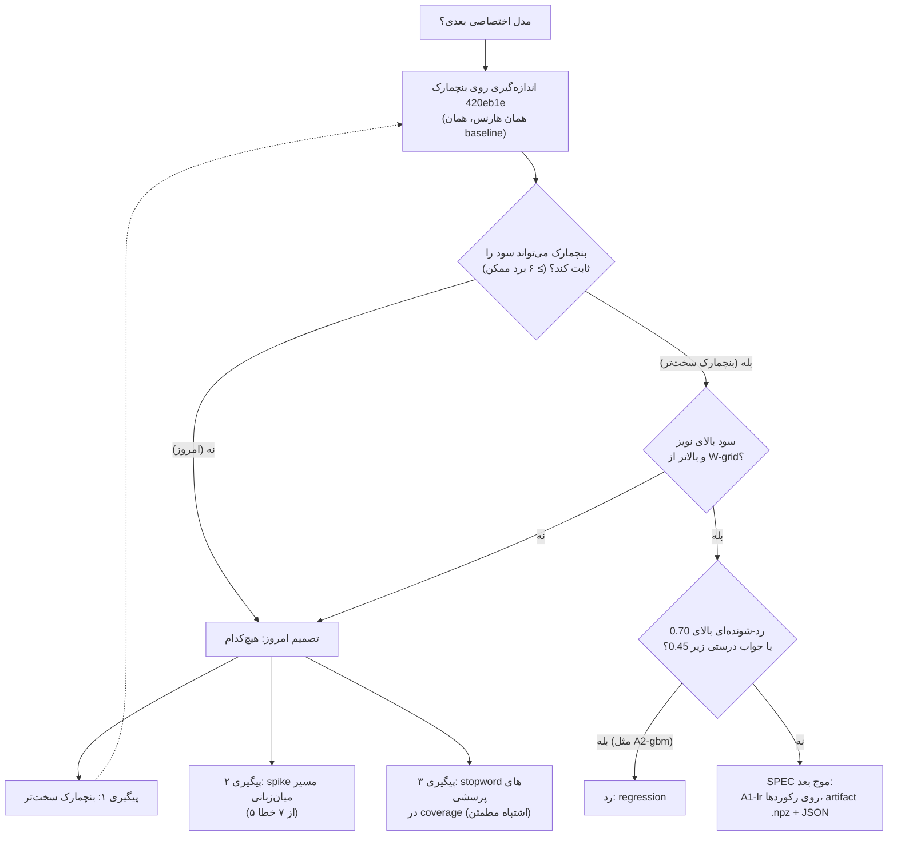

# SPIKE — مدل اختصاصی بعدی: reranker یادگرفته یا امبدینگ تطبیق‌یافته؟

**Status:** In Review
**Owner:** nextmodel-t1-res (Claude، عامل پژوهشگر) برای Sina
**Timebox:** یک نشست (۲ turn از Foreman: پژوهش، سپس اصلاح بعد از بازبینی منتقد)
**Date:** 2026-09-30
**Base:** `main` @ 3a4a415 · **بنچمارک:** `feat/eval-golden-set` @ 420eb1e (ادغام‌نشده)

> **پاسخ کوتاه: هیچ‌کدام.** روی بنچمارک Track 1، نه reranker یادگرفته (گزینهٔ a)
> و نه نسخه‌های CPU-پذیرِ تطبیق امبدینگ (گزینهٔ b) بیشتر از نویز از baseline
> جلو نمی‌زنند. بهترین نتیجه یک پرسش از ۴۸ است (+0.021 در recall@1، بازهٔ
> اطمینان ۹۵٪ [0.000, 0.062]، McNemar p=1.0). این بنچمارک حتی در اصل هم
> نمی‌توانست سودی کمتر از ۶ پرسش (0.125) را ثابت کند (یافتهٔ ۹). تنها اثر A1
> (پاسخ درستِ بیشتر بالای 0.70) را یک تنظیم دوبارهٔ وزن‌های دستی، بدون هیچ مدلی،
> هم می‌دهد (یافتهٔ ۶). اعداد در بخش ۵ است.

## 1. Question

کدام گام «مدل اختصاصی» روی بنچمارک بازیابی، سود اندازه‌گیری‌شدهٔ بزرگ‌تری می‌دهد؟

- **(a)** یک reranker یادگرفته (logistic regression یا یک مدل gradient-boosted کوچک)
  روی همان سیگنال‌های فعلی reranker، به‌جای وزن‌های دستی
  `app/services/rerank.py:34-37`؛
- **(b)** fine-tune یا distill کردن امبدینگ فارسی model2vec روی دادهٔ خود مشتری؛
- یا **هیچ‌کدام**.

زیرسؤال‌ها:
1. بعد از تغییر مقیاس امتیاز، آستانه‌های `TRUSTED_MATCH_THRESHOLD=0.70`
   (`app/config.py:41`) و `LOCAL_FALLBACK_THRESHOLD=0.45` (`app/config.py:46`)
   معنی‌دار می‌مانند؟
2. در یک نصب واقعی، دادهٔ آموزشی از کجا می‌آید و چه چیزی آموزش دوباره را شروع می‌کند؟

## 2. Why It Matters

درخواست «دانش‌بنیان» محصول رد شد، از جمله با دلیل «مدل اختصاصی ندارد» و
«wrapper روی سرویس‌های آماده است». یک تیم موازی طبقه‌بند intent فعلی را به
یک artifact نسخه‌دار تبدیل می‌کند. این spike تصمیم می‌گیرد مدل **بعدی** که
روی دادهٔ خود مشتری آموزش می‌بیند چه باشد، تا SPEC موج بعدی از روی آن نوشته شود.

قاعدهٔ حاکم: مدلِ بدتری که با اطمینان جواب می‌دهد یک regression است، نه یک feature.
هر عدد این سند با یک دستور که اجرا شده اندازه‌گیری شده است، یا صریحاً «برآورد» یا
«حساب از روی اعداد چاپ‌شده» برچسب خورده است.

## 3. Context

### خط لولهٔ فعلی (فقط بخشی که این سؤال به آن مربوط است)

| جزء | کجا | چه می‌کند |
|------|-----|-----------|
| retriever متراکم | `app/services/embeddings.py:100-133` | model2vec `potion-multilingual-128M` (snapshot پین‌شده، `embeddings.py:23-28`)، کسینوس خام ← کالیبره |
| کالیبراسیون | `embeddings.py:48-49`, `embeddings.py:88-89` | `(cos - 0.45) / 0.35` بریده به 0..1 (ADR-004) |
| retriever لغوی | `app/services/bm25.py:65-80` | BM25، نرمال‌شده نسبت به بهترین hit همان پرسش |
| reranker | `app/services/rerank.py:118-137` | `0.62·dense + 0.23·lexical + 0.15·coverage`، +0.04 اگر هر دو retriever یک سند را اول بدانند، ×0.5 اگر coverage صفر باشد |
| Tier 1 (رکوردها) | `app/services/search.py:712-737` | هر retriever ۵ نامزد روی هر دو شکل پرسش (`_dual_hits`، `search.py:51-73`)، بعد `rerank.best` روی متن رکوردها (`search.py:728`) |
| ترکیب ایندکس پرسش‌ها | `app/services/search.py:871-948` | **همان** `rerank.best` با **همان** وزن‌ها، روی پرسش‌های منتخب (`search.py:926`)؛ امتیاز نهایی `max(jaccard, rank_score)` (`search.py:933-934`) |
| گیت اعتماد | `app/routers/chat.py:979-980` | امتیاز ≥ 0.70 (از هر کدام از دو مسیر بالا) یعنی سرو بدون مدل پولی |
| مدل اختصاصی موجود | `app/services/intent.py:40-84` | logistic regression روی امبدینگ پرسش‌های منتخب، در هر reindex دوباره آموزش می‌بیند (`search.py:505-509`) |

پس فرمول دستی `rerank.py:125-134` در **دو** جا امتیاز می‌دهد: رتبه‌بندی رکوردها و
رتبه‌بندی پرسش‌های منتخب. یک reranker یادگرفته می‌تواند جای هر دو را بگیرد.

متن ایندکس‌شده برای retrieverهای رکورد فقط `title + text` فارسی است
(`search.py:441-442`). فیلدهای `title_en/text_en` وارد retrieval نمی‌شوند؛
یک پرسش انگلیسی فقط از راه چندزبانه بودن امبدینگ به سند فارسی می‌رسد.

### شاهد قبلی دربارهٔ گزینهٔ (b)

`docs/features/chat-training/RESEARCH.md:31-54` (2026-09-01، روی سرور GPU):
یک teacher چندزبانه fine-tune شد و به دو روش در model2vec distill شد. هر دو
به potion باختند: hit@1 برابر 0.875 در برابر 0.933 روی holdout ۱۲۰ پرسشی
(۷ پرسش از ۱۲۰). آن کورپوس ۸۰۹ رکورد داشت (۴۸ dataset + ۷۶۱ شرکت) و معیارش
hit@1 روی holdout خودش بود، نه هارنس Track 1. **همان جهت است، اما برای نویز
آزموده نشده (دادهٔ جفتی در سند نیست)، و معلوم نیست holdout از دادهٔ آموزش
teacher جدا بوده است** (teacher روی آن 1.0 گرفت). پس شاهد ضعیفی است، نه قطعی.
آن pipeline فقط روی سرور GPU است و این spike به آن دسترسی نداشت.

## 4. Investigation

### Evidence

- **بنچمارک:** `data/eval/golden.json` (۶۷ پرسش: ۴۸ پاسخ‌دار، ۱۹ رد-شونده) و
  `data/eval/corpus.json` (۲۵ رکورد، ۵۰ پرسش منتخب، ۶ مترادف) از commit 420eb1e.
  با `git show` در یک پوشهٔ scratch بیرون از repo کپی شد و commit نشد.
- **همان هارنس، همان baseline:** اسکریپت این spike حلقهٔ golden
  `scripts/run_eval.py` @ 420eb1e (خط‌های 634-760: ترتیب tierها، کف سرو 0.6
  در خط 673، قاعدهٔ «رتبهٔ ۱ اما تعویق‌شده = درست» در خط 713) و `full_ranking`
  (خط‌های 112-153) را کپی می‌کند. baseline آن **دقیقاً** با خروجی خود
  `run_eval.py` در 420eb1e روی همان کورپوس برابر است (پایین).
- **نبود torch:** در `.venv` بسته‌های `torch`، `transformers`،
  `sentence-transformers` و `tokenlearn` نصب نیستند. `import model2vec.distill`
  و `import model2vec.train` هر دو با `ImportError: torch is required` شکست
  می‌خورند (اجرا شد در 2026-09-30). پس distillation یا fine-tune واقعی روی این
  Mac ممکن نیست و نسخه‌های (b) این سند جایگزین‌های فقط-numpy هستند.
  نصب بسته ممنوع بود.
- **نشت (leakage):** هیچ پرسش golden در پرسش‌های منتخب کورپوس نیست، نه عیناً و
  نه بعد از نرمال‌سازی (`golden_in_curated=0` در خروجی). پرسش golden فقط در
  یک نسخه (A1-lr-cv) وارد آموزش شد و آنجا فقط foldهای کنار گذاشته‌شده سنجیده شدند.
- **دو محدودیت A1-lr-cv:** foldها یک تقسیم تصادفی ساده روی هر ۶۷ پرسش golden
  هستند، نه گروه‌بندی‌شده بر اساس رکورد؛ پس دو پارافریز یک رکورد می‌توانند یکی در
  آموزش و یکی در آزمون باشند. و پرسش‌های رد-شوندهٔ golden (حدود ۱۵ تا در هر fold
  آموزشی) به‌عنوان منفی آموزش می‌بینند. هر دو نتیجه را به سود A1-lr-cv کج
  می‌کنند؛ نتیجه با این حال صفر flip است، پس نتیجه‌گیری عوض نمی‌شود. اما این
  نسخه جانشین کامل «دادهٔ chat log» نیست.

### Experiments / Prototypes

اسکریپت: `scripts/experiments/own_model_next.py`. رفتار app را عوض نمی‌کند:
هر نامزد فقط با patch کردن global ماژول‌ها داخل همان process اعمال می‌شود، روی
یک SQLite دورریختنی. کد پژوهشی است و قرار نیست به production برود.

| نسخه | چه چیزی عوض شد | دادهٔ آموزش |
|------|----------------|-------------|
| `baseline` | هیچ؛ فرمول دستی فعلی | — |
| `A1-lr` | امتیاز rerank **فقط روی رتبه‌بندی رکوردها** = `P(درست)` از LogisticRegression (C=1، بدون class weight) | پرسش‌های منتخب + منفی‌های «رکورد حذف‌شده» |
| `A1-lr-q` | A1 روی رکوردها **و** یک LogisticRegression دوم روی رتبه‌بندی پرسش‌های منتخب | برای پرسش‌ها: leave-one-question-out + منفی‌های «همهٔ پرسش‌های رکورد حذف‌شده» |
| `A2-gbm` / `A2-gbm-q` | همان‌ها با HistGradientBoosting (عمق 3، ۱۰۰ درخت) | همان |
| `R1-platt` / `R1-platt-q` | **بدون وزن یادگرفته:** یک تبدیل یکنوا از امتیاز دستی فعلی (logistic یک‌متغیره، دو عدد). ترتیب را عوض نمی‌کند، فقط مقیاس را | همان ردیف‌ها |
| `W-grid` | **بدون مدل:** سه وزن دستی روی شبکهٔ 0.05 دوباره تنظیم شد، مثل محصول روی هر دو رتبه‌بندی | فقط پرسش‌های منتخب (بدون golden) |
| `A1-lr-cv` | A1، به‌علاوهٔ پرسش‌های golden در آموزش، 5-fold | همان + ۴/۵ golden؛ فقط fold کنارگذاشته سنجیده شد |
| `B1-idf` | امبدینگ model2vec با وزن IDF توکن‌ها روی متن همین کورپوس (روی همهٔ ایندکس‌ها و intent) | متن رکوردها و پرسش‌های منتخب |
| `B1-idf-cal` | B1، با کف کسینوس جابه‌جا شده تا میانهٔ کسینوس مثبت پرسش‌های منتخب همان مقدار کالیبره را بگیرد | همان |
| `B2-adapter` | نگاشت خطی ridge از بردار پرسش به بردار رکورد، فقط روی پرسش‌های ایندکس رکوردها | پرسش‌های منتخب؛ λ با leave-one-question-out |

ویژگی‌های (a) دقیقاً سیگنال‌های فعلی `rerank.py:121-134` هستند:
`dense`، `lexical`، `coverage`، `agreement` (هر دو retriever اول)، `coverage_zero`.
هیچ ویژگی تازه‌ای اضافه نشد، چون سؤال همین بود: «وزن یادگرفته به‌جای وزن دستی».

**منفی‌های «رکورد حذف‌شده»:** هر پرسش منتخب یک بار دیگر رتبه‌بندی شد، این بار با
رکورد درست خودش حذف‌شده از هر دو ایندکس (BM25 بدون آن رکورد دوباره ساخته شد تا
IDF و نرمال‌سازی‌اش واقعی باشد). همهٔ نامزدها برچسب 0 گرفتند. این به مدل
یاد می‌دهد «پایگاه دانش جواب ندارد» چه شکلی است، بدون دست بردن در golden.
حاصل برای رکوردها: ۷۴۲ ردیف، ۵۰ مثبت. برای پرسش‌ها: ۷۲۱ ردیف، ۳۹ مثبت (هر رکورد
فقط ۲ پرسش منتخب دارد، پس هر پرسش فقط یک «هم‌خانواده» دارد که مثبت شود).

**نویز:** برای هر نامزد در برابر baseline: پرسش‌هایی که عوض شدند (flip)،
آزمون دقیق McNemar روی hit@1، و bootstrap جفتی (B=10000، seed 20260930، یک
مولد تازه برای هر مقایسه) برای بازهٔ ۹۵٪ تغییر recall@1 و MRR. هر دو در سطح کل
pipeline و در سطح Tier 1 به‌تنهایی گزارش می‌شوند.

**دستور baseline از Track 1** (برای اثبات «همان هارنس»):

```bash
.venv/bin/python scripts/run_eval.py --golden data/eval/golden.json   # روی checkout از 420eb1e
```

خروجی (`totals`):

```text
queries 67  answerable 48  recall_at_1 0.854  recall_at_3 0.979  mrr 0.903
false_confident_unsupported 0  false_confident_legacy 0  false_confident_injection 0
legacy_contamination_answers 0  secret_leaks 0
```

**دستور آزمایش این spike:**

```bash
.venv/bin/python scripts/experiments/own_model_next.py \
    --golden <dir>/golden.json --out <dir>/own-model-next.json
```

`<dir>` یک کپی از `data/eval/` در commit 420eb1e است. خروجی واقعی کامل (فقط
خطوط هشدار sklearn و لاگ app حذف شده‌اند):

```text
corpus=<dir>/corpus.json entries=25 curated_questions=50 golden=67 golden_in_curated=0

== baseline
   {"answerable": 48, "deny": 19, "recall_at_1": 0.854, "recall_at_3": 0.979, "recall_at_5": 0.979, "recall_at_8": 0.979, "mrr": 0.903, "confident_wrong_answerable": 1, "served_correct_at_0.70": 19, "false_confident_at_0.70": 0, "deny_served_at_0.70_incl_legacy": 0, "deny_refused_by_unknown_gate": 18, "t1_recall_at_1": 0.833, "t1_recall_at_3": 0.979, "t1_mrr": 0.892, "t1_deny_above_0.70": 0, "t1_deny_above_0.45": 1, "t1_band_ge_0.70_correct_wrong": [18, 0], "t1_band_0.45_0.70_correct_wrong": [6, 1], "controls_served_at_0.70": {"paraphrase_above_trust": true, "benign_lookalike_answered": true}}

training rows, dataset ranking (curated + held-out-entry negatives): 742 positives=50
training rows, questions ranking (leave-one-question-out + held-out-entry negatives): 721 positives=39

== probe: questions index, shipped formula
   probe[baseline] «نمایشگاه کاوند کجا برگزار می شود؟» content_tokens=['برگزار', 'نمایشگاه', 'کاوند']
      faq-dates        0.9463 «نمایشگاه کاوند چه تاریخی برگزار می شود» {'dense': 0.8488, 'lexical': 1.0, 'coverage': 1.0}
      faq-workshops    0.6658 «کارگاه ها کجا برگزار می شوند» {'dense': 0.7834, 'lexical': 0.5657, 'coverage': 0.3333}
      faq-hours        0.3705 «نمایشگاه ساعت چند باز می شود» {'dense': 0.3365, 'lexical': 0.4867, 'coverage': 0.3333}

== A1-lr
   {"answerable": 48, "deny": 19, "recall_at_1": 0.854, "recall_at_3": 0.979, "recall_at_5": 0.979, "recall_at_8": 0.979, "mrr": 0.903, "confident_wrong_answerable": 1, "served_correct_at_0.70": 21, "false_confident_at_0.70": 0, "deny_served_at_0.70_incl_legacy": 0, "deny_refused_by_unknown_gate": 18, "t1_recall_at_1": 0.833, "t1_recall_at_3": 0.979, "t1_mrr": 0.892, "t1_deny_above_0.70": 0, "t1_deny_above_0.45": 1, "t1_band_ge_0.70_correct_wrong": [22, 0], "t1_band_0.45_0.70_correct_wrong": [3, 0], "controls_served_at_0.70": {"paraphrase_above_trust": true, "benign_lookalike_answered": true}, "train_rows": 742, "train_pos": 50, "coef": {"dense": 2.798, "lexical": 1.741, "coverage": 2.464, "agreement": 2.715, "coverage_zero": -0.743, "intercept": -5.856}, "applied_to": "dataset ranking only"}

== A1-lr-q
   {"answerable": 48, "deny": 19, "recall_at_1": 0.833, "recall_at_3": 0.979, "recall_at_5": 0.979, "recall_at_8": 0.979, "mrr": 0.892, "confident_wrong_answerable": 0, "served_correct_at_0.70": 20, "false_confident_at_0.70": 0, "deny_served_at_0.70_incl_legacy": 0, "deny_refused_by_unknown_gate": 18, "t1_recall_at_1": 0.833, "t1_recall_at_3": 0.979, "t1_mrr": 0.892, "t1_deny_above_0.70": 0, "t1_deny_above_0.45": 1, "t1_band_ge_0.70_correct_wrong": [22, 0], "t1_band_0.45_0.70_correct_wrong": [3, 0], "controls_served_at_0.70": {"paraphrase_above_trust": true, "benign_lookalike_answered": true}, "q_train_rows": 721, "q_train_pos": 39, "q_coef": {"dense": 1.911, "lexical": -0.471, "coverage": 0.576, "agreement": 0.315, "coverage_zero": -2.072, "intercept": -1.99}, "applied_to": "dataset AND questions ranking"}
   probe[A1-lr-q] «نمایشگاه کاوند کجا برگزار می شود؟» content_tokens=['برگزار', 'نمایشگاه', 'کاوند']
      faq-dates        0.5129 «نمایشگاه کاوند چه تاریخی برگزار می شود» {'dense': 0.8488096169063023, 'lexical': 1.0, 'coverage': 1.0, 'agreement': 1.0, 'coverage_zero': 0.0}
      faq-workshops    0.3618 «کارگاه ها کجا برگزار می شوند» {'dense': 0.7834413732801165, 'lexical': 0.5656590817907753, 'coverage': 0.3333333333333333, 'agreement': 0.0, 'coverage_zero': 0.0}
      faq-hours        0.2003 «نمایشگاه ساعت چند باز می شود» {'dense': 0.33645830835614887, 'lexical': 0.4866974420826256, 'coverage': 0.3333333333333333, 'agreement': 0.0, 'coverage_zero': 0.0}

== A2-gbm
   {"answerable": 48, "deny": 19, "recall_at_1": 0.854, "recall_at_3": 0.979, "recall_at_5": 0.979, "recall_at_8": 0.979, "mrr": 0.906, "confident_wrong_answerable": 1, "served_correct_at_0.70": 21, "false_confident_at_0.70": 0, "deny_served_at_0.70_incl_legacy": 0, "deny_refused_by_unknown_gate": 18, "t1_recall_at_1": 0.854, "t1_recall_at_3": 0.979, "t1_mrr": 0.906, "t1_deny_above_0.70": 1, "t1_deny_above_0.45": 1, "t1_band_ge_0.70_correct_wrong": [23, 1], "t1_band_0.45_0.70_correct_wrong": [1, 0], "controls_served_at_0.70": {"paraphrase_above_trust": true, "benign_lookalike_answered": true}, "applied_to": "dataset ranking only"}

== A2-gbm-q
   {"answerable": 48, "deny": 19, "recall_at_1": 0.854, "recall_at_3": 0.979, "recall_at_5": 0.979, "recall_at_8": 0.979, "mrr": 0.906, "confident_wrong_answerable": 1, "served_correct_at_0.70": 21, "false_confident_at_0.70": 0, "deny_served_at_0.70_incl_legacy": 0, "deny_refused_by_unknown_gate": 18, "t1_recall_at_1": 0.854, "t1_recall_at_3": 0.979, "t1_mrr": 0.906, "t1_deny_above_0.70": 1, "t1_deny_above_0.45": 1, "t1_band_ge_0.70_correct_wrong": [23, 1], "t1_band_0.45_0.70_correct_wrong": [1, 0], "controls_served_at_0.70": {"paraphrase_above_trust": true, "benign_lookalike_answered": true}, "applied_to": "dataset AND questions ranking"}
   probe[A2-gbm-q] «نمایشگاه کاوند کجا برگزار می شود؟» content_tokens=['برگزار', 'نمایشگاه', 'کاوند']
      faq-workshops    0.9209 «کارگاه ها کجا برگزار می شوند» {'dense': 0.7834413732801165, 'lexical': 0.5656590817907753, 'coverage': 0.3333333333333333, 'agreement': 0.0, 'coverage_zero': 0.0}
      faq-hours        0.7664 «نمایشگاه ساعت چند باز می شود» {'dense': 0.33645830835614887, 'lexical': 0.4866974420826256, 'coverage': 0.3333333333333333, 'agreement': 0.0, 'coverage_zero': 0.0}
      faq-dates        0.7355 «نمایشگاه کاوند چه تاریخی برگزار می شود» {'dense': 0.8488096169063023, 'lexical': 1.0, 'coverage': 1.0, 'agreement': 1.0, 'coverage_zero': 0.0}

== R1-platt
   {"answerable": 48, "deny": 19, "recall_at_1": 0.854, "recall_at_3": 0.979, "recall_at_5": 0.979, "recall_at_8": 0.979, "mrr": 0.903, "confident_wrong_answerable": 1, "served_correct_at_0.70": 18, "false_confident_at_0.70": 0, "deny_served_at_0.70_incl_legacy": 0, "deny_refused_by_unknown_gate": 18, "t1_recall_at_1": 0.833, "t1_recall_at_3": 0.979, "t1_mrr": 0.892, "t1_deny_above_0.70": 0, "t1_deny_above_0.45": 1, "t1_band_ge_0.70_correct_wrong": [17, 0], "t1_band_0.45_0.70_correct_wrong": [4, 0], "controls_served_at_0.70": {"paraphrase_above_trust": true, "benign_lookalike_answered": true}, "slope": 7.181, "intercept": -4.44, "applied_to": "dataset ranking only"}

== R1-platt-q
   {"answerable": 48, "deny": 19, "recall_at_1": 0.833, "recall_at_3": 0.979, "recall_at_5": 0.979, "recall_at_8": 0.979, "mrr": 0.892, "confident_wrong_answerable": 0, "served_correct_at_0.70": 15, "false_confident_at_0.70": 0, "deny_served_at_0.70_incl_legacy": 0, "deny_refused_by_unknown_gate": 18, "t1_recall_at_1": 0.833, "t1_recall_at_3": 0.979, "t1_mrr": 0.892, "t1_deny_above_0.70": 0, "t1_deny_above_0.45": 1, "t1_band_ge_0.70_correct_wrong": [17, 0], "t1_band_0.45_0.70_correct_wrong": [4, 0], "controls_served_at_0.70": {"paraphrase_above_trust": true, "benign_lookalike_answered": true}, "applied_to": "dataset AND questions ranking"}

== W-grid
   {"answerable": 48, "deny": 19, "recall_at_1": 0.854, "recall_at_3": 0.979, "recall_at_5": 0.979, "recall_at_8": 0.979, "mrr": 0.903, "confident_wrong_answerable": 1, "served_correct_at_0.70": 21, "false_confident_at_0.70": 0, "deny_served_at_0.70_incl_legacy": 0, "deny_refused_by_unknown_gate": 18, "t1_recall_at_1": 0.833, "t1_recall_at_3": 0.979, "t1_mrr": 0.892, "t1_deny_above_0.70": 0, "t1_deny_above_0.45": 2, "t1_band_ge_0.70_correct_wrong": [20, 0], "t1_band_0.45_0.70_correct_wrong": [8, 1], "controls_served_at_0.70": {"paraphrase_above_trust": true, "benign_lookalike_answered": true}, "weights_dense_lexical_coverage": [0.45, 0.3, 0.25], "selection_on_curated": {"chosen": {"curated_hits": 49, "heldout_top_above_0.70": 0, "curated_right_above_0.70": 29}, "shipped": {"curated_hits": 49, "heldout_top_above_0.70": 0, "curated_right_above_0.70": 24}}, "applied_to": "both rankings (module weights, as the product reads them)"}

== A1-lr-cv
   {"answerable": 48, "deny": 19, "recall_at_1": 0.854, "recall_at_3": 0.979, "recall_at_5": 0.979, "recall_at_8": 0.979, "mrr": 0.906, "confident_wrong_answerable": 1, "served_correct_at_0.70": 20, "false_confident_at_0.70": 0, "deny_served_at_0.70_incl_legacy": 0, "deny_refused_by_unknown_gate": 18, "t1_recall_at_1": 0.833, "t1_recall_at_3": 0.979, "t1_mrr": 0.896, "t1_deny_above_0.70": 0, "t1_deny_above_0.45": 0, "t1_band_ge_0.70_correct_wrong": [21, 0], "t1_band_0.45_0.70_correct_wrong": [2, 0], "controls_served_at_0.70": {"paraphrase_above_trust": true, "benign_lookalike_answered": true}, "kfold": 5, "note": "held-out folds only"}

== B1-idf
   {"answerable": 48, "deny": 19, "recall_at_1": 0.875, "recall_at_3": 0.979, "recall_at_5": 0.979, "recall_at_8": 0.979, "mrr": 0.91, "confident_wrong_answerable": 0, "served_correct_at_0.70": 19, "false_confident_at_0.70": 0, "deny_served_at_0.70_incl_legacy": 0, "deny_refused_by_unknown_gate": 18, "t1_recall_at_1": 0.854, "t1_recall_at_3": 0.979, "t1_mrr": 0.899, "t1_deny_above_0.70": 0, "t1_deny_above_0.45": 0, "t1_band_ge_0.70_correct_wrong": [17, 0], "t1_band_0.45_0.70_correct_wrong": [5, 0], "controls_served_at_0.70": {"paraphrase_above_trust": true, "benign_lookalike_answered": true}}

== B1-idf-cal
   {"answerable": 48, "deny": 19, "recall_at_1": 0.875, "recall_at_3": 0.979, "recall_at_5": 0.979, "recall_at_8": 0.979, "mrr": 0.913, "confident_wrong_answerable": 1, "served_correct_at_0.70": 20, "false_confident_at_0.70": 0, "deny_served_at_0.70_incl_legacy": 0, "deny_refused_by_unknown_gate": 18, "t1_recall_at_1": 0.854, "t1_recall_at_3": 0.979, "t1_mrr": 0.903, "t1_deny_above_0.70": 0, "t1_deny_above_0.45": 0, "t1_band_ge_0.70_correct_wrong": [19, 0], "t1_band_0.45_0.70_correct_wrong": [4, 0], "controls_served_at_0.70": {"paraphrase_above_trust": true, "benign_lookalike_answered": true}, "cosine_floor": 0.4273, "median_pos_cos_base": 0.6228, "median_pos_cos_idf": 0.6001}

== B2-adapter
   {"answerable": 48, "deny": 19, "recall_at_1": 0.854, "recall_at_3": 0.979, "recall_at_5": 0.979, "recall_at_8": 0.979, "mrr": 0.903, "confident_wrong_answerable": 1, "served_correct_at_0.70": 19, "false_confident_at_0.70": 0, "deny_served_at_0.70_incl_legacy": 0, "deny_refused_by_unknown_gate": 18, "t1_recall_at_1": 0.833, "t1_recall_at_3": 0.979, "t1_mrr": 0.892, "t1_deny_above_0.70": 0, "t1_deny_above_0.45": 1, "t1_band_ge_0.70_correct_wrong": [18, 0], "t1_band_0.45_0.70_correct_wrong": [6, 1], "controls_served_at_0.70": {"paraphrase_above_trust": true, "benign_lookalike_answered": true}, "lambda": 300.0, "loqo_hit1_by_lambda": {"0.3": 0.82, "1.0": 0.86, "3.0": 0.94, "10.0": 0.94, "30.0": 0.98, "100.0": 0.98, "300.0": 0.98}, "loqo_hit1_shipped_embedding": 0.98}

== paired vs baseline (answerable n=48, bootstrap B=10000, seed=20260930)
-- A1-lr
   pipeline d_r@1=+0.000 ci95=[0.0, 0.0] d_mrr=+0.000 ci95=[0.0, 0.0] gained=0 lost=0 mcnemar_p=1.0
   tier1    d_r@1=+0.000 ci95=[0.0, 0.0] d_mrr=+0.000 ci95=[0.0, 0.0] gained=0 lost=0 mcnemar_p=1.0
   deny newly confident (pipeline): []
   deny newly above 0.70 (tier1):   []
   deny no longer above 0.70 (tier1): []
   right answer fell below 0.45 at tier1: «کاوند چه روزهایی برگزار می شود؟» 0.5009 -> 0.141
   served changed: «چطور به صورت آنلاین ثبت نام کنم؟» T1-questions faq-registration 0.965 -> T1 faq-registration 0.8586
   served changed: «با مترو چطور به نمایشگاه بیایم؟» T1-questions faq-transport 0.99 -> T1 faq-transport 0.797
   served changed: «نمایشگاه کاوند چیه؟» none None 0.42 -> T1 faq-overview 0.7434
   right answer fell below 0.45 at tier1: «قیمت غرفه چنده؟» 0.5459 -> 0.1046
-- A1-lr-q
   pipeline d_r@1=-0.021 ci95=[-0.062, 0.0] d_mrr=-0.010 ci95=[-0.031, 0.0] gained=0 lost=1 mcnemar_p=1.0
      - تا چه ساعتی بازه؟
   tier1    d_r@1=+0.000 ci95=[0.0, 0.0] d_mrr=+0.000 ci95=[0.0, 0.0] gained=0 lost=0 mcnemar_p=1.0
   deny newly confident (pipeline): []
   deny newly above 0.70 (tier1):   []
   deny no longer above 0.70 (tier1): []
   right answer fell below 0.45 at tier1: «کاوند چه روزهایی برگزار می شود؟» 0.5009 -> 0.141
   served changed: «نمایشگاه کاوند کجا برگزار می شود؟» T1-questions faq-dates 0.9463 -> none None 0.2745
   served changed: «چطور به صورت آنلاین ثبت نام کنم؟» T1-questions faq-registration 0.965 -> T1 faq-registration 0.8586
   served changed: «با مترو چطور به نمایشگاه بیایم؟» T1-questions faq-transport 0.99 -> T1 faq-transport 0.797
   served changed: «نمایشگاه کاوند چیه؟» none None 0.42 -> T1 faq-overview 0.7434
   right answer fell below 0.45 at tier1: «قیمت غرفه چنده؟» 0.5459 -> 0.1046
   served changed: «تا چه ساعتی بازه؟» T1-questions faq-hours 0.9141 -> none None 0.0358
-- A2-gbm
   pipeline d_r@1=+0.000 ci95=[0.0, 0.0] d_mrr=+0.003 ci95=[0.0, 0.01] gained=0 lost=0 mcnemar_p=1.0
   tier1    d_r@1=+0.021 ci95=[0.0, 0.062] d_mrr=+0.014 ci95=[0.0, 0.038] gained=1 lost=0 mcnemar_p=1.0
      + تا چه ساعتی بازه؟
   deny newly confident (pipeline): []
   deny newly above 0.70 (tier1):   ['نمایشگاه آبگینه کی برگزار می شد؟']
   deny no longer above 0.70 (tier1): []
   served changed: «کاوند چه روزهایی برگزار می شود؟» none None 0.5009 -> T1 faq-dates 0.6263
   served changed: «نمایشگاه کاوند کجا برگزار می شود؟» T1-questions faq-dates 0.9463 -> T1 faq-dates 0.9712
   served changed: «چطور به صورت آنلاین ثبت نام کنم؟» T1-questions faq-registration 0.965 -> T1 faq-registration 0.9603
   served changed: «با مترو چطور به نمایشگاه بیایم؟» T1-questions faq-transport 0.99 -> T1 faq-transport 0.8006
   served changed: «نمایشگاه کاوند چیه؟» none None 0.42 -> T1 faq-overview 0.9647
   right answer fell below 0.45 at tier1: «قیمت غرفه چنده؟» 0.5459 -> 0.2335
   deny tier1 crossed 0.70: «نمایشگاه آبگینه کی برگزار می شد؟» 0.6415 -> 0.7088
-- A2-gbm-q
   pipeline d_r@1=+0.000 ci95=[0.0, 0.0] d_mrr=+0.003 ci95=[0.0, 0.01] gained=0 lost=0 mcnemar_p=1.0
   tier1    d_r@1=+0.021 ci95=[0.0, 0.062] d_mrr=+0.014 ci95=[0.0, 0.038] gained=1 lost=0 mcnemar_p=1.0
      + تا چه ساعتی بازه؟
   deny newly confident (pipeline): []
   deny newly above 0.70 (tier1):   ['نمایشگاه آبگینه کی برگزار می شد؟']
   deny no longer above 0.70 (tier1): []
   served changed: «کاوند چه روزهایی برگزار می شود؟» none None 0.5009 -> T1 faq-dates 0.6263
   served changed: «نمایشگاه کاوند کجا برگزار می شود؟» T1-questions faq-dates 0.9463 -> T1 faq-dates 0.9712
   served changed: «چطور به صورت آنلاین ثبت نام کنم؟» T1-questions faq-registration 0.965 -> T1 faq-registration 0.9603
   served changed: «با مترو چطور به نمایشگاه بیایم؟» T1-questions faq-transport 0.99 -> T1 faq-transport 0.8006
   served changed: «نمایشگاه کاوند چیه؟» none None 0.42 -> T1 faq-overview 0.9647
   right answer fell below 0.45 at tier1: «قیمت غرفه چنده؟» 0.5459 -> 0.2335
   deny tier1 crossed 0.70: «نمایشگاه آبگینه کی برگزار می شد؟» 0.6415 -> 0.7088
-- R1-platt
   pipeline d_r@1=+0.000 ci95=[0.0, 0.0] d_mrr=+0.000 ci95=[0.0, 0.0] gained=0 lost=0 mcnemar_p=1.0
   tier1    d_r@1=+0.000 ci95=[0.0, 0.0] d_mrr=+0.000 ci95=[0.0, 0.0] gained=0 lost=0 mcnemar_p=1.0
   deny newly confident (pipeline): []
   deny newly above 0.70 (tier1):   []
   deny no longer above 0.70 (tier1): []
   right answer fell below 0.45 at tier1: «کاوند چه روزهایی برگزار می شود؟» 0.5009 -> 0.3008
   served changed: «محوطه غذاخوری کجا قرار دارد؟» T1 faq-food 0.6556 -> none None 0.5665
   right answer fell below 0.45 at tier1: «چطور داوطلب همکاری شوم؟» 0.5218 -> 0.3334
   right answer fell below 0.45 at tier1: «قیمت غرفه چنده؟» 0.5459 -> 0.3728
-- R1-platt-q
   pipeline d_r@1=-0.021 ci95=[-0.062, 0.0] d_mrr=-0.010 ci95=[-0.031, 0.0] gained=0 lost=1 mcnemar_p=1.0
      - تا چه ساعتی بازه؟
   tier1    d_r@1=+0.000 ci95=[0.0, 0.0] d_mrr=+0.000 ci95=[0.0, 0.0] gained=0 lost=0 mcnemar_p=1.0
   deny newly confident (pipeline): []
   deny newly above 0.70 (tier1):   []
   deny no longer above 0.70 (tier1): []
   right answer fell below 0.45 at tier1: «کاوند چه روزهایی برگزار می شود؟» 0.5009 -> 0.3008
   served changed: «نمایشگاه کاوند کجا برگزار می شود؟» T1-questions faq-dates 0.9463 -> none None 0.378
   served changed: «چطور به صورت آنلاین ثبت نام کنم؟» T1-questions faq-registration 0.965 -> T1 faq-registration 0.614
   served changed: «با مترو چطور به نمایشگاه بیایم؟» T1-questions faq-transport 0.99 -> none None 0.5017
   served changed: «محوطه غذاخوری کجا قرار دارد؟» T1 faq-food 0.6556 -> none None 0.5665
   right answer fell below 0.45 at tier1: «چطور داوطلب همکاری شوم؟» 0.5218 -> 0.3334
   right answer fell below 0.45 at tier1: «قیمت غرفه چنده؟» 0.5459 -> 0.3728
   served changed: «تا چه ساعتی بازه؟» T1-questions faq-hours 0.9141 -> none None 0.0809
-- W-grid
   pipeline d_r@1=+0.000 ci95=[0.0, 0.0] d_mrr=+0.000 ci95=[0.0, 0.0] gained=0 lost=0 mcnemar_p=1.0
   tier1    d_r@1=+0.000 ci95=[0.0, 0.0] d_mrr=+0.000 ci95=[0.0, 0.0] gained=0 lost=0 mcnemar_p=1.0
   deny newly confident (pipeline): []
   deny newly above 0.70 (tier1):   []
   deny no longer above 0.70 (tier1): []
   served changed: «چطور به صورت آنلاین ثبت نام کنم؟» T1-questions faq-registration 0.965 -> T1 faq-registration 0.7456
   served changed: «نمایشگاه کاوند چیه؟» none None 0.42 -> T1-questions faq-overview 0.7266
-- A1-lr-cv
   pipeline d_r@1=+0.000 ci95=[0.0, 0.0] d_mrr=+0.003 ci95=[0.0, 0.01] gained=0 lost=0 mcnemar_p=1.0
   tier1    d_r@1=+0.000 ci95=[0.0, 0.0] d_mrr=+0.003 ci95=[0.0, 0.01] gained=0 lost=0 mcnemar_p=1.0
   deny newly confident (pipeline): []
   deny newly above 0.70 (tier1):   []
   deny no longer above 0.70 (tier1): []
   right answer fell below 0.45 at tier1: «کاوند چه روزهایی برگزار می شود؟» 0.5009 -> 0.1499
   served changed: «چطور به صورت آنلاین ثبت نام کنم؟» T1-questions faq-registration 0.965 -> T1 faq-registration 0.8805
   served changed: «با مترو چطور به نمایشگاه بیایم؟» T1-questions faq-transport 0.99 -> T1 faq-transport 0.8181
   served changed: «نمایشگاه کاوند چیه؟» none None 0.42 -> T1 faq-overview 0.6651
   right answer fell below 0.45 at tier1: «قیمت غرفه چنده؟» 0.5459 -> 0.1358
-- B1-idf
   pipeline d_r@1=+0.021 ci95=[0.0, 0.062] d_mrr=+0.007 ci95=[-0.014, 0.038] gained=1 lost=0 mcnemar_p=1.0
      + Where is the venue?
   tier1    d_r@1=+0.021 ci95=[0.0, 0.062] d_mrr=+0.007 ci95=[-0.014, 0.038] gained=1 lost=0 mcnemar_p=1.0
      + Where is the venue?
   deny newly confident (pipeline): []
   deny newly above 0.70 (tier1):   []
   deny no longer above 0.70 (tier1): []
   right answer fell below 0.45 at tier1: «کاوند چه روزهایی برگزار می شود؟» 0.5009 -> 0.4369
   served changed: «نمایشگاه کاوند کجا برگزار می شود؟» T1-questions faq-dates 0.9463 -> none None 0.38
   served changed: «چه شرکت هایی می توانند غرفه بگیرند؟» T1 faq-exhibitor-criteria 0.7612 -> T1-questions faq-exhibitor-criteria 0.7923
   right answer fell below 0.45 at tier1: «قیمت غرفه چنده؟» 0.5459 -> 0.3756
-- B1-idf-cal
   pipeline d_r@1=+0.021 ci95=[0.0, 0.062] d_mrr=+0.010 ci95=[-0.014, 0.045] gained=1 lost=0 mcnemar_p=1.0
      + Where is the venue?
   tier1    d_r@1=+0.021 ci95=[0.0, 0.062] d_mrr=+0.010 ci95=[-0.014, 0.045] gained=1 lost=0 mcnemar_p=1.0
      + Where is the venue?
   deny newly confident (pipeline): []
   deny newly above 0.70 (tier1):   []
   deny no longer above 0.70 (tier1): []
   right answer fell below 0.45 at tier1: «قیمت غرفه چنده؟» 0.5459 -> 0.4158
-- B2-adapter
   pipeline d_r@1=+0.000 ci95=[0.0, 0.0] d_mrr=+0.000 ci95=[0.0, 0.0] gained=0 lost=0 mcnemar_p=1.0
   tier1    d_r@1=+0.000 ci95=[0.0, 0.0] d_mrr=+0.000 ci95=[0.0, 0.0] gained=0 lost=0 mcnemar_p=1.0
   deny newly confident (pipeline): []
   deny newly above 0.70 (tier1):   []
   deny no longer above 0.70 (tier1): []

== detectable gain: exact McNemar needs >= 6 wins and 0 losses (p=0.0312) = 0.125 recall@1 on n=48; 5 wins and 0 losses gives p=0.0625

report: <dir>/own-model-next.json
```

خروجی کامل هر پرسش در فایل `--out` است. نسخهٔ turn 1 این اسکریپت دو بار اجرا
شد و خروجی متنی هر دو یکسان بود (seed ثابت). نسخهٔ turn 2 (همین خروجی) بازهٔ
bootstrap را با یک مولد تازه برای هر مقایسه می‌سازد؛ برای همین بازهٔ MRR نسخهٔ
B1-idf از [-0.014, 0.042] به [-0.014, 0.038] رفت. B2-adapter هم عوض شد، چون
شبکهٔ λ گسترش یافت و λ = 300 جای 30 را گرفت: امتیاز ۳۶ پرسش جابه‌جا شد و جواب
درستِ بالای 0.70 در Tier 1 از ۲۰ به ۱۸ رسید. نتیجهٔ recall و flip آن تغییر نکرد
(۰ flip). اعداد A1-lr، A2-gbm و B1-idf عوض نشدند.

### Constraints Discovered

- **بدون torch، (b) واقعی ممکن نیست.** نسخه‌های B1/B2 فقط تطبیق خطی و وزن‌دهی
  توکن هستند. آزمون واقعی (b) همان نتیجهٔ GPU در `chat-training` است.
- **سقف بنچمارک کوچک است.** baseline فقط ۷ پرسش از ۴۸ را غلط دارد (یافتهٔ ۳)،
  و کوچک‌ترین سودی که آزمون جفتی این سند می‌تواند ثابت کند ۶ پرسش است (یافتهٔ ۹).
- **هارنس «تعویق درست» را برابر «سرو درست» می‌شمارد**
  (`run_eval.py` @ 420eb1e خط 713). پس اثر کالیبراسیون (سرو بیشتر بالای 0.70
  به‌جای ارجاع به tier پولی) در recall@1 دیده نمی‌شود. اسکریپت آن را جدا
  می‌شمارد (`served_correct_at_0.70`).
- **گیت توکن ناشناخته ۱۸ از ۱۹ پرسش رد-شونده را قبل از هر reranker رد می‌کند**
  (`deny_refused_by_unknown_gate: 18` در همهٔ نسخه‌ها). پس در سطح pipeline،
  reranker فقط روی **یک** پرسش رد-شونده آزموده می‌شود. آزمون واقعی ایمنی
  ستون‌های `t1_deny_above_*` هستند که گیت را دور می‌زنند.
- **امنیت:** مرز اعتماد تازه‌ای نیست. هیچ endpoint، ستون یا ورودی کاربر تازه‌ای
  در کار نیست. اگر روزی مدل یادگرفته از `chat_logs` آموزش ببیند، دادهٔ آموزش از
  متن بازدیدکننده می‌آید و مسمومیت داده (یک نفر در کیوسک ده بار یک پرسش را به
  رکورد غلط ببرد) یک ریسک واقعی است. بخش ۸.

## 5. Findings

**یافتهٔ ۱: baseline بازتولید شد.** هارنس این spike روی همان کورپوس دقیقاً همان
اعداد `run_eval.py` در 420eb1e را می‌دهد: recall@1 0.854، recall@3 0.979،
MRR 0.903، false-confident 0. پس مقایسه‌ها روی یک خط‌کش هستند.

**یافتهٔ ۲: هیچ نامزدی از نویز بیرون نمی‌زند.**

| نسخه | recall@1 | recall@3 | MRR | اشتباه مطمئن (پاسخ‌دار) | سرو درست ≥0.70 | Δrecall@1 (CI95) | flip (+/−) | McNemar p |
|------|----------|----------|-----|------|------|------------------|-----------|-----------|
| baseline | 0.854 | 0.979 | 0.903 | 1 | 19 | — | — | — |
| A1-lr | 0.854 | 0.979 | 0.903 | 1 | 21 | +0.000 [0.000, 0.000] | 0/0 | 1.0 |
| A1-lr-q | 0.833 | 0.979 | 0.892 | 0 | 20 | −0.021 [−0.062, 0.000] | 0/1 | 1.0 |
| A2-gbm | 0.854 | 0.979 | 0.906 | 1 | 21 | +0.000 [0.000, 0.000] | 0/0 | 1.0 |
| A2-gbm-q | 0.854 | 0.979 | 0.906 | 1 | 21 | +0.000 [0.000, 0.000] | 0/0 | 1.0 |
| R1-platt | 0.854 | 0.979 | 0.903 | 1 | 18 | +0.000 [0.000, 0.000] | 0/0 | 1.0 |
| R1-platt-q | 0.833 | 0.979 | 0.892 | 0 | 15 | −0.021 [−0.062, 0.000] | 0/1 | 1.0 |
| W-grid | 0.854 | 0.979 | 0.903 | 1 | 21 | +0.000 [0.000, 0.000] | 0/0 | 1.0 |
| A1-lr-cv (k=5) | 0.854 | 0.979 | 0.906 | 1 | 20 | +0.000 [0.000, 0.000] | 0/0 | 1.0 |
| B1-idf | 0.875 | 0.979 | 0.910 | 0 | 19 | +0.021 [0.000, 0.062] | 1/0 | 1.0 |
| B1-idf-cal | 0.875 | 0.979 | 0.913 | 1 | 20 | +0.021 [0.000, 0.062] | 1/0 | 1.0 |
| B2-adapter | 0.854 | 0.979 | 0.903 | 1 | 19 | +0.000 [0.000, 0.000] | 0/0 | 1.0 |

(سطح کل pipeline. «سرو درست ≥0.70» = پاسخ درستی که بدون tier پولی سرو شد؛
recall@1 هارنس تعویقِ درست را هم درست می‌شمارد. recall@5 و recall@8 در همهٔ
نسخه‌ها 0.979 است، پس سقف tier انتخاب (`ANSWER_TOPK=8`) تغییری نکرد. هر دو
پرسش کنترل golden، `paraphrase_above_trust` و `benign_lookalike_answered`، در
همهٔ نسخه‌ها درست و بالای 0.70 سرو شدند.)

در همهٔ نسخه‌ها هیچ پرسش رد-شونده‌ای (unsupported، prompt_injection یا legacy) در
کل pipeline بالای 0.70 سرو نشد. **اما این ستون ایمنی را نمی‌آزماید:** گیت توکن
ناشناخته ۱۸ از ۱۹ پرسش رد-شونده را پیش از هر reranker رد می‌کند
(`deny_refused_by_unknown_gate: 18`). آزمون معنادار ستون `t1_deny_above_0.70`
است (Tier 1 بدون گیت): 0 برای همه، **جز A2-gbm و A2-gbm-q که 1 است** (یافتهٔ ۵).

بهترین نسخه، B1-idf، یک پرسش («Where is the venue?») را درست کرد و هیچ پرسشی
را خراب نکرد. بازهٔ bootstrap صفر را در بر دارد و McNemar روی ۱ flip ناچار
p=1.0 است. این سود با این بنچمارک از شانس قابل تشخیص نیست.

**یافتهٔ ۳: ۷ خطای baseline کجا هستند.**

| پرسش | اتفاق | tier مسئول |
|------|-------|-----------|
| When does the fair take place? | امتیاز Tier 1 = 0.0، نامزد اول غلط | retriever متراکم |
| Where is the venue? | همان | retriever متراکم |
| How much is a visitor ticket? | همان | retriever متراکم |
| How many halls are there? | همان | retriever متراکم |
| How do I book a booth? | همان | retriever متراکم |
| نمایشگاه کی شروع میشه؟ | گیت توکن ناشناخته پرسش را بست | `search.unknown_salient_tokens` |
| نمایشگاه کاوند کجا برگزار می شود؟ | faq-dates با 0.946 سرو شد (غلط، مطمئن) | ترکیب ایندکس پرسش‌ها: **همان فرمول دستی `rerank.best`** (`search.py:926`) |

پنج پرسش انگلیسی: کسینوس خام زیر کف 0.45 است، پس `dense` کالیبره 0 است
(`embeddings.py:88-89`)؛ `lexical` و `coverage` هم 0 هستند چون متن ایندکس فارسی
است (`search.py:442`). همهٔ پنج ویژگی reranker برای همهٔ نامزدها صفر است و
ترتیب فقط از tie-break رتبهٔ dense می‌آید (`rerank.py:143-146`). **هیچ
وزن‌دهی، دستی یا یادگرفته، روی این پنج ویژگی نمی‌تواند این پنج را جابه‌جا کند.**
پرسش «کی شروع میشه» پیش از هر reranker رد می‌شود.

**تنها خطایی که (a) می‌تواند به آن برسد، اشتباه مطمئن ردیف آخر است.** امتیاز 0.946
را خود فرمول دستی روی ایندکس پرسش‌ها می‌دهد، همان فرمولی که (a) جایگزین می‌کند.
در turn 1، (a) فقط روی رتبه‌بندی رکوردها اعمال شده بود و این سند به غلط گفته بود
این خطا در tier دیگری است. در turn 2 این مسیر هم patch شد (یافتهٔ ۴) و خروجی
probe نشان می‌دهد چرا وزن‌دهی آن را درست نمی‌کند:

```text
probe[baseline] «نمایشگاه کاوند کجا برگزار می شود؟» content_tokens=['برگزار', 'نمایشگاه', 'کاوند']
   faq-dates        0.9463 «نمایشگاه کاوند چه تاریخی برگزار می شود» {'dense': 0.8488, 'lexical': 1.0, 'coverage': 1.0}
   faq-workshops    0.6658 «کارگاه ها کجا برگزار می شوند» {'dense': 0.7834, 'lexical': 0.5657, 'coverage': 0.3333}
```

«کجا» و «شود» در `STOPWORDS` هستند (`rerank.py:43-44`)، پس تنها کلمه‌ای که «کجا»
را از «کی» جدا می‌کند در coverage شمرده نمی‌شود. پرسش منتخب faq-dates در
**هر سه** سیگنال پیوسته (dense، lexical، coverage) و در agreement بالاتر از هر
نامزد دیگر است. پس هر ترکیب خطی با ضریب‌های مثبت همین را اول می‌گذارد؛ یک مدل
خطی با ضریب‌های مثبت فقط می‌تواند امتیازش را پایین بیاورد، نه ترتیب را عوض کند
(A1-lr-q یک ضریب منفی برای `lexical` یاد گرفت، −0.471، اما در probe بالا ترتیب
همان ماند و faq-dates باز اول بود). این یک مشکل ویژگی
(stopword) است، نه مشکل وزن. پس سقف واقعی (a) روی این بنچمارک: **۵ خطا دور از
دسترس هر وزن‌دهی، ۱ خطا پیش از reranker، و ۱ اشتباه مطمئن که فقط با پایین آوردن
امتیاز (تعویق) قابل حذف است، نه با درست کردن جواب.**

**یافتهٔ ۴: وصل کردن (a) به ایندکس پرسش‌ها (A1-lr-q) اشتباه مطمئن را حذف می‌کند،
اما چون کل آن tier را خاموش می‌کند.**

- اشتباه مطمئن: 1 ← 0. پرسش «کجا» دیگر سرو نمی‌شود (`none`، 0.2745). اما جواب
  درست هم نمی‌گیرد: از «اشتباه» به «تعویق» رفت، نه به «درست».
- در عوض «تا چه ساعتی بازه؟» که baseline درست از ایندکس پرسش‌ها با 0.914 سرو
  می‌کرد، دیگر سرو نمی‌شود و رتبهٔ ۱ هم نیست: recall@1 0.854 ← 0.833 (−۱ پرسش).
- ریشه (حساب از روی ضریب‌های چاپ‌شدهٔ `q_coef`، نه اندازه‌گیری جدا):
  `lexical` ضریب منفی دارد (−0.471). بیشترین مقدار ممکن تابع خطی با همهٔ
  ویژگی‌های مثبت در بیشینه و `lexical=0` برابر است با
  1.911 + 0.576 + 0.315 − 1.99 = 0.812، و sigmoid(0.812) = 0.693. یعنی این مدل
  **هرگز** به 0.70 نمی‌رسد. مسیر ایندکس پرسش‌ها فقط وقتی سرو می‌کند که Jaccard
  خودش ≥ 0.70 باشد. شمارش از فایل `--out` (پایین): سرو از tier `T1-questions`
  در baseline ۴ بار، در A1-lr-q صفر بار.
- چرا: با فقط ۲ پرسش منتخب برای هر رکورد، هر پرسش فقط یک «هم‌خانواده» دارد و
  هم‌خانواده‌ها اغلب واژهٔ مشترک کمی دارند؛ پس مثبت‌های آموزش ضعیف‌اند و مدل
  یاد می‌گیرد که هیچ امتیازی در این مسیر مطمئن نیست.
- A2-gbm-q مسیر را باز نگه می‌دارد اما در probe ترتیب را به نامزد غلط دیگری
  می‌برد (faq-workshops با 0.921)؛ در pipeline همان faq-dates را این بار از مسیر
  رکوردها با 0.971 سرو می‌کند. پس اشتباه مطمئن باقی می‌ماند.

**یافتهٔ ۵: اثر A1-lr روی رکوردها کالیبراسیون است، نه رتبه‌بندی، و نرم نیست.**
A1-lr ترتیب هیچ پرسشی را عوض نکرد. نوارهای امتیاز Tier 1 برای ۴۸ پرسش پاسخ‌دار
(درست/غلط در هر نوار):

| نسخه | ≥ 0.70 | 0.45 تا 0.70 | جمع ≥ 0.45 |
|------|--------|---------------|------------|
| baseline | 18 / 0 | 6 / 1 | 24 / 1 |
| A1-lr | 22 / 0 | 3 / 0 | 25 / 0 |
| W-grid | 20 / 0 | 8 / 1 | 28 / 1 |
| R1-platt | 17 / 0 | 4 / 0 | 21 / 0 |

- A1-lr چهار جواب درست را بالای 0.70 برد و هیچ غلطی را نه. در pipeline، سرو درست
  ≥ 0.70 از ۱۹ به ۲۱ رسید (مثلاً «نمایشگاه کاوند چیه؟» از 0.42 تعویق به 0.7434
  سرو در Tier 1؛ خط `served changed` در خروجی).
- اما یک تبدیل نرم نیست: دو جواب درست از بالای کف آفلاین 0.45 به خیلی پایین‌تر
  افتادند: «کاوند چه روزهایی برگزار می شود؟» 0.5009 ← 0.141 و «قیمت غرفه چنده؟»
  0.5459 ← 0.1046 (خطوط `right answer fell below 0.45`). وقتی tier پولی خاموش
  است، این دو پرسش جواب محلی‌شان را از دست می‌دهند.
- این‌ها چند پرسش‌اند و هارنس برایشان آزمون ندارد. آن را سود ثابت‌شده نمی‌دانم.

**یافتهٔ ۶: یک تنظیم دستی، بدون مدل، همان اثر A1 را می‌دهد.** (کنترل غیر-یادگیرنده)

- `W-grid`: سه وزن روی شبکهٔ 0.05 فقط با پرسش‌های منتخب (بدون golden) انتخاب شد:
  dense 0.45، lexical 0.30، coverage 0.25 (در برابر 0.62/0.23/0.15). روی پرسش‌های
  منتخب: ۴۹ درست مثل وزن‌های فعلی، ۰ فهرست «رکورد حذف‌شده» بالای 0.70، و ۲۹ جواب
  درست بالای 0.70 در برابر ۲۴. روی golden: صفر flip، سرو درست ≥ 0.70 = **۲۱، همان
  A1-lr**، و هیچ جواب درستی زیر 0.45 نیفتاد. هزینه‌اش: یک پرسش رد-شونده بیشتر
  در Tier 1 بالای 0.45 (`t1_deny_above_0.45`: 1 ← 2)، یعنی کف آفلاین ضعیف‌تر.
- `R1-platt` (تبدیل یکنوای امتیاز دستی، بدون تغییر ترتیب): بدتر از baseline.
  سرو درست ≥ 0.70 = ۱۸، و سه جواب درست زیر 0.45 افتادند. روی هر دو مسیر
  (`R1-platt-q`) مثل A1-lr-q مسیر پرسش‌ها را خاموش می‌کند (سرو درست ≥ 0.70 = ۱۵).
- نتیجه: A1-lr در این بنچمارک کاری نکرد که یک تنظیم دستی وزن انجام ندهد. هر مدل
  یادگرفتهٔ آینده باید `W-grid` را هم شکست دهد، نه فقط baseline را.

**یافتهٔ ۷: A2-gbm رد می‌شود.** در Tier 1 یک پرسش را درست کرد
(«تا چه ساعتی بازه؟»)، اما پرسش legacy «نمایشگاه آبگینه کی برگزار می شد؟» را از
0.6415 به 0.7088، یعنی بالای آستانهٔ اعتماد برد (خط `deny tier1 crossed 0.70`).
در pipeline فقط گیت توکن ناشناخته جلوی سرو آن را گرفت. در Tier 1 یک جواب غلط هم
بالای 0.70 دارد (`t1_band_ge_0.70_correct_wrong: [23, 1]`). مدلی که یک پاسخ غلط را
مطمئن می‌کند و فقط با یک گیت دیگر مهار می‌شود، طبق قاعدهٔ این سند یک regression است.

**یافتهٔ ۸: دادهٔ «شبیه chat log» هم کمک نکرد.** A1-lr-cv، با پرسش‌های golden در
آموزش (5-fold، فقط foldهای کنارگذاشته سنجیده شدند)، هیچ flip نداشت
(ΔMRR +0.003 [0.000, 0.010]). ویژگی‌ها همان ۵ سیگنال هستند؛ دادهٔ بیشتر روی
ویژگی‌های صفر چیزی برای یادگرفتن ندارد. (محدودیت‌های این نسخه در بخش ۴.)

**یافتهٔ ۹: این بنچمارک نمی‌توانست سود واقعی (a) را ثابت کند، حتی در اصل.**
با McNemar دقیق که همین سند به‌کار می‌برد، کوچک‌ترین نتیجه‌ای که از α = 0.05
می‌گذرد ۶ برد و ۰ باخت است (p = 0.0312)، یعنی 0.125 در recall@1 روی ۴۸ پرسش.
۵ برد و ۰ باخت p = 0.0625 می‌دهد (خط `detectable gain` در خروجی). baseline فقط
۷ خطا دارد و طبق یافتهٔ ۳ حداقل ۶ تا از آن‌ها دور از دسترس وزن‌دهی‌اند. پس
«هیچ‌کدام» یعنی «روی این خط‌کش هیچ‌کدام»؛ خط‌کش برای (a) کافی نیست.

**یافتهٔ ۱۰: (b) روی CPU چیزی به دست نمی‌دهد.**

- B2-adapter: در leave-one-question-out روی پرسش‌های منتخب، امبدینگ فعلی 0.98
  می‌گیرد. adapter با λ ≥ 30 به همان 0.98 می‌رسد و با λ کوچک‌تر بدتر است
  (0.82 تا 0.94). λ انتخاب‌شده (300) لبهٔ بالای شبکه است و با λ بزرگ adapter
  به ماتریس همانی نزدیک می‌شود، پس «بهترین adapter = مدل فعلی» تا حدی خود اثر
  منظم‌سازی به‌سمت همانی است. LOQO هم پرسش هم‌خانوادهٔ همان رکورد را در آموزش
  نگه می‌دارد. روی golden صفر تغییر.
- B1-idf: +1 پرسش انگلیسی، در حد نویز (یافتهٔ ۲)، همان جایی که یافتهٔ ۳ ریشه را
  نشان داد: مسیر میان‌زبانی. دو اثر جانبی: در Tier 1 جواب درست بالای 0.70 از
  ۱۸ به ۱۷ کم شد، و اشتباه مطمئن «کجا» حذف شد (0.9463 ← تعویق با 0.38) چون IDF
  ایندکس پرسش‌ها را هم عوض می‌کند. `B1-idf-cal` با پایین آوردن کف کسینوس
  (0.4273) Tier 1 را به ۱۹ جواب درست بالای 0.70 برمی‌گرداند، اما همان اشتباه
  مطمئن را هم برمی‌گرداند (`confident_wrong_answerable`: 0 ← 1).
- با نتیجهٔ GPU در `chat-training` هم‌جهت است، که خودش شاهد ضعیفی است (بخش ۳).

**یافتهٔ ۱۱: دادهٔ آموزش در یک نصب واقعی از کجا می‌آید** (verified-against-code،
base 3a4a415؛ لاگ‌های production خوانده نشد):

| منبع | کجا | کیفیت برچسب برای reranker |
|------|-----|---------------------------|
| پرسش‌های منتخب | جدول `questions`؛ نوشتن از `app/routers/dataset.py:262`، `:275`، import در `:516`، پیشنهاد AI با تأیید انسانی در `:338` | خوب؛ برچسب انسانی. همان دادهٔ این spike. با ۲ پرسش برای هر رکورد برای مسیر پرسش‌ها کافی نیست (یافتهٔ ۴) |
| `chat_logs.entry_id` + `confidence` | ستون‌ها در `migrations/0009_conversation_memory.sql:32-33`؛ نوشتن در `app/routers/chat.py:236-239` | ضعیف: برچسب از خود سیستم؛ `scripts/train/harvest_chat_questions.py` فقط ≥0.70 برمی‌دارد، پس مدل فقط تصمیم قبلی خودش را دوباره یاد می‌گیرد (دوری) |
| انتخاب tier پولی (`ai_selected`) | `app/routers/chat.py:1121-1131`؛ مدل از میان نامزدهای retrieval یک id انتخاب می‌کند | مفید و دقیقاً روی موارد سخت (زیر 0.70)؛ «معلم» برای distill کردن tier پولی در مدل خودمان. برچسب نویزدار است |
| انتخاب بازدیدکننده از فهرست (`local_pick`) | `app/routers/chat.py:444`؛ فهرست پیشنهادی نوبت قبل در `offer_state` (`migrations/0009:33`) | بهترین سیگنال ضمنی: خود انسان رکورد را انتخاب کرد. join روی `conversation_id` لازم است |
| بازخورد 👍/👎 | `messages.feedback` (`migrations/0025_message_feedback.sql`) | 👎 یک منفی صریح برای `(query, entry_id)` است |
| صف پاسخ‌های ضعیف | `app/services/conversations.py:1137-1157`، زیر `LOCAL_FALLBACK_THRESHOLD` | فقط خواندنی؛ اکشنی برای «رکورد درست این بود» ندارد، پس برچسب تولید نمی‌کند |

**محرک آموزش دوباره:** `search.reindex_and_publish()` (`search.py:365-368`) از هر
نوشتن محتوا صدا زده می‌شود: `app/routers/dataset.py:40`، `app/db/queries.py:305`
و `:327`، `app/routers/admin.py:1073` و `:1192`، `app/routers/leads.py:631`،
`app/services/service_control.py:59`. طبقه‌بند intent همین حالا در همین مسیر
دوباره آموزش می‌بیند (`search.py:505-509`). یک reranker یادگرفته هم باید همان‌جا
آموزش ببیند؛ هزینهٔ آن در این کورپوس کمتر از یک ثانیه است (برآورد، اندازه‌گیری
جدا نشد).

**منبع اعدادی که در خروجی متنی نیستند.** شمار سرو از tier `T1-questions` (یافتهٔ ۴)
از فیلد `per_query.<variant>[].tier` فایل `--out` خوانده شد:

```bash
python3 -c "import json; r=json.load(open('<dir>/own-model-next.json'));
[print(k, sum(x['tier']=='T1-questions' for x in v)) for k,v in r['per_query'].items()]"
```

```text
baseline 4 · A1-lr 2 · A1-lr-q 0 · A2-gbm 1 · A2-gbm-q 1 · R1-platt 4 · R1-platt-q 0
W-grid 4 · A1-lr-cv 2 · B1-idf 4 · B1-idf-cal 4 · B2-adapter 4
```

(خروجی یک‌خطی برای خوانایی کنار هم گذاشته شد.) باقی اعداد این بخش در خروجی
متنی بالا چاپ شده‌اند.

## 6. Decision / Recommendation

**تصمیم: هیچ‌کدام. نه reranker یادگرفته و نه تطبیق امبدینگ را حالا نسازید.**

دلیل، بر پایهٔ قیدهای SPEC:

1. هیچ نامزدی روی بنچمارک مشترک از نویز بیرون نزد (یافتهٔ ۲). بهترین: +1 پرسش،
   CI95 [0.000, 0.062]، p=1.0. و بنچمارک در اصل هم نمی‌توانست سودی کمتر از ۶
   پرسش را ثابت کند (یافتهٔ ۹).
2. از ۷ خطای baseline، ۵ تا ویژگی‌های تماماً صفر دارند و ۱ تا پیش از reranker رد
   می‌شود؛ هیچ وزن‌دهی به آن‌ها نمی‌رسد. هفتمی، تنها اشتباه مطمئن، از همان فرمول
   دستی روی ایندکس پرسش‌ها می‌آید و (a) به آن **می‌رسد**. اما چون مشکل آن
   stopword است نه وزن، مدل یادگرفته فقط می‌تواند آن را به تعویق تبدیل کند، و
   A1-lr-q این کار را با خاموش کردن کل مسیر پرسش‌ها و از دست دادن یک جواب درست
   انجام داد (یافته‌های ۳ و ۴). مدل اختصاصی‌ای که عددی را بهتر نمی‌کند، برای ارزیاب
   دانش‌بنیان هم شاهد نیست.
3. تنها اثر A1-lr روی رکوردها (جواب درستِ بیشتر بالای 0.70) را یک تنظیم دستی وزن
   (`W-grid`) هم بدون مدل می‌دهد (یافتهٔ ۶)، و A1-lr دو جواب درست را زیر کف 0.45
   انداخت (یافتهٔ ۵).
4. نسخهٔ gradient-boosted یک پاسخ غلط را بالای 0.70 برد (یافتهٔ ۷).
5. (b) واقعی قبلاً روی GPU باخت (شاهد ضعیف، بخش ۳)، و نسخه‌های CPU چیزی اضافه
   نکردند (یافتهٔ ۱۰).

**آنچه از دست می‌دهیم:** یک «مدل اختصاصی دوم» برای پروندهٔ دانش‌بنیان در موج
بعدی. کاهش آن: طبقه‌بند intent (که تیم موازی نسخه‌دارش می‌کند) همین حالا مدل
اختصاصی است که روی دادهٔ مشتری آموزش می‌بیند؛ و این سند خودش شاهد روش ارزیابی
درست است (baseline بازتولیدشده، بدون نشت، آزمون جفتی، کنترل غیر-یادگیرنده).
ادعای «مدل دوم» بدون سود اندازه‌گیری‌شده ادعای ضعیف‌تری است تا نداشتن آن.

**برگشت‌پذیری:** کامل. چیزی ساخته نمی‌شود. اگر شرط‌های پایین برقرار شد، همین
اسکریپت دوباره اجرا می‌شود.

**چه چیزی این تصمیم را برمی‌گرداند (گیت برای موج بعد):** در میان نامزدهای (a)،
A1-lr روی رتبه‌بندی رکوردها بدون regression در recall است و امتیازش یک احتمال
است (B1 و B2 هم regression در recall نداشتند، اما یافتهٔ ۱۰ نشان می‌دهد (b) روی
CPU جایی برای رشد ندارد). اگر A1-lr روی یک بنچمارک **سخت‌تر** (بخش ۹، پیگیری ۱)
سودی بالای نویز **و بالاتر از `W-grid`** نشان دهد، SPEC آن باید این باشد:

| مورد | مقدار |
|------|-------|
| نوع مدل | `sklearn.linear_model.LogisticRegression`، C=1، بدون class weight |
| دامنه | فقط رتبه‌بندی رکوردها (`search.py:728`). رتبه‌بندی پرسش‌ها (`search.py:926`) فرمول دستی را نگه می‌دارد تا دادهٔ آموزش آن مسیر بیشتر از ۲ پرسش برای هر رکورد شود (یافتهٔ ۴) |
| ویژگی‌ها | ۵ سیگنال فعلی `rerank.py`: dense، lexical، coverage، agreement، coverage_zero. اشتباه مطمئن «کجا/کی» با وزن حل نمی‌شود؛ یک ویژگی تازه (مثلاً پرسش‌واژه‌ها بیرون از STOPWORDS) کار جدای خودش است |
| دادهٔ آموزش | پرسش‌های منتخب + منفی‌های «رکورد حذف‌شده» (بدون وابستگی به لاگ)؛ بعداً انتخاب‌های `local_pick` و 👎، با سقف سهم هر نشست |
| محرک | همان `load_dataset_internal` در هر reindex، کنار `intent.train` |
| artifact | هم‌شکل artifact intent: یک `.npz` (ضرایب + intercept، بدون pickle) + JSON sidecar با `version`، `sha256` فایل `.npz`، `fingerprint` کورپوس، فهرست و ترتیب ویژگی‌ها، تعداد ردیف/مثبت، و متریک holdout |
| آستانه‌ها | **استنتاج، نه اندازه‌گیری (بخش ۸):** 0.70 و 0.45 بدون تغییر نگه داشته می‌شوند چون خروجی مدل یک احتمال به ازای هر نامزد است. این احتمال به ازای هر نامزد و زیر ترکیب دادهٔ آموزش است (۷۴۲ ردیف، ۶.۷٪ مثبت)، نه احتمال درستی جواب هر پرسش؛ یافتهٔ ۵ نشان می‌دهد تبدیل نرم نیست |
| گیت انتشار | مدل فقط منتشر شود اگر روی داده‌های خود نصب: (۱) هیچ فهرست «رکورد حذف‌شده» بالای 0.70 نرود؛ (۲) **جواب درست هیچ پرسش منتخبی که با فرمول دستی ≥ 0.45 بود، زیر 0.45 نیفتد**؛ (۳) recall پرسش‌های منتخب از فرمول دستی کمتر نشود. وگرنه فرمول دستی می‌ماند |
| fallback | شکست آموزش یا sha نامعتبر ← فرمول دستی فعلی (`rerank.py:125-134`)، همان‌طور که intent به `None` برمی‌گردد |
| سود اندازه‌گیری‌شده تا امروز | recall@1: **0**. سرو درست ≥ 0.70 در pipeline: 19 ← 21، که `W-grid` بدون مدل هم می‌دهد |



**خروجی این spike: `No action`** برای ساخت مدل. پیگیری‌ها در بخش ۹.

## 7. Alternatives Considered

- **A1 — logistic regression روی ۵ سیگنال، رکوردها.** رتبه‌بندی برابر، ۴ پاسخ
  درست بیشتر در Tier 1 بالای 0.70 بدون هیچ غلطی، اما ۲ پاسخ درست زیر 0.45
  (یافتهٔ ۵؛ معیار کالیبراسیون جدا اندازه‌گیری نشد). رد برای امروز؛ نامزد اول
  اگر گیت بخش ۶ باز شود.
- **A1-q — A1 روی هر دو مسیر.** رد: مسیر پرسش‌ها را خاموش می‌کند (بیشینهٔ ممکن
  0.693 < 0.70)، −۱ پرسش (یافتهٔ ۴).
- **A2 — gradient boosting کوچک (یک یا هر دو مسیر).** رد: یک پرسش legacy را بالای
  0.70 برد (یافتهٔ ۷).
- **A1 با دادهٔ golden (جایگزین chat log).** رد: صفر flip.
- **R1 — تبدیل یکنوای امتیاز دستی (Platt).** رد: بدتر از baseline در سرو مطمئن.
- **W-grid — تنظیم دوبارهٔ سه وزن دستی روی پرسش‌های منتخب.** همان اثر A1 روی سرو
  مطمئن (۲۱)، بدون مدل، با یک رد-شوندهٔ بیشتر بالای 0.45 در Tier 1. این هم در حد
  نویز است و ساخته نمی‌شود؛ اما خط پایه‌ای است که هر مدل یادگرفتهٔ آینده باید
  از آن بگذرد.
- **B1 — وزن IDF دامنه روی توکن‌های model2vec (با و بدون کالیبراسیون دوباره).**
  +1 پرسش، در حد نویز. رد برای امروز.
- **B2 — adapter خطی پرسش به رکورد.** رد: بهترین حالت برابر با مدل فعلی.
- **(b) واقعی: fine-tune teacher + distill به model2vec.** روی این Mac ممکن نبود
  (torch نیست). نسخهٔ 2026-09-01 روی GPU باخت (`chat-training/RESEARCH.md:31-54`).
- **cross-encoder عصبی.** بررسی دوباره نشد: `rerank.py:19-23` آن را به دلیل
  torch + دانلود چندصد مگابایتی روی دستگاه آفلاین نمایشگاه کنار گذاشته است.
  همان قید امروز هم برقرار است (torch در `.venv` نیست).
- **ویژگی‌های تازه برای reranker** (پرسش‌واژه‌ها در coverage، یا شباهت پرسش با
  پرسش‌های منتخب همان رکورد). آزمایش نشد، چون سؤال SPEC «وزن یادگرفته روی
  ویژگی‌های فعلی» بود. پیگیری ۳.

## 8. Remaining Risks / Unknowns

- **بنچمارک کوچک و آسان است** (verified: ۴۸ پرسش پاسخ‌دار، ۷ خطا). با McNemar
  دقیق کوچک‌ترین سود قابل اثبات ۶ برد بدون باخت است (0.125 روی ۴۸ پرسش،
  یافتهٔ ۹). این بنچمارک سود واقعی (a) را حتی در اصل نمی‌توانست نشان دهد.
- **کورپوس مصنوعی است** (verified: provenance در `corpus.json`). رفتار روی کورپوس
  واقعی یک مشتری، با صدها شرکت، اندازه‌گیری نشد. unverified.
- **کالیبراسیون A1 به ترکیب دادهٔ آموزش وابسته است** (verified-against-code:
  ۵۰ پرسش «جواب‌دار» + ۵۰ فهرست «رکورد حذف‌شده»، ۶.۷٪ ردیف‌ها مثبت). خروجی،
  احتمال درستی هر نامزد زیر این ترکیب است؛ ترافیک واقعی نسبت دیگری دارد. پس ادعای
  «0.70 و 0.45 معنی‌دار می‌مانند» در بخش ۶ استنتاج است، و یافتهٔ ۵ دو پرسشی را
  نشان می‌دهد که این استنتاج برایشان غلط از آب درآمد. unverified.
- **اختلاف کوچک در هارنس Track 1** (verified): `full_ranking` در `run_eval.py`
  @ 420eb1e (خط‌های 139-153) `coverage_query` و `_dual_hits` را پاس نمی‌دهد،
  برخلاف `find_best_match` (`search.py:712-737`). این فقط دُم رتبه‌بندی
  recall@3 را تحت تأثیر می‌گذارد، نه رتبهٔ ۱. این spike برای مقایسه‌پذیری همان
  رفتار را کپی کرد و معیارهای `t1_*` را از مسیر دقیق production ساخت. باید به
  Track 1 گزارش شود.
- **مسمومیت داده** (اگر روزی از لاگ آموزش ببیند): یک کیوسک مشترک یعنی یک نفر
  می‌تواند با تکرار، برچسب‌ها را کج کند. کاهش: سقف سهم هر `conversation_id`،
  و فقط برچسب‌های `local_pick` و 👎 که کنش انسانی هستند. unverified.
- **حجم لاگ واقعی** برای آموزش (تعداد `local_pick` و 👎 در روز) معلوم نیست؛
  لاگ production خوانده نشد (ممنوع بود). unverified.
- **نمودار Mermaid بخش ۶ رندر نشد:** `mmdc` روی این Mac نصب نیست و نصب ممنوع بود.
  syntax دستی بررسی شد، نه با ابزار.

## 9. Production Impact

**هیچ چیز از این spike به production نمی‌رود.** `scripts/experiments/own_model_next.py`
کد پژوهشی است: رفتار app را عوض نمی‌کند، فقط روی SQLite دورریختنی اجرا می‌شود،
و golden/corpus را از مسیری می‌خواند که به آن داده شود.

پیگیری‌ها (هر کدام کار جداست، نه بخشی از این spike):

1. **بنچمارک سخت‌تر برای reranker.** هدف اندازه (برآورد، نه اندازه‌گیری):
   مجموعه‌ای از پرسش‌های فارسی مبهم داخل دامنه که baseline در Tier 1 جواب درست
   را در رتبهٔ ۲ تا ۵ می‌گذارد (یعنی وزن‌دهی می‌تواند آن را جابه‌جا کند). برای
   اینکه McNemar در α = 0.05 سود را ثابت کند، باید حداقل ۶ برد خالص ممکن باشد؛
   اگر یک reranker خوب حدود یک‌سوم این پرسش‌ها را درست کند، یعنی **حداقل ۲۰ پرسش
   از این نوع**، داخل یک مجموعهٔ حدود ۱۰۰ پرسشی. به‌علاوه یک معیار جدا برای
   «سرو درست ≥ 0.70 بدون tier پولی» و یک معیار «جواب درست زیر 0.45»، چون هارنس
   فعلی تعویق را درست می‌شمارد.
2. **spike جدا برای مسیر میان‌زبانی:** ۵ از ۷ خطای baseline پرسش انگلیسی‌اند که
   retriever متراکم زیر کف 0.45 می‌برد و BM25 به متن فارسی نمی‌رسد
   (`search.py:442`). گزینه‌ها (مثلاً ایندکس کردن `title_en/text_en`) مدل‌سازی
   نیستند و بیرون از دامنهٔ این سؤال‌اند.
3. **پرسش‌واژه‌ها در coverage:** «کجا»، «کی»، «چند» در `STOPWORDS`
   (`rerank.py:41-47`) هستند، پس coverage پرسش «کجا» را با پاسخ «کی» یکی می‌بیند
   (یافتهٔ ۳). این تنها اشتباه مطمئن بنچمارک است و با وزن حل نمی‌شود.
4. **گزارش اختلاف `full_ranking`** به Track 1 (بخش ۸).

## 10. Related Artifacts

- PRD: —
- Spec: — (خروجی: No action)
- ADR: — (تصمیمی برای ثبت نیست؛ ADR-004 کالیبراسیون و ADR-005 گیت intent بی‌تغییر می‌مانند)
- Plan: —
- شاهد قبلی: `docs/features/chat-training/RESEARCH.md`
- آزمایش: `scripts/experiments/own_model_next.py`
- بنچمارک: `feat/eval-golden-set` @ 420eb1e (`data/eval/golden.json`، `data/eval/corpus.json`، `scripts/run_eval.py`)

## واژه‌نامه

- **reranker:** مرحله‌ای که نامزدهای دو retriever را دوباره امتیاز می‌دهد و مرتب می‌کند.
- **recall@k:** سهم پرسش‌هایی که رکورد درست در k نتیجهٔ اول است.
- **MRR:** میانگین «۱ تقسیم بر رتبهٔ رکورد درست».
- **false-confident:** پرسشی که جواب ندارد اما با امتیاز ≥ 0.70 جواب گرفته.
- **McNemar:** آزمون جفتی روی پرسش‌هایی که بین دو مدل نتیجه‌شان فرق کرده.
- **bootstrap:** نمونه‌گیری دوباره از پرسش‌ها برای برآورد بازهٔ اطمینان.
- **Platt scaling:** تبدیل یک امتیاز به احتمال با یک logistic regression یک‌متغیره.
- **distillation:** آموزش یک مدل کوچک (model2vec) از روی خروجی یک مدل بزرگ‌تر.
